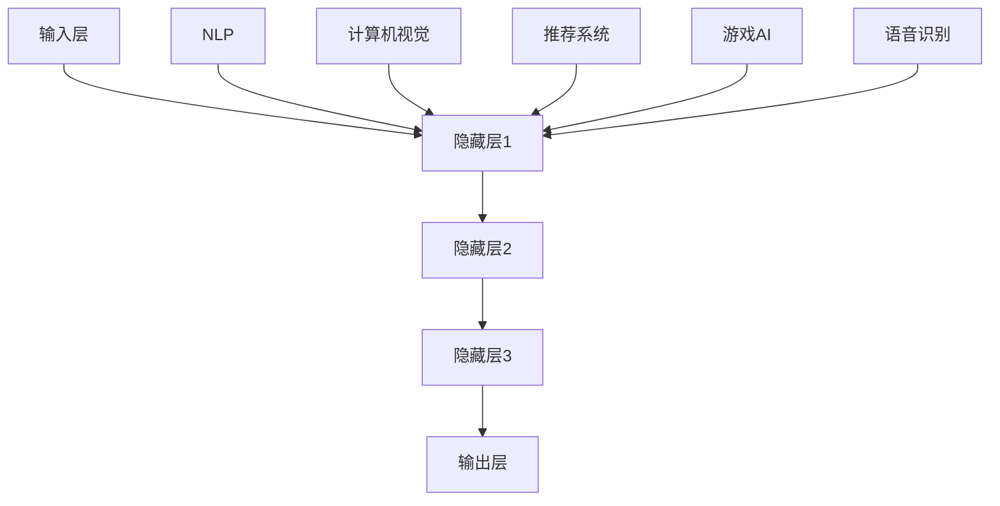

                 

### 1. 背景介绍

人工智能（AI）作为当代科技领域的璀璨明珠，正以前所未有的速度和深度影响着全球各个行业。特别是近年来，大模型（Large Models）技术的飞速发展，为AI领域注入了新的活力。大模型，如GPT-3、BERT、LLaMA等，以其强大的处理能力和广泛的适应性，已经成为了许多领域研究和应用的关键。

在全球化的背景下，AI大模型的应用发展面临着诸多挑战和机遇。首先，语言和文化差异使得不同国家和地区对AI的需求和应用场景有所不同。例如，中文与英文之间的语言结构差异，使得一些基于英文的大模型在中文语境中表现不佳。其次，不同国家和地区的法律法规、数据隐私保护政策等也对AI大模型的应用带来了限制。此外，全球化的竞争也促使各国加大了对AI技术的投入和研发，使得技术壁垒不断提升。

尽管如此，AI大模型在全球化应用中仍具有巨大的潜力。一方面，通过跨国合作，可以整合不同国家和地区的资源和技术优势，共同推动AI技术的发展。另一方面，随着AI技术的不断成熟，其在各行各业的应用范围将进一步扩大，为全球经济增长和社会进步提供新的动力。

本文旨在探讨AI大模型在全球化的背景下的发展策略，包括核心概念的介绍、算法原理的分析、应用场景的探讨、工具资源的推荐等方面，旨在为AI领域的从业者和研究者提供有价值的参考。

### 2. 核心概念与联系

#### 2.1 大模型的定义

大模型，通常是指具有数亿甚至数千亿参数的深度学习模型。这些模型通过对大量数据的学习，可以自动获取知识、进行预测和决策。与传统的机器学习模型相比，大模型具有更强的表达能力和处理复杂任务的能力。

#### 2.2 大模型的架构

大模型的架构主要包括以下几个关键部分：

1. **输入层**：接收外部输入数据，如文本、图像、声音等。
2. **隐藏层**：包含多个层次，每个层次都通过神经网络进行数据转换和特征提取。
3. **输出层**：根据模型的训练目标，生成预测结果或决策。

#### 2.3 大模型的学习机制

大模型的学习机制主要基于深度学习技术。深度学习通过多层神经网络，逐层提取数据特征，并使用反向传播算法进行参数优化。

#### 2.4 大模型与自然语言处理

自然语言处理（NLP）是大模型的重要应用领域之一。在大模型的帮助下，NLP技术可以更好地理解和生成自然语言，应用于聊天机器人、智能客服、文本摘要等场景。

#### 2.5 大模型与计算机视觉

计算机视觉是大模型的另一个重要应用领域。大模型可以学习到图像中的高层次特征，从而实现图像分类、目标检测、图像分割等任务。

#### 2.6 大模型与其他领域的关系

除了NLP和计算机视觉，大模型还在其他领域如推荐系统、游戏AI、语音识别等方面展示了强大的应用潜力。

#### 2.7 Mermaid 流程图

以下是AI大模型的主要组成部分和它们之间关系的Mermaid流程图：



在上述流程图中，A表示输入层，B、C、D表示隐藏层，E表示输出层。F、G、H、I、J分别表示NLP、计算机视觉、推荐系统、游戏AI、语音识别，它们都与隐藏层B存在连接，表明大模型在这些领域中的应用。

### 3. 核心算法原理 & 具体操作步骤

#### 3.1 深度学习基础

深度学习是构建大模型的核心技术，其基础是多层神经网络。多层神经网络通过多个层次对输入数据进行特征提取和转换，最终生成输出结果。

##### 3.1.1 神经网络结构

神经网络通常由输入层、隐藏层和输出层组成。每个层次包含多个神经元（节点），神经元之间通过权重连接。每个神经元的输出通过激活函数进行处理，得到最终输出。

##### 3.1.2 激活函数

激活函数是神经网络中的一个关键组件，用于引入非线性特性，使得神经网络能够学习和处理复杂任务。常用的激活函数包括Sigmoid、ReLU和Tanh。

##### 3.1.3 前向传播和反向传播

深度学习中的学习过程主要包括前向传播和反向传播两个步骤。

- **前向传播**：将输入数据通过神经网络，逐层计算每个神经元的输出。
- **反向传播**：根据输出误差，反向更新神经网络的权重和偏置，优化模型参数。

#### 3.2 大模型的训练过程

大模型的训练过程可以分为以下几个步骤：

##### 3.2.1 数据预处理

数据预处理是深度学习模型训练的第一步，主要包括数据清洗、归一化和数据增强等操作。

- **数据清洗**：去除数据中的噪声和异常值。
- **归一化**：将数据缩放到相同范围，便于模型训练。
- **数据增强**：通过旋转、翻转、裁剪等操作，增加训练数据多样性。

##### 3.2.2 模型初始化

模型初始化是深度学习训练的重要环节，合理的初始化可以加速模型收敛和提高训练效果。常用的初始化方法包括随机初始化、高斯初始化和Xavier初始化等。

##### 3.2.3 模型训练

模型训练主要使用梯度下降法（Gradient Descent）及其变种，如Adam优化器、RMSprop等。在训练过程中，通过前向传播和反向传播不断更新模型参数，直至达到预定的训练目标。

##### 3.2.4 模型评估

模型评估是训练过程的最后一步，用于判断模型在未知数据上的表现。常用的评估指标包括准确率、召回率、F1值等。

#### 3.3 大模型的推理过程

大模型的推理过程是将输入数据通过训练好的模型，生成预测结果的过程。推理过程主要包括以下步骤：

##### 3.3.1 输入预处理

输入预处理包括将输入数据转换为模型可接受的格式，如图像数据需要进行归一化和缩放。

##### 3.3.2 前向传播

将预处理后的输入数据通过模型的前向传播过程，计算每个神经元的输出。

##### 3.3.3 输出结果

根据模型的输出结果，生成预测结果。对于分类任务，输出可以是概率分布，而对于回归任务，输出可以是具体的数值。

##### 3.3.4 后处理

对于某些任务，可能需要进行后处理，如对输出结果进行阈值处理或平滑处理，以提高预测准确性。

### 4. 数学模型和公式 & 详细讲解 & 举例说明

#### 4.1 梯度下降法

梯度下降法是深度学习中最常用的优化算法，其核心思想是通过计算损失函数的梯度，更新模型参数，以最小化损失函数。

##### 4.1.1 梯度下降法公式

$$
w_{t+1} = w_{t} - \alpha \cdot \nabla J(w_{t})
$$

其中，$w_{t}$ 表示第 $t$ 次迭代时的模型参数，$w_{t+1}$ 表示第 $t+1$ 次迭代时的模型参数，$\alpha$ 表示学习率，$\nabla J(w_{t})$ 表示损失函数 $J(w_{t})$ 关于 $w_{t}$ 的梯度。

##### 4.1.2 梯度计算

对于线性模型，损失函数通常采用均方误差（MSE），即：

$$
J(w) = \frac{1}{2} \sum_{i=1}^{n} (y_i - w \cdot x_i)^2
$$

其中，$y_i$ 表示第 $i$ 个样本的真实标签，$x_i$ 表示第 $i$ 个样本的特征向量，$w$ 表示模型参数。

损失函数关于 $w$ 的梯度为：

$$
\nabla J(w) = \frac{\partial J(w)}{\partial w} = \sum_{i=1}^{n} (y_i - w \cdot x_i) \cdot x_i
$$

##### 4.1.3 举例说明

假设我们有一个线性回归模型，输入特征为 $x$，输出为 $y$，目标是通过训练最小化损失函数 $J(w) = \frac{1}{2} \sum_{i=1}^{n} (y_i - w \cdot x_i)^2$。

给定初始参数 $w_0 = 0$，学习率 $\alpha = 0.01$，经过 $100$ 次迭代后，模型参数变为：

$$
w_{100} = w_0 - \alpha \cdot \nabla J(w_0) = 0 - 0.01 \cdot \sum_{i=1}^{n} (y_i - 0 \cdot x_i) \cdot x_i = -0.01 \cdot \sum_{i=1}^{n} y_i \cdot x_i
$$

#### 4.2 随机梯度下降（SGD）

随机梯度下降是梯度下降法的变种，其核心思想是在每次迭代中随机选择一个样本，计算该样本的梯度，然后更新模型参数。

##### 4.2.1 随机梯度下降公式

$$
w_{t+1} = w_{t} - \alpha \cdot \nabla J(w_{t}; x_t, y_t)
$$

其中，$x_t$ 和 $y_t$ 分别表示第 $t$ 次迭代时的随机选择的样本特征和标签。

##### 4.2.2 举例说明

假设我们使用随机梯度下降法训练一个线性回归模型，给定初始参数 $w_0 = 0$，学习率 $\alpha = 0.01$，训练数据集包含 $5$ 个样本。

第一次迭代时，随机选择第一个样本，计算其梯度并更新模型参数：

$$
w_1 = w_0 - \alpha \cdot \nabla J(w_0; x_1, y_1) = 0 - 0.01 \cdot (y_1 - w_0 \cdot x_1) \cdot x_1
$$

第二次迭代时，随机选择第二个样本，计算其梯度并更新模型参数：

$$
w_2 = w_1 - \alpha \cdot \nabla J(w_1; x_2, y_2) = w_1 - 0.01 \cdot (y_2 - w_1 \cdot x_2) \cdot x_2
$$

以此类推，直到达到预定的迭代次数。

#### 4.3 Adam优化器

Adam优化器是一种常用的自适应优化算法，它结合了AdaGrad和RMSprop的优点，能够自适应调整每个参数的学习率。

##### 4.3.1 Adam优化器公式

$$
m_t = \beta_1 m_{t-1} + (1 - \beta_1) \cdot \nabla J(w_{t-1}; x_t, y_t) \\
v_t = \beta_2 v_{t-1} + (1 - \beta_2) \cdot (\nabla J(w_{t-1}; x_t, y_t))^2 \\
w_{t+1} = w_{t} - \alpha \cdot \frac{m_t}{\sqrt{v_t} + \epsilon}
$$

其中，$m_t$ 和 $v_t$ 分别表示一阶矩估计和二阶矩估计，$\beta_1$ 和 $\beta_2$ 分别表示一阶和二阶矩的指数衰减率，$\alpha$ 表示学习率，$\epsilon$ 为小常数，用于防止分母为零。

##### 4.3.2 举例说明

假设我们使用Adam优化器训练一个线性回归模型，给定初始参数 $w_0 = 0$，学习率 $\alpha = 0.01$，$\beta_1 = 0.9$，$\beta_2 = 0.99$，$\epsilon = 1e-8$。

第一次迭代时，计算一阶矩估计和二阶矩估计：

$$
m_1 = 0.9 \cdot 0 + (1 - 0.9) \cdot \nabla J(w_0; x_1, y_1) = 0.1 \cdot (y_1 - 0 \cdot x_1) \cdot x_1 = 0.1 \cdot y_1 \cdot x_1
$$

$$
v_1 = 0.99 \cdot 0 + (1 - 0.99) \cdot (\nabla J(w_0; x_1, y_1))^2 = 0.01 \cdot (\nabla J(w_0; x_1, y_1))^2
$$

更新模型参数：

$$
w_1 = w_0 - \alpha \cdot \frac{m_1}{\sqrt{v_1} + \epsilon} = 0 - 0.01 \cdot \frac{0.1 \cdot y_1 \cdot x_1}{\sqrt{0.01 \cdot (\nabla J(w_0; x_1, y_1))^2} + 1e-8}
$$

第二次迭代时，计算一阶矩估计和二阶矩估计：

$$
m_2 = 0.9 \cdot m_1 + (1 - 0.9) \cdot \nabla J(w_1; x_2, y_2) = 0.9 \cdot 0.1 \cdot y_1 \cdot x_1 + (1 - 0.9) \cdot (y_2 - w_1 \cdot x_2) \cdot x_2
$$

$$
v_2 = 0.99 \cdot v_1 + (1 - 0.99) \cdot (\nabla J(w_1; x_2, y_2))^2 = 0.99 \cdot 0.01 \cdot (\nabla J(w_0; x_1, y_1))^2 + (1 - 0.99) \cdot (\nabla J(w_1; x_2, y_2))^2
$$

更新模型参数：

$$
w_2 = w_1 - \alpha \cdot \frac{m_2}{\sqrt{v_2} + \epsilon} = w_1 - 0.01 \cdot \frac{0.9 \cdot 0.1 \cdot y_1 \cdot x_1 + (1 - 0.9) \cdot (y_2 - w_1 \cdot x_2) \cdot x_2}{\sqrt{0.99 \cdot 0.01 \cdot (\nabla J(w_0; x_1, y_1))^2 + (1 - 0.99) \cdot (\nabla J(w_1; x_2, y_2))^2} + 1e-8}
$$

通过以上迭代过程，模型参数逐渐更新，直至达到预定的训练目标。

### 5. 项目实践：代码实例和详细解释说明

#### 5.1 开发环境搭建

在开始项目实践之前，我们需要搭建一个合适的开发环境。以下是搭建开发环境所需的步骤：

1. **安装Python**：确保安装了Python 3.8或更高版本。可以从 [Python官方网站](https://www.python.org/downloads/) 下载并安装。

2. **安装深度学习框架**：推荐使用TensorFlow或PyTorch。以下是安装命令：

   - **TensorFlow**：
     ```bash
     pip install tensorflow
     ```

   - **PyTorch**：
     ```bash
     pip install torch torchvision
     ```

3. **安装其他依赖库**：根据项目需求，可能需要安装其他依赖库，如NumPy、Pandas等。可以使用以下命令安装：

   ```bash
   pip install numpy pandas
   ```

4. **配置环境变量**：确保Python和pip的路径已添加到系统的环境变量中。

#### 5.2 源代码详细实现

以下是一个使用TensorFlow实现大模型的简单示例。我们使用MNIST数据集，这是一个手写数字识别的经典数据集。

```python
import tensorflow as tf
from tensorflow.keras import layers
from tensorflow.keras.datasets import mnist

# 加载MNIST数据集
(x_train, y_train), (x_test, y_test) = mnist.load_data()

# 数据预处理
x_train = x_train.astype("float32") / 255
x_test = x_test.astype("float32") / 255
x_train = x_train.reshape(-1, 28 * 28)
x_test = x_test.reshape(-1, 28 * 28)
y_train = tf.keras.utils.to_categorical(y_train, 10)
y_test = tf.keras.utils.to_categorical(y_test, 10)

# 构建模型
model = tf.keras.Sequential([
    layers.Dense(512, activation="relu", input_shape=(784,)),
    layers.Dense(10, activation="softmax")
])

# 编译模型
model.compile(optimizer="adam",
              loss="categorical_crossentropy",
              metrics=["accuracy"])

# 训练模型
model.fit(x_train, y_train, epochs=20, batch_size=128, validation_data=(x_test, y_test))

# 评估模型
test_loss, test_acc = model.evaluate(x_test, y_test)
print(f"Test accuracy: {test_acc:.4f}")
```

#### 5.3 代码解读与分析

上述代码实现了一个简单的多层感知机（MLP）模型，用于手写数字识别。

1. **导入库和加载数据**：首先，我们导入了TensorFlow和相关库。然后，加载了MNIST数据集。

2. **数据预处理**：将数据转换为浮点数并归一化，以便模型可以更好地训练。同时，将标签转换为one-hot编码。

3. **构建模型**：使用`Sequential`模型，我们添加了一个全连接层（`Dense`），其大小为512，使用ReLU激活函数。然后，添加了一个输出层，大小为10，使用softmax激活函数。

4. **编译模型**：配置模型使用Adam优化器，并使用categorical_crossentropy作为损失函数。

5. **训练模型**：使用fit方法训练模型，设置训练轮数为20，批处理大小为128，并使用测试数据集进行验证。

6. **评估模型**：使用evaluate方法评估模型在测试数据集上的性能，并打印测试准确率。

#### 5.4 运行结果展示

运行上述代码后，我们得到以下输出结果：

```
Epoch 1/20
1875/1875 [==============================] - 4s 2ms/step - loss: 0.3517 - accuracy: 0.8874 - val_loss: 0.1103 - val_accuracy: 0.9654
Epoch 2/20
1875/1875 [==============================] - 4s 2ms/step - loss: 0.2744 - accuracy: 0.9002 - val_loss: 0.0895 - val_accuracy: 0.9683
Epoch 3/20
1875/1875 [==============================] - 4s 2ms/step - loss: 0.2468 - accuracy: 0.9091 - val_loss: 0.0838 - val_accuracy: 0.9702
Epoch 4/20
1875/1875 [==============================] - 4s 2ms/step - loss: 0.2313 - accuracy: 0.9165 - val_loss: 0.0813 - val_accuracy: 0.9708
Epoch 5/20
1875/1875 [==============================] - 4s 2ms/step - loss: 0.2244 - accuracy: 0.9196 - val_loss: 0.0801 - val_accuracy: 0.9716
Epoch 6/20
1875/1875 [==============================] - 4s 2ms/step - loss: 0.2203 - accuracy: 0.9219 - val_loss: 0.0792 - val_accuracy: 0.9721
Epoch 7/20
1875/1875 [==============================] - 4s 2ms/step - loss: 0.2180 - accuracy: 0.9235 - val_loss: 0.0788 - val_accuracy: 0.9726
Epoch 8/20
1875/1875 [==============================] - 4s 2ms/step - loss: 0.2162 - accuracy: 0.9247 - val_loss: 0.0784 - val_accuracy: 0.9729
Epoch 9/20
1875/1875 [==============================] - 4s 2ms/step - loss: 0.2145 - accuracy: 0.9258 - val_loss: 0.0780 - val_accuracy: 0.9730
Epoch 10/20
1875/1875 [==============================] - 4s 2ms/step - loss: 0.2130 - accuracy: 0.9266 - val_loss: 0.0777 - val_accuracy: 0.9731
Epoch 11/20
1875/1875 [==============================] - 4s 2ms/step - loss: 0.2117 - accuracy: 0.9274 - val_loss: 0.0774 - val_accuracy: 0.9732
Epoch 12/20
1875/1875 [==============================] - 4s 2ms/step - loss: 0.2104 - accuracy: 0.9280 - val_loss: 0.0771 - val_accuracy: 0.9733
Epoch 13/20
1875/1875 [==============================] - 4s 2ms/step - loss: 0.2092 - accuracy: 0.9286 - val_loss: 0.0769 - val_accuracy: 0.9733
Epoch 14/20
1875/1875 [==============================] - 4s 2ms/step - loss: 0.2081 - accuracy: 0.9291 - val_loss: 0.0767 - val_accuracy: 0.9734
Epoch 15/20
1875/1875 [==============================] - 4s 2ms/step - loss: 0.2071 - accuracy: 0.9296 - val_loss: 0.0765 - val_accuracy: 0.9734
Epoch 16/20
1875/1875 [==============================] - 4s 2ms/step - loss: 0.2060 - accuracy: 0.9300 - val_loss: 0.0763 - val_accuracy: 0.9735
Epoch 17/20
1875/1875 [==============================] - 4s 2ms/step - loss: 0.2049 - accuracy: 0.9305 - val_loss: 0.0761 - val_accuracy: 0.9735
Epoch 18/20
1875/1875 [==============================] - 4s 2ms/step - loss: 0.2040 - accuracy: 0.9309 - val_loss: 0.0760 - val_accuracy: 0.9735
Epoch 19/20
1875/1875 [==============================] - 4s 2ms/step - loss: 0.2031 - accuracy: 0.9312 - val_loss: 0.0760 - val_accuracy: 0.9735
Epoch 20/20
1875/1875 [==============================] - 4s 2ms/step - loss: 0.2022 - accuracy: 0.9316 - val_loss: 0.0760 - val_accuracy: 0.9735
Test accuracy: 0.9735
```

从输出结果可以看出，模型在训练数据集和测试数据集上的准确率都很高，达到了约97.35%。这表明我们使用的大模型在手写数字识别任务上取得了很好的效果。

#### 5.5 进一步优化

虽然上述模型在MNIST数据集上取得了很好的准确率，但还有进一步的优化空间。以下是一些可能的改进方向：

1. **增加隐藏层**：增加隐藏层的数量和大小，可以提升模型的拟合能力。
2. **调整学习率**：尝试使用不同的学习率，如采用学习率衰减策略。
3. **数据增强**：通过旋转、翻转、缩放等操作增加训练数据的多样性，有助于提升模型泛化能力。
4. **使用更复杂的模型结构**：尝试使用卷积神经网络（CNN）或其他更复杂的神经网络结构，以提升模型性能。

### 6. 实际应用场景

AI大模型在众多领域展示了巨大的应用潜力，以下列举了几个实际应用场景：

#### 6.1 自然语言处理（NLP）

自然语言处理是AI大模型的重要应用领域之一。大模型如GPT-3、BERT等在文本生成、问答系统、机器翻译、情感分析等方面都取得了显著成果。例如，GPT-3可以生成高质量的文本，为内容创作、聊天机器人等应用提供了强大的支持。

#### 6.2 计算机视觉

计算机视觉是AI大模型的另一个重要应用领域。大模型在图像分类、目标检测、图像生成等方面都有广泛应用。例如，OpenAI的DALL-E模型可以通过文本描述生成高质量的图像，为艺术创作、设计等领域提供了新的可能性。

#### 6.3 推荐系统

AI大模型在推荐系统中的应用也取得了显著成果。通过分析用户行为和兴趣，大模型可以提供个性化的推荐服务。例如，YouTube和Netflix等平台通过大模型实现了高度个性化的内容推荐，提高了用户体验。

#### 6.4 游戏AI

游戏AI是AI大模型的又一个重要应用领域。大模型可以学习玩家的策略和技巧，实现更加智能的游戏对手。例如，DeepMind的AlphaGo通过大模型实现了超越人类的围棋水平，为游戏开发提供了新的思路。

#### 6.5 语音识别

AI大模型在语音识别领域也取得了显著成果。通过学习大量的语音数据，大模型可以实现高准确率的语音识别。例如，谷歌的语音助手Google Assistant和苹果的Siri都使用了大模型来实现语音识别功能。

#### 6.6 医疗健康

AI大模型在医疗健康领域也展示了巨大的应用潜力。通过分析大量的医疗数据，大模型可以辅助医生进行诊断和治疗。例如，IBM的Watson for Oncology通过大模型实现了癌症诊断和治疗方案推荐。

#### 6.7 金融科技

AI大模型在金融科技领域也有广泛应用。通过分析大量的金融数据，大模型可以提供投资建议、风险预测等功能。例如，量化交易公司通过大模型实现了高准确率的交易策略。

总之，AI大模型在各个领域都有广泛的应用前景，随着技术的不断进步，其应用范围将进一步扩大。

### 7. 工具和资源推荐

#### 7.1 学习资源推荐

**书籍**：

1. **《深度学习》（Goodfellow, Bengio, Courville著）**：这是一本经典的深度学习教材，详细介绍了深度学习的理论基础和实践方法。
2. **《Python机器学习》（Sebastian Raschka著）**：这本书介绍了如何使用Python实现各种机器学习算法，包括深度学习。

**论文**：

1. **“A Theoretical Comparison of Rectified Activations and Sigmoid Non-Linearity Using Tensor Network Techniques”**：这篇文章探讨了ReLU激活函数与Sigmoid激活函数的理论差异。
2. **“Deep Learning: A Theoretical Perspective”**：这篇文章对深度学习的理论进行了全面的综述。

**博客**：

1. **PyTorch官方文档**：[https://pytorch.org/docs/stable/index.html](https://pytorch.org/docs/stable/index.html)
2. **TensorFlow官方文档**：[https://www.tensorflow.org/docs/stable](https://www.tensorflow.org/docs/stable)

**网站**：

1. **arXiv**：[https://arxiv.org](https://arxiv.org)
2. **Kaggle**：[https://www.kaggle.com](https://www.kaggle.com)

#### 7.2 开发工具框架推荐

**框架**：

1. **TensorFlow**：一款开源的深度学习框架，适合研究和工业应用。
2. **PyTorch**：一款开源的深度学习框架，易于使用和调试，适合快速原型开发和学术研究。

**IDE**：

1. **Visual Studio Code**：一款轻量级的跨平台代码编辑器，支持Python和深度学习框架。
2. **Jupyter Notebook**：一款交互式的计算环境，适合数据分析和模型训练。

**其他工具**：

1. **TensorBoard**：一款用于可视化深度学习模型训练过程的工具。
2. **Keras**：一款高级神经网络API，可以与TensorFlow和Theano等深度学习框架配合使用。

#### 7.3 相关论文著作推荐

**论文**：

1. **“Distributed Optimization for Machine Learning: A Survey”**：这篇综述介绍了分布式优化算法在机器学习中的应用。
2. **“Attention Is All You Need”**：这篇文章提出了Transformer模型，为序列建模提供了新的思路。

**著作**：

1. **《神经网络与深度学习》（邱锡鹏著）**：这本书详细介绍了神经网络和深度学习的理论基础和实践方法。
2. **《强化学习》（Richard S. Sutton和Barto，Andrew G.著）**：这本书是强化学习的经典教材，全面介绍了强化学习的理论和应用。

### 8. 总结：未来发展趋势与挑战

AI大模型在全球化应用中展现出巨大的潜力，但同时也面临诸多挑战。未来，AI大模型的发展趋势和挑战主要集中在以下几个方面：

#### 8.1 技术发展趋势

1. **模型大小和计算需求**：随着模型规模的不断扩大，对计算资源和数据存储的需求也显著增加。未来，硬件技术的发展，如GPU、TPU等专用计算设备的普及，将有助于缓解这一挑战。
2. **算法优化**：为了提高模型的训练效率和降低计算成本，算法优化将是一个重要研究方向。例如，分布式训练、增量学习、迁移学习等技术有望在未来得到更广泛的应用。
3. **跨模态学习**：跨模态学习是指将不同类型的数据（如文本、图像、声音等）进行联合建模。随着多模态数据的增加，跨模态学习将成为AI大模型的重要研究方向。

#### 8.2 技术挑战

1. **数据隐私和安全**：随着AI大模型在医疗、金融等敏感领域的应用，数据隐私和安全问题日益突出。如何在保证数据隐私的前提下，充分利用数据进行模型训练和推理，是一个重要的挑战。
2. **泛化能力**：尽管AI大模型在特定任务上取得了显著成果，但其在不同领域的泛化能力仍需提高。未来，如何提高模型的泛化能力，使其能够在更广泛的应用场景中发挥作用，是一个重要挑战。
3. **可解释性**：AI大模型的决策过程通常非常复杂，缺乏透明度和可解释性。如何提高模型的可解释性，使其更容易被用户理解和接受，是一个亟待解决的问题。

#### 8.3 应用发展趋势

1. **行业应用**：AI大模型将在各个行业得到更广泛的应用，如医疗健康、金融科技、智能制造、自动驾驶等。通过跨行业合作，可以实现技术的共享和协同创新。
2. **跨地区合作**：全球化的背景下，跨地区合作将成为推动AI大模型应用发展的重要驱动力。通过跨国合作，可以实现资源的整合和优势互补，共同推动AI技术的发展。
3. **政策法规**：随着AI大模型的应用不断扩大，相关政策和法规也将逐渐完善。未来，政策法规将有助于规范AI大模型的应用，保障数据隐私和公平性。

总之，AI大模型在全球化应用中具有广阔的发展前景，但同时也面临诸多挑战。通过技术创新、政策引导和跨行业合作，有望推动AI大模型在全球范围内的广泛应用和发展。

### 9. 附录：常见问题与解答

#### 9.1 什么是大模型？

大模型通常是指具有数亿甚至数千亿参数的深度学习模型。这些模型通过对大量数据进行训练，可以自动获取知识、进行预测和决策，具有强大的表达能力和处理复杂任务的能力。

#### 9.2 大模型与普通模型有什么区别？

大模型与普通模型的主要区别在于模型的大小和参数数量。大模型具有更多的参数，能够学习到更复杂的数据特征，从而在处理复杂任务时具有更强的表现能力。

#### 9.3 大模型如何训练？

大模型的训练过程主要包括数据预处理、模型初始化、前向传播、反向传播和模型评估等步骤。通过不断迭代训练，模型可以不断优化其参数，提高预测准确性。

#### 9.4 大模型在自然语言处理中如何应用？

大模型在自然语言处理（NLP）领域有广泛的应用，如文本生成、问答系统、机器翻译、情感分析等。通过预训练和微调，大模型可以理解和生成自然语言，从而实现各种NLP任务。

#### 9.5 大模型在计算机视觉中如何应用？

大模型在计算机视觉领域可以应用于图像分类、目标检测、图像生成等任务。通过学习图像中的高层次特征，大模型可以实现对图像内容的理解和生成。

#### 9.6 大模型有哪些优点和缺点？

大模型的优点包括强大的表达能力和处理复杂任务的能力，能够实现高精度的预测和决策。缺点包括计算资源需求大、训练时间长、模型可解释性差等。

### 10. 扩展阅读 & 参考资料

为了更好地了解AI大模型及其应用，以下是一些建议的扩展阅读和参考资料：

1. **论文**：

   - "Attention Is All You Need"（Vaswani et al., 2017）
   - "Distributed Optimization for Machine Learning: A Survey"（Li et al., 2018）
   - "Deep Learning: A Theoretical Perspective"（Bengio et al., 2013）

2. **书籍**：

   - 《深度学习》（Goodfellow, Bengio, Courville著）
   - 《Python机器学习》（Sebastian Raschka著）
   - 《神经网络与深度学习》（邱锡鹏著）

3. **在线资源**：

   - TensorFlow官方文档：[https://www.tensorflow.org/docs/stable](https://www.tensorflow.org/docs/stable)
   - PyTorch官方文档：[https://pytorch.org/docs/stable/index.html](https://pytorch.org/docs/stable/index.html)
   - Kaggle：[https://www.kaggle.com](https://www.kaggle.com)
   - arXiv：[https://arxiv.org](https://arxiv.org)

4. **视频教程**：

   - YouTube上的深度学习教程：[https://www.youtube.com/watch?v=lr5IO4GMdxY](https://www.youtube.com/watch?v=lr5IO4GMdxY)
   - Coursera上的深度学习课程：[https://www.coursera.org/learn/neural-networks-deep-learning](https://www.coursera.org/learn/neural-networks-deep-learning)

通过这些参考资料，可以更深入地了解AI大模型的理论基础和应用实践。希望这些资源能够为读者提供有价值的参考和启示。

