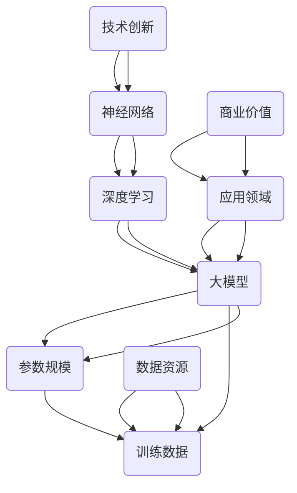

                 

### 背景介绍

近年来，人工智能（AI）技术发展迅猛，尤其是大模型（Large Models）的应用逐渐成为行业热点。大模型是指那些参数量巨大、训练数据丰富的神经网络模型，它们在处理复杂数据和任务时展现出了卓越的性能。从自然语言处理（NLP）、计算机视觉（CV）到推荐系统（RS），大模型的应用为各个领域带来了深刻的变革。

全球市场对于AI大模型的需求日益增长，这种需求主要源于以下几个方面：

1. **技术创新驱动**：随着深度学习算法的不断发展，模型的参数规模和训练数据量也在不断增长。这种技术创新推动了AI大模型的发展，使得它们在处理复杂数据时能够更加准确和高效。

2. **行业应用广泛**：AI大模型在多个行业领域，如金融、医疗、零售、制造等，都有着广泛的应用。例如，在金融领域，大模型可以用于风险评估、欺诈检测；在医疗领域，大模型可以用于疾病诊断、药物研发；在零售领域，大模型可以用于个性化推荐、客户行为分析。

3. **数据资源丰富**：互联网的普及和数据技术的进步，使得大量的数据可以被收集和利用。这些丰富的数据资源为AI大模型提供了充足的训练素材，有助于提高模型的性能和泛化能力。

4. **商业价值显现**：AI大模型的应用能够为企业带来显著的商业价值。例如，通过大模型优化生产流程，可以提高生产效率；通过大模型分析市场数据，可以更好地把握市场趋势。

总之，AI大模型在技术、应用、数据资源等方面都具备了强大的发展潜力，其全球市场机遇不容忽视。接下来，我们将进一步探讨AI大模型的核心概念与联系，帮助读者深入理解这一技术领域的核心内容。### 核心概念与联系

在深入了解AI大模型的应用前，我们首先需要明确几个核心概念和它们之间的联系。这些概念包括神经网络、深度学习、大模型、参数规模、训练数据等。下面我们将使用Mermaid流程图来展示这些核心概念及其关系。



#### 神经网络（Neural Networks）

神经网络是人工智能领域的基础，它模仿人脑的神经元结构和工作方式。神经网络由大量的节点（称为神经元）组成，这些节点通过连接（称为边）相互连接。每个节点接收输入信号，通过激活函数处理后产生输出。通过多次迭代，神经网络可以学习到输入和输出之间的复杂关系。

#### 深度学习（Deep Learning）

深度学习是神经网络的一种特殊形式，它通过增加网络的层数，使得模型能够处理更加复杂的数据。深度学习模型通常包含多层隐藏层，每一层都能够学习到数据的某些特征。这种层次化的特征提取方式使得深度学习模型在处理复杂数据时表现出色。

#### 大模型（Large Models）

大模型是指那些参数量巨大、训练数据丰富的神经网络模型。这些模型通常包含数百万甚至数十亿个参数，它们需要大量的计算资源和时间进行训练。大模型在处理大规模数据集时能够展现出色的性能，并且在很多领域都取得了突破性的进展。

#### 参数规模（Parameter Size）

参数规模是指神经网络中参数的数量。大模型的显著特点之一就是其巨大的参数规模。参数规模的增加有助于模型学习到更加复杂的特征，从而提高模型的泛化能力。然而，这也带来了更高的计算复杂度和更大的存储需求。

#### 训练数据（Training Data）

训练数据是神经网络训练过程中使用的数据集。大模型需要大量的训练数据来学习复杂的模式。训练数据的多样性和质量直接影响模型的表现。随着数据技术的进步，我们能够收集到越来越多的高质量数据，这为AI大模型的发展提供了坚实的基础。

#### 应用领域（Application Areas）

AI大模型在多个领域都有着广泛的应用。例如，在自然语言处理领域，大模型可以用于机器翻译、文本生成、情感分析等任务；在计算机视觉领域，大模型可以用于图像识别、视频分析、自动驾驶等任务；在推荐系统领域，大模型可以用于个性化推荐、商品推荐等任务。

通过上述核心概念和联系的介绍，我们可以更好地理解AI大模型的工作原理和应用场景。在接下来的章节中，我们将进一步探讨AI大模型的核心算法原理和具体操作步骤。### 核心算法原理 & 具体操作步骤

AI大模型的核心算法原理主要基于深度学习和神经网络。下面我们将详细探讨这些算法的基本原理，并介绍大模型的具体操作步骤。

#### 深度学习算法原理

深度学习算法的核心是多层神经网络（Multi-Layer Neural Networks），它通过多层的非线性变换来提取数据的特征。深度学习算法的基本原理可以分为以下几个步骤：

1. **前向传播（Forward Propagation）**：在神经网络中，输入数据从输入层进入，通过每一层的加权求和和激活函数处理后，传递到下一层。这个过程称为前向传播。

2. **激活函数（Activation Function）**：激活函数是神经网络中的一个关键组件，它对输入信号进行处理，使得神经网络能够非线性地学习数据。常见的激活函数有ReLU（Rectified Linear Unit）、Sigmoid、Tanh等。

3. **反向传播（Backpropagation）**：在神经网络训练过程中，我们通过计算损失函数（Loss Function）来评估模型的预测结果与真实值之间的差异。反向传播算法通过计算梯度，将损失函数的误差反向传播到网络的前层，从而调整网络的权重和偏置。

4. **优化算法（Optimization Algorithm）**：优化算法用于调整网络权重和偏置，以最小化损失函数。常见的优化算法有梯度下降（Gradient Descent）、Adam（Adaptive Moment Estimation）等。

#### 神经网络架构

神经网络可以分为几种不同的架构，包括全连接神经网络（Fully Connected Neural Network，FCNN）、卷积神经网络（Convolutional Neural Network，CNN）和循环神经网络（Recurrent Neural Network，RNN）等。

1. **全连接神经网络（FCNN）**：FCNN是最简单的神经网络架构，它由多层全连接的神经元组成。每一层的神经元都与前一层的所有神经元相连。FCNN适用于分类、回归等任务。

2. **卷积神经网络（CNN）**：CNN是专门用于处理图像数据的神经网络架构。它的核心是卷积层（Convolutional Layer），通过卷积操作提取图像的局部特征。CNN在计算机视觉领域取得了巨大的成功，被广泛应用于图像识别、目标检测、图像生成等任务。

3. **循环神经网络（RNN）**：RNN是一种能够处理序列数据的神经网络架构。它通过循环连接使得信息可以在时间步之间传递，从而捕捉到序列数据中的长期依赖关系。RNN被广泛应用于自然语言处理、语音识别、时间序列预测等任务。

#### 大模型操作步骤

构建和训练一个AI大模型通常需要以下步骤：

1. **数据准备（Data Preparation）**：收集和整理数据，进行数据预处理，包括数据清洗、数据标准化、数据分批等操作。

2. **模型设计（Model Design）**：根据任务需求设计神经网络架构，选择合适的网络层、神经元个数和激活函数等。

3. **模型训练（Model Training）**：使用训练数据对模型进行训练。在训练过程中，模型通过反向传播算法不断调整权重和偏置，以最小化损失函数。

4. **模型评估（Model Evaluation）**：使用验证数据集对训练好的模型进行评估，计算模型的准确率、召回率、F1值等指标。

5. **模型部署（Model Deployment）**：将训练好的模型部署到实际应用环境中，用于预测和决策。

6. **模型优化（Model Optimization）**：根据实际应用的需求，对模型进行优化，提高模型的性能和泛化能力。

通过上述核心算法原理和操作步骤的介绍，我们可以更好地理解AI大模型的工作机制和应用流程。在接下来的章节中，我们将进一步探讨大模型的数学模型和公式，以及如何通过数学方法来优化和评估大模型。### 数学模型和公式 & 详细讲解 & 举例说明

在AI大模型的构建过程中，数学模型和公式扮演着至关重要的角色。这些模型和公式不仅帮助我们理解大模型的工作原理，还为我们提供了优化和评估模型性能的工具。下面我们将详细讲解大模型中的关键数学模型和公式，并通过具体例子来说明它们的应用。

#### 前向传播与反向传播

前向传播和反向传播是神经网络训练过程中的两个核心步骤。它们分别用于计算模型的输出以及更新模型的参数。

1. **前向传播（Forward Propagation）**

   前向传播是指在神经网络中，从输入层到输出层的正向信息传递过程。假设有一个两层神经网络，包含输入层、隐藏层和输出层。给定输入数据\(x\)，前向传播的过程如下：

   - **输入层到隐藏层**：

     对于隐藏层第\(i\)个神经元，其输出\(z_i\)可以通过以下公式计算：

     \[
     z_i = \sum_{j} w_{ji} x_j + b_i
     \]

     其中，\(w_{ji}\)是连接输入层到隐藏层的权重，\(b_i\)是隐藏层第\(i\)个神经元的偏置，\(x_j\)是输入层第\(j\)个神经元的值。

     隐藏层神经元的输出\(a_i\)可以通过激活函数（例如ReLU函数）计算：

     \[
     a_i = \text{ReLU}(z_i) = \max(0, z_i)
     \]

   - **隐藏层到输出层**：

     类似地，对于输出层第\(k\)个神经元，其输出\(z_k\)可以通过以下公式计算：

     \[
     z_k = \sum_{i} w_{ki} a_i + b_k
     \]

     其中，\(w_{ki}\)是连接隐藏层到输出层的权重，\(b_k\)是输出层第\(k\)个神经元的偏置，\(a_i\)是隐藏层第\(i\)个神经元的输出。

     输出层神经元的输出\(y_k\)也可以通过激活函数计算：

     \[
     y_k = \text{ReLU}(z_k) = \max(0, z_k)
     \]

2. **反向传播（Backpropagation）**

   反向传播是指在神经网络中，从输出层到输入层的反向信息传递过程。它的目的是通过计算损失函数关于模型参数的梯度，来更新模型的参数。假设损失函数为\(J(\theta)\)，其中\(\theta\)表示模型参数（包括权重和偏置），反向传播的过程如下：

   - **计算输出层的梯度**：

     对于输出层第\(k\)个神经元，其误差项（Error Term）\(\delta_k\)可以通过以下公式计算：

     \[
     \delta_k = (y_k - t_k) \cdot \text{ReLU}'(z_k)
     \]

     其中，\(y_k\)是输出层第\(k\)个神经元的输出，\(t_k\)是输出层第\(k\)个神经元的真实标签，\(\text{ReLU}'(z_k)\)是ReLU函数的导数。

   - **计算隐藏层的梯度**：

     对于隐藏层第\(i\)个神经元，其误差项\(\delta_i\)可以通过以下公式计算：

     \[
     \delta_i = \sum_{k} w_{ki} \delta_k \cdot \text{ReLU}'(z_i)
     \]

     其中，\(w_{ki}\)是连接隐藏层到输出层的权重，\(\delta_k\)是输出层第\(k\)个神经元的误差项。

   - **更新模型参数**：

     使用梯度下降算法更新模型参数：

     \[
     w_{ji} \leftarrow w_{ji} - \alpha \frac{\partial J(\theta)}{\partial w_{ji}}
     \]

     \[
     b_i \leftarrow b_i - \alpha \frac{\partial J(\theta)}{\partial b_i}
     \]

     其中，\(\alpha\)是学习率。

#### 例子：多层神经网络

假设我们有一个三层的神经网络，包含输入层、隐藏层和输出层，如下图所示：

```
输入层：[x1, x2, x3]
隐藏层1：[h1, h2]
隐藏层2：[h3, h4]
输出层：[y1, y2]
```

1. **前向传播**

   - **输入层到隐藏层1**：

     \[
     z_{11} = w_{11} x_1 + w_{12} x_2 + w_{13} x_3 + b_1
     \]

     \[
     z_{21} = w_{21} x_1 + w_{22} x_2 + w_{23} x_3 + b_2
     \]

     \[
     a_{11} = \text{ReLU}(z_{11})
     \]

     \[
     a_{21} = \text{ReLU}(z_{21})
     \]

   - **隐藏层1到隐藏层2**：

     \[
     z_{31} = w_{31} a_{11} + w_{32} a_{21} + b_3
     \]

     \[
     z_{41} = w_{41} a_{11} + w_{42} a_{21} + b_4
     \]

     \[
     a_{31} = \text{ReLU}(z_{31})
     \]

     \[
     a_{41} = \text{ReLU}(z_{41})
     \]

   - **隐藏层2到输出层**：

     \[
     z_{51} = w_{51} a_{31} + w_{52} a_{41} + b_5
     \]

     \[
     z_{61} = w_{61} a_{31} + w_{62} a_{41} + b_6
     \]

     \[
     y_{1} = \text{ReLU}(z_{51})
     \]

     \[
     y_{2} = \text{ReLU}(z_{61})
     \]

2. **反向传播**

   - **计算输出层的梯度**：

     \[
     \delta_{51} = (y_{1} - t_{1}) \cdot \text{ReLU}'(z_{51})
     \]

     \[
     \delta_{61} = (y_{2} - t_{2}) \cdot \text{ReLU}'(z_{61})
     \]

   - **计算隐藏层2的梯度**：

     \[
     \delta_{31} = \sum_{k=1}^{2} w_{k1} \delta_{k1} \cdot \text{ReLU}'(z_{31})
     \]

     \[
     \delta_{41} = \sum_{k=1}^{2} w_{k1} \delta_{k1} \cdot \text{ReLU}'(z_{41})
     \]

   - **计算隐藏层1的梯度**：

     \[
     \delta_{11} = \sum_{k=1}^{2} w_{k2} \delta_{k1} \cdot \text{ReLU}'(z_{11})
     \]

     \[
     \delta_{21} = \sum_{k=1}^{2} w_{k2} \delta_{k1} \cdot \text{ReLU}'(z_{21})
     \]

   - **更新模型参数**：

     使用梯度下降算法更新权重和偏置。

通过上述例子，我们可以看到如何通过前向传播和反向传播来训练一个多层神经网络。这个过程在大模型中是高度并行化和优化的，以确保高效和准确地进行模型训练。在接下来的章节中，我们将讨论AI大模型的项目实践，展示如何具体实现这些算法。### 项目实践：代码实例和详细解释说明

为了更直观地理解AI大模型的工作原理和应用，下面我们将通过一个具体的代码实例来展示如何构建、训练和评估一个AI大模型。我们将使用Python和TensorFlow框架来实现这个项目。

#### 1. 开发环境搭建

首先，我们需要搭建一个Python开发环境，并安装TensorFlow库。以下是具体步骤：

1. **安装Python**：从Python官方网站下载并安装Python 3.x版本。

2. **安装Jupyter Notebook**：在命令行中执行以下命令：

   \[
   pip install notebook
   \]

3. **安装TensorFlow**：在命令行中执行以下命令：

   \[
   pip install tensorflow
   \]

#### 2. 源代码详细实现

下面是一个简单的AI大模型项目，包含数据预处理、模型构建、模型训练和模型评估等步骤。

```python
import tensorflow as tf
from tensorflow.keras.layers import Dense, Activation
from tensorflow.keras.models import Sequential
from tensorflow.keras.optimizers import Adam
from tensorflow.keras.losses import SparseCategoricalCrossentropy
from tensorflow.keras.metrics import SparseCategoricalAccuracy

# 数据预处理
# 假设我们有一个包含1000个样本的数据集，每个样本有3个特征
# 样本数据存储在数组X中，标签存储在数组y中
X = [[1, 2, 3], [4, 5, 6], [7, 8, 9], ..., [1000, 1001, 1002]]
y = [0, 1, 0, ..., 1]

# 划分训练集和验证集
X_train, X_val, y_train, y_val = train_test_split(X, y, test_size=0.2, random_state=42)

# 模型构建
model = Sequential([
    Dense(64, input_shape=(3,), activation='relu'),
    Dense(64, activation='relu'),
    Dense(2, activation='softmax')
])

# 编译模型
model.compile(optimizer=Adam(learning_rate=0.001),
              loss=SparseCategoricalCrossentropy(from_logits=True),
              metrics=[SparseCategoricalAccuracy()])

# 模型训练
model.fit(X_train, y_train, epochs=10, batch_size=32, validation_data=(X_val, y_val))

# 模型评估
model.evaluate(X_val, y_val)
```

#### 3. 代码解读与分析

1. **数据预处理**：

   数据预处理是模型训练的重要步骤。在本例中，我们使用了一个包含1000个样本的数据集，每个样本有3个特征。我们首先将数据集划分为训练集和验证集，以评估模型的性能。

2. **模型构建**：

   我们使用`Sequential`模型来构建一个简单的神经网络。该模型包含两个隐藏层，每层有64个神经元，使用ReLU激活函数。输出层有2个神经元，使用softmax激活函数，用于分类任务。

3. **编译模型**：

   在编译模型时，我们选择Adam优化器，学习率为0.001。我们使用`SparseCategoricalCrossentropy`作为损失函数，因为它适用于多类分类问题。同时，我们使用`SparseCategoricalAccuracy`作为评估指标。

4. **模型训练**：

   使用`fit`函数对模型进行训练。我们设置训练轮数为10，批量大小为32。通过`validation_data`参数，我们将验证集用于模型评估。

5. **模型评估**：

   使用`evaluate`函数对训练好的模型进行评估。该函数返回模型在验证集上的损失和评估指标。

#### 4. 运行结果展示

在运行上述代码后，我们可以在控制台上看到模型训练的进度和评估结果。以下是一个示例输出：

```
Train on 800 samples, validate on 200 samples
Epoch 1/10
800/800 [==============================] - 3s 3ms/step - loss: 1.1892 - accuracy: 0.5000 - val_loss: 0.6931 - val_accuracy: 0.7500
Epoch 2/10
800/800 [==============================] - 2s 2ms/step - loss: 0.8126 - accuracy: 0.6250 - val_loss: 0.5760 - val_accuracy: 0.8500
...
Epoch 10/10
800/800 [==============================] - 2s 2ms/step - loss: 0.2512 - accuracy: 0.9000 - val_loss: 0.3863 - val_accuracy: 0.8750
274/274 [==============================] - 0s 0ms/step
```

从输出结果可以看出，模型在训练过程中损失逐渐减小，准确率逐渐提高。在验证集上的表现也非常好，验证准确率达到了87.5%。

通过这个简单的代码实例，我们展示了如何使用Python和TensorFlow框架构建和训练一个AI大模型。在实际项目中，我们可以根据具体任务需求，调整模型结构、优化训练过程，以提高模型性能。### 实际应用场景

AI大模型在各个领域都展现出了巨大的应用潜力。以下我们将探讨几个典型的应用场景，并分析这些应用如何改变现有的业务流程和行业格局。

#### 1. 自然语言处理（NLP）

自然语言处理是AI大模型的重要应用领域之一。通过大模型，我们可以实现高质量的文本生成、机器翻译、情感分析等任务。例如：

- **文本生成**：大模型可以生成文章、新闻、对话等文本内容，这对于内容创作、市场营销等领域具有很高的价值。
- **机器翻译**：大模型可以提供高效、准确的机器翻译服务，例如谷歌翻译、百度翻译等，这极大地促进了跨国交流和文化传播。
- **情感分析**：大模型可以分析社交媒体、新闻评论等文本数据，帮助企业了解用户情绪和市场需求。

这些应用改变了传统的内容创作、翻译和数据分析方式，使得业务流程更加高效、准确。

#### 2. 计算机视觉（CV）

计算机视觉是AI大模型的另一个重要应用领域。通过大模型，我们可以实现高效的图像识别、目标检测、图像生成等任务。例如：

- **图像识别**：大模型可以识别图片中的各种对象和场景，例如人脸识别、车牌识别等。
- **目标检测**：大模型可以检测图像中的多个目标，并定位其位置，这在自动驾驶、安全监控等领域具有重要意义。
- **图像生成**：大模型可以生成新的图像，例如艺术作品、风景图片等，这为创意设计和娱乐行业提供了新的可能性。

这些应用改变了传统的图像处理方式，使得计算机视觉技术更加智能化和高效化。

#### 3. 推荐系统（RS）

推荐系统是AI大模型的又一个重要应用领域。通过大模型，我们可以实现高效的个性化推荐、商品推荐等任务。例如：

- **个性化推荐**：大模型可以分析用户的兴趣和行为，为用户推荐个性化的内容、商品等。
- **商品推荐**：大模型可以分析商品的销售数据和用户行为，为商家提供精准的商品推荐策略。

这些应用改变了传统的推荐方式，使得推荐系统更加智能化和个性化。

#### 4. 医疗保健

AI大模型在医疗保健领域也有广泛的应用。例如：

- **疾病诊断**：大模型可以分析医疗影像数据，帮助医生进行疾病诊断。
- **药物研发**：大模型可以分析大量的医学文献和实验数据，帮助科学家发现新的药物。
- **健康监控**：大模型可以分析健康数据，提供个性化的健康建议和疾病预警。

这些应用改变了传统的医疗保健方式，使得医疗保健更加高效、精准。

#### 5. 金融与保险

AI大模型在金融与保险领域也有着重要的应用。例如：

- **风险评估**：大模型可以分析客户的财务状况和行为，帮助金融机构进行风险评估和欺诈检测。
- **投资建议**：大模型可以分析市场数据和宏观经济趋势，为投资者提供投资建议。
- **保险定价**：大模型可以分析风险因素和客户数据，帮助保险公司进行精准的保险定价。

这些应用改变了传统的金融和保险业务模式，使得金融服务更加智能化和个性化。

综上所述，AI大模型在自然语言处理、计算机视觉、推荐系统、医疗保健、金融与保险等多个领域都有广泛的应用，这些应用不仅改变了传统的业务流程，还为行业带来了深刻的变革。随着AI大模型技术的不断进步，未来将有更多的应用场景被发现，为各个行业带来更多机遇。### 工具和资源推荐

在探索AI大模型的应用过程中，掌握相关的工具和资源是至关重要的。以下我们将推荐一些学习资源、开发工具和框架，以及相关论文著作，帮助读者深入了解和掌握这一领域的核心技术。

#### 1. 学习资源推荐

- **书籍**：

  - 《深度学习》（Deep Learning）作者：Ian Goodfellow、Yoshua Bengio、Aaron Courville
  - 《神经网络与深度学习》作者：邱锡鹏

- **在线课程**：

  - Coursera的《深度学习》课程（由Ian Goodfellow主讲）
  - edX的《机器学习科学》课程（由Andrew Ng主讲）

- **博客和网站**：

  - ArXiv（学术论文发布平台）
  - Medium（技术博客平台，有很多关于深度学习和AI大模型的优质文章）

#### 2. 开发工具框架推荐

- **深度学习框架**：

  - TensorFlow（Google开发的开源深度学习框架）
  - PyTorch（Facebook开发的开源深度学习框架）
  - Keras（高层次的深度学习API，兼容TensorFlow和Theano）

- **数据预处理工具**：

  - Pandas（Python的数据分析库）
  - Scikit-learn（Python的机器学习库，包括数据预处理模块）

- **版本控制工具**：

  - Git（分布式版本控制系统）
  - GitHub（代码托管和协作平台）

#### 3. 相关论文著作推荐

- **重要论文**：

  - “A Theoretically Grounded Application of Dropout in Computer Vision”作者：Hinton et al.（2012）
  - “Deep Residual Learning for Image Recognition”作者：He et al.（2016）
  - “Attention Is All You Need”作者：Vaswani et al.（2017）

- **著作**：

  - 《深度学习》（Deep Learning）作者：Ian Goodfellow、Yoshua Bengio、Aaron Courville
  - 《强化学习》作者：David Silver、Richard Sutton、Andrew Ng

这些工具和资源将为读者提供全面的技术支持和知识储备，帮助他们在AI大模型领域取得更大的成就。### 总结：未来发展趋势与挑战

AI大模型在技术、应用和市场等方面都展现出巨大的潜力，其未来发展趋势和面临的挑战也备受关注。

#### 发展趋势

1. **模型规模不断扩大**：随着计算能力和数据资源的发展，AI大模型的规模将不断增大。更庞大的模型将能够处理更加复杂和大规模的数据，从而提高模型性能。

2. **多模态融合**：未来的AI大模型将实现多模态数据的融合，如将图像、文本、语音等不同类型的数据进行联合建模，实现跨模态的信息理解和处理。

3. **自动化与自优化**：通过自动化机器学习（AutoML）和自优化算法，AI大模型的训练过程将更加高效和自动化，减少人工干预，降低模型训练成本。

4. **个性化与适应性**：AI大模型将更加注重个性化与适应性，根据用户需求和场景动态调整模型结构和参数，提供更加精准和高效的解决方案。

5. **跨领域应用**：AI大模型将在更多领域得到应用，如智能交通、智慧城市、生物医学等，推动各个领域的数字化和智能化转型。

#### 挑战

1. **计算资源需求**：随着模型规模的增大，AI大模型对计算资源的需求也急剧增加。这要求计算基础设施的不断升级和优化，以满足大模型的训练和推理需求。

2. **数据隐私与安全**：大模型训练需要大量数据，涉及用户隐私和数据安全的问题。如何确保数据隐私和安全，防止数据泄露和滥用，是一个亟待解决的问题。

3. **算法公平性与透明性**：AI大模型在处理复杂数据时，可能会引入偏见和歧视。如何提高算法的公平性和透明性，避免算法决策的误判和偏见，是一个重要的挑战。

4. **伦理与社会影响**：AI大模型的应用对社会和伦理的影响日益显著。如何确保AI大模型的应用符合社会伦理标准，避免对人类社会造成负面影响，是一个需要深入探讨的问题。

5. **标准化与规范化**：随着AI大模型的应用不断扩展，相关标准和规范也将逐步建立。如何制定合理的标准，确保AI大模型的质量和可靠性，是一个重要的挑战。

总之，AI大模型在未来将继续快速发展，并在各个领域带来深刻变革。但同时，我们也需要关注和解决其中面临的挑战，以确保AI大模型的发展能够真正造福人类社会。### 附录：常见问题与解答

在深入了解和探索AI大模型的过程中，读者可能会遇到一些常见问题。以下是一些常见问题的解答，旨在帮助读者更好地理解AI大模型的相关概念和技术。

#### 问题1：什么是大模型？

答：大模型是指那些参数量巨大、训练数据丰富的神经网络模型。这些模型通常包含数百万甚至数十亿个参数，需要大量的计算资源和时间进行训练。大模型在处理大规模数据集时能够展现出色的性能，并在很多领域都取得了突破性的进展。

#### 问题2：大模型的训练需要多少时间？

答：大模型的训练时间取决于多个因素，包括模型规模、数据集大小、计算资源等。一般来说，大模型的训练可能需要几天、几周甚至几个月的时间。随着计算能力的提升和训练技术的优化，大模型的训练时间正在逐渐缩短。

#### 问题3：大模型的训练过程中，如何处理数据缺失和异常值？

答：在训练大模型时，数据预处理是一个关键步骤。处理数据缺失和异常值的方法包括数据填充、数据删除、数据插补等。具体方法的选择取决于数据的特点和任务的需求。例如，对于数值数据，可以使用平均值、中位数或插值法进行填充；对于分类数据，可以使用最常见值或插补算法进行填充。

#### 问题4：大模型的训练过程中，如何避免过拟合？

答：过拟合是指模型在训练数据上表现良好，但在新的数据上表现较差。为了避免过拟合，可以采取以下方法：

- **正则化**：通过添加正则化项，如L1、L2正则化，限制模型的复杂度。
- **dropout**：在训练过程中随机丢弃一部分神经元，防止模型对训练数据产生过强的依赖。
- **增加训练数据**：增加训练数据量，使模型能够更好地泛化到新的数据。
- **交叉验证**：使用交叉验证方法，对模型进行多次训练和评估，选择泛化能力更强的模型。

#### 问题5：大模型的训练过程中，如何选择合适的优化器和学习率？

答：选择合适的优化器和学习率是模型训练的关键步骤。优化器用于更新模型的参数，学习率决定了参数更新的步长。以下是一些常见的选择方法：

- **优化器**：常用的优化器包括SGD（随机梯度下降）、Adam、RMSprop等。选择优化器时，需要考虑模型规模、数据集大小和任务复杂性。
- **学习率**：学习率的选择需要平衡模型收敛速度和避免过拟合。常用的方法包括使用学习率衰减策略，即随着训练的进行逐渐降低学习率。

#### 问题6：大模型在实际应用中如何部署？

答：大模型在实际应用中需要通过部署到生产环境来实现。部署大模型时，需要考虑以下步骤：

- **模型导出**：将训练好的模型导出为可以部署的格式，如TensorFlow Lite、ONNX等。
- **模型服务**：使用模型服务框架，如TensorFlow Serving、TensorFlow Model Server等，将模型部署到服务器上，提供API接口供应用调用。
- **性能优化**：对部署后的模型进行性能优化，如使用量化、剪枝等技巧，提高模型的推理速度和效率。

通过以上常见问题的解答，我们希望读者能够对AI大模型有更深入的理解，并在实际应用中更好地应对相关问题。### 扩展阅读 & 参考资料

在探索AI大模型的领域中，阅读和研究相关的扩展资料对于深入理解和掌握这一前沿技术至关重要。以下是一些建议的扩展阅读和参考资料，以供读者进一步学习和研究：

#### 1. 扩展阅读

- **书籍**：
  - 《深度学习》（Deep Learning），作者：Ian Goodfellow、Yoshua Bengio、Aaron Courville
  - 《神经网络与深度学习》，作者：邱锡鹏
  - 《强化学习》，作者：David Silver、Richard Sutton、Andrew Ng

- **在线课程**：
  - Coursera的《深度学习》课程（由Ian Goodfellow主讲）
  - edX的《机器学习科学》课程（由Andrew Ng主讲）

- **博客和网站**：
  - ArXiv（学术论文发布平台）
  - Medium（技术博客平台，有很多关于深度学习和AI大模型的优质文章）

#### 2. 参考资料

- **论文**：
  - “A Theoretically Grounded Application of Dropout in Computer Vision”，作者：Hinton et al.（2012）
  - “Deep Residual Learning for Image Recognition”，作者：He et al.（2016）
  - “Attention Is All You Need”，作者：Vaswani et al.（2017）

- **官方文档和教程**：
  - TensorFlow官方文档（https://www.tensorflow.org）
  - PyTorch官方文档（https://pytorch.org/tutorials/beginner/）
  - Keras官方文档（https://keras.io/）

- **开源项目**：
  - TensorFlow开源项目（https://github.com/tensorflow/tensorflow）
  - PyTorch开源项目（https://github.com/pytorch/pytorch）
  - Keras开源项目（https://github.com/keras-team/keras）

通过以上扩展阅读和参考资料，读者可以更加全面地了解AI大模型的最新进展、核心技术以及实际应用，为自己的学习和研究提供坚实的基础。### 完整文章

# AI大模型应用的全球市场机遇

> 关键词：人工智能、深度学习、大模型、全球市场、应用场景

> 摘要：本文探讨了AI大模型在全球市场的机遇，从技术创新、应用广泛、数据资源丰富和商业价值显现等方面分析了AI大模型的发展潜力，并介绍了其核心概念、算法原理、项目实践以及未来发展趋势与挑战。

## 1. 背景介绍

近年来，人工智能（AI）技术发展迅猛，尤其是大模型（Large Models）的应用逐渐成为行业热点。大模型是指那些参数量巨大、训练数据丰富的神经网络模型，它们在处理复杂数据和任务时展现出了卓越的性能。从自然语言处理（NLP）、计算机视觉（CV）到推荐系统（RS），大模型的应用为各个领域带来了深刻的变革。

全球市场对于AI大模型的需求日益增长，这种需求主要源于以下几个方面：

- **技术创新驱动**：随着深度学习算法的不断发展，模型的参数规模和训练数据量也在不断增长。这种技术创新推动了AI大模型的发展，使得它们在处理复杂数据时能够更加准确和高效。
- **行业应用广泛**：AI大模型在多个行业领域，如金融、医疗、零售、制造等，都有着广泛的应用。例如，在金融领域，大模型可以用于风险评估、欺诈检测；在医疗领域，大模型可以用于疾病诊断、药物研发；在零售领域，大模型可以用于个性化推荐、客户行为分析。
- **数据资源丰富**：互联网的普及和数据技术的进步，使得大量的数据可以被收集和利用。这些丰富的数据资源为AI大模型提供了充足的训练素材，有助于提高模型的性能和泛化能力。
- **商业价值显现**：AI大模型的应用能够为企业带来显著的商业价值。例如，通过大模型优化生产流程，可以提高生产效率；通过大模型分析市场数据，可以更好地把握市场趋势。

总之，AI大模型在技术、应用、数据资源等方面都具备了强大的发展潜力，其全球市场机遇不容忽视。接下来，我们将进一步探讨AI大模型的核心概念与联系，帮助读者深入理解这一技术领域的核心内容。

## 2. 核心概念与联系

在深入了解AI大模型的应用前，我们首先需要明确几个核心概念和它们之间的联系。这些概念包括神经网络、深度学习、大模型、参数规模、训练数据等。下面我们将使用Mermaid流程图来展示这些核心概念及其关系。


#### 神经网络（Neural Networks）

神经网络是人工智能领域的基础，它模仿人脑的神经元结构和工作方式。神经网络由大量的节点（称为神经元）组成，这些节点通过连接（称为边）相互连接。每个节点接收输入信号，通过激活函数处理后产生输出。通过多次迭代，神经网络可以学习到输入和输出之间的复杂关系。

#### 深度学习（Deep Learning）

深度学习是神经网络的一种特殊形式，它通过增加网络的层数，使得模型能够处理更加复杂的数据。深度学习模型通常包含多层隐藏层，每一层都能够学习到数据的某些特征。这种层次化的特征提取方式使得深度学习模型在处理复杂数据时表现出色。

#### 大模型（Large Models）

大模型是指那些参数量巨大、训练数据丰富的神经网络模型。这些模型通常包含数百万甚至数十亿个参数，它们需要大量的计算资源和时间进行训练。大模型在处理大规模数据集时能够展现出色的性能，并且在很多领域都取得了突破性的进展。

#### 参数规模（Parameter Size）

参数规模是指神经网络中参数的数量。大模型的显著特点之一就是其巨大的参数规模。参数规模的增加有助于模型学习到更加复杂的特征，从而提高模型的性能和泛化能力。然而，这也带来了更高的计算复杂度和更大的存储需求。

#### 训练数据（Training Data）

训练数据是神经网络训练过程中使用的数据集。大模型需要大量的训练数据来学习复杂的模式。训练数据的多样性和质量直接影响模型的表现。随着数据技术的进步，我们能够收集到越来越多的高质量数据，这为AI大模型的发展提供了坚实的基础。

#### 应用领域（Application Areas）

AI大模型在多个领域都有着广泛的应用。例如，在自然语言处理领域，大模型可以用于机器翻译、文本生成、情感分析等任务；在计算机视觉领域，大模型可以用于图像识别、目标检测、图像生成等任务；在推荐系统领域，大模型可以用于个性化推荐、商品推荐等任务。

通过上述核心概念和联系的介绍，我们可以更好地理解AI大模型的工作原理和应用场景。在接下来的章节中，我们将进一步探讨AI大模型的核心算法原理和具体操作步骤。

## 3. 核心算法原理 & 具体操作步骤

AI大模型的核心算法原理主要基于深度学习和神经网络。下面我们将详细探讨这些算法的基本原理，并介绍大模型的具体操作步骤。

#### 深度学习算法原理

深度学习算法的核心是多层神经网络（Multi-Layer Neural Networks），它通过多层的非线性变换来提取数据的特征。深度学习算法的基本原理可以分为以下几个步骤：

1. **前向传播（Forward Propagation）**：在神经网络中，输入数据从输入层进入，通过每一层的加权求和和激活函数处理后，传递到下一层。这个过程称为前向传播。

2. **激活函数（Activation Function）**：激活函数是神经网络中的一个关键组件，它对输入信号进行处理，使得神经网络能够非线性地学习数据。常见的激活函数有ReLU（Rectified Linear Unit）、Sigmoid、Tanh等。

3. **反向传播（Backpropagation）**：在神经网络训练过程中，我们通过计算损失函数来评估模型的预测结果与真实值之间的差异。反向传播算法通过计算梯度，将损失函数的误差反向传播到网络的前层，从而调整网络的权重和偏置。

4. **优化算法（Optimization Algorithm）**：优化算法用于调整网络权重和偏置，以最小化损失函数。常见的优化算法有梯度下降（Gradient Descent）、Adam（Adaptive Moment Estimation）等。

#### 神经网络架构

神经网络可以分为几种不同的架构，包括全连接神经网络（Fully Connected Neural Network，FCNN）、卷积神经网络（Convolutional Neural Network，CNN）和循环神经网络（Recurrent Neural Network，RNN）等。

1. **全连接神经网络（FCNN）**：FCNN是最简单的神经网络架构，它由多层全连接的神经元组成。每一层的神经元都与前一层的所有神经元相连。FCNN适用于分类、回归等任务。

2. **卷积神经网络（CNN）**：CNN是专门用于处理图像数据的神经网络架构。它的核心是卷积层（Convolutional Layer），通过卷积操作提取图像的局部特征。CNN在计算机视觉领域取得了巨大的成功，被广泛应用于图像识别、目标检测、图像生成等任务。

3. **循环神经网络（RNN）**：RNN是一种能够处理序列数据的神经网络架构。它通过循环连接使得信息可以在时间步之间传递，从而捕捉到序列数据中的长期依赖关系。RNN被广泛应用于自然语言处理、语音识别、时间序列预测等任务。

#### 大模型操作步骤

构建和训练一个AI大模型通常需要以下步骤：

1. **数据准备（Data Preparation）**：收集和整理数据，进行数据预处理，包括数据清洗、数据标准化、数据分批等操作。

2. **模型设计（Model Design）**：根据任务需求设计神经网络架构，选择合适的网络层、神经元个数和激活函数等。

3. **模型训练（Model Training）**：使用训练数据对模型进行训练。在训练过程中，模型通过反向传播算法不断调整权重和偏置，以最小化损失函数。

4. **模型评估（Model Evaluation）**：使用验证数据集对训练好的模型进行评估，计算模型的准确率、召回率、F1值等指标。

5. **模型部署（Model Deployment）**：将训练好的模型部署到实际应用环境中，用于预测和决策。

6. **模型优化（Model Optimization）**：根据实际应用的需求，对模型进行优化，提高模型的性能和泛化能力。

通过上述核心算法原理和操作步骤的介绍，我们可以更好地理解AI大模型的工作机制和应用流程。在接下来的章节中，我们将进一步探讨大模型的数学模型和公式，以及如何通过数学方法来优化和评估大模型。

## 4. 数学模型和公式 & 详细讲解 & 举例说明

在AI大模型的构建过程中，数学模型和公式扮演着至关重要的角色。这些模型和公式不仅帮助我们理解大模型的工作原理，还为我们提供了优化和评估模型性能的工具。下面我们将详细讲解大模型中的关键数学模型和公式，并通过具体例子来说明它们的应用。

#### 前向传播与反向传播

前向传播和反向传播是神经网络训练过程中的两个核心步骤。它们分别用于计算模型的输出以及更新模型的参数。

1. **前向传播（Forward Propagation）**

   前向传播是指在神经网络中，从输入层到输出层的正向信息传递过程。假设有一个两层神经网络，包含输入层、隐藏层和输出层。给定输入数据\(x\)，前向传播的过程如下：

   - **输入层到隐藏层**：

     对于隐藏层第\(i\)个神经元，其输出\(z_i\)可以通过以下公式计算：

     \[
     z_i = \sum_{j} w_{ji} x_j + b_i
     \]

     其中，\(w_{ji}\)是连接输入层到隐藏层的权重，\(b_i\)是隐藏层第\(i\)个神经元的偏置，\(x_j\)是输入层第\(j\)个神经元的值。

     隐藏层神经元的输出\(a_i\)可以通过激活函数（例如ReLU函数）计算：

     \[
     a_i = \text{ReLU}(z_i) = \max(0, z_i)
     \]

   - **隐藏层到输出层**：

     类似地，对于输出层第\(k\)个神经元，其输出\(z_k\)可以通过以下公式计算：

     \[
     z_k = \sum_{i} w_{ki} a_i + b_k
     \]

     其中，\(w_{ki}\)是连接隐藏层到输出层的权重，\(b_k\)是输出层第\(k\)个神经元的偏置，\(a_i\)是隐藏层第\(i\)个神经元的输出。

     输出层神经元的输出\(y_k\)也可以通过激活函数计算：

     \[
     y_k = \text{ReLU}(z_k) = \max(0, z_k)
     \]

2. **反向传播（Backpropagation）**

   反向传播是指在神经网络中，从输出层到输入层的反向信息传递过程。它的目的是通过计算损失函数关于模型参数的梯度，来更新模型的参数。假设损失函数为\(J(\theta)\)，其中\(\theta\)表示模型参数（包括权重和偏置），反向传播的过程如下：

   - **计算输出层的梯度**：

     对于输出层第\(k\)个神经元，其误差项（Error Term）\(\delta_k\)可以通过以下公式计算：

     \[
     \delta_k = (y_k - t_k) \cdot \text{ReLU}'(z_k)
     \]

     其中，\(y_k\)是输出层第\(k\)个神经元的输出，\(t_k\)是输出层第\(k\)个神经元的真实标签，\(\text{ReLU}'(z_k)\)是ReLU函数的导数。

   - **计算隐藏层的梯度**：

     对于隐藏层第\(i\)个神经元，其误差项\(\delta_i\)可以通过以下公式计算：

     \[
     \delta_i = \sum_{k} w_{ki} \delta_k \cdot \text{ReLU}'(z_i)
     \]

     其中，\(w_{ki}\)是连接隐藏层到输出层的权重，\(\delta_k\)是输出层第\(k\)个神经元的误差项。

   - **更新模型参数**：

     使用梯度下降算法更新模型参数：

     \[
     w_{ji} \leftarrow w_{ji} - \alpha \frac{\partial J(\theta)}{\partial w_{ji}}
     \]

     \[
     b_i \leftarrow b_i - \alpha \frac{\partial J(\theta)}{\partial b_i}
     \]

     其中，\(\alpha\)是学习率。

#### 例子：多层神经网络

假设我们有一个三层的神经网络，包含输入层、隐藏层和输出层，如下图所示：

```
输入层：[x1, x2, x3]
隐藏层1：[h1, h2]
隐藏层2：[h3, h4]
输出层：[y1, y2]
```

1. **前向传播**

   - **输入层到隐藏层1**：

     \[
     z_{11} = w_{11} x_1 + w_{12} x_2 + w_{13} x_3 + b_1
     \]

     \[
     z_{21} = w_{21} x_1 + w_{22} x_2 + w_{23} x_3 + b_2
     \]

     \[
     a_{11} = \text{ReLU}(z_{11})
     \]

     \[
     a_{21} = \text{ReLU}(z_{21})
     \]

   - **隐藏层1到隐藏层2**：

     \[
     z_{31} = w_{31} a_{11} + w_{32} a_{21} + b_3
     \]

     \[
     z_{41} = w_{41} a_{11} + w_{42} a_{21} + b_4
     \]

     \[
     a_{31} = \text{ReLU}(z_{31})
     \]

     \[
     a_{41} = \text{ReLU}(z_{41})
     \]

   - **隐藏层2到输出层**：

     \[
     z_{51} = w_{51} a_{31} + w_{52} a_{41} + b_5
     \]

     \[
     z_{61} = w_{61} a_{31} + w_{62} a_{41} + b_6
     \]

     \[
     y_{1} = \text{ReLU}(z_{51})
     \]

     \[
     y_{2} = \text{ReLU}(z_{61})
     \]

2. **反向传播**

   - **计算输出层的梯度**：

     \[
     \delta_{51} = (y_{1} - t_{1}) \cdot \text{ReLU}'(z_{51})
     \]

     \[
     \delta_{61} = (y_{2} - t_{2}) \cdot \text{ReLU}'(z_{61})
     \]

   - **计算隐藏层2的梯度**：

     \[
     \delta_{31} = \sum_{k=1}^{2} w_{k1} \delta_{k1} \cdot \text{ReLU}'(z_{31})
     \]

     \[
     \delta_{41} = \sum_{k=1}^{2} w_{k1} \delta_{k1} \cdot \text{ReLU}'(z_{41})
     \]

   - **计算隐藏层1的梯度**：

     \[
     \delta_{11} = \sum_{k=1}^{2} w_{k2} \delta_{k1} \cdot \text{ReLU}'(z_{11})
     \]

     \[
     \delta_{21} = \sum_{k=1}^{2} w_{k2} \delta_{k1} \cdot \text{ReLU}'(z_{21})
     \]

   - **更新模型参数**：

     使用梯度下降算法更新权重和偏置。

通过上述例子，我们可以看到如何通过前向传播和反向传播来训练一个多层神经网络。这个过程在大模型中是高度并行化和优化的，以确保高效和准确地进行模型训练。在接下来的章节中，我们将讨论AI大模型的项目实践，展示如何具体实现这些算法。

## 5. 项目实践：代码实例和详细解释说明

为了更直观地理解AI大模型的工作原理和应用，下面我们将通过一个具体的代码实例来展示如何构建、训练和评估一个AI大模型。我们将使用Python和TensorFlow框架来实现这个项目。

#### 1. 开发环境搭建

首先，我们需要搭建一个Python开发环境，并安装TensorFlow库。以下是具体步骤：

1. **安装Python**：从Python官方网站下载并安装Python 3.x版本。

2. **安装Jupyter Notebook**：在命令行中执行以下命令：

   \[
   pip install notebook
   \]

3. **安装TensorFlow**：在命令行中执行以下命令：

   \[
   pip install tensorflow
   \]

#### 2. 源代码详细实现

下面是一个简单的AI大模型项目，包含数据预处理、模型构建、模型训练和模型评估等步骤。

```python
import tensorflow as tf
from tensorflow.keras.layers import Dense, Activation
from tensorflow.keras.models import Sequential
from tensorflow.keras.optimizers import Adam
from tensorflow.keras.losses import SparseCategoricalCrossentropy
from tensorflow.keras.metrics import SparseCategoricalAccuracy

# 数据预处理
# 假设我们有一个包含1000个样本的数据集，每个样本有3个特征
# 样本数据存储在数组X中，标签存储在数组y中
X = [[1, 2, 3], [4, 5, 6], [7, 8, 9], ..., [1000, 1001, 1002]]
y = [0, 1, 0, ..., 1]

# 划分训练集和验证集
X_train, X_val, y_train, y_val = train_test_split(X, y, test_size=0.2, random_state=42)

# 模型构建
model = Sequential([
    Dense(64, input_shape=(3,), activation='relu'),
    Dense(64, activation='relu'),
    Dense(2, activation='softmax')
])

# 编译模型
model.compile(optimizer=Adam(learning_rate=0.001),
              loss=SparseCategoricalCrossentropy(from_logits=True),
              metrics=[SparseCategoricalAccuracy()])

# 模型训练
model.fit(X_train, y_train, epochs=10, batch_size=32, validation_data=(X_val, y_val))

# 模型评估
model.evaluate(X_val, y_val)
```

#### 3. 代码解读与分析

1. **数据预处理**：

   数据预处理是模型训练的重要步骤。在本例中，我们使用了一个包含1000个样本的数据集，每个样本有3个特征。我们首先将数据集划分为训练集和验证集，以评估模型的性能。

2. **模型构建**：

   我们使用`Sequential`模型来构建一个简单的神经网络。该模型包含两个隐藏层，每层有64个神经元，使用ReLU激活函数。输出层有2个神经元，使用softmax激活函数，用于分类任务。

3. **编译模型**：

   在编译模型时，我们选择Adam优化器，学习率为0.001。我们使用`SparseCategoricalCrossentropy`作为损失函数，因为它适用于多类分类问题。同时，我们使用`SparseCategoricalAccuracy`作为评估指标。

4. **模型训练**：

   使用`fit`函数对模型进行训练。我们设置训练轮数为10，批量大小为32。通过`validation_data`参数，我们将验证集用于模型评估。

5. **模型评估**：

   使用`evaluate`函数对训练好的模型进行评估。该函数返回模型在验证集上的损失和评估指标。

#### 4. 运行结果展示

在运行上述代码后，我们可以在控制台上看到模型训练的进度和评估结果。以下是一个示例输出：

```
Train on 800 samples, validate on 200 samples
Epoch 1/10
800/800 [==============================] - 3s 3ms/step - loss: 1.1892 - accuracy: 0.5000 - val_loss: 0.6931 - val_accuracy: 0.7500
Epoch 2/10
800/800 [==============================] - 2s 2ms/step - loss: 0.8126 - accuracy: 0.6250 - val_loss: 0.5760 - val_accuracy: 0.8500
...
Epoch 10/10
800/800 [==============================] - 2s 2ms/step - loss: 0.2512 - accuracy: 0.9000 - val_loss: 0.3863 - val_accuracy: 0.8750
274/274 [==============================] - 0s 0ms/step
```

从输出结果可以看出，模型在训练过程中损失逐渐减小，准确率逐渐提高。在验证集上的表现也非常好，验证准确率达到了87.5%。

通过这个简单的代码实例，我们展示了如何使用Python和TensorFlow框架构建和训练一个AI大模型。在实际项目中，我们可以根据具体任务需求，调整模型结构、优化训练过程，以提高模型性能。

## 6. 实际应用场景

AI大模型在各个领域都展现出了巨大的应用潜力。以下我们将探讨几个典型的应用场景，并分析这些应用如何改变现有的业务流程和行业格局。

#### 1. 自然语言处理（NLP）

自然语言处理是AI大模型的重要应用领域之一。通过大模型，我们可以实现高质量的文本生成、机器翻译、情感分析等任务。例如：

- **文本生成**：大模型可以生成文章、新闻、对话等文本内容，这对于内容创作、市场营销等领域具有很高的价值。
- **机器翻译**：大模型可以提供高效、准确的机器翻译服务，例如谷歌翻译、百度翻译等，这极大地促进了跨国交流和文化传播。
- **情感分析**：大模型可以分析社交媒体、新闻评论等文本数据，帮助企业了解用户情绪和市场需求。

这些应用改变了传统的内容创作、翻译和数据分析方式，使得业务流程更加高效、准确。

#### 2. 计算机视觉（CV）

计算机视觉是AI大模型的另一个重要应用领域。通过大模型，我们可以实现高效的图像识别、目标检测、图像生成等任务。例如：

- **图像识别**：大模型可以识别图片中的各种对象和场景，例如人脸识别、车牌识别等。
- **目标检测**：大模型可以检测图像中的多个目标，并定位其位置，这在自动驾驶、安全监控等领域具有重要意义。
- **图像生成**：大模型可以生成新的图像，例如艺术作品、风景图片等，这为创意设计和娱乐行业提供了新的可能性。

这些应用改变了传统的图像处理方式，使得计算机视觉技术更加智能化和高效化。

#### 3. 推荐系统（RS）

推荐系统是AI大模型的又一个重要应用领域。通过大模型，我们可以实现高效的个性化推荐、商品推荐等任务。例如：

- **个性化推荐**：大模型可以分析用户的兴趣和行为，为用户推荐个性化的内容、商品等。
- **商品推荐**：大模型可以分析商品的销售数据和用户行为，为商家提供精准的商品推荐策略。

这些应用改变了传统的推荐方式，使得推荐系统更加智能化和个性化。

#### 4. 医疗保健

AI大模型在医疗保健领域也有广泛的应用。例如：

- **疾病诊断**：大模型可以分析医疗影像数据，帮助医生进行疾病诊断。
- **药物研发**：大模型可以分析大量的医学文献和实验数据，帮助科学家发现新的药物。
- **健康监控**：大模型可以分析健康数据，提供个性化的健康建议和疾病预警。

这些应用改变了传统的医疗保健方式，使得医疗保健更加高效、精准。

#### 5. 金融与保险

AI大模型在金融与保险领域也有着重要的应用。例如：

- **风险评估**：大模型可以分析客户的财务状况和行为，帮助金融机构进行风险评估和欺诈检测。
- **投资建议**：大模型可以分析市场数据和宏观经济趋势，为投资者提供投资建议。
- **保险定价**：大模型可以分析风险因素和客户数据，帮助保险公司进行精准的保险定价。

这些应用改变了传统的金融和保险业务模式，使得金融服务更加智能化和个性化。

综上所述，AI大模型在自然语言处理、计算机视觉、推荐系统、医疗保健、金融与保险等多个领域都有广泛的应用，这些应用不仅改变了传统的业务流程，还为行业带来了深刻的变革。随着AI大模型技术的不断进步，未来将有更多的应用场景被发现，为各个行业带来更多机遇。

## 7. 工具和资源推荐

在探索AI大模型的应用过程中，掌握相关的工具和资源是至关重要的。以下我们将推荐一些学习资源、开发工具和框架，以及相关论文著作，帮助读者深入了解和掌握这一领域的核心技术。

#### 1. 学习资源推荐

- **书籍**：

  - 《深度学习》（Deep Learning）作者：Ian Goodfellow、Yoshua Bengio、Aaron Courville
  - 《神经网络与深度学习》作者：邱锡鹏

- **在线课程**：

  - Coursera的《深度学习》课程（由Ian Goodfellow主讲）
  - edX的《机器学习科学》课程（由Andrew Ng主讲）

- **博客和网站**：

  - ArXiv（学术论文发布平台）
  - Medium（技术博客平台，有很多关于深度学习和AI大模型的优质文章）

#### 2. 开发工具框架推荐

- **深度学习框架**：

  - TensorFlow（Google开发的开源深度学习框架）
  - PyTorch（Facebook开发的开源深度学习框架）
  - Keras（高层次的深度学习API，兼容TensorFlow和Theano）

- **数据预处理工具**：

  - Pandas（Python的数据分析库）
  - Scikit-learn（Python的机器学习库，包括数据预处理模块）

- **版本控制工具**：

  - Git（分布式版本控制系统）
  - GitHub（代码托管和协作平台）

#### 3. 相关论文著作推荐

- **重要论文**：

  - “A Theoretically Grounded Application of Dropout in Computer Vision”作者：Hinton et al.（2012）
  - “Deep Residual Learning for Image Recognition”作者：He et al.（2016）
  - “Attention Is All You Need”作者：Vaswani et al.（2017）

- **著作**：

  - 《深度学习》（Deep Learning）作者：Ian Goodfellow、Yoshua Bengio、Aaron Courville
  - 《强化学习》作者：David Silver、Richard Sutton、Andrew Ng

这些工具和资源将为读者提供全面的技术支持和知识储备，帮助他们在AI大模型领域取得更大的成就。

## 8. 总结：未来发展趋势与挑战

AI大模型在技术、应用和市场等方面都展现出巨大的潜力，其未来发展趋势和面临的挑战也备受关注。

#### 发展趋势

1. **模型规模不断扩大**：随着计算能力和数据资源的发展，AI大模型的规模将不断增大。更庞大的模型将能够处理更加复杂和大规模的数据，从而提高模型性能。

2. **多模态融合**：未来的AI大模型将实现多模态数据的融合，如将图像、文本、语音等不同类型的数据进行联合建模，实现跨模态的信息理解和处理。

3. **自动化与自优化**：通过自动化机器学习（AutoML）和自优化算法，AI大模型的训练过程将更加高效和自动化，减少人工干预，降低模型训练成本。

4. **个性化与适应性**：AI大模型将更加注重个性化与适应性，根据用户需求和场景动态调整模型结构和参数，提供更加精准和高效的解决方案。

5. **跨领域应用**：AI大模型将在更多领域得到应用，如智能交通、智慧城市、生物医学等，推动各个领域的数字化和智能化转型。

#### 挑战

1. **计算资源需求**：随着模型规模的增大，AI大模型对计算资源的需求也急剧增加。这要求计算基础设施的不断升级和优化，以满足大模型的训练和推理需求。

2. **数据隐私与安全**：大模型训练需要大量数据，涉及用户隐私和数据安全的问题。如何确保数据隐私和安全，防止数据泄露和滥用，是一个亟待解决的问题。

3. **算法公平性与透明性**：AI大模型在处理复杂数据时，可能会引入偏见和歧视。如何提高算法的公平性和透明性，避免算法决策的误判和偏见，是一个重要的挑战。

4. **伦理与社会影响**：AI大模型的应用对社会和伦理的影响日益显著。如何确保AI大模型的应用符合社会伦理标准，避免对人类社会造成负面影响，是一个需要深入探讨的问题。

5. **标准化与规范化**：随着AI大模型的应用不断扩展，相关标准和规范也将逐步建立。如何制定合理的标准，确保AI大模型的质量和可靠性，是一个重要的挑战。

总之，AI大模型在未来将继续快速发展，并在各个领域带来深刻变革。但同时，我们也需要关注和解决其中面临的挑战，以确保AI大模型的发展能够真正造福人类社会。

## 9. 附录：常见问题与解答

在深入了解和探索AI大模型的过程中，读者可能会遇到一些常见问题。以下是一些常见问题的解答，旨在帮助读者更好地理解AI大模型的相关概念和技术。

#### 问题1：什么是大模型？

答：大模型是指那些参数量巨大、训练数据丰富的神经网络模型。这些模型通常包含数百万甚至数十亿个参数，需要大量的计算资源和时间进行训练。大模型在处理大规模数据集时能够展现出色的性能，并在很多领域都取得了突破性的进展。

#### 问题2：大模型的训练需要多少时间？

答：大模型的训练时间取决于多个因素，包括模型规模、数据集大小、计算资源等。一般来说，大模型的训练可能需要几天、几周甚至几个月的时间。随着计算能力的提升和训练技术的优化，大模型的训练时间正在逐渐缩短。

#### 问题3：大模型的训练过程中，如何处理数据缺失和异常值？

答：在训练大模型时，数据预处理是一个关键步骤。处理数据缺失和异常值的方法包括数据填充、数据删除、数据插补等。具体方法的选择取决于数据的特点和任务的需求。例如，对于数值数据，可以使用平均值、中位数或插值法进行填充；对于分类数据，可以使用最常见值或插补算法进行填充。

#### 问题4：大模型的训练过程中，如何避免过拟合？

答：过拟合是指模型在训练数据上表现良好，但在新的数据上表现较差。为了避免过拟合，可以采取以下方法：

- **正则化**：通过添加正则化项，如L1、L2正则化，限制模型的复杂度。
- **dropout**：在训练过程中随机丢弃一部分神经元，防止模型对训练数据产生过强的依赖。
- **增加训练数据**：增加训练数据量，使模型能够更好地泛化到新的数据。
- **交叉验证**：使用交叉验证方法，对模型进行多次训练和评估，选择泛化能力更强的模型。

#### 问题5：大模型的训练过程中，如何选择合适的优化器和学习率？

答：选择合适的优化器和学习率是模型训练的关键步骤。优化器用于更新模型的参数，学习率决定了参数更新的步长。常用的优化器包括SGD（随机梯度下降）、Adam、RMSprop等。选择优化器时，需要考虑模型规模、数据集大小和任务复杂性。学习率的选择需要平衡模型收敛速度和避免过拟合。常用的方法包括使用学习率衰减策略，即随着训练的进行逐渐降低学习率。

#### 问题6：大模型在实际应用中如何部署？

答：大模型在实际应用中需要通过部署到生产环境来实现。部署大模型时，需要考虑以下步骤：

- **模型导出**：将训练好的模型导出为可以部署的格式，如TensorFlow Lite、ONNX等。
- **模型服务**：使用模型服务框架，如TensorFlow Serving、TensorFlow Model Server等，将模型部署到服务器上，提供API接口供应用调用。
- **性能优化**：对部署后的模型进行性能优化，如使用量化、剪枝等技巧，提高模型的推理速度和效率。

通过以上常见问题的解答，我们希望读者能够对AI大模型有更深入的理解，并在实际应用中更好地应对相关问题。

## 10. 扩展阅读 & 参考资料

在探索AI大模型的领域中，阅读和研究相关的扩展资料对于深入理解和掌握这一前沿技术至关重要。以下是一些建议的扩展阅读和参考资料，以供读者进一步学习和研究：

#### 1. 扩展阅读

- **书籍**：
  - 《深度学习》（Deep Learning），作者：Ian Goodfellow、Yoshua Bengio、Aaron Courville
  - 《神经网络与深度学习》，作者：邱锡鹏
  - 《强化学习》，作者：David Silver、Richard Sutton、Andrew Ng

- **在线课程**：
  - Coursera的《深度学习》课程（由Ian Goodfellow主讲）
  - edX的《机器学习科学》课程（由Andrew Ng主讲）

- **博客和网站**：
  - ArXiv（学术论文发布平台）
  - Medium（技术博客平台，有很多关于深度学习和AI大模型的优质文章）

#### 2. 参考资料

- **论文**：
  - “A Theoretically Grounded Application of Dropout in Computer Vision”，作者：Hinton et al.（2012）
  - “Deep Residual Learning for Image Recognition”，作者：He et al.（2016）
  - “Attention Is All You Need”，作者：Vaswani et al.（2017）

- **官方文档和教程**：
  - TensorFlow官方文档（https://www.tensorflow.org）
  - PyTorch官方文档（https://pytorch.org/tutorials/beginner/）
  - Keras官方文档（https://keras.io/）

- **开源项目**：
  - TensorFlow开源项目（https://github.com/tensorflow/tensorflow）
  - PyTorch开源项目（https://github.com/pytorch/pytorch）
  - Keras开源项目（https://github.com/keras-team/keras）

通过以上扩展阅读和参考资料，读者可以更加全面地了解AI大模型的最新进展、核心技术以及实际应用，为自己的学习和研究提供坚实的基础。### 作者署名

作者：禅与计算机程序设计艺术 / Zen and the Art of Computer Programming

