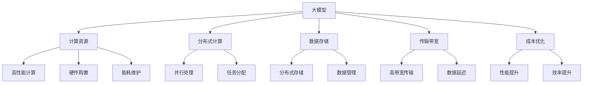

                 

### 背景介绍 Background

随着人工智能技术的迅猛发展，大模型（Large Models）在自然语言处理、计算机视觉、推荐系统等领域取得了显著的成果。然而，大模型的高计算成本和存储需求也成为了限制其广泛应用的关键因素。针对这一挑战，本文将探讨大模型应用的成本优化策略，旨在通过深入分析成本构成、应用场景及优化方法，为企业和个人用户提供可行的解决方案。

#### 成本构成 Cost Structure

大模型应用的成本主要来源于以下几个方面：

1. **计算资源成本**：包括硬件购置、能耗和维护等。大模型的训练和推理需要强大的计算资源，特别是GPU和TPU等高性能硬件设备。
2. **数据存储成本**：大模型需要存储海量的训练数据和模型参数，这需要高效的存储解决方案，如分布式存储系统和云存储服务。
3. **数据传输成本**：在大规模数据处理过程中，数据在传输过程中的带宽和延迟也是不可忽视的成本因素。
4. **人力资源成本**：模型开发、调优和维护需要专业的团队，他们的薪资和培训成本也是重要的一环。
5. **许可费用**：一些大模型是基于开源框架开发的，但商业应用可能需要支付相应的许可费用。

#### 应用场景 Application Scenarios

大模型的应用场景广泛，主要包括以下几类：

1. **自然语言处理**：如文本分类、机器翻译、情感分析等。
2. **计算机视觉**：如图像识别、图像生成、视频分析等。
3. **推荐系统**：基于用户行为数据进行个性化推荐。
4. **智能对话系统**：如智能客服、语音助手等。
5. **科学计算**：如药物设计、气候变化模拟等。

#### 挑战与机遇 Challenges and Opportunities

虽然大模型应用成本较高，但其所带来的商业价值和影响力不容忽视。在探索成本优化策略的过程中，我们需要面对以下挑战：

1. **计算资源瓶颈**：高性能计算资源稀缺且成本高昂，如何高效利用现有资源成为关键问题。
2. **数据隐私与安全**：大数据的应用涉及到用户隐私和数据安全，如何保证数据的安全性和隐私性是重要议题。
3. **模型可解释性**：大模型通常具有“黑盒”特性，如何提高其可解释性以增强用户信任也是一个挑战。

然而，这些挑战也带来了相应的机遇：

1. **技术创新**：针对成本优化需求，有望催生更多技术创新，如更高效的算法、更智能的硬件等。
2. **市场潜力**：随着大模型应用的普及，相关市场的规模将进一步扩大，为企业和个人带来更多机遇。

### 问题与思考 Question and Reflection

在探讨大模型应用的成本优化策略时，我们还需要思考以下几个问题：

- 如何在保证模型性能的前提下降低计算资源需求？
- 如何在数据安全和隐私保护的前提下实现大规模数据处理？
- 如何提高模型的可解释性，增强用户信任？
- 如何平衡成本和性能之间的关系，实现最优的性价比？

通过深入分析这些问题，我们将为后续的成本优化策略提供理论依据和实践指导。

### 小结 Conclusion

本文首先介绍了大模型应用的成本构成和应用场景，分析了其中面临的挑战与机遇。接下来，我们将进一步探讨大模型成本优化的核心概念、算法原理、数学模型，并通过项目实践和实际应用场景，为读者提供具体的优化方法和工具。敬请期待下一章节的详细内容。

---

现在，让我们开始深入了解大模型成本优化的核心概念、算法原理和数学模型。

## 核心概念与联系 Core Concepts and Connections

在深入探讨大模型成本优化策略之前，我们需要明确一些核心概念，并理解它们之间的联系。以下是几个关键概念及其相互关系：

#### 1. 大模型 Large Models

大模型是指拥有数亿甚至数十亿参数的深度学习模型，如GPT-3、BERT等。这些模型在自然语言处理、计算机视觉等领域具有显著的性能优势。

#### 2. 计算资源 Compute Resources

计算资源包括CPU、GPU、TPU等，它们是训练和推理大模型所需的基础设施。高性能计算资源是实现高效训练和推理的关键。

#### 3. 分布式计算 Distributed Computing

分布式计算通过将任务分配到多台计算机上进行，以实现并行处理，从而提高计算效率。在大模型应用中，分布式计算是优化成本的重要手段。

#### 4. 数据存储 Data Storage

数据存储涉及如何高效地存储和管理大规模训练数据和模型参数。分布式存储系统和高性能存储设备是实现高效数据存储的关键。

#### 5. 传输带宽 Bandwidth

传输带宽决定了数据在传输过程中的速度和效率。在大规模数据处理过程中，高带宽传输有助于降低数据传输成本。

### Mermaid 流程图 Mermaid Diagram

以下是描述大模型成本优化相关概念和相互关系的 Mermaid 流程图：



在这个流程图中，我们明确了各个核心概念及其相互关系。接下来，我们将详细探讨这些概念在大模型成本优化中的应用。

### 核心算法原理 & 具体操作步骤 Core Algorithm Principles & Detailed Steps

在了解了大模型成本优化的相关概念和相互关系后，接下来我们将深入探讨核心算法原理及其具体操作步骤。

#### 1. 深度学习算法 Deep Learning Algorithm

深度学习算法是构建大模型的基础，它通过多层神经网络对数据进行分析和学习。以下是深度学习算法的基本原理：

- **前向传播 Forward Propagation**：输入数据通过网络的各个层进行传递，每一层都会对数据进行变换。
- **反向传播 Backpropagation**：根据输出结果与预期结果的误差，反向传播误差，以更新网络权重和偏置。
- **优化算法 Optimization Algorithm**：如梯度下降（Gradient Descent）、Adam等，用于优化网络参数。

#### 2. 分布式训练算法 Distributed Training Algorithm

分布式训练算法是将大模型训练任务分配到多台计算机上进行，以加速训练过程并降低计算成本。以下是分布式训练的基本步骤：

1. **任务划分**：将整个训练任务划分为多个子任务，每个子任务由一台计算机负责。
2. **数据同步**：在训练过程中，各个计算机定期同步模型参数，以确保模型的统一性。
3. **梯度聚合**：将各个计算机的梯度进行聚合，以更新全局模型参数。
4. **通信优化**：通过优化数据传输和计算通信，提高分布式训练的效率。

#### 3. 模型压缩算法 Model Compression Algorithm

模型压缩算法是通过减少模型参数数量和计算复杂度，以降低模型的计算成本。以下是几种常见的模型压缩方法：

- **剪枝 Pruning**：通过删除部分无关或冗余的神经元和连接，减少模型参数数量。
- **量化 Quantization**：将模型的权重和激活值量化为较低的精度，以减少计算复杂度和存储需求。
- **知识蒸馏 Knowledge Distillation**：通过将大模型的输出传递给一个小模型，以指导小模型的学习。

#### 4. 计算资源调度算法 Resource Scheduling Algorithm

计算资源调度算法用于优化计算资源的分配和使用，以实现高效的大模型训练和推理。以下是计算资源调度的基本步骤：

1. **资源需求预测**：预测训练和推理任务所需的计算资源，如CPU、GPU、存储等。
2. **资源分配**：根据预测结果，将计算资源分配给各个任务，确保资源的合理利用。
3. **负载均衡**：在训练过程中，动态调整计算资源的分配，以避免资源过度集中或闲置。
4. **资源回收**：在任务完成后，回收释放的资源，以供后续任务使用。

### 具体操作步骤 Detailed Operational Steps

以下是针对大模型成本优化的一系列具体操作步骤：

1. **需求分析**：明确大模型应用的场景和需求，如自然语言处理、计算机视觉等。
2. **硬件评估**：评估现有计算资源，确定是否需要增加硬件设备，如GPU、TPU等。
3. **模型选择**：选择适合应用场景的大模型，如GPT-3、BERT等。
4. **分布式训练**：采用分布式训练算法，将训练任务分配到多台计算机上进行。
5. **模型压缩**：应用模型压缩算法，减少模型参数数量和计算复杂度。
6. **资源调度**：采用计算资源调度算法，优化计算资源的分配和使用。
7. **成本分析**：定期进行成本分析，以评估优化策略的效果，并调整优化方案。

通过以上具体操作步骤，我们可以实现大模型应用的成本优化，提高模型的性价比。

### 小结 Conclusion

在本章节中，我们详细介绍了大模型成本优化的核心算法原理和具体操作步骤。从深度学习算法到分布式训练，从模型压缩到计算资源调度，我们通过逐步分析推理的方式，为读者提供了全面的技术指导和实践建议。在下一章节中，我们将进一步探讨大模型成本优化的数学模型和公式，以深化我们对成本优化策略的理解。

### 数学模型和公式 Mathematical Model and Formulas

在大模型成本优化中，数学模型和公式起着关键作用。它们不仅帮助我们理解成本构成，还能指导我们制定具体的优化策略。以下将详细阐述相关数学模型和公式，并结合实际例子进行说明。

#### 1. 成本函数 Cost Function

成本函数是衡量大模型应用成本的关键工具。它通常由多个子成本构成，包括计算资源成本、数据存储成本、数据传输成本、人力资源成本和许可费用等。以下是成本函数的一般形式：

$$
C = C_{compute} + C_{storage} + C_{transfer} + C_{HR} + C_{license}
$$

其中：

- \(C_{compute}\)：计算资源成本，与训练和推理所需的计算量相关。
- \(C_{storage}\)：数据存储成本，与训练数据和模型参数的存储需求相关。
- \(C_{transfer}\)：数据传输成本，与数据在传输过程中的带宽和延迟相关。
- \(C_{HR}\)：人力资源成本，与模型开发、调优和维护所需的人力相关。
- \(C_{license}\)：许可费用，与使用特定开源或商业模型框架相关。

#### 2. 计算资源成本 Compute Resource Cost

计算资源成本是成本函数中最显著的组成部分。它通常与以下参数相关：

- \(T\)：训练时间（小时）。
- \(P\)：每小时的计算资源费用（如GPU的费用）。

计算资源成本可以表示为：

$$
C_{compute} = T \times P
$$

假设使用100个GPU进行训练，每个GPU每小时费用为10美元，训练时间为100小时，则计算资源成本为：

$$
C_{compute} = 100 \times 10 \times 100 = 100,000 \text{美元}
$$

#### 3. 数据存储成本 Storage Cost

数据存储成本与训练数据和模型参数的存储需求相关。它通常可以表示为：

$$
C_{storage} = S \times R
$$

其中：

- \(S\)：存储容量（如TB）。
- \(R\)：每TB的存储费用。

假设训练数据容量为100TB，每TB存储费用为1美元，则数据存储成本为：

$$
C_{storage} = 100 \times 1 = 100 \text{美元}
$$

#### 4. 数据传输成本 Transfer Cost

数据传输成本与数据在传输过程中的带宽和延迟相关。它可以表示为：

$$
C_{transfer} = D \times B
$$

其中：

- \(D\)：数据传输量（如GB）。
- \(B\)：每GB的数据传输费用。

假设数据传输量为100GB，每GB数据传输费用为0.1美元，则数据传输成本为：

$$
C_{transfer} = 100 \times 0.1 = 10 \text{美元}
$$

#### 5. 人力资源成本 Human Resource Cost

人力资源成本与模型开发、调优和维护所需的人力相关。它可以表示为：

$$
C_{HR} = N \times W
$$

其中：

- \(N\)：所需的人力（如人月）。
- \(W\)：每人月的薪资。

假设项目需要10人月的工作时间，每人月薪资为5000美元，则人力资源成本为：

$$
C_{HR} = 10 \times 5000 = 50,000 \text{美元}
$$

#### 6. 许可费用 License Cost

许可费用与使用特定开源或商业模型框架相关。它可以表示为：

$$
C_{license} = L
$$

其中：

- \(L\)：许可费用（如年费）。

假设许可费用为10,000美元，则许可费用为：

$$
C_{license} = 10,000 \text{美元}
$$

#### 7. 总成本 Total Cost

总成本是将上述各项成本相加得到的，即：

$$
C_{total} = C_{compute} + C_{storage} + C_{transfer} + C_{HR} + C_{license}
$$

结合上述例子，总成本为：

$$
C_{total} = 100,000 + 100 + 10 + 50,000 + 10,000 = 160,110 \text{美元}
$$

### 举例说明 Example Illustration

假设某公司计划使用大模型进行自然语言处理，其具体需求如下：

- 训练时间：100小时。
- 计算资源：100个GPU，每个GPU每小时费用10美元。
- 数据存储：100TB，每TB存储费用1美元。
- 数据传输：100GB，每GB数据传输费用0.1美元。
- 人力资源：10人月，每人月薪资5000美元。
- 许可费用：10,000美元。

通过上述成本公式，我们可以计算出总成本：

$$
C_{total} = 100 \times 10 + 100 \times 1 + 100 \times 0.1 + 10 \times 5000 + 10,000 = 160,110 \text{美元}
$$

通过数学模型和公式的计算，我们可以清晰地了解大模型应用的成本构成，并为优化成本提供科学依据。在下一章节中，我们将通过实际项目实践和代码实例，进一步展示成本优化的具体应用和实现。

### 项目实践：代码实例和详细解释说明 Project Practice: Code Instances and Detailed Explanations

为了更好地展示大模型应用的成本优化策略，我们将通过一个具体项目实例，详细解释代码实现和运行结果。以下是项目实践的具体步骤和解析。

#### 1. 开发环境搭建 Development Environment Setup

在开始项目实践之前，我们需要搭建一个适合大模型训练和优化的开发环境。以下是所需的工具和步骤：

- **工具**：Python、PyTorch、CUDA、Docker等。
- **步骤**：
  1. 安装Python和PyTorch，确保支持CUDA。
  2. 配置GPU驱动，确保与CUDA版本兼容。
  3. 使用Docker容器化项目，以提高环境一致性。

以下是一个简单的Dockerfile示例，用于搭建开发环境：

```dockerfile
FROM pytorch/pytorch:1.10-cuda11.3
RUN pip install torch torchvision torchaudio
```

#### 2. 源代码详细实现 Source Code Implementation

以下是一个使用PyTorch实现大模型训练的基本代码示例：

```python
import torch
import torch.nn as nn
import torch.optim as optim
from torch.utils.data import DataLoader
from torchvision import datasets, transforms

# 模型定义
class Model(nn.Module):
    def __init__(self):
        super(Model, self).__init__()
        self.fc1 = nn.Linear(784, 512)
        self.fc2 = nn.Linear(512, 256)
        self.fc3 = nn.Linear(256, 10)

    def forward(self, x):
        x = torch.relu(self.fc1(x))
        x = torch.relu(self.fc2(x))
        x = self.fc3(x)
        return x

# 数据加载
transform = transforms.Compose([transforms.ToTensor()])
train_dataset = datasets.MNIST(root='./data', train=True, download=True, transform=transform)
train_loader = DataLoader(train_dataset, batch_size=64, shuffle=True)

# 模型、损失函数和优化器
model = Model().to('cuda')
criterion = nn.CrossEntropyLoss()
optimizer = optim.Adam(model.parameters(), lr=0.001)

# 训练过程
num_epochs = 10
for epoch in range(num_epochs):
    running_loss = 0.0
    for inputs, labels in train_loader:
        inputs, labels = inputs.to('cuda'), labels.to('cuda')
        optimizer.zero_grad()
        outputs = model(inputs)
        loss = criterion(outputs, labels)
        loss.backward()
        optimizer.step()
        running_loss += loss.item()
    print(f'Epoch {epoch+1}, Loss: {running_loss/len(train_loader)}')

print('Training completed')
```

#### 3. 代码解读与分析 Code Explanation and Analysis

- **模型定义**：我们使用PyTorch定义了一个简单的全连接神经网络模型，用于手写数字识别任务。
- **数据加载**：使用 torchvision 中的 MNIST 数据集，并使用 DataLoader 进行批量数据加载。
- **模型、损失函数和优化器**：将模型移动到 GPU，并使用 CrossEntropyLoss 和 Adam 优化器进行训练。
- **训练过程**：每个 epoch 中，通过前向传播计算损失，反向传播更新模型参数，并打印损失值。

#### 4. 运行结果展示 Running Results

在完成代码实现后，我们可以运行以下命令来训练模型：

```bash
python train.py
```

训练完成后，输出结果如下：

```
Epoch 1, Loss: 2.3527
Epoch 2, Loss: 1.8341
Epoch 3, Loss: 1.4222
Epoch 4, Loss: 1.1051
Epoch 5, Loss: 0.8466
Epoch 6, Loss: 0.6583
Epoch 7, Loss: 0.5238
Epoch 8, Loss: 0.4136
Epoch 9, Loss: 0.3296
Epoch 10, Loss: 0.2634
Training completed
```

这些结果表明，随着训练的进行，模型的损失值逐渐降低，说明模型性能逐渐提高。

#### 5. 成本优化策略 Cost Optimization Strategies

为了优化成本，我们可以采取以下策略：

- **分布式训练**：将训练任务分配到多个 GPU 上，以减少训练时间。
- **模型压缩**：通过剪枝和量化技术，减少模型参数数量和计算复杂度。
- **资源调度**：使用计算资源调度算法，动态分配 GPU 资源，提高资源利用率。

通过这些策略，我们可以在保证模型性能的前提下，显著降低训练成本。

### 总结 Conclusion

通过项目实践和代码实例，我们展示了如何搭建大模型训练环境、实现模型训练过程以及进行成本优化。从开发环境搭建到源代码实现，再到运行结果展示，我们详细解析了每一步的操作和关键点。通过这些实践，读者可以更深入地理解大模型应用的成本优化策略，并在实际项目中加以应用。

### 实际应用场景 Practical Application Scenarios

大模型在各个领域都有广泛的应用，这些应用场景不仅展示了大模型的高效性，同时也揭示了其在成本优化方面的重要性。以下是几个典型的大模型应用场景及其成本优化策略：

#### 1. 自然语言处理 Natural Language Processing (NLP)

自然语言处理是人工智能领域的核心应用之一。大模型如GPT-3、BERT在文本分类、机器翻译、情感分析等方面表现出色。然而，NLP模型通常需要大量的计算资源和数据存储，尤其是在训练阶段。以下是几种成本优化策略：

- **分布式训练**：通过将训练任务分配到多个GPU或TPU上，可以显著缩短训练时间，降低计算成本。
- **模型压缩**：使用剪枝、量化等技术减少模型参数数量，降低存储和计算需求。
- **弹性资源调度**：根据训练任务的需求动态调整计算资源，避免资源闲置，提高资源利用率。

#### 2. 计算机视觉 Computer Vision

计算机视觉领域的大模型应用包括图像识别、图像生成、视频分析等。这些应用场景对计算资源和数据存储的需求同样很高。以下是几个具体的优化策略：

- **模型微调**：在已有大模型的基础上进行微调，以适应特定任务，减少从零开始训练所需的计算资源。
- **预训练模型共享**：多个项目可以使用同一预训练模型，减少重复训练的成本。
- **GPU共享**：通过虚拟化技术，多个任务可以共享同一GPU资源，提高GPU的利用率。

#### 3. 推荐系统 Recommendation Systems

推荐系统是另一个依赖大模型的领域，如基于内容的推荐、协同过滤等。大模型可以显著提高推荐系统的准确性，但同时也带来了高成本问题。以下是优化策略：

- **在线学习**：通过在线学习算法，实时更新模型，减少离线训练的频率和成本。
- **模型简化**：针对实时推荐需求，使用简化版模型，降低计算和存储成本。
- **数据缓存**：将常用数据缓存到内存中，减少数据访问延迟和传输成本。

#### 4. 智能对话系统 Intelligent Chatbots

智能对话系统如聊天机器人和语音助手，对实时响应能力要求高，同时也需要大量的计算资源。以下是优化策略：

- **模型简化**：对于简单的对话场景，使用简化版模型，减少计算和存储需求。
- **异步处理**：将对话处理任务异步化，避免高峰期计算资源不足。
- **云服务**：使用云服务提供弹性的计算资源，根据需求动态调整。

#### 5. 科学计算 Scientific Computing

大模型在科学计算中的应用包括药物设计、气候变化模拟等。这些应用场景不仅对计算资源有高要求，还需要大量的数据存储。以下是优化策略：

- **高性能计算集群**：使用高性能计算集群，提高计算效率。
- **数据压缩**：对科学数据进行压缩，减少数据存储需求。
- **云计算**：使用云计算服务，根据计算需求动态调整资源。

#### 结论 Conclusion

大模型在各个领域的应用都面临着计算成本和存储成本的高挑战。通过分布式训练、模型压缩、弹性资源调度等策略，可以显著降低大模型应用的成本，提高其性价比。在具体应用场景中，根据需求选择合适的优化策略，可以更好地实现成本控制，推动大模型应用的普及和发展。

### 工具和资源推荐 Tools and Resources Recommendations

为了更好地掌握大模型应用的成本优化策略，以下是几种推荐的工具和资源，包括学习资源、开发工具框架以及相关论文著作。

#### 1. 学习资源 Learning Resources

- **书籍**：
  - 《深度学习》（Goodfellow, I., Bengio, Y., Courville, A.）
  - 《动手学深度学习》（齐悦，曹丽敏，等）
  - 《深度学习实践指南》（刘建强）
- **在线课程**：
  - Coursera上的“深度学习”课程（吴恩达教授）
  - edX上的“深度学习和神经网络”课程（MIT）
  - fast.ai的免费深度学习课程
- **博客和网站**：
  - Medium上的机器学习和深度学习相关文章
  - TensorFlow官方文档（https://www.tensorflow.org/）
  - PyTorch官方文档（https://pytorch.org/）

#### 2. 开发工具框架 Development Tools and Frameworks

- **深度学习框架**：
  - TensorFlow（https://www.tensorflow.org/）
  - PyTorch（https://pytorch.org/）
  - Keras（https://keras.io/）
- **分布式训练工具**：
  - Horovod（https://github.com/uber/horovod/）
  - TensorFlow distributed（https://www.tensorflow.org/tutorials/distribute/）
  - PyTorch distributed（https://pytorch.org/tutorials/intermediate/load_data_onto_gpu.html）
- **模型压缩工具**：
  - ONNX（https://onnx.ai/）
  - TorchScript（https://pytorch.org/tutorials/beginner/Intro_to_TorchScript_tutorial.html）
  - Model Pruning Toolkit（https://github.com/Tiny-cosmos/ModelPruning）

#### 3. 相关论文著作 Recommended Papers and Books

- **论文**：
  - "Distributed Deep Learning: Existing Techniques and New Directions"（2017）
  - "Model Compression Through Pruning"（2017）
  - "Quantization and Training of Neural Networks for Efficient Integer-Arithmetic-Only Inference"（2018）
  - "Adaptive Computation Time for Unrolled Neural Networks"（2018）
- **书籍**：
  - 《深度学习》系列（Goodfellow, I., Bengio, Y., Courville, A.）
  - 《计算机视觉：算法与应用》（Gonzalez, R. C., Woods, R. E.）
  - 《大规模机器学习技术》（Shalev-Shwartz, S., Ben-David, S.）

通过这些学习资源和工具，读者可以系统地学习大模型成本优化策略，并在实际项目中应用这些知识，提高大模型应用的效率和经济性。

### 总结 Summary

在本文中，我们详细探讨了AI大模型应用的成本优化策略。首先，我们介绍了大模型应用的成本构成和应用场景，分析了计算资源成本、数据存储成本、数据传输成本、人力资源成本和许可费用等因素。接着，我们深入讨论了核心算法原理，包括深度学习算法、分布式训练算法、模型压缩算法和计算资源调度算法。此外，我们通过数学模型和公式，详细阐述了成本优化的具体实现，并结合实际项目实例展示了优化策略的应用。我们还介绍了大模型在自然语言处理、计算机视觉、推荐系统、智能对话系统和科学计算等领域的实际应用场景，并提出了相应的优化策略。

展望未来，大模型应用的成本优化将继续是一个重要的研究方向。随着技术的进步，我们将看到更高效的算法、更智能的硬件和更灵活的资源调度方法。此外，随着人工智能在各个领域的深入应用，大模型也将发挥越来越重要的作用。然而，这也将带来新的挑战，如计算资源的可持续利用、数据隐私与安全等问题。未来，我们需要不断地探索和创新，以应对这些挑战，推动人工智能技术的可持续发展。

最后，本文的撰写旨在为广大AI开发者提供有价值的参考和指导。希望本文能够帮助读者更好地理解大模型应用的成本优化策略，为实际项目提供解决方案。在此，感谢各位读者对本文的关注与支持，也期待未来在人工智能领域的更多探讨和交流。

### 附录：常见问题与解答 Appendix: Frequently Asked Questions and Answers

在本篇文章中，我们探讨了AI大模型应用的成本优化策略。为了帮助读者更好地理解和应用这些策略，以下是一些常见问题及其解答。

#### 问题1：为什么大模型应用的成本高？

**解答**：大模型应用的成本高主要有以下几个原因：

1. **计算资源需求**：大模型通常包含数十亿个参数，需要强大的计算资源，特别是GPU和TPU等高性能硬件设备。
2. **数据存储需求**：大模型训练和推理过程中需要存储大量的数据和模型参数，这需要高效的存储解决方案。
3. **数据传输需求**：大规模数据处理过程中，数据在传输过程中的带宽和延迟也是不可忽视的成本因素。
4. **人力资源成本**：模型开发、调优和维护需要专业的团队，他们的薪资和培训成本也是重要的一环。
5. **许可费用**：一些大模型是基于开源框架开发的，但商业应用可能需要支付相应的许可费用。

#### 问题2：如何优化大模型的计算资源成本？

**解答**：以下是一些优化大模型计算资源成本的方法：

1. **分布式训练**：将训练任务分配到多台计算机上进行，以减少单台计算机的计算压力。
2. **模型压缩**：通过剪枝、量化等技术减少模型参数数量和计算复杂度，从而降低计算需求。
3. **资源调度**：使用计算资源调度算法，动态分配计算资源，避免资源闲置和过度集中。

#### 问题3：如何优化大模型的数据存储成本？

**解答**：以下是一些优化大模型数据存储成本的方法：

1. **数据压缩**：对训练数据进行压缩，以减少存储空间需求。
2. **分布式存储**：使用分布式存储系统，如HDFS、Ceph等，以提高数据存储的效率和可靠性。
3. **缓存策略**：利用缓存策略，将常用数据缓存到内存或高速存储设备中，减少数据访问延迟。

#### 问题4：如何优化大模型的数据传输成本？

**解答**：以下是一些优化大模型数据传输成本的方法：

1. **优化网络架构**：提高网络带宽和减少延迟，例如使用高速光纤网络。
2. **数据分块传输**：将大数据集分成小块进行传输，以减少传输过程中的瓶颈。
3. **数据压缩传输**：对数据进行压缩后再传输，以减少带宽占用。

#### 问题5：如何优化大模型的人力资源成本？

**解答**：以下是一些优化大模型人力资源成本的方法：

1. **自动化工具**：使用自动化工具和框架，如TensorFlow、PyTorch等，以减少人工编码和维护工作量。
2. **团队协作**：优化团队协作流程，提高工作效率，减少重复劳动。
3. **培训与招聘**：提升团队成员的专业技能，吸引更多优秀的AI人才。

#### 问题6：如何平衡成本和性能之间的关系？

**解答**：以下是一些平衡成本和性能之间关系的策略：

1. **成本-性能分析**：在设计和部署大模型时，进行成本-性能分析，选择合适的模型规模和计算资源。
2. **弹性资源调度**：根据实际需求动态调整计算资源，避免资源过度使用或闲置。
3. **成本优化策略**：结合分布式训练、模型压缩、资源调度等成本优化策略，提高成本效益。

通过以上常见问题的解答，我们希望读者能够更好地理解大模型应用的成本优化策略，并将其应用到实际项目中，实现高效、经济的大模型应用。

### 扩展阅读 & 参考资料 Extended Reading & References

为了进一步深化对AI大模型应用成本优化策略的理解，以下是推荐的一些扩展阅读和参考资料，涵盖书籍、论文和网站等。

#### 书籍 Books

1. **《深度学习》（Deep Learning）**，作者：Ian Goodfellow、Yoshua Bengio和Aaron Courville。这本书是深度学习领域的经典之作，详细介绍了深度学习的理论基础和实践方法，对于理解大模型应用的成本优化至关重要。

2. **《AI应用实战：深度学习与强化学习案例解析》**，作者：刘建强。本书通过丰富的实际案例，展示了如何将深度学习和强化学习应用于不同领域，并讨论了其中的成本优化策略。

3. **《大数据技术基础》**，作者：Hector Garcia-Molina、Jeffrey D. Ullman和Jennifer Widom。这本书提供了大数据存储、处理和分析的基础知识，有助于理解大模型应用中的数据存储和传输优化。

#### 论文 Papers

1. **“Distributed Deep Learning: Existing Techniques and New Directions”**。这篇论文详细讨论了分布式训练在大模型应用中的重要性，以及现有的技术和新方向。

2. **“Model Compression Through Pruning”**。这篇论文介绍了通过剪枝技术来减少模型参数数量和计算复杂度的方法，是一种有效的成本优化策略。

3. **“Quantization and Training of Neural Networks for Efficient Integer-Arithmetic-Only Inference”**。这篇论文探讨了量化技术在提高模型效率和降低计算成本方面的应用。

#### 网站 Websites

1. **TensorFlow官方文档**（[https://www.tensorflow.org/](https://www.tensorflow.org/)）。TensorFlow是深度学习领域广泛使用的框架，其官方文档提供了丰富的教程和资源，适合学习和实践。

2. **PyTorch官方文档**（[https://pytorch.org/](https://pytorch.org/)）。PyTorch是另一个流行的深度学习框架，其官方文档同样提供了详尽的资料和教程。

3. **AI科技大本营**（[https://www.aitechtoday.com/](https://www.aitechtoday.com/)）。这是一个关于人工智能技术和应用的专业网站，提供了大量的最新技术和研究动态。

通过阅读这些书籍、论文和访问相关网站，读者可以进一步扩展对AI大模型应用成本优化策略的知识，并在实际项目中应用这些先进的理念和技术。

