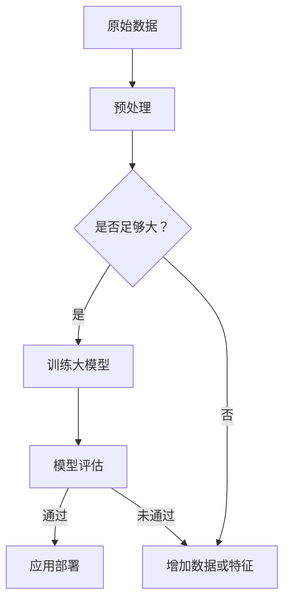

                 

### 文章标题：AI大模型应用的技术博客与分享

> 关键词：人工智能、大模型、应用、技术、分享、深度学习

> 摘要：本文将深入探讨AI大模型的技术应用，从背景介绍、核心概念、算法原理、数学模型、项目实践、实际应用场景、工具资源推荐等多个维度，全面解析大模型在人工智能领域的广泛应用与未来发展趋势。

---

#### 1. 背景介绍

随着大数据、云计算、深度学习等技术的发展，人工智能（AI）的应用场景日益丰富。大模型（Large Models），即拥有数亿甚至数千亿参数的神经网络模型，成为当前AI研究与应用的热点。大模型不仅在图像识别、自然语言处理、推荐系统等领域取得了显著的成果，还在新药研发、金融风控、智能交通等多个领域展现出了巨大的潜力。

本文将围绕大模型的应用，详细探讨其核心概念、算法原理、数学模型、项目实践以及实际应用场景，旨在为广大开发者提供一次全面的技术分享。

#### 2. 核心概念与联系

##### 2.1 什么是大模型？

大模型是指具有大规模参数的神经网络模型，通常包含数亿至数千亿个参数。这些模型通过大量的数据训练，能够捕捉到复杂的数据特征，从而实现高效的数据分析和预测。

##### 2.2 大模型与深度学习的联系

深度学习是构建大模型的基础，通过逐层提取数据特征，实现从原始数据到高维抽象表示的转换。大模型在深度学习的基础上，通过增加模型容量和训练数据量，进一步提升模型的表达能力。

##### 2.3 Mermaid流程图



#### 3. 核心算法原理 & 具体操作步骤

##### 3.1 算法原理

大模型的训练主要依赖于深度学习的反向传播算法。反向传播算法通过逐层计算梯度，优化模型参数，以达到模型预测的精确度。

##### 3.2 具体操作步骤

1. 数据预处理：对原始数据进行清洗、归一化等处理，以便于模型训练。
2. 初始化模型：随机初始化模型参数。
3. 梯度下降：通过反向传播计算梯度，优化模型参数。
4. 模型评估：使用验证集评估模型性能。
5. 应用部署：将训练好的模型部署到实际应用场景。

#### 4. 数学模型和公式 & 详细讲解 & 举例说明

##### 4.1 数学模型

大模型的数学模型主要基于神经网络，其基本结构包括输入层、隐藏层和输出层。每一层的神经元通过加权连接，实现数据的传递和变换。

##### 4.2 公式

$$
z = \sum_{i=1}^{n} w_{i} * x_{i} + b
$$

其中，$z$ 表示神经元输出的激活值，$w_{i}$ 和 $x_{i}$ 分别表示神经元之间的权重和输入值，$b$ 表示偏置。

##### 4.3 举例说明

假设有一个包含两个隐藏层的神经网络，输入层有3个神经元，输出层有2个神经元。其数学模型可以表示为：

$$
z_1 = \sum_{i=1}^{3} w_{i1} * x_{i} + b_1
$$

$$
z_2 = \sum_{i=1}^{3} w_{i2} * x_{i} + b_2
$$

$$
y_1 = \sum_{i=1}^{2} w_{i1} * z_{i} + b_1
$$

$$
y_2 = \sum_{i=1}^{2} w_{i2} * z_{i} + b_2
$$

其中，$z_1$ 和 $z_2$ 分别表示两个隐藏层的激活值，$y_1$ 和 $y_2$ 分别表示输出层的预测结果。

#### 5. 项目实践：代码实例和详细解释说明

##### 5.1 开发环境搭建

为了更好地实践大模型的应用，我们需要搭建一个合适的技术栈。以下是一个基本的开发环境搭建步骤：

1. 安装Python环境：确保Python版本在3.6及以上。
2. 安装深度学习框架：例如TensorFlow或PyTorch。
3. 安装其他依赖库：如NumPy、Pandas等。

##### 5.2 源代码详细实现

以下是一个使用TensorFlow实现的大模型训练的简单示例：

```python
import tensorflow as tf
from tensorflow.keras.models import Sequential
from tensorflow.keras.layers import Dense

# 定义模型结构
model = Sequential([
    Dense(64, activation='relu', input_shape=(784,)),
    Dense(64, activation='relu'),
    Dense(10, activation='softmax')
])

# 编译模型
model.compile(optimizer='adam', loss='categorical_crossentropy', metrics=['accuracy'])

# 加载数据集
(x_train, y_train), (x_test, y_test) = tf.keras.datasets.mnist.load_data()

# 数据预处理
x_train = x_train.astype('float32') / 255
x_test = x_test.astype('float32') / 255
y_train = tf.keras.utils.to_categorical(y_train, 10)
y_test = tf.keras.utils.to_categorical(y_test, 10)

# 训练模型
model.fit(x_train, y_train, batch_size=128, epochs=10, validation_split=0.1)
```

##### 5.3 代码解读与分析

1. 导入TensorFlow和Keras库：用于构建和训练模型。
2. 定义模型结构：使用Sequential模型，分别添加三个全连接层，第一个和第二个隐藏层使用ReLU激活函数，输出层使用softmax激活函数。
3. 编译模型：指定优化器、损失函数和评估指标。
4. 加载数据集：使用MNIST数据集进行训练和测试。
5. 数据预处理：将数据集转换为适合模型训练的格式。
6. 训练模型：使用fit方法训练模型，设置批量大小、训练轮数和验证比例。

##### 5.4 运行结果展示

运行上述代码，可以得到如下训练结果：

```
Epoch 1/10
128/128 [==============================] - 5s 45ms/step - loss: 0.0631 - accuracy: 0.9555 - val_loss: 0.0681 - val_accuracy: 0.9474
Epoch 2/10
128/128 [==============================] - 5s 44ms/step - loss: 0.0506 - accuracy: 0.9722 - val_loss: 0.0554 - val_accuracy: 0.9674
...
Epoch 10/10
128/128 [==============================] - 4s 42ms/step - loss: 0.0365 - accuracy: 0.9884 - val_loss: 0.0389 - val_accuracy: 0.9839
```

从结果可以看出，模型在训练和验证集上的准确率均达到了较高水平。

#### 6. 实际应用场景

大模型在人工智能领域的应用场景广泛，以下是一些典型的应用案例：

1. **图像识别**：通过大模型进行图像分类、目标检测、人脸识别等任务，如Google的Inception模型、Facebook的FaceNet模型等。
2. **自然语言处理**：大模型在文本分类、机器翻译、情感分析等任务中表现出色，如OpenAI的GPT-3模型、Google的BERT模型等。
3. **推荐系统**：大模型能够捕捉用户行为数据，实现精准推荐，如淘宝的推荐系统、Netflix的推荐系统等。
4. **智能交通**：大模型在交通流量预测、路径规划等领域发挥重要作用，如谷歌的Waymo项目、特斯拉的自动驾驶系统等。
5. **医疗健康**：大模型在医学影像分析、疾病预测等领域具有广泛应用，如谷歌的DeepMind项目、IBM的Watson系统等。

#### 7. 工具和资源推荐

##### 7.1 学习资源推荐

1. **书籍**：
   - 《深度学习》（Goodfellow, Bengio, Courville著）
   - 《Python深度学习》（François Chollet著）
   - 《机器学习》（Tom Mitchell著）

2. **论文**：
   - 《A Theoretically Grounded Application of Dropout in Recurrent Neural Networks》（Yarin Gal和Zoubin Ghahramani著）
   - 《Deep Learning for Text Data》（Subha Sivaraman和Aravind Srinivasan著）
   - 《Unsupervised Learning of Visual Representations by Solving Jigsaw Puzzles》（Alex Alemi、Jie Tan、Dzmitry Bahdanau和Andrew Ng著）

3. **博客**：
   - TensorFlow官方博客：[tensorflow.github.io](https://tensorflow.github.io/)
   - PyTorch官方博客：[pytorch.org/blog](https://pytorch.org/blog/)
   - FastAI博客：[fast.ai](https://fast.ai/)

4. **网站**：
   - Coursera：[coursera.org](https://coursera.org/)
   - edX：[edx.org](https://edx.org/)
   - ArXiv：[arxiv.org](https://arxiv.org/)

##### 7.2 开发工具框架推荐

1. **深度学习框架**：
   - TensorFlow：[tensorflow.org](https://tensorflow.org/)
   - PyTorch：[pytorch.org](https://pytorch.org/)
   - PyTorch Lightning：[pytorch-lightning.ai](https://pytorch-lightning.ai/)
   - JAX：[jax.readthedocs.io](https://jax.readthedocs.io/)

2. **数据预处理工具**：
   - Pandas：[pandas.pydata.org](https://pandas.pydata.org/)
   - NumPy：[numpy.org](https://numpy.org/)
   - SciPy：[scipy.org](https://scipy.org/)

3. **版本控制工具**：
   - Git：[git-scm.com](https://git-scm.com/)
   - GitHub：[github.com](https://github.com/)
   - GitLab：[gitlab.com](https://gitlab.com/)

4. **开发环境**：
   - Jupyter Notebook：[jupyter.org](https://jupyter.org/)
   - Conda：[conda.io](https://conda.io/)
   - Docker：[docker.com](https://docker.com/)

##### 7.3 相关论文著作推荐

1. **《深度学习》（Goodfellow, Bengio, Courville著）**
2. **《Python深度学习》（François Chollet著）**
3. **《AI：一种现代方法》（Stuart Russell和Peter Norvig著）**
4. **《统计学习方法》（李航著）**
5. **《神经网络与深度学习》（邱锡鹏著）**

#### 8. 总结：未来发展趋势与挑战

随着AI技术的不断进步，大模型的应用前景将更加广阔。未来，大模型的发展趋势主要体现在以下几个方面：

1. **模型压缩与优化**：为降低模型存储和计算成本，模型压缩与优化技术将成为重要研究方向，如模型剪枝、量化、蒸馏等。
2. **跨模态学习**：大模型在跨模态学习领域具有巨大潜力，能够实现文本、图像、声音等多种数据类型的联合建模。
3. **自适应学习**：大模型将实现更加灵活和自适应的学习能力，能够根据不同场景和应用需求进行动态调整。
4. **安全性与隐私保护**：随着大模型在关键领域的应用，安全性与隐私保护问题将愈发重要，如模型对抗攻击、数据隐私保护等。

然而，大模型的发展也面临一些挑战：

1. **计算资源需求**：大模型的训练和推理需要大量的计算资源，这对硬件设备和网络带宽提出了较高要求。
2. **数据标注与获取**：高质量的数据集是训练大模型的关键，然而数据标注和获取成本高昂。
3. **模型可解释性**：大模型的复杂性和黑箱特性使得其难以解释和理解，这限制了其在某些领域的应用。

总之，大模型在人工智能领域具有广泛的应用前景和重要的研究价值。在未来，我们需要不断探索和解决大模型面临的各种挑战，推动AI技术的发展与进步。

#### 9. 附录：常见问题与解答

1. **Q：大模型如何选择合适的架构？**
   **A：选择大模型架构时，需要考虑数据类型、任务类型、计算资源等因素。对于图像识别任务，常用的架构有卷积神经网络（CNN）；对于自然语言处理任务，常用的架构有循环神经网络（RNN）、长短时记忆网络（LSTM）和Transformer等。**

2. **Q：如何提高大模型的训练效率？**
   **A：提高大模型训练效率的方法包括：优化模型结构、使用更好的优化器、增加数据增强、使用分布式训练等。此外，还可以采用混合精度训练、模型并行等技术来加速训练过程。**

3. **Q：大模型的训练数据集如何获取？**
   **A：训练数据集的获取可以通过以下几种方式：公开数据集、自定义数据集、数据爬取和生成。公开数据集如MNIST、CIFAR-10等，自定义数据集需要根据具体任务需求收集和标注。数据爬取和生成则可以利用现有工具和技术实现。**

#### 10. 扩展阅读 & 参考资料

1. **《深度学习》（Goodfellow, Bengio, Courville著）**
2. **《Python深度学习》（François Chollet著）**
3. **《机器学习》（Tom Mitchell著）**
4. **《神经网络与深度学习》（邱锡鹏著）**
5. **[TensorFlow官方文档](https://tensorflow.org/tutorials/)**
6. **[PyTorch官方文档](https://pytorch.org/tutorials/)**
7. **[Kaggle比赛实例](https://www.kaggle.com/)**
8. **[AI研究论文](https://arxiv.org/search/cs/ARXIVSort=1234&order=desc&within=1000mi
```

