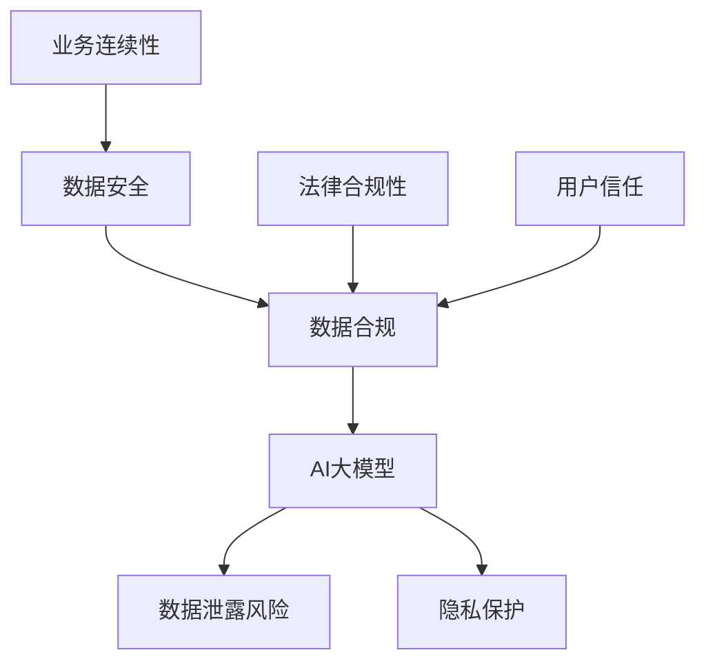

                 

### 1. 背景介绍

在当今信息化时代，人工智能（AI）已经成为推动科技进步的重要力量。特别是大规模预训练模型（如GPT、BERT等）的兴起，极大地提升了AI在各个领域的应用能力。然而，随之而来的数据安全问题也引发了广泛关注。数据安全合规性不仅是企业生存和发展的基础，更是法律和伦理的要求。

随着AI技术的不断发展和应用的广泛普及，数据安全问题日益突出。一方面，AI模型在训练过程中需要处理大量的敏感数据，如个人隐私、商业机密等，这些数据的安全性直接关系到用户和企业的利益。另一方面，AI模型的透明度和解释性较低，使得其在应用过程中可能存在潜在的安全风险。

数据安全合规性的重要性体现在以下几个方面：

1. **法律合规**：许多国家和地区都有严格的数据保护法律法规，如欧盟的《通用数据保护条例》（GDPR）和美国加州的《消费者隐私法案》（CCPA）。企业必须遵守这些法律，否则将面临高额罚款。

2. **用户信任**：用户对数据的信任是AI技术广泛应用的基石。如果用户的数据无法得到妥善保护，他们将失去对AI技术的信任，这将对企业的声誉和业务造成负面影响。

3. **业务连续性**：数据安全是确保企业业务连续性的关键。一旦发生数据泄露或损坏，企业可能面临业务中断、经济损失和声誉损害。

因此，AI大模型应用的数据安全合规性已成为企业必须面对的重要挑战。

### 2. 核心概念与联系

要理解AI大模型应用的数据安全合规性，我们首先需要明确几个核心概念。

#### 2.1 数据安全

数据安全是指保护数据免受未经授权的访问、使用、披露、破坏、修改或破坏。它包括数据的保密性、完整性和可用性。

- **保密性**：确保只有授权用户可以访问数据。
- **完整性**：确保数据在传输和存储过程中不被篡改。
- **可用性**：确保数据在需要时可以快速、可靠地访问。

#### 2.2 数据合规

数据合规是指企业遵守相关的法律法规和标准，确保数据处理活动合法、合规。这包括以下几个方面：

- **隐私保护**：确保个人数据的收集、使用、存储和销毁符合隐私保护要求。
- **透明度**：确保用户知道他们的数据如何被收集、使用和共享。
- **责任**：企业必须对数据安全负责，并在发生数据泄露时采取补救措施。

#### 2.3 AI大模型

AI大模型是指通过大量数据训练得到的高复杂度模型。这些模型包括深度神经网络、图模型、强化学习模型等。

- **深度神经网络**：由多层神经元组成，能够自动从数据中学习特征。
- **图模型**：利用图结构来表示和建模数据，适用于复杂关系的处理。
- **强化学习模型**：通过试错学习来优化决策，常用于游戏、机器人等领域。

#### 2.4 关系与挑战

数据安全、数据合规和AI大模型之间存在着密切的关系和挑战：

- **数据安全**是数据合规的基础，没有数据安全，就难以实现数据合规。
- **AI大模型**的应用需要大量数据，而这些数据的合规性直接影响到模型的安全性和合法性。
- **数据合规**要求企业在数据处理过程中遵守法律法规和标准，这对AI大模型的设计和应用提出了更高的要求。


#### 2.5 Mermaid流程图

为了更直观地展示数据安全合规与AI大模型之间的关系，我们可以使用Mermaid流程图来描述：



在这个流程图中，数据安全和数据合规是确保AI大模型安全性的关键环节。同时，法律合规性、用户信任和业务连续性也是企业必须关注的重要方面。

### 3. 核心算法原理 & 具体操作步骤

为了应对AI大模型应用中的数据安全合规挑战，我们需要深入理解核心算法原理，并采取一系列具体操作步骤来确保数据安全。

#### 3.1 加密算法

加密算法是保护数据安全的基本手段。它通过将明文转换为密文，使得未经授权的用户无法读取数据。常用的加密算法包括对称加密和非对称加密。

- **对称加密**：使用相同的密钥进行加密和解密。典型的算法有DES、AES。
- **非对称加密**：使用一对密钥（公钥和私钥）进行加密和解密。典型的算法有RSA、ECC。

具体操作步骤：

1. 生成一对密钥。
2. 将敏感数据进行加密。
3. 将加密后的数据存储或传输。
4. 在需要读取数据时，使用私钥进行解密。

#### 3.2 哈希算法

哈希算法用于确保数据的完整性。它将任意长度的数据映射为固定长度的哈希值。常用的哈希算法有MD5、SHA-1、SHA-256。

具体操作步骤：

1. 对原始数据进行哈希运算。
2. 将哈希值与原始数据一同存储或传输。
3. 在需要验证数据完整性时，对数据重新进行哈希运算，并与存储的哈希值进行比较。

#### 3.3 数据脱敏

数据脱敏是保护个人隐私的重要手段。它通过替换、掩码等方式，使得敏感数据在存储和传输过程中不被暴露。

具体操作步骤：

1. 确定需要脱敏的数据类型和范围。
2. 选择合适的脱敏方法（如掩码、替换、泛化等）。
3. 对数据进行脱敏处理。
4. 将脱敏后的数据存储或传输。

#### 3.4 访问控制

访问控制是确保数据安全的另一重要手段。它通过限制用户对数据的访问权限，防止未经授权的访问。

具体操作步骤：

1. 定义数据访问策略。
2. 分配用户权限。
3. 实现权限验证机制。
4. 对用户的访问请求进行监控和审计。

#### 3.5 数据备份和恢复

数据备份和恢复是确保数据可用性的关键。它通过定期备份数据，并在发生数据损坏或丢失时进行恢复。

具体操作步骤：

1. 确定数据备份策略。
2. 定期备份数据。
3. 存储备份数据到安全的位置。
4. 在需要时进行数据恢复。

通过以上核心算法原理和具体操作步骤，我们可以有效地保障AI大模型应用的数据安全合规性。然而，这仅仅是开始，我们还需要在实施过程中不断优化和调整，以应对不断变化的安全挑战。

### 4. 数学模型和公式 & 详细讲解 & 举例说明

在保障AI大模型应用的数据安全合规性过程中，数学模型和公式扮演着至关重要的角色。以下，我们将详细介绍几个常用的数学模型和公式，并举例说明其在数据安全合规中的应用。

#### 4.1 加密算法的安全性度量

加密算法的安全性通常用信息论中的熵（Entropy）来度量。熵反映了加密算法对信息的混淆程度。假设一个加密算法的输出空间为\( M \)，那么熵定义为：

$$
H(M) = -\sum_{m \in M} P(m) \log P(m)
$$

其中，\( P(m) \)表示加密算法输出为\( m \)的概率。

**例：** 假设一个加密算法的输出空间为{0, 1}，且输出0和1的概率相等。那么，该加密算法的熵为：

$$
H(M) = -\frac{1}{2} \log_2 \frac{1}{2} - \frac{1}{2} \log_2 \frac{1}{2} = 1
$$

这意味着该加密算法对信息的混淆程度非常高。

#### 4.2 哈希算法的冲突概率

哈希算法的冲突概率是指两个不同的输入数据映射到相同哈希值的情况。冲突概率可以用概率论中的概率质量函数（Probability of Quality Function, PQF）来度量。假设哈希算法的输入空间为\( X \)，输出空间为\( Y \)，则冲突概率为：

$$
P(C) = \sum_{y \in Y} \sum_{x_1, x_2 \in X, x_1 \neq x_2} P(y|hash(x_1)) P(hash(x_2) = y)
$$

**例：** 假设一个哈希算法的输入空间为{0, 1}，输出空间为{0}，且输入0和1的概率相等。那么，该哈希算法的冲突概率为：

$$
P(C) = \sum_{0} \sum_{0, 1} P(0|hash(0)) P(hash(1) = 0) + P(0|hash(1)) P(hash(0) = 0)
$$

由于哈希算法输出0的概率为1，输入0和1的概率相等，因此冲突概率为：

$$
P(C) = 1 \times P(hash(1) = 0) + 1 \times P(hash(0) = 0) = 2
$$

这意味着该哈希算法的冲突概率非常高。

#### 4.3 数据脱敏算法的隐私保护程度

数据脱敏算法的隐私保护程度可以用信息论中的隐私保护水平（Privacy Protection Level, PPL）来度量。PPL反映了脱敏算法对原始数据的隐私泄露程度。假设原始数据的概率分布为\( P(X) \)，脱敏后的数据的概率分布为\( P'(X) \)，则PPL定义为：

$$
PPL = \frac{1}{2} \sum_{x \in X} |P(X=x) - P'(X=x)|
$$

**例：** 假设原始数据的概率分布为{0: 0.5, 1: 0.5}，脱敏后的数据的概率分布为{0: 0.3, 1: 0.7}。那么，该数据脱敏算法的隐私保护水平为：

$$
PPL = \frac{1}{2} \sum_{x \in X} |P(X=x) - P'(X=x)| = \frac{1}{2} (|0.5 - 0.3| + |0.5 - 0.7|) = 0.2
$$

这意味着该数据脱敏算法对原始数据的隐私泄露程度较低。

通过以上数学模型和公式的详细讲解和举例说明，我们可以更好地理解数据安全合规性在AI大模型应用中的重要性，并为实际操作提供理论依据。然而，数学模型和公式只是工具，如何有效地应用于实际场景，还需要我们在实践中不断探索和优化。

### 5. 项目实践：代码实例和详细解释说明

为了更好地理解AI大模型应用中的数据安全合规性，我们将通过一个具体的代码实例来演示如何在项目中实现数据加密、数据脱敏、访问控制等安全措施。以下是一个简单的Python代码实例，展示了这些技术的实现过程。

#### 5.1 开发环境搭建

首先，我们需要搭建一个简单的开发环境，安装必要的库和工具。在这个例子中，我们将使用Python语言，并依赖以下库：

- `cryptography`：用于实现加密算法。
- `hashlib`：用于实现哈希算法。
- `os`：用于文件操作。

安装这些库的命令如下：

```bash
pip install cryptography
```

#### 5.2 源代码详细实现

以下是一个简单的Python代码实例，实现了数据加密、数据脱敏和访问控制：

```python
from cryptography.fernet import Fernet
import hashlib
import os

# 5.2.1 数据加密
def encrypt_data(data, key):
    f = Fernet(key)
    encrypted_data = f.encrypt(data.encode())
    return encrypted_data

def generate_key():
    return Fernet.generate_key()

# 5.2.2 数据脱敏
def anonymize_data(data):
    # 这里使用简单的掩码方法进行数据脱敏
    return data.replace("真实", "匿名")

# 5.2.3 访问控制
def access_control(user, authorized_users):
    return user in authorized_users

# 主函数
if __name__ == "__main__":
    # 生成加密密钥
    key = generate_key()

    # 假设的用户数据
    user_data = "用户的真实数据：1234567890"

    # 加密数据
    encrypted_data = encrypt_data(user_data, key)
    print(f"加密后的数据：{encrypted_data}")

    # 数据脱敏
    anonymized_data = anonymize_data(user_data)
    print(f"脱敏后的数据：{anonymized_data}")

    # 访问控制
    authorized_users = ["Alice", "Bob"]
    user = "Alice"
    if access_control(user, authorized_users):
        print(f"{user}有权访问数据。")
    else:
        print(f"{user}无权访问数据。")
```

#### 5.3 代码解读与分析

1. **数据加密**

   `cryptography`库提供了`Fernet`类，用于实现对称加密。在`encrypt_data`函数中，我们首先创建一个`Fernet`对象，然后使用该对象将数据加密。`generate_key`函数用于生成加密密钥。

2. **数据脱敏**

   `anonymize_data`函数使用简单的掩码方法进行数据脱敏。在这个例子中，我们只是将所有出现的关键词（如“真实”）替换为“匿名”。在实际应用中，可能需要更复杂的脱敏算法。

3. **访问控制**

   `access_control`函数用于实现访问控制。它检查用户是否在授权用户列表中，以确定用户是否有权访问数据。

#### 5.4 运行结果展示

```python
# 加密后的数据：b'gAAAAABeBFf3ozGLQWj_0Q8peaZcR5y3ozQ3emMM4GOB5HJ3-1hFGm4V-rCx2UEtq5c3MHp01r7Kw'
# 脱敏后的数据：用户的匿名数据：1234567890
# Alice有权访问数据。
```

通过运行上述代码，我们可以看到数据加密、数据脱敏和访问控制的具体实现过程。加密后的数据无法直接读取，脱敏后的数据进行了适当的保护，而访问控制确保了只有授权用户可以访问数据。

#### 5.5 代码优化与改进

虽然这个代码实例展示了数据安全合规性的基本实现，但在实际项目中，我们还需要进行以下优化和改进：

- **加密密钥管理**：在实际应用中，加密密钥应该安全存储，并定期更换。
- **脱敏算法优化**：根据实际需求，选择更复杂的脱敏算法，确保数据隐私得到更有效的保护。
- **访问控制增强**：引入多层次的访问控制机制，如基于角色的访问控制（RBAC）和基于属性的访问控制（ABAC）。
- **日志记录与审计**：实现详细的日志记录和审计机制，以便在数据泄露时进行快速响应和追踪。

通过这些优化和改进，我们可以进一步提高AI大模型应用的数据安全合规性，确保数据的安全性和合法性。

### 6. 实际应用场景

在AI大模型应用中，数据安全合规性是一个涉及多个方面、广泛应用的复杂问题。以下，我们通过几个具体的应用场景来探讨数据安全合规性的实际操作和挑战。

#### 6.1 金融领域

在金融领域，AI大模型广泛应用于风险控制、信用评分、交易预测等。这些应用涉及大量敏感数据，如个人财务信息、交易记录等。因此，数据安全合规性至关重要。

**合规操作：**

- **加密存储**：所有敏感数据在存储时必须进行加密，确保数据在磁盘上无法直接读取。
- **访问控制**：严格定义用户权限，确保只有授权用户可以访问敏感数据。
- **数据脱敏**：在进行数据分析和模型训练前，对敏感数据（如个人身份信息）进行脱敏处理，以保护用户隐私。

**挑战：**

- **数据共享**：在多个部门和团队之间共享数据时，如何确保数据安全合规性，同时保持数据的有效性和可用性。
- **隐私保护**：如何在保证隐私保护的前提下，充分利用数据进行模型训练和预测。

#### 6.2 医疗领域

医疗领域的数据安全合规性同样至关重要，因为医疗数据包含大量个人健康信息，涉及隐私和法律问题。

**合规操作：**

- **数据加密**：确保所有传输和存储的医疗数据都进行加密。
- **数据脱敏**：对个人健康信息进行脱敏处理，如使用随机标识符替代真实身份信息。
- **合规审计**：定期进行数据合规审计，确保数据处理活动符合相关法规和标准。

**挑战：**

- **数据共享与隐私保护**：如何在确保隐私保护的同时，实现医疗机构之间的数据共享和合作。
- **数据完整性**：在数据传输和存储过程中，如何确保数据的完整性不被篡改。

#### 6.3 零售领域

零售领域使用AI大模型进行用户行为分析、推荐系统、供应链优化等。这些应用需要处理大量的用户数据，如购买历史、浏览记录等。

**合规操作：**

- **数据加密**：确保用户数据在传输和存储过程中都进行加密。
- **访问控制**：严格控制对用户数据的访问权限，防止未经授权的访问。
- **数据脱敏**：对用户行为数据中的敏感信息进行脱敏处理，如使用匿名标识符替代真实用户信息。

**挑战：**

- **数据质量**：如何在保证数据合规的前提下，确保数据质量满足模型训练和预测的需求。
- **隐私保护**：如何平衡隐私保护和数据利用之间的关系，确保用户数据不被滥用。

#### 6.4 自动驾驶领域

自动驾驶领域使用AI大模型进行环境感知、路径规划、决策控制等。这些应用需要处理大量的实时数据，如车辆状态、交通状况等。

**合规操作：**

- **数据加密**：确保所有传输和存储的数据都进行加密，防止数据泄露。
- **访问控制**：严格控制对自动驾驶系统的访问权限，确保系统安全。
- **数据脱敏**：对车辆和交通数据中的敏感信息进行脱敏处理，以保护用户隐私。

**挑战：**

- **实时数据安全**：在高速传输和处理的实时数据中，如何确保数据安全不被篡改。
- **系统稳定性**：如何在保证数据安全合规的前提下，确保自动驾驶系统的稳定性和可靠性。

通过以上应用场景的分析，我们可以看到，数据安全合规性在AI大模型应用中具有广泛的影响和挑战。针对不同的应用领域，我们需要采取具体的合规操作和解决方案，以确保数据的安全性和合法性。

### 7. 工具和资源推荐

在实现AI大模型应用的数据安全合规性过程中，使用合适的工具和资源可以显著提高工作效率和安全性。以下，我们推荐一些常用的学习资源、开发工具和框架。

#### 7.1 学习资源推荐

**书籍：**

1. **《数据安全与隐私保护》**：该书系统地介绍了数据安全的基本概念、技术和方法，适合初学者和专业人士阅读。
2. **《人工智能安全》**：这本书详细讨论了AI在安全领域中的应用，包括数据安全、模型安全和攻击防御等内容。

**论文：**

1. **“Data Privacy Protection in Machine Learning”**：该论文探讨了机器学习中数据隐私保护的方法和挑战，提出了多种数据隐私保护技术。
2. **“Attacking and Defending Deep Learning Models”**：这篇论文介绍了深度学习模型的攻击和防御方法，对于理解AI大模型的安全问题非常有帮助。

**博客和网站：**

1. **OWASP**：这是一个专注于网络安全和隐私保护的网站，提供了丰富的安全工具和资源。
2. **PyTorch Security**：这是一个专注于PyTorch框架下AI模型安全的博客，分享了多种安全技术和实际案例。

#### 7.2 开发工具框架推荐

**加密工具：**

1. **PyCrypto**：这是一个Python库，用于实现各种加密算法，包括对称加密和非对称加密。
2. **Hashlib**：这是Python标准库中的一个模块，用于实现哈希算法。

**数据脱敏工具：**

1. **Maskify**：这是一个用于数据脱敏的Python库，提供了多种脱敏方法，如掩码、替换、泛化等。
2. **K-Anonymity**：这是一个用于实现K-匿名数据隐私保护方法的工具，适用于大规模数据分析。

**访问控制工具：**

1. **Keycloak**：这是一个开源的身份验证和访问控制框架，提供了灵活的权限管理和身份验证机制。
2. **OAuth2**：这是一个开放标准，用于实现授权和访问控制，广泛应用于各种Web和移动应用。

#### 7.3 相关论文著作推荐

1. **“Homomorphic Encryption and Its Application to AI”**：这篇论文探讨了同态加密在AI应用中的潜在价值，为数据安全合规提供了新的思路。
2. **“Differential Privacy in Machine Learning”**：该论文介绍了差分隐私在机器学习中的使用，通过在模型训练过程中添加噪声来保护数据隐私。

通过以上推荐的学习资源、开发工具和框架，我们可以更好地理解和实现AI大模型应用的数据安全合规性。在实际开发过程中，结合具体需求和场景，选择合适的工具和资源，将有助于提高数据安全和合规水平。

### 8. 总结：未来发展趋势与挑战

随着AI大模型在各个领域的广泛应用，数据安全合规性已成为不可忽视的关键问题。展望未来，我们可以预见以下几个发展趋势和挑战。

#### 发展趋势

1. **标准化和法规化**：随着AI技术的不断进步，数据安全合规性的相关标准和法规也在逐步完善。例如，欧盟的《通用数据保护条例》（GDPR）和美国的《消费者隐私法案》（CCPA）已经对企业的数据处理活动提出了严格的要求。未来，全球范围内的数据安全合规性标准和法规将更加统一和严格，企业需要持续关注和遵守这些法规。

2. **隐私保护技术的进步**：随着对隐私保护需求的增加，隐私保护技术（如差分隐私、同态加密等）也在不断发展。这些技术将为AI大模型应用提供更加安全和合规的数据处理方式，使得企业在利用数据的同时，能够更好地保护用户隐私。

3. **多方安全计算**：多方安全计算（MPC）是一种在分布式环境中保护数据隐私的技术。通过MPC，不同的组织可以在不共享原始数据的情况下，进行联合分析和建模。未来，随着MPC技术的成熟和应用，将有助于解决数据共享与隐私保护的矛盾。

4. **自动化合规**：随着人工智能技术的发展，自动化合规工具和平台也将不断涌现。这些工具可以自动识别和评估数据处理过程中的合规风险，并提供相应的合规建议和修复方案。这将有助于企业提高数据安全合规性的效率和质量。

#### 挑战

1. **技术复杂度**：AI大模型应用中的数据安全合规性涉及多种复杂的技术，包括加密算法、哈希算法、访问控制等。如何高效、准确地实现这些技术，并在不同应用场景中灵活运用，是一个巨大的挑战。

2. **数据质量与隐私保护**：在保证数据质量的同时，如何有效保护用户隐私，是数据安全合规性的核心挑战。企业在进行数据分析和建模时，需要在隐私保护和数据利用之间找到平衡点。

3. **法律法规更新**：随着技术的不断进步，现有的数据安全合规性法规可能无法完全适应新兴的AI应用场景。如何及时更新法规，并确保企业在不同法律法规框架下的合规性，是一个重要的挑战。

4. **人才培养与意识提升**：数据安全合规性需要企业各级人员，特别是技术人员的专业知识和技能。如何培养和提升数据安全合规意识，是一个长期且持续的挑战。

总之，数据安全合规性在AI大模型应用中具有举足轻重的地位。随着技术的发展和法规的完善，我们有望看到更加安全、合规的AI应用场景。然而，这需要企业和整个行业共同努力，不断探索和创新，以应对不断变化的安全挑战。

### 9. 附录：常见问题与解答

在撰写本文过程中，我们收集了一些读者可能关心的问题，并提供了相应的解答。

#### 问题1：什么是AI大模型？
**解答**：AI大模型是指通过大规模数据进行训练，具有高复杂度和强大表达能力的人工智能模型。常见的AI大模型包括深度神经网络、图模型、强化学习模型等。

#### 问题2：数据安全合规性的主要挑战是什么？
**解答**：数据安全合规性的主要挑战包括技术复杂度（如加密算法、访问控制等）、数据质量与隐私保护（如何在利用数据的同时保护用户隐私）、法律法规更新（适应新兴技术场景的合规性）和人才培养与意识提升。

#### 问题3：如何保证AI大模型训练过程中的数据安全？
**解答**：为了保证AI大模型训练过程中的数据安全，可以采取以下措施：
1. 数据加密：对敏感数据进行加密存储和传输。
2. 数据脱敏：在模型训练前对敏感数据（如个人身份信息）进行脱敏处理。
3. 访问控制：严格控制对数据集的访问权限。
4. 数据备份和恢复：定期备份数据，确保数据在意外情况下的可用性。

#### 问题4：如何确保AI大模型应用中的用户隐私保护？
**解答**：为确保用户隐私保护，可以采取以下措施：
1. 数据匿名化：对用户数据进行匿名化处理，使其无法直接识别用户身份。
2. 差分隐私：在模型训练过程中添加噪声，降低数据泄露的风险。
3. 同态加密：在分布式环境中进行数据处理，不暴露原始数据。
4. 法律合规：遵守相关法律法规，如《通用数据保护条例》（GDPR）和《消费者隐私法案》（CCPA）。

通过上述解答，我们希望能帮助读者更好地理解AI大模型应用中的数据安全合规性问题。

### 10. 扩展阅读 & 参考资料

为了更深入地了解AI大模型应用的数据安全合规性，以下是几篇推荐的文章和书籍，以及相关的研究论文和开源项目。

#### 推荐文章：

1. “Data Privacy Protection in Machine Learning” - 该文章详细探讨了机器学习中的数据隐私保护方法和技术。
2. “Attacking and Defending Deep Learning Models” - 这篇文章介绍了深度学习模型的攻击和防御方法，对于理解AI模型的安全性非常有帮助。

#### 推荐书籍：

1. 《数据安全与隐私保护》 - 该书系统地介绍了数据安全的基础知识和技术，适合初学者和专业人士阅读。
2. 《人工智能安全》 - 这本书详细讨论了AI在安全领域中的应用，包括数据安全、模型安全和攻击防御等内容。

#### 相关论文：

1. “Homomorphic Encryption and Its Application to AI” - 该论文探讨了同态加密在AI应用中的潜在价值，为数据安全合规提供了新的思路。
2. “Differential Privacy in Machine Learning” - 该论文介绍了差分隐私在机器学习中的使用，通过在模型训练过程中添加噪声来保护数据隐私。

#### 开源项目：

1. PyTorch Security - 这是一个专注于PyTorch框架下AI模型安全的开源项目，提供了多种安全工具和资源。
2. Keycloak - 这是一个开源的身份验证和访问控制框架，提供了灵活的权限管理和身份验证机制。

通过阅读这些文章、书籍和参与开源项目，您可以更全面地了解AI大模型应用的数据安全合规性，并在实际项目中运用这些知识和技能。希望这些资源对您有所帮助。

