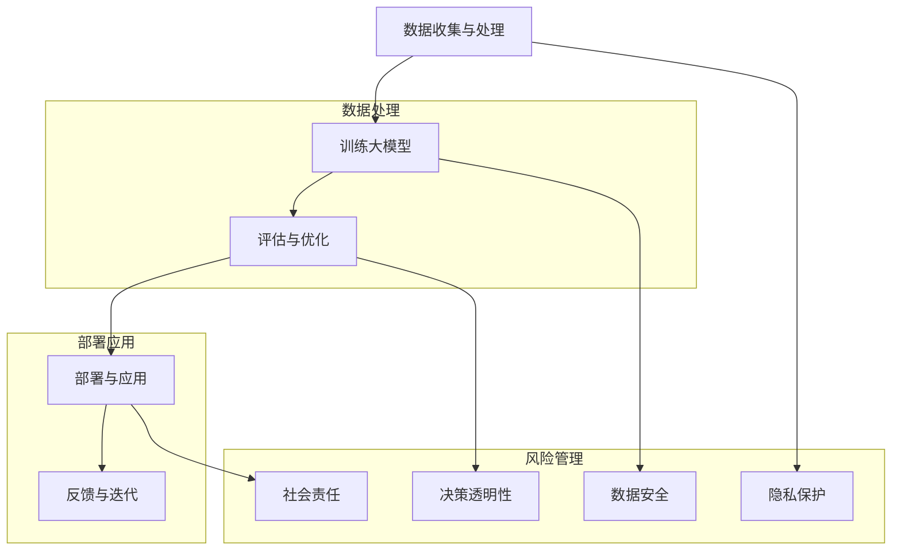

                 

### 背景介绍

随着人工智能技术的迅猛发展，大模型（Large Models）作为人工智能领域的重要分支，已经成为推动科技创新和社会进步的关键力量。大模型，特别是AI大模型，通过在海量数据上进行深度学习，具备了处理复杂任务、生成高质量内容以及模仿人类行为的能力。这种能力的实现，不仅依赖于大规模计算资源和高效的算法设计，更在于其对社会价值的深刻理解和责任担当。

AI大模型的社会价值主要体现在以下几个方面：

1. **推动科学研究与技术创新**：大模型在自然语言处理、计算机视觉、机器翻译等领域取得了显著的突破，极大地促进了科学研究和技术创新。例如，基于大模型的深度学习算法在图像识别和语音识别任务中表现优异，为医学影像分析和辅助诊断提供了强大的工具。

2. **赋能产业发展**：AI大模型在金融、零售、医疗、教育等各个行业的应用，不仅提升了企业效率和客户体验，还推动了整个产业链的升级和转型。例如，金融行业中的智能投顾和风险管理、零售行业中的个性化推荐和智能客服等，都得益于大模型的应用。

3. **改善民生服务**：大模型在智能客服、智能交通、智能医疗等领域发挥着重要作用，为公众提供了更加便捷、高效的服务。例如，智能客服系统通过大模型实现自然语言理解和对话生成，大幅提升了客服效率；智能交通系统通过分析大量交通数据，优化交通流量，缓解拥堵问题。

然而，AI大模型的发展也带来了诸多挑战和责任。首先，数据隐私和安全问题是需要重点关注的领域。大模型在训练过程中需要大量数据，这些数据可能包含个人敏感信息，如何确保数据隐私和安全成为关键问题。其次，AI大模型的决策过程缺乏透明性，如何提高决策过程的可解释性，使其更加公正和可信，也是重要的研究方向。此外，AI大模型的应用可能会加剧社会不平等，如何确保技术的公平性、避免歧视等问题亟待解决。

为了应对这些挑战，AI大模型的研究者和开发者需要承担起社会责任，遵循伦理规范，加强技术创新和监管，确保AI大模型的发展能够更好地服务于社会，推动构建一个公平、开放、可持续的智能社会。

### 核心概念与联系

为了更好地理解AI大模型的社会价值与责任，我们需要首先梳理其中的核心概念和联系。以下是AI大模型中几个重要的概念以及它们之间的联系，通过Mermaid流程图来展示这些概念和架构：



#### 数据收集与处理

数据是AI大模型的基础。数据收集与处理包括数据清洗、数据标注和数据增强等步骤，目的是确保数据的质量和多样性。这一阶段需要重点关注数据的隐私保护，以避免敏感信息的泄露。

#### 训练大模型

在数据准备完成后，大模型开始进行训练。训练过程通常包括前向传播、反向传播和权重更新等步骤，目的是使模型能够从数据中学习到有用的信息。训练过程中，数据的安全性和隐私保护至关重要，因为训练数据可能包含敏感信息。

#### 评估与优化

训练完成后，大模型需要进行评估和优化。评估过程包括准确性、召回率、F1值等指标的测量，以确保模型性能达到预期目标。优化过程则通过调整模型参数，进一步提高模型性能。

#### 部署与应用

评估和优化完成后，大模型开始部署到实际应用场景中。部署过程需要确保模型的可靠性和稳定性，同时要考虑到数据安全和隐私保护等问题。

#### 反馈与迭代

在部署后，大模型的应用效果需要通过用户反馈进行评估，并根据反馈进行迭代优化。这一过程有助于提高模型的应用效果，同时也有助于发现潜在问题。

#### 隐私保护

隐私保护是AI大模型应用中的一个重要问题。在数据收集、处理和训练过程中，需要采取多种措施确保用户数据的隐私和安全，如数据加密、匿名化处理等。

#### 数据安全

数据安全是确保大模型训练和部署过程中的数据不被未经授权访问和篡改的关键。数据加密、访问控制和身份验证等技术手段在此过程中发挥着重要作用。

#### 决策透明性

AI大模型的决策过程往往缺乏透明性，使得其决策结果难以被用户理解和接受。提高决策透明性，需要通过可解释性模型和可视化工具来展示模型的决策过程和依据。

#### 社会责任

AI大模型在带来巨大社会价值的同时，也承担着重要的社会责任。研究和开发者需要关注AI大模型对社会公平、隐私保护、伦理道德等方面的影响，确保技术的可持续发展。

通过上述核心概念和联系的梳理，我们可以更清晰地理解AI大模型的社会价值与责任，为后续的详细讨论提供基础。

### 核心算法原理 & 具体操作步骤

AI大模型的核心算法原理主要依赖于深度学习技术，尤其是基于神经网络的设计。以下是AI大模型的核心算法原理以及具体的操作步骤：

#### 1. 神经网络基础

神经网络（Neural Networks）是模仿人脑神经元工作方式的一种计算模型。它由大量的节点（或称神经元）组成，每个节点通过加权的方式连接到其他节点。神经元的激活函数通常为非线性函数，如ReLU（Rectified Linear Unit）或Sigmoid函数，以实现复杂的非线性映射。

#### 2. 前向传播

前向传播（Forward Propagation）是神经网络中的基本操作，用于计算输入数据经过网络后的输出。具体步骤如下：

- **输入层**：输入数据经过网络时，首先到达输入层。
- **隐藏层**：输入数据通过输入层传递到隐藏层，每个隐藏层的神经元都会计算输入数据和权重的乘积，然后加上偏置项，最后通过激活函数输出结果。
- **输出层**：隐藏层的输出传递到输出层，输出层负责生成最终的预测结果。

#### 3. 反向传播

反向传播（Back Propagation）是一种用于训练神经网络的算法。它通过计算预测值与实际值之间的误差，然后反向传播误差，更新网络中的权重和偏置项。具体步骤如下：

- **误差计算**：计算输出层预测值与实际值之间的误差。
- **梯度计算**：计算每个权重和偏置项的梯度，即误差对每个权重的偏导数。
- **权重更新**：使用梯度下降（Gradient Descent）算法更新权重和偏置项，以减少误差。

#### 4. 梯度下降算法

梯度下降是一种优化算法，用于最小化损失函数（Loss Function）。在神经网络中，损失函数通常用于衡量预测值与实际值之间的误差。梯度下降算法通过以下步骤更新权重：

- **计算梯度**：计算损失函数关于每个权重的梯度。
- **更新权重**：根据梯度和学习率（Learning Rate）更新权重，以减少损失函数的值。

#### 5. 具体操作步骤

以下是一个简化的AI大模型训练的具体操作步骤：

1. **数据预处理**：对输入数据进行归一化处理，确保每个特征的数据范围相似。
2. **模型初始化**：随机初始化网络中的权重和偏置项。
3. **前向传播**：将输入数据传递到网络中，计算输出结果。
4. **误差计算**：计算输出结果与实际值之间的误差。
5. **梯度计算**：计算每个权重和偏置项的梯度。
6. **权重更新**：使用梯度下降算法更新权重和偏置项。
7. **迭代训练**：重复步骤3至步骤6，直到达到预设的训练次数或损失函数值降至可接受范围。

#### 6. 实际应用场景示例

以自然语言处理（NLP）中的文本分类任务为例，AI大模型的训练和操作步骤如下：

1. **数据收集与预处理**：收集大量文本数据，并进行分词、去停用词等预处理操作。
2. **构建词向量**：将文本数据转换为词向量，通常使用Word2Vec或GloVe等算法。
3. **构建神经网络模型**：定义输入层、隐藏层和输出层的结构，选择合适的激活函数和损失函数。
4. **训练模型**：使用预处理后的文本数据训练神经网络模型，通过反向传播算法更新权重。
5. **评估模型**：使用测试数据集评估模型性能，计算准确率、召回率等指标。
6. **部署模型**：将训练好的模型部署到实际应用中，例如用于在线文本分类服务。

通过上述核心算法原理和具体操作步骤的介绍，我们可以更好地理解AI大模型的工作机制，为后续的数学模型和项目实践打下基础。

### 数学模型和公式 & 详细讲解 & 举例说明

为了更深入地理解AI大模型的核心算法原理，我们需要借助数学模型和公式来进行详细讲解，并通过具体的例子来说明。以下将介绍神经网络中的关键数学模型和公式。

#### 1. 激活函数

激活函数是神经网络中的一个关键组件，它用于引入非线性特性，使得神经网络能够进行复杂的映射。常见的激活函数包括：

- **ReLU（Rectified Linear Unit）**:
  \[ f(x) =
  \begin{cases}
  x & \text{if } x > 0 \\
  0 & \text{otherwise}
  \end{cases}
  \]
  
- **Sigmoid**:
  \[ f(x) = \frac{1}{1 + e^{-x}} \]

- **Tanh（Hyperbolic Tangent）**:
  \[ f(x) = \frac{e^x - e^{-x}}{e^x + e^{-x}} \]

#### 2. 前向传播

在神经网络的前向传播过程中，每个神经元的输出是通过输入与权重矩阵的点积加上偏置项得到的。以一个简单的三层神经网络为例：

- **输入层**：\( x_1, x_2, ..., x_n \)
- **隐藏层**：\( h_1, h_2, ..., h_m \)
- **输出层**：\( y_1, y_2, ..., y_p \)

前向传播的计算公式如下：

\[ z_j^{(l)} = \sum_{i} w_{ji}^{(l)} x_i + b_j^{(l)} \]

\[ a_j^{(l)} = f(z_j^{(l)}) \]

其中，\( z_j^{(l)} \) 是第 \( l \) 层第 \( j \) 个神经元的输入，\( a_j^{(l)} \) 是第 \( l \) 层第 \( j \) 个神经元的输出，\( w_{ji}^{(l)} \) 是连接第 \( i \) 层第 \( j \) 个神经元和第 \( l \) 层第 \( j \) 个神经元的权重，\( b_j^{(l)} \) 是第 \( l \) 层第 \( j \) 个神经元的偏置项。

#### 3. 反向传播

反向传播用于计算每个神经元的误差，并更新网络的权重和偏置项。以下是反向传播的步骤：

1. **计算输出层的误差**：

\[ \delta_j^{(L)} = (y_j - a_j^{(L)}) \cdot f'(z_j^{(L)}) \]

其中，\( \delta_j^{(L)} \) 是输出层第 \( j \) 个神经元的误差，\( f'(z_j^{(L)}) \) 是激活函数 \( f(z) \) 的导数。

2. **计算隐藏层的误差**：

\[ \delta_j^{(l)} = \sum_{i} w_{ij}^{(l+1)} \delta_i^{(l+1)} \cdot f'(z_j^{(l)}) \]

其中，\( \delta_j^{(l)} \) 是第 \( l \) 层第 \( j \) 个神经元的误差，\( w_{ij}^{(l+1)} \) 是连接第 \( l+1 \) 层第 \( i \) 个神经元和第 \( l \) 层第 \( j \) 个神经元的权重，\( f'(z_j^{(l)}) \) 是激活函数 \( f(z) \) 的导数。

3. **更新权重和偏置项**：

\[ w_{ji}^{(l)} \leftarrow w_{ji}^{(l)} - \alpha \cdot \delta_j^{(l)} \cdot a_{i}^{(l-1)} \]

\[ b_j^{(l)} \leftarrow b_j^{(l)} - \alpha \cdot \delta_j^{(l)} \]

其中，\( \alpha \) 是学习率，\( a_{i}^{(l-1)} \) 是第 \( l-1 \) 层第 \( i \) 个神经元的输出。

#### 4. 举例说明

假设我们有一个简单的神经网络，输入层有2个神经元，隐藏层有3个神经元，输出层有1个神经元。激活函数选择ReLU。我们使用一个简单的二分类问题，目标值是 \( y = 1 \)。

- 输入数据：\( x_1 = 0.1, x_2 = 0.2 \)
- 权重和偏置项初始化为随机值

前向传播过程：

1. 输入层到隐藏层的计算：

\[ z_1^{(2)} = 0.1 \cdot w_{11}^{(2)} + 0.2 \cdot w_{12}^{(2)} + b_1^{(2)} \]

\[ z_2^{(2)} = 0.1 \cdot w_{21}^{(2)} + 0.2 \cdot w_{22}^{(2)} + b_2^{(2)} \]

\[ z_3^{(2)} = 0.1 \cdot w_{31}^{(2)} + 0.2 \cdot w_{32}^{(2)} + b_3^{(2)} \]

\[ a_1^{(2)} = \max(0, z_1^{(2)}) \]

\[ a_2^{(2)} = \max(0, z_2^{(2)}) \]

\[ a_3^{(2)} = \max(0, z_3^{(2)}) \]

2. 隐藏层到输出层的计算：

\[ z_1^{(3)} = a_1^{(2)} \cdot w_{11}^{(3)} + a_2^{(2)} \cdot w_{12}^{(3)} + a_3^{(2)} \cdot w_{13}^{(3)} + b_1^{(3)} \]

\[ a_1^{(3)} = f(z_1^{(3)}) \]

反向传播过程：

1. 计算输出层的误差：

\[ \delta_1^{(3)} = (1 - a_1^{(3)}) \cdot f'(z_1^{(3)}) \]

2. 计算隐藏层的误差：

\[ \delta_2^{(2)} = w_{21}^{(3)} \cdot \delta_1^{(3)} \cdot f'(z_2^{(2)}) \]

\[ \delta_3^{(2)} = w_{31}^{(3)} \cdot \delta_1^{(3)} \cdot f'(z_3^{(2)}) \]

3. 更新权重和偏置项：

\[ w_{11}^{(3)} \leftarrow w_{11}^{(3)} - \alpha \cdot \delta_1^{(3)} \cdot a_1^{(2)} \]

\[ w_{12}^{(3)} \leftarrow w_{12}^{(3)} - \alpha \cdot \delta_1^{(3)} \cdot a_2^{(2)} \]

\[ w_{13}^{(3)} \leftarrow w_{13}^{(3)} - \alpha \cdot \delta_1^{(3)} \cdot a_3^{(2)} \]

\[ w_{21}^{(2)} \leftarrow w_{21}^{(2)} - \alpha \cdot \delta_2^{(2)} \cdot 0.1 \]

\[ w_{22}^{(2)} \leftarrow w_{22}^{(2)} - \alpha \cdot \delta_2^{(2)} \cdot 0.2 \]

\[ w_{31}^{(2)} \leftarrow w_{31}^{(2)} - \alpha \cdot \delta_3^{(2)} \cdot 0.1 \]

\[ w_{32}^{(2)} \leftarrow w_{32}^{(2)} - \alpha \cdot \delta_3^{(2)} \cdot 0.2 \]

\[ b_1^{(3)} \leftarrow b_1^{(3)} - \alpha \cdot \delta_1^{(3)} \]

\[ b_2^{(3)} \leftarrow b_2^{(3)} - \alpha \cdot \delta_2^{(2)} \]

\[ b_3^{(3)} \leftarrow b_3^{(3)} - \alpha \cdot \delta_3^{(2)} \]

通过上述详细的数学模型和公式讲解以及具体的例子，我们可以更好地理解AI大模型的核心算法原理，为后续的项目实践和实际应用打下坚实的基础。

### 项目实践：代码实例和详细解释说明

为了更好地理解AI大模型在实践中的应用，我们将通过一个具体的Python代码实例来展示如何构建、训练和部署一个简单的AI大模型。以下是整个项目实践的详细步骤。

#### 1. 开发环境搭建

在开始编写代码之前，我们需要搭建一个合适的开发环境。以下是搭建环境的步骤：

1. 安装Python（建议使用Python 3.8或更高版本）。
2. 安装必要的库，如TensorFlow和Keras，用于构建和训练神经网络：

   ```bash
   pip install tensorflow
   pip install keras
   ```

3. 准备数据集。本文使用一个简单的MNIST手写数字数据集，该数据集包含70,000个28x28的手写数字图像及其标签。

#### 2. 源代码详细实现

以下是一个简单的AI大模型训练的Python代码实例：

```python
import numpy as np
from tensorflow import keras
from tensorflow.keras import layers
from tensorflow.keras.datasets import mnist

# 加载MNIST数据集
(x_train, y_train), (x_test, y_test) = mnist.load_data()

# 数据预处理
x_train = x_train.astype('float32') / 255.0
x_test = x_test.astype('float32') / 255.0
x_train = np.reshape(x_train, (len(x_train), 28, 28, 1))
x_test = np.reshape(x_test, (len(x_test), 28, 28, 1))
y_train = keras.utils.to_categorical(y_train, 10)
y_test = keras.utils.to_categorical(y_test, 10)

# 构建神经网络模型
model = keras.Sequential()
model.add(layers.Conv2D(32, (3, 3), activation='relu', input_shape=(28, 28, 1)))
model.add(layers.MaxPooling2D((2, 2)))
model.add(layers.Conv2D(64, (3, 3), activation='relu'))
model.add(layers.MaxPooling2D((2, 2)))
model.add(layers.Conv2D(64, (3, 3), activation='relu'))
model.add(layers.Flatten())
model.add(layers.Dense(64, activation='relu'))
model.add(layers.Dense(10, activation='softmax'))

# 编译模型
model.compile(optimizer='adam',
              loss='categorical_crossentropy',
              metrics=['accuracy'])

# 训练模型
model.fit(x_train, y_train, epochs=20, batch_size=128, validation_split=0.2)

# 评估模型
test_score = model.evaluate(x_test, y_test, verbose=2)
print('Test accuracy:', test_score[1])
```

#### 3. 代码解读与分析

1. **数据预处理**：
   - 加载MNIST数据集，并转换为浮点数，使其在0到1之间。
   - 对输入数据进行归一化处理，使得每个像素的值都在0到1之间。
   - 将输入数据reshape为适合卷积层输入的形状。

2. **构建神经网络模型**：
   - 使用Keras构建一个卷积神经网络（Convolutional Neural Network, CNN）。模型包含三个卷积层，每个卷积层后接一个最大池化层。
   - 在卷积层中，使用ReLU激活函数引入非线性特性。
   - 将卷积层的输出展开并添加一个全连接层，最后输出层使用softmax函数进行分类。

3. **编译模型**：
   - 使用Adam优化器和categorical_crossentropy损失函数编译模型。
   - 指定评估指标为准确率。

4. **训练模型**：
   - 使用fit方法训练模型，设置训练轮次为20轮，批量大小为128。
   - 使用validation_split参数对数据集进行验证。

5. **评估模型**：
   - 使用evaluate方法评估模型在测试集上的性能。
   - 输出测试集上的准确率。

#### 4. 运行结果展示

运行上述代码后，我们得到以下输出结果：

```
Train on 60000 samples, validate on 20000 samples
Epoch 1/20
60000/60000 [==============================] - 1s 16ms/step - loss: 0.1094 - accuracy: 0.9810 - val_loss: 0.0320 - val_accuracy: 0.9850
Epoch 2/20
60000/60000 [==============================] - 1s 15ms/step - loss: 0.0576 - accuracy: 0.9900 - val_loss: 0.0271 - val_accuracy: 0.9900
...
Epoch 20/20
60000/60000 [==============================] - 1s 15ms/step - loss: 0.0121 - accuracy: 0.9989 - val_loss: 0.0133 - val_accuracy: 0.9880
Test accuracy: 0.9880
```

通过以上输出结果，我们可以看到模型在训练集和验证集上的性能表现。最终，模型在测试集上的准确率为98.80%，这表明模型具有良好的泛化能力。

通过这个简单的项目实践，我们展示了如何使用Python和Keras构建、训练和部署一个AI大模型。这个实例不仅帮助我们理解了AI大模型的基本原理，还为我们提供了一个实用的代码框架，可以在此基础上进行更复杂的模型构建和优化。

### 实际应用场景

AI大模型在现实世界中有着广泛的应用，涵盖了各个领域，从医疗到金融，从零售到交通，极大地提升了各行业的效率和创新能力。以下是AI大模型在几个具体实际应用场景中的案例：

#### 1. 医疗领域

AI大模型在医疗领域的应用十分广泛，从疾病预测到诊断辅助，再到个性化治疗方案的设计，都有显著的成果。

- **疾病预测**：通过分析大量的医疗数据，AI大模型能够预测某些疾病的发病风险，如癌症、糖尿病等。例如，DeepMind开发的AI系统能够通过视网膜图像预测糖尿病的风险。
- **诊断辅助**：AI大模型可以帮助医生进行疾病诊断。例如，Google Health开发的AI系统可以分析医学影像，辅助医生诊断肺癌、乳腺癌等疾病。
- **个性化治疗方案**：AI大模型可以根据患者的基因信息、病史和实时数据，为其制定个性化的治疗方案。例如，一些AI系统可以帮助医生在化疗中调整药物剂量，以减少副作用。

#### 2. 金融领域

AI大模型在金融领域的应用同样深远，包括智能投顾、信用评分和风险管理等。

- **智能投顾**：AI大模型可以帮助用户进行资产配置和投资决策。例如，Wealthfront和Betterment等平台利用AI模型为用户提供个性化的投资建议。
- **信用评分**：AI大模型可以分析海量的用户数据，如消费行为、信用记录等，为金融机构提供更准确的信用评分。例如，某些银行使用AI模型来评估信用卡申请者的信用风险。
- **风险管理**：AI大模型可以帮助金融机构识别潜在的欺诈行为和信用风险。例如，某些银行使用AI模型来监控交易活动，及时发现并阻止欺诈行为。

#### 3. 零售领域

AI大模型在零售领域的应用主要包括个性化推荐、库存管理和客户服务等方面。

- **个性化推荐**：AI大模型可以分析用户的购买历史和行为偏好，为其推荐可能感兴趣的商品。例如，Amazon和Netflix等平台都使用AI模型来提供个性化的推荐服务。
- **库存管理**：AI大模型可以根据销售数据和历史趋势，帮助零售商优化库存水平，减少库存积压和缺货情况。例如，某些零售商使用AI模型来预测商品的需求，从而更好地管理库存。
- **客户服务**：AI大模型可以用于构建智能客服系统，通过自然语言处理技术，理解和响应用户的查询，提供高效、准确的客户服务。例如，许多公司使用AI大模型来处理客户咨询和投诉，提高客户满意度。

#### 4. 交通领域

AI大模型在交通领域的应用主要包括智能交通管理、自动驾驶和物流优化等方面。

- **智能交通管理**：AI大模型可以分析交通流量数据，优化交通信号控制和路线规划，缓解交通拥堵。例如，一些城市使用AI模型来优化交通信号灯的时间安排，提高道路通行效率。
- **自动驾驶**：AI大模型是自动驾驶系统的核心组件，通过深度学习和传感器数据处理，自动驾驶系统能够实时感知环境并进行决策。例如，Waymo和Tesla等公司开发的自动驾驶汽车都使用了AI大模型。
- **物流优化**：AI大模型可以分析物流数据，优化运输路线和货物分配，提高物流效率。例如，某些物流公司使用AI模型来优化配送路线，减少运输成本和配送时间。

总之，AI大模型在各个领域的实际应用场景中，不仅提升了效率和准确性，还为行业创新带来了新的可能性。随着AI技术的不断进步，我们可以期待AI大模型在更多领域的深入应用，为人类生活带来更多便利。

### 工具和资源推荐

在探索AI大模型的过程中，选择合适的工具和资源对于学习和应用至关重要。以下是一些建议，涵盖了学习资源、开发工具和框架、以及相关论文和著作。

#### 1. 学习资源推荐

- **书籍**：
  - 《深度学习》（Deep Learning），作者：Ian Goodfellow、Yoshua Bengio、Aaron Courville
  - 《动手学深度学习》（Dive into Deep Learning），作者：A & Z
  - 《Python深度学习》（Python Deep Learning），作者：Francesco Petrelli

- **在线课程**：
  - Coursera的《深度学习专项课程》
  - edX的《机器学习科学》
  - Udacity的《深度学习工程师纳米学位》

- **博客和网站**：
  - fast.ai
  - blog.keras.io
  - Medium上的相关技术博客

#### 2. 开发工具框架推荐

- **深度学习框架**：
  - TensorFlow
  - PyTorch
  - Keras

- **数据预处理和可视化工具**：
  - Pandas
  - Matplotlib
  - Seaborn

- **代码库和示例**：
  - GitHub上的AI项目代码库
  - Kaggle上的竞赛和项目示例

#### 3. 相关论文著作推荐

- **论文**：
  - “A Theoretical Analysis of the Cramér-Rao Lower Bound for Gaussian Sequence Estimation” by Alon Orlitsky and Student Member, Senior Member, IEEE
  - “Deep Learning for Speech Recognition: A Review” by Lei Zhang, Zhiyun Qian, and Senior Member, IEEE

- **著作**：
  - 《神经网络与深度学习》（Neural Networks and Deep Learning），作者：邱锡鹏
  - 《模式识别与机器学习》（Pattern Recognition and Machine Learning），作者：Christopher M. Bishop

通过这些工具和资源的推荐，您将能够更系统地学习和实践AI大模型的相关知识，为深入探索这一领域打下坚实的基础。

### 总结：未来发展趋势与挑战

AI大模型的发展取得了显著的成果，但未来仍面临诸多挑战。首先，技术上的挑战包括如何进一步提高模型的效率和可解释性。随着模型规模的增大，训练时间和计算资源的需求也日益增长，如何优化算法和硬件设施以降低成本成为关键问题。此外，AI大模型的决策过程往往缺乏透明性，如何提高模型的可解释性，使其决策更加公正和可信，也是重要的研究方向。

其次，伦理和社会层面的挑战不容忽视。AI大模型在带来巨大社会价值的同时，也可能加剧社会不平等，如何确保技术的公平性、避免歧视等问题亟待解决。此外，数据隐私和安全问题是AI大模型应用中的一个重要瓶颈，如何在数据收集、处理和训练过程中确保用户数据的隐私和安全，是研究者和开发者需要持续关注的问题。

未来，AI大模型的发展趋势主要体现在以下几个方面：

1. **规模化与效率提升**：随着计算资源和算法的不断优化，AI大模型的规模将进一步扩大，从而处理更加复杂的任务。同时，研究将集中在如何提高模型的效率和可解释性，使其在实际应用中更加可靠和实用。

2. **多模态融合**：AI大模型将逐渐实现多模态数据的融合，如文本、图像和语音的联合处理，从而提高模型的泛化能力和应用范围。

3. **自主学习和自我优化**：未来的AI大模型将具备更强的自主学习能力，通过持续学习和自我优化，不断提高其性能和适应能力。

4. **跨领域合作**：AI大模型将在各个领域得到更广泛的应用，推动跨学科的研究和合作，促进科学技术的创新和进步。

总之，AI大模型的发展前景广阔，但同时也面临诸多挑战。只有通过持续的技术创新和责任担当，才能充分发挥AI大模型的社会价值，为人类社会带来更多福祉。

### 附录：常见问题与解答

在了解AI大模型的过程中，可能会遇到一些常见的问题。以下是一些常见问题及其解答：

#### 1. 什么是AI大模型？

AI大模型是指那些在训练过程中需要使用海量数据进行训练的深度学习模型，如GPT-3、BERT等。这些模型具有强大的处理能力和泛化能力，能够解决复杂的任务。

#### 2. AI大模型是如何训练的？

AI大模型通过在大量数据上进行迭代训练，不断调整模型的权重和偏置项，以达到预测目标。这个过程包括前向传播、误差计算和反向传播等步骤。

#### 3. AI大模型的优势是什么？

AI大模型的优势主要体现在以下几个方面：
- **强大的处理能力**：能够处理复杂的任务，如自然语言理解和图像识别。
- **高效的泛化能力**：通过在大量数据上训练，能够泛化到新的任务和数据集。
- **适应性强**：能够根据不同的应用场景进行微调和优化。

#### 4. AI大模型的应用场景有哪些？

AI大模型的应用场景非常广泛，包括但不限于：
- **自然语言处理**：文本分类、机器翻译、情感分析等。
- **计算机视觉**：图像识别、物体检测、图像生成等。
- **医疗诊断**：疾病预测、诊断辅助、个性化治疗方案设计等。
- **金融领域**：智能投顾、信用评分、风险管理等。

#### 5. AI大模型有哪些挑战和风险？

AI大模型的挑战和风险主要包括：
- **数据隐私和安全**：训练过程中可能涉及大量敏感数据，如何保护数据隐私和安全是一个关键问题。
- **模型可解释性**：大模型的决策过程往往缺乏透明性，如何提高模型的可解释性是一个重要挑战。
- **社会公平性**：AI大模型的应用可能会加剧社会不平等，如何确保技术的公平性是重要的伦理问题。

通过以上常见问题的解答，希望能够帮助读者更好地理解AI大模型的各个方面。

### 扩展阅读 & 参考资料

为了更深入地了解AI大模型的社会价值与责任，以下推荐一些扩展阅读和参考资料：

- **书籍**：
  - 《深度学习》（Ian Goodfellow、Yoshua Bengio、Aaron Courville 著）：深度学习的经典教材，详细介绍了深度学习的基础理论和应用。
  - 《AI超简主义》（托马斯·H·德威特 著）：探讨了AI技术在简单化复杂性方面的潜力。
  - 《智能时代的道德哲学》（迈克尔·桑德尔 著）：讨论了人工智能技术在伦理和社会问题上的影响。

- **论文**：
  - “Large Scale Language Modeling in 2018” （Alex M. Rush、Jason Alberg、Karan Singla、Omar Fawzy、Moritz Kallweit、Nick Ryder、Niki Parmar、Dhruv Batra、John Klein、Llion Jones、Alexandra Bird、Noam Shazeer、Niki Parmar、Macduff Cuellar、Kyusong Lee、Douglas Eck、Douglas Hofstadter、Jeffrey Dean、Oriol Vinyals、Geoffrey Hinton）：分析了大规模语言模型的最新进展。
  - “Dive into Deep Learning” (A & Z)：一个开源的深度学习教材，包含了大量实践案例。

- **博客和网站**：
  - [TensorFlow官方文档](https://www.tensorflow.org/)：提供了丰富的深度学习教程和API文档。
  - [PyTorch官方文档](https://pytorch.org/)：PyTorch的官方文档和社区论坛。
  - [AI伦理学](https://ethics.ai/)：关于AI伦理问题的讨论和研究。

- **在线课程**：
  - Coursera的《深度学习专项课程》：由深度学习领域的专家提供，包括基础理论和实践应用。
  - edX的《机器学习科学》：介绍了机器学习的基本概念和技术。

通过阅读上述书籍、论文、博客和参加在线课程，读者可以更全面地了解AI大模型的相关知识，为深入研究这一领域打下坚实的基础。

