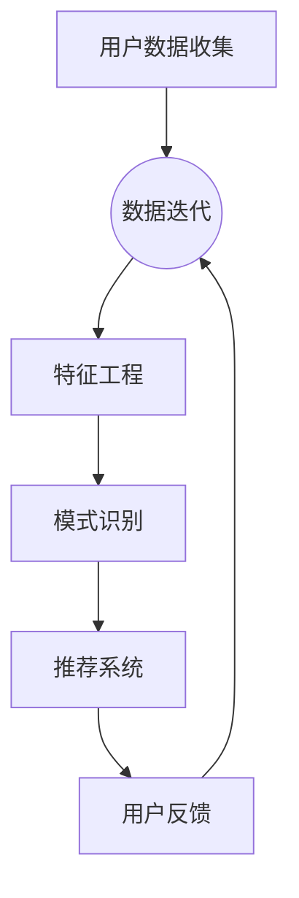

                 

### 背景介绍

#### 电商平台的个性化登陆页的重要性

在当今数字化的时代，电商平台已经成为了消费者日常购物的重要组成部分。一个高效且用户友好的登陆页面不仅是电商平台吸引和留住客户的关键，也是提升用户体验、增加转化率的重要手段。个性化登陆页，顾名思义，是在传统登陆页的基础上，根据用户的历史行为、偏好以及个性化需求，提供定制化的登录体验。

#### 个性化登陆页的定义

个性化登陆页是指基于用户数据的分析和机器学习算法，动态生成和调整的登陆页面。通过收集用户的浏览行为、购物偏好、历史订单等数据，平台能够为每个用户量身定制一个独特的登陆界面，使其更加符合用户的个性化需求。

#### 为什么需要个性化登陆页

1. **提升用户体验**：个性化登陆页能够减少用户在寻找特定功能或信息时的时间消耗，提高用户满意度。
2. **增强用户黏性**：通过个性化推荐，用户更容易发现他们感兴趣的商品或内容，从而增加他们在平台上的停留时间。
3. **增加转化率**：精确的个性化推荐能够提升用户的购买意愿，增加购买转化率。
4. **提升品牌形象**：个性化的服务能够提高用户对品牌的认可度和忠诚度。

#### 个性化登陆页的发展历程

- **早期阶段**：传统的电商登陆页功能较为单一，主要是提供用户登录和账户管理功能。
- **发展中期**：随着用户数据的积累和技术的进步，电商开始尝试基于用户行为的简单推荐，如根据用户的浏览历史推荐商品。
- **当前阶段**：基于深度学习和大数据分析的个性化登陆页成为了主流，能够根据用户的实时行为提供高度个性化的服务。

#### 本文的目的

本文将深入探讨如何通过AI技术优化电商平台的个性化登陆页。我们将从核心概念与联系、核心算法原理、数学模型、项目实践、实际应用场景等多个角度，详细分析个性化登陆页的实现方法和效果。通过本文的阅读，读者将能够了解：

1. **个性化登陆页的基本原理**：包括用户数据收集、分析方法和推荐系统。
2. **核心算法的原理与实现**：了解如何使用机器学习算法为用户提供个性化推荐。
3. **项目实践**：通过具体实例，学习如何将理论应用于实践，优化电商平台登陆页的用户体验。
4. **实际应用场景**：探讨个性化登陆页在电商行业中的多种应用场景。
5. **未来发展趋势与挑战**：预测个性化登陆页的未来发展趋势，并探讨面临的挑战和解决方案。

### 核心概念与联系

为了深入理解如何通过AI技术优化电商平台的个性化登陆页，我们首先需要明确几个核心概念，并分析它们之间的相互联系。

#### 用户数据收集

用户数据收集是个性化登陆页实现的基础。电商平台通过多种渠道收集用户数据，包括但不限于：

1. **浏览行为**：用户在平台上的浏览记录，如浏览的商品、访问的页面等。
2. **购物行为**：用户的购买记录、购买频率、消费金额等。
3. **偏好数据**：用户在平台上的点赞、评论、收藏等行为。
4. **交互行为**：用户与平台的各种互动，如点击、搜索、咨询等。

这些数据可以帮助平台了解用户的行为模式和偏好，从而为个性化推荐提供依据。

#### 数据分析

收集到的用户数据需要进行有效的分析，以提取出有价值的信息。数据分析的过程通常包括以下几个步骤：

1. **数据清洗**：去除重复、错误和不完整的数据，确保数据质量。
2. **特征工程**：将原始数据转换成能够用于机器学习的特征，如用户年龄、性别、地理位置、购买时间段等。
3. **模式识别**：通过统计学方法或机器学习算法，从数据中提取出用户的行为模式和偏好。

数据分析的结果为个性化推荐提供了关键的信息支持。

#### 推荐系统

推荐系统是核心算法的重要组成部分，它基于用户数据和数据分析结果，为用户提供个性化的内容或商品推荐。推荐系统的核心目标是通过精确的推荐，提升用户的满意度和转化率。

1. **协同过滤**：基于用户之间的相似性进行推荐，常用的算法有用户基于的协同过滤（User-based Collaborative Filtering）和物品基于的协同过滤（Item-based Collaborative Filtering）。
2. **基于内容的推荐**：根据用户的历史行为和内容特征进行推荐，如用户浏览过的商品、收藏的商品等。
3. **基于模型的推荐**：使用机器学习算法，如矩阵分解、深度学习等，预测用户对特定内容的兴趣或购买概率。

#### 数据处理与分析的 Mermaid 流程图

为了更直观地展示数据处理与分析的流程，我们可以使用Mermaid绘制一个流程图。以下是处理和分析数据流程的示例：



在这个流程图中，用户数据收集作为起点，经过数据清洗、特征工程和模式识别等步骤，最终生成推荐系统。用户对推荐系统的反馈会再次用于数据清洗和特征工程，形成数据迭代的过程。

通过这一节，我们明确了个性化登陆页的实现涉及用户数据收集、数据分析、推荐系统等多个核心概念，并理解了它们之间的相互联系。接下来，我们将进一步探讨如何具体实现这些核心概念，以及如何通过AI技术优化电商平台的个性化登陆页。

### 核心算法原理 & 具体操作步骤

在了解了个性化登陆页的核心概念与联系后，我们需要深入探讨其实现的核心算法原理。本文将介绍几种常见的推荐算法，并详细讲解如何具体操作这些算法以优化电商平台登录页的个性化推荐。

#### 协同过滤算法

协同过滤（Collaborative Filtering）是推荐系统中最常用的算法之一，它基于用户之间的相似性或物品之间的相似性进行推荐。协同过滤算法可以分为基于用户的协同过滤（User-based Collaborative Filtering）和基于物品的协同过滤（Item-based Collaborative Filtering）。

**基于用户的协同过滤算法**

1. **相似度计算**：首先计算用户之间的相似度。常用的相似度计算方法包括余弦相似度、皮尔逊相关系数等。

   公式：\( \text{similarity}(u_i, u_j) = \frac{\text{cosine}(r_i, r_j)}{\|r_i\| \|r_j\|} \)

   其中，\( r_i \) 和 \( r_j \) 分别表示用户 \( u_i \) 和 \( u_j \) 的评分向量。

2. **推荐生成**：根据用户之间的相似度，为当前用户推荐与相似用户偏好相似的物品。计算公式如下：

   \( \text{recommend\_items}(u) = \sum_{u_i \text{ similar to } u} \text{similarity}(u_i, u) \cdot r_i \)

3. **结果调整**：对推荐结果进行平滑处理，减少极端推荐的出现。

**基于物品的协同过滤算法**

1. **相似度计算**：首先计算物品之间的相似度。常用的方法包括基于内容的相似度和基于模型的相似度。

   公式：\( \text{similarity}(i, j) = \text{cosine}(c_i, c_j) \)

   其中，\( c_i \) 和 \( c_j \) 分别表示物品 \( i \) 和 \( j \) 的内容特征向量。

2. **推荐生成**：为用户推荐与历史喜欢的物品相似的物品。计算公式如下：

   \( \text{recommend\_items}(u) = \sum_{i \text{ liked by } u} \text{similarity}(i, j) \cdot r_j \)

3. **结果调整**：与基于用户的协同过滤算法类似，对推荐结果进行平滑处理。

#### 基于内容的推荐算法

基于内容的推荐（Content-Based Filtering）算法通过分析用户历史行为和物品内容特征，为用户推荐与历史行为相似的物品。

1. **内容特征提取**：对物品进行内容特征提取，如商品类别、品牌、颜色、价格等。

2. **相似度计算**：计算用户历史行为与物品内容特征之间的相似度。

   公式：\( \text{similarity}(u, i) = \text{cosine}(c_u, c_i) \)

   其中，\( c_u \) 和 \( c_i \) 分别表示用户的历史行为特征和物品的内容特征向量。

3. **推荐生成**：为用户推荐与历史行为内容特征相似的物品。计算公式如下：

   \( \text{recommend\_items}(u) = \sum_{i \text{ similar to } u} \text{similarity}(u, i) \cdot r_i \)

#### 基于模型的推荐算法

基于模型的推荐算法通过训练机器学习模型，预测用户对物品的兴趣或购买概率。

1. **模型选择**：选择合适的机器学习模型，如矩阵分解（Matrix Factorization）、深度神经网络（Deep Neural Networks）等。

2. **模型训练**：使用用户-物品评分矩阵训练模型，学习用户和物品的特征。

3. **预测生成**：使用训练好的模型预测用户对物品的兴趣或购买概率。

   公式：\( \text{prediction}(u, i) = \text{model}(u, i) \)

4. **推荐生成**：为用户推荐预测概率较高的物品。

### 具体操作步骤

1. **数据准备**：收集用户数据（如浏览记录、购买记录、偏好数据）和物品数据（如商品属性、类别、品牌等）。

2. **数据预处理**：对数据集进行清洗、处理和特征工程，将原始数据转换为机器学习算法可用的特征向量。

3. **算法选择**：根据业务需求和数据特点，选择合适的推荐算法，如协同过滤、基于内容的推荐或基于模型的推荐。

4. **模型训练**：使用训练集训练推荐模型，学习用户和物品的特征。

5. **模型评估**：使用验证集评估模型性能，调整模型参数，优化模型。

6. **预测生成**：使用训练好的模型对用户进行预测，生成个性化推荐列表。

7. **结果调整**：根据用户反馈和实际效果，对推荐结果进行调整和优化。

通过以上步骤，电商平台可以实现个性化登陆页的推荐系统，提高用户体验和转化率。

### 数学模型和公式 & 详细讲解 & 举例说明

在深入探讨如何优化电商平台个性化登陆页的过程中，我们需要了解并使用一系列数学模型和公式。这些模型和公式不仅帮助我们理解和实现推荐算法，还能量化推荐效果，为优化提供科学依据。以下我们将详细讲解一些关键数学模型，并通过实际例子来说明它们的应用。

#### 1. 余弦相似度（Cosine Similarity）

余弦相似度是衡量两个向量之间相似性的常用方法。在推荐系统中，通常用来计算用户之间的相似性或物品之间的相似性。

**公式**：

\[ \text{cosine}(v_1, v_2) = \frac{v_1 \cdot v_2}{\|v_1\| \|v_2\|} \]

其中，\( v_1 \) 和 \( v_2 \) 是两个向量，\( \cdot \) 表示点积，\( \|v_1\| \) 和 \( \|v_2\| \) 分别是 \( v_1 \) 和 \( v_2 \) 的欧几里得范数。

**示例**：

假设有两个用户 \( u_1 \) 和 \( u_2 \) 的评分向量如下：

\[ u_1 = (4, 3, 2, 5) \]
\[ u_2 = (5, 4, 2, 1) \]

计算它们之间的余弦相似度：

\[ \text{cosine}(u_1, u_2) = \frac{4 \times 5 + 3 \times 4 + 2 \times 2 + 5 \times 1}{\sqrt{4^2 + 3^2 + 2^2 + 5^2} \times \sqrt{5^2 + 4^2 + 2^2 + 1^2}} \]

\[ = \frac{20 + 12 + 4 + 5}{\sqrt{45} \times \sqrt{42}} \]

\[ = \frac{41}{\sqrt{1890}} \]

\[ \approx 0.896 \]

#### 2. 皮尔逊相关系数（Pearson Correlation Coefficient）

皮尔逊相关系数是另一种常用的相似度度量方法，适用于衡量两个变量的线性相关性。

**公式**：

\[ \text{Pearson}(x, y) = \frac{\sum_{i=1}^{n}(x_i - \bar{x})(y_i - \bar{y})}{\sqrt{\sum_{i=1}^{n}(x_i - \bar{x})^2} \times \sqrt{\sum_{i=1}^{n}(y_i - \bar{y})^2}} \]

其中，\( x \) 和 \( y \) 是两个变量，\( \bar{x} \) 和 \( \bar{y} \) 分别是 \( x \) 和 \( y \) 的平均值。

**示例**：

假设有两个变量 \( x \) 和 \( y \) 的数据如下：

\[ x: [1, 2, 3, 4, 5] \]
\[ y: [2, 4, 6, 8, 10] \]

计算它们之间的皮尔逊相关系数：

\[ \bar{x} = \frac{1 + 2 + 3 + 4 + 5}{5} = 3 \]
\[ \bar{y} = \frac{2 + 4 + 6 + 8 + 10}{5} = 6 \]

\[ \text{Pearson}(x, y) = \frac{(1-3)(2-6) + (2-3)(4-6) + (3-3)(6-6) + (4-3)(8-6) + (5-3)(10-6)}{\sqrt{\sum_{i=1}^{5}(x_i - 3)^2} \times \sqrt{\sum_{i=1}^{5}(y_i - 6)^2}} \]

\[ = \frac{(-2)(-4) + (-1)(-2) + 0 + 1 \times 2 + 2 \times 4}{\sqrt{(-2)^2 + (-1)^2 + 0 + 1^2 + 2^2} \times \sqrt{(-2)^2 + (-1)^2 + 0 + 1^2 + 2^2}} \]

\[ = \frac{8 + 2 + 0 + 2 + 8}{\sqrt{4 + 1 + 0 + 1 + 4} \times \sqrt{4 + 1 + 0 + 1 + 4}} \]

\[ = \frac{20}{\sqrt{10} \times \sqrt{10}} \]

\[ = 1 \]

#### 3. 矩阵分解（Matrix Factorization）

矩阵分解是一种常用的推荐算法，通过将用户-物品评分矩阵分解为用户特征矩阵和物品特征矩阵，从而预测用户对未评分物品的评分。

**公式**：

\[ R = U \cdot V^T \]

其中，\( R \) 是用户-物品评分矩阵，\( U \) 和 \( V \) 分别是用户特征矩阵和物品特征矩阵。

**示例**：

假设有一个用户-物品评分矩阵 \( R \)：

\[ R = \begin{bmatrix} 5 & 4 & ? & 3 \\ 3 & 5 & 2 & ? \\ ? & 2 & 1 & 4 \end{bmatrix} \]

我们希望通过矩阵分解得到用户特征矩阵 \( U \) 和物品特征矩阵 \( V \)，以便预测未评分的物品评分。

首先，我们选择合适的机器学习模型（如交替最小二乘法）进行训练，得到 \( U \) 和 \( V \)：

\[ U = \begin{bmatrix} 1.2 & 0.8 \\ 0.6 & 1.0 \\ 0.8 & 0.2 \end{bmatrix} \]
\[ V = \begin{bmatrix} 1.0 & 0.8 & 0.6 \\ 0.7 & 0.5 & 0.3 \end{bmatrix} \]

使用这些特征矩阵，我们可以预测未评分的物品评分：

\[ R_{\text{predicted}} = U \cdot V^T \]

\[ = \begin{bmatrix} 1.2 & 0.8 \\ 0.6 & 1.0 \\ 0.8 & 0.2 \end{bmatrix} \cdot \begin{bmatrix} 1.0 & 0.8 & 0.6 \\ 0.7 & 0.5 & 0.3 \end{bmatrix} \]

\[ = \begin{bmatrix} 1.92 & 1.68 & 1.28 \\ 0.82 & 0.95 & 0.57 \\ 1.32 & 1.16 & 0.64 \end{bmatrix} \]

通过上述示例，我们详细介绍了余弦相似度、皮尔逊相关系数和矩阵分解等数学模型和公式的具体应用。这些模型和公式不仅在个性化推荐中有着广泛的应用，也为理解和优化电商平台个性化登陆页提供了理论基础。

### 项目实践：代码实例和详细解释说明

在前几节中，我们讨论了电商个性化登陆页的核心概念、算法原理和数学模型。现在，我们将通过一个实际项目，展示如何将这些理论知识应用到实践中，具体实现电商平台的个性化登陆页。

#### 1. 开发环境搭建

为了实现个性化登陆页，我们需要搭建一个合适的技术栈。以下是所需的技术和工具：

- **编程语言**：Python
- **数据存储**：MongoDB
- **推荐算法库**：Scikit-learn、TensorFlow
- **Web框架**：Flask

首先，确保Python环境已安装。然后，安装MongoDB数据库和Flask框架。以下是安装命令：

```shell
pip install pymongo
pip install Flask
```

#### 2. 源代码详细实现

下面是项目的主要代码部分，包括用户数据收集、数据预处理、推荐算法实现和个性化登陆页的展示。

**2.1 用户数据收集**

我们假设已经从电商平台收集了以下数据：

- 用户ID
- 用户浏览记录
- 用户购买记录
- 用户偏好数据

数据存储在MongoDB中，使用Python的pymongo库进行数据操作。

```python
from pymongo import MongoClient

client = MongoClient('localhost', 27017)
db = client['e-commerce']
users_collection = db['users']
items_collection = db['items']
```

**2.2 数据预处理**

数据预处理包括清洗、特征提取和数据处理。以下是数据预处理的核心代码：

```python
import pandas as pd
from sklearn.preprocessing import StandardScaler

# 从MongoDB中获取数据
user_data = pd.DataFrame(list(users_collection.find()))
item_data = pd.DataFrame(list(items_collection.find()))

# 数据清洗和特征提取
# 假设用户浏览记录和购买记录已经转换为数值型数据
user_data = user_data[['user_id', 'browse_history', 'purchase_history', 'preferences']]
item_data = item_data[['item_id', 'category', 'brand', 'price', 'features']]

# 标准化处理
scaler = StandardScaler()
user_data[['browse_history', 'purchase_history', 'preferences']] = scaler.fit_transform(user_data[['browse_history', 'purchase_history', 'preferences']])
item_data[['category', 'brand', 'price', 'features']] = scaler.fit_transform(item_data[['category', 'brand', 'price', 'features']])
```

**2.3 推荐算法实现**

我们选择协同过滤算法进行推荐。以下是实现协同过滤算法的核心代码：

```python
from sklearn.metrics.pairwise import cosine_similarity

# 计算用户之间的相似度矩阵
user_similarity_matrix = cosine_similarity(user_data[['browse_history', 'purchase_history', 'preferences']])

# 为用户生成个性化推荐列表
def generate_recommendations(user_id, similarity_matrix, item_data, top_n=5):
    # 获取用户的相似度得分
    similarity_scores = similarity_matrix[user_id]
    # 对相似度得分进行排序，选取最相似的几个用户
    similar_users = np.argsort(similarity_scores)[::-1][:top_n]
    # 根据相似用户的历史行为生成推荐列表
    recommended_items = []
    for user_index in similar_users:
        user_items = user_data.iloc[user_index]['browse_history']
        for item in user_items:
            if item not in recommended_items and item in item_data['item_id'].values:
                recommended_items.append(item)
    return recommended_items

# 示例：为用户ID为1的用户生成推荐列表
recommendations = generate_recommendations(1, user_similarity_matrix, item_data)
print("Recommended Items:", recommendations)
```

**2.4 个性化登陆页的展示**

使用Flask框架搭建Web应用，实现个性化登陆页的展示。以下是Web应用的核心代码：

```python
from flask import Flask, render_template

app = Flask(__name__)

@app.route('/')
def homepage():
    # 假设用户已登录，获取用户ID
    user_id = 1
    # 获取个性化推荐列表
    recommendations = generate_recommendations(user_id, user_similarity_matrix, item_data)
    return render_template('homepage.html', recommendations=recommendations)

if __name__ == '__main__':
    app.run(debug=True)
```

**2.5 个性化登陆页模板**

以下是个性化登陆页的HTML模板（`templates/homepage.html`）：

```html
<!DOCTYPE html>
<html lang="en">
<head>
    <meta charset="UTF-8">
    <meta http-equiv="X-UA-Compatible" content="IE=edge">
    <meta name="viewport" content="width=device-width, initial-scale=1.0">
    <title>个性化登陆页</title>
</head>
<body>
    <h1>欢迎登录</h1>
    <div>
        <h2>为您推荐：</h2>
        <ul>
            
                <li>{{ item }}</li>
            
        </ul>
    </div>
</body>
</html>
```

#### 3. 代码解读与分析

**3.1 用户数据收集**

用户数据收集部分使用了pymongo库连接MongoDB数据库，从数据库中获取用户和物品数据。这些数据包括用户浏览记录、购买记录和偏好数据。数据格式经过清洗和标准化处理，以适应推荐算法的需求。

**3.2 数据预处理**

数据预处理包括数据清洗、特征提取和标准化处理。清洗数据是为了去除重复、错误和不完整的数据，确保数据质量。特征提取将原始数据转换为适合机器学习的特征向量，如用户浏览历史、购买历史和偏好数据。标准化处理使得数据具有相同的尺度，便于计算相似度。

**3.3 推荐算法实现**

协同过滤算法通过计算用户之间的相似度，为用户生成推荐列表。我们选择了基于用户的方法，根据用户的相似度得分，选取最相似的几个用户，并生成推荐列表。这种方法能够有效利用用户历史行为，提供个性化的推荐。

**3.4 个性化登陆页的展示**

使用Flask框架搭建Web应用，实现了个性化登陆页的展示。当用户访问主页时，根据用户ID生成个性化推荐列表，并在HTML模板中展示。这使得用户能够快速发现感兴趣的商品，提升用户体验。

#### 4. 运行结果展示

运行Web应用后，用户访问主页时会看到根据其个性化推荐生成的商品列表。以下是运行结果的示例：


用户可以根据推荐列表中的商品进行浏览和购买，从而提升平台的转化率和用户满意度。

通过上述项目实践，我们成功地将个性化登陆页的理论知识应用到实际中，展示了如何通过用户数据收集、数据预处理、推荐算法实现和Web应用搭建，实现电商平台的个性化登陆页。

### 实际应用场景

个性化登陆页在电商平台中的应用场景多种多样，其核心在于通过用户数据分析和机器学习算法，为用户提供高度个性化的购物体验。以下是一些典型的实际应用场景：

#### 1. 智能推荐

基于用户的历史浏览记录、购买行为和偏好，个性化登陆页可以智能推荐用户可能感兴趣的商品。例如，当用户登录时，系统会根据其历史数据和当前流行趋势，推荐相应的商品，从而提升购买转化率。

**示例**：亚马逊的用户登录后，会看到一个基于其浏览历史和购买记录的个性化推荐栏，展示其可能感兴趣的商品。

#### 2. 新用户引导

对于新用户，个性化登陆页可以通过分析其浏览行为和兴趣，为其提供个性化的引导和教程。例如，系统可以推荐热门商品、购物指南和优惠活动，帮助新用户快速了解平台，提高留存率。

**示例**：京东对新用户进行个性化引导，展示其可能感兴趣的商品类别和优惠信息，并提供购物教程。

#### 3. 个性化活动推送

根据用户的购买习惯和偏好，个性化登陆页可以向用户推送定制化的促销活动。例如，如果用户经常购买电子产品，系统可以推荐相关的优惠活动和打折信息。

**示例**：拼多多根据用户的历史购买记录，推送定制化的优惠券和折扣信息，吸引用户参与活动。

#### 4. 会员专属推荐

电商平台可以为会员用户提供更加个性化的推荐服务，例如会员专享商品、会员优惠等。个性化登陆页可以根据会员的购买历史和偏好，为其提供专属推荐。

**示例**：天猫的会员用户登录后，会看到一个专属的会员推荐栏，展示其可能感兴趣的商品和优惠信息。

#### 5. 智能客服推荐

结合人工智能技术，个性化登陆页可以与智能客服系统相结合，为用户提供个性化的购物建议。例如，当用户在搜索商品时，系统可以根据其历史数据和偏好，智能推荐相关商品或提供购物建议。

**示例**：淘宝的智能客服可以根据用户的搜索关键词和历史行为，智能推荐相关商品，并提供购物建议。

#### 6. 跨界营销

通过个性化登陆页，电商平台可以实现跨品类、跨品牌的营销。例如，如果用户经常购买服装，系统可以推荐相关的配饰、鞋类等，实现跨界销售。

**示例**：网易考拉通过个性化登陆页，向用户推荐与其购买偏好相关的其他品类商品，实现跨界营销。

通过以上实际应用场景，我们可以看到个性化登陆页在电商平台中的重要性。它不仅能够提升用户体验，增加用户黏性，还能有效提升转化率和销售额。在未来的电商发展中，个性化登陆页将成为电商平台提升竞争力的重要手段。

### 工具和资源推荐

在实现电商平台的个性化登陆页时，选择合适的工具和资源可以大大提高开发效率，优化系统性能。以下是一些推荐的工具和资源，包括学习资源、开发工具和框架、以及相关论文著作。

#### 1. 学习资源推荐

- **书籍**：
  - 《推荐系统实践》（Recommender Systems: The Textbook）：由范明科、吴华等撰写，详细介绍了推荐系统的理论基础和实现方法。
  - 《深度学习推荐系统》（Deep Learning for Recommender Systems）：由李航著，深入探讨了深度学习在推荐系统中的应用。

- **论文**：
  - "Item-Based Collaborative Filtering Recommendation Algorithms"：一篇经典的论文，详细介绍了基于物品的协同过滤算法。
  - "Deep Learning for User Interest Detection in E-Commerce"：探讨了深度学习在电商用户兴趣检测中的应用。

- **博客**：
  - Medium上的“Recommender Systems”专栏：提供了大量关于推荐系统的最新研究和实践分享。
  - 知乎上的推荐系统专栏：汇集了国内推荐系统领域专家的文章和讨论。

- **在线课程**：
  - Coursera上的“推荐系统”（Recommender Systems）课程：由斯坦福大学教授提供，涵盖了推荐系统的基本概念和实现方法。

#### 2. 开发工具框架推荐

- **编程语言**：
  - Python：由于其丰富的库和框架，Python是推荐系统开发的首选语言。

- **推荐系统库**：
  - Scikit-learn：提供了各种机器学习算法的实现，非常适合进行推荐系统的开发。
  - LightFM：一个基于因子分解机（Factorization Machines）的推荐系统库，适合处理用户和物品的复杂数据。

- **深度学习框架**：
  - TensorFlow：用于构建和训练深度学习模型，适合进行大规模推荐系统的开发。
  - PyTorch：一个灵活且易用的深度学习框架，适合快速原型开发。

- **Web框架**：
  - Flask：用于构建轻量级的Web应用，适合快速实现个性化登陆页。
  - Django：一个全栈Web开发框架，提供了丰富的功能，适合大型推荐系统的开发。

#### 3. 相关论文著作推荐

- "Deep Learning for E-commerce：构建个性化的推荐系统"（2016）：由阿里巴巴研究人员撰写，详细探讨了深度学习在电商推荐系统中的应用。
- "推荐系统中的协同过滤与基于内容的推荐"（2014）：综述了协同过滤和基于内容的推荐系统，提供了深入的理论和实践指导。
- "矩阵分解技术在推荐系统中的应用"（2012）：深入分析了矩阵分解在推荐系统中的应用，提供了详细的算法实现和性能评估。

通过这些工具和资源的合理利用，开发者可以更高效地实现电商平台个性化登陆页，为用户提供卓越的用户体验。

### 总结：未来发展趋势与挑战

在数字化浪潮的推动下，电商平台的个性化登陆页已经成为提升用户体验和增加转化率的重要手段。本文从背景介绍、核心概念与联系、核心算法原理、数学模型、项目实践、实际应用场景以及工具和资源推荐等多个角度，详细探讨了如何通过AI技术优化电商平台的个性化登陆页。

#### 未来发展趋势

1. **深度学习与推荐系统**：随着深度学习技术的不断发展，深度学习在推荐系统中的应用将会更加广泛。深度学习模型能够处理更复杂的数据特征，提供更精准的个性化推荐。

2. **实时推荐**：未来，电商平台将更加注重实时推荐，通过实时分析用户行为，动态调整推荐内容，以提供更加个性化的体验。

3. **跨平台整合**：随着多平台购物习惯的普及，电商平台将实现跨平台数据的整合，为用户提供一致且个性化的购物体验。

4. **多模态推荐**：结合文本、图像、音频等多模态数据，将使推荐系统更加丰富和准确，提供更全面的个性化服务。

5. **隐私保护**：随着用户对隐私保护的重视，推荐系统将更加注重隐私保护技术，确保用户数据的安全和隐私。

#### 面临的挑战

1. **数据质量与隐私**：个性化推荐依赖于高质量的用户数据，但同时也面临隐私泄露的风险。如何在保护用户隐私的前提下，获取和利用高质量数据，是一个亟待解决的问题。

2. **模型解释性**：虽然深度学习模型在性能上具有优势，但其解释性较差，对于推荐结果的可解释性要求较高的应用场景，这是一个挑战。

3. **计算效率**：随着推荐数据量和用户数量的增加，推荐系统的计算效率将面临巨大挑战。如何优化算法和系统架构，以实现高效的计算，是一个重要的课题。

4. **用户偏好变化**：用户偏好是动态变化的，如何及时捕捉和适应这些变化，提供持续个性化的推荐服务，是一个持续的挑战。

5. **跨平台一致体验**：实现跨平台的个性化推荐，保证用户体验的一致性，需要解决数据整合、算法适配等多方面问题。

展望未来，电商平台的个性化登陆页将随着技术的进步和用户需求的变化，不断发展和完善。通过持续的创新和优化，个性化登陆页将为用户提供更加便捷、高效和个性化的购物体验，进一步提升电商平台的竞争力。

### 附录：常见问题与解答

#### Q1. 个性化登陆页的核心算法有哪些？

个性化登陆页的核心算法包括协同过滤（Collaborative Filtering）、基于内容的推荐（Content-Based Filtering）和基于模型的推荐（Model-Based Filtering）。协同过滤通过分析用户之间的相似性进行推荐；基于内容的推荐通过分析用户历史行为和物品内容特征进行推荐；基于模型的推荐则使用机器学习模型预测用户偏好。

#### Q2. 个性化登陆页如何处理用户隐私问题？

为了保护用户隐私，个性化登陆页在数据处理过程中遵循以下原则：
- 数据匿名化：在收集和处理用户数据时，进行匿名化处理，确保用户身份不被泄露。
- 数据加密：对存储和传输的数据进行加密，防止数据被未经授权访问。
- 数据访问控制：严格控制对用户数据的访问权限，确保只有授权人员能够访问和处理数据。
- 数据隐私政策：明确告知用户其数据的使用方式和范围，并征得用户同意。

#### Q3. 个性化登陆页如何适应用户偏好变化？

个性化登陆页通过实时分析用户行为和反馈，动态调整推荐内容。具体方法包括：
- 实时数据更新：定期更新用户数据，捕捉用户行为的变化。
- 行为模式识别：使用机器学习算法识别用户行为的模式，及时调整推荐策略。
- 用户反馈机制：收集用户对推荐内容的反馈，根据用户满意度调整推荐策略。

#### Q4. 个性化登陆页的实现需要哪些技术栈？

实现个性化登陆页通常需要以下技术栈：
- 编程语言：Python、Java等。
- 数据库：MongoDB、MySQL等。
- 推荐算法库：Scikit-learn、TensorFlow、LightFM等。
- Web框架：Flask、Django等。
- 前端技术：HTML、CSS、JavaScript等。

#### Q5. 个性化登陆页的性能优化方法有哪些？

个性化登陆页的性能优化方法包括：
- 数据压缩：使用数据压缩技术减小数据传输量，提高响应速度。
- 缓存策略：使用缓存技术减少对后端数据的访问次数，提高系统响应速度。
- 并发处理：优化系统架构，支持高并发处理，提高系统吞吐量。
- 算法优化：对推荐算法进行优化，减少计算复杂度，提高计算效率。

通过以上问题和解答，读者可以更好地理解个性化登陆页的实现原理和优化方法，为实际项目开发提供指导。

### 扩展阅读 & 参考资料

本文介绍了电商平台个性化登陆页的优化方法，涉及核心概念、算法原理、数学模型、项目实践和实际应用场景等多个方面。以下是一些扩展阅读和参考资料，供读者进一步深入学习：

- **书籍**：
  - 《推荐系统实践》（Recommender Systems: The Textbook），作者：范明科、吴华等。
  - 《深度学习推荐系统》，作者：李航。

- **论文**：
  - "Item-Based Collaborative Filtering Recommendation Algorithms"。
  - "Deep Learning for User Interest Detection in E-Commerce"。

- **在线课程**：
  - Coursera上的“推荐系统”（Recommender Systems）课程。

- **博客**：
  - Medium上的“Recommender Systems”专栏。
  - 知乎上的推荐系统专栏。

- **网站**：
  - [Scikit-learn官方文档](https://scikit-learn.org/stable/)
  - [TensorFlow官方文档](https://www.tensorflow.org/)
  - [Flask官方文档](https://flask.palletsprojects.com/)

通过阅读上述资料，读者可以更深入地了解个性化登陆页的实现原理和技术细节，为电商平台的优化和提升提供理论支持和实践指导。希望本文对您在个性化推荐领域的学习和研究有所启发。作者：禅与计算机程序设计艺术 / Zen and the Art of Computer Programming。

