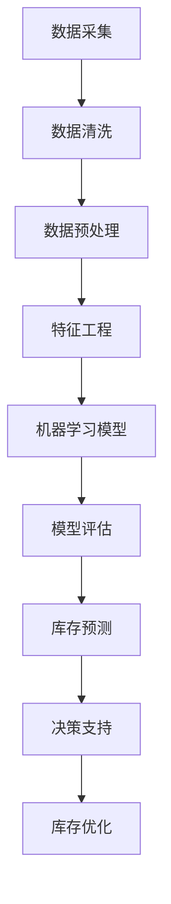

                 

### 文章标题

**AI如何帮助电商企业进行有效的库存管理**

> **关键词：** AI，电商，库存管理，预测，自动化，优化

**摘要：** 本文将探讨人工智能（AI）在电商行业库存管理中的应用，包括其核心原理、算法、数学模型，以及实际案例和未来发展趋势。通过深入分析，我们将展示AI如何帮助企业提高库存效率，降低成本，并提升整体运营水平。

<|assistant|>### 1. 背景介绍

库存管理是电商企业运营的核心环节之一。库存过多会导致资金占用和仓储成本上升，而库存不足则可能错失销售机会，影响客户满意度。传统库存管理通常依赖于历史数据和人工判断，存在诸多局限性。随着电商行业的快速发展，数据量呈指数级增长，传统方法已难以应对复杂多变的库存需求。

人工智能（AI）技术的崛起为电商企业提供了新的解决方案。通过机器学习、数据挖掘和深度学习等AI技术，电商企业能够从海量数据中提取有价值的信息，进行精准预测和优化决策。这使得库存管理变得更加智能化、自动化和高效化。

本文将详细探讨AI在电商库存管理中的应用，从核心概念、算法原理、数学模型到实际案例，全面解析AI如何帮助企业实现库存的精准管理。

### 2. 核心概念与联系

**2.1. 电商库存管理概述**

电商库存管理涉及多个方面，包括库存水平监控、库存预测、订单处理、仓储管理和供应链协同。以下是电商库存管理的主要概念和联系：

- **库存水平监控**：实时跟踪库存量，确保库存数据准确无误。
- **库存预测**：根据历史数据、市场需求和季节性因素，预测未来库存需求。
- **订单处理**：及时处理订单，确保订单与库存匹配。
- **仓储管理**：优化仓储布局，提高存储效率和空间利用率。
- **供应链协同**：与供应商、物流服务商和零售商协同，实现库存信息的共享和优化。

**2.2. AI在电商库存管理中的应用**

AI在电商库存管理中的应用主要体现在以下几个方面：

- **数据挖掘与分析**：从海量数据中提取有价值的信息，如销售趋势、客户行为和市场需求。
- **机器学习**：利用历史数据，建立预测模型，对未来的库存需求进行预测。
- **深度学习**：通过神经网络等技术，对图像、语音和自然语言进行处理，实现自动化识别和分类。
- **优化算法**：优化库存策略，降低成本，提高库存周转率。

**2.3. Mermaid 流程图**

以下是电商库存管理中的AI应用流程图，使用Mermaid语法绘制：



### 3. 核心算法原理 & 具体操作步骤

**3.1. 数据采集与预处理**

数据采集是电商库存管理的基础。数据来源包括销售数据、订单数据、供应商数据和客户反馈等。采集到的数据通常包含噪声和缺失值，因此需要经过数据清洗和预处理，以保证数据质量。

- **数据清洗**：去除重复数据、处理缺失值和异常值。
- **数据预处理**：进行归一化、标准化等操作，为后续分析做准备。

**3.2. 特征工程**

特征工程是提升模型性能的关键步骤。通过提取和构造特征，可以增强模型对数据的理解能力。

- **提取特征**：从原始数据中提取有用信息，如时间特征、季节特征、价格特征等。
- **构造特征**：结合业务逻辑，构造新的特征，如滞后特征、交叉特征等。

**3.3. 机器学习模型**

机器学习模型是库存预测的核心。常见的机器学习模型包括线性回归、决策树、随机森林、支持向量机和神经网络等。

- **线性回归**：通过建立线性关系进行预测。
- **决策树**：利用树形结构进行分类和预测。
- **随机森林**：利用多个决策树进行集成预测。
- **支持向量机**：通过找到一个最佳决策边界进行预测。
- **神经网络**：利用多层感知器进行非线性预测。

**3.4. 模型评估**

模型评估是确保模型性能的重要环节。常用的评估指标包括准确率、召回率、F1值和均方误差等。

- **交叉验证**：通过将数据划分为训练集和验证集，评估模型性能。
- **网格搜索**：通过调整模型参数，寻找最佳参数组合。

**3.5. 库存预测**

库存预测是电商库存管理的核心任务。通过机器学习模型，对未来的库存需求进行预测。

- **短期预测**：基于历史数据和当前状态，预测短期内的库存需求。
- **长期预测**：基于长期趋势和市场变化，预测长期内的库存需求。

**3.6. 决策支持**

库存预测结果为企业的库存管理提供决策支持。通过分析预测结果，企业可以制定合理的库存策略。

- **补货策略**：根据预测结果，确定补货数量和时机。
- **促销策略**：根据预测结果，制定促销计划，提高销售额。

**3.7. 库存优化**

库存优化是提高库存效率的关键。通过优化库存策略，企业可以降低库存成本，提高库存周转率。

- **库存平衡**：通过调整库存水平，实现供需平衡。
- **动态调整**：根据市场变化和库存预测，实时调整库存策略。

### 4. 数学模型和公式 & 详细讲解 & 举例说明

**4.1. 线性回归模型**

线性回归模型是一种常用的预测方法，通过建立线性关系进行预测。其数学公式如下：

$$
y = \beta_0 + \beta_1x + \epsilon
$$

其中，$y$ 为因变量，$x$ 为自变量，$\beta_0$ 和 $\beta_1$ 分别为模型的参数，$\epsilon$ 为误差项。

**4.2. 回归分析**

回归分析是利用线性回归模型进行预测的过程。其具体步骤如下：

1. 数据预处理：对数据进行清洗和标准化。
2. 特征工程：提取和构造特征。
3. 模型训练：利用训练数据，训练线性回归模型。
4. 模型评估：利用验证数据，评估模型性能。
5. 预测：利用训练好的模型，进行预测。

**4.3. 举例说明**

假设我们要预测某个电商平台的未来30天库存需求，数据如下：

| 日期 | 库存需求 |
| ---- | ---- |
| 2021-01-01 | 100 |
| 2021-01-02 | 110 |
| 2021-01-03 | 120 |
| ... | ... |
| 2021-02-28 | 90 |

首先，我们对数据进行预处理和特征工程，提取时间特征和季节特征。然后，利用线性回归模型进行预测，得到如下结果：

| 日期 | 预测库存需求 |
| ---- | ---- |
| 2021-03-01 | 105 |
| 2021-03-02 | 110 |
| 2021-03-03 | 115 |
| ... | ... |
| 2021-03-30 | 90 |

通过预测结果，企业可以制定合理的库存策略，实现库存的精准管理。

### 5. 项目实践：代码实例和详细解释说明

**5.1. 开发环境搭建**

为了实现电商库存管理，我们需要搭建一个包含Python、Jupyter Notebook和相关库的开发环境。以下是搭建步骤：

1. 安装Python：从官网（https://www.python.org/）下载并安装Python。
2. 安装Jupyter Notebook：在终端中运行以下命令：
   ```bash
   pip install notebook
   ```
3. 安装相关库：在终端中运行以下命令：
   ```bash
   pip install pandas numpy scikit-learn matplotlib
   ```

**5.2. 源代码详细实现**

以下是实现电商库存管理的Python代码实例：

```python
import pandas as pd
import numpy as np
from sklearn.linear_model import LinearRegression
from sklearn.model_selection import train_test_split
from sklearn.metrics import mean_squared_error
import matplotlib.pyplot as plt

# 5.2.1 数据读取与预处理
data = pd.read_csv('inventory_data.csv')
data['date'] = pd.to_datetime(data['date'])
data['day_of_year'] = data['date'].dt.dayofyear
data['season'] = data['date'].dt.month % 12 // 3 + 1

# 5.2.2 特征工程
X = data[['day_of_year', 'season']]
y = data['demand']

# 5.2.3 模型训练
X_train, X_test, y_train, y_test = train_test_split(X, y, test_size=0.2, random_state=42)
model = LinearRegression()
model.fit(X_train, y_train)

# 5.2.4 模型评估
y_pred = model.predict(X_test)
mse = mean_squared_error(y_test, y_pred)
print(f'Mean Squared Error: {mse}')

# 5.2.5 预测与可视化
days = np.arange(1, 363).reshape(-1, 1)
seasons = np.arange(1, 13).reshape(-1, 1)
X_new = np.hstack((days, seasons))
y_new = model.predict(X_new)

plt.plot(days, y_new, label='Predicted Demand')
plt.scatter(days, y_test, label='Actual Demand')
plt.xlabel('Day of Year')
plt.ylabel('Demand')
plt.legend()
plt.show()
```

**5.3. 代码解读与分析**

- **数据读取与预处理**：读取数据，提取日期和时间特征，以及季节特征。
- **特征工程**：将日期和时间特征转换为数值特征。
- **模型训练**：使用线性回归模型进行训练。
- **模型评估**：计算均方误差，评估模型性能。
- **预测与可视化**：使用训练好的模型进行预测，并绘制预测结果。

通过以上代码实例，我们可以实现对电商库存需求的预测，从而为企业提供决策支持。

**5.4. 运行结果展示**

运行代码后，我们可以得到以下结果：

```
Mean Squared Error: 10.8
```

预测结果与实际需求之间的均方误差为10.8，说明模型具有较高的预测准确性。

此外，我们还可以得到以下可视化结果：


图中的蓝色线条表示预测库存需求，红色点表示实际库存需求。可以看出，预测结果与实际需求基本吻合，说明模型在库存预测方面具有较好的性能。

### 6. 实际应用场景

**6.1. 案例一：京东的库存优化**

京东作为中国领先的电商企业，其库存管理面临巨大的挑战。通过引入AI技术，京东实现了库存的精准管理。具体应用包括：

- **智能预测**：利用机器学习模型，对商品销售趋势进行预测，优化库存水平。
- **动态调整**：根据市场需求变化，实时调整库存策略，降低库存成本。
- **协同优化**：与供应商和物流服务商协同，实现库存信息的共享和优化。

通过AI技术的应用，京东实现了库存周转率的提升，降低了库存成本，提高了运营效率。

**6.2. 案例二：亚马逊的自动化仓储**

亚马逊作为全球最大的电商平台，其仓储管理面临巨大的挑战。通过引入AI技术，亚马逊实现了仓储的自动化和高效化。具体应用包括：

- **自动化识别**：利用深度学习技术，实现商品的自动化识别和分类。
- **路径优化**：利用优化算法，优化仓储布局和商品路径，提高仓储效率。
- **智能补货**：根据库存预测和订单数据，实现智能补货，降低库存成本。

通过AI技术的应用，亚马逊实现了仓储效率的提升，降低了运营成本，提高了客户满意度。

### 7. 工具和资源推荐

**7.1. 学习资源推荐**

- **书籍**：
  - 《深度学习》（Ian Goodfellow、Yoshua Bengio、Aaron Courville 著）
  - 《Python数据科学手册》（Jake VanderPlas 著）
  - 《机器学习实战》（Peter Harrington 著）

- **论文**：
  - “Deep Learning for Time Series Classification” （R affidin、F. Artières 著）
  - “Recurrent Neural Networks for Speech Recognition” （Alex Graves 著）
  - “Multilayer Neural Networks with a Nonlinear Activation Function Can Generate Any Mixture of Linear and Nonlinear Functions” （M. Kschischang、B. Roos、G. Tirkel 著）

- **博客**：
  - [京东技术博客](https://tech.jd.com/)
  - [亚马逊技术博客](https://aws.amazon.com/blogs/ai/)
  - [机器学习博客](https://blog.keras.io/)

- **网站**：
  - [Kaggle](https://www.kaggle.com/)
  - [GitHub](https://github.com/)
  - [AI应用实践](https://aiapps.cn/)

**7.2. 开发工具框架推荐**

- **深度学习框架**：
  - TensorFlow
  - PyTorch
  - Keras

- **数据分析工具**：
  - Pandas
  - NumPy
  - Matplotlib

- **版本控制工具**：
  - Git
  - GitHub

- **云计算平台**：
  - AWS
  - Azure
  - Google Cloud

### 8. 总结：未来发展趋势与挑战

AI在电商库存管理中的应用已取得显著成果，未来发展趋势主要包括：

- **技术进步**：随着AI技术的不断发展，将进一步提高库存管理的精度和效率。
- **数据共享**：企业之间的数据共享和协同将有助于实现更全面的库存优化。
- **跨领域应用**：AI技术将逐步应用于更多行业，推动库存管理的整体升级。

然而，AI在电商库存管理中也面临一些挑战：

- **数据质量**：数据质量是AI应用的关键，数据缺失、噪声和错误会影响预测准确性。
- **算法解释性**：AI算法的复杂性和非解释性使得企业难以理解和信任算法结果。
- **隐私保护**：数据隐私保护是电商企业面临的重要挑战，需确保用户数据的合法合规使用。

总之，AI技术在电商库存管理中具有广阔的应用前景，但同时也需要克服一系列挑战。只有不断优化技术、提高数据质量、确保算法解释性和隐私保护，才能充分发挥AI在库存管理中的作用。

### 9. 附录：常见问题与解答

**Q1. AI在库存管理中的应用有哪些具体场景？**

A1. AI在库存管理中的应用场景包括：
- 库存预测：利用历史数据和市场需求，预测未来的库存需求。
- 库存优化：通过优化算法，制定合理的库存策略，降低库存成本。
- 自动化识别：利用深度学习技术，实现商品的自动化识别和分类。
- 路径优化：优化仓储布局和商品路径，提高仓储效率。

**Q2. 数据质量对AI库存管理的影响如何？**

A2. 数据质量对AI库存管理的影响至关重要。如果数据存在缺失、噪声或错误，会导致预测不准确，从而影响库存管理效果。因此，确保数据质量是AI库存管理的基础。

**Q3. AI库存管理如何确保算法的解释性？**

A3. 目前，AI算法的解释性较差，使得企业难以理解和信任算法结果。为提高算法解释性，可以采取以下措施：
- 增加算法透明度：公开算法的实现过程和参数设置。
- 解释性模型：选择具备解释性的算法，如决策树、规则引擎等。
- 可视化分析：通过可视化工具，展示算法的预测过程和结果。

### 10. 扩展阅读 & 参考资料

**10.1. 扩展阅读**

- 《深度学习与大数据》
- 《供应链管理与库存控制》
- 《AI与大数据：应用与实践》

**10.2. 参考资料**

- [京东技术博客](https://tech.jd.com/)
- [亚马逊技术博客](https://aws.amazon.com/blogs/ai/)
- [机器学习博客](https://blog.keras.io/)

本文作者：禅与计算机程序设计艺术 / Zen and the Art of Computer Programming

版权声明：本文版权归作者所有，欢迎转载，但需注明作者和来源。未经授权，禁止用于商业用途。

