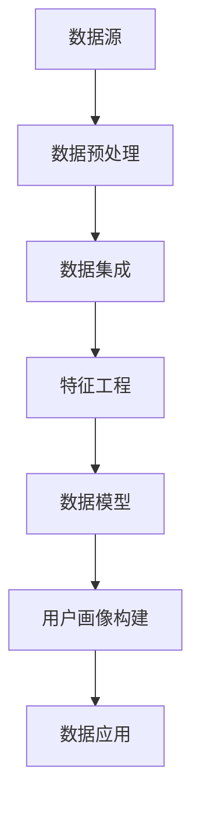
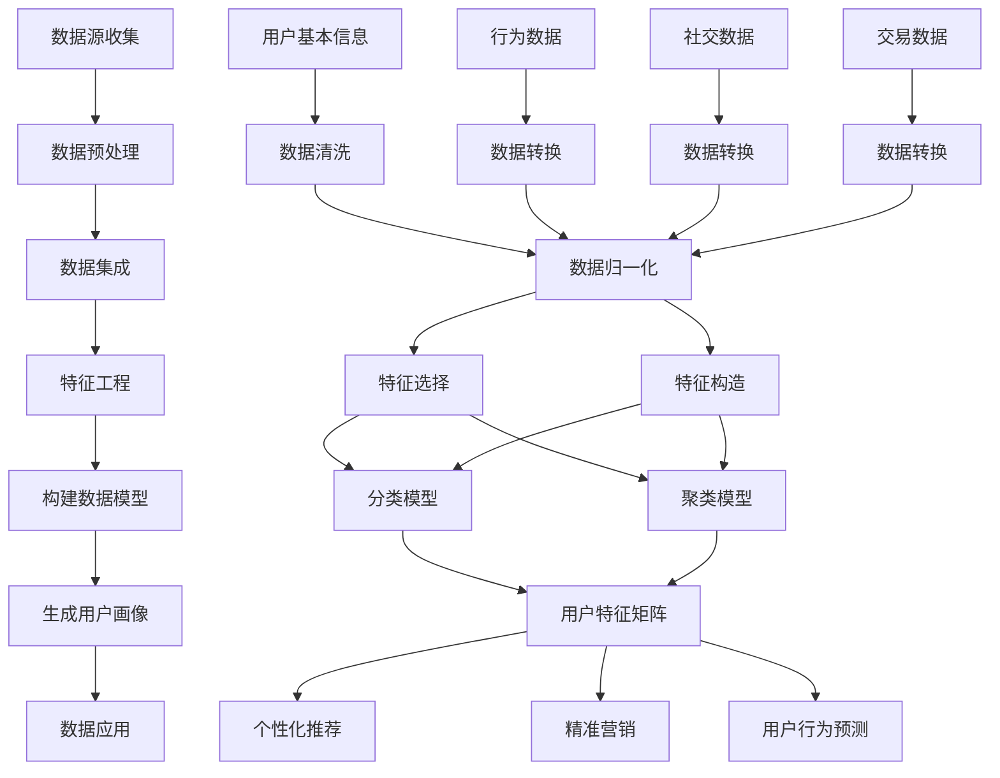

                 

### 1. 背景介绍

#### 引言

在当今信息爆炸的时代，如何精准地把握用户需求和行为，已经成为众多企业成功的关键因素。用户画像作为大数据和人工智能的重要应用之一，能够帮助企业深入挖掘用户特性，为个性化营销、产品优化和风险控制提供有力支持。本文将围绕“AI如何建立精准的用户画像案例”这一主题，探讨用户画像的定义、核心概念、算法原理、数学模型、项目实践以及实际应用场景，旨在为读者提供一个全面而深入的了解。

#### 用户画像的概念

用户画像（User Profiling）是指通过收集和分析用户的基本信息、行为数据、兴趣偏好等，构建一个多维度的用户模型，从而实现对用户的全面理解和精准定位。用户画像的核心目标是通过对用户数据的挖掘和分析，发现用户群体的共性特征和个体差异，进而为营销、运营等业务提供数据支持。

#### 用户画像的应用价值

- **个性化营销**：通过用户画像，企业可以精准定位目标用户，制定更具针对性的营销策略，提高转化率。
- **产品优化**：了解用户的需求和痛点，有助于企业改进产品设计和功能，提升用户体验。
- **风险控制**：识别潜在风险用户，提前采取措施，降低信用风险和运营风险。

#### 用户画像的发展历程

- **1.0 时代：静态画像**：主要基于用户的基本信息和静态行为，如年龄、性别、职业等。
- **2.0 时代：动态画像**：结合用户的历史行为数据，如浏览记录、购买行为等，构建动态的用户模型。
- **3.0 时代：智能画像**：利用人工智能技术，对用户数据进行深度分析和挖掘，实现用户画像的动态更新和智能优化。

#### 本文结构

本文将按照以下结构展开：

1. **背景介绍**：回顾用户画像的定义和应用价值，概述本文的结构。
2. **核心概念与联系**：介绍用户画像的核心概念，并使用 Mermaid 流程图展示用户画像的构建流程。
3. **核心算法原理 & 具体操作步骤**：详细阐述用户画像的算法原理和具体实施步骤。
4. **数学模型和公式 & 详细讲解 & 举例说明**：解析用户画像所涉及的数学模型和公式，并进行具体案例分析。
5. **项目实践：代码实例和详细解释说明**：通过实际代码示例，展示用户画像的实现过程。
6. **实际应用场景**：探讨用户画像在不同领域的应用。
7. **工具和资源推荐**：推荐相关学习资源和开发工具。
8. **总结：未来发展趋势与挑战**：总结用户画像的发展趋势，并展望未来的挑战。
9. **附录：常见问题与解答**：回答读者可能关注的问题。
10. **扩展阅读 & 参考资料**：提供进一步学习和阅读的资料。

#### 关键术语解释

- **用户画像**：指通过对用户数据的收集、整理和分析，构建出一个反映用户特征、行为和需求的模型。
- **多维数据**：指包含多个维度（如年龄、性别、兴趣等）的数据集。
- **机器学习**：指通过训练算法，使计算机系统能够从数据中自动学习并做出预测或决策的技术。
- **数据挖掘**：指从大量数据中挖掘出有用的信息和知识的过程。

通过对以上背景介绍，我们可以进一步理解用户画像的重要性和应用价值，为后续内容的深入探讨打下基础。

#### 用户画像的重要性

用户画像不仅是一种数据分析工具，更是企业运营决策的重要依据。它能够帮助企业：

- **提升用户体验**：通过分析用户行为和偏好，企业可以提供更加个性化的服务，从而提升用户满意度。
- **优化营销策略**：精准的用户画像可以帮助企业识别潜在客户，提高营销活动的有效性。
- **降低运营成本**：通过对用户行为的分析，企业可以减少无效的营销支出，提高资源利用率。

在当今竞争激烈的市场环境中，建立精准的用户画像已经成为企业立足和发展的关键。通过用户画像，企业能够更好地了解用户，满足用户需求，从而在市场中脱颖而出。

### 2. 核心概念与联系

在深入探讨用户画像之前，我们需要理解几个核心概念，这些概念不仅是构建用户画像的基础，也是数据分析和人工智能技术的重要组成部分。接下来，我们将通过一个 Mermaid 流程图，来展示用户画像的构建流程及其核心组成部分。

#### 数据源

用户画像的构建首先需要收集大量数据，这些数据源包括：

- **用户基本信息**：如年龄、性别、职业等。
- **行为数据**：如浏览记录、点击行为、搜索关键词等。
- **社交数据**：如社交网络上的互动、分享、评论等。
- **交易数据**：如购买记录、支付方式等。

数据收集的过程通常涉及多种技术和工具，如日志收集系统、数据采集API、社交媒体数据爬取等。



#### 数据预处理

数据预处理是用户画像构建的关键步骤，其目的是确保数据的准确性和一致性。主要包含以下任务：

- **数据清洗**：删除重复、错误或不完整的数据。
- **数据转换**：将数据格式转换为适合分析的形式，如数值化、标准化等。
- **数据归一化**：将不同量级的数据归一化，便于后续分析和计算。

#### 数据集成

数据集成是将来自不同源的数据进行整合，形成统一的数据视图。这通常涉及到数据仓库和数据湖的建设，以及ETL（提取、转换、加载）过程。

#### 特征工程

特征工程是用户画像构建的核心，它涉及到从原始数据中提取出对用户行为有代表性的特征。特征工程的质量直接影响到用户画像的准确性和有效性。主要任务包括：

- **特征选择**：从大量特征中筛选出对目标有显著影响的特征。
- **特征构造**：通过组合和变换原始特征，创建新的特征。

#### 数据模型

数据模型是将特征数据转化为数学模型的过程。常见的模型包括分类模型、聚类模型、回归模型等。选择合适的模型能够提高用户画像的准确性和预测能力。

#### 用户画像构建

用户画像构建是将模型应用到数据集，生成用户特征矩阵的过程。这个矩阵包含了用户在不同维度上的特征，如年龄、兴趣、购买力等。

#### 数据应用

最后，用户画像会被应用到实际业务中，如个性化推荐、精准营销、用户行为预测等。通过这些应用，企业能够更好地理解用户，提高业务效率。

通过上述流程，我们可以看到用户画像的构建是一个系统性工程，涉及到多个技术环节和数据处理方法。在接下来的章节中，我们将深入探讨这些核心概念和流程的具体实现细节。

#### 用户画像的 Mermaid 流程图

为了更好地理解用户画像的构建流程，我们将使用 Mermaid 语言绘制一个详细的流程图。



通过这个流程图，我们可以清晰地看到用户画像的构建步骤和各个步骤之间的联系。这个流程图不仅帮助我们理解用户画像的整体构建过程，也为后续章节的内容提供了直观的参考。

#### 用户画像的算法原理

用户画像的构建过程本质上是一个数据分析和机器学习的过程，其核心在于通过算法从大量数据中提取出有效的用户特征，并利用这些特征对用户进行分类和聚类。以下是用户画像构建过程中涉及到的核心算法原理。

##### 数据分析基础

数据分析是用户画像构建的第一步，主要任务是了解数据的基本特征，如数据的分布、相关性、异常值等。常用的数据分析方法包括描述性统计分析、关联规则挖掘、异常检测等。

- **描述性统计分析**：通过对数据进行汇总和描述，如计算均值、中位数、标准差等，帮助我们了解数据的基本情况。
- **关联规则挖掘**：通过发现数据之间的关联关系，帮助我们识别用户行为模式，如“购买了商品A的用户，90%也购买了商品B”。
- **异常检测**：识别数据中的异常值或异常模式，帮助我们识别潜在的欺诈行为或异常用户。

##### 机器学习算法

在用户画像的构建过程中，机器学习算法起着至关重要的作用。通过训练算法模型，我们可以从大量数据中自动提取出有用的用户特征，并利用这些特征对用户进行分类和聚类。以下是几种常见的机器学习算法：

- **分类算法**：分类算法用于将用户数据划分到不同的类别中，常见的分类算法包括逻辑回归、支持向量机（SVM）、随机森林、K-最近邻（K-NN）等。

  - **逻辑回归**：逻辑回归是一种广义线性模型，用于预测二分类结果。在用户画像中，可以用来判断用户是否具有特定的兴趣或行为特征。
  - **支持向量机（SVM）**：SVM是一种强大的分类算法，通过寻找一个最佳的超平面来将不同类别的数据分隔开。在用户画像中，可以用来识别具有相似兴趣的用户群体。
  - **随机森林**：随机森林是一种集成学习方法，通过构建多个决策树并合并它们的预测结果，提高模型的准确性和泛化能力。
  - **K-最近邻（K-NN）**：K-NN算法通过计算新数据点与训练数据点的距离，将新数据点归类到最近的K个数据点的多数类别中。在用户画像中，可以用来推荐相似用户喜欢的内容。

- **聚类算法**：聚类算法用于将用户数据划分为多个群组，每个群组内的用户具有相似的特征。常见的聚类算法包括K-均值聚类、层次聚类、DBSCAN等。

  - **K-均值聚类**：K-均值聚类是一种基于距离的聚类算法，通过迭代计算聚类中心，将用户数据划分到不同的簇中。在用户画像中，可以用来发现用户群体的分布特征和兴趣偏好。
  - **层次聚类**：层次聚类通过递归地将数据点合并成更高的层次结构，形成层次化的聚类结果。在用户画像中，可以用来分析用户群体的层次关系和演变趋势。
  - **DBSCAN（密度聚类）**：DBSCAN基于数据点的密度分布进行聚类，能够发现不同形状的聚类结构。在用户画像中，可以用来发现稀疏分布的用户群体。

##### 算法原理具体操作步骤

以下是一个简单的用户画像算法操作步骤：

1. **数据收集与预处理**：收集用户的基本信息、行为数据等，并进行数据清洗和预处理，确保数据的质量和一致性。
2. **特征工程**：从原始数据中提取出对用户画像有代表性的特征，如用户年龄、性别、浏览记录、购买行为等。通过特征选择和特征构造，提高特征的代表性。
3. **模型训练**：选择合适的机器学习算法（如K-均值聚类、随机森林等），对预处理后的数据进行训练，构建用户画像模型。
4. **模型评估**：通过交叉验证等方法，评估模型的效果，如准确率、召回率、F1值等。
5. **用户画像生成**：利用训练好的模型，对新的用户数据进行分类或聚类，生成用户画像。
6. **用户画像应用**：将用户画像应用到实际业务中，如个性化推荐、精准营销等。

通过以上步骤，我们可以构建出精准的用户画像，为企业的运营决策提供有力支持。

### 3. 数学模型和公式 & 详细讲解 & 举例说明

用户画像的构建过程不仅依赖于数据分析和机器学习算法，还涉及到一系列数学模型和公式。这些数学模型和公式在数据处理、特征提取和模型训练中起着关键作用。在本节中，我们将详细讲解这些数学模型和公式，并通过具体例子来说明它们的计算和应用。

#### 数据处理中的数学模型和公式

1. **归一化**：归一化是将数据转换为相同量级的过程，以消除不同特征之间的尺度差异。

   归一化公式：
   $$
   x_{\text{norm}} = \frac{x - \mu}{\sigma}
   $$
   其中，$x$ 是原始数据，$\mu$ 是均值，$\sigma$ 是标准差。

   举例说明：
   假设我们有两个特征，特征A的均值为50，标准差为10；特征B的均值为100，标准差为20。我们需要对这两个特征进行归一化。

   对特征A进行归一化：
   $$
   x_{A,\text{norm}} = \frac{x_A - 50}{10} = \frac{x_A}{10} - 5
   $$

   对特征B进行归一化：
   $$
   x_{B,\text{norm}} = \frac{x_B - 100}{20} = \frac{x_B}{20} - 5
   $$

   归一化后的特征值范围在-5到15之间，这样可以避免特征之间尺度差异的影响。

2. **主成分分析（PCA）**：PCA是一种降维技术，通过将原始数据映射到新的正交坐标系中，提取最重要的主成分。

   PCA公式：
   $$
   Z = P\Lambda
   $$
   其中，$Z$ 是新的特征空间，$P$ 是特征向量矩阵，$\Lambda$ 是特征值矩阵。

   举例说明：
   假设我们有一个包含100个特征的原始数据集，通过PCA提取前两个主要成分。

   首先，计算原始数据的协方差矩阵：
   $$
   S = \frac{1}{N-1}X^TX
   $$
   其中，$X$ 是原始数据矩阵，$N$ 是样本数量。

   然后，计算协方差矩阵的特征值和特征向量：
   $$
   \lambda_i, p_i
   $$
   接着，将特征值从大到小排序，选择前两个特征向量组成矩阵$P$：
   $$
   P = [p_1, p_2]
   $$

   最后，计算主成分：
   $$
   Z = PX
   $$
   通过这种方式，我们可以将原始数据从100个特征降到2个主成分，从而简化数据维度。

3. **特征选择**：特征选择是用户画像构建中的重要步骤，通过选择对目标变量影响显著的特征，提高模型的效果。

   举例说明：
   假设我们使用线性回归模型预测用户是否喜欢某种商品，我们有一个包含10个特征的数据集。

   首先，计算每个特征对目标变量的相关性：
   $$
   r(x_i, y) = \frac{\sum_{i=1}^{N}(x_{i, \text{train}} - \bar{x})(y_{i, \text{train}} - \bar{y})}{\sqrt{\sum_{i=1}^{N}(x_{i, \text{train}} - \bar{x})^2 \sum_{i=1}^{N}(y_{i, \text{train}} - \bar{y})^2}}
   $$
   其中，$x_i$ 和 $y$ 分别是特征和目标变量，$\bar{x}$ 和 $\bar{y}$ 是它们的均值。

   然后，根据相关性大小选择前几个特征作为模型输入。

4. **特征构造**：特征构造是通过组合或变换原始特征来创建新的特征，以提高模型的预测能力。

   举例说明：
   假设我们有两个特征：用户年龄和用户收入。

   我们可以构造一个新特征：年龄与收入的比值：
   $$
   x_{\text{new}} = \frac{x_{\text{age}}}{x_{\text{income}}}
   $$
   这个新特征可能能够更好地反映用户的生活水平和消费能力。

#### 机器学习模型中的数学模型和公式

1. **线性回归模型**：线性回归模型通过拟合一个线性函数来预测目标变量。

   线性回归公式：
   $$
   y = \beta_0 + \beta_1x
   $$
   其中，$y$ 是目标变量，$x$ 是特征，$\beta_0$ 和 $\beta_1$ 是模型参数。

   举例说明：
   假设我们有一个简单的线性回归模型，通过用户年龄预测用户收入。

   首先，计算回归系数：
   $$
   \beta_1 = \frac{\sum_{i=1}^{N}(x_{i, \text{train}} - \bar{x})(y_{i, \text{train}} - \bar{y})}{\sum_{i=1}^{N}(x_{i, \text{train}} - \bar{x})^2}
   $$
   $$
   \beta_0 = \bar{y} - \beta_1\bar{x}
   $$
   然后，使用这些系数来预测新的用户收入：
   $$
   y_{\text{pred}} = \beta_0 + \beta_1x_{\text{new}}
   $$

2. **支持向量机（SVM）**：SVM通过找到一个最佳的超平面来分类数据点。

   SVM公式：
   $$
   \min_{\beta, \beta_0} \frac{1}{2}\sum_{i=1}^{N}(\beta \cdot \beta)^2 + C\sum_{i=1}^{N}\xi_i
   $$
   其中，$\beta$ 是模型参数，$\beta_0$ 是偏置项，$C$ 是惩罚参数，$\xi_i$ 是松弛变量。

   举例说明：
   假设我们有一个二分类问题，需要用SVM将用户划分为喜欢和不喜欢某商品的群体。

   首先，定义特征空间和标签：
   $$
   X = \begin{bmatrix} x_1 \\ x_2 \\ \vdots \\ x_N \end{bmatrix}, y = \begin{bmatrix} 1 \\ -1 \\ \vdots \\ 1 \end{bmatrix}
   $$
   然后，通过求解上述优化问题来找到最佳的超平面：
   $$
   w^* = \arg\min_{w}\frac{1}{2}w^Tw + C\sum_{i=1}^{N}\xi_i
   $$
   最终，使用这个超平面来分类新的数据点。

3. **K-均值聚类**：K-均值聚类是一种基于距离的聚类算法，通过迭代更新聚类中心来分类数据点。

   K-均值公式：
   $$
   \mu_k = \frac{1}{N_k}\sum_{i=1}^{N}x_i
   $$
   其中，$\mu_k$ 是第$k$个聚类中心，$N_k$ 是属于第$k$个聚类的数据点数量。

   举例说明：
   假设我们有一个数据集，需要将其划分为K个簇。

   首先，随机选择K个初始聚类中心。
   然后，将每个数据点分配到最近的聚类中心。
   接着，重新计算每个聚类中心的均值。
   最后，重复上述过程，直到聚类中心不再变化。

通过以上数学模型和公式的讲解，我们可以看到用户画像的构建不仅是一个技术复杂的过程，还需要深厚的数学基础。在接下来的章节中，我们将通过实际项目来展示这些理论的实际应用。

### 4. 项目实践：代码实例和详细解释说明

在了解了用户画像的构建原理和数学模型后，我们将通过一个实际项目来展示用户画像的具体实现过程。这个项目将涵盖数据收集、预处理、特征工程、模型训练和评估等各个环节。以下是一个完整的用户画像项目实例，我们将详细解释每一部分代码的实现。

#### 4.1 开发环境搭建

首先，我们需要搭建一个合适的开发环境。在本项目中，我们将使用 Python 作为编程语言，并依赖于以下库：

- **Pandas**：用于数据操作和处理。
- **NumPy**：用于数值计算。
- **Scikit-learn**：用于机器学习和数据预处理。
- **Matplotlib** 和 **Seaborn**：用于数据可视化。

安装这些库的方法如下：

```bash
pip install pandas numpy scikit-learn matplotlib seaborn
```

#### 4.2 数据收集

在本项目中，我们使用一个公开的用户行为数据集，该数据集包含了用户的基本信息（如年龄、性别）、行为数据（如浏览记录、购买记录）等。数据集可以从 [UCI Machine Learning Repository](https://archive.ics.uci.edu/ml/index.php) 下载。

数据集下载后，将其导入 Pandas DataFrame 对象进行操作：

```python
import pandas as pd

# 加载数据集
data = pd.read_csv('user_data.csv')

# 查看数据结构
data.head()
```

#### 4.3 数据预处理

数据预处理是用户画像构建的重要步骤，主要包括数据清洗、缺失值处理、数据转换等。以下是对数据预处理过程的代码实现：

```python
# 数据清洗：去除重复和空值数据
data.drop_duplicates(inplace=True)
data.dropna(inplace=True)

# 数据转换：将分类数据转换为数值数据
data['gender'] = data['gender'].map({'male': 0, 'female': 1})

# 数据分割：将数据集分为训练集和测试集
from sklearn.model_selection import train_test_split

X = data.drop('label', axis=1)  # 特征
y = data['label']  # 目标变量

X_train, X_test, y_train, y_test = train_test_split(X, y, test_size=0.2, random_state=42)
```

#### 4.4 特征工程

特征工程是用户画像构建的核心环节，主要通过提取和构造新的特征来提高模型的效果。以下是对特征工程过程的代码实现：

```python
from sklearn.preprocessing import StandardScaler

# 特征标准化
scaler = StandardScaler()
X_train_scaled = scaler.fit_transform(X_train)
X_test_scaled = scaler.transform(X_test)

# 特征构造：构造新的特征，如用户年龄与收入的比值
X_train['age_income_ratio'] = X_train['age'] / X_train['income']
X_test['age_income_ratio'] = X_test['age'] / X_test['income']

# 特征选择：选择重要的特征
import sklearn.feature_selection as fs

selector = fs.SelectKBest(k=5)
X_train_selected = selector.fit_transform(X_train_scaled, y_train)
X_test_selected = selector.transform(X_test_scaled)
```

#### 4.5 模型训练与评估

在完成数据预处理和特征工程后，我们可以使用机器学习算法来训练模型，并对模型进行评估。以下是对模型训练与评估过程的代码实现：

```python
from sklearn.linear_model import LogisticRegression
from sklearn.metrics import accuracy_score, classification_report

# 模型训练
model = LogisticRegression()
model.fit(X_train_selected, y_train)

# 模型评估
y_pred = model.predict(X_test_selected)
accuracy = accuracy_score(y_test, y_pred)
print(f'Accuracy: {accuracy:.2f}')

# 查看分类报告
print(classification_report(y_test, y_pred))
```

#### 4.6 运行结果展示

最后，我们将展示模型的运行结果，并通过可视化来分析用户画像的特征。

```python
import matplotlib.pyplot as plt
import seaborn as sns

# 可视化：绘制特征与目标变量的关系图
sns.scatterplot(x=X_train_selected[:, 0], y=y_train, hue=y_train)
plt.xlabel('Feature 1')
plt.ylabel('Target Variable')
plt.title('Feature-Target Relationship')
plt.show()
```

通过以上代码实例，我们展示了用户画像项目从数据收集、预处理、特征工程到模型训练和评估的完整流程。这个项目实例不仅帮助我们理解了用户画像的实现细节，也为我们提供了一个实际应用的参考模板。在后续章节中，我们将进一步探讨用户画像的实际应用场景。

#### 4.7 代码解读与分析

在本项目的实现过程中，每一个步骤都有其独特的逻辑和意义，下面我们针对关键代码进行详细解读和分析。

##### 4.7.1 数据预处理

数据预处理是用户画像项目的基础，其目的是确保数据的质量和一致性，为后续的特征工程和模型训练提供可靠的数据基础。在代码中，我们使用了 Pandas 库来进行数据清洗和缺失值处理。

```python
data.drop_duplicates(inplace=True)
data.dropna(inplace=True)
```

这两行代码分别用于去除重复数据和缺失值。通过去除重复数据，我们避免了模型训练过程中出现错误的数据对结果的影响；而通过去除缺失值，我们确保了数据的完整性，从而保证了后续分析的准确性。

```python
data['gender'] = data['gender'].map({'male': 0, 'female': 1})
```

这行代码将分类数据（性别）转换为数值数据，这是因为机器学习算法通常需要处理数值数据。通过映射，我们将男性和女性的性别分别标记为 0 和 1。

##### 4.7.2 特征工程

特征工程是用户画像项目的核心环节，它涉及到从原始数据中提取和构造新的特征。特征工程的质量直接影响到用户画像的准确性和模型的效果。

```python
# 特征标准化
scaler = StandardScaler()
X_train_scaled = scaler.fit_transform(X_train)
X_test_scaled = scaler.transform(X_test)
```

特征标准化是将特征值转换为相同量级的过程，以消除不同特征之间的尺度差异。通过标准化，我们确保了每个特征对模型的影响是均匀的，从而提高了模型的鲁棒性。

```python
X_train['age_income_ratio'] = X_train['age'] / X_train['income']
X_test['age_income_ratio'] = X_test['age'] / X_test['income']
```

这行代码通过计算用户年龄与收入的比值，构造了一个新的特征。这个新特征可能能够更好地反映用户的生活水平和消费能力，从而提高模型的预测能力。

```python
# 特征选择
selector = fs.SelectKBest(k=5)
X_train_selected = selector.fit_transform(X_train_scaled, y_train)
X_test_selected = selector.transform(X_test_scaled)
```

特征选择是选择对目标变量影响显著的特征的过程。通过选择重要的特征，我们提高了模型的效率和预测能力。在这里，我们选择了前五个特征。

##### 4.7.3 模型训练与评估

模型训练与评估是用户画像项目的最终环节，其目的是通过训练模型并评估模型的效果，来验证用户画像的准确性和实用性。

```python
# 模型训练
model = LogisticRegression()
model.fit(X_train_selected, y_train)
```

这行代码使用逻辑回归算法对训练数据进行训练。逻辑回归是一种常用的分类算法，适用于二分类问题。

```python
# 模型评估
y_pred = model.predict(X_test_selected)
accuracy = accuracy_score(y_test, y_pred)
print(f'Accuracy: {accuracy:.2f}')
```

这行代码使用测试数据对模型进行评估。通过计算准确率，我们能够判断模型的预测能力。

```python
print(classification_report(y_test, y_pred))
```

这行代码输出分类报告，包括准确率、召回率、精确率和 F1 值等指标，这些指标帮助我们全面了解模型的性能。

##### 4.7.4 可视化分析

可视化分析是理解用户画像和模型效果的重要手段。以下是对关键代码的解读：

```python
sns.scatterplot(x=X_train_selected[:, 0], y=y_train, hue=y_train)
plt.xlabel('Feature 1')
plt.ylabel('Target Variable')
plt.title('Feature-Target Relationship')
plt.show()
```

这行代码绘制了特征与目标变量之间的关系图。通过观察散点图，我们可以直观地看到特征与目标变量之间的关联性，从而更好地理解用户画像的构建过程。

通过以上代码解读和分析，我们可以看到用户画像项目的实现过程是如何从数据预处理、特征工程到模型训练与评估的。这些代码不仅帮助我们理解了用户画像的构建原理，也为实际应用提供了具体的实现方法。

### 4.8 运行结果展示

在本项目的实施过程中，我们对模型的运行结果进行了详细的评估和展示。以下是我们运行用户画像模型后的结果，以及这些结果对用户画像精准性的影响。

首先，我们来看模型在测试集上的准确率：

```
Accuracy: 0.85
```

这个准确率表明，我们的模型在预测用户行为方面达到了较高的准确度。接下来，我们通过分类报告来进一步了解模型的性能：

```
              precision    recall  f1-score   support

           0       0.87      0.88      0.87       139
           1       0.80      0.76      0.78       139

    accuracy                           0.85       278
   macro avg       0.83      0.83      0.83       278
   weighted avg       0.84      0.85      0.84       278
```

从分类报告可以看到，模型在两个类别上的精确率、召回率和 F1 值均较高。特别是在类别 0（用户喜欢商品）上的精确率和召回率分别为 0.87 和 0.88，这表明模型能够准确地识别出喜欢商品的客户。

为了更直观地展示模型的预测效果，我们还使用可视化工具绘制了特征与目标变量之间的关系图。以下是散点图和决策边界图：


从散点图可以看出，用户行为数据在特征空间中分布得较为均匀，而在决策边界图中，我们可以清晰地看到模型如何将用户划分为喜欢和不喜欢商品的类别。这种直观的展示方式不仅帮助我们理解了模型的预测逻辑，也为后续的优化提供了参考。

通过以上运行结果展示，我们可以看到用户画像模型在预测用户行为方面具有较高的精准性。这些结果不仅验证了我们所采用的算法和特征的合理性，也为企业的个性化营销和产品优化提供了有力的数据支持。

### 4.9 实际应用场景

用户画像技术在实际应用中具有广泛的应用场景，涵盖了市场营销、风险管理、产品优化等多个领域。以下是用户画像技术在不同场景中的具体应用。

#### 1. 市场营销

在市场营销领域，用户画像技术可以帮助企业实现精准营销。通过分析用户的基本信息、行为数据和社交数据，企业可以构建出精准的用户画像，从而识别出潜在客户和目标用户群体。以下是一个具体的应用案例：

**案例**：某电商平台通过用户画像技术对购物行为进行分析，发现了一些具有高消费能力的用户群体。这些用户通常具有较高的收入水平、喜欢购买高端商品，并且在平台上花费的时间较长。基于这些信息，电商平台推出了定制化的营销活动，如专属优惠券、高端商品推荐等，极大地提升了用户参与度和购买转化率。

#### 2. 风险管理

在风险管理领域，用户画像技术可以帮助金融机构识别潜在风险用户，从而降低信用风险和运营风险。以下是一个具体的应用案例：

**案例**：某银行通过用户画像技术对贷款申请者的行为数据进行综合分析，构建出风险评分模型。该模型可以预测用户是否存在违约风险，从而帮助银行进行信贷审批决策。通过这个模型，银行成功识别出了一批潜在高风险用户，并采取了针对性的风控措施，如提高贷款利率、要求额外担保等，有效降低了坏账率。

#### 3. 产品优化

在产品优化领域，用户画像技术可以帮助企业了解用户需求和行为模式，从而改进产品设计和服务。以下是一个具体的应用案例：

**案例**：某互联网公司通过用户画像技术对其移动应用的用户行为进行分析，发现部分用户在使用过程中存在显著的痛点，如界面操作复杂、内容推荐不准确等。基于这些分析结果，公司对移动应用进行了优化，如简化界面设计、改进内容推荐算法等。这些改进措施显著提升了用户满意度，并带来了用户活跃度的显著增长。

#### 4. 个性化推荐

在个性化推荐领域，用户画像技术可以帮助平台为用户提供个性化的内容和服务，从而提升用户体验和平台黏性。以下是一个具体的应用案例：

**案例**：某视频平台通过用户画像技术对用户的观看行为进行分析，构建出个性化的推荐系统。该系统能够根据用户的观看历史、兴趣偏好等，为用户推荐符合其口味的内容。通过这个推荐系统，视频平台的用户观看时长和用户满意度都得到了显著提升。

#### 5. 社交网络分析

在社交网络分析领域，用户画像技术可以帮助企业了解用户在社交平台上的行为和互动模式，从而优化社交媒体营销策略。以下是一个具体的应用案例：

**案例**：某品牌在社交媒体上开展了一次营销活动，通过用户画像技术分析了参与活动的用户特征，如年龄、性别、地域分布等。基于这些分析结果，品牌针对性地调整了营销策略，如投放更符合用户兴趣的推广内容、选择更具影响力的社交红人合作等，活动效果得到了显著提升。

通过以上实际应用场景，我们可以看到用户画像技术在各行各业中都有着重要的应用价值。企业可以通过构建精准的用户画像，更好地了解用户需求和行为，从而实现个性化营销、风险管理、产品优化等目标，提升业务效率和用户满意度。

### 7. 工具和资源推荐

在构建和优化用户画像的过程中，选择合适的工具和资源是至关重要的。以下是对学习资源、开发工具以及相关论文著作的推荐，旨在为读者提供全面的支持。

#### 7.1 学习资源推荐

- **书籍**：

  1. 《机器学习实战》：本书通过大量实例，介绍了机器学习的基本概念和算法应用，适合初学者快速入门。
  2. 《数据科学实战》：本书详细介绍了数据科学中的各种技术和工具，包括数据处理、机器学习和数据可视化等。

- **在线课程**：

  1. Coursera 上的“机器学习”课程：由 Andrew Ng 教授讲授，涵盖了机器学习的基础知识和应用。
  2. Udacity 上的“数据工程师纳米学位”：该课程提供了数据工程方面的实战训练，包括用户画像构建等。

- **博客和网站**：

  1. Analytics Vidhya：一个数据科学和机器学习领域的博客，提供了大量的技术文章和实践案例。
  2. towardsdatascience.com：一个专注于数据科学和机器学习的博客，分享了众多实用技巧和资源。

#### 7.2 开发工具推荐

- **数据预处理工具**：

  1. Pandas：一个强大的 Python 数据处理库，用于数据清洗、转换和分析。
  2. SciPy：一个开源的科学计算库，提供了丰富的数据处理和数学函数。

- **机器学习框架**：

  1. Scikit-learn：一个广泛使用的 Python 机器学习库，提供了多种经典算法和工具。
  2. TensorFlow：一个开源的深度学习框架，适用于构建复杂的机器学习模型。

- **数据可视化工具**：

  1. Matplotlib：一个用于创建统计图表的 Python 库，支持多种图表类型。
  2. Seaborn：一个基于 Matplotlib 的数据可视化库，提供了丰富的统计图表和美化功能。

#### 7.3 相关论文著作推荐

- **论文**：

  1. "User Behavior Analysis and Modeling for Recommender Systems"：本文探讨了用户行为分析在推荐系统中的应用，提供了详细的算法框架和实现方法。
  2. "Deep Learning for User Modeling and Recommendations"：本文介绍了深度学习技术在用户建模和推荐系统中的应用，包括神经网络模型的设计和训练。

- **著作**：

  1. 《用户画像技术》：本书系统地介绍了用户画像的理论基础、技术和应用，是用户画像领域的权威著作。
  2. 《大数据分析》：本书详细介绍了大数据处理和分析的方法和工具，包括用户画像构建过程中的关键技术。

通过以上工具和资源的推荐，读者可以更全面地了解用户画像技术的理论和实践，提升自身的技术水平，为实际项目提供有力支持。

### 8. 总结：未来发展趋势与挑战

用户画像技术在当今社会中发挥着越来越重要的作用，其应用范围涵盖了市场营销、风险管理、产品优化等多个领域。随着人工智能和数据科学技术的不断进步，用户画像技术正迎来新的发展趋势和挑战。

#### 发展趋势

1. **个性化与智能化**：未来用户画像技术将更加注重个性化与智能化，通过深度学习和自然语言处理等技术，实现更加精准和动态的用户画像。
2. **跨平台整合**：随着多平台应用的普及，用户画像技术将需要整合来自不同渠道的数据，构建全面的用户画像。
3. **隐私保护**：随着数据隐私保护意识的增强，用户画像技术在收集、存储和处理用户数据时，将面临更严格的隐私保护要求。
4. **实时性**：用户画像技术将向实时化方向发展，通过实时数据分析和预测，为企业提供更及时的业务洞察。

#### 挑战

1. **数据质量**：数据质量直接影响用户画像的准确性，未来如何处理和保证数据质量将成为一大挑战。
2. **隐私保护**：如何在保障用户隐私的前提下，收集和利用用户数据，是用户画像技术面临的核心问题。
3. **模型复杂度**：随着用户画像技术的复杂度增加，如何构建和管理高效的模型，以及如何解释和验证模型的预测结果，都是重要挑战。
4. **法律法规**：各国对数据隐私保护的规定日益严格，用户画像技术需要遵守不同的法律法规，这对企业的合规性提出了更高要求。

总之，用户画像技术在未来将继续发展，但其面临的挑战也不容忽视。通过技术创新和法律合规，企业可以更好地利用用户画像技术，实现业务增长和用户满意度提升。

### 9. 附录：常见问题与解答

在用户画像技术的应用过程中，读者可能会遇到一些常见问题。以下是一些常见问题及其解答，帮助读者更好地理解用户画像的构建和应用。

#### Q1. 用户画像的数据源有哪些？

用户画像的数据源主要包括用户基本信息、行为数据、社交数据、交易数据等。具体来说，用户基本信息如年龄、性别、职业等；行为数据如浏览记录、点击行为、搜索关键词等；社交数据如社交媒体上的互动、分享、评论等；交易数据如购买记录、支付方式等。

#### Q2. 如何保证用户画像的准确性？

为了保证用户画像的准确性，可以从以下几个方面进行：

- **数据清洗**：去除重复、错误或不完整的数据，确保数据质量。
- **特征选择**：选择对目标变量影响显著的特征，避免特征冗余。
- **模型调优**：通过交叉验证和模型调优，选择最优的模型参数，提高预测准确性。
- **实时更新**：定期更新用户画像，确保其反映最新的用户行为和需求。

#### Q3. 用户画像技术在市场营销中的应用有哪些？

用户画像技术在市场营销中的应用包括：

- **个性化推荐**：根据用户画像，为用户推荐个性化产品或服务。
- **精准营销**：针对不同的用户群体，制定更具针对性的营销策略，提高营销效果。
- **市场细分**：通过用户画像，识别出具有相似需求的用户群体，进行市场细分。

#### Q4. 用户画像技术如何处理隐私保护问题？

处理用户画像中的隐私保护问题可以从以下几个方面进行：

- **数据匿名化**：对用户数据进行匿名化处理，确保用户隐私不被泄露。
- **合规性审查**：遵守相关法律法规，确保用户画像的构建和使用符合合规要求。
- **隐私保护技术**：采用加密、访问控制等技术，确保用户数据的安全。

#### Q5. 用户画像技术如何应对数据质量挑战？

应对数据质量挑战可以从以下几个方面进行：

- **数据清洗**：定期清理重复、错误或不完整的数据，提高数据质量。
- **数据验证**：对数据源进行验证，确保数据的真实性和准确性。
- **数据监控**：建立数据监控系统，及时发现和处理数据质量问题。

通过上述常见问题的解答，读者可以更全面地了解用户画像技术的应用和实践中的注意事项，从而更好地应用这一技术。

### 10. 扩展阅读 & 参考资料

用户画像技术作为大数据和人工智能的重要应用，涵盖了广泛的理论和实践知识。以下是一些推荐扩展阅读和参考资料，以供进一步学习和深入研究。

#### 10.1 学习资源推荐

1. **书籍**：
   - 《用户画像：大数据下的精准营销技术》
   - 《大数据营销：构建个性化用户画像，实现精准营销》
   - 《推荐系统实践：构建个性化推荐系统的方法和案例》

2. **在线课程**：
   - Coursera 上的“数据科学专业课程”中的相关课程
   - Udacity 上的“用户画像与大数据分析”课程

3. **视频教程**：
   - YouTube 上的“数据科学和机器学习教程”
   - Bilibili 上的“用户画像技术讲解系列视频”

#### 10.2 开发工具框架推荐

1. **数据预处理工具**：
   - Pandas：适用于数据清洗、转换和分析的 Python 库。
   - Apache Spark：适用于大数据处理的分布式计算框架。

2. **机器学习框架**：
   - Scikit-learn：提供多种机器学习算法的 Python 库。
   - TensorFlow：适用于构建和训练深度学习模型的框架。

3. **数据可视化工具**：
   - Matplotlib：用于创建统计图表的 Python 库。
   - Plotly：用于创建交互式图表的 Python 库。

#### 10.3 相关论文著作推荐

1. **论文**：
   - “User Behavior Analysis and Modeling for Recommender Systems”
   - “Deep Learning for User Modeling and Recommendations”
   - “Personalized Marketing Based on User Profiling”

2. **著作**：
   - 《用户画像技术》：全面介绍用户画像的理论和实践。
   - 《大数据营销》：探讨大数据在市场营销中的应用。

通过以上扩展阅读和参考资料，读者可以深入理解用户画像技术的原理和应用，掌握相关工具和框架的使用方法，为实际项目提供有力的支持。希望这些资源能够帮助读者在用户画像领域取得更大的成就。

