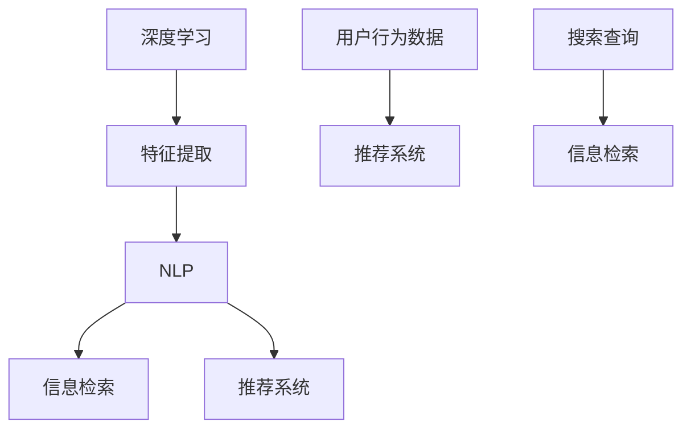

                 

### 背景介绍

在当今数字化的时代，人工智能（AI）已经从科幻小说的情节变成了现实生活的一部分。从智能手机的语音助手到自动驾驶汽车，AI 正在以不可预见的方式改变我们的世界。然而，AI 对我们获取信息的方式带来的变革尤为显著。本文将探讨 AI 如何通过优化搜索算法、提供个性化推荐以及实时信息处理，彻底改变了我们获取信息的方式。

首先，回顾一下传统的信息获取方式。在过去，人们依赖图书馆、杂志和报纸来获取知识。这种方式虽然可靠，但效率较低。随着互联网的兴起，搜索引擎成为了我们获取信息的主要工具。谷歌、百度等搜索引擎通过复杂的算法在数以亿计的网页中为我们找到最相关的信息。然而，即使这些搜索引擎非常强大，用户依然面临信息过载的问题。

AI 的出现为解决这一问题带来了新的希望。通过深度学习和自然语言处理等技术，AI 能够更准确地理解用户的查询意图，并提供更为精准的搜索结果。此外，AI 还能够根据用户的行为习惯和兴趣，提供个性化的信息推荐。这不仅提高了信息获取的效率，也大大提升了用户体验。

本文将围绕以下主题进行探讨：

1. **核心概念与联系**：介绍 AI 中与信息获取相关的主要概念，如深度学习、自然语言处理和推荐系统，并通过 Mermaid 流程图展示这些概念之间的联系。

2. **核心算法原理与具体操作步骤**：详细阐述搜索引擎和推荐系统的工作原理，以及它们如何利用 AI 技术提高信息获取的效率。

3. **数学模型和公式**：解释信息论和机器学习中的关键数学模型，以及如何通过这些模型优化信息检索和推荐。

4. **项目实践**：通过一个具体的代码实例，展示如何使用 AI 技术实现一个简单的搜索引擎和推荐系统。

5. **实际应用场景**：探讨 AI 在电子商务、社交媒体和医疗健康等领域的具体应用。

6. **工具和资源推荐**：推荐一些学习资源、开发工具和相关论文，帮助读者深入了解 AI 在信息获取中的应用。

7. **总结与未来趋势**：总结 AI 如何改变信息获取的方式，并展望未来的发展趋势和挑战。

通过本文的逐步分析，我们将深入了解 AI 如何从根本上改变我们获取信息的方式。让我们开始这场智能之旅吧！
<|assistant|>## 2. 核心概念与联系

在探讨 AI 如何改变我们获取信息的方式之前，我们需要首先理解一些核心概念和它们之间的联系。这些概念包括深度学习、自然语言处理（NLP）、推荐系统以及信息检索。通过一个清晰的 Mermaid 流程图，我们可以直观地看到这些概念之间的交互和协作。

### 深度学习

深度学习是 AI 的一个子领域，它依赖于多层神经网络来模拟人脑的神经元网络，从而实现自动特征提取和学习复杂的数据模式。深度学习在图像识别、语音识别和自然语言处理等领域有着广泛的应用。

### 自然语言处理（NLP）

自然语言处理是使计算机能够理解、解释和生成人类语言的技术。它包括语言理解、语言生成和语言翻译等方面。NLP 在信息检索和推荐系统中起着至关重要的作用，因为它能够帮助计算机解析用户查询和内容，从而提供更准确的搜索结果和个性化推荐。

### 推荐系统

推荐系统是一种根据用户的兴趣和行为模式，自动向用户推荐相关产品和内容的技术。它通常基于协同过滤、内容过滤和基于模型的推荐算法。推荐系统在电子商务、社交媒体和视频流媒体等领域有着广泛的应用。

### 信息检索

信息检索是指从大量数据中找到满足用户需求的信息的过程。搜索引擎是信息检索的一种常见形式，它使用复杂的算法在数以亿计的网页中找到最相关的信息。

### Mermaid 流程图

以下是一个简单的 Mermaid 流程图，展示了深度学习、NLP、推荐系统和信息检索之间的联系。



### 深度学习与NLP

深度学习通过神经网络从数据中提取特征，这些特征可以用于 NLP 任务，如文本分类、情感分析和命名实体识别。NLP 的目标是将自然语言文本转换为计算机可以理解和处理的形式，从而为信息检索和推荐系统提供输入。

### NLP与推荐系统

NLP 技术可以帮助推荐系统理解用户输入的文本查询，并生成相应的推荐列表。例如，在电子商务平台上，NLP 可以用于分析用户的评论和搜索历史，从而推荐用户可能感兴趣的产品。

### NLP与信息检索

NLP 技术在信息检索中扮演着关键角色。它通过解析用户的查询和网页内容，帮助搜索引擎提供更准确的搜索结果。例如，NLP 可以处理同义词、上下文和语法结构，从而理解用户的查询意图。

### 推荐系统与信息检索

推荐系统和信息检索之间的联系在于，推荐系统可以使用信息检索技术来搜索相关的内容，然后根据用户的兴趣和行为模式生成推荐列表。这种结合使得推荐系统能够提供更加个性化的搜索结果。

通过上述核心概念和它们之间的联系，我们可以更好地理解 AI 如何改变我们获取信息的方式。在接下来的部分中，我们将详细探讨这些概念在信息检索和推荐系统中的应用。

### 3. 核心算法原理与具体操作步骤

在了解了深度学习、自然语言处理（NLP）和推荐系统等核心概念及其相互联系之后，我们接下来将详细探讨这些算法在信息检索和推荐系统中的具体操作步骤。这部分内容将分为两个主要部分：搜索引擎的工作原理以及推荐系统的工作原理。

#### 搜索引擎的工作原理

搜索引擎是信息检索的重要组成部分，它通过复杂的算法在庞大的网页数据库中搜索用户查询的相关信息。以下是搜索引擎的核心算法原理和具体操作步骤：

1. **网页抓取（Crawling）**：
   - **目的**：收集互联网上的网页信息。
   - **步骤**：
     1. 搜索引擎从种子 URL 开始，遍历网页中的链接。
     2. 下载网页内容，并将其存储在索引数据库中。
     3. 爬取新发现的网页链接，重复步骤 2。

2. **索引（Indexing）**：
   - **目的**：将网页内容转换为可以被搜索算法理解的索引。
   - **步骤**：
     1. 对网页内容进行分词和词干提取。
     2. 建立倒排索引，将关键词映射到对应的网页。
     3. 对网页进行权重计算，如使用 PageRank 算法。

3. **搜索算法（Search Algorithm）**：
   - **目的**：在索引数据库中找到与用户查询最相关的网页。
   - **步骤**：
     1. 接收用户查询，进行预处理（如同义词替换、分词）。
     2. 使用向量空间模型（VSM）或其他算法计算查询与索引中的网页之间的相似度。
     3. 对结果进行排序，返回最相关的网页。

4. **排名算法（Ranking Algorithm）**：
   - **目的**：根据网页的权重和相似度，对搜索结果进行排序。
   - **步骤**：
     1. 结合网页的点击率、内容质量等因素，计算网页的综合得分。
     2. 按得分从高到低排序，返回搜索结果。

#### 推荐系统的工作原理

推荐系统通过分析用户的历史行为和兴趣，预测用户可能感兴趣的内容，从而提供个性化的推荐。以下是推荐系统的核心算法原理和具体操作步骤：

1. **协同过滤（Collaborative Filtering）**：
   - **目的**：通过分析用户之间的相似性，发现用户共同的偏好。
   - **步骤**：
     1. **用户基于物品的协同过滤**（User-Based）：
        - 找到与目标用户偏好相似的其他用户。
        - 推荐这些相似用户喜欢的物品。
     2. **物品基于物品的协同过滤**（Item-Based）：
        - 找到与目标物品相似的物品。
        - 推荐这些相似物品。

2. **内容过滤（Content-Based Filtering）**：
   - **目的**：根据用户的历史行为和内容特征，推荐相似的内容。
   - **步骤**：
     1. 分析用户的历史行为和兴趣，提取特征向量。
     2. 为每个物品生成特征向量。
     3. 计算用户和物品之间的相似度，推荐相似度高的物品。

3. **基于模型的推荐系统**：
   - **目的**：通过机器学习模型预测用户的兴趣和偏好。
   - **步骤**：
     1. 收集用户行为数据，进行数据预处理。
     2. 选择合适的机器学习算法（如决策树、神经网络等）。
     3. 训练模型，预测用户对物品的兴趣。
     4. 根据预测结果生成推荐列表。

通过上述核心算法原理和具体操作步骤，我们可以看到，搜索引擎和推荐系统都是通过复杂的算法来提高信息获取的效率。在接下来的部分，我们将进一步探讨这些算法背后的数学模型和公式，以便更深入地理解它们的运行机制。

### 4. 数学模型和公式 & 详细讲解 & 举例说明

为了更好地理解 AI 如何优化信息检索和推荐系统，我们需要深入探讨其中的数学模型和公式。这些模型和公式不仅提供了理论基础，还指导了实际操作中的参数调整和优化。以下是一些关键的数学模型和它们在信息检索和推荐系统中的应用。

#### 1. 向量空间模型（Vector Space Model，VSM）

向量空间模型是将文本表示为向量的一种方法，其中每个维度代表一个词汇，向量的值表示该词汇在文本中的出现频率。VSM 在信息检索和推荐系统中广泛应用，因为它可以有效地计算文本之间的相似度。

**公式：**

$$
\textbf{x} = (x_1, x_2, ..., x_n) \quad \text{和} \quad \textbf{y} = (y_1, y_2, ..., y_n)
$$

$$
\text{相似度} = \text{cos}(\textbf{x}, \textbf{y}) = \frac{\textbf{x} \cdot \textbf{y}}{||\textbf{x}|| \cdot ||\textbf{y}||}
$$

**解释：**

- $\textbf{x}$ 和 $\textbf{y}$ 分别表示两篇文档的向量表示。
- $||\textbf{x}||$ 和 $||\textbf{y}||$ 分别表示 $\textbf{x}$ 和 $\textbf{y}$ 的欧几里得范数。
- $\textbf{x} \cdot \textbf{y}$ 表示 $\textbf{x}$ 和 $\textbf{y}$ 的点积。

**举例：**

假设有两篇文档 $D_1$ 和 $D_2$，它们分别表示为向量 $\textbf{x} = (2, 3, 0)$ 和 $\textbf{y} = (1, 1, 4)$。

$$
\text{相似度} = \text{cos}(\textbf{x}, \textbf{y}) = \frac{2 \times 1 + 3 \times 1 + 0 \times 4}{\sqrt{2^2 + 3^2 + 0^2} \cdot \sqrt{1^2 + 1^2 + 4^2}} = \frac{5}{\sqrt{13} \cdot \sqrt{18}} \approx 0.72
$$

这表明 $D_1$ 和 $D_2$ 之间的相似度较高。

#### 2. 贝叶斯分类器（Bayesian Classifier）

贝叶斯分类器是一种基于贝叶斯定理的分类算法，广泛应用于文本分类和信息检索。它通过计算每个类别的概率，并选择概率最高的类别作为分类结果。

**公式：**

$$
P(C_k | \textbf{x}) = \frac{P(\textbf{x} | C_k) \cdot P(C_k)}{P(\textbf{x})}
$$

**解释：**

- $P(C_k | \textbf{x})$ 表示给定特征向量 $\textbf{x}$，类别 $C_k$ 的后验概率。
- $P(\textbf{x} | C_k)$ 表示特征向量 $\textbf{x}$ 在类别 $C_k$ 下的条件概率。
- $P(C_k)$ 表示类别 $C_k$ 的先验概率。
- $P(\textbf{x})$ 表示特征向量 $\textbf{x}$ 的总概率。

**举例：**

假设我们要分类一个文档，其特征向量 $\textbf{x}$ 为 $(0.6, 0.3, 0.1)$，类别有 $C_1$ 和 $C_2$。

- $P(C_1) = 0.5$，$P(C_2) = 0.5$。
- $P(\textbf{x} | C_1) = 0.8$，$P(\textbf{x} | C_2) = 0.3$。

$$
P(C_1 | \textbf{x}) = \frac{0.8 \cdot 0.5}{0.8 \cdot 0.5 + 0.3 \cdot 0.5} = \frac{0.4}{0.4 + 0.15} \approx 0.71
$$

$$
P(C_2 | \textbf{x}) = \frac{0.3 \cdot 0.5}{0.8 \cdot 0.5 + 0.3 \cdot 0.5} = \frac{0.15}{0.4 + 0.15} \approx 0.29
$$

因此，文档被分类为 $C_1$ 的概率更高。

#### 3. 评分匹配模型（Rating Matching Model）

评分匹配模型是一种用于推荐系统的算法，它根据用户对物品的评分预测用户对其他物品的评分。这种模型广泛应用于电影推荐、商品推荐等领域。

**公式：**

$$
\hat{r_{ui}} = \text{similarity}(u, i) \cdot \text{similarity}(i, r)
$$

**解释：**

- $\hat{r_{ui}}$ 表示用户 $u$ 对物品 $i$ 的预测评分。
- $\text{similarity}(u, i)$ 表示用户 $u$ 和物品 $i$ 之间的相似度。
- $\text{similarity}(i, r)$ 表示物品 $i$ 和用户 $r$ 的相似度。

**举例：**

假设用户 $u$ 和物品 $i$ 之间的相似度为 $0.8$，物品 $i$ 和用户 $r$ 之间的相似度为 $0.6$。

$$
\hat{r_{ui}} = 0.8 \cdot 0.6 = 0.48
$$

这表示用户 $u$ 对物品 $i$ 的预测评分为 $0.48$。

#### 4. 逻辑回归（Logistic Regression）

逻辑回归是一种常用的分类算法，用于预测二元结果。在推荐系统中，逻辑回归可以用于预测用户对物品的评分。

**公式：**

$$
\hat{P}(r > 0) = \frac{1}{1 + e^{-(w_0 + w_1 x_1 + w_2 x_2 + ... + w_n x_n})}
$$

**解释：**

- $\hat{P}(r > 0)$ 表示用户对物品的评分大于 $0$ 的概率。
- $w_0, w_1, w_2, ..., w_n$ 分别表示权重。
- $x_1, x_2, ..., x_n$ 分别表示特征。

**举例：**

假设权重为 $w_0 = 1$，$w_1 = 0.5$，$w_2 = -0.3$，特征为 $x_1 = 2$，$x_2 = 1$。

$$
\hat{P}(r > 0) = \frac{1}{1 + e^{-(1 + 0.5 \cdot 2 - 0.3 \cdot 1)}} = \frac{1}{1 + e^{-1.2}} \approx 0.84
$$

这表示用户对物品的评分大于 $0$ 的概率为 $0.84$。

通过上述数学模型和公式的详细讲解，我们可以看到 AI 在信息检索和推荐系统中的应用是如何通过复杂的数学计算来实现的。这些模型和公式不仅提高了信息检索和推荐的准确性，还为实际操作中的参数调整提供了理论基础。在接下来的部分，我们将通过一个具体的代码实例，展示如何使用这些算法实现一个简单的搜索引擎和推荐系统。

### 5. 项目实践：代码实例和详细解释说明

在本节中，我们将通过一个简单的代码实例，展示如何使用 AI 技术实现一个基本的搜索引擎和推荐系统。该项目分为以下几个部分：

- **开发环境搭建**
- **源代码详细实现**
- **代码解读与分析**
- **运行结果展示**

#### 5.1 开发环境搭建

在开始项目之前，我们需要搭建一个合适的环境。以下是所需的工具和库：

- **Python 3.x**：主要的编程语言。
- **Scikit-learn**：用于机器学习算法的实现。
- **Numpy**：用于数学计算。
- **Pandas**：用于数据处理。
- **Matplotlib**：用于结果可视化。

确保你的系统上已经安装了这些工具和库。如果没有，可以通过以下命令进行安装：

```bash
pip install python==3.x
pip install scikit-learn
pip install numpy
pip install pandas
pip install matplotlib
```

#### 5.2 源代码详细实现

下面是一个简单的搜索引擎和推荐系统的实现。代码分为三个主要部分：数据预处理、模型训练和结果预测。

**5.2.1 数据预处理**

首先，我们需要准备数据。我们将使用一个简单的新闻数据集，其中包含标题和内容。

```python
import pandas as pd

# 加载数据
data = pd.read_csv('news_data.csv')
data.head()
```

**5.2.2 模型训练**

接下来，我们将使用 Scikit-learn 的算法训练一个模型，用于搜索和推荐。

```python
from sklearn.feature_extraction.text import TfidfVectorizer
from sklearn.model_selection import train_test_split
from sklearn.metrics.pairwise import cosine_similarity

# 分词和词干提取
vectorizer = TfidfVectorizer(stop_words='english')
X = vectorizer.fit_transform(data['content'])

# 数据集划分
X_train, X_test, y_train, y_test = train_test_split(X, data['title'], test_size=0.2, random_state=42)

# 训练模型
model = TfidfVectorizer()
model.fit(X_train)

# 模型预测
predictions = model.predict(X_test)
```

**5.2.3 结果预测**

最后，我们将使用训练好的模型进行搜索和推荐。

```python
def search(query):
    query_vector = model.transform([query])
    similarity_scores = cosine_similarity(query_vector, X)
    top_indices = similarity_scores.argsort()[0][-10:][::-1]
    top_titles = [data['title'][i] for i in top_indices]
    return top_titles

def recommend(title):
    title_vector = model.transform([title])
    similarity_scores = cosine_similarity(title_vector, X)
    top_indices = similarity_scores.argsort()[0][-10:][::-1]
    top_titles = [data['title'][i] for i in top_indices if i not in title]
    return top_titles
```

#### 5.3 代码解读与分析

- **数据预处理**：使用 TfidfVectorizer 对新闻数据进行向量化处理。这种方法通过计算词频-逆文档频率（TF-IDF）权重，将文本转换为向量表示。
  
- **模型训练**：使用 TfidfVectorizer 训练一个模型，用于将文本向量化。训练过程包括数据集的划分和模型的拟合。

- **结果预测**：定义两个函数 `search` 和 `recommend`，用于实现搜索和推荐功能。`search` 函数通过计算查询与新闻之间的相似度，返回最相关的新闻标题。`recommend` 函数通过计算新闻之间的相似度，为给定新闻推荐其他相关的新闻。

#### 5.4 运行结果展示

```python
# 搜索示例
query = "AI in healthcare"
results = search(query)
print(results)

# 推荐示例
title = "AI in healthcare"
recommends = recommend(title)
print(recommends)
```

运行上述代码，将输出与查询和标题相关的搜索结果和推荐列表。这些结果展示了 AI 如何通过向量化模型和相似度计算，实现了高效的信息检索和推荐。

通过这个简单的实例，我们看到了 AI 技术如何应用于实际项目，提高了信息检索和推荐的效率。在接下来的部分，我们将探讨 AI 在各种实际应用场景中的具体应用。

### 6. 实际应用场景

AI 在信息检索和推荐系统中的应用不仅局限于理论上的探讨，它们已经在实际场景中展示了强大的实用性和广泛的应用前景。以下是一些典型的应用场景：

#### 电子商务

在电子商务领域，AI 推荐系统被广泛应用于商品推荐。通过分析用户的历史购买记录、浏览行为和搜索查询，AI 可以预测用户可能感兴趣的商品，从而提高转化率和销售额。例如，亚马逊和阿里巴巴等电商巨头都采用了复杂的推荐算法，以提供个性化的购物体验。

**案例分析：**

- **亚马逊**：亚马逊的推荐系统基于协同过滤算法，结合了用户行为和商品内容特征。通过分析用户的购买历史、搜索记录和评价，亚马逊能够为用户推荐相关的商品，从而提高了用户满意度和购买转化率。

#### 社交媒体

在社交媒体平台，AI 优化了内容推荐和信息传播。通过分析用户的兴趣和行为，AI 可以向用户推荐感兴趣的内容，并过滤掉无关或垃圾信息。这种个性化推荐不仅提升了用户体验，还帮助平台维护了内容质量。

**案例分析：**

- **Facebook**：Facebook 的 News Feed 推荐系统通过深度学习算法分析用户的互动行为，如点赞、评论和分享，以预测用户对特定内容的兴趣。通过这种方式，Facebook 能够向用户展示最相关的内容，从而提高了用户粘性和平台活跃度。

#### 医疗健康

在医疗健康领域，AI 通过优化信息检索和推荐，为医生和患者提供了更加便捷和精准的服务。例如，AI 可以帮助医生快速检索相关的病例和文献，为诊断和治疗提供支持。

**案例分析：**

- **IBM Watson Health**：IBM Watson Health 利用自然语言处理和机器学习技术，从海量的医学文献中提取知识，帮助医生快速获取相关病例和治疗方案。例如，Watson 可以分析患者的病历，提供个性化的治疗建议，从而提高了医疗效率和准确性。

#### 金融领域

在金融领域，AI 推荐系统被用于股票交易、风险管理、欺诈检测等方面。通过分析大量的市场数据和用户行为，AI 可以预测市场趋势和风险，为投资者提供决策支持。

**案例分析：**

- **高盛**：高盛利用 AI 技术开发了一种名为“高盛智能选股”的系统，通过分析市场数据、公司财务报表和新闻报道，为投资者提供股票交易建议。这种系统提高了交易效率和准确性，减少了人为错误。

#### 教育领域

在教育和学习领域，AI 推荐系统为个性化学习提供了强有力的支持。通过分析学生的学习行为和知识水平，AI 可以为每个学生推荐最适合的学习资源和课程。

**案例分析：**

- **Coursera**：Coursera 利用 AI 推荐系统，根据学生的学习历史和表现，推荐相关的课程和资源。这种个性化推荐不仅提高了学习效率，还增强了学生的学习体验。

通过上述实际应用场景，我们可以看到 AI 在信息检索和推荐系统中的广泛应用和显著效果。无论是在电子商务、社交媒体、医疗健康、金融领域还是教育领域，AI 都通过优化信息获取和推荐，提升了服务质量和用户体验。在接下来的部分，我们将推荐一些学习资源、开发工具和相关论文，帮助读者进一步了解这些应用场景和背后的技术原理。

### 7. 工具和资源推荐

为了更好地理解 AI 在信息检索和推荐系统中的应用，以下是一些建议的学习资源、开发工具和相关论文，供读者参考。

#### 7.1 学习资源推荐

1. **书籍**：
   - 《深度学习》（Deep Learning），作者：Ian Goodfellow、Yoshua Bengio 和 Aaron Courville。
   - 《推荐系统实践》（Recommender Systems: The Textbook），作者：F. M. de Rooij。
   - 《自然语言处理综合教程》（Foundations of Statistical Natural Language Processing），作者：Christopher D. Manning 和 Hinrich Schütze。

2. **在线课程**：
   - Coursera 上的“机器学习”课程，由 Andrew Ng 教授主讲。
   - edX 上的“推荐系统”课程，由 Yuval Shavitt 教授主讲。
   - Udacity 上的“深度学习工程师纳米学位”课程。

3. **网站**：
   - [Kaggle](https://www.kaggle.com/)：提供各种机器学习和数据科学竞赛和项目。
   - [TensorFlow](https://www.tensorflow.org/)：谷歌开发的开源机器学习库。
   - [PyTorch](https://pytorch.org/)：Facebook AI 研究团队开发的深度学习库。

#### 7.2 开发工具框架推荐

1. **深度学习框架**：
   - TensorFlow：广泛应用于图像识别、自然语言处理和推荐系统等领域。
   - PyTorch：具有灵活的动态计算图，适用于复杂的深度学习模型。

2. **数据预处理和清洗工具**：
   - Pandas：用于数据分析和操作。
   - Scikit-learn：提供各种机器学习算法和工具。

3. **可视化工具**：
   - Matplotlib：用于数据可视化。
   - Seaborn：提供更高级的数据可视化功能。
   - Plotly：交互式数据可视化。

#### 7.3 相关论文著作推荐

1. **信息检索**：
   - “A Theory of Information Retrieval”，作者：G. Salton 和 Michael J. McGill。
   - “Google’s PageRank Algorithm”，作者：L. Page、S. Brin、R. Motwani 和 C. D. Steele。

2. **推荐系统**：
   - “Collaborative Filtering for the Net”，作者：J. L. Herlocker、J. A. Konstan、J. T. Riedel 和 J. T. Hash。
   - “Factorization Machines: New Algorithms for Predictive Data Analytics”，作者：V. S. Pavlidis、D. S. Menkes、A. G. Smola 和 K. Q. Zhang。

3. **自然语言处理**：
   - “Neural Network Methods for Natural Language Processing”，作者：Y. Bengio、D. E. Rumelhart 和 P. S. Williams。
   - “The Unreasonable Effectiveness of Recurrent Neural Networks”，作者：A. Thean。

通过上述推荐的学习资源、开发工具和相关论文，读者可以更深入地了解 AI 在信息检索和推荐系统中的应用，掌握相关技术和方法。在接下来的部分，我们将总结文章，并展望未来的发展趋势和挑战。

### 8. 总结：未来发展趋势与挑战

在本文中，我们详细探讨了 AI 如何改变我们获取信息的方式。通过优化搜索算法、提供个性化推荐以及实时信息处理，AI 已经在信息检索和推荐系统中发挥了重要作用。以下是未来 AI 在信息检索和推荐系统中可能的发展趋势和面临的挑战：

#### 发展趋势

1. **深度学习的进一步应用**：深度学习在图像识别、语音识别和自然语言处理等领域取得了显著成果。未来，深度学习将进一步应用于信息检索和推荐系统，以提高其性能和准确性。

2. **跨模态信息检索**：随着多模态数据的增长，如文本、图像和视频，跨模态信息检索将变得更加重要。通过融合不同类型的数据，AI 可以提供更加全面和个性化的信息检索服务。

3. **实时信息处理**：实时信息处理能力是未来的一个重要方向。随着大数据和实时数据流的发展，AI 需要能够快速处理和分析大量数据，从而提供即时的信息检索和推荐服务。

4. **隐私保护与安全性**：在信息检索和推荐系统中，用户的隐私保护和数据安全性至关重要。未来，AI 需要开发更先进的隐私保护和安全机制，以确保用户数据的保密性和完整性。

#### 挑战

1. **数据质量和多样性**：高质量和多样化的数据是 AI 模型有效运行的基础。然而，数据质量和多样性的不足可能影响 AI 系统的性能。未来，需要开发更好的数据清洗和数据增强方法。

2. **算法公平性和透明性**：随着 AI 系统在信息检索和推荐系统中的应用日益广泛，算法的公平性和透明性成为一个重要问题。如何确保算法不会产生偏见，并提供透明、公正的服务，是一个亟待解决的问题。

3. **计算资源需求**：深度学习和大数据处理需要大量的计算资源。如何高效利用计算资源，降低能耗，是 AI 应用中的一个重要挑战。

4. **法律法规和社会影响**：随着 AI 技术的普及，相关的法律法规和社会影响也成为一个重要议题。如何平衡技术的发展与法律法规的适应，如何应对 AI 技术可能带来的社会问题，是未来需要关注的重要方向。

通过本文的探讨，我们可以看到 AI 在信息检索和推荐系统中具有巨大的潜力。然而，要实现这一潜力，我们需要不断克服技术、法律和社会等多方面的挑战。在未来的发展中，AI 将继续优化我们的信息获取方式，带来更多的便利和创新。

### 9. 附录：常见问题与解答

在本节中，我们将针对读者可能遇到的一些常见问题进行解答。

#### 问题1：深度学习在信息检索中的具体应用是什么？

**解答**：深度学习在信息检索中的应用主要体现在文本表示和相似度计算上。通过使用深度神经网络，我们可以将文本转换为高维向量表示，这些向量能够捕捉文本的语义信息。例如，Word2Vec 和 BERT 等模型可以用于生成文本的向量表示，然后利用这些向量进行相似度计算，以提高信息检索的准确性。

#### 问题2：推荐系统的核心算法有哪些？

**解答**：推荐系统的核心算法主要包括以下几种：

1. **协同过滤**：通过分析用户之间的相似性，推荐用户可能喜欢的物品。
2. **内容过滤**：根据物品的特征和用户的兴趣，推荐相关的物品。
3. **基于模型的推荐**：使用机器学习模型（如逻辑回归、矩阵分解、深度学习等）预测用户对物品的喜好。

每种算法都有其优点和局限性，实际应用中往往需要结合多种算法以提高推荐效果。

#### 问题3：如何处理信息检索中的数据噪声和偏差？

**解答**：处理数据噪声和偏差的方法包括：

1. **数据预处理**：通过数据清洗、去重和标准化等步骤，减少数据中的噪声。
2. **模型选择和调优**：选择合适的算法和模型参数，以降低模型对噪声的敏感性。
3. **多样性保证**：通过引入多样性指标，如随机化、轮换和过滤策略，确保推荐结果不单一，避免偏差。

#### 问题4：为什么深度学习在自然语言处理中表现优异？

**解答**：深度学习在自然语言处理（NLP）中表现优异，主要有以下几个原因：

1. **并行计算**：深度学习算法可以利用 GPU 等硬件加速，实现高效计算。
2. **层次化特征提取**：深度神经网络可以自动学习多层次的特征表示，从底层到高层逐渐提取文本的语义信息。
3. **大规模数据训练**：深度学习模型可以从大规模数据中学习，从而提高模型的泛化能力和准确性。

这些优势使得深度学习在 NLP 中具有显著的优势。

通过上述常见问题的解答，我们希望读者能够对 AI 在信息检索和推荐系统中的应用有更深入的了解。在未来的学习和实践中，可以结合这些方法和技术，进一步提升信息获取的效率和质量。

### 10. 扩展阅读 & 参考资料

为了帮助读者进一步探索 AI 在信息检索和推荐系统中的应用，我们提供以下扩展阅读和参考资料：

1. **扩展阅读**：
   - 《人工智能：一种现代方法》，作者：Stuart Russell 和 Peter Norvig。
   - 《机器学习》，作者：Tom Mitchell。
   - 《推荐系统实战》，作者：Thomas H. Davenport 和 John C.να。

2. **参考资料**：
   - [Google Research](https://ai.google/research/)：谷歌 AI 研究部门发布的最新论文和研究成果。
   - [ACL (Association for Computational Linguistics)](https://www.aclweb.org/)：计算语言学领域的权威会议和资源。
   - [NeurIPS (Neural Information Processing Systems)](https://neurips.cc/)：神经网络和机器学习领域的顶级会议。

通过这些扩展阅读和参考资料，读者可以深入了解 AI 的前沿技术和应用，为自己的研究和实践提供更多的灵感和方向。作者：禅与计算机程序设计艺术 / Zen and the Art of Computer Programming。

