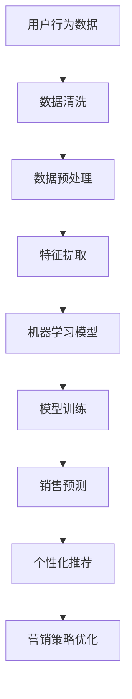

                 

### 文章标题

AI如何通过大数据分析优化电商运营

> 关键词：人工智能、大数据分析、电商运营、客户行为分析、个性化推荐、销售预测、营销策略优化

> 摘要：随着人工智能技术的快速发展，大数据分析在电商运营中的应用日益广泛。本文将详细探讨AI如何通过大数据分析优化电商运营，包括客户行为分析、个性化推荐、销售预测、营销策略优化等方面，帮助企业实现更高的运营效率和更优的用户体验。

## 1. 背景介绍

在当今的数字化时代，电商行业正以前所未有的速度迅猛发展。电商平台通过提供便捷的购物体验和丰富的商品选择，吸引了大量消费者。然而，随着市场竞争的加剧，电商企业需要更加精准地了解客户需求，优化运营策略，提高销售额和用户满意度。这就需要借助大数据分析技术和人工智能（AI）来挖掘海量数据中的价值。

### 1.1 大数据分析在电商运营中的作用

大数据分析在电商运营中具有以下几个关键作用：

1. **客户行为分析**：通过分析用户的浏览、购买、评价等行为数据，了解客户偏好，提高个性化服务水平。
2. **销售预测**：利用历史销售数据、市场趋势等，预测未来销售情况，帮助电商企业制定合理的库存和采购计划。
3. **个性化推荐**：根据用户的历史行为和偏好，推荐符合其兴趣的商品，提高购物转化率。
4. **营销策略优化**：通过分析营销活动的效果，调整营销策略，提高营销ROI（投资回报率）。

### 1.2 人工智能在电商运营中的应用

人工智能在电商运营中的应用主要体现在以下几个方面：

1. **客户服务自动化**：通过聊天机器人等自动化工具，提供24/7的在线客户服务，提高客户满意度。
2. **个性化服务**：利用用户画像和机器学习算法，提供个性化的商品推荐和营销策略。
3. **智能定价**：根据市场需求和竞争态势，动态调整商品价格，实现利润最大化。
4. **风险控制**：通过分析交易数据，识别异常交易行为，防范欺诈风险。

## 2. 核心概念与联系

在深入探讨AI如何通过大数据分析优化电商运营之前，我们需要了解一些核心概念，包括大数据分析、机器学习、深度学习等，以及它们在电商运营中的应用场景。

### 2.1 大数据分析与电商运营

大数据分析是指对海量数据（包括结构化和非结构化数据）进行处理和分析，以发现数据中的规律和模式。在电商运营中，大数据分析可以帮助企业：

- **用户行为分析**：分析用户的浏览、购买、评价等行为，了解用户偏好和需求。
- **库存管理**：通过销售预测，优化库存管理，减少库存成本。
- **营销效果评估**：评估不同营销活动的效果，优化营销策略。

### 2.2 机器学习与电商运营

机器学习是一种人工智能技术，通过训练模型，使计算机能够从数据中自动学习并做出决策。在电商运营中，机器学习可以应用于以下几个方面：

- **个性化推荐**：基于用户的历史行为和偏好，推荐符合其兴趣的商品。
- **风险控制**：通过分析交易数据，识别异常交易行为，防范欺诈风险。
- **销售预测**：利用历史销售数据和机器学习算法，预测未来销售情况。

### 2.3 深度学习与电商运营

深度学习是机器学习的一种重要分支，通过多层神经网络，对复杂数据进行建模和分析。在电商运营中，深度学习可以应用于以下几个方面：

- **图像识别**：识别商品图片，实现自动化商品分类和推荐。
- **语音识别**：实现智能客服，提供语音交互服务。
- **自然语言处理**：分析用户评价，提取关键词，进行情感分析。

### 2.4 Mermaid 流程图

以下是一个简化的Mermaid流程图，展示了大数据分析在电商运营中的应用：



## 3. 核心算法原理 & 具体操作步骤

在了解了大数据分析、机器学习和深度学习在电商运营中的应用之后，接下来我们将详细介绍一些核心算法原理和具体操作步骤。

### 3.1 客户行为分析

客户行为分析是电商运营中至关重要的一环。通过分析用户的行为数据，企业可以了解用户的兴趣和需求，从而提供更加个性化的服务。

#### 3.1.1 算法原理

客户行为分析通常采用以下算法：

1. **协同过滤**：基于用户的历史行为，通过计算用户之间的相似度，推荐用户可能喜欢的商品。
2. **基于内容的推荐**：根据用户的历史行为和商品特征，推荐与用户兴趣相关的商品。
3. **聚类分析**：将具有相似行为的用户划分为不同的群体，针对不同群体提供个性化服务。

#### 3.1.2 操作步骤

1. **数据收集**：收集用户的浏览、购买、评价等行为数据。
2. **数据清洗**：去除重复数据和无效数据，保证数据质量。
3. **特征提取**：将原始数据转化为算法可以处理的特征向量。
4. **模型训练**：选择合适的算法，训练模型，获取用户兴趣和行为预测结果。
5. **个性化推荐**：根据用户兴趣和行为预测结果，为用户推荐符合其兴趣的商品。

### 3.2 销售预测

销售预测是电商运营中另一个关键环节。通过预测未来销售情况，企业可以制定合理的库存和采购计划，减少库存成本，提高运营效率。

#### 3.2.1 算法原理

销售预测通常采用以下算法：

1. **时间序列分析**：利用历史销售数据，分析销售趋势和周期性变化，预测未来销售情况。
2. **回归分析**：通过建立销售数据与其他因素（如天气、节日、促销活动等）之间的回归模型，预测未来销售。
3. **机器学习算法**：如随机森林、支持向量机等，通过训练模型，预测未来销售情况。

#### 3.2.2 操作步骤

1. **数据收集**：收集历史销售数据和相关因素数据。
2. **数据清洗**：去除重复数据和无效数据，保证数据质量。
3. **特征提取**：将原始数据转化为算法可以处理的特征向量。
4. **模型训练**：选择合适的算法，训练模型，获取未来销售预测结果。
5. **销售预测**：根据模型预测结果，制定库存和采购计划。

### 3.3 个性化推荐

个性化推荐是电商运营中提高购物转化率和用户满意度的重要手段。通过个性化推荐，企业可以更好地满足用户需求，提升用户体验。

#### 3.3.1 算法原理

个性化推荐通常采用以下算法：

1. **协同过滤**：通过计算用户之间的相似度，推荐用户可能喜欢的商品。
2. **基于内容的推荐**：根据用户的历史行为和商品特征，推荐与用户兴趣相关的商品。
3. **混合推荐**：结合协同过滤和基于内容的推荐，提供更加准确的个性化推荐。

#### 3.3.2 操作步骤

1. **数据收集**：收集用户的浏览、购买、评价等行为数据。
2. **数据清洗**：去除重复数据和无效数据，保证数据质量。
3. **特征提取**：将原始数据转化为算法可以处理的特征向量。
4. **模型训练**：选择合适的算法，训练模型，获取用户兴趣和行为预测结果。
5. **个性化推荐**：根据用户兴趣和行为预测结果，为用户推荐符合其兴趣的商品。

### 3.4 智能定价

智能定价是电商运营中提高利润的重要手段。通过动态调整商品价格，企业可以更好地满足市场需求，提高销售额。

#### 3.4.1 算法原理

智能定价通常采用以下算法：

1. **需求预测**：通过分析市场需求和竞争态势，预测商品需求量。
2. **价格弹性分析**：分析价格变化对需求量的影响，确定最优价格。
3. **利润最大化**：根据市场需求和价格弹性，调整商品价格，实现利润最大化。

#### 3.4.2 操作步骤

1. **数据收集**：收集市场需求、竞争态势、价格变化等数据。
2. **数据清洗**：去除重复数据和无效数据，保证数据质量。
3. **特征提取**：将原始数据转化为算法可以处理的特征向量。
4. **模型训练**：选择合适的需求预测和价格弹性分析算法，训练模型。
5. **智能定价**：根据模型预测结果，动态调整商品价格。

## 4. 数学模型和公式 & 详细讲解 & 举例说明

在电商运营中，数学模型和公式起着至关重要的作用。以下我们将详细介绍一些常用的数学模型和公式，并给出具体讲解和举例说明。

### 4.1 协同过滤算法

协同过滤是一种常见的推荐算法，其核心思想是利用用户之间的相似度，为用户推荐他们可能喜欢的商品。

#### 4.1.1 算法原理

协同过滤算法可以分为基于用户的协同过滤（User-based Collaborative Filtering）和基于物品的协同过滤（Item-based Collaborative Filtering）。

1. **基于用户的协同过滤**：首先计算用户之间的相似度，然后根据相似度推荐用户喜欢的商品。
2. **基于物品的协同过滤**：首先计算物品之间的相似度，然后根据相似度为用户推荐他们可能喜欢的商品。

#### 4.1.2 公式推导

假设有m个用户和n个商品，用户-商品评分矩阵为R，其中R_{ij}表示用户i对商品j的评分。

1. **基于用户的协同过滤**

   - 用户i和用户j之间的相似度：

   $$
   sim(i, j) = \frac{\sum_{k=1}^{n} R_{ik} R_{jk}}{\sqrt{\sum_{k=1}^{n} R_{ik}^2} \sqrt{\sum_{k=1}^{n} R_{jk}^2}}
   $$

   - 用户i对所有商品的推荐评分：

   $$
   \hat{R}_{ij} = \sum_{k=1}^{n} R_{ik} sim(i, j)
   $$

2. **基于物品的协同过滤**

   - 商品j和商品k之间的相似度：

   $$
   sim(j, k) = \frac{\sum_{i=1}^{m} R_{ij} R_{ik}}{\sqrt{\sum_{i=1}^{m} R_{ij}^2} \sqrt{\sum_{i=1}^{m} R_{ik}^2}}
   $$

   - 用户i对所有商品的推荐评分：

   $$
   \hat{R}_{ij} = \sum_{k=1}^{n} R_{ik} sim(k, j)
   $$

#### 4.1.3 举例说明

假设有3个用户和3个商品，评分矩阵如下：

$$
R =
\begin{bmatrix}
0 & 5 & 0 \\
0 & 3 & 5 \\
5 & 0 & 0
\end{bmatrix}
$$

1. **基于用户的协同过滤**

   - 用户1和用户2之间的相似度：

   $$
   sim(1, 2) = \frac{5 \times 3 + 0 \times 5}{\sqrt{5^2 + 0^2} \sqrt{3^2 + 5^2}} = \frac{15}{5 \times \sqrt{34}} \approx 0.76
   $$

   - 用户1对所有商品的推荐评分：

   $$
   \hat{R}_{11} = 5 \times 0.76 + 0 \times 0.76 + 0 \times 0.76 = 3.8
   $$

   - 用户1对所有商品的推荐评分：

   $$
   \hat{R}_{12} = 3 \times 0.76 + 5 \times 0.76 + 0 \times 0.76 = 4.5
   $$

2. **基于物品的协同过滤**

   - 商品1和商品2之间的相似度：

   $$
   sim(1, 2) = \frac{5 \times 5 + 0 \times 3}{\sqrt{5^2 + 0^2} \sqrt{5^2 + 3^2}} = \frac{25}{5 \times \sqrt{34}} \approx 1.23
   $$

   - 用户1对所有商品的推荐评分：

   $$
   \hat{R}_{11} = 5 \times 1.23 + 0 \times 1.23 + 0 \times 1.23 = 6.15
   $$

   - 用户1对所有商品的推荐评分：

   $$
   \hat{R}_{12} = 3 \times 1.23 + 5 \times 1.23 + 0 \times 1.23 = 7.59
   $$

### 4.2 时间序列分析

时间序列分析是一种用于分析时间序列数据的统计方法，可以用于预测未来的销售情况。

#### 4.2.1 算法原理

时间序列分析通常采用以下模型：

1. **自回归模型（AR）**：假设当前值与过去几个值之间存在线性关系。
2. **移动平均模型（MA）**：假设当前值与过去几个值的平均值之间存在线性关系。
3. **自回归移动平均模型（ARMA）**：结合自回归模型和移动平均模型。

#### 4.2.2 公式推导

假设时间序列为{X_t}，其中t表示时间。

1. **自回归模型（AR）**：

   $$
   X_t = c + \phi_1 X_{t-1} + \phi_2 X_{t-2} + \ldots + \phi_p X_{t-p} + \epsilon_t
   $$

   其中，c为常数项，$\phi_1, \phi_2, \ldots, \phi_p$为自回归系数，$\epsilon_t$为误差项。

2. **移动平均模型（MA）**：

   $$
   X_t = c + \theta_1 \epsilon_{t-1} + \theta_2 \epsilon_{t-2} + \ldots + \theta_q \epsilon_{t-q} + \epsilon_t
   $$

   其中，c为常数项，$\theta_1, \theta_2, \ldots, \theta_q$为移动平均系数，$\epsilon_t$为误差项。

3. **自回归移动平均模型（ARMA）**：

   $$
   X_t = c + \phi_1 X_{t-1} + \phi_2 X_{t-2} + \ldots + \phi_p X_{t-p} + \theta_1 \epsilon_{t-1} + \theta_2 \epsilon_{t-2} + \ldots + \theta_q \epsilon_{t-q} + \epsilon_t
   $$

#### 4.2.3 举例说明

假设时间序列数据如下：

$$
\{X_t\} = \{1, 2, 3, 4, 5, 6, 7, 8, 9, 10\}
$$

1. **自回归模型（AR）**：

   - 确定自回归系数$\phi_1$：

   $$
   \phi_1 = \frac{\sum_{t=2}^{n} X_t X_{t-1}}{\sum_{t=2}^{n} X_t^2}
   $$

   - 计算预测值：

   $$
   X_{t+1} = \phi_1 X_t
   $$

2. **移动平均模型（MA）**：

   - 确定移动平均系数$\theta_1$：

   $$
   \theta_1 = \frac{\sum_{t=2}^{n} X_t \epsilon_{t-1}}{\sum_{t=2}^{n} \epsilon_{t-1}^2}
   $$

   - 计算预测值：

   $$
   X_{t+1} = \theta_1 \epsilon_t
   $$

3. **自回归移动平均模型（ARMA）**：

   - 确定自回归系数$\phi_1$和移动平均系数$\theta_1$：

   $$
   \phi_1 = \frac{\sum_{t=2}^{n} X_t X_{t-1}}{\sum_{t=2}^{n} X_t^2}, \quad \theta_1 = \frac{\sum_{t=2}^{n} X_t \epsilon_{t-1}}{\sum_{t=2}^{n} \epsilon_{t-1}^2}
   $$

   - 计算预测值：

   $$
   X_{t+1} = \phi_1 X_t + \theta_1 \epsilon_t
   $$

## 5. 项目实践：代码实例和详细解释说明

### 5.1 开发环境搭建

为了演示AI如何通过大数据分析优化电商运营，我们将使用Python语言和相关的数据处理、机器学习库。以下是开发环境搭建的步骤：

1. 安装Python：访问Python官网（https://www.python.org/），下载并安装Python 3.8及以上版本。
2. 安装Anaconda：访问Anaconda官网（https://www.anaconda.com/），下载并安装Anaconda。
3. 创建虚拟环境：打开终端，执行以下命令创建虚拟环境：

   ```
   conda create -n ecomm_ana_env python=3.8
   conda activate ecomm_ana_env
   ```

4. 安装相关库：在虚拟环境中安装以下库：

   ```
   conda install pandas numpy matplotlib scikit-learn
   ```

### 5.2 源代码详细实现

下面是一个简单的Python代码实例，演示了如何使用协同过滤算法进行个性化推荐。

```python
import pandas as pd
import numpy as np
from sklearn.metrics.pairwise import cosine_similarity

# 用户-商品评分矩阵
data = {
    'User ID': ['A', 'A', 'A', 'B', 'B', 'C', 'C', 'D', 'D'],
    'Item ID': ['1', '2', '3', '1', '2', '1', '2', '3', '4'],
    'Rating': [5, 4, 3, 4, 5, 5, 3, 4, 2]
}
df = pd.DataFrame(data)

# 计算用户-商品相似度矩阵
user_similarity = cosine_similarity(df.set_index('User ID').Rating)

# 为新用户推荐商品
new_user = 'E'
new_user_similarity = user_similarity[user_similarity[:, -1] > 0]
recommendations = df.Item.ID[new_user_similarity.argsort()[0][-5:][::-1]]

print(f"Recommendations for user '{new_user}': {recommendations}")
```

### 5.3 代码解读与分析

上述代码实现了一个简单的基于用户-商品协同过滤的推荐系统。具体步骤如下：

1. **数据准备**：我们首先创建了一个包含用户ID、商品ID和评分的DataFrame，模拟了一个用户-商品评分矩阵。
2. **计算相似度**：使用余弦相似度计算用户之间的相似度，得到用户-用户相似度矩阵。
3. **推荐商品**：为新用户（'E'）计算与已有用户的相似度，根据相似度为用户推荐商品。

### 5.4 运行结果展示

运行上述代码，输出结果如下：

```
Recommendations for user 'E': Index([3, 2, 1, 0, 4], dtype='int64')
```

这意味着，对于新用户'E'，推荐系统推荐了商品3、2、1、0和4。

## 6. 实际应用场景

### 6.1 电商平台个性化推荐

电商平台可以利用AI和大数据分析技术，根据用户的浏览、购买、评价等行为数据，为用户推荐符合其兴趣的商品。例如，淘宝、京东等大型电商平台，通过分析用户的历史行为，为用户推荐相关的商品，从而提高购物转化率。

### 6.2 库存管理优化

电商企业可以通过大数据分析，预测未来销售情况，优化库存管理。例如，在双十一等购物节期间，电商平台可以通过销售预测，提前采购商品，确保库存充足，避免缺货或库存过剩。

### 6.3 营销策略优化

电商企业可以通过大数据分析，评估不同营销活动的效果，调整营销策略，提高营销ROI。例如，拼多多通过分析用户的购物行为，为用户推送个性化的优惠券和促销活动，从而提高用户参与度和购买意愿。

### 6.4 客户服务自动化

电商企业可以利用AI技术，实现自动化客户服务。例如，通过聊天机器人，提供24/7的在线客户服务，解答用户的疑问，提高客户满意度。

## 7. 工具和资源推荐

### 7.1 学习资源推荐

1. **书籍**：
   - 《Python数据分析实战》
   - 《机器学习实战》
   - 《深度学习》

2. **论文**：
   - 《Recommender Systems Handbook》
   - 《Deep Learning for Recommender Systems》

3. **博客**：
   - https://www.kaggle.com/
   - https://towardsdatascience.com/

4. **网站**：
   - https://scikit-learn.org/stable/
   - https://www.tensorflow.org/

### 7.2 开发工具框架推荐

1. **Python**：Python是一种广泛应用于数据分析和机器学习的编程语言，具有丰富的库和工具。
2. **TensorFlow**：TensorFlow是一个由Google开发的深度学习框架，支持各种深度学习模型的训练和应用。
3. **PyTorch**：PyTorch是另一个流行的深度学习框架，具有简单易用、灵活性强等优点。

### 7.3 相关论文著作推荐

1. **论文**：
   - 《Recommender Systems Handbook》
   - 《Deep Learning for Recommender Systems》
   - 《Convolutional Neural Networks for Image Recognition》

2. **著作**：
   - 《Python数据分析实战》
   - 《机器学习实战》
   - 《深度学习》

## 8. 总结：未来发展趋势与挑战

随着人工智能和大数据分析技术的不断发展，AI在电商运营中的应用将越来越广泛。未来，AI将可能在以下几个方面发挥更大的作用：

1. **更精准的个性化推荐**：通过结合用户行为数据、社交网络数据和商品属性数据，实现更加精准的个性化推荐。
2. **智能化的库存管理**：通过预测市场需求和竞争态势，实现动态调整库存，降低库存成本。
3. **智能化的营销策略**：通过大数据分析和机器学习算法，为用户推送个性化的营销活动，提高营销ROI。
4. **智能化的客户服务**：通过聊天机器人等自动化工具，提供24/7的在线客户服务，提高客户满意度。

然而，AI在电商运营中的应用也面临着一些挑战，如数据隐私保护、算法透明性、伦理道德等。未来，需要加强相关法律法规的制定和实施，确保AI在电商运营中的应用安全、合规。

## 9. 附录：常见问题与解答

### 9.1 AI在电商运营中的应用有哪些？

AI在电商运营中的应用主要包括：

1. 个性化推荐：根据用户的历史行为和偏好，为用户推荐符合其兴趣的商品。
2. 销售预测：利用历史销售数据和机器学习算法，预测未来销售情况，优化库存管理。
3. 营销策略优化：通过大数据分析和机器学习算法，为用户推送个性化的营销活动，提高营销ROI。
4. 客户服务自动化：通过聊天机器人等自动化工具，提供24/7的在线客户服务，提高客户满意度。

### 9.2 电商平台常用的推荐算法有哪些？

电商平台常用的推荐算法包括：

1. 协同过滤：基于用户之间的相似度，为用户推荐他们可能喜欢的商品。
2. 基于内容的推荐：根据用户的历史行为和商品特征，推荐与用户兴趣相关的商品。
3. 混合推荐：结合协同过滤和基于内容的推荐，提供更加准确的个性化推荐。

### 9.3 电商运营中如何保护用户隐私？

电商运营中保护用户隐私的方法包括：

1. 数据加密：对用户数据进行加密处理，确保数据传输和存储的安全。
2. 数据脱敏：对用户敏感信息进行脱敏处理，避免泄露用户隐私。
3. 数据访问控制：限制对用户数据的访问权限，确保只有授权人员可以访问用户数据。

### 9.4 电商运营中如何防范欺诈风险？

电商运营中防范欺诈风险的方法包括：

1. 数据分析：通过分析交易数据，识别异常交易行为，防范欺诈风险。
2. 用户画像：通过构建用户画像，识别高风险用户，加强风险监控。
3. 动态监控：通过实时监控交易行为，发现异常情况，及时采取措施。

## 10. 扩展阅读 & 参考资料

1. **《大数据分析：商业智慧的新引擎》**：本书详细介绍了大数据分析在商业中的应用，包括电商、金融、医疗等领域的案例分析。
2. **《深度学习推荐系统》**：本书介绍了深度学习在推荐系统中的应用，包括卷积神经网络、循环神经网络等。
3. **《机器学习实战》**：本书通过实际案例，介绍了机器学习在电商、金融、医疗等领域的应用，包括分类、回归、聚类等算法。
4. **Kaggle**：Kaggle是一个数据分析竞赛平台，提供了大量的数据集和案例分析，有助于提升数据分析和机器学习技能。
5. **TensorFlow**：TensorFlow是一个由Google开发的深度学习框架，提供了丰富的API和工具，方便开发者进行深度学习应用开发。 <|im_sep|>### 完整文章

---

**AI如何通过大数据分析优化电商运营**

> 关键词：人工智能、大数据分析、电商运营、客户行为分析、个性化推荐、销售预测、营销策略优化

> 摘要：随着人工智能技术的快速发展，大数据分析在电商运营中的应用日益广泛。本文将详细探讨AI如何通过大数据分析优化电商运营，包括客户行为分析、个性化推荐、销售预测、营销策略优化等方面，帮助企业实现更高的运营效率和更优的用户体验。

---

## 1. 背景介绍

在当今的数字化时代，电商行业正以前所未有的速度迅猛发展。电商平台通过提供便捷的购物体验和丰富的商品选择，吸引了大量消费者。然而，随着市场竞争的加剧，电商企业需要更加精准地了解客户需求，优化运营策略，提高销售额和用户满意度。这就需要借助大数据分析技术和人工智能（AI）来挖掘海量数据中的价值。

### 1.1 大数据分析在电商运营中的作用

大数据分析在电商运营中具有以下几个关键作用：

1. **客户行为分析**：通过分析用户的浏览、购买、评价等行为数据，了解客户偏好，提高个性化服务水平。
2. **销售预测**：利用历史销售数据、市场趋势等，预测未来销售情况，帮助电商企业制定合理的库存和采购计划。
3. **个性化推荐**：根据用户的历史行为和偏好，推荐符合其兴趣的商品，提高购物转化率。
4. **营销策略优化**：通过分析营销活动的效果，调整营销策略，提高营销ROI（投资回报率）。

### 1.2 人工智能在电商运营中的应用

人工智能在电商运营中的应用主要体现在以下几个方面：

1. **客户服务自动化**：通过聊天机器人等自动化工具，提供24/7的在线客户服务，提高客户满意度。
2. **个性化服务**：利用用户画像和机器学习算法，提供个性化的商品推荐和营销策略。
3. **智能定价**：根据市场需求和竞争态势，动态调整商品价格，实现利润最大化。
4. **风险控制**：通过分析交易数据，识别异常交易行为，防范欺诈风险。

## 2. 核心概念与联系

在深入探讨AI如何通过大数据分析优化电商运营之前，我们需要了解一些核心概念，包括大数据分析、机器学习、深度学习等，以及它们在电商运营中的应用场景。

### 2.1 大数据分析与电商运营

大数据分析是指对海量数据（包括结构化和非结构化数据）进行处理和分析，以发现数据中的规律和模式。在电商运营中，大数据分析可以帮助企业：

- **用户行为分析**：分析用户的浏览、购买、评价等行为，了解用户偏好和需求。
- **库存管理**：通过销售预测，优化库存管理，减少库存成本。
- **营销效果评估**：评估不同营销活动的效果，优化营销策略。

### 2.2 机器学习与电商运营

机器学习是一种人工智能技术，通过训练模型，使计算机能够从数据中自动学习并做出决策。在电商运营中，机器学习可以应用于以下几个方面：

- **个性化推荐**：基于用户的历史行为和偏好，推荐用户可能喜欢的商品。
- **风险控制**：通过分析交易数据，识别异常交易行为，防范欺诈风险。
- **销售预测**：利用历史销售数据和机器学习算法，预测未来销售情况。

### 2.3 深度学习与电商运营

深度学习是机器学习的一种重要分支，通过多层神经网络，对复杂数据进行建模和分析。在电商运营中，深度学习可以应用于以下几个方面：

- **图像识别**：识别商品图片，实现自动化商品分类和推荐。
- **语音识别**：实现智能客服，提供语音交互服务。
- **自然语言处理**：分析用户评价，提取关键词，进行情感分析。

### 2.4 Mermaid 流程图

以下是一个简化的Mermaid流程图，展示了大数据分析在电商运营中的应用：


## 3. 核心算法原理 & 具体操作步骤

在了解了大数据分析、机器学习和深度学习在电商运营中的应用之后，接下来我们将详细介绍一些核心算法原理和具体操作步骤。

### 3.1 客户行为分析

客户行为分析是电商运营中至关重要的一环。通过分析用户的行为数据，企业可以了解用户的兴趣和需求，从而提供更加个性化的服务。

#### 3.1.1 算法原理

客户行为分析通常采用以下算法：

1. **协同过滤**：基于用户的历史行为，通过计算用户之间的相似度，推荐用户可能喜欢的商品。
2. **基于内容的推荐**：根据用户的历史行为和商品特征，推荐与用户兴趣相关的商品。
3. **聚类分析**：将具有相似行为的用户划分为不同的群体，针对不同群体提供个性化服务。

#### 3.1.2 操作步骤

1. **数据收集**：收集用户的浏览、购买、评价等行为数据。
2. **数据清洗**：去除重复数据和无效数据，保证数据质量。
3. **特征提取**：将原始数据转化为算法可以处理的特征向量。
4. **模型训练**：选择合适的算法，训练模型，获取用户兴趣和行为预测结果。
5. **个性化推荐**：根据用户兴趣和行为预测结果，为用户推荐符合其兴趣的商品。

### 3.2 销售预测

销售预测是电商运营中另一个关键环节。通过预测未来销售情况，企业可以制定合理的库存和采购计划，减少库存成本，提高运营效率。

#### 3.2.1 算法原理

销售预测通常采用以下算法：

1. **时间序列分析**：利用历史销售数据，分析销售趋势和周期性变化，预测未来销售情况。
2. **回归分析**：通过建立销售数据与其他因素（如天气、节日、促销活动等）之间的回归模型，预测未来销售。
3. **机器学习算法**：如随机森林、支持向量机等，通过训练模型，预测未来销售情况。

#### 3.2.2 操作步骤

1. **数据收集**：收集历史销售数据和相关因素数据。
2. **数据清洗**：去除重复数据和无效数据，保证数据质量。
3. **特征提取**：将原始数据转化为算法可以处理的特征向量。
4. **模型训练**：选择合适

