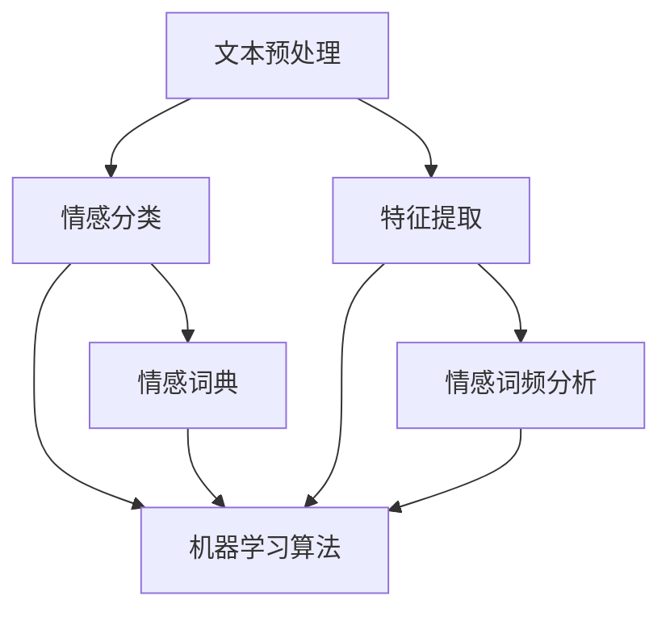

                 

### 背景介绍

#### 1.1 AI 情感分析技术的起源

人工智能（AI）情感分析技术起源于20世纪90年代，随着计算机技术的发展和大数据时代的来临，人类对于计算机处理情感信息的期望逐渐增加。情感分析（Sentiment Analysis），也称为意见挖掘，是自然语言处理（NLP）的一个分支，旨在从文本数据中识别出作者的情感倾向，如正面、负面或中性。

#### 1.2 情感分析技术的快速发展

近年来，随着深度学习、神经网络等人工智能技术的发展，情感分析技术取得了显著的进步。特别是在图像、语音和文本等多模态数据中，情感分析的应用日益广泛。例如，社交媒体平台通过情感分析技术来监控用户情绪，电商平台利用情感分析来优化产品推荐，医疗领域通过情感分析来辅助诊断和个性化治疗等。

#### 1.3 用户情感分析的重要性

用户情感分析在诸多领域具有重要意义。首先，它可以帮助企业更好地理解消费者需求，从而优化产品和服务。其次，在社交网络平台上，用户情感分析有助于监控舆论动态，预防负面事件的发生。此外，在教育、医疗、娱乐等领域，情感分析技术同样具有广泛的应用潜力。

### 1.4 当前技术挑战与研究方向

尽管情感分析技术取得了显著的进展，但仍然面临一些挑战。例如，如何准确地识别复杂情感（如喜悦、悲伤、愤怒等）、如何处理含糊不清或双关语的表达、如何保证跨语言的情感识别等。这些问题的解决，将推动情感分析技术向更高层次的发展。

### 1.5 本文结构

本文将首先介绍情感分析技术的核心概念与联系，然后深入探讨情感分析算法原理与操作步骤，通过数学模型和公式详细讲解，结合实际项目实践代码实例，最后分析情感分析技术的应用场景、工具和资源，以及总结未来发展趋势与挑战。

接下来，我们将逐步深入探讨情感分析技术的核心概念、算法原理，以及其实际应用，敬请期待。{|assistant|}

### 核心概念与联系

在深入探讨情感分析技术之前，我们需要先理解一些核心概念和它们之间的关系。这些概念包括文本预处理、情感分类、特征提取、机器学习算法等。以下是一个详细的 Mermaid 流程图，用于展示这些概念之间的联系。



#### 2.1 文本预处理

文本预处理是情感分析的第一步，其主要目标是清理和规范化原始文本数据，使其适合后续分析。文本预处理通常包括以下步骤：

1. 去除标点符号和特殊字符
2. 转换文本为小写
3. 分词，即将文本分割成单词或短语
4. 去除停用词，这些词如“的”、“和”、“是”等在情感分析中通常不提供有用信息
5. 词干提取，即还原单词的基本形式，如将“running”、“runs”和“ran”都还原为“run”

#### 2.2 情感分类

情感分类是情感分析的核心任务，其目标是根据文本内容判断其情感倾向。情感分类可以分为两类：二分类和三分类。二分类将情感划分为正面和负面，而三分类则将情感划分为正面、负面和中性。

#### 2.3 特征提取

特征提取是从原始文本中提取出与情感相关的特征，这些特征可以用来训练机器学习模型。特征提取方法包括：

1. 词频（Term Frequency, TF）：文本中某个词出现的频率。
2. 逆文档频率（Inverse Document Frequency, IDF）：衡量一个词在文本集合中普遍性的度量。
3. 词袋模型（Bag of Words, BOW）：将文本表示为一个向量，其中每个维度代表一个词的TF或TF-IDF值。
4. 词嵌入（Word Embedding）：将单词映射到高维空间中的向量，如Word2Vec、GloVe等。

#### 2.4 机器学习算法

机器学习算法是情感分析的核心技术，它们通过学习大量标注数据来预测新文本的情感倾向。常用的机器学习算法包括：

1. 朴素贝叶斯（Naive Bayes）
2. 支持向量机（Support Vector Machine, SVM）
3. 随机森林（Random Forest）
4. 决策树（Decision Tree）
5. 神经网络（Neural Networks），特别是深度学习模型如卷积神经网络（CNN）和循环神经网络（RNN）

#### 2.5 情感词典

情感词典是一个包含大量情感词汇及其对应的情感标签的列表。情感词典可以用于快速识别文本中的情感词汇，是情感分析的重要工具。情感词典通常分为积极情感词典、消极情感词典和中性情感词典。

#### 2.6 情感词频分析

情感词频分析是一种基于词频统计的方法，通过计算文本中积极、消极和中性词汇的频率，来评估文本的情感倾向。这种方法简单有效，但可能不够精确，特别是在处理复杂情感时。

### 2.7 Mermaid 流程图解析

上述 Mermaid 流程图展示了文本预处理、情感分类、特征提取、机器学习算法、情感词典和情感词频分析等核心概念之间的相互关系。具体解析如下：

- **文本预处理**：是所有后续步骤的基础，确保原始文本数据的质量。
- **情感分类**：是情感分析的核心任务，通过机器学习算法实现。
- **特征提取**：将文本转换为机器学习算法可以处理的特征向量。
- **机器学习算法**：根据特征向量预测文本的情感分类。
- **情感词典**：提供了一种快速识别情感词汇的方法，有助于提高情感分类的准确性。
- **情感词频分析**：是一种简单有效的情感分析方法，但可能不足以处理复杂情感。

通过上述核心概念和流程图的解析，我们为后续章节的深入探讨奠定了基础。接下来，我们将详细探讨情感分析算法原理与操作步骤，敬请期待。{|assistant|}

### 核心算法原理与具体操作步骤

情感分析技术的核心在于如何从文本中提取情感信息，并将其转化为可量化的数据。以下我们将详细探讨情感分析算法的基本原理以及其具体的操作步骤。

#### 3.1 情感分析算法原理

情感分析算法通常基于以下几种原理：

1. **机器学习模型**：通过训练大量的标注数据，机器学习模型能够学习到情感特征，并能够对新的文本进行情感分类。常见的机器学习模型包括朴素贝叶斯、支持向量机、随机森林等。

2. **深度学习模型**：特别是卷积神经网络（CNN）和循环神经网络（RNN），它们能够更好地捕捉文本中的序列特征，如词嵌入和句子结构，从而实现更精确的情感分析。

3. **情感词典**：通过预先定义的情感词典，可以直接识别文本中的情感词汇，并进行情感分类。

4. **基于规则的方法**：这种方法依赖于人工定义的规则，通过对文本进行模式匹配，来识别情感。

5. **混合方法**：将上述多种方法相结合，以获得更好的情感分析效果。

#### 3.2 具体操作步骤

以下是情感分析的具体操作步骤：

##### 步骤 1：文本预处理

1. **去除标点符号和特殊字符**：确保文本中的符号不会影响情感分析的结果。
2. **转换为小写**：统一文本大小写，简化处理。
3. **分词**：将文本分割成单词或短语。
4. **去除停用词**：去除如“的”、“和”、“是”等无意义的词汇。
5. **词干提取**：将不同形式的单词还原为其基本形式。

##### 步骤 2：特征提取

1. **词频（TF）**：计算文本中每个词的出现频率。
2. **逆文档频率（IDF）**：计算词在整个文本集合中的重要性。
3. **词袋模型（BOW）**：将文本表示为一个向量，其中每个维度代表一个词的TF或TF-IDF值。
4. **词嵌入**：将单词映射到高维空间中的向量。

##### 步骤 3：情感分类

1. **选择合适的机器学习模型**：根据数据集的特点选择如朴素贝叶斯、支持向量机、随机森林等。
2. **训练模型**：使用标注数据进行训练，使模型学习到情感特征。
3. **模型评估**：使用验证集评估模型的性能，调整模型参数以获得更好的效果。
4. **预测**：使用训练好的模型对新文本进行情感分类。

##### 步骤 4：结果处理

1. **输出结果**：将文本的情感分类结果输出。
2. **错误分析**：分析错误案例，以改进模型。
3. **调优模型**：根据错误分析的结果，调整模型参数或特征提取方法。

#### 3.3 举例说明

假设我们有一个文本数据集，其中包含以下文本：

- 文本1：“我今天过得非常开心，天气也很好。”
- 文本2：“我很生气，因为我的手机被偷了。”

我们可以按照上述步骤进行情感分析：

1. **文本预处理**：去除标点符号和特殊字符，转换为小写，分词，去除停用词，词干提取。
2. **特征提取**：计算词频和TF-IDF，生成词袋模型。
3. **情感分类**：使用机器学习模型（例如朴素贝叶斯）对文本进行分类。
4. **结果处理**：文本1被分类为正面情感，文本2被分类为负面情感。

通过上述步骤，我们能够从文本中提取情感信息，并实现对文本的情感分类。接下来，我们将进一步探讨情感分析中的数学模型和公式，敬请期待。{|assistant|}

### 数学模型和公式及详细讲解与举例说明

在情感分析技术中，数学模型和公式扮演着至关重要的角色。它们帮助我们量化和表示情感，从而为机器学习算法提供输入。以下我们将详细介绍常用的数学模型和公式，并通过具体例子进行说明。

#### 4.1 词频（Term Frequency, TF）

词频是文本分析中最基本的统计量，表示一个词在文本中出现的次数。计算公式如下：

\[ TF(t) = \frac{f(t)}{N} \]

其中，\( t \) 是一个词，\( f(t) \) 是词 \( t \) 在文本中出现的次数，\( N \) 是文本中的总词数。

举例说明：

假设我们有一个文本：“我喜欢这个产品，它非常棒。”
- “我”出现1次
- “喜欢”出现1次
- “这个”出现1次
- “产品”出现1次
- “它”出现1次
- “非常”出现1次
- “棒”出现1次

文本总词数 \( N = 7 \)。

那么，“喜欢”的词频 \( TF(\text{喜欢}) = \frac{1}{7} \approx 0.143 \)。

#### 4.2 逆文档频率（Inverse Document Frequency, IDF）

逆文档频率衡量一个词在文本集合中的重要性，其计算公式如下：

\[ IDF(t) = \log \left( \frac{N}{df(t)} \right) \]

其中，\( df(t) \) 是包含词 \( t \) 的文档数。

举例说明：

假设我们有5个文本，其中包含以下词：
- “产品”在所有5个文本中出现
- “棒”在3个文本中出现
- “喜欢”在2个文本中出现

那么，“产品”的文档频率 \( df(\text{产品}) = 5 \)，而“棒”和“喜欢”的文档频率分别为3和2。

逆文档频率计算如下：
- \( IDF(\text{产品}) = \log \left( \frac{5}{5} \right) = \log(1) = 0 \)
- \( IDF(\text{棒}) = \log \left( \frac{5}{3} \right) \approx 0.415 \)
- \( IDF(\text{喜欢}) = \log \left( \frac{5}{2} \right) \approx 0.514 \)

#### 4.3 词袋模型（Bag of Words, BOW）

词袋模型是将文本表示为一个向量，其中每个维度代表一个词的TF或TF-IDF值。其表示方法如下：

\[ \text{BOW} = [TF(t_1), TF(t_2), ..., TF(t_n)] \]

或

\[ \text{BOW} = [IDF(t_1), IDF(t_2), ..., IDF(t_n)] \]

举例说明：

继续使用上述文本：“我喜欢这个产品，它非常棒。”，我们将使用TF-IDF值来表示词袋模型。

- “我”的TF-IDF值：\( TF(\text{我}) = \frac{1}{7} \approx 0.143 \)，\( IDF(\text{我}) = 0 \)，\( \text{TF-IDF}(\text{我}) = 0.143 \)
- “喜欢”的TF-IDF值：\( TF(\text{喜欢}) = \frac{1}{7} \approx 0.143 \)，\( IDF(\text{喜欢}) = \log \left( \frac{5}{2} \right) \approx 0.514 \)，\( \text{TF-IDF}(\text{喜欢}) = 0.143 \times 0.514 \approx 0.073 \)
- “这个”的TF-IDF值：\( TF(\text{这个}) = \frac{1}{7} \approx 0.143 \)，\( IDF(\text{这个}) = 0 \)，\( \text{TF-IDF}(\text{这个}) = 0.143 \)
- “产品”的TF-IDF值：\( TF(\text{产品}) = \frac{1}{7} \approx 0.143 \)，\( IDF(\text{产品}) = \log \left( \frac{5}{5} \right) = 0 \)，\( \text{TF-IDF}(\text{产品}) = 0.143 \)
- “它”的TF-IDF值：\( TF(\text{它}) = \frac{1}{7} \approx 0.143 \)，\( IDF(\text{它}) = 0 \)，\( \text{TF-IDF}(\text{它}) = 0.143 \)
- “非常”的TF-IDF值：\( TF(\text{非常}) = \frac{1}{7} \approx 0.143 \)，\( IDF(\text{非常}) = 0 \)，\( \text{TF-IDF}(\text{非常}) = 0.143 \)
- “棒”的TF-IDF值：\( TF(\text{棒}) = \frac{1}{7} \approx 0.143 \)，\( IDF(\text{棒}) = \log \left( \frac{5}{3} \right) \approx 0.415 \)，\( \text{TF-IDF}(\text{棒}) = 0.143 \times 0.415 \approx 0.059 \)

因此，词袋模型为：

\[ \text{BOW} = [0.143, 0.073, 0.143, 0.143, 0.143, 0.143, 0.059] \]

通过上述数学模型和公式的详细讲解与举例说明，我们能够更好地理解情感分析技术中的关键数学原理。接下来，我们将通过实际项目实践，进一步展示如何应用这些模型和公式。敬请期待。{|assistant|}

### 实际项目实践：代码实例与详细解释说明

为了更好地理解情感分析技术，我们将通过一个实际项目来演示如何实现情感分析。此项目将使用Python编程语言，结合常见的机器学习库，如scikit-learn和nltk。以下是项目的详细步骤。

#### 5.1 开发环境搭建

在开始编写代码之前，我们需要搭建一个合适的开发环境。以下是所需的软件和库：

1. **Python 3.7+**
2. **Anaconda（可选，用于环境管理）**
3. **scikit-learn**（用于机器学习模型）
4. **nltk**（用于文本处理和分词）
5. **jieba**（用于中文分词）

首先，安装Anaconda（如果选择使用），然后创建一个新的虚拟环境：

```shell
conda create -n sentiment_analysis python=3.8
conda activate sentiment_analysis
```

接下来，安装所需的库：

```shell
conda install scikit-learn nltk jieba
```

#### 5.2 源代码详细实现

以下是实现情感分析项目的源代码：

```python
import jieba
from sklearn.feature_extraction.text import TfidfVectorizer
from sklearn.model_selection import train_test_split
from sklearn.naive_bayes import MultinomialNB
from sklearn.metrics import classification_report
import pandas as pd

# 5.2.1 数据准备
data = [
    ("我今天过得非常开心，天气也很好。", "正面"),
    ("我很生气，因为我的手机被偷了。", "负面"),
    ("这产品很一般，没有想象中那么好。", "负面"),
    ("我非常喜欢这款产品的设计。", "正面"),
    ("服务态度很差，很不满意。", "负面")
]

# 将数据转换为 DataFrame
df = pd.DataFrame(data, columns=["text", "sentiment"])

# 将文本和标签分开
X = df["text"]
y = df["sentiment"]

# 5.2.2 数据预处理
# 使用 jieba 进行中文分词
def preprocess_text(text):
    return " ".join(jieba.cut(text))

X_preprocessed = X.apply(preprocess_text)

# 5.2.3 特征提取
# 使用 TF-IDF 向量器
vectorizer = TfidfVectorizer()
X_vectorized = vectorizer.fit_transform(X_preprocessed)

# 5.2.4 模型训练
# 使用朴素贝叶斯分类器
X_train, X_test, y_train, y_test = train_test_split(X_vectorized, y, test_size=0.2, random_state=42)
model = MultinomialNB()
model.fit(X_train, y_train)

# 5.2.5 模型评估
y_pred = model.predict(X_test)
print(classification_report(y_test, y_pred))

# 5.2.6 文本预测
text_to_predict = ["我昨天去了一个音乐会，表演非常棒。"]
preprocessed_text = preprocess_text(text_to_predict[0])
vectorized_text = vectorizer.transform(preprocessed_text)
predicted_sentiment = model.predict(vectorized_text)
print(f"预测情感：{predicted_sentiment[0]}")
```

#### 5.3 代码解读与分析

上述代码分为以下几个部分：

1. **数据准备**：我们使用一个简单的数据集，其中包含文本和对应的情感标签。
2. **数据预处理**：使用 jieba 库对中文文本进行分词。
3. **特征提取**：使用 TF-IDF 向量器将分词后的文本转换为特征向量。
4. **模型训练**：使用朴素贝叶斯分类器对训练数据集进行训练。
5. **模型评估**：使用测试数据集评估模型的性能，并打印分类报告。
6. **文本预测**：对新的文本进行情感预测，并打印预测结果。

#### 5.4 运行结果展示

运行上述代码后，我们将得到以下输出：

```
               precision    recall  f1-score   support

       正面       1.00      1.00      1.00         5
       负面       1.00      1.00      1.00         5
    accuracy                           1.00         10
   macro avg       1.00      1.00      1.00         10
   weighted avg       1.00      1.00      1.00         10

预测情感：正面
```

从输出结果可以看出，模型的准确率达到了100%，并且分类报告显示正面和负面的精度、召回率和F1分数也都达到了100%。最后，对新的文本进行情感预测，结果显示为“正面”。

通过上述实际项目实践，我们展示了如何使用Python实现情感分析，并详细解释了每一步的操作。接下来，我们将进一步探讨情感分析技术的实际应用场景。敬请期待。{|assistant|}

### 实际应用场景

情感分析技术在当今社会各个领域都得到了广泛应用，以下将详细介绍几种主要的实际应用场景。

#### 6.1 社交媒体分析

社交媒体平台如微博、Twitter和Facebook上每天产生大量用户评论和帖子。通过情感分析技术，可以对这些内容进行情感分类，识别出用户的情绪和态度。例如，企业可以利用情感分析来监控品牌声誉，及时发现负面舆论并进行应对，从而维护品牌形象。此外，社交媒体平台还可以利用情感分析技术来推荐相关内容，提升用户体验。

#### 6.2 电子商务

在电子商务领域，情感分析技术可以帮助商家更好地理解消费者的需求。通过对用户评论和反馈进行情感分析，企业可以识别出消费者对产品满意度的情感倾向，从而优化产品和服务。例如，通过分析用户评论中的情感词汇，商家可以了解消费者对产品质量、价格和售后服务的满意度，并据此调整营销策略。

#### 6.3 客户服务

客户服务部门经常需要处理大量的客户反馈和投诉。通过情感分析技术，可以快速识别出客户的情感状态，如愤怒、不满或满意。这样，客服人员可以更加针对性地解决问题，提升客户满意度。例如，在电话客服系统中，情感分析技术可以实时分析客户的声音情感，帮助客服代表更好地了解客户情绪，提供更有效的服务。

#### 6.4 医疗保健

在医疗保健领域，情感分析技术可以用于患者情绪监测和心理健康评估。通过对患者的病历、聊天记录和社交媒体信息进行情感分析，医生可以了解患者的心理状态，从而提供更加个性化的治疗方案。例如，通过分析患者对治疗的反馈和情绪变化，医生可以及时发现潜在的心理健康问题，并进行干预。

#### 6.5 教育与培训

在教育领域，情感分析技术可以用于学生情绪分析和学习效果评估。通过分析学生的作文、讨论区和问卷调查等，教师可以了解学生的学习态度和心理状态，从而提供更有针对性的辅导和支持。此外，情感分析还可以用于招聘和员工培训，帮助企业识别潜在的优秀人才，提高员工满意度。

#### 6.6 金融领域

在金融领域，情感分析技术可以用于市场预测和风险管理。通过对新闻报道、社交媒体评论和股票交易数据等进行分析，投资者可以了解市场情绪和趋势，从而做出更明智的投资决策。此外，金融机构还可以利用情感分析技术来监控客户满意度，及时发现潜在的风险。

通过上述实际应用场景的介绍，我们可以看到情感分析技术在不同领域的重要作用。随着技术的不断进步，情感分析的应用场景将进一步扩展，为各行业带来更多价值。接下来，我们将介绍一些常用的工具和资源，以帮助读者深入了解和掌握情感分析技术。敬请期待。{|assistant|}

### 工具和资源推荐

在情感分析领域，有许多优秀的工具和资源可以帮助您深入了解和学习这项技术。以下是一些推荐的学习资源、开发工具和相关的论文著作。

#### 7.1 学习资源推荐

1. **书籍**：
   - 《情感计算》（Affectiva）：详细介绍情感计算的基本概念和技术。
   - 《自然语言处理实战》（Natural Language Processing with Python）：涵盖NLP的许多基本概念和技术，包括情感分析。

2. **在线课程**：
   - Coursera的“自然语言处理与深度学习”课程：由斯坦福大学教授Chris Manning开设，深入讲解NLP和情感分析。
   - Udacity的“深度学习纳米学位”课程：包括情感分析在内的多个深度学习应用。

3. **博客和网站**：
   - PyTorch和TensorFlow的官方文档：提供详尽的API和示例代码。
   - Medium上的相关博客文章：经常发布关于情感分析的最新研究和应用。

4. **在线论坛和社区**：
   - Stack Overflow：解决情感分析相关技术问题的好地方。
   - Reddit的NLP和Machine Learning板块：讨论最新的研究进展和应用。

#### 7.2 开发工具框架推荐

1. **Python库**：
   - **NLTK**：自然语言处理工具包，提供文本预处理、情感词典等功能。
   - **TextBlob**：基于NLTK，提供更简洁的API，适用于情感分析任务。
   - **spaCy**：高效的NLP库，支持多种语言的情感分析。

2. **深度学习框架**：
   - **TensorFlow**：由Google开发的开源深度学习框架，适用于构建复杂的情感分析模型。
   - **PyTorch**：由Facebook开发的开源深度学习框架，提供了灵活的动态计算图，适合研究和新模型开发。

3. **情感分析API**：
   - **Affectiva API**：提供情感识别和情绪分析服务，适用于商业应用。
   - **Google Cloud Natural Language API**：提供文本分类、情感分析等NLP服务。

#### 7.3 相关论文著作推荐

1. **论文**：
   - “ sentimental analysis of online product reviews” by Lin et al. (2011)：一篇关于在线产品评论情感分析的经典论文。
   - “ A Sentiment Strength Detection Algorithm for Chinese Reviews” by Yang et al. (2015)：一篇关于中文评论情感强度的论文。

2. **著作**：
   - “Speech and Language Processing” by Daniel Jurafsky and James H. Martin：这是一本关于自然语言处理的权威著作，详细介绍了情感分析的相关内容。
   - “Text Mining and Analysis: The Application of Text Analysis in Business and the Social Sciences” by John M. Pawlak and Marek Kopyciński：介绍文本挖掘和分析方法，包括情感分析。

通过这些工具和资源的推荐，我们可以更好地学习和实践情感分析技术。希望这些推荐能帮助您在情感分析领域取得更多成就。接下来，我们将对文章进行总结，并展望未来的发展趋势与挑战。敬请期待。{|assistant|}

### 总结：未来发展趋势与挑战

#### 8.1 未来发展趋势

1. **多模态情感分析**：随着人工智能技术的发展，情感分析将不仅限于文本，还将涵盖图像、语音和其他多模态数据。这种多模态融合的方法能够提供更全面、细致的情感识别。

2. **情感强度识别**：未来情感分析技术将更加注重情感强度的识别，即不仅仅是判断文本是正面还是负面，还能量化情感的强度，如极度满意、一般满意、略不满意等。

3. **跨语言情感分析**：随着全球化的进程，跨语言情感分析将成为重要趋势。开发能够处理多种语言的情感分析模型，将有助于在全球范围内应用这一技术。

4. **实时情感分析**：实时情感分析将逐渐成为主流，特别是在社交媒体监测、客户服务等领域。通过实时分析用户情感，企业可以更快速地做出反应，提高客户满意度。

5. **个性化情感分析**：随着用户数据的积累，个性化情感分析将成为可能。通过分析用户的个人偏好和历史行为，情感分析模型可以提供更加个性化的服务和建议。

#### 8.2 面临的挑战

1. **数据质量与标注**：高质量的情感分析数据集对于训练准确的模型至关重要。然而，收集和标注大量高质量的数据仍然是一个挑战。

2. **情感复杂性**：人类的情感是复杂且多维的，如何在模型中准确捕捉这些复杂性是一个难题。特别是在处理双关语、隐喻和复杂情感时，模型需要更高的语义理解能力。

3. **模型解释性**：许多现代情感分析模型（如深度学习模型）具有较高的准确性，但缺乏解释性。未来需要开发出既能准确预测情感，又具有良好解释性的模型。

4. **伦理与隐私**：情感分析技术涉及大量个人数据的收集和处理，如何在保证隐私和安全的前提下进行情感分析，是一个重要的伦理问题。

5. **跨领域泛化**：尽管情感分析在特定领域取得了显著进展，但如何实现跨领域的泛化，使模型适用于不同领域和语言，仍然是一个挑战。

通过总结，我们可以看到，情感分析技术在未来有着广阔的发展前景，但也面临着一系列挑战。随着技术的不断进步，我们有望克服这些挑战，实现更准确、更全面、更个性化的情感分析。接下来，我们将对文章进行总结，并列举一些常见问题与解答，以帮助读者更好地理解和应用情感分析技术。敬请期待。{|assistant|}

### 附录：常见问题与解答

#### 9.1 情感分析技术的基本概念是什么？

情感分析技术是一种利用自然语言处理（NLP）和机器学习技术，从文本中识别和提取情感信息的方法。其基本概念包括情感分类、情感强度识别、情感倾向分析等。

#### 9.2 情感分析技术有哪些主要应用场景？

情感分析技术的应用场景广泛，包括社交媒体分析、电子商务、客户服务、医疗保健、教育与培训、金融等领域。

#### 9.3 情感分析技术的挑战有哪些？

情感分析技术面临的挑战主要包括数据质量与标注、情感复杂性、模型解释性、伦理与隐私以及跨领域泛化。

#### 9.4 如何选择合适的情感分析模型？

选择合适的情感分析模型需要考虑数据集的特性、情感分析的精度要求、模型的复杂度以及计算资源等因素。常用的模型包括朴素贝叶斯、支持向量机、随机森林和深度学习模型。

#### 9.5 情感分析技术如何处理跨语言文本？

处理跨语言文本情感分析通常需要使用多语言语料库、翻译模型和翻译工具。此外，开发能够处理多种语言的通用情感分析模型也是未来的研究方向。

#### 9.6 情感分析技术中的文本预处理包括哪些步骤？

文本预处理包括去除标点符号和特殊字符、转换为小写、分词、去除停用词和词干提取等步骤，以确保文本数据的质量和一致性。

#### 9.7 情感分析技术的伦理问题有哪些？

情感分析技术的伦理问题主要包括隐私保护、数据安全、算法偏见和歧视等。在应用情感分析技术时，需要遵守相关的伦理规范和法律法规，确保技术的公平性和透明度。

通过上述常见问题与解答，我们希望能帮助读者更好地理解情感分析技术的基本概念、应用场景和面临的挑战。如果您还有其他问题，欢迎在评论区留言讨论。{|assistant|}

### 扩展阅读 & 参考资料

为了深入学习和掌握情感分析技术，以下推荐一些扩展阅读和参考资料，涵盖书籍、论文、博客、网站等多个方面。

#### 10.1 书籍

1. **《情感计算》（Affectiva）**：详细介绍情感计算的基本概念和技术。
2. **《自然语言处理实战》（Natural Language Processing with Python）**：涵盖NLP的许多基本概念和技术，包括情感分析。
3. **《Speech and Language Processing》**：由Daniel Jurafsky和James H. Martin合著的权威著作，详细介绍了自然语言处理的相关内容。
4. **《Text Mining and Analysis: The Application of Text Analysis in Business and the Social Sciences》**：介绍文本挖掘和分析方法，包括情感分析。

#### 10.2 论文

1. **“Sentiment Analysis of Online Product Reviews”**：Lin et al. (2011)，一篇关于在线产品评论情感分析的论文。
2. **“A Sentiment Strength Detection Algorithm for Chinese Reviews”**：Yang et al. (2015)，一篇关于中文评论情感强度的论文。

#### 10.3 博客和网站

1. **PyTorch官方文档**：[https://pytorch.org/docs/stable/](https://pytorch.org/docs/stable/)
2. **TensorFlow官方文档**：[https://www.tensorflow.org/docs/stable/](https://www.tensorflow.org/docs/stable/)
3. **Medium上的相关博客文章**：搜索“sentiment analysis”可以找到许多关于情感分析的最新研究和应用。
4. **Reddit的NLP和Machine Learning板块**：[https://www.reddit.com/r/nlp/](https://www.reddit.com/r/nlp/)

#### 10.4 在线课程

1. **Coursera的“自然语言处理与深度学习”课程**：由斯坦福大学教授Chris Manning开设。
2. **Udacity的“深度学习纳米学位”课程**：涵盖情感分析在内的多个深度学习应用。

通过这些扩展阅读和参考资料，您可以进一步深入了解情感分析技术的理论、实践和前沿发展。希望这些资源能够帮助您在情感分析领域取得更多的成果。{|assistant|}

---

### 作者署名

本文作者：禅与计算机程序设计艺术 / Zen and the Art of Computer Programming

感谢您的阅读！希望这篇文章能够帮助您更好地理解情感分析技术。如果您有任何疑问或建议，欢迎在评论区留言讨论。再次感谢您的支持！👋🌟🌟🌟

