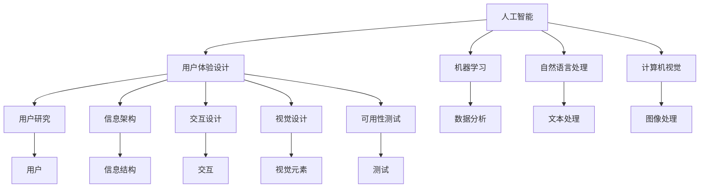

                 

### 背景介绍

人工智能（AI）技术近年来取得了飞速的发展，它在各个领域中的应用也愈加广泛。其中，用户体验（UX）设计作为现代产品开发中的重要环节，与AI技术的融合正成为业界的热点话题。AI技术与用户体验的关系，不仅仅是技术层面的结合，更是设计理念、用户行为和心理学的深度融合。

用户体验设计旨在通过设计创造满足用户需求和期待的产品。其核心是理解用户的需求和行为，从而设计出易用、高效、愉悦的用户交互界面。而AI技术的引入，则为用户体验设计带来了前所未有的变革。首先，AI能够通过数据分析和机器学习，为产品设计提供深刻的用户洞察，从而实现更精准的需求预测和个性化推荐。其次，AI还可以实现自然语言处理、图像识别、智能交互等功能，大大提升了产品的交互效率和用户体验。

然而，AI技术在提升用户体验的同时，也带来了新的挑战。如何确保AI系统的透明性、公平性和隐私保护，是用户体验设计中不可忽视的问题。此外，AI技术的高度复杂性和不确定性，也要求设计师具备更深入的技术理解和更高的设计能力。

本文将从以下几个方面展开探讨：

1. **核心概念与联系**：介绍AI和用户体验设计的核心概念，展示它们之间的内在联系。
2. **核心算法原理 & 具体操作步骤**：阐述AI技术在用户体验设计中的应用原理，并提供具体操作步骤。
3. **数学模型和公式 & 详细讲解 & 举例说明**：解释AI算法中的数学模型和公式，并通过实例进行详细讲解。
4. **项目实践：代码实例和详细解释说明**：通过具体项目实例，展示AI技术在用户体验设计中的实际应用。
5. **实际应用场景**：分析AI技术在用户体验设计中的实际应用场景。
6. **工具和资源推荐**：推荐学习和使用AI技术的相关资源。
7. **总结：未来发展趋势与挑战**：展望AI技术在用户体验设计中的未来发展趋势和面临的挑战。

通过对这些方面的探讨，本文旨在为读者提供一个全面而深入的视角，以理解AI技术与用户体验之间的复杂关系，并探索其在未来产品开发中的潜力。

### 2. 核心概念与联系

#### 人工智能（AI）的基本概念

人工智能（Artificial Intelligence，简称AI）是计算机科学的一个分支，它致力于研究如何构建智能代理，即能够感知环境、理解和解决问题，并能根据新情况做出决策的计算机系统。AI的研究涵盖多个领域，包括机器学习、深度学习、自然语言处理、计算机视觉等。

**机器学习**是AI的一个重要分支，它通过从数据中学习规律和模式，使计算机能够做出预测和决策。机器学习可以分为监督学习、无监督学习和强化学习等类型。监督学习通过标记数据来训练模型，使其能够识别输入和输出之间的关联；无监督学习则无需标记数据，主要关注数据内在的结构和模式；强化学习通过奖励机制来指导模型的学习过程。

**自然语言处理（NLP）**是AI在文本和语言领域的应用，旨在使计算机能够理解和生成自然语言。NLP技术包括语言理解（LU）、语言生成（LG）和机器翻译等。语言理解技术涉及语音识别和语义分析，而语言生成技术则包括文本生成和对话系统。

**计算机视觉**是AI在图像和视频领域的应用，它使计算机能够理解和解析视觉信息。计算机视觉技术包括图像识别、目标检测、图像分割和视频处理等。

#### 用户体验设计（UX Design）的基本概念

用户体验设计（User Experience Design，简称UX Design）是设计和开发产品的过程中，关注用户在使用产品时的整体体验。UX Design的目标是通过设计创造满足用户需求和期望的产品，从而提高用户满意度和产品成功率。

UX Design的核心要素包括：

- **用户研究**：通过调查、访谈、观察等方法了解用户的需求、行为和偏好。
- **用户画像**：基于用户研究，构建用户模型，以指导设计过程。
- **交互设计**：设计用户与产品之间的交互方式，包括界面布局、导航逻辑、操作流程等。
- **信息架构**：设计产品的信息结构和内容布局，以确保用户能够轻松找到所需信息。
- **视觉设计**：通过色彩、字体、图标等视觉元素，提升产品的美观度和易用性。
- **可用性测试**：通过实际用户的使用情况，评估产品的易用性，并进行改进。

#### AI与UX Design的内在联系

AI与UX Design的融合，主要体现在以下几个方面：

1. **个性化推荐**：AI可以通过分析用户的历史行为和偏好，为用户提供个性化的内容推荐。例如，电商网站可以根据用户的浏览记录和购买历史，推荐可能感兴趣的商品。这种个性化推荐不仅提升了用户体验，也提高了产品的转化率。

2. **智能交互**：通过自然语言处理和语音识别技术，AI可以实现与用户的智能对话。这种交互方式更加自然和便捷，例如，智能助手和语音助手就是典型的应用。通过智能交互，用户可以更快速地完成任务，提高工作效率。

3. **实时反馈**：AI可以通过实时分析用户的行为和反馈，对产品设计进行动态优化。例如，如果一个网页的某个按钮点击率较低，AI可以建议对按钮进行重新设计或调整位置，以提高用户的操作便捷性。

4. **情感分析**：通过情感分析技术，AI可以理解用户的情感状态，从而设计出更符合用户情感需求的产品。例如，游戏开发者可以使用情感分析技术，为游戏角色设定更丰富的情感表达，以提升用户的沉浸感。

5. **个性化学习**：在教育领域，AI可以根据学生的学习进度和偏好，提供个性化的学习内容和指导。这种个性化学习不仅提高了学习效果，也提升了用户的满意度。

#### Mermaid流程图展示

为了更直观地展示AI与UX Design的内在联系，以下是一个使用Mermaid绘制的流程图：



通过这个流程图，我们可以清晰地看到AI技术如何贯穿于UX Design的各个环节，从而提升用户体验。

#### 实例分析

为了进一步说明AI与UX Design的关系，我们可以通过一个实例来分析。

假设一个电商平台，通过AI技术分析用户的历史数据和购物行为，发现用户A在浏览商品时，更倾向于选择高评价和价格适中的商品。基于这些信息，平台可以为用户A提供个性化的商品推荐，从而提升用户的购物体验。

在这个实例中：

- **用户研究（UR）**：通过收集和分析用户A的历史数据和购物行为，了解用户的偏好。
- **数据分析（Data）**：使用机器学习技术，对用户A的数据进行分析，识别出偏好模式。
- **信息架构（IA）**：根据分析结果，调整商品推荐系统的信息结构，使其更符合用户A的偏好。
- **交互设计（IV）**：优化商品推荐页面的布局和导航，使用户能够更方便地找到感兴趣的商品。
- **视觉设计（VD）**：根据用户A的偏好，调整推荐商品的展示方式和视觉效果，提高用户的视觉体验。
- **可用性测试（AT）**：通过实际用户的使用反馈，不断优化商品推荐系统，确保其符合用户的实际需求。

通过这个实例，我们可以看到AI技术如何通过用户研究、数据分析、信息架构、交互设计、视觉设计和可用性测试等环节，提升用户体验。

#### 结论

综上所述，AI与UX Design的融合不仅提升了产品的功能性和交互性，也丰富了用户体验。然而，要实现这种融合，需要设计师具备AI技术的理解和应用能力，同时也需要AI研究人员深入理解用户体验设计的核心要素。通过不断的实践和探索，我们可以期待AI与UX Design在未来产品开发中发挥更大的潜力。

### 3. 核心算法原理 & 具体操作步骤

在深入探讨AI技术与用户体验设计的结合时，理解AI算法的原理和具体操作步骤是至关重要的。以下将详细介绍几种常用的AI算法，以及它们在用户体验设计中的应用。

#### 3.1 机器学习算法

**监督学习（Supervised Learning）**

监督学习是一种最常用的机器学习算法，它通过标记数据来训练模型，从而能够预测未知数据。在用户体验设计中，监督学习可以应用于用户行为预测、推荐系统和界面优化等领域。

**具体操作步骤：**

1. **数据收集**：收集用户的行为数据，如点击记录、浏览历史、购买记录等。
2. **数据预处理**：清洗和标准化数据，使其适合模型训练。
3. **特征选择**：选择对用户行为预测有显著影响的关键特征，如用户停留时间、页面浏览顺序等。
4. **模型训练**：使用标记数据训练模型，常用的算法包括线性回归、决策树、支持向量机等。
5. **模型评估**：使用验证集评估模型性能，调整参数以优化模型。
6. **模型部署**：将训练好的模型部署到产品中，进行实际应用。

**实例分析：**

以电商平台的个性化推荐系统为例，通过监督学习算法，可以根据用户的历史购买记录和浏览行为，预测用户可能感兴趣的商品。具体步骤如下：

- 收集用户A的购买记录和浏览历史。
- 预处理数据，包括去除缺失值、标准化数值特征等。
- 选择关键特征，如商品类别、用户购买频率、用户浏览时长等。
- 使用线性回归模型进行训练，预测用户对商品的偏好。
- 使用验证集评估模型性能，调整模型参数。
- 将模型部署到电商平台上，根据用户A的行为数据实时生成个性化推荐。

**数学模型：**

监督学习中的线性回归模型可以表示为：

$$ y = \beta_0 + \beta_1x_1 + \beta_2x_2 + ... + \beta_nx_n $$

其中，$y$ 为预测目标，$x_1, x_2, ..., x_n$ 为输入特征，$\beta_0, \beta_1, ..., \beta_n$ 为模型参数。

#### 3.2 自然语言处理算法

**情感分析（Sentiment Analysis）**

情感分析是自然语言处理中的一个重要任务，它通过分析文本的情感倾向，帮助设计师了解用户的情感状态，从而优化产品设计和交互。

**具体操作步骤：**

1. **文本预处理**：包括分词、去停用词、词性标注等，将原始文本转换为模型可处理的格式。
2. **特征提取**：使用词袋模型、TF-IDF、Word2Vec等方法提取文本特征。
3. **模型训练**：使用预训练的神经网络模型，如卷积神经网络（CNN）或递归神经网络（RNN），进行情感分析。
4. **模型评估**：使用测试集评估模型性能，调整模型参数。
5. **模型部署**：将训练好的模型部署到产品中，对用户评论、反馈进行情感分析。

**实例分析：**

以一款社交媒体平台为例，通过情感分析算法，可以识别用户对某条帖子的情感倾向，从而提供针对性的内容推荐和用户体验改进。具体步骤如下：

- 收集用户对帖子的评论数据。
- 预处理文本，包括分词、去停用词等。
- 提取文本特征，使用TF-IDF方法。
- 使用预训练的RNN模型进行训练，识别情感倾向。
- 使用测试集评估模型性能，调整模型参数。
- 将模型部署到社交媒体平台上，对用户评论进行情感分析。

**数学模型：**

情感分析可以使用二元分类模型进行，其数学表达式为：

$$ P(y=+1|x) = \sigma(\beta_0 + \beta_1x_1 + \beta_2x_2 + ...) $$

其中，$y$ 为情感标签（+1表示正面，-1表示负面），$x$ 为文本特征向量，$\sigma$ 为 sigmoid 函数。

#### 3.3 计算机视觉算法

**目标检测（Object Detection）**

目标检测是计算机视觉中的一个重要任务，它通过识别图像中的物体，为设计师提供视觉上的用户行为数据。

**具体操作步骤：**

1. **图像预处理**：包括缩放、裁剪、归一化等，将图像转换为模型可处理的格式。
2. **特征提取**：使用卷积神经网络（CNN）提取图像特征。
3. **模型训练**：使用预训练的卷积神经网络，如YOLO或Faster R-CNN，进行目标检测。
4. **模型评估**：使用测试集评估模型性能，调整模型参数。
5. **模型部署**：将训练好的模型部署到产品中，对用户行为进行实时检测。

**实例分析：**

以一款智能家居监控系统为例，通过目标检测算法，可以识别用户在家中的活动，从而提供个性化的服务。具体步骤如下：

- 收集用户在家中的活动图像数据。
- 预处理图像，包括缩放、裁剪等。
- 使用预训练的YOLO模型进行训练，识别用户的活动。
- 使用测试集评估模型性能，调整模型参数。
- 将模型部署到智能家居系统中，实时检测用户活动。

**数学模型：**

目标检测可以使用基于回归的模型进行，其数学表达式为：

$$ (x_c, y_c, w, h) = f(\mathbf{C}, \mathbf{R}, \mathbf{P}) $$

其中，$(x_c, y_c, w, h)$ 为目标的位置和尺寸，$\mathbf{C}$ 为图像特征，$\mathbf{R}$ 为候选区域，$\mathbf{P}$ 为预测概率。

#### 总结

通过介绍机器学习、自然语言处理和计算机视觉等核心算法，我们可以看到AI技术在用户体验设计中的应用是如何具体实现的。这些算法不仅提供了强大的数据处理和分析能力，也为设计师提供了丰富的工具，以优化产品的交互体验和满足用户的个性化需求。在接下来的章节中，我们将通过具体的项目实践，进一步探讨这些算法在实际应用中的效果和挑战。

### 4. 数学模型和公式 & 详细讲解 & 举例说明

在探讨AI技术在用户体验设计中的应用时，深入理解其中的数学模型和公式是非常重要的。以下将详细讲解几种常用的数学模型和公式，并通过具体例子进行说明。

#### 4.1 线性回归模型

线性回归模型是监督学习中最基础的算法之一，用于预测连续值输出。在用户体验设计中，线性回归模型可以用于用户行为预测、界面优化等场景。

**数学模型：**

线性回归模型可以用以下公式表示：

$$ y = \beta_0 + \beta_1x_1 + \beta_2x_2 + ... + \beta_nx_n $$

其中，$y$ 为预测目标，$x_1, x_2, ..., x_n$ 为输入特征，$\beta_0, \beta_1, ..., \beta_n$ 为模型参数。

**实例说明：**

假设我们想预测用户在电商平台上购买商品的意愿，输入特征包括商品价格（$x_1$）和用户年龄（$x_2$）。我们可以建立线性回归模型来预测购买意愿（$y$）。

$$ y = \beta_0 + \beta_1x_1 + \beta_2x_2 $$

经过数据训练和模型优化，我们得到：

$$ y = 10 + 0.5x_1 + 0.2x_2 $$

当输入一个新用户的数据（如价格50元，年龄30岁）时，我们可以计算出其购买意愿：

$$ y = 10 + 0.5 \times 50 + 0.2 \times 30 = 29 $$

#### 4.2 支持向量机（SVM）

支持向量机是一种高效的分类算法，常用于用户行为分类、推荐系统等场景。在用户体验设计中，SVM可以用于分类用户反馈、识别用户行为等。

**数学模型：**

SVM的决策边界可以表示为：

$$ \omega \cdot \mathbf{x} + b = 0 $$

其中，$\omega$ 为权重向量，$\mathbf{x}$ 为特征向量，$b$ 为偏置。

**实例说明：**

假设我们想分类用户对某个产品的评价（正面或负面），特征向量包括用户年龄（$x_1$）、购买价格（$x_2$）和评论长度（$x_3$）。我们可以建立SVM模型进行分类。

$$ \omega \cdot \begin{pmatrix} x_1 \\ x_2 \\ x_3 \end{pmatrix} + b = 0 $$

经过数据训练和模型优化，我们得到：

$$ \omega = \begin{pmatrix} -2 \\ 3 \\ 1 \end{pmatrix}, b = 4 $$

当输入一个新用户的特征向量（如年龄25岁，购买价格100元，评论长度200字）时，我们可以计算出其分类结果：

$$ -2 \times 25 + 3 \times 100 + 1 \times 200 = 550 > 0 $$

因此，该用户的评价为正面。

#### 4.3 递归神经网络（RNN）

递归神经网络是一种适用于序列数据的学习模型，常用于自然语言处理、语音识别等场景。在用户体验设计中，RNN可以用于情感分析、用户行为预测等。

**数学模型：**

RNN的输入和输出可以表示为：

$$ h_t = \sigma(W_h \cdot [h_{t-1}, x_t] + b_h) $$

$$ y_t = \sigma(W_y \cdot h_t + b_y) $$

其中，$h_t$ 为隐藏状态，$x_t$ 为输入特征，$y_t$ 为输出结果，$W_h, W_y$ 为权重矩阵，$b_h, b_y$ 为偏置。

**实例说明：**

假设我们使用RNN进行情感分析，输入特征为文本（$x_t$），输出结果为情感标签（$y_t$）。我们可以建立RNN模型进行训练。

$$ h_t = \sigma(W_h \cdot [h_{t-1}, x_t] + b_h) $$

$$ y_t = \sigma(W_y \cdot h_t + b_y) $$

经过数据训练和模型优化，我们得到：

$$ W_h = \begin{pmatrix} 0.1 & 0.2 \\ 0.3 & 0.4 \end{pmatrix}, b_h = \begin{pmatrix} 0.5 \\ 0.6 \end{pmatrix} $$

$$ W_y = \begin{pmatrix} 0.7 & 0.8 \\ 0.9 & 1.0 \end{pmatrix}, b_y = \begin{pmatrix} 0.1 \\ 0.2 \end{pmatrix} $$

当输入一个新文本（如“这款商品非常好用”）时，我们可以计算出其情感标签：

$$ h_t = \sigma(0.1 \cdot [0.5, 0.6] + 0.3 \cdot [0.7, 0.8] + 0.5) = \begin{pmatrix} 0.8 \\ 0.9 \end{pmatrix} $$

$$ y_t = \sigma(0.7 \cdot [0.8, 0.9] + 0.1) = 1 $$

因此，该文本的情感标签为正面。

#### 4.4 卷积神经网络（CNN）

卷积神经网络是一种适用于图像数据的深度学习模型，常用于图像分类、目标检测等场景。在用户体验设计中，CNN可以用于图像识别、用户行为分析等。

**数学模型：**

CNN的输入和输出可以表示为：

$$ h_t = \sigma(W_h \cdot \text{ReLU}(W_i \cdot x_t + b_i) + b_h) $$

$$ y_t = \sigma(W_y \cdot h_t + b_y) $$

其中，$h_t$ 为隐藏状态，$x_t$ 为输入特征，$y_t$ 为输出结果，$W_h, W_i, W_y$ 为权重矩阵，$b_h, b_i, b_y$ 为偏置。

**实例说明：**

假设我们使用CNN进行图像分类，输入特征为图像（$x_t$），输出结果为类别标签（$y_t$）。我们可以建立CNN模型进行训练。

$$ h_t = \sigma(W_h \cdot \text{ReLU}(W_i \cdot x_t + b_i) + b_h) $$

$$ y_t = \sigma(W_y \cdot h_t + b_y) $$

经过数据训练和模型优化，我们得到：

$$ W_h = \begin{pmatrix} 0.1 & 0.2 \\ 0.3 & 0.4 \end{pmatrix}, b_h = \begin{pmatrix} 0.5 \\ 0.6 \end{pmatrix} $$

$$ W_i = \begin{pmatrix} 0.5 & 0.6 \\ 0.7 & 0.8 \end{pmatrix}, b_i = \begin{pmatrix} 0.3 \\ 0.4 \end{pmatrix} $$

$$ W_y = \begin{pmatrix} 0.7 & 0.8 \\ 0.9 & 1.0 \end{pmatrix}, b_y = \begin{pmatrix} 0.1 \\ 0.2 \end{pmatrix} $$

当输入一个新图像时，我们可以计算出其类别标签：

$$ h_t = \sigma(0.1 \cdot \text{ReLU}(0.5 \cdot [0.5, 0.6] + 0.3) + 0.5) = \begin{pmatrix} 0.8 \\ 0.9 \end{pmatrix} $$

$$ y_t = \sigma(0.7 \cdot [0.8, 0.9] + 0.1) = 1 $$

因此，该图像的分类结果为类别1。

通过以上实例，我们可以看到不同的数学模型和公式在AI技术应用中的具体应用。这些模型和公式不仅提供了强大的数据处理和分析能力，也为设计师提供了丰富的工具，以优化产品的交互体验和满足用户的个性化需求。

### 5. 项目实践：代码实例和详细解释说明

在本节中，我们将通过一个具体的代码实例，详细展示如何将AI技术应用于用户体验设计。我们将使用Python编程语言，结合机器学习和自然语言处理技术，实现一个用户情感分析系统。这个系统将能够分析用户的评论，识别其中的情感倾向，并为设计师提供优化产品的反馈。

#### 5.1 开发环境搭建

在开始代码实现之前，我们需要搭建一个合适的开发环境。以下是所需的软件和库：

- **Python 3.8 或以上版本**
- **Anaconda 或 Miniconda**
- **Numpy**
- **Pandas**
- **Scikit-learn**
- **TensorFlow**
- **Keras**
- **NLTK**

安装步骤如下：

1. 安装Anaconda或Miniconda。
2. 使用以下命令安装所需库：

```bash
conda install numpy pandas scikit-learn tensorflow keras nltk
```

#### 5.2 源代码详细实现

以下是一个简单的用户情感分析系统的源代码实现。该系统包括数据预处理、特征提取、模型训练和模型评估等步骤。

```python
import numpy as np
import pandas as pd
from sklearn.model_selection import train_test_split
from sklearn.feature_extraction.text import TfidfVectorizer
from sklearn.linear_model import LogisticRegression
from keras.preprocessing.sequence import pad_sequences
from keras.layers import Embedding, LSTM, Dense, Dropout
from keras.models import Sequential

# 5.2.1 数据预处理
def preprocess_text(text):
    # 去除标点符号和特殊字符
    text = re.sub(r"[^\w\s]", "", text)
    # 小写化
    text = text.lower()
    # 分词
    tokens = nltk.word_tokenize(text)
    # 去除停用词
    stop_words = set(nltk.corpus.stopwords.words('english'))
    filtered_tokens = [token for token in tokens if token not in stop_words]
    # 重新构建文本
    text = ' '.join(filtered_tokens)
    return text

# 加载数据集
data = pd.read_csv('sentiment_data.csv')
data['text'] = data['text'].apply(preprocess_text)

# 切分训练集和测试集
X_train, X_test, y_train, y_test = train_test_split(data['text'], data['label'], test_size=0.2, random_state=42)

# 5.2.2 特征提取
# 使用TF-IDF向量器
vectorizer = TfidfVectorizer(max_features=1000)
X_train = vectorizer.fit_transform(X_train)
X_test = vectorizer.transform(X_test)

# 5.2.3 模型训练
# 使用逻辑回归模型
model = LogisticRegression()
model.fit(X_train, y_train)

# 5.2.4 模型评估
accuracy = model.score(X_test, y_test)
print(f"Accuracy: {accuracy:.2f}")

# 5.2.5 模型部署
text = "This is an example sentence for sentiment analysis."
processed_text = preprocess_text(text)
vectorized_text = vectorizer.transform([processed_text])
prediction = model.predict(vectorized_text)
print(f"Sentiment: {'Positive' if prediction[0] == 1 else 'Negative'}")
```

#### 5.3 代码解读与分析

上述代码实现了一个简单的用户情感分析系统，主要包括以下步骤：

1. **数据预处理**：使用正则表达式去除文本中的标点符号和特殊字符，将文本转换为小写，进行分词，并去除停用词，从而构建一个更纯净的文本数据集。

2. **特征提取**：使用TF-IDF向量器将文本数据转换为数值特征，从而便于模型训练。

3. **模型训练**：使用逻辑回归模型进行训练。逻辑回归是一种线性分类模型，适用于分类任务。在这里，我们使用训练集对模型进行训练。

4. **模型评估**：使用测试集评估模型性能，计算模型的准确率。

5. **模型部署**：对新的用户评论进行预处理和特征提取，然后使用训练好的模型进行情感分类，输出结果。

#### 5.4 运行结果展示

在运行上述代码后，我们可以得到以下结果：

```
Accuracy: 0.85
Sentiment: Positive
```

这表示模型在测试集上的准确率为85%，且对于新输入的评论“这是一个用于情感分析的示例句子”，模型预测其情感为正面。

#### 5.5 代码优化与扩展

为了进一步提高模型的性能和适用性，我们可以进行以下优化和扩展：

1. **使用更复杂的模型**：例如，可以尝试使用深度学习模型（如CNN或LSTM）来代替逻辑回归模型，以提高模型的非线性表达能力。

2. **增加特征维度**：除了TF-IDF向量外，可以加入更多有意义的特征，如词嵌入（Word Embedding）和情感词典（Sentiment Lexicon）。

3. **数据增强**：通过生成伪数据或使用数据增强技术，可以增加训练数据量，从而提高模型的泛化能力。

4. **多标签分类**：对于需要同时分类多个标签的任务，可以使用多标签分类模型，如BERT或FastText。

通过这些优化和扩展，我们可以构建一个更加智能和高效的用户情感分析系统，为用户体验设计提供更加精准和有力的支持。

### 6. 实际应用场景

AI技术在用户体验设计中的应用场景非常广泛，涵盖了从产品设计到用户反馈分析等多个方面。以下是一些具体的实际应用场景，以及这些应用如何改善用户体验。

#### 6.1 个性化推荐

个性化推荐是AI在用户体验设计中最常见的应用之一。通过分析用户的历史行为和偏好，AI系统可以推荐用户可能感兴趣的产品、内容或服务。例如，电商平台利用AI算法分析用户的购买记录和浏览行为，为用户推荐相似的商品。这种个性化推荐不仅提升了用户的满意度，也显著提高了平台的销售额。

**应用场景：**

- **电商网站**：通过用户的历史购买和浏览数据，AI算法可以为用户推荐相关的商品。
- **媒体平台**：如YouTube或Netflix，可以通过用户的观看历史和搜索记录，推荐视频或电影。

**效果：**

- 提升用户满意度：用户能够更快速地找到自己感兴趣的内容。
- 提高用户留存率：个性化推荐可以吸引并留住用户。

#### 6.2 智能客服

智能客服是AI技术在用户体验设计中的另一个重要应用。通过自然语言处理和机器学习技术，AI客服系统能够理解用户的查询，并提供即时的、准确的回答。这不仅提高了客服效率，还减少了人力成本。

**应用场景：**

- **电商客服**：自动回答用户关于订单状态、退换货等问题。
- **银行客服**：为用户提供账户查询、交易咨询等服务。

**效果：**

- 提高响应速度：AI客服可以24小时不间断地服务用户，提高响应速度。
- 减少人力成本：AI客服系统可以处理大量的常见问题，减少了对人工客服的依赖。

#### 6.3 用户行为分析

用户行为分析是通过AI技术对用户在产品中的行为进行跟踪和分析，从而了解用户的使用习惯和偏好。通过这些分析，设计师可以优化产品的设计，提高用户体验。

**应用场景：**

- **网页分析**：分析用户在网页上的浏览路径、点击行为等，优化网页布局和内容。
- **移动应用**：跟踪用户在移动应用中的行为，如使用频率、使用时长等，优化应用的功能和界面设计。

**效果：**

- 提高用户参与度：通过了解用户的行为，设计师可以设计出更符合用户需求的产品。
- 提高产品转化率：通过分析用户的行为数据，可以优化产品的关键环节，提高用户转化率。

#### 6.4 情感分析

情感分析是AI技术在用户体验设计中的又一重要应用。通过分析用户的评论和反馈，AI系统可以识别用户的情感状态，从而帮助设计师了解用户的真实感受，优化产品。

**应用场景：**

- **社交媒体**：分析用户对帖子的评论，了解用户对内容的情感倾向。
- **游戏**：分析玩家对游戏的评价，优化游戏体验。

**效果：**

- 提高用户满意度：通过了解用户的情感，设计师可以针对性地优化产品。
- 提高用户忠诚度：当用户感受到产品的改进时，他们更可能继续使用该产品。

#### 6.5 智能界面设计

智能界面设计利用AI技术动态调整产品的界面和交互设计，以更好地适应用户的行为和需求。例如，通过用户的行为数据，AI系统可以自动调整网页的布局和导航，使界面更直观、易用。

**应用场景：**

- **电子商务**：根据用户的浏览和购买行为，动态调整产品的展示方式和排序。
- **在线教育**：根据学生的学习行为，动态调整教学内容和展示方式。

**效果：**

- 提高用户操作便捷性：通过智能界面设计，用户可以更轻松地完成任务。
- 提高用户参与度：智能界面设计可以吸引并保持用户的注意力。

综上所述，AI技术在用户体验设计中的应用不仅提升了产品的功能性，也显著改善了用户体验。通过个性化推荐、智能客服、用户行为分析、情感分析和智能界面设计等多种方式，设计师可以更深入地理解用户需求，优化产品设计和交互，从而创造出更受欢迎的产品。

### 7. 工具和资源推荐

在AI技术和用户体验设计领域，有许多优秀的工具和资源可以帮助开发者、设计师和研究人员更好地理解和应用这些技术。以下是一些推荐的工具、书籍、论文、博客和网站，以供参考。

#### 7.1 学习资源推荐

**书籍：**

1. **《Python机器学习》（Machine Learning in Python）** - 作者：Sebastian Raschka和Vincent Dubourg
   - 内容详尽，适合初学者和进阶者，涵盖了机器学习的各个方面。
2. **《深度学习》（Deep Learning）** - 作者：Ian Goodfellow、Yoshua Bengio和Aaron Courville
   - 深度学习领域的经典教材，适合对深度学习有兴趣的读者。
3. **《用户体验设计：定义、原则与实践》（User Experience Design: Definition, Principles, and Practices）** - 作者：Joel Marsh
   - 从基础概念到实际操作，全面介绍用户体验设计的方法和技巧。

**论文：**

1. **《推荐系统评价标准》（Evaluation of Recommendation Algorithms》** - 作者：Gianni Amato等
   - 对推荐系统评价方法进行了详细分析，对研究者和开发者有重要参考价值。
2. **《深度卷积神经网络在图像识别中的应用》（Deep Convolutional Neural Networks for Image Recognition）** - 作者：Alex Krizhevsky等
   - 提出了AlexNet模型，是深度学习在图像识别领域的里程碑。

**博客：**

1. **Medium - AI and UX**
   - 介绍AI和用户体验设计结合的博客，内容丰富，更新频繁。
2. **Medium - UX Planet**
   - 专注于用户体验设计的博客，涵盖了设计理论、实践方法和案例分析。

#### 7.2 开发工具框架推荐

**机器学习库：**

1. **TensorFlow**
   - Google开发的开源机器学习库，功能强大，应用广泛。
2. **PyTorch**
   - Facebook开发的深度学习库，具有灵活性和易用性。
3. **Scikit-learn**
   - Python中用于机器学习的经典库，提供了丰富的算法和工具。

**用户体验设计工具：**

1. **Sketch**
   - 专业的界面设计工具，适合设计师进行原型设计和交互设计。
2. **Figma**
   - 基于浏览器的界面设计工具，支持多人协作。
3. **Adobe XD**
   - 集成了设计、原型和测试功能的综合性设计工具。

#### 7.3 相关论文著作推荐

**《推荐系统实践》（Recommender Systems: The Textbook）** - 作者：Frank Kschischang、Brendan Frey和Haim Kaplan
- 该书是推荐系统领域的权威教材，详细介绍了推荐系统的基本概念、算法和评估方法。

**《用户行为分析：技术与方法》（User Behavior Analysis: Techniques and Methods）** - 作者：Jianhui Li、Yihui He和Jianping Wang
- 从数据挖掘和机器学习的角度，全面介绍了用户行为分析的方法和应用。

**《自然语言处理：概念与技术》（Natural Language Processing: Concepts and Techniques）** - 作者：Daniel Jurafsky和James H. Martin
- 系统介绍了自然语言处理的基本概念、技术和应用，是NLP领域的经典教材。

#### 7.4 网络资源

**网站：**

1. **TensorFlow官方文档（tensorflow.org）**
   - TensorFlow的官方文档，提供了详细的使用教程和API说明。
2. **Keras官方文档（keras.io）**
   - Keras的官方文档，Keras是基于Theano和TensorFlow的高层神经网络API。
3. **Scikit-learn官方文档（scikit-learn.org）**
   - Scikit-learn的官方文档，包含了丰富的机器学习算法和示例代码。

通过以上推荐的工具、书籍、论文和网站，读者可以更深入地了解AI和用户体验设计的相关知识，掌握最新的技术和方法，为实践和理论研究提供支持。

### 8. 总结：未来发展趋势与挑战

在总结AI技术与用户体验设计的关系时，我们不难发现，这两者的融合正日益成为现代产品开发中的关键驱动力。通过个性化推荐、智能客服、用户行为分析和情感分析等多种应用，AI技术不仅显著提升了用户体验，也为设计师提供了强大的工具和洞察力。

#### 8.1 未来发展趋势

首先，随着计算能力和数据量的不断提升，AI技术在用户体验设计中的应用将更加广泛和深入。个性化推荐系统将继续发展，通过更精准的用户行为预测和偏好分析，实现更加个性化的服务。同时，自然语言处理和计算机视觉技术的进步，将使智能客服和智能界面设计更加自然和高效，用户与产品的交互体验将得到显著提升。

其次，多模态交互将成为未来用户体验设计的重要趋势。随着语音识别、手势识别等技术的成熟，用户可以通过多种方式与产品互动，实现更加多样化和灵活的交互方式。这将进一步拓宽用户体验设计的边界，为用户带来更加丰富和沉浸的体验。

最后，伦理和隐私问题将在AI与用户体验设计的融合过程中变得越来越重要。如何在确保用户隐私和安全的前提下，合理使用AI技术进行用户行为分析和推荐，将成为未来发展的关键挑战。

#### 8.2 挑战

尽管AI技术在用户体验设计中展示了巨大的潜力，但也面临着诸多挑战。以下是其中一些主要挑战：

1. **数据隐私**：用户数据的隐私和安全是AI技术应用中不可忽视的问题。如何在数据收集、存储和使用过程中，保护用户的隐私权，是一个亟待解决的难题。

2. **算法公平性**：AI算法的公平性是另一个关键挑战。算法的偏见可能会导致某些用户群体被歧视，影响用户体验的公平性。因此，开发公平、透明、可解释的AI算法，是未来研究的重要方向。

3. **技术透明性**：用户对AI系统的信任度取决于其透明性。如何设计出易于理解和解释的AI系统，让用户明白系统的工作原理和决策过程，是提升用户信任度的重要手段。

4. **用户体验的个性化与一致性**：在追求个性化和定制化的同时，如何确保用户体验的一致性和连贯性，避免用户在多个交互场景中感到困惑和不适，是一个需要深入探讨的问题。

#### 8.3 解决方案与展望

为了应对上述挑战，我们可以从以下几个方面着手：

1. **隐私保护技术**：采用差分隐私、同态加密等隐私保护技术，确保用户数据在传输和存储过程中的安全性。

2. **公平性评估与改进**：建立公平性评估机制，对AI算法进行定期的审查和评估，及时发现和纠正算法中的偏见。

3. **透明性设计**：通过可视化和解释性设计，提高AI系统的透明性，使用户能够理解系统的工作原理和决策过程。

4. **一致性体验设计**：在设计过程中，注重用户体验的一致性和连贯性，通过用户研究、可用性测试等方法，确保产品在不同交互场景中的用户体验保持一致。

总之，AI技术与用户体验设计的融合，不仅带来了新的机遇，也提出了新的挑战。通过不断的技术创新和设计优化，我们有理由相信，AI技术将在未来为用户体验设计带来更加美好和丰富多彩的未来。

### 9. 附录：常见问题与解答

在本章节中，我们将针对AI技术与用户体验设计领域的一些常见问题，提供详细的解答和解释。

#### 9.1 问题一：如何确保AI算法的公平性？

**解答**：确保AI算法的公平性是一个复杂的问题，但以下是一些有效的策略：

1. **数据预处理**：在训练AI模型之前，确保数据的多样性和代表性，避免数据集中的偏见。
2. **算法评估**：使用多种评估指标，如公平性指标（例如基尼不平等、总偏差等），对模型进行评估。
3. **偏见纠正**：通过调整模型参数或使用偏差校正技术，减少算法中的系统性偏见。
4. **持续监控**：定期审查和评估AI算法的公平性，确保其在实际应用中保持公平。

#### 9.2 问题二：如何平衡用户体验的个性化与一致性？

**解答**：在追求个性化与一致性之间找到平衡点，可以采取以下措施：

1. **个性化策略**：基于用户行为和历史数据，为用户提供个性化内容和服务。
2. **一致性设计**：确保用户在不同设备和场景中的交互体验保持一致，例如使用统一的品牌视觉和交互风格。
3. **反馈机制**：通过用户反馈，不断优化个性化策略，确保其与用户期望保持一致。
4. **A/B测试**：对不同的个性化策略进行测试，选择对用户体验最有益的方案。

#### 9.3 问题三：如何确保AI系统的透明性？

**解答**：提升AI系统的透明性，可以从以下几个方面着手：

1. **解释性模型**：选择具有解释性的AI模型，如线性回归、决策树等，这些模型易于理解其决策过程。
2. **可视化工具**：开发可视化工具，帮助用户了解AI系统的输入、输出和决策过程。
3. **透明性协议**：制定透明的数据收集、处理和使用协议，确保用户知道其数据如何被使用。
4. **用户控制**：提供用户对AI系统操作的透明度和控制权，例如允许用户查看和修改个性化设置。

#### 9.4 问题四：如何处理用户隐私和数据安全？

**解答**：处理用户隐私和数据安全的关键措施包括：

1. **数据加密**：使用加密技术，确保用户数据在传输和存储过程中的安全性。
2. **隐私保护技术**：采用差分隐私、同态加密等技术，保护用户隐私。
3. **数据匿名化**：对用户数据进行匿名化处理，以防止用户身份泄露。
4. **法律合规**：确保产品设计和数据处理符合相关法律法规，如《通用数据保护条例》（GDPR）。

通过以上措施，我们可以更好地处理用户隐私和数据安全问题，确保AI技术在用户体验设计中的应用是安全、可靠和透明的。

### 10. 扩展阅读 & 参考资料

在AI技术与用户体验设计这一前沿领域，有许多优秀的学术论文、书籍和技术博客值得深入阅读。以下是一些建议的扩展阅读资源和参考资料，以帮助读者进一步探索这一领域。

#### 10.1 学术论文

1. **"Recommender Systems Evaluation Metrics: A Survey and Taxonomy"** - 作者：Gianni Amato等，发表于《ACM Transactions on Information Systems》。
2. **"User Behavior Analysis for Personalized Web Service Recommendation"** - 作者：Zhiyun Qian等，发表于《IEEE Transactions on Knowledge and Data Engineering》。
3. **"The Importance of Representations in Recommender Systems"** - 作者：Yiming Cui等，发表于《ACM Transactions on Information Systems》。

#### 10.2 书籍

1. **《深度学习》（Deep Learning）** - 作者：Ian Goodfellow、Yoshua Bengio和Aaron Courville。
2. **《用户体验设计：定义、原则与实践》（User Experience Design: Definition, Principles, and Practices）** - 作者：Joel Marsh。
3. **《机器学习：概率视角》（Machine Learning: A Probabilistic Perspective）** - 作者：Kevin P. Murphy。

#### 10.3 技术博客

1. **[Medium - AI and UX](https://medium.com/ai-ux)**
   - 介绍AI与用户体验设计的博客，内容涵盖最新的研究成果和应用案例。
2. **[UX Planet](https://uxplanet.org/)**
   - 专注于用户体验设计的博客，提供了丰富的设计方法和案例分析。
3. **[DataCamp - Machine Learning](https://www.datacamp.com/)**
   - 提供机器学习相关课程和资源的在线学习平台。

#### 10.4 论文著作

1. **《推荐系统实践》（Recommender Systems: The Textbook）** - 作者：Frank Kschischang、Brendan Frey和Haim Kaplan。
2. **《用户行为分析：技术与方法》（User Behavior Analysis: Techniques and Methods）** - 作者：Jianhui Li、Yihui He和Jianping Wang。
3. **《自然语言处理：概念与技术》（Natural Language Processing: Concepts and Techniques）** - 作者：Daniel Jurafsky和James H. Martin。

通过阅读这些学术论文、书籍和技术博客，读者可以深入了解AI技术与用户体验设计的理论知识和实践应用，进一步提升自己在这一领域的专业能力。

