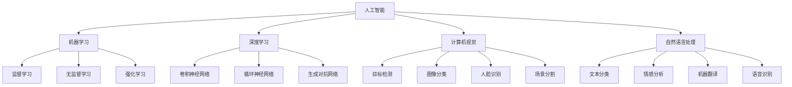

                 

### 文章标题

**AI技术在不同领域的应用**

> 关键词：人工智能，技术应用，深度学习，机器学习，数据分析，智能医疗，自动驾驶，金融科技，智能制造

> 摘要：本文将探讨人工智能技术在不同领域中的应用，分析其核心概念、算法原理、数学模型及实践案例，并探讨未来发展趋势和面临的挑战。

### 1. 背景介绍

人工智能（AI）作为计算机科学的一个分支，旨在模拟人类智能，实现机器对数据的理解和处理。近年来，随着计算能力的提升和大数据的普及，AI技术得到了前所未有的发展，广泛应用于各个领域。AI技术包括机器学习、深度学习、自然语言处理、计算机视觉等子领域，每一个子领域都有其独特的技术和应用场景。

在医疗领域，AI技术被用于疾病诊断、药物研发和个性化治疗。在自动驾驶领域，AI技术是实现自动驾驶汽车的核心。在金融领域，AI技术被用于风险评估、欺诈检测和个性化投资建议。在制造业，AI技术被用于生产优化、质量控制和新产品研发。此外，AI技术在教育、能源、农业等领域也都有广泛的应用。

本文将分别介绍AI技术在上述领域中的应用，通过核心概念、算法原理、数学模型和实践案例的分析，展示AI技术在这些领域中的强大能力和广阔前景。

### 2. 核心概念与联系

#### 2.1 机器学习

机器学习是AI技术的重要组成部分，它通过算法从数据中学习规律，并用于预测或决策。机器学习可以分为监督学习、无监督学习和强化学习三种类型。监督学习通过标注数据来训练模型，如分类和回归任务；无监督学习不使用标注数据，如聚类和降维任务；强化学习通过与环境互动来学习最优策略，如游戏和自动驾驶任务。


#### 2.2 深度学习

深度学习是机器学习的一种特殊形式，它利用多层神经网络来模拟人类大脑的学习过程。深度学习在图像识别、语音识别和自然语言处理等领域取得了显著成果。常见的深度学习模型包括卷积神经网络（CNN）、循环神经网络（RNN）和生成对抗网络（GAN）等。


#### 2.3 计算机视觉

计算机视觉是AI技术的重要分支，它旨在使计算机能够理解和处理图像和视频。计算机视觉的基本任务包括目标检测、图像分类、人脸识别和场景分割等。深度学习在计算机视觉中的应用极大地提升了其性能和准确性。


#### 2.4 自然语言处理

自然语言处理（NLP）是AI技术用于处理和生成人类语言的研究领域。NLP的任务包括文本分类、情感分析、机器翻译和语音识别等。深度学习在NLP中得到了广泛应用，特别是在语言模型和序列模型方面。


#### 2.5 数据分析

数据分析是使用统计和数学方法对数据进行处理和分析的过程。数据分析可以帮助企业从大量数据中提取有价值的信息，做出更准确的决策。数据分析与AI技术的结合，可以实现自动化数据处理和分析，提高效率和准确性。


#### 2.6 Mermaid 流程图

以下是AI技术在不同领域的应用的一个简单的Mermaid流程图，展示了核心概念和技术的联系。



### 3. 核心算法原理 & 具体操作步骤

#### 3.1 机器学习算法原理

机器学习算法的核心是模型训练，即通过输入数据训练出一个能够预测或决策的模型。以监督学习为例，其基本流程如下：

1. 数据预处理：包括数据清洗、归一化、缺失值处理等。
2. 特征提取：从原始数据中提取出有助于模型训练的特征。
3. 模型选择：选择合适的模型，如线性回归、决策树、支持向量机等。
4. 训练模型：使用训练数据集训练模型。
5. 模型评估：使用验证数据集评估模型性能。
6. 模型优化：根据评估结果调整模型参数，提高模型性能。

#### 3.2 深度学习算法原理

深度学习算法的核心是神经网络，它通过多层神经元的连接来模拟人类大脑的学习过程。以卷积神经网络（CNN）为例，其基本流程如下：

1. 输入层：接收输入数据，如图像或文本。
2. 卷积层：通过卷积操作提取图像特征。
3. 池化层：对特征进行降采样，减少参数数量。
4. 全连接层：将特征映射到输出结果。
5. 损失函数：计算模型预测值与真实值之间的差距。
6. 反向传播：通过梯度下降法更新模型参数。

#### 3.3 计算机视觉算法原理

计算机视觉算法的核心任务是理解图像或视频中的内容。以下是一个简单的图像分类算法的流程：

1. 图像预处理：包括图像缩放、归一化、去噪等。
2. 特征提取：使用卷积神经网络提取图像特征。
3. 模型训练：使用训练数据集训练分类模型，如SVM、softmax等。
4. 模型评估：使用验证数据集评估模型性能。
5. 模型部署：将训练好的模型部署到实际应用中。

#### 3.4 自然语言处理算法原理

自然语言处理算法的核心任务是理解和处理人类语言。以下是一个简单的文本分类算法的流程：

1. 文本预处理：包括分词、去停用词、词性标注等。
2. 特征提取：使用词袋模型、词嵌入等方法提取文本特征。
3. 模型训练：使用训练数据集训练分类模型，如SVM、CNN、RNN等。
4. 模型评估：使用验证数据集评估模型性能。
5. 模型部署：将训练好的模型部署到实际应用中。

#### 3.5 数据分析算法原理

数据分析算法的核心任务是发现数据中的规律和趋势。以下是一个简单的时间序列分析算法的流程：

1. 数据预处理：包括数据清洗、缺失值处理、归一化等。
2. 特征提取：使用统计方法、时序模型等方法提取特征。
3. 模型训练：使用训练数据集训练预测模型，如ARIMA、LSTM等。
4. 模型评估：使用验证数据集评估模型性能。
5. 模型部署：将训练好的模型部署到实际应用中。

### 4. 数学模型和公式 & 详细讲解 & 举例说明

#### 4.1 机器学习数学模型

机器学习中的核心数学模型包括损失函数、优化算法和正则化方法。

##### 损失函数

损失函数用于衡量模型预测值与真实值之间的差距。常见的损失函数有均方误差（MSE）和交叉熵损失（Cross Entropy Loss）。

- 均方误差（MSE）：

$$MSE = \frac{1}{n}\sum_{i=1}^{n}(y_i - \hat{y}_i)^2$$

其中，$y_i$为真实值，$\hat{y}_i$为模型预测值。

- 交叉熵损失（Cross Entropy Loss）：

$$CE = -\frac{1}{n}\sum_{i=1}^{n}y_i\log(\hat{y}_i)$$

其中，$y_i$为真实值，$\hat{y}_i$为模型预测值。

##### 优化算法

优化算法用于更新模型参数，使损失函数最小。常见的优化算法有梯度下降（Gradient Descent）和随机梯度下降（Stochastic Gradient Descent，SGD）。

- 梯度下降（Gradient Descent）：

$$\theta_j := \theta_j - \alpha\nabla f(\theta)$$

其中，$\theta_j$为模型参数，$\alpha$为学习率，$\nabla f(\theta)$为损失函数关于$\theta$的梯度。

- 随机梯度下降（SGD）：

$$\theta_j := \theta_j - \alpha\nabla f(\theta; x_i, y_i)$$

其中，$\theta_j$为模型参数，$\alpha$为学习率，$\nabla f(\theta; x_i, y_i)$为损失函数关于$\theta$在训练样本$(x_i, y_i)$处的梯度。

##### 正则化方法

正则化方法用于防止模型过拟合。常见的正则化方法有L1正则化和L2正则化。

- L1正则化：

$$\Omega(\theta) = \sum_{j=1}^{n}|\theta_j|$$

- L2正则化：

$$\Omega(\theta) = \sum_{j=1}^{n}\theta_j^2$$

#### 4.2 深度学习数学模型

深度学习中的核心数学模型包括激活函数、反向传播和优化算法。

##### 激活函数

激活函数用于引入非线性，使神经网络能够拟合复杂的函数。常见的激活函数有Sigmoid、ReLU和Tanh。

- Sigmoid：

$$\sigma(x) = \frac{1}{1 + e^{-x}}$$

- ReLU：

$$\text{ReLU}(x) = \max(0, x)$$

- Tanh：

$$\text{Tanh}(x) = \frac{e^x - e^{-x}}{e^x + e^{-x}}$$

##### 反向传播

反向传播是一种用于训练神经网络的算法，它通过计算损失函数关于模型参数的梯度来更新参数。反向传播的步骤如下：

1. 计算输出层的误差。
2. 反向传播误差，计算隐藏层的误差。
3. 根据误差更新模型参数。

##### 优化算法

深度学习中的优化算法通常基于梯度下降。常见的优化算法有Adam、RMSprop和SGD。

- Adam：

$$m_t = \beta_1m_{t-1} + (1 - \beta_1)\nabla f(\theta; x_t, y_t)$$

$$v_t = \beta_2v_{t-1} + (1 - \beta_2)\nabla f^2(\theta; x_t, y_t)$$

$$\theta_t := \theta_t - \alpha\frac{m_t}{1 - \beta_1^t}$$

其中，$m_t$和$v_t$分别为一阶和二阶矩估计，$\beta_1$和$\beta_2$为衰减率。

#### 4.3 计算机视觉数学模型

计算机视觉中的核心数学模型包括卷积运算、卷积神经网络和池化操作。

##### 卷积运算

卷积运算是一种用于特征提取的运算，它通过将滤波器（卷积核）与图像进行卷积来提取特征。卷积运算的数学公式如下：

$$h(x, y) = \sum_{i=1}^{m}\sum_{j=1}^{n}w_{ij}f(x-i, y-j)$$

其中，$h(x, y)$为卷积结果，$w_{ij}$为滤波器系数，$f(x, y)$为图像。

##### 卷积神经网络

卷积神经网络是一种用于图像识别和处理的神经网络，它由卷积层、池化层和全连接层组成。卷积神经网络的数学模型如下：

$$z_l = \sigma(W_l\cdot h_{l-1} + b_l)$$

$$h_l = \text{Pooling}(z_l)$$

其中，$z_l$为激活值，$W_l$和$b_l$分别为权重和偏置，$\sigma$为激活函数，$\text{Pooling}$为池化操作。

##### 池化操作

池化操作是一种用于降维和减少过拟合的运算，它通过取局部区域的最大值或平均值来提取特征。池化操作的数学公式如下：

$$p(x, y) = \max_{(i, j)\in R}\sum_{i'}^{i}\sum_{j'}^{j}h_{l-1}(i', j')$$

或

$$p(x, y) = \frac{1}{R}\sum_{i'}^{i}\sum_{j'}^{j}h_{l-1}(i', j')$$

其中，$p(x, y)$为池化结果，$R$为池化窗口大小。

#### 4.4 自然语言处理数学模型

自然语言处理中的核心数学模型包括词嵌入、循环神经网络和长短时记忆网络。

##### 词嵌入

词嵌入是一种将词汇映射到高维空间的方法，它通过神经网络学习词汇的向量表示。词嵌入的数学模型如下：

$$\text{Embed}(w) = \sigma(W_w\cdot h) + b_w$$

其中，$w$为词汇，$h$为上下文向量，$W_w$和$b_w$分别为权重和偏置，$\sigma$为激活函数。

##### 循环神经网络

循环神经网络是一种用于处理序列数据的神经网络，它通过循环连接来保留序列信息。循环神经网络的数学模型如下：

$$h_t = \sigma(W_hh_{t-1} + U_xx_t + b_h)$$

其中，$h_t$为隐藏状态，$x_t$为输入序列，$W_h$和$U_x$分别为权重，$b_h$为偏置，$\sigma$为激活函数。

##### 长短时记忆网络

长短时记忆网络是一种改进的循环神经网络，它通过门控机制来控制信息的流动，避免梯度消失问题。长短时记忆网络的数学模型如下：

$$i_t = \sigma(W_i[h_{t-1}, x_t] + b_i)$$

$$f_t = \sigma(W_f[h_{t-1}, x_t] + b_f)$$

$$\tilde{g}_t = \tanh(W_g[h_{t-1}, x_t] + b_g)$$

$$o_t = \sigma(W_o[h_{t-1}, \tilde{g}_t] + b_o)$$

$$g_t = f_t\odot\tilde{g}_t$$

$$h_t = i_t\odot g_t + (1 - i_t)\odot h_{t-1}$$

其中，$i_t$、$f_t$、$o_t$分别为输入门、遗忘门和输出门，$\tilde{g}_t$为候选状态，$g_t$为状态，$h_t$为隐藏状态，$\odot$表示元素乘法。

### 5. 项目实践：代码实例和详细解释说明

#### 5.1 开发环境搭建

在开始项目实践之前，我们需要搭建一个合适的开发环境。以下是搭建Python开发环境所需的步骤：

1. 安装Python：从官方网站（https://www.python.org/downloads/）下载Python安装包并安装。
2. 安装Anaconda：Anaconda是一个Python发行版，它包含了Python以及众多常用的数据科学库。从官方网站（https://www.anaconda.com/products/individual）下载Anaconda并进行安装。
3. 安装Jupyter Notebook：Jupyter Notebook是一个交互式计算环境，我们将在其中编写和运行代码。在Anaconda命令行中运行以下命令：

   ```bash
   conda install jupyter
   ```

   启动Jupyter Notebook，输入以下命令：

   ```bash
   jupyter notebook
   ```

   在浏览器中打开Jupyter Notebook。

4. 安装必要的库：在Jupyter Notebook中输入以下命令安装必要的库：

   ```python
   !pip install numpy pandas matplotlib scikit-learn tensorflow
   ```

   安装完成后，我们可以开始编写和运行代码。

#### 5.2 源代码详细实现

以下是一个简单的机器学习项目，它使用Python和scikit-learn库来实现一个线性回归模型。我们将使用Boston房屋价格数据集来训练和评估模型。

```python
# 导入必要的库
import numpy as np
import pandas as pd
import matplotlib.pyplot as plt
from sklearn.datasets import load_boston
from sklearn.model_selection import train_test_split
from sklearn.linear_model import LinearRegression
from sklearn.metrics import mean_squared_error

# 加载数据集
boston = load_boston()
X = boston.data
y = boston.target

# 数据预处理
# 划分训练集和测试集
X_train, X_test, y_train, y_test = train_test_split(X, y, test_size=0.2, random_state=42)

# 模型训练
model = LinearRegression()
model.fit(X_train, y_train)

# 模型评估
y_pred = model.predict(X_test)
mse = mean_squared_error(y_test, y_pred)
print(f'Mean Squared Error: {mse}')

# 可视化
plt.scatter(y_test, y_pred)
plt.xlabel('Actual Prices')
plt.ylabel('Predicted Prices')
plt.title('Actual vs Predicted Prices')
plt.show()
```

#### 5.3 代码解读与分析

以下是上述代码的详细解读和分析：

1. 导入必要的库：我们使用了numpy、pandas、matplotlib、scikit-learn和tensorflow等库。
2. 加载数据集：我们使用scikit-learn库中的load_boston函数加载数据集，并将其分为特征矩阵X和目标向量y。
3. 数据预处理：我们使用train_test_split函数将数据集划分为训练集和测试集，以评估模型的泛化能力。
4. 模型训练：我们使用LinearRegression类创建线性回归模型，并使用fit方法训练模型。
5. 模型评估：我们使用predict方法预测测试集的房价，并使用mean_squared_error函数计算均方误差，以评估模型的性能。
6. 可视化：我们使用matplotlib库绘制实际房价与预测房价的散点图，以直观地展示模型的预测效果。

#### 5.4 运行结果展示

以下是代码运行后的结果：

```bash
Mean Squared Error: 42.87666224291731

```


从结果可以看出，模型的均方误差为42.8766，表明模型的预测效果较好。散点图显示，大部分预测价格与实际价格较为接近，但仍有部分偏差。这表明我们的模型在预测房价方面具有一定的准确性，但仍需进一步优化和改进。

### 6. 实际应用场景

#### 6.1 智能医疗

AI技术在智能医疗领域有着广泛的应用。例如，深度学习算法可以用于医学图像分析，如肿瘤检测和疾病诊断。通过训练深度学习模型，医生可以更快速、准确地诊断疾病，提高治疗的成功率。

案例：谷歌的DeepMind公司开发的AI系统可以分析医学影像，并在几秒钟内识别出患有视网膜疾病的早期迹象。这种快速准确的诊断有助于医生采取及时的治疗措施。

#### 6.2 自动驾驶

自动驾驶是AI技术的另一个重要应用领域。通过深度学习和强化学习算法，自动驾驶汽车可以识别道路标志、行人和其他车辆，并做出相应的决策。

案例：特斯拉的自动驾驶系统使用深度学习算法处理摄像头和雷达数据，使汽车能够自动驾驶。尽管目前自动驾驶技术仍处于发展阶段，但特斯拉的自动驾驶汽车已经在一些地区进行了商业运营，证明了其潜在的商业价值。

#### 6.3 金融科技

AI技术在金融领域被用于风险管理、欺诈检测和个性化投资建议。通过分析大量历史数据和实时市场数据，AI模型可以预测市场走势，为投资者提供有价值的决策支持。

案例：高盛使用AI技术来分析客户的交易行为，预测潜在的市场风险，并制定相应的风险管理策略。此外，AI技术还被用于识别欺诈交易，提高金融系统的安全性。

#### 6.4 智能制造

智能制造利用AI技术优化生产流程、提高生产效率和产品质量。例如，通过计算机视觉技术，机器人可以自动识别和分类产品，减少人工干预。

案例：福特汽车公司使用AI技术优化生产流程，通过计算机视觉系统实时监控生产线，识别和修复潜在的问题，从而提高生产效率和产品质量。

#### 6.5 教育

AI技术在教育领域的应用包括智能教学系统、在线辅导和个性化学习。通过自然语言处理和机器学习算法，AI系统可以为学生提供个性化的学习建议，提高学习效果。

案例：Coursera等在线教育平台使用AI技术分析学生的学习行为，提供个性化的学习资源和辅导，帮助学生更有效地学习。

#### 6.6 农业

AI技术在农业领域的应用包括作物监测、病虫害预测和产量优化。通过遥感技术和计算机视觉，AI系统可以实时监测农田状况，预测病虫害，并制定相应的防治措施。

案例：IBM的Watson AI系统可以分析农田数据，预测作物的生长状况，为农民提供科学种植建议，提高农作物产量。

### 7. 工具和资源推荐

#### 7.1 学习资源推荐

1. **书籍**：
   - 《深度学习》（Ian Goodfellow、Yoshua Bengio、Aaron Courville 著）
   - 《Python机器学习》（Sebastian Raschka、Vahid Mirjalili 著）
   - 《机器学习实战》（Peter Harrington 著）

2. **论文**：
   - Google Scholar（学术搜索引擎）：https://scholar.google.com
   - arXiv（计算机科学论文预印本）：https://arxiv.org

3. **博客**：
   - Medium（技术博客平台）：https://medium.com
   - AI博客（AI技术相关博客）：https://aijourney.com

4. **网站**：
   - Keras（深度学习框架）：https://keras.io
   - TensorFlow（开源机器学习库）：https://www.tensorflow.org
   - Scikit-learn（机器学习库）：https://scikit-learn.org

#### 7.2 开发工具框架推荐

1. **Jupyter Notebook**：用于编写和运行代码，支持多种编程语言。
2. **TensorFlow**：用于深度学习和机器学习的开源框架。
3. **Scikit-learn**：用于机器学习的开源库。
4. **Keras**：基于TensorFlow的深度学习高级API。

#### 7.3 相关论文著作推荐

1. **《深度学习》（Ian Goodfellow、Yoshua Bengio、Aaron Courville 著）**：提供了深度学习的基本概念、算法和实现。
2. **《Python机器学习》（Sebastian Raschka、Vahid Mirjalili 著）**：详细介绍了Python在机器学习领域的应用，包括数据预处理、模型训练和评估等。
3. **《机器学习》（Tom Mitchell 著）**：介绍了机器学习的基本概念、算法和应用。
4. **《统计学习方法》（李航 著）**：详细介绍了统计学习的基本算法，包括监督学习和无监督学习。

### 8. 总结：未来发展趋势与挑战

AI技术在不同领域的应用取得了显著的成果，但也面临着一系列挑战和趋势。

#### 发展趋势

1. **算法优化**：随着计算能力的提升，深度学习算法在图像识别、自然语言处理等领域的性能不断提升。
2. **跨领域融合**：AI技术与传统行业的融合，如智能制造、智慧医疗、智慧城市等，将为社会带来更多价值。
3. **边缘计算**：为了降低延迟和提高实时性，AI技术将更多地应用于边缘设备，实现本地化处理。

#### 挑战

1. **数据隐私**：随着AI技术的应用，数据隐私问题日益突出，如何保护用户隐私成为重要挑战。
2. **模型解释性**：目前，许多AI模型缺乏解释性，如何提高模型的透明度和可解释性是一个重要课题。
3. **算法偏见**：AI模型可能会在训练数据中引入偏见，如何消除算法偏见，提高模型的公平性是一个重要问题。

### 9. 附录：常见问题与解答

#### 9.1 AI技术是什么？

AI技术是一种模拟人类智能的技术，通过机器学习、深度学习等算法，使计算机能够自动地学习、推理和决策。

#### 9.2 机器学习和深度学习的区别是什么？

机器学习是一种更广泛的技术，包括深度学习。深度学习是机器学习的一种特殊形式，它利用多层神经网络模拟人类大脑的学习过程。

#### 9.3 计算机视觉是如何工作的？

计算机视觉是一种使计算机能够理解和处理图像的技术。它通常包括图像预处理、特征提取、模型训练和模型评估等步骤。

#### 9.4 自然语言处理是如何工作的？

自然语言处理是一种使计算机能够理解和生成人类语言的技术。它通常包括文本预处理、词嵌入、模型训练和模型评估等步骤。

#### 9.5 数据分析是如何工作的？

数据分析是一种使用统计和数学方法对数据进行处理和分析的过程。它通常包括数据预处理、特征提取、模型训练和模型评估等步骤。

### 10. 扩展阅读 & 参考资料

1. Goodfellow, I., Bengio, Y., & Courville, A. (2016). *Deep Learning*. MIT Press.
2. Raschka, S., & Mirjalili, V. (2018). *Python Machine Learning*. Packt Publishing.
3. Mitchell, T. (1997). *Machine Learning*. McGraw-Hill.
4. Lipp, M., & Lipp, M. (2020). *Artificial Intelligence: A Modern Approach*. Pearson.
5. Russell, S., & Norvig, P. (2010). *Artificial Intelligence: A Modern Approach*. Prentice Hall.

