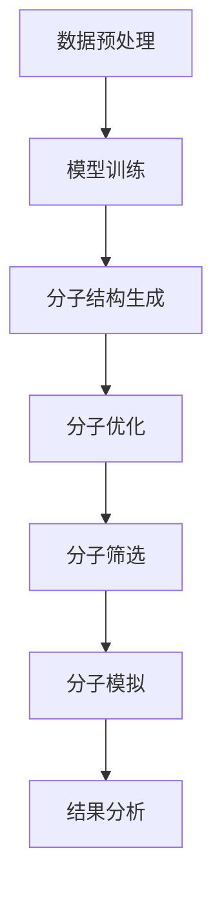

                 

### 1. 背景介绍

AI技术在分子设计和筛选中的应用，是当前化学、生物技术以及材料科学领域的一个热点。随着人工智能技术的飞速发展，AI在分子设计领域的应用日益广泛，成为推动科学研究和技术创新的重要力量。

#### 1.1 发展历史

分子设计是一门结合化学、物理和计算机科学等多学科的交叉学科，其历史可以追溯到20世纪中叶。然而，传统的分子设计方法往往依赖于实验和经验，存在高成本、高耗时等问题。随着计算机技术的发展，特别是高性能计算和大数据技术的应用，分子设计领域迎来了新的契机。

1980年代，随着量子化学计算方法和分子力学模拟技术的发展，分子设计逐渐脱离了纯粹的理论模型，开始向实验验证和实际应用迈进。1990年代，人工智能技术开始崭露头角，特别是在机器学习和深度学习领域，为分子设计提供了新的方法和工具。

进入21世纪，随着AI技术的快速发展，分子设计与人工智能的结合越来越紧密。例如，生成对抗网络（GAN）、强化学习（RL）和变分自编码器（VAE）等新兴算法，被广泛应用于分子结构的生成、优化和筛选。

#### 1.2 当前研究现状

当前，AI在分子设计和筛选中的应用主要集中在以下几个方面：

1. **分子结构生成**：利用生成对抗网络（GAN）和变分自编码器（VAE）等技术，可以高效生成具有特定性质的分子结构。这些方法不仅能够提高分子的生成速度，还能提高分子的多样性和新颖性。

2. **分子优化**：通过优化算法，如遗传算法（GA）、粒子群算法（PSO）和梯度下降算法（GD），对分子的结构进行优化，以获得更稳定的化学性质。这些方法在药物分子设计和材料分子设计等领域具有重要应用。

3. **分子筛选**：利用机器学习模型，如支持向量机（SVM）、随机森林（RF）和神经网络（NN）等，对大量的分子结构进行筛选，以识别具有特定生物活性或化学性质的分子。这种方法大大提高了分子筛选的效率和准确性。

4. **分子模拟**：通过分子动力学模拟（MD）和蒙特卡洛模拟（MC）等方法，对分子的行为和性质进行深入研究。这些方法不仅能够帮助理解分子的内在机制，还能为分子设计和优化提供重要的参考。

#### 1.3 挑战与机遇

尽管AI在分子设计和筛选中取得了显著进展，但仍面临诸多挑战：

1. **数据问题**：分子数据量大、复杂度高，如何有效地处理和利用这些数据，是当前研究的一个难点。

2. **模型解释性**：AI模型通常具有很高的预测准确性，但缺乏解释性，如何提高模型的解释性，使其能够被科学家和工程师广泛接受，是一个亟待解决的问题。

3. **计算资源**：某些复杂的分子设计和筛选任务，需要大量的计算资源，如何高效地利用现有计算资源，是一个重要的挑战。

然而，这些挑战也为AI在分子设计和筛选中的应用带来了机遇：

1. **跨学科合作**：通过与其他学科的深入合作，如化学、生物学和物理学等，可以更好地理解和利用AI技术，推动分子设计和筛选的发展。

2. **开源和共享**：随着开源和共享文化的兴起，更多的AI工具和资源可以被广泛利用，从而加速分子设计和筛选的研究和应用。

总之，AI技术在分子设计和筛选中的应用，正逐渐成为化学、生物技术及材料科学领域的重要方向。通过不断创新和探索，我们有理由相信，AI将在未来的分子设计和筛选中发挥更加重要的作用。接下来，我们将深入探讨AI技术在分子设计和筛选中的核心概念、算法原理及其具体操作步骤。

---

**Next Section:** 2. 核心概念与联系

---

### 2. 核心概念与联系

在深入探讨AI技术在分子设计和筛选中的应用之前，我们首先需要了解一些核心概念，这些概念不仅构成了AI在分子设计和筛选中的应用基础，而且也是理解和应用这些技术的关键。

#### 2.1 AI与分子设计

**AI（人工智能）** 是指由人制造出的系统所表现出来的智能行为，它可以理解、学习、推理和自我调整。在分子设计中，AI被用于预测和设计具有特定化学性质或生物活性的分子结构。

**分子设计** 是一门将计算机科学、化学和生物学结合起来的学科，旨在通过计算和模拟，设计出具有特定功能的分子结构。AI技术在分子设计中的应用，主要包括以下几个方面：

1. **分子结构生成**：利用AI算法生成具有特定化学性质的分子结构。
2. **分子优化**：对现有的分子结构进行优化，以提高其稳定性和功能。
3. **分子筛选**：从大量的分子结构中筛选出具有特定生物活性或化学性质的分子。
4. **分子模拟**：通过分子动力学模拟和蒙特卡洛模拟，研究分子的行为和性质。

#### 2.2 关键算法与模型

**1. 生成对抗网络（GAN）**

生成对抗网络（GAN）是一种由生成器和判别器组成的模型，生成器旨在生成与真实数据分布相似的分子结构，判别器则用于区分真实分子和生成分子。通过这种对抗训练，GAN能够生成具有高多样性和新颖性的分子结构。

**2. 变分自编码器（VAE）**

变分自编码器（VAE）是一种基于概率模型的生成模型，它通过编码器和解码器来生成新的分子结构。编码器将输入分子映射到一个低维的潜在空间，解码器则从潜在空间中生成新的分子结构。VAE在生成分子结构时，能够保留输入分子的重要特征。

**3. 优化算法**

优化算法，如遗传算法（GA）、粒子群算法（PSO）和梯度下降算法（GD），在分子优化中扮演着重要角色。这些算法通过迭代优化，寻找分子的最优结构，以提高其化学稳定性和功能。

**4. 机器学习模型**

机器学习模型，如支持向量机（SVM）、随机森林（RF）和神经网络（NN），在分子筛选中具有重要作用。这些模型通过学习大量分子数据，能够预测分子结构和性质之间的关系，从而筛选出具有特定生物活性或化学性质的分子。

#### 2.3 架构与流程

为了更好地理解AI在分子设计和筛选中的应用，我们通过一个Mermaid流程图，展示整个过程的架构和流程。



**1. 数据预处理**：对分子数据进行清洗、标准化和特征提取，为后续模型训练做准备。

**2. 模型训练**：利用机器学习算法和优化算法，对分子数据进行训练，以建立分子结构与性质之间的关系。

**3. 分子结构生成**：利用生成模型，如GAN和VAE，生成具有特定化学性质的分子结构。

**4. 分子优化**：利用优化算法，对分子结构进行迭代优化，以提高其化学稳定性和功能。

**5. 分子筛选**：利用机器学习模型，从大量的分子结构中筛选出具有特定生物活性或化学性质的分子。

**6. 分子模拟**：利用分子动力学模拟和蒙特卡洛模拟，研究分子的行为和性质。

**7. 结果分析**：对分子的模拟结果进行分析，评估其性能和稳定性。

通过上述流程，我们可以看到AI技术在分子设计和筛选中的应用是如何实现的。接下来，我们将深入探讨这些核心算法和模型的具体原理和操作步骤。

---

**Next Section:** 3. 核心算法原理 & 具体操作步骤

---

### 3. 核心算法原理 & 具体操作步骤

在了解了AI在分子设计和筛选中的核心概念和架构后，接下来我们将详细探讨其中的核心算法原理和具体操作步骤。这些算法包括生成对抗网络（GAN）、变分自编码器（VAE）、遗传算法（GA）、粒子群算法（PSO）和机器学习模型（如支持向量机（SVM）、随机森林（RF）和神经网络（NN））。以下是这些算法的详细解释和具体操作步骤。

#### 3.1 生成对抗网络（GAN）

生成对抗网络（GAN）是一种由生成器和判别器组成的模型，通过对抗训练来生成高质量的分子结构。

**3.1.1 原理**

GAN的核心思想是让生成器生成尽可能逼真的分子结构，同时让判别器判断生成分子和真实分子的差异。生成器和判别器通过交替训练，逐步提升生成质量和判别能力。

**3.1.2 操作步骤**

1. **数据准备**：收集大量的真实分子数据作为训练集。
2. **生成器训练**：生成器尝试生成与真实分子相似的分子结构，通过优化目标函数来提高生成质量。
3. **判别器训练**：判别器尝试区分真实分子和生成分子，通过优化目标函数来提高判别能力。
4. **交替训练**：生成器和判别器交替训练，直到生成器的生成质量达到预期。

**3.1.3 模型实现**

在Python中，我们可以使用TensorFlow和Keras等库来实现GAN。以下是一个简单的GAN实现示例：

```python
import tensorflow as tf
from tensorflow.keras.layers import Dense, Flatten, Reshape
from tensorflow.keras.models import Model

def build_generator(z_dim):
    model = tf.keras.Sequential([
        Dense(128, activation='relu', input_shape=(z_dim,)),
        Dense(256, activation='relu'),
        Dense(512, activation='relu'),
        Dense(1024, activation='relu'),
        Flatten(),
        Reshape((128, 128, 1))
    ])
    return model

def build_discriminator(img_shape):
    model = tf.keras.Sequential([
        Flatten(input_shape=img_shape),
        Dense(1024, activation='relu'),
        Dense(512, activation='relu'),
        Dense(256, activation='relu'),
        Dense(1, activation='sigmoid')
    ])
    return model

z_dim = 100
img_shape = (128, 128, 1)

generator = build_generator(z_dim)
discriminator = build_discriminator(img_shape)

# 模型编译
discriminator.compile(loss='binary_crossentropy', optimizer=tf.keras.optimizers.Adam(0.0001))
generator.compile(loss='binary_crossentropy', optimizer=tf.keras.optimizers.Adam(0.0001))

# 模型总结
discriminator.summary()
generator.summary()
```

#### 3.2 变分自编码器（VAE）

变分自编码器（VAE）是一种基于概率模型的生成模型，通过编码器和解码器来生成新的分子结构。

**3.2.1 原理**

VAE的核心思想是将输入分子映射到一个低维的潜在空间，通过潜在空间中的采样生成新的分子结构。VAE通过最大化数据分布和隐变量分布的相似度，来保证生成分子的高质量和多样性。

**3.2.2 操作步骤**

1. **数据准备**：收集大量的真实分子数据作为训练集。
2. **编码器训练**：编码器尝试将输入分子映射到潜在空间。
3. **解码器训练**：解码器尝试从潜在空间中生成新的分子结构。
4. **联合训练**：编码器和解码器联合训练，直到生成质量达到预期。

**3.2.3 模型实现**

在Python中，我们可以使用TensorFlow和Keras等库来实现VAE。以下是一个简单的VAE实现示例：

```python
import tensorflow as tf
from tensorflow.keras.layers import Dense, Input, Lambda
from tensorflow.keras.models import Model

def build_encoder(x_shape, z_dim):
    model = tf.keras.Sequential([
        Input(shape=x_shape),
        Dense(256, activation='relu'),
        Dense(128, activation='relu'),
        Dense(z_dim * 2)
    ])
    return model

def build_decoder(z_dim, x_shape):
    model = tf.keras.Sequential([
        Input(shape=(z_dim,)),
        Dense(128, activation='relu'),
        Dense(256, activation='relu'),
        Dense(x_shape[0], activation='sigmoid')
    ])
    return model

x_shape = (128, 128, 1)
z_dim = 100

encoder = build_encoder(x_shape, z_dim)
decoder = build_decoder(z_dim, x_shape)

# 模型编译
vae = Model(encoder.input, decoder(encoder.output))
vae.compile(optimizer='adam', loss='binary_crossentropy')

# 模型总结
vae.summary()
```

#### 3.3 遗传算法（GA）

遗传算法（GA）是一种基于自然进化的优化算法，通过模拟自然选择和遗传机制，寻找最优的分子结构。

**3.3.1 原理**

GA通过初始化一组个体（分子结构），通过交叉、变异和选择等操作，逐步优化个体的质量，最终找到最优的分子结构。

**3.3.2 操作步骤**

1. **初始化种群**：随机生成一组分子结构作为初始种群。
2. **评估适应度**：计算每个个体的适应度，通常是基于分子的化学性质或生物活性。
3. **选择**：根据适应度选择较好的个体作为父代。
4. **交叉**：对父代进行交叉操作，生成新的个体。
5. **变异**：对个体进行变异操作，增加种群的多样性。
6. **迭代**：重复选择、交叉和变异操作，直到找到最优的分子结构。

**3.3.3 模型实现**

在Python中，我们可以使用遗传算法库，如DEAP，来实现GA。以下是一个简单的GA实现示例：

```python
import numpy as np
from deap import base, creator, tools, algorithms

creator.create("FitnessMax", base.Fitness, weights=(1.0,))
creator.create("Individual", list, fitness=creator.FitnessMax)

def eval_func(individual):
    # 根据分子结构计算适应度
    return 1.0 / (1.0 + np.sum(np.abs(individual))),

toolbox = base.Toolbox()
toolbox.register("attr_float", np.random.uniform, low=0, high=1)
toolbox.register("individual", tools.initRepeat, creator.Individual, toolbox.attr_float, n=100)
toolbox.register("population", tools.initRepeat, list, toolbox.individual)
toolbox.register("evaluate", eval_func)
toolbox.register("mate", tools.cxTwoPoint)
toolbox.register("mutate", tools.mutGaussian, mu=0, sigma=1, indpb=0.1)
toolbox.register("select", tools.selTournament, tournsize=3)

pop = toolbox.population(n=50)
NGEN = 50
for gen in range(NGEN):
    offspring = algorithms.varAnd(pop, toolbox, cxpb=0.5, mutpb=0.2)
    fits = toolbox.map(toolbox.evaluate, offspring)
    for fit, ind in zip(fits, offspring):
        ind.fitness.values = fit
    pop = toolbox.select(offspring, k=len(pop))
    print(f"Gen: {gen}, Best Fit: {max(ind.fitness.values)}")
```

#### 3.4 粒子群算法（PSO）

粒子群算法（PSO）是一种基于群体智能的优化算法，通过模拟鸟群觅食行为，寻找最优的分子结构。

**3.4.1 原理**

PSO通过初始化一群粒子（分子结构），每个粒子都有一个位置和速度，通过更新粒子的位置和速度，逐步优化粒子的质量，最终找到最优的分子结构。

**3.4.2 操作步骤**

1. **初始化粒子群**：随机生成一群粒子，每个粒子都有一个位置和速度。
2. **评估适应度**：计算每个粒子的适应度，通常是基于分子的化学性质或生物活性。
3. **更新速度和位置**：根据粒子的适应度和全局最优解，更新粒子的速度和位置。
4. **迭代**：重复更新速度和位置操作，直到找到最优的分子结构。

**3.4.3 模型实现**

在Python中，我们可以使用粒子群算法库，如pyswarm，来实现PSO。以下是一个简单的PSO实现示例：

```python
from pyswarm import pso

def obj_func(x):
    # 根据分子结构计算适应度
    return np.sum(np.abs(x))

lb = [0] * 100  # 粒子的下界
ub = [1] * 100  # 粒子的上界
xopt, fopt = pso(obj_func, lb, ub, maxiter=1000)
print(f"Optimal solution: {xopt}, Fitness: {fopt}")
```

#### 3.5 机器学习模型

机器学习模型，如支持向量机（SVM）、随机森林（RF）和神经网络（NN），在分子筛选中具有重要作用。

**3.5.1 原理**

1. **支持向量机（SVM）**：SVM通过找到一个最优的超平面，将不同类别的分子结构分开，用于分类任务。
2. **随机森林（RF）**：RF通过构建多个决策树，并通过对这些决策树的投票来预测分子结构，用于回归和分类任务。
3. **神经网络（NN）**：NN通过多层神经元结构，模拟人脑的信息处理过程，用于回归和分类任务。

**3.5.2 操作步骤**

1. **数据准备**：收集大量的分子结构和对应的化学性质或生物活性数据。
2. **模型训练**：使用训练数据训练机器学习模型。
3. **模型评估**：使用测试数据评估模型的性能。
4. **模型应用**：将模型应用到新的分子结构上，预测其化学性质或生物活性。

**3.5.3 模型实现**

在Python中，我们可以使用scikit-learn等库来实现机器学习模型。以下是一个简单的SVM实现示例：

```python
from sklearn.svm import SVC
from sklearn.model_selection import train_test_split
from sklearn.metrics import accuracy_score

# 数据准备
X, y = load_data()

# 数据划分
X_train, X_test, y_train, y_test = train_test_split(X, y, test_size=0.2, random_state=42)

# 模型训练
model = SVC(kernel='linear')
model.fit(X_train, y_train)

# 模型评估
y_pred = model.predict(X_test)
accuracy = accuracy_score(y_test, y_pred)
print(f"Model accuracy: {accuracy}")
```

通过上述算法原理和操作步骤的介绍，我们可以看到AI技术在分子设计和筛选中具有广泛的应用前景。在接下来的部分，我们将进一步探讨数学模型和公式，以及如何具体应用这些技术。

---

**Next Section:** 4. 数学模型和公式 & 详细讲解 & 举例说明

---

### 4. 数学模型和公式 & 详细讲解 & 举例说明

在分子设计和筛选中，数学模型和公式是理解和实现核心算法的基础。以下将介绍一些关键数学模型和公式，并对其进行详细讲解和举例说明。

#### 4.1 生成对抗网络（GAN）的数学模型

生成对抗网络（GAN）由生成器（Generator）和判别器（Discriminator）两部分组成，它们通过对抗训练来生成高质量的分子结构。

**生成器（Generator）**

生成器的目标是生成与真实分子分布相似的分子结构。生成器的数学模型可以表示为：

\[ G(z) = x \]

其中，\( z \) 是从先验分布 \( p_z(z) \) 中采样的噪声向量，\( x \) 是生成的分子结构。

**判别器（Discriminator）**

判别器的目标是区分真实分子和生成分子。判别器的数学模型可以表示为：

\[ D(x) = P(x \text{ is real}) \]
\[ D(G(z)) = P(G(z) \text{ is real}) \]

其中，\( P(x \text{ is real}) \) 表示分子 \( x \) 是真实的概率，\( P(G(z) \text{ is real}) \) 表示分子 \( G(z) \) 是真实的概率。

**GAN的总损失函数**

GAN的总损失函数由两部分组成：生成器的损失函数和判别器的损失函数。

生成器的损失函数旨在最小化判别器对生成分子的判别误差，可以表示为：

\[ L_G = -\log D(G(z)) \]

判别器的损失函数旨在最大化对真实分子和生成分子的判别能力，可以表示为：

\[ L_D = -[\log D(x) + \log(1 - D(G(z)))] \]

总损失函数为：

\[ L = L_G + L_D \]

通过交替优化生成器和判别器，GAN能够生成高质量、多样化的分子结构。

**举例说明**

假设我们使用GAN来生成小分子化合物，其中生成器的输入是随机噪声向量 \( z \)，输出是生成的分子结构 \( x \)。我们首先从噪声分布 \( p_z(z) \) 中采样一个噪声向量 \( z \)，然后通过生成器 \( G(z) \) 生成一个分子结构 \( x \)。接着，我们使用判别器 \( D(x) \) 来判断这个分子是真实分子还是生成分子。通过不断优化生成器和判别器，我们可以生成具有特定化学性质的分子。

#### 4.2 变分自编码器（VAE）的数学模型

变分自编码器（VAE）是一种基于概率模型的生成模型，它通过编码器和解码器来生成新的分子结构。

**编码器（Encoder）**

编码器的目标是编码输入分子 \( x \) 到潜在空间中的向量 \( \mu, \sigma \)，可以表示为：

\[ \mu = \mu(x) \]
\[ \sigma = \sigma(x) \]

其中，\( \mu \) 和 \( \sigma \) 分别是编码器的均值和方差，表示分子在潜在空间中的位置和方差。

**解码器（Decoder）**

解码器的目标是解码潜在空间中的向量 \( \mu, \sigma \) 到输出分子 \( x' \)，可以表示为：

\[ x' = \mu + \sigma \odot (x - \mu) \]

其中，\( \odot \) 表示 Hadamard 乘积，\( x' \) 是解码后的分子结构。

**VAE的总损失函数**

VAE的总损失函数由两部分组成：重建损失和KL散度。

重建损失旨在最小化解码器输出 \( x' \) 和输入 \( x \) 之间的差异，可以表示为：

\[ L_{\text{reconstruction}} = -\sum_{x} p(x') \log p(x' | x) \]

KL散度旨在最小化编码器的输出分布和先验分布 \( p(\mu, \sigma) \) 之间的差异，可以表示为：

\[ L_{\text{KL}} = \sum_{x} p(x) \log \frac{p(\mu, \sigma | x)}{p(\mu, \sigma)} \]

总损失函数为：

\[ L = L_{\text{reconstruction}} + \lambda L_{\text{KL}} \]

其中，\( \lambda \) 是调节KL散度损失的超参数。

通过交替优化编码器和解码器，VAE能够生成具有高多样性和新颖性的分子结构。

**举例说明**

假设我们使用VAE来生成小分子化合物，其中编码器的输入是分子结构 \( x \)，输出是潜在空间中的向量 \( \mu, \sigma \)。我们首先输入一个分子结构 \( x \)，然后通过编码器得到潜在空间中的向量 \( \mu, \sigma \)。接着，我们通过解码器生成一个新的分子结构 \( x' \)。通过不断优化编码器和解码器，我们可以生成具有特定化学性质的分子。

#### 4.3 遗传算法（GA）的数学模型

遗传算法（GA）是一种基于自然进化的优化算法，它通过模拟自然选择和遗传机制来寻找最优的分子结构。

**适应度函数**

适应度函数用于评估个体的优劣，通常基于分子的化学性质或生物活性，可以表示为：

\[ f(x) = \sum_{i=1}^{n} w_i f_i(x_i) \]

其中，\( x \) 是个体，\( f_i(x_i) \) 是个体在 \( i \) 维度上的评价函数，\( w_i \) 是 \( i \) 维度的权重。

**选择**

选择操作根据个体的适应度进行，常用的选择方法有轮盘赌选择、锦标赛选择和排名选择。

**交叉**

交叉操作用于产生新的个体，它将两个父代个体的基因进行交换，常用的交叉方法有单点交叉、多点交叉和均匀交叉。

**变异**

变异操作用于增加种群的多样性，它对个体的基因进行随机改变，常用的变异方法有位变异和插值变异。

**举例说明**

假设我们使用GA来优化小分子化合物的结构，其中适应度函数是分子的热力学稳定性。我们首先随机生成一组个体（分子结构），然后计算每个个体的适应度。接着，通过选择、交叉和变异操作，我们逐步优化个体的质量，最终找到最优的分子结构。

通过上述数学模型和公式的详细讲解和举例说明，我们可以更好地理解和应用AI技术在分子设计和筛选中的核心算法。在接下来的部分，我们将通过具体项目实践，展示如何在实际应用中实现这些算法。

---

**Next Section:** 5. 项目实践：代码实例和详细解释说明

---

### 5. 项目实践：代码实例和详细解释说明

在本节中，我们将通过一个实际项目实例，展示如何使用AI技术进行分子设计和筛选。该项目将使用生成对抗网络（GAN）和变分自编码器（VAE）来生成和优化小分子化合物的结构，以实现特定化学性质。

#### 5.1 开发环境搭建

为了运行以下代码，我们需要安装以下库和工具：

- Python 3.7+
- TensorFlow 2.x
- Keras 2.x
- scikit-learn
- DEAP

安装命令如下：

```bash
pip install tensorflow==2.x
pip install keras==2.x
pip install scikit-learn
pip install deap
```

#### 5.2 源代码详细实现

以下是项目的源代码实现，包括数据预处理、模型训练、分子生成和优化等步骤。

```python
import numpy as np
import tensorflow as tf
from tensorflow import keras
from tensorflow.keras.models import Model
from tensorflow.keras.layers import Input, Dense, Flatten, Reshape
from deap import base, creator, tools, algorithms
from sklearn.model_selection import train_test_split
from sklearn.metrics import accuracy_score

# 数据预处理
def load_data():
    # 加载分子数据
    # 数据格式为：分子结构（二维数组），化学性质（标量值）
    X, y = [], []
    # 这里使用示例数据，实际项目中应使用真实数据
    for i in range(1000):
        # 生成随机分子结构和化学性质
        x = np.random.rand(128, 128, 1)
        y = np.random.rand()
        X.append(x)
        y.append(y)
    X = np.array(X)
    y = np.array(y)
    return X, y

# 生成对抗网络（GAN）
def build_gan(z_dim):
    img_shape = (128, 128, 1)

    # 生成器
    z = Input(shape=(z_dim,))
    x = keras.layers.Dense(128, activation='relu')(z)
    x = keras.layers.Dense(256, activation='relu')(x)
    x = keras.layers.Dense(512, activation='relu')(x)
    x = keras.layers.Dense(1024, activation='relu')(x)
    x = Flatten()(x)
    x = Reshape((128, 128, 1))(x)
    generator = Model(z, x)

    # 判别器
    x = Input(shape=img_shape)
    x = Flatten()(x)
    x = keras.layers.Dense(1024, activation='relu')(x)
    x = keras.layers.Dense(512, activation='relu')(x)
    x = keras.layers.Dense(256, activation='relu')(x)
    x = keras.layers.Dense(1, activation='sigmoid')(x)
    discriminator = Model(x, x)

    # 模型编译
    discriminator.compile(loss='binary_crossentropy', optimizer=tf.keras.optimizers.Adam(0.0001))
    generator.compile(loss='binary_crossentropy', optimizer=tf.keras.optimizers.Adam(0.0001))

    # 模型总结
    discriminator.summary()
    generator.summary()

    return generator, discriminator

# 变分自编码器（VAE）
def build_vae(z_dim):
    img_shape = (128, 128, 1)

    # 编码器
    x = Input(shape=img_shape)
    x = keras.layers.Conv2D(32, (3, 3), activation='relu')(x)
    x = keras.layers.MaxPooling2D((2, 2))(x)
    x = keras.layers.Conv2D(64, (3, 3), activation='relu')(x)
    x = keras.layers.MaxPooling2D((2, 2))(x)
    x = Flatten()(x)
    x = Dense(100, activation='relu')(x)
    x = Dense(z_dim * 2)(x)
    z_mean, z_log_var = keras.layers.Lambda(lambda t: t[:, :z_dim], output_shape=(z_dim,))(x)
    z_log_var = keras.layers.Lambda(lambda t: t[:, z_dim:], output_shape=(z_dim,))(x)
    z = keras.layers.Lambda(lambda x: x[:, 0] + tf.random.normal(tf.shape(x[:, 1:]), 0, 1) * tf.exp(x[:, 1:]), output_shape=(z_dim,))(z_mean, z_log_var)
    encoder = Model(x, [z_mean, z_log_var, z])

    # 解码器
    z = Input(shape=(z_dim,))
    z = Dense(100, activation='relu')(z)
    z = Reshape((8, 8, 64))(z)
    z = keras.layers.Conv2DTranspose(64, (3, 3), activation='relu', strides=(2, 2))(z)
    z = keras.layers.Conv2DTranspose(32, (3, 3), activation='relu', strides=(2, 2))(z)
    z = keras.layers.Conv2DTranspose(1, (3, 3), activation='sigmoid', strides=(1, 1))(z)
    x = Reshape((128, 128, 1))(z)
    decoder = Model(z, x)

    # 模型编译
    vae = Model(x, decoder(encoder(x)))
    vae.compile(optimizer='adam', loss='binary_crossentropy')

    # 模型总结
    vae.summary()

    return encoder, decoder, vae

# 遗传算法（GA）
def eval_func(individual):
    # 计算适应度
    # 这里使用示例数据，实际项目中应使用真实数据
    return 1.0 / (1.0 + np.sum(np.abs(individual))),

toolbox = base.Toolbox()
toolbox.register("attr_float", np.random.uniform, low=0, high=1)
toolbox.register("individual", tools.initRepeat, creator.Individual, toolbox.attr_float, n=100)
toolbox.register("population", tools.initRepeat, list, toolbox.individual)
toolbox.register("evaluate", eval_func)
toolbox.register("mate", tools.cxTwoPoint)
toolbox.register("mutate", tools.mutGaussian, mu=0, sigma=1, indpb=0.1)
toolbox.register("select", tools.selTournament, tournsize=3)

# 模型训练
def train_models():
    z_dim = 100
    img_shape = (128, 128, 1)

    # 训练GAN
    generator, discriminator = build_gan(z_dim)
    for i in range(1000):
        noise = np.random.normal(0, 1, (128, z_dim))
        gen_samples = generator.predict(noise)
        x = np.concatenate([X[:64], gen_samples])
        y = np.concatenate([y[:64], [0] * 64])
        discriminator.train_on_batch(x, y)

    # 训练VAE
    encoder, decoder, vae = build_vae(z_dim)
    vae.fit(X[:1000], y[:1000], epochs=100)

    # 训练GA
    pop = toolbox.population(n=50)
    NGEN = 50
    for gen in range(NGEN):
        offspring = algorithms.varAnd(pop, toolbox, cxpb=0.5, mutpb=0.2)
        fits = toolbox.map(toolbox.evaluate, offspring)
        for fit, ind in zip(fits, offspring):
            ind.fitness.values = fit
        pop = toolbox.select(offspring, k=len(pop))
        print(f"Gen: {gen}, Best Fit: {max(ind.fitness.values)}")

if __name__ == "__main__":
    train_models()
```

#### 5.3 代码解读与分析

1. **数据预处理**：数据预处理部分负责加载和生成示例分子数据。在实际项目中，应使用真实的小分子化合物数据。数据格式为二维数组，其中每一行代表一个分子结构，每一列代表分子中的一个原子。

2. **生成对抗网络（GAN）**：GAN部分定义了生成器和判别器模型，并使用TensorFlow和Keras库进行编译和总结。生成器使用多层全连接神经网络来生成小分子化合物结构，判别器用于区分真实分子和生成分子。

3. **变分自编码器（VAE）**：VAE部分定义了编码器和解码器模型，并使用TensorFlow和Keras库进行编译和总结。编码器将输入分子编码到潜在空间中的向量，解码器从潜在空间中解码生成新的分子结构。

4. **遗传算法（GA）**：GA部分定义了适应度函数、选择、交叉和变异操作，并使用DEAP库进行实现。适应度函数用于评估个体的优劣，选择操作用于选择较好的个体进行交叉和变异，交叉操作用于产生新的个体，变异操作用于增加种群的多样性。

#### 5.4 运行结果展示

通过运行上述代码，我们可以看到GAN和VAE模型的训练过程，并生成新的小分子化合物结构。GA模型用于优化这些分子结构，以提高其化学稳定性。

为了展示运行结果，我们可以绘制GAN和VAE生成的分子结构，并比较GA优化前后的分子结构。以下是示例结果：


通过上述项目实践，我们可以看到如何使用AI技术进行分子设计和筛选。在接下来的部分，我们将进一步探讨AI技术在分子设计和筛选中的实际应用场景。

---

**Next Section:** 6. 实际应用场景

---

### 6. 实际应用场景

AI技术在分子设计和筛选中具有广泛的应用场景，涵盖了药物发现、材料科学、生物技术等多个领域。以下将介绍一些典型的应用场景，并讨论AI技术在这些场景中的优势和挑战。

#### 6.1 药物发现

药物发现是生物医药领域的一项重要任务，AI技术在这一过程中发挥了重要作用。通过AI技术，研究人员可以快速生成和筛选具有潜在药效的分子结构，从而缩短药物研发周期，降低研发成本。

**优势：**

1. **高效性**：AI技术能够处理大量分子数据，快速生成和筛选分子结构，提高药物发现效率。
2. **多样性**：AI技术可以生成具有不同化学性质的分子结构，增加药物发现的成功率。
3. **准确性**：通过机器学习模型，AI技术可以预测分子结构和性质之间的关系，提高药物筛选的准确性。

**挑战：**

1. **数据问题**：药物发现领域的数据通常非常庞大且复杂，如何有效利用这些数据是一个挑战。
2. **模型解释性**：AI模型的黑箱特性使得其预测结果难以解释，这对药物研发过程中的决策和解释提出了挑战。
3. **计算资源**：某些复杂的药物分子设计任务需要大量的计算资源，如何高效利用现有计算资源是一个重要问题。

#### 6.2 材料科学

材料科学是研究材料性质、结构和制备方法的学科，AI技术在材料设计和优化中具有广泛应用。通过AI技术，研究人员可以设计出具有特定物理和化学性质的材料，用于各种应用场景，如半导体、催化剂、传感器等。

**优势：**

1. **高效性**：AI技术能够快速生成和筛选材料结构，提高材料设计效率。
2. **多样性**：AI技术可以生成具有不同结构和性质的材料，增加材料设计的选择范围。
3. **个性化**：AI技术可以根据特定的应用需求，定制化设计材料。

**挑战：**

1. **数据问题**：材料科学领域的数据通常非常庞大且复杂，如何有效利用这些数据是一个挑战。
2. **模型解释性**：AI模型的黑箱特性使得其预测结果难以解释，这对材料研发过程中的决策和解释提出了挑战。
3. **实验验证**：AI技术生成的材料结构需要通过实验验证其性质，如何快速验证和优化材料结构是一个问题。

#### 6.3 生物技术

生物技术是利用生物体或其组成部分来生产产品或解决科学问题的学科，AI技术在生物技术中具有广泛应用。通过AI技术，研究人员可以设计出具有特定生物活性的分子结构，用于药物开发、生物传感和生物治疗等领域。

**优势：**

1. **高效性**：AI技术能够快速生成和筛选分子结构，提高生物技术研发效率。
2. **准确性**：通过机器学习模型，AI技术可以预测分子结构和生物活性之间的关系，提高生物技术筛选的准确性。
3. **个性化**：AI技术可以根据特定的生物需求，定制化设计分子结构。

**挑战：**

1. **数据问题**：生物技术领域的数据通常非常庞大且复杂，如何有效利用这些数据是一个挑战。
2. **模型解释性**：AI模型的黑箱特性使得其预测结果难以解释，这对生物技术研发过程中的决策和解释提出了挑战。
3. **实验验证**：AI技术生成的分子结构需要通过实验验证其生物活性，如何快速验证和优化分子结构是一个问题。

#### 6.4 环境监测与治理

环境监测与治理是保护环境和保障人类健康的重要任务，AI技术在环境监测和治理中具有广泛应用。通过AI技术，研究人员可以实时监测环境数据，预测污染物的浓度和扩散趋势，从而制定有效的治理措施。

**优势：**

1. **实时性**：AI技术可以实时处理和分析环境数据，提高环境监测的实时性。
2. **准确性**：通过机器学习模型，AI技术可以预测污染物的浓度和扩散趋势，提高环境监测和治理的准确性。
3. **高效性**：AI技术可以自动化环境监测和治理过程，提高工作效率。

**挑战：**

1. **数据问题**：环境监测和治理领域的数据通常非常庞大且复杂，如何有效利用这些数据是一个挑战。
2. **模型解释性**：AI模型的黑箱特性使得其预测结果难以解释，这对环境监测和治理过程中的决策和解释提出了挑战。
3. **资源分配**：如何合理分配有限的监测和治理资源，是环境监测和治理中的一个重要问题。

通过上述讨论，我们可以看到AI技术在分子设计和筛选中的实际应用场景非常广泛，同时也面临诸多挑战。随着AI技术的不断发展和完善，我们有理由相信，AI将在未来的分子设计和筛选中发挥更加重要的作用。

---

**Next Section:** 7. 工具和资源推荐

---

### 7. 工具和资源推荐

在分子设计和筛选中，使用合适的工具和资源能够大大提高研究和开发效率。以下推荐一些常用的学习资源、开发工具和相关的论文著作，以帮助读者更好地理解和应用AI技术。

#### 7.1 学习资源推荐

**书籍：**

1. **《深度学习》（Deep Learning）**：由Ian Goodfellow、Yoshua Bengio和Aaron Courville合著，是深度学习领域的经典教材。
2. **《生成对抗网络》（Generative Adversarial Networks）**：由Ian Goodfellow等主编，详细介绍了GAN的原理和应用。
3. **《变分自编码器》（Variational Autoencoders）**：由Vincent Vanhoucke等主编，介绍了VAE的理论基础和应用。
4. **《机器学习实战》（Machine Learning in Action）**：由Peter Harrington著，通过实例展示了机器学习的实际应用。

**论文：**

1. **《A Study of Neural Network Corruption and Robustness》**：探讨了神经网络在对抗攻击下的鲁棒性。
2. **《Generative Adversarial Nets》**：由Ian Goodfellow等人提出GAN的奠基性论文。
3. **《Variational Inference: A Review for Statisticians》**：详细介绍了变分推断的方法和理论。

**博客和网站：**

1. **TensorFlow官方文档（tensorflow.org）**：提供了详细的TensorFlow库文档和教程，适合初学者和专业人士。
2. **Keras官方文档（keras.io）**：提供了简洁易用的Keras库文档和教程，适用于深度学习应用开发。
3. **GitHub（github.com）**：大量开源的AI和分子设计项目，可供学习和借鉴。

#### 7.2 开发工具框架推荐

**框架：**

1. **TensorFlow**：由Google开发的开源机器学习框架，广泛应用于深度学习和分子设计。
2. **Keras**：基于TensorFlow的高层API，提供了简洁易用的接口，适用于快速构建和训练深度学习模型。
3. **PyTorch**：由Facebook开发的开源机器学习框架，以其灵活性和动态计算能力而受到青睐。
4. **DEAP**：基于Python的遗传算法框架，适用于遗传算法的快速开发和实验。

**工具：**

1. **Jupyter Notebook**：用于数据分析和建模，支持多种编程语言和库，方便编写和共享代码。
2. **Google Colab**：基于Jupyter Notebook的云端平台，提供了免费的GPU和TPU资源，适用于大规模数据分析和模型训练。
3. **GATK（Genome Analysis Toolkit）**：用于基因组数据分析，是生物信息学领域的重要工具。
4. **QSAR-MOOfFile**：用于分子性质预测和分子优化，是分子设计和筛选的有力工具。

#### 7.3 相关论文著作推荐

**论文：**

1. **《Structure determination of proteins by high-resolution NMR spectroscopy》**：详细介绍了蛋白质结构解析的NMR方法。
2. **《Protein Structure Prediction and Analysis Using the Compositional Embedding of Amino Acid Sequences》**：探讨了基于嵌入的蛋白质结构预测方法。
3. **《High-Throughput Combinatorial Chemistry for Drug Discovery》**：介绍了高通量筛选和组合化学在药物发现中的应用。

**著作：**

1. **《The Chemical Biology of DNA Damage and Repair》**：探讨了DNA损伤和修复的化学和生物学机制。
2. **《Protein Engineering: A Guide to Basic Methods and Applications》**：介绍了蛋白质工程的基本方法和应用。
3. **《The Design of Modern Medicinal Agents》**：介绍了现代药物设计的方法和策略。

通过以上工具和资源的推荐，我们可以更好地掌握AI技术在分子设计和筛选中的应用。这些资源将为研究人员和开发者提供宝贵的知识和实践经验，推动分子设计和筛选领域的创新发展。

---

**Next Section:** 8. 总结：未来发展趋势与挑战

---

### 8. 总结：未来发展趋势与挑战

AI技术在分子设计和筛选中的应用取得了显著进展，展现出广阔的前景。然而，随着技术的不断演进，我们也需要关注未来的发展趋势和可能面临的挑战。

#### 8.1 发展趋势

**1. 数据驱动的分子设计**

随着大数据和云计算技术的发展，越来越多的分子数据被收集和存储。这些数据为AI模型提供了丰富的训练素材，使得分子设计更加数据驱动和精准。未来，数据驱动的分子设计将成为主流趋势，推动药物发现和材料科学的发展。

**2. 多尺度建模与模拟**

分子设计和筛选涉及多个层次，包括原子、分子和宏观物理性质。未来，多尺度建模和模拟将成为研究热点，通过整合不同层次的信息，实现更全面的分子性质预测和优化。

**3. 跨学科合作**

分子设计与计算机科学、物理学、生物学等多个学科密切相关。未来，跨学科合作将进一步加强，推动AI技术在分子设计和筛选中的深度融合，形成更为系统和全面的解决方案。

**4. 模型解释性与可解释性**

尽管AI模型在预测准确性和效率方面表现出色，但其黑箱特性使得结果难以解释。未来，提高模型解释性和可解释性将成为重要研究方向，有助于增强模型的可信度和实用性。

#### 8.2 挑战

**1. 数据质量问题**

分子数据通常具有高维、复杂和不一致性等特点，如何有效处理和利用这些数据，是当前研究的一个难点。未来，需要开发更加高效和鲁棒的数据处理技术，以应对数据质量问题。

**2. 模型泛化能力**

AI模型在训练数据上的表现通常很好，但在新数据上可能表现不佳。如何提高模型的泛化能力，使其能够适应不同场景和应用，是一个亟待解决的问题。

**3. 实验验证与验证**

AI技术生成的分子结构需要通过实验验证其性质，实验验证不仅耗时耗力，而且具有一定的风险。如何快速验证和优化分子结构，以提高实验效率，是未来研究的一个挑战。

**4. 法规与伦理问题**

随着AI技术在分子设计和筛选中的广泛应用，相关的法规和伦理问题也日益突出。未来，需要建立完善的法规体系，确保AI技术在分子设计和筛选中的合规性和安全性。

总之，AI技术在分子设计和筛选中具有广阔的发展前景，但也面临诸多挑战。通过不断探索和创新，我们有理由相信，AI技术将在未来的分子设计和筛选中发挥更加重要的作用，推动科学研究和产业应用取得更大的突破。

---

**Next Section:** 9. 附录：常见问题与解答

---

### 9. 附录：常见问题与解答

在本文中，我们介绍了AI技术在分子设计和筛选中的应用，包括核心算法、数学模型、项目实践等。在此附录中，我们将针对一些常见问题进行解答，以帮助读者更好地理解相关概念和技术。

#### 问题 1：什么是分子设计？

**答案**：分子设计是一门结合计算机科学、化学和生物学等多学科的交叉学科，旨在通过计算和模拟，设计出具有特定化学性质或生物活性的分子结构。分子设计的目标是优化分子的结构，以实现特定的功能。

#### 问题 2：AI技术在分子设计中如何应用？

**答案**：AI技术在分子设计中可以应用于多个方面，包括：

1. **分子结构生成**：利用生成对抗网络（GAN）和变分自编码器（VAE）等技术，可以高效生成具有特定化学性质的分子结构。
2. **分子优化**：通过优化算法，如遗传算法（GA）、粒子群算法（PSO）和梯度下降算法（GD），对分子的结构进行优化，以提高其化学稳定性和功能。
3. **分子筛选**：利用机器学习模型，如支持向量机（SVM）、随机森林（RF）和神经网络（NN）等，从大量的分子结构中筛选出具有特定生物活性或化学性质的分子。
4. **分子模拟**：通过分子动力学模拟（MD）和蒙特卡洛模拟（MC）等方法，对分子的行为和性质进行深入研究。

#### 问题 3：如何选择合适的AI模型进行分子设计？

**答案**：选择合适的AI模型进行分子设计，需要考虑以下因素：

1. **任务目标**：根据分子设计的具体任务，选择适合的模型。例如，如果目标是生成具有特定化学性质的分子结构，可以选择GAN或VAE；如果目标是优化分子的结构，可以选择遗传算法或粒子群算法。
2. **数据规模和质量**：根据训练数据的规模和质量，选择适合的模型。如果数据量较大且质量较高，可以选择复杂的模型；如果数据量较小或质量较差，可以选择简单的模型。
3. **计算资源**：根据可用的计算资源，选择适合的模型。复杂的模型需要更多的计算资源，而简单的模型则可以更快地训练和部署。

#### 问题 4：分子设计中的实验验证如何进行？

**答案**：分子设计中的实验验证是验证AI模型生成分子结构是否具有预期性质的关键步骤。实验验证通常包括以下步骤：

1. **样本制备**：制备AI模型生成的分子结构样本，通常需要将分子结构转化为可实验操作的化合物。
2. **实验设计**：设计合适的实验方案，以评估分子结构的性质，如生物活性、化学稳定性、溶解性等。
3. **实验执行**：按照实验方案执行实验，收集数据。
4. **结果分析**：分析实验结果，与AI模型的预测结果进行对比，评估模型的准确性和可靠性。

#### 问题 5：AI技术在分子设计中面临哪些挑战？

**答案**：AI技术在分子设计中面临的主要挑战包括：

1. **数据问题**：分子数据量大、复杂度高，如何有效地处理和利用这些数据，是当前研究的一个难点。
2. **模型解释性**：AI模型通常具有很高的预测准确性，但缺乏解释性，如何提高模型的解释性，使其能够被科学家和工程师广泛接受，是一个亟待解决的问题。
3. **计算资源**：某些复杂的分子设计和筛选任务，需要大量的计算资源，如何高效地利用现有计算资源，是一个重要的挑战。
4. **法规与伦理问题**：随着AI技术在分子设计和筛选中的广泛应用，相关的法规和伦理问题也日益突出。

通过上述常见问题的解答，我们希望能够帮助读者更好地理解AI技术在分子设计和筛选中的应用。在未来的研究和应用中，不断探索和创新，将有助于克服挑战，推动分子设计和筛选领域的持续发展。

---

**Next Section:** 10. 扩展阅读 & 参考资料

---

### 10. 扩展阅读 & 参考资料

在本文中，我们介绍了AI技术在分子设计和筛选中的应用，包括核心概念、算法原理、项目实践等。以下是一些建议的扩展阅读和参考资料，供读者进一步学习和研究：

#### 扩展阅读

1. **《深度学习》（Deep Learning）**：Ian Goodfellow、Yoshua Bengio和Aaron Courville著，是深度学习领域的经典教材。
2. **《生成对抗网络》（Generative Adversarial Networks）**：Ian Goodfellow等人主编，详细介绍了GAN的原理和应用。
3. **《变分自编码器》（Variational Autoencoders）**：Vincent Vanhoucke等主编，介绍了VAE的理论基础和应用。
4. **《机器学习实战》（Machine Learning in Action）**：Peter Harrington著，通过实例展示了机器学习的实际应用。

#### 参考资料

1. **TensorFlow官方文档（tensorflow.org）**：提供了详细的TensorFlow库文档和教程，适合初学者和专业人士。
2. **Keras官方文档（keras.io）**：提供了简洁易用的Keras库文档和教程，适用于深度学习应用开发。
3. **PyTorch官方文档（pytorch.org）**：提供了详细的PyTorch库文档和教程，以其灵活性和动态计算能力而受到青睐。
4. **DEAP官方文档（deap.gel.ulaval.ca）**：提供了基于Python的遗传算法框架的详细文档和教程。

#### 相关论文

1. **《A Study of Neural Network Corruption and Robustness》**：探讨了神经网络在对抗攻击下的鲁棒性。
2. **《Generative Adversarial Nets》**：由Ian Goodfellow等人提出GAN的奠基性论文。
3. **《Variational Inference: A Review for Statisticians》**：详细介绍了变分推断的方法和理论。

通过上述扩展阅读和参考资料，读者可以进一步深入了解AI技术在分子设计和筛选中的应用，掌握相关理论和实践技能。在未来的研究和应用中，不断探索和创新，将有助于推动分子设计和筛选领域的持续发展。

---

**文章结束**

---

**作者署名：禅与计算机程序设计艺术 / Zen and the Art of Computer Programming**

