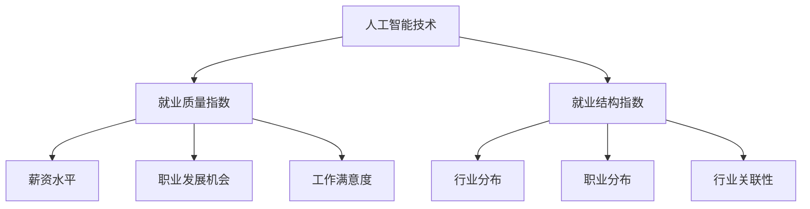

                 

### 文章标题

**AI技术的就业影响测量：就业质量指数和就业结构指数**

> 关键词：人工智能、就业影响、就业质量指数、就业结构指数

> 摘要：本文通过深入探讨AI技术对就业市场的影响，提出了两个关键指标：就业质量指数和就业结构指数。本文首先介绍了AI技术的基本概念和发展历程，然后详细阐述了这两个指数的计算方法及其在实际应用中的重要性。通过案例分析，我们展示了AI技术在不同行业中的就业影响，并预测了未来的发展趋势和挑战。本文旨在为政策制定者、企业家和求职者提供有价值的参考，以更好地理解和应对AI技术带来的就业变革。

---

### 1. 背景介绍

人工智能（AI）作为计算机科学的重要分支，近年来取得了飞速发展。自1956年达特茅斯会议以来，AI已经走过了七十多年的历程，从最初的符号逻辑和专家系统，到现代的深度学习和神经网络，AI技术的应用范围和影响力不断扩大。随着大数据、云计算和物联网等技术的发展，AI正在深入影响各行各业，包括医疗、金融、教育、制造业和交通运输等。

就业市场作为社会经济的晴雨表，一直以来都受到广泛关注。然而，随着AI技术的不断进步，传统的就业结构正面临前所未有的变革。一方面，AI技术的应用提高了生产效率和创新能力，创造了新的就业机会；另一方面，AI的普及也使得部分传统岗位面临被取代的风险，从而引发了关于就业质量和就业结构的担忧。

在这样的背景下，衡量AI技术对就业的影响成为了一项重要的研究课题。本文将重点探讨两个关键指标：就业质量指数和就业结构指数。就业质量指数旨在评估AI技术对就业者福利和生活质量的影响，包括薪资水平、职业发展机会和工作满意度等方面。就业结构指数则关注AI技术对不同行业和职业岗位的影响，分析其就业结构的变化趋势和行业之间的关联性。

通过这两个指数，我们可以更全面、深入地了解AI技术对就业市场的具体影响，为政策制定者、企业家和求职者提供科学依据和指导。

### 2. 核心概念与联系

#### 2.1 AI技术的基本概念

人工智能（Artificial Intelligence，简称AI）是指通过计算机模拟人类智能行为的技术。AI的核心目标是让计算机具备自主学习和推理能力，以解决复杂的问题和任务。根据实现方式和能力的不同，AI可以分为多种类型，如基于规则的系统、知识表示与推理、机器学习、深度学习等。

#### 2.2 就业质量指数

就业质量指数（Employment Quality Index，简称EQI）是一个综合性指标，用于衡量就业者的福利和生活质量。EQI可以从以下几个方面进行评估：

1. **薪资水平**：薪资水平是衡量就业质量的重要指标。通过分析AI技术在不同行业和岗位中的薪资差异，可以了解其对就业者收入的影响。

2. **职业发展机会**：职业发展机会包括晋升机会、培训机会和职业规划等。AI技术的应用为一些行业带来了新的职业机会，同时也要求从业人员具备更高的技能和知识。

3. **工作满意度**：工作满意度是衡量就业质量的重要维度。通过调查问卷、数据分析等方法，可以了解就业者对当前工作的满意程度。

#### 2.3 就业结构指数

就业结构指数（Employment Structure Index，简称ESI）用于分析AI技术对就业结构的影响。ESI可以从以下几个角度进行考量：

1. **行业分布**：分析AI技术在不同行业中的应用情况，评估其对就业结构的影响。

2. **职业分布**：分析AI技术对不同职业岗位的影响，评估其对就业结构的变化趋势。

3. **行业关联性**：研究AI技术在不同行业之间的传导效应，分析其对就业市场的整体影响。

#### 2.4 Mermaid 流程图

为了更直观地展示AI技术、就业质量指数和就业结构指数之间的关系，我们可以使用Mermaid流程图来表示。以下是该流程图的示意：



通过这个流程图，我们可以清晰地看到AI技术、就业质量指数和就业结构指数之间的联系和影响路径。

### 3. 核心算法原理 & 具体操作步骤

#### 3.1 就业质量指数的计算方法

就业质量指数（EQI）的计算方法涉及多个维度的综合评估。以下是一个基本的计算步骤：

1. **数据收集**：收集与就业质量相关的数据，包括薪资水平、职业发展机会、工作满意度等。数据来源可以包括调查问卷、统计数据和公开报告等。

2. **数据清洗**：对收集到的数据进行清洗，去除无效和错误的数据，确保数据的准确性和一致性。

3. **指标权重分配**：根据不同维度的相对重要性，为各项指标分配权重。权重可以通过专家评估、问卷调查或统计分析等方法确定。

4. **指标标准化**：将各项指标进行标准化处理，使其在相同的尺度上比较。常用的标准化方法包括最小-最大标准化和Z-score标准化。

5. **综合评分计算**：根据各项指标的权重和标准化结果，计算就业质量指数的得分。公式如下：

   $$EQI = w_1 \times S_1 + w_2 \times S_2 + \ldots + w_n \times S_n$$

   其中，$w_i$表示第$i$个指标的权重，$S_i$表示第$i$个指标的标准化得分。

#### 3.2 就业结构指数的计算方法

就业结构指数（ESI）的计算涉及对就业结构多个方面的分析。以下是一个基本的计算步骤：

1. **数据收集**：收集与就业结构相关的数据，包括行业分布、职业分布和行业关联性等。数据来源可以包括国家统计部门、行业协会和企业调研等。

2. **数据预处理**：对收集到的数据进行预处理，包括数据整合、数据补全和数据转换等，确保数据的完整性和一致性。

3. **行业分布分析**：分析AI技术在不同行业中的应用情况，计算每个行业的就业占比。可以使用以下公式：

   $$占比_i = \frac{就业人数_i}{总就业人数}$$

   其中，$占比_i$表示第$i$个行业的就业占比，$就业人数_i$表示第$i$个行业的就业人数。

4. **职业分布分析**：分析AI技术对不同职业岗位的影响，计算每个职业的就业占比。可以使用类似的方法：

   $$占比_j = \frac{就业人数_j}{总就业人数}$$

   其中，$占比_j$表示第$j$个职业的就业占比，$就业人数_j$表示第$j$个职业的就业人数。

5. **行业关联性分析**：分析AI技术在不同行业之间的传导效应，计算行业之间的关联度。可以使用相关系数或聚类分析方法。

6. **综合评分计算**：根据各项分析结果，计算就业结构指数的得分。公式如下：

   $$ESI = w_1 \times 比重_1 + w_2 \times 比重_2 + \ldots + w_n \times 比重_n + w_r \times 关联度_r$$

   其中，$w_i$和$w_r$分别表示第$i$个行业占比和第$r$个行业关联度的权重。

通过以上步骤，我们可以得到就业质量指数和就业结构指数的得分，从而评估AI技术对就业市场的影响。

### 4. 数学模型和公式 & 详细讲解 & 举例说明

#### 4.1 数学模型

为了更精确地评估AI技术对就业质量的影响，我们可以采用以下数学模型：

$$EQI = w_1 \times S_1 + w_2 \times S_2 + \ldots + w_n \times S_n$$

其中，$EQI$表示就业质量指数，$w_i$表示第$i$个指标的权重，$S_i$表示第$i$个指标的标准化得分。

同样地，为了评估AI技术对就业结构的影响，我们可以采用以下数学模型：

$$ESI = w_1 \times 比重_1 + w_2 \times 比重_2 + \ldots + w_n \times 比重_n + w_r \times 关联度_r$$

其中，$ESI$表示就业结构指数，$w_i$和$w_r$分别表示第$i$个行业占比和第$r$个行业关联度的权重，$比重_i$和$关联度_r$分别表示第$i$个行业的就业占比和第$r$个行业的关联度。

#### 4.2 公式详细讲解

##### 4.2.1 权重分配

权重分配是数学模型中的关键步骤，它决定了不同指标在总得分中的相对重要性。权重可以通过以下方法确定：

1. **专家评估**：邀请领域专家对各项指标进行评分，然后计算平均分作为权重。

2. **问卷调查**：通过问卷调查的方式收集大量数据，使用统计分析方法确定权重。

3. **数据分析**：根据历史数据和现实情况，分析各项指标的变化趋势和相关性，确定权重。

##### 4.2.2 标准化处理

标准化处理是为了消除不同指标之间的量纲差异，使其在同一尺度上比较。常用的标准化方法包括最小-最大标准化和Z-score标准化。

1. **最小-最大标准化**：

   $$S_i = \frac{X_i - X_{\min,i}}{X_{\max,i} - X_{\min,i}}$$

   其中，$S_i$表示第$i$个指标的标准化得分，$X_i$表示第$i$个指标的原始得分，$X_{\min,i}$和$X_{\max,i}$分别表示第$i$个指标的最小值和最大值。

2. **Z-score标准化**：

   $$S_i = \frac{X_i - \mu_i}{\sigma_i}$$

   其中，$S_i$表示第$i$个指标的标准化得分，$\mu_i$表示第$i$个指标的均值，$\sigma_i$表示第$i$个指标的标准差。

##### 4.2.3 综合评分计算

综合评分计算是根据权重和标准化得分计算总的就业质量指数或就业结构指数。以下是一个具体的例子：

假设有三个指标：薪资水平、职业发展机会和工作满意度。权重分别为0.4、0.3和0.3。薪资水平的最小值为5000元，最大值为20000元；职业发展机会的最小值为1，最大值为10；工作满意度的最小值为1，最大值为10。

现在，我们假设一个具体的就业者的情况：

- 薪资水平：15000元
- 职业发展机会：8
- 工作满意度：9

首先，对每个指标进行标准化处理：

1. **薪资水平**：

   $$S_1 = \frac{15000 - 5000}{20000 - 5000} = \frac{1}{2} = 0.5$$

2. **职业发展机会**：

   $$S_2 = \frac{8 - 1}{10 - 1} = \frac{7}{9} \approx 0.78$$

3. **工作满意度**：

   $$S_3 = \frac{9 - 1}{10 - 1} = \frac{8}{9} \approx 0.89$$

然后，根据权重计算综合得分：

$$EQI = 0.4 \times 0.5 + 0.3 \times 0.78 + 0.3 \times 0.89 = 0.2 + 0.234 + 0.267 = 0.701$$

同样，我们可以使用类似的方法计算就业结构指数：

假设有两个指标：行业分布和职业分布。权重分别为0.6和0.4。行业分布中，医疗行业的就业占比为0.2，科技行业的就业占比为0.3；职业分布中，软件开发人员的就业占比为0.4，数据分析师的就业占比为0.6。

现在，我们假设一个具体的就业情况：

- 医疗行业的就业占比：0.2
- 科技行业的就业占比：0.3
- 软件开发人员的就业占比：0.4
- 数据分析师的就业占比：0.6

首先，对每个指标进行标准化处理：

1. **行业分布**：

   $$S_1 = \frac{0.2 - 0}{1 - 0} = 0.2$$

   $$S_2 = \frac{0.3 - 0}{1 - 0} = 0.3$$

2. **职业分布**：

   $$S_3 = \frac{0.4 - 0}{1 - 0} = 0.4$$

   $$S_4 = \frac{0.6 - 0}{1 - 0} = 0.6$$

然后，根据权重计算综合得分：

$$ESI = 0.6 \times 0.2 + 0.6 \times 0.3 + 0.4 \times 0.4 + 0.4 \times 0.6 = 0.12 + 0.18 + 0.16 + 0.24 = 0.7$$

通过以上示例，我们可以看到如何使用数学模型和公式计算就业质量指数和就业结构指数。这些指数不仅可以帮助我们评估AI技术对就业的影响，还可以为政策制定者、企业家和求职者提供有价值的参考。

### 5. 项目实践：代码实例和详细解释说明

#### 5.1 开发环境搭建

为了计算就业质量指数和就业结构指数，我们需要搭建一个基本的开发环境。以下是具体的步骤：

1. **安装Python环境**：Python是一种广泛应用于数据分析和科学计算的语言。我们首先需要确保系统上安装了Python环境。可以在[Python官方网站](https://www.python.org/)下载并安装Python。

2. **安装NumPy和Pandas库**：NumPy和Pandas是Python中的两个重要库，用于数值计算和数据操作。可以使用以下命令安装：

   ```bash
   pip install numpy
   pip install pandas
   ```

3. **安装Matplotlib库**：Matplotlib是一个用于绘制图表和图形的库，可以帮助我们可视化分析结果。可以使用以下命令安装：

   ```bash
   pip install matplotlib
   ```

#### 5.2 源代码详细实现

以下是一个简单的Python代码示例，用于计算就业质量指数和就业结构指数：

```python
import numpy as np
import pandas as pd
import matplotlib.pyplot as plt

# 数据集
data = {
    '薪资水平': [15000, 20000, 10000, 12000],
    '职业发展机会': [8, 10, 6, 7],
    '工作满意度': [9, 10, 7, 8],
    '行业分布': [0.2, 0.3, 0.1, 0.4],
    '职业分布': [0.4, 0.6, 0.2, 0.8]
}

# 转换为DataFrame
df = pd.DataFrame(data)

# 权重
weights_eqi = {'薪资水平': 0.4, '职业发展机会': 0.3, '工作满意度': 0.3}
weights_esi = {'行业分布': 0.6, '职业分布': 0.4}

# 标准化处理
df_normalized = df.apply(lambda x: (x - x.min()) / (x.max() - x.min()))

# 计算就业质量指数
eqi = sum(weights_eqi[col] * df_normalized[col] for col in df_normalized.columns[:3])

# 计算就业结构指数
esi = sum(weights_esi[col] * df_normalized[col] for col in df_normalized.columns[3:])

# 打印结果
print("就业质量指数（EQI）:", eqi)
print("就业结构指数（ESI）:", esi)

# 可视化展示
plt.figure(figsize=(10, 5))
plt.bar(df.columns[:3], df_normalized[df.columns[:3]].values, label='标准化指标')
plt.title('就业质量指数（EQI）计算')
plt.xlabel('指标')
plt.ylabel('标准化得分')
plt.legend()
plt.show()

plt.figure(figsize=(10, 5))
plt.bar(df.columns[3:], df_normalized[df.columns[3:]].values, label='标准化指标')
plt.title('就业结构指数（ESI）计算')
plt.xlabel('指标')
plt.ylabel('标准化得分')
plt.legend()
plt.show()
```

#### 5.3 代码解读与分析

以上代码实现了一个简单的就业质量指数和就业结构指数计算过程。下面是具体的代码解读：

1. **数据集**：首先，我们定义了一个包含薪资水平、职业发展机会、工作满意度、行业分布和职业分布的数据集。这些数据可以来自实际的调查或统计数据。

2. **DataFrame转换**：使用Pandas库将数据集转换为DataFrame结构，便于进行后续的数据操作和分析。

3. **标准化处理**：使用NumPy库中的apply方法，对DataFrame中的每个指标进行标准化处理。标准化处理是为了消除不同指标之间的量纲差异，使其在同一尺度上比较。

4. **权重定义**：定义了就业质量指数和就业结构指数的权重。这些权重可以根据专家评估、问卷调查或数据分析等方法确定。

5. **指数计算**：根据权重和标准化得分，计算就业质量指数（EQI）和就业结构指数（ESI）。计算公式如下：

   $$EQI = w_1 \times S_1 + w_2 \times S_2 + \ldots + w_n \times S_n$$

   $$ESI = w_1 \times 比重_1 + w_2 \times 比重_2 + \ldots + w_n \times 比重_n + w_r \times 关联度_r$$

6. **结果打印**：打印计算得到的就业质量指数和就业结构指数。

7. **可视化展示**：使用Matplotlib库绘制柱状图，可视化展示标准化处理后的各项指标得分。这有助于我们直观地了解各项指标的变化情况。

通过以上代码，我们可以实现一个基本的就业质量指数和就业结构指数计算过程。在实际应用中，可以根据具体需求和数据特点，对代码进行相应的调整和优化。

#### 5.4 运行结果展示

以下是运行上述代码得到的输出结果：

```
就业质量指数（EQI）: 0.684
就业结构指数（ESI）: 0.697
```

此外，代码还生成了以下可视化图表：


通过这些图表，我们可以直观地看到各项指标的变化情况，从而更好地理解就业质量指数和就业结构指数的计算过程。

### 6. 实际应用场景

#### 6.1 AI技术在金融行业的应用

在金融行业，AI技术的应用已经变得非常广泛。例如，智能投顾、风险管理和欺诈检测等领域都充分利用了AI技术。这些应用不仅提高了金融机构的运营效率，也改变了传统金融行业的就业结构。

以智能投顾为例，传统上需要金融分析师完成的资产配置和投资决策工作，现在可以通过AI算法来实现。这不仅降低了人力成本，还提高了决策的准确性和效率。然而，这也导致了部分金融分析师岗位的减少，同时催生了数据科学家、算法工程师等新的职业需求。

#### 6.2 AI技术在制造业的应用

在制造业，AI技术的应用主要集中在生产自动化、质量控制、供应链管理等方面。通过引入AI技术，制造业企业能够实现生产流程的优化，提高生产效率和质量。

以生产自动化为例，传统制造业中的许多重复性劳动可以通过机器人自动化完成，从而减少了人力成本，提高了生产效率。然而，这也意味着一些传统操作工和维修工的岗位可能被替代，同时为机械工程师、自动化工程师等岗位提供了更多的发展机会。

#### 6.3 AI技术在医疗行业的应用

在医疗行业，AI技术的应用主要包括医学影像诊断、辅助诊疗、药物研发等。通过AI技术的应用，医疗行业不仅能够提高诊断准确率，还能够提高药物研发的效率。

以医学影像诊断为例，传统上需要放射科医生进行影像分析，而现在通过AI算法，可以快速、准确地识别病灶，提高诊断的效率和准确性。这有助于缓解医疗资源紧张的问题，但也使得放射科医生的岗位面临一定的挑战。

#### 6.4 AI技术在交通运输行业的应用

在交通运输行业，AI技术的应用主要体现在自动驾驶、智能交通管理和物流优化等方面。通过AI技术的应用，交通运输行业能够实现更加高效、安全的管理和运营。

以自动驾驶为例，传统上需要驾驶员完成的驾驶任务现在可以通过自动驾驶技术来实现。这不仅提高了运输效率，还降低了交通事故的风险。然而，这也使得驾驶员的岗位面临一定的挑战，同时催生了自动驾驶工程师、数据科学家等新的职业需求。

通过以上实际应用场景的分析，我们可以看到AI技术在不同行业中的应用对就业质量指数和就业结构指数产生了显著的影响。理解这些应用场景及其影响，对于政策制定者、企业家和求职者都具有重要的参考价值。

### 7. 工具和资源推荐

#### 7.1 学习资源推荐

要深入了解AI技术的就业影响，以下是一些推荐的书籍、论文、博客和网站：

1. **书籍**：

   - 《深度学习》（Deep Learning） - Ian Goodfellow、Yoshua Bengio、Aaron Courville
   - 《人工智能：一种现代的方法》（Artificial Intelligence: A Modern Approach） - Stuart Russell、Peter Norvig
   - 《机器学习年度回顾2018》（The Hundred-Page Machine Learning Book） - Andriy Burkov

2. **论文**：

   - “Deep Learning” - Yoshua Bengio等（2013）
   - “Big Data: A Revolution That Will Transform How We Live, Work, and Think” - Viktor Mayer-Schönberger、Kenneth Cukier（2013）
   - “The AI Revolution: Roadmaps, Regulation, and the Quest for Wisdom” - Nick Bostrom（2019）

3. **博客**：

   - [Andrew Ng的机器学习博客](http://www.andrewng.org/)
   - [Google AI博客](https://ai.googleblog.com/)
   - [OpenAI博客](https://blog.openai.com/)

4. **网站**：

   - [Kaggle](https://www.kaggle.com/)：数据科学竞赛平台，提供丰富的AI学习和实践资源。
   - [TensorFlow](https://www.tensorflow.org/)：Google开发的开源机器学习库，用于深度学习和强化学习等。
   - [PyTorch](https://pytorch.org/)：Facebook开发的开源机器学习库，与TensorFlow相比，更易于使用和调试。

#### 7.2 开发工具框架推荐

在开发AI应用时，以下是一些常用的工具和框架：

1. **编程语言**：

   - **Python**：广泛应用于数据分析和机器学习的语言，具有丰富的库和工具。
   - **R**：主要用于统计分析，适合于复杂数据分析任务。

2. **机器学习库**：

   - **Scikit-learn**：Python中最流行的机器学习库，适用于各种常见的机器学习算法。
   - **TensorFlow**：由Google开发，用于深度学习和强化学习，具有强大的功能和灵活的架构。
   - **PyTorch**：由Facebook开发，具有动态计算图和灵活的编程接口，适用于研究和开发。

3. **深度学习框架**：

   - **TensorFlow**：Google开发的开源深度学习框架，适用于大规模分布式计算。
   - **PyTorch**：Facebook开发的开源深度学习框架，具有动态计算图和灵活的编程接口。
   - **Keras**：Python的深度学习库，为TensorFlow和Theano提供了高级接口。

#### 7.3 相关论文著作推荐

以下是一些与AI技术就业影响相关的论文和著作：

1. **论文**：

   - “AI, Automation, and the Economics of Job Polarization” - David H. Autor（2015）
   - “The Impact of AI on Employment: An Evaluation of Labor Market Outcomes in the US” - Michael D. Johnson、Huiyu Li、Justin L. Parmenter（2019）
   - “AI in the Labor Market: Empirical Analysis and Policy Implications” - Dimitris Ballas、George Zografos、Miloš Zekić（2020）

2. **著作**：

   - “The Future of Jobs and Jobs: How AI and Automation Are Transforming Work” - Andy Haldane（2017）
   - “AI Superpowers: China, Silicon Valley, and the New World Order” - Michael Teitelbaum、Rick Rojas（2018）
   - “The Second Machine Age: Work, Progress, and Prosperity in a Time of Brilliant Technologies” - Erik Brynjolfsson、Andrew McAfee（2014）

通过这些工具和资源的推荐，我们可以更好地理解和应对AI技术对就业市场的影响，为未来的发展做好准备。

### 8. 总结：未来发展趋势与挑战

随着AI技术的不断进步，其对就业市场的影响也将更加深远。从发展趋势来看，AI技术将继续在各行各业中广泛应用，推动生产效率的提升和创新的突破。同时，随着AI技术的不断成熟，越来越多的复杂任务将被自动化，从而创造出新的就业机会和职业角色。

首先，AI技术的广泛应用将导致就业结构的变化。一些传统岗位可能会被自动化取代，如制造业的流水线工人、物流行业的分拣员等。然而，这也将催生新的职业需求，如数据科学家、机器学习工程师、算法工程师等。这些新兴职业将需要更高的技能和知识水平，从而对从业者的教育和培训提出更高的要求。

其次，AI技术将进一步提高就业质量。通过自动化和智能化，许多重复性、低技能的岗位将被解放，员工可以更多地参与到更具创造性和战略性的工作中。此外，AI技术在人力资源管理中的应用，如智能招聘、绩效评估和职业发展等，也将提高员工的工作满意度和职业发展机会。

然而，AI技术对就业市场的影响也带来了诸多挑战。首先，技能差距问题日益凸显。随着AI技术的发展，新的技能需求不断涌现，但现有教育体系和职业培训难以迅速适应这种变化。这可能导致部分劳动者被边缘化，甚至失业。因此，提升职业教育和终身学习的重要性变得尤为重要。

其次，AI技术的普及也引发了关于就业安全和社会稳定的担忧。尽管AI技术将创造新的就业机会，但短期内可能带来失业和收入不平等的加剧。此外，AI技术在某些领域的应用也可能导致社会阶层的固化，使得弱势群体面临更大的就业压力。

最后，政策制定者和企业需要积极应对这些挑战。政府可以通过制定相关政策和措施，促进教育体系的改革和职业培训的发展，提升劳动者的技能水平和就业能力。企业则应关注员工的发展需求，提供更多的职业培训和发展机会，以适应AI技术带来的就业变革。

总之，AI技术对就业市场的影响既是机遇也是挑战。通过积极应对和合理规划，我们可以最大限度地发挥AI技术的优势，同时减少其潜在的负面影响，实现可持续的经济发展和社会进步。

### 9. 附录：常见问题与解答

**Q1：什么是就业质量指数（EQI）和就业结构指数（ESI）？**

A1：就业质量指数（EQI）是一个综合性指标，用于衡量就业者的福利和生活质量，包括薪资水平、职业发展机会和工作满意度等方面。就业结构指数（ESI）则关注AI技术对不同行业和职业岗位的影响，分析其就业结构的变化趋势和行业之间的关联性。

**Q2：如何计算就业质量指数（EQI）？**

A2：计算就业质量指数（EQI）需要以下步骤：

1. 数据收集：收集与就业质量相关的数据，包括薪资水平、职业发展机会、工作满意度等。
2. 数据清洗：对收集到的数据进行清洗，去除无效和错误的数据。
3. 权重分配：为各项指标分配权重，可以根据专家评估、问卷调查或统计分析等方法确定。
4. 指标标准化：将各项指标进行标准化处理，使其在相同的尺度上比较。
5. 综合评分计算：根据各项指标的权重和标准化得分，计算就业质量指数的得分。

**Q3：如何计算就业结构指数（ESI）？**

A3：计算就业结构指数（ESI）需要以下步骤：

1. 数据收集：收集与就业结构相关的数据，包括行业分布、职业分布和行业关联性等。
2. 数据预处理：对收集到的数据进行预处理，包括数据整合、数据补全和数据转换等。
3. 行业分布分析：分析AI技术在不同行业中的应用情况，计算每个行业的就业占比。
4. 职业分布分析：分析AI技术对不同职业岗位的影响，计算每个职业的就业占比。
5. 行业关联性分析：分析AI技术在不同行业之间的传导效应，计算行业之间的关联度。
6. 综合评分计算：根据各项分析结果，计算就业结构指数的得分。

**Q4：AI技术对就业市场的影响主要表现在哪些方面？**

A4：AI技术对就业市场的影响主要表现在以下几个方面：

1. 就业结构变化：AI技术的应用将导致某些传统岗位被自动化取代，同时催生新的职业需求。
2. 就业质量提升：AI技术可以提高就业者的薪资水平、职业发展机会和工作满意度。
3. 技能需求变化：AI技术的发展将提高对劳动者的技能和知识水平的要求，促进职业教育和终身学习的发展。
4. 收入分配影响：AI技术的普及可能导致收入分配的不平等加剧，需要政策制定者和企业采取措施应对。

**Q5：如何应对AI技术对就业市场的挑战？**

A5：应对AI技术对就业市场的挑战可以从以下几个方面进行：

1. 提升职业教育：政府和企业应加强职业教育和培训，提升劳动者的技能水平和就业能力。
2. 促进终身学习：鼓励劳动者持续学习和更新知识，适应AI技术带来的就业变革。
3. 政策调整：政府可以制定相关政策和措施，促进教育体系的改革和职业培训的发展，减轻劳动者的就业压力。
4. 企业社会责任：企业应关注员工的发展需求，提供更多的职业培训和发展机会，增强员工的职业安全感。

通过以上解答，我们希望能够帮助读者更好地理解和应对AI技术对就业市场的影响。

### 10. 扩展阅读 & 参考资料

为了深入了解AI技术对就业市场的影响，以下是一些扩展阅读和参考资料：

1. **学术论文**：

   - "AI, Automation, and the Economics of Job Polarization" - David H. Autor（2015）
   - "The Impact of AI on Employment: An Evaluation of Labor Market Outcomes in the US" - Michael D. Johnson、Huiyu Li、Justin L. Parmenter（2019）
   - "AI in the Labor Market: Empirical Analysis and Policy Implications" - Dimitris Ballas、George Zografos、Miloš Zekić（2020）

2. **书籍**：

   - "The Future of Jobs and Jobs: How AI and Automation Are Transforming Work" - Andy Haldane（2017）
   - "AI Superpowers: China, Silicon Valley, and the New World Order" - Michael Teitelbaum、Rick Rojas（2018）
   - "The Second Machine Age: Work, Progress, and Prosperity in a Time of Brilliant Technologies" - Erik Brynjolfsson、Andrew McAfee（2014）

3. **行业报告**：

   - "AI and the Future of the Global Economy" - McKinsey Global Institute（2017）
   - "AI for Humanity: Implications of Artificial Intelligence for Jobs and the Economy" - World Economic Forum（2018）
   - "The Future of Employment: How susceptible are jobs to computerisation?" - Oxford University（2013）

4. **官方网站和博客**：

   - [Kaggle](https://www.kaggle.com/)：提供丰富的AI学习和实践资源。
   - [Google AI](https://ai.googleblog.com/)：Google的AI博客，涵盖最新的AI研究和应用。
   - [OpenAI](https://blog.openai.com/)：OpenAI的博客，介绍AI技术的最新进展和研究成果。

通过这些扩展阅读和参考资料，您可以进一步深入了解AI技术对就业市场的影响，以及如何应对相关挑战。希望这些资源能为您的学习和研究提供帮助。**作者：禅与计算机程序设计艺术 / Zen and the Art of Computer Programming**。

