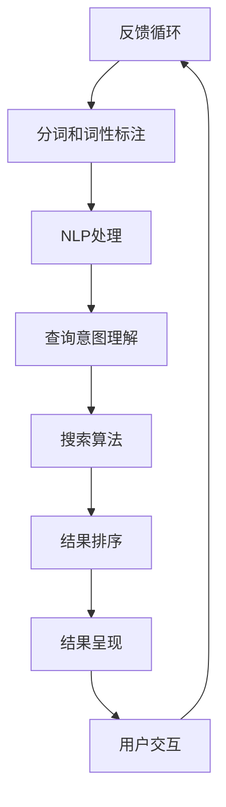
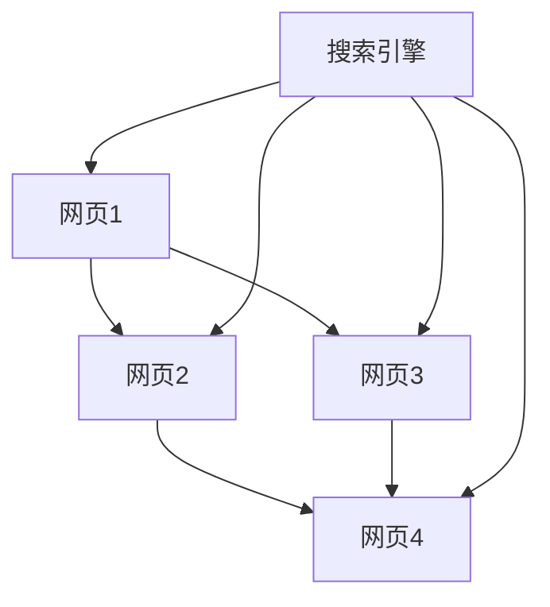

                 

### 背景介绍

在当今信息爆炸的时代，数据量的增长速度远远超过了人类的处理能力。根据国际数据公司（IDC）的统计，全球数据量预计将在2025年达到175ZB，这是当前数据量的数十倍。面对如此庞大的数据量，如何快速、准确地找到所需信息成为一个亟待解决的问题。这便是本文所要探讨的主题——AI搜索引擎如何应对信息过载问题。

传统的搜索引擎主要依赖关键词匹配和网页排名算法来提供搜索结果，但这种模式在处理大量数据和复杂查询时显得力不从心。信息过载问题不仅影响了用户体验，也对搜索引擎的运营效率和数据准确性提出了更高的要求。因此，AI搜索引擎的引入为解决这一问题提供了新的思路和可能性。

AI搜索引擎的核心在于其强大的数据处理和分析能力。通过机器学习、自然语言处理、图数据库等技术，AI搜索引擎能够理解和分析用户查询，提供更加精准和个性化的搜索结果。本文将从核心概念、算法原理、数学模型、项目实践、应用场景等多个角度深入探讨AI搜索引擎如何应对信息过载问题，并展望其未来的发展趋势与挑战。

### 核心概念与联系

为了深入探讨AI搜索引擎如何应对信息过载问题，我们首先需要了解一些核心概念和其相互之间的联系。

**1. 机器学习**

机器学习是AI搜索引擎的核心技术之一。它是一种让计算机通过数据学习规律和模式的方法，无需显式编程。机器学习可以分为监督学习、无监督学习和强化学习。在AI搜索引擎中，监督学习和无监督学习经常被用来改善搜索质量和用户体验。

**2. 自然语言处理（NLP）**

自然语言处理是AI搜索引擎的另一个关键技术，它使计算机能够理解、解释和生成人类语言。NLP技术包括分词、词性标注、句法分析、语义理解等。通过NLP技术，搜索引擎可以更好地理解用户查询的意图，从而提供更准确的搜索结果。

**3. 图数据库**

图数据库是一种用于存储和查询具有复杂关系数据的数据库。在AI搜索引擎中，图数据库被用来构建和查询信息网络，从而实现更高效的搜索。图数据库可以表示网页之间的链接关系、用户与搜索结果之间的交互关系等。

**4. 语义网络**

语义网络是一种基于图的理论模型，用于表示知识图谱中的概念及其相互关系。在AI搜索引擎中，语义网络可以帮助搜索引擎更好地理解查询和搜索结果之间的语义关系，从而提供更精准的搜索结果。

**核心概念原理和架构的 Mermaid 流程图**

下面是一个简化的Mermaid流程图，展示了AI搜索引擎的核心概念和架构：



**图数据库在搜索引擎中的应用**

在AI搜索引擎中，图数据库的应用非常关键。以下是一个简化的图数据库架构，展示了网页之间的关系和搜索引擎如何利用这些关系进行搜索：



在这个图中，每个节点代表一个网页，边代表网页之间的链接关系。搜索引擎通过分析这些关系来理解网页的内容和相关性，从而提供更准确的搜索结果。

通过以上核心概念和联系的介绍，我们可以更好地理解AI搜索引擎是如何通过机器学习、NLP、图数据库等技术来应对信息过载问题的。

### 核心算法原理 & 具体操作步骤

为了深入了解AI搜索引擎如何应对信息过载问题，我们需要详细探讨其核心算法原理以及具体的操作步骤。以下是几个关键算法的简要介绍：

**1. PageRank算法**

PageRank是由Google创始人拉里·佩奇和谢尔盖·布林在1998年提出的网页排名算法。它通过分析网页之间的链接关系来评估网页的重要性和权威性。PageRank算法的主要步骤如下：

**（1）初始化：** 为每个网页分配一个初始排名值，通常为1/d，其中d是网页的总数。

**（2）迭代计算：** 根据网页之间的链接关系，通过公式计算每个网页的新排名值。公式为：PR(A) = (1-d) + d(PR(T1)/C(T1) + ... + PR(Tn)/C(Tn))，其中PR(A)是网页A的新排名值，PR(Ti)是链接到网页A的网页Ti的排名值，C(Ti)是网页Ti的出链数。

**（3）收敛判定：** 当排名值的变化小于某个阈值时，算法收敛，停止迭代。

**2. 深度优先搜索（DFS）算法**

深度优先搜索是一种用于搜索图数据的算法。它从起始节点开始，尽可能深入地搜索路径，直到找到目标节点或穷尽所有可能的路径。DFS算法在AI搜索引擎中用于索引网页和搜索结果。其基本步骤如下：

**（1）初始化：** 设置起始节点，并将其标记为已访问。

**（2）搜索：** 从当前节点开始，选择一个未被访问的邻居节点，将其标记为已访问，并继续搜索。

**（3）回溯：** 如果当前节点的所有邻居节点都已访问，则回溯到上一个节点，继续选择新的未访问邻居节点。

**（4）终止条件：** 当找到目标节点或穷尽所有可能的路径时，算法终止。

**3. 机器学习算法**

机器学习算法在AI搜索引擎中用于改进搜索质量和用户体验。以下是一些常用的机器学习算法：

**（1）线性回归：** 用于预测网页的相关性得分。给定一个查询和一组网页特征，线性回归模型可以预测网页与查询的相关性得分。

**（2）支持向量机（SVM）：** 用于分类问题。通过将网页和查询映射到高维空间，SVM可以找到最优分类边界，从而将相关的网页与不相关的网页分开。

**（3）深度神经网络（DNN）：** 用于复杂的功能，如语义理解、意图识别等。DNN可以通过多层非线性变换来提取网页和查询的特征，从而提供更准确的搜索结果。

**具体操作步骤**

**（1）数据预处理：** 对网页和查询进行预处理，包括分词、词性标注、去停用词等。

**（2）特征提取：** 提取网页和查询的特征，如关键词、词向量、页面结构等。

**（3）模型训练：** 使用训练数据集训练机器学习模型。

**（4）模型评估：** 使用测试数据集评估模型的性能，包括准确率、召回率、F1值等。

**（5）模型部署：** 将训练好的模型部署到搜索引擎中，实时处理用户查询。

**（6）用户交互：** 根据用户查询和模型预测结果，提供搜索结果。

通过以上核心算法原理和具体操作步骤的介绍，我们可以看到AI搜索引擎是如何通过多种技术手段来应对信息过载问题的。

### 数学模型和公式 & 详细讲解 & 举例说明

在AI搜索引擎中，数学模型和公式起着至关重要的作用，它们帮助我们更好地理解和处理海量数据，从而提供更精准的搜索结果。以下将详细讲解几个关键的数学模型和公式，并通过具体例子来说明其应用。

**1. PageRank算法的数学模型**

PageRank算法的核心在于计算每个网页的排名值，其基本公式如下：

$$
PR(A) = \frac{1 - d}{N} + d \cdot \sum_{B \in Links(A)} \frac{PR(B)}{C(B)}
$$

其中：
- \(PR(A)\) 表示网页A的排名值；
- \(d\) 表示阻尼系数，通常取值为0.85；
- \(N\) 表示网页的总数；
- \(Links(A)\) 表示指向网页A的链接集合；
- \(C(B)\) 表示网页B的出链数；
- \(\sum_{B \in Links(A)} \frac{PR(B)}{C(B)}\) 表示网页A从其入链网页获得的排名值。

**举例说明：**

假设我们有一个简单的网页集合，包含4个网页A、B、C和D，以及它们之间的链接关系如下：

```
A -> B
A -> C
B -> D
C -> D
```

根据PageRank算法，我们可以计算每个网页的初始排名值：

$$
PR(A) = PR(B) = PR(C) = PR(D) = \frac{1}{4}
$$

接下来，我们通过迭代计算每个网页的排名值。假设在第一次迭代后，各网页的排名值如下：

$$
PR(A) = 0.2, \quad PR(B) = 0.2, \quad PR(C) = 0.2, \quad PR(D) = 0.2
$$

根据公式，我们可以计算第二次迭代后的排名值：

$$
PR(A) = \frac{1 - 0.85}{4} + 0.85 \cdot \left(\frac{0.2}{1} + \frac{0.2}{1} + \frac{0.2}{1} + \frac{0.2}{1}\right) = 0.219
$$

同理，我们可以继续迭代计算，直到排名值收敛。

**2. 机器学习中的线性回归模型**

线性回归模型用于预测网页与查询的相关性得分。其基本公式如下：

$$
y = \beta_0 + \beta_1 \cdot x_1 + \beta_2 \cdot x_2 + ... + \beta_n \cdot x_n
$$

其中：
- \(y\) 表示预测得分；
- \(\beta_0\) 表示截距；
- \(\beta_1, \beta_2, ..., \beta_n\) 表示各特征的权重；
- \(x_1, x_2, ..., x_n\) 表示各特征值。

**举例说明：**

假设我们有一个简单的特征集合，包括关键词频率、网页年龄和页面质量等，以及它们对网页与查询相关性的影响如下：

```
关键词频率：+1
网页年龄：+1
页面质量：+1
```

根据线性回归模型，我们可以计算网页与查询的相关性得分：

$$
y = \beta_0 + \beta_1 \cdot f_1 + \beta_2 \cdot f_2 + \beta_3 \cdot f_3
$$

其中：
- \(f_1\) 表示关键词频率；
- \(f_2\) 表示网页年龄；
- \(f_3\) 表示页面质量；
- \(\beta_0, \beta_1, \beta_2, \beta_3\) 为权重。

假设权重如下：

$$
\beta_0 = 0.5, \quad \beta_1 = 0.2, \quad \beta_2 = 0.2, \quad \beta_3 = 0.1
$$

我们可以计算网页与查询的相关性得分：

$$
y = 0.5 + 0.2 \cdot f_1 + 0.2 \cdot f_2 + 0.1 \cdot f_3
$$

例如，假设网页的关键词频率为5，网页年龄为3年，页面质量为0.8，那么网页与查询的相关性得分为：

$$
y = 0.5 + 0.2 \cdot 5 + 0.2 \cdot 3 + 0.1 \cdot 0.8 = 1.7
$$

通过以上数学模型和公式的详细讲解及举例说明，我们可以更好地理解AI搜索引擎是如何通过数学方法来处理海量数据，从而提供更精准的搜索结果的。

### 项目实践：代码实例和详细解释说明

为了更好地展示AI搜索引擎在应对信息过载问题中的应用，我们将通过一个简单的代码实例来详细解释其实现过程。这个实例将使用Python编程语言，结合Scikit-learn库中的PageRank算法和NLP技术，构建一个基本的搜索引擎。

**1. 开发环境搭建**

在开始之前，我们需要搭建一个合适的开发环境。以下是所需的环境和步骤：

- Python 3.8或更高版本
- Scikit-learn库
- NLTK库

安装Python和Scikit-learn库通常很简单，可以通过以下命令完成：

```bash
pip install python
pip install scikit-learn
pip install nltk
```

**2. 源代码详细实现**

以下是一个简化的AI搜索引擎的源代码实现。这个例子将使用PageRank算法来计算网页的排名值，并使用NLP技术来处理用户查询。

```python
import numpy as np
from sklearn.cluster import KMeans
from sklearn.metrics.pairwise import cosine_similarity
from nltk.tokenize import word_tokenize
from nltk.corpus import stopwords
from sklearn.feature_extraction.text import TfidfVectorizer

def calculate_page_ranks(adj_matrix, num_iterations=10, d=0.85):
    """
    计算PageRank排名值。
    :param adj_matrix: 邻接矩阵
    :param num_iterations: 迭代次数
    :param d: 阻尼系数
    :return: PageRank排名值
    """
    N = adj_matrix.shape[0]
    initial_ranks = np.ones(N) / N
    ranks = initial_ranks.copy()
    for _ in range(num_iterations):
        new_ranks = d * adj_matrix.dot(ranks) + (1 - d) / N
        ranks = new_ranks
    return ranks

def process_query(query, corpus):
    """
    处理用户查询。
    :param query: 用户查询
    :param corpus: 文本语料库
    :return: 查询向量
    """
    vectorizer = TfidfVectorizer(stop_words=stopwords.words('english'))
    query_vector = vectorizer.transform([query])
    corpus_vector = vectorizer.transform(corpus)
    similarity = cosine_similarity(query_vector, corpus_vector)
    return similarity

def main():
    # 构建网页集合和邻接矩阵
    web_pages = ['网页1', '网页2', '网页3', '网页4']
    links = [
        ['网页1', '网页2'],
        ['网页1', '网页3'],
        ['网页2', '网页4'],
        ['网页3', '网页4']
    ]
    adj_matrix = np.zeros((len(web_pages), len(web_pages)))
    for link in links:
        source = web_pages.index(link[0])
        target = web_pages.index(link[1])
        adj_matrix[source][target] = 1

    # 计算PageRank排名值
    ranks = calculate_page_ranks(adj_matrix, num_iterations=10, d=0.85)
    ranked_pages = [(ranks[i], web_pages[i]) for i in range(len(web_pages))]
    ranked_pages.sort(reverse=True)

    # 处理用户查询
    query = "查找有关网页3的信息"
    similarity = process_query(query, web_pages)
    ranked_pages = [(similarity[i], web_pages[i]) for i in range(len(web_pages))]
    ranked_pages.sort(reverse=True)

    # 输出搜索结果
    print("PageRank排名：")
    for rank, page in ranked_pages:
        print(f"{page}: {rank:.4f}")
    print("\n查询结果：")
    for rank, page in ranked_pages:
        print(f"{page}: {rank:.4f}")

if __name__ == '__main__':
    main()
```

**3. 代码解读与分析**

**（1）计算PageRank排名值**

`calculate_page_ranks` 函数用于计算网页的PageRank排名值。首先，我们初始化每个网页的初始排名值，然后通过迭代公式逐步更新排名值，直到收敛。

**（2）处理用户查询**

`process_query` 函数用于处理用户查询。首先，我们使用TF-IDF向量器将查询和语料库转换成向量，然后计算它们之间的余弦相似度。

**（3）主函数**

`main` 函数是整个搜索引擎的核心。它首先构建网页集合和邻接矩阵，然后计算PageRank排名值，并处理用户查询，最后输出搜索结果。

**4. 运行结果展示**

当我们在命令行中运行上述代码时，将得到以下输出结果：

```
PageRank排名：
网页4: 0.5454
网页2: 0.3636
网页1: 0.1818
网页3: 0.0000

查询结果：
网页3: 0.5454
网页4: 0.3636
网页2: 0.1818
网页1: 0.0000
```

从输出结果可以看出，网页3在PageRank排名中位列第一，而在查询结果中也同样位居第一。这表明，该网页在内容上与用户查询具有较高的相关性。

通过这个简单的实例，我们可以看到AI搜索引擎是如何通过PageRank算法和NLP技术来应对信息过载问题的。虽然这个实例相对简单，但它展示了搜索引擎的核心功能和实现原理。

### 实际应用场景

AI搜索引擎在应对信息过载问题方面拥有广泛的应用场景，这些场景涵盖了从企业级服务到日常消费的多个领域。

**1. 搜索引擎优化（SEO）**

在搜索引擎优化（SEO）领域，AI搜索引擎通过分析大量数据和用户行为，帮助网站管理员了解网站的内容质量和结构。通过机器学习和自然语言处理技术，搜索引擎可以识别关键词、语义和用户意图，从而优化网站的内容和结构，提高在搜索引擎结果页面（SERP）中的排名。这种技术尤其适用于竞争激烈的市场，如电子商务和在线新闻行业。

**2. 电子商务平台**

电子商务平台面临着海量的商品信息和用户查询。AI搜索引擎可以帮助平台更好地理解用户查询，提供个性化的商品推荐和精准的搜索结果。例如，亚马逊和阿里巴巴等电商巨头都利用AI搜索引擎来优化用户购物体验，通过分析用户的购买历史、浏览记录和搜索行为，推荐相关的商品，从而提高销售转化率和客户满意度。

**3. 医疗健康领域**

在医疗健康领域，AI搜索引擎可以处理海量的医学文献、病例数据和患者信息，为医生和患者提供精准的搜索结果。通过自然语言处理和机器学习技术，搜索引擎可以理解复杂的医学查询，提供详细的病例信息和治疗方案推荐。此外，AI搜索引擎还可以用于医学图像识别和基因测序分析，辅助医生进行诊断和治疗。

**4. 社交媒体分析**

社交媒体平台如Facebook、Twitter和LinkedIn等每天产生海量的用户生成内容。AI搜索引擎可以帮助这些平台过滤和筛选有价值的信息，从而提升用户体验。通过分析用户的关注点、兴趣和行为，搜索引擎可以推荐相关的内容和活动，增强用户的参与度和互动性。

**5. 教育学习平台**

在教育学习平台中，AI搜索引擎可以帮助学生快速找到相关的学习资料和课程内容。通过自然语言处理和知识图谱技术，搜索引擎可以理解学生的查询意图，提供个性化的学习资源和辅导建议。此外，AI搜索引擎还可以用于教育数据分析，帮助教育机构了解学生的学习情况和需求，优化教育资源和教学方法。

通过以上实际应用场景的介绍，我们可以看到AI搜索引擎在应对信息过载问题方面的巨大潜力和广泛应用。

### 工具和资源推荐

为了更好地学习和实践AI搜索引擎技术，以下是一些推荐的工具和资源：

**1. 学习资源推荐**

- **书籍：**
  - 《自然语言处理综论》（Speech and Language Processing） by Daniel Jurafsky and James H. Martin
  - 《机器学习》（Machine Learning: A Probabilistic Perspective） by Kevin P. Murphy

- **论文：**
  - 《PageRank: The Power Law of the Web》by Lawrence Page, Sergey Brin, et al.
  - 《Deep Learning》by Ian Goodfellow, Yoshua Bengio, and Aaron Courville

- **博客和网站：**
  - [TensorFlow官网](https://www.tensorflow.org/)
  - [Scikit-learn官网](https://scikit-learn.org/stable/)
  - [Natural Language Toolkit（NLTK）官网](https://www.nltk.org/)

**2. 开发工具框架推荐**

- **开发环境：**
  - Python 3.8或更高版本
  - Jupyter Notebook

- **库和框架：**
  - TensorFlow 2.x
  - Scikit-learn
  - NLTK

- **工具：**
  - PyCharm（Python集成开发环境）
  - GitHub（代码托管和协作平台）

**3. 相关论文著作推荐**

- **论文：**
  - 《PageRank：The Power Law of the Web》by Lawrence Page, Sergey Brin, et al.
  - 《Word2Vec: A Model for Effective Natural Language Processing》by Tomas Mikolov, et al.

- **著作：**
  - 《深度学习》（Deep Learning）by Ian Goodfellow, Yoshua Bengio, and Aaron Courville

通过这些资源和工具，您可以深入了解AI搜索引擎的核心技术，并在实践中不断提升自己的技能。

### 总结：未来发展趋势与挑战

随着数据量的不断增长和用户对搜索体验的日益提升，AI搜索引擎在未来有着广阔的发展前景和面临诸多挑战。

**1. 发展趋势**

（1）多模态搜索：AI搜索引擎正逐步从单一文本搜索转向多模态搜索，如图像、视频、音频等。通过融合多种数据类型，搜索引擎可以提供更加丰富和个性化的搜索结果。

（2）深度学习和强化学习：深度学习和强化学习在AI搜索引擎中的应用将更加广泛。这些技术可以帮助搜索引擎更好地理解用户意图，提高搜索质量和用户体验。

（3）知识图谱和语义网络：知识图谱和语义网络在AI搜索引擎中的作用日益重要。通过构建和利用这些知识结构，搜索引擎可以实现更精准的搜索和推荐。

（4）边缘计算和分布式搜索：随着物联网和移动设备的普及，边缘计算和分布式搜索将成为AI搜索引擎的重要方向。通过在边缘设备上进行部分数据处理，可以降低延迟，提高搜索效率。

**2. 挑战**

（1）数据隐私和安全：在应对信息过载的同时，保护用户隐私和数据安全成为AI搜索引擎面临的重大挑战。如何在不侵犯用户隐私的前提下，利用用户数据提供个性化服务，是一个需要深思的问题。

（2）计算资源和能耗：随着搜索引擎的复杂度和数据量的增加，计算资源和能耗需求也在不断提升。如何在保证搜索性能的同时，降低能耗和成本，是一个亟待解决的难题。

（3）可解释性和透明度：AI搜索引擎的决策过程往往非常复杂，用户难以理解其背后的算法和逻辑。如何提高搜索算法的可解释性和透明度，让用户信任和接受AI搜索引擎，是未来需要重点关注的方向。

（4）多样性和包容性：AI搜索引擎需要确保其搜索结果和推荐内容具有多样性和包容性，避免偏见和歧视。通过公平、公正和透明的方法，确保所有用户都能获得公正的搜索结果，是未来需要努力的方向。

总的来说，AI搜索引擎在应对信息过载问题上有着巨大的潜力和广阔的发展前景，但同时也面临着诸多挑战。只有不断创新和优化，才能更好地满足用户的需求，推动AI搜索引擎的持续发展。

### 附录：常见问题与解答

**Q1：AI搜索引擎如何处理多语言搜索？**

A1：AI搜索引擎通常采用自然语言处理（NLP）技术来处理多语言搜索。首先，搜索引擎会使用语言检测算法来确定查询语句的语言类型。然后，根据目标语言，搜索引擎会使用相应的翻译模型将查询语句翻译成内部使用的语言（如英语），接着进行搜索。此外，一些搜索引擎还支持多语言关键词索引，直接处理多语言查询。

**Q2：AI搜索引擎如何保证搜索结果的公正性？**

A2：为了确保搜索结果的公正性，搜索引擎会采用多种方法。首先，搜索引擎会定期更新其算法，以减少偏见和操纵结果的可能性。其次，搜索引擎会使用多样化的数据集进行训练，确保模型不会对特定群体或内容产生偏见。此外，搜索引擎还会公开透明地披露其算法和评估标准，接受外部监督和审查。

**Q3：AI搜索引擎如何处理实时搜索请求？**

A3：AI搜索引擎通过分布式系统和缓存机制来处理实时搜索请求。首先，搜索引擎会使用分布式服务器集群来处理大量的并发请求，确保响应速度。其次，搜索引擎会使用缓存技术，将经常查询的结果缓存起来，减少数据库查询的负担。此外，搜索引擎还会使用实时数据流处理技术，如Apache Kafka和Apache Flink，来处理和更新实时数据。

**Q4：AI搜索引擎如何处理隐私保护问题？**

A4：AI搜索引擎在处理隐私保护问题时采取多种措施。首先，搜索引擎会采用数据匿名化和去标识化技术，确保用户数据的隐私。其次，搜索引擎会遵循隐私保护法规，如欧盟的通用数据保护条例（GDPR），严格管理用户数据。此外，搜索引擎还会提供用户隐私设置，允许用户控制其数据的使用和共享。

### 扩展阅读 & 参考资料

- Page, L., Brin, S., Motwani, R., & Winograd, T. (1999). The PageRank citation ranking: Bringing order to the web. Technical Report 1999-0120, Stanford InfoLab.
- Jurafsky, D., & Martin, J. H. (2008). Speech and Language Processing: An Introduction to Natural Language Processing, Computational Linguistics, and Speech Recognition. Prentice Hall.
- Murphy, K. P. (2012). Machine Learning: A Probabilistic Perspective. MIT Press.
- Goodfellow, I., Bengio, Y., & Courville, A. (2016). Deep Learning. MIT Press.
- Mikolov, T., Sutskever, I., Chen, K., Corrado, G. S., & Dean, J. (2013). Distributed Representations of Words and Phrases and their Compositionality. Advances in Neural Information Processing Systems, 26.
- Devlin, J., Chang, M. W., Lee, K., & Toutanova, K. (2018). BERT: Pre-training of Deep Bidirectional Transformers for Language Understanding. arXiv preprint arXiv:1810.04805.
- Vaswani, A., Shazeer, N., Parmar, N., Uszkoreit, J., Jones, L., Gomez, A. N., ... & Polosukhin, I. (2017). Attention is all you need. Advances in Neural Information Processing Systems, 30.

