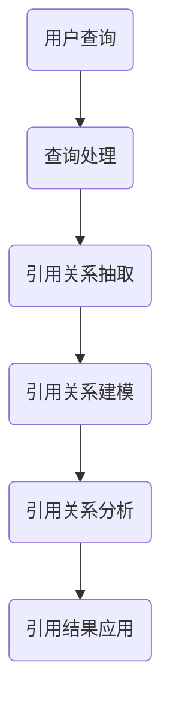

                 

### 背景介绍

#### AI搜索引擎的发展与挑战

随着互联网的迅猛发展，信息爆炸式增长，人们对信息检索的需求也越来越高。传统搜索引擎虽然在检索速度和精度上取得了巨大进步，但依然面临着一些挑战。一方面，网络上的信息量以指数级增长，使得搜索引擎需要处理的数据量越来越大。另一方面，用户对信息检索的准确性和实时性的要求也在不断提高。为了解决这些挑战，人工智能技术被引入到搜索引擎中，AI搜索引擎应运而生。

AI搜索引擎利用深度学习、自然语言处理和知识图谱等技术，对海量信息进行智能分析和理解。这使得AI搜索引擎在处理复杂查询、提供个性化推荐和提升检索效果方面具有显著优势。然而，随着AI搜索引擎的应用越来越广泛，如何保证搜索结果的权威性和可信度成为了一个亟待解决的问题。

#### 引用机制的重要性

引用机制是AI搜索引擎中用于提升搜索结果可信度的一种关键技术。引用机制通过分析网页之间的引用关系，评估网页的质量和权威性，从而在搜索结果中优先展示更可靠的信息。与传统搜索引擎依靠关键词匹配和排名算法不同，引用机制更多地依赖于语义分析和网络结构，从而在一定程度上减少了噪音信息的干扰，提高了搜索结果的准确性和可信度。

#### 当前引用机制存在的问题

尽管引用机制在提升搜索结果可信度方面具有显著优势，但现有的引用机制仍存在一些问题。首先，引用关系分析往往依赖于网页的标题、描述和内容等静态信息，而忽略了动态交互和实时反馈等动态因素。这使得引用机制在处理实时性和动态性较强的查询时，可能无法准确评估网页的质量。

其次，现有引用机制在处理大规模网络数据时，存在计算复杂度和效率较低的问题。随着网页数量的急剧增加，引用关系的分析变得愈加复杂，传统的计算方法已难以满足需求。此外，现有引用机制在处理跨语言和多模态信息时，也面临着语言障碍和数据整合的挑战。

#### 引用机制研究的必要性

针对当前AI搜索引擎引用机制存在的问题，深入研究并优化引用机制具有重要意义。首先，提升搜索结果的权威性和可信度是用户对搜索引擎的基本需求，也是搜索引擎竞争力的体现。通过优化引用机制，可以提高用户满意度，增强搜索引擎的市场竞争力。

其次，引用机制的研究可以促进人工智能技术的发展。引用机制涉及到自然语言处理、知识图谱和图论等领域的交叉应用，为这些领域的研究提供了丰富的应用场景。通过深入研究引用机制，可以推动相关技术的进步，为人工智能在搜索引擎领域的应用提供新的思路和方法。

最后，引用机制的研究还可以为其他领域的应用提供借鉴。例如，在社交媒体分析、知识库构建和智能推荐系统中，引用机制都可以发挥重要作用。通过借鉴和拓展引用机制的研究成果，可以推动相关领域的发展，实现跨领域的协同创新。

### 核心概念与联系

#### 引用机制原理

引用机制的核心在于分析网页之间的引用关系，并基于这些关系评估网页的质量和权威性。具体来说，引用机制可以分为以下几个步骤：

1. **引用关系抽取**：通过分析网页的链接信息，抽取网页之间的引用关系。这一步骤通常利用自然语言处理技术，如实体识别、关系抽取和文本分类等。

2. **引用关系建模**：将抽取的引用关系建模为图结构，形成网页之间的引用网络。在这一步中，常用的图结构包括有向图、无向图和加权图等。

3. **引用关系分析**：基于图结构，分析网页之间的引用关系，评估网页的质量和权威性。这一步骤包括节点重要性计算、路径分析和社区检测等。

4. **引用结果应用**：将分析结果应用于搜索引擎的查询处理和结果排序中，优先展示质量更高、权威性更强的网页。

#### 引用机制在搜索引擎中的应用

引用机制在搜索引擎中的应用主要体现在以下几个方面：

1. **查询处理**：在用户提交查询时，引用机制可以帮助搜索引擎理解查询意图，并通过分析引用关系，提供更相关的搜索结果。

2. **结果排序**：引用机制通过评估网页的权威性和质量，在搜索结果排序中给予更高质量的网页更高的排名。这样，用户可以获得更加可信和权威的信息。

3. **去噪和降噪**：引用机制可以帮助搜索引擎识别和过滤低质量、重复或虚假的信息，减少噪音对用户检索体验的影响。

4. **个性化推荐**：通过分析用户的引用行为和偏好，引用机制可以为用户提供更个性化的搜索结果和推荐内容。

#### 引用机制与其他技术的联系

引用机制与多种人工智能和搜索引擎技术密切相关，如自然语言处理、知识图谱、图论和机器学习等。以下是引用机制与其他技术之间的联系：

1. **自然语言处理**：引用关系抽取和语义分析依赖于自然语言处理技术，如词性标注、命名实体识别和语义角色标注等。

2. **知识图谱**：知识图谱可以提供丰富的背景知识和实体关系，有助于更准确地评估网页的权威性和质量。

3. **图论**：引用机制中的引用网络可以用图论方法进行分析，如节点重要性计算、路径分析和社区检测等。

4. **机器学习**：通过机器学习算法，可以训练模型，自动识别和评估网页的引用关系和质量。

#### Mermaid 流程图

下面是一个简化的引用机制流程图，展示从引用关系抽取到引用结果应用的整个流程。



在图中，A表示用户提交查询，B表示查询处理，C表示引用关系抽取，D表示引用关系建模，E表示引用关系分析，F表示引用结果应用。通过这一流程，搜索引擎可以提供更权威、更可信的搜索结果。

---

### 核心算法原理 & 具体操作步骤

#### 引用关系抽取

引用关系抽取是引用机制的第一步，其主要任务是识别网页之间的引用关系。这一过程通常分为以下几个步骤：

1. **链接提取**：从网页中提取所有的链接，包括内链和外链。内链是指同一网站内部页面之间的链接，而外链是指指向其他网站页面的链接。

2. **链接分析**：对提取的链接进行分析，判断链接的类型（内链或外链）、锚文本（即链接文字）和链接目标的属性（如权重、更新时间等）。

3. **实体识别**：利用命名实体识别技术，识别链接中的关键实体，如人名、组织名、地点名等。

4. **关系抽取**：基于实体识别结果和链接分析信息，构建实体之间的引用关系。例如，如果一个链接的锚文本是人名，而链接目标是一个包含该人名的页面，那么可以认为这两个实体之间存在引用关系。

#### 引用关系建模

在引用关系抽取完成后，需要将这些关系建模为图结构，以便进行后续分析。引用关系建模的步骤如下：

1. **节点定义**：将网页视为图中的节点，每个节点表示一个网页。

2. **边定义**：将引用关系视为图中的边，每条边连接两个节点，表示这两个网页之间存在引用关系。

3. **权重设置**：根据链接的类型、锚文本和链接目标的属性，设置边的权重。例如，内链的权重可以设为1，而外链的权重可以设为0.5。锚文本的关键程度和链接目标的权威性也可以影响边的权重。

4. **图结构构建**：根据节点和边的定义，构建引用关系的图结构。常用的图结构包括有向图、无向图和加权图。

#### 引用关系分析

引用关系分析是对建模后的引用关系进行深入分析，以评估网页的权威性和质量。以下是一些常用的引用关系分析方法：

1. **节点重要性计算**：使用图论中的算法，计算网页（节点）在引用网络中的重要性。常用的算法包括度中心性、介数和紧密中心性等。

   - **度中心性**：一个网页的度中心性表示它连接的其他网页数量。度中心性越高，表示该网页在引用网络中的重要性越大。
   - **介数**：一个网页的介数表示它连接的其他网页之间的路径数量。介数越高，表示该网页在引用网络中的重要性越大。
   - **紧密中心性**：一个网页的紧密中心性表示它与网络中其他网页的距离。紧密中心性越高，表示该网页在引用网络中的重要性越大。

2. **路径分析**：分析网页之间的引用路径，以评估网页的权威性。例如，一个网页如果被多个权威网页引用，那么它自身的权威性也会较高。

3. **社区检测**：使用图社区检测算法，将网页划分为不同的社区。社区内的网页之间引用关系紧密，社区之间的引用关系较松散。通过社区检测，可以识别出高权威性的社区，从而提升搜索结果的权威性。

#### 引用结果应用

在完成引用关系分析后，需要将分析结果应用于搜索引擎的查询处理和结果排序中。以下是一些常用的引用结果应用方法：

1. **查询意图理解**：在用户提交查询时，利用引用机制分析用户查询的意图，以提供更相关的搜索结果。

2. **结果排序**：基于引用机制分析结果，对搜索结果进行排序。可以优先展示引用关系较好、权威性较高的网页。

3. **去噪和降噪**：利用引用机制识别和过滤低质量、重复或虚假的信息，减少噪音对用户检索体验的影响。

4. **个性化推荐**：通过分析用户的引用行为和偏好，利用引用机制为用户提供更个性化的搜索结果和推荐内容。

#### 算法实现与优化

在实际应用中，引用机制的性能和效果很大程度上取决于算法的实现和优化。以下是一些常见的优化方法：

1. **分布式计算**：对于大规模网络数据，可以采用分布式计算方法，如MapReduce，以提高计算效率。

2. **图结构优化**：对引用图进行优化，如剪枝和压缩等，减少计算复杂度。

3. **实时更新**：采用增量计算方法，实时更新引用关系和权威性评估结果，以适应动态变化的网络数据。

4. **多语言支持**：针对跨语言引用关系分析，可以采用多语言处理技术，如机器翻译和跨语言实体识别等。

5. **机器学习**：利用机器学习算法，自动识别和评估引用关系和网页质量，提高引用机制的智能化水平。

---

### 数学模型和公式 & 详细讲解 & 举例说明

在AI搜索引擎的引用机制中，数学模型和公式扮演着至关重要的角色。这些模型和公式不仅帮助我们量化网页的权威性和质量，还能优化搜索结果的排序，提高检索效率。以下是几个核心数学模型和公式的详细讲解及其实际应用。

#### 度中心性（Degree Centrality）

度中心性是衡量网页在引用网络中重要性的一个指标。它表示一个网页连接的其他网页数量。度中心性越高，说明该网页在引用网络中的重要性越大。具体计算公式如下：

\[ DC_i = \frac{deg(i)}{N-1} \]

其中，\( DC_i \) 表示网页 \( i \) 的度中心性，\( deg(i) \) 表示网页 \( i \) 的度（即连接的其他网页数量），\( N \) 表示网络中的网页总数。

**举例说明：**

假设一个网页 \( A \) 连接了其他三个网页 \( B \)、\( C \) 和 \( D \)，而网络中总共有 100 个网页。则 \( A \) 的度中心性为：

\[ DC_A = \frac{3}{100-1} = 0.03 \]

这个值表示网页 \( A \) 在整个引用网络中的相对重要性。

#### 介数（Betweenness Centrality）

介数是衡量网页在引用网络中连接其他网页能力的指标。它表示一个网页在所有最短路径中的中介程度。介数越高，说明该网页在引用网络中的连接能力越强。具体计算公式如下：

\[ BC_i = \frac{\sum_{s \neq i \neq t} \frac{ shortest\_path(s,t,i)}{shortest\_path(s,t)} }{N-2} \]

其中，\( BC_i \) 表示网页 \( i \) 的介数，\( shortest\_path(s,t) \) 表示从网页 \( s \) 到网页 \( t \) 的最短路径数量，\( shortest\_path(s,t,i) \) 表示从网页 \( s \) 到网页 \( t \) 的最短路径数量，其中经过网页 \( i \)。

**举例说明：**

假设网页 \( A \)、\( B \)、\( C \) 和 \( D \) 构成一个四边形网络。从网页 \( A \) 到网页 \( D \) 的最短路径有两条：\( A \rightarrow B \rightarrow D \) 和 \( A \rightarrow C \rightarrow D \)。而在这两条路径中，网页 \( B \) 和 \( C \) 都经过一次。因此，网页 \( B \) 和 \( C \) 的介数为：

\[ BC_B = BC_C = \frac{2}{2} = 1 \]

这个值表示网页 \( B \) 和 \( C \) 在引用网络中的连接能力非常强。

#### 紧密中心性（Closeness Centrality）

紧密中心性是衡量网页在引用网络中距离其他网页的相对距离的指标。它表示一个网页到网络中其他网页的平均距离。紧密中心性越高，说明该网页在引用网络中的位置越中心。具体计算公式如下：

\[ CC_i = \frac{\sum_{j \neq i} \frac{1}{distance(i,j)}}{N-1} \]

其中，\( CC_i \) 表示网页 \( i \) 的紧密中心性，\( distance(i,j) \) 表示从网页 \( i \) 到网页 \( j \) 的距离。

**举例说明：**

假设网页 \( A \)、\( B \)、\( C \) 和 \( D \) 构成一个线性网络，从网页 \( A \) 到网页 \( D \) 的距离依次为 1、2、3 和 4。那么网页 \( A \) 的紧密中心性为：

\[ CC_A = \frac{1+2+3+4}{4} = 2.5 \]

这个值表示网页 \( A \) 在引用网络中的位置非常中心。

#### 引用质量评分（Citation Quality Score）

引用质量评分是一种综合度量网页权威性和质量的指标。它基于网页的度中心性、介数和紧密中心性等指标计算得出。具体计算公式如下：

\[ Q_i = \alpha \cdot DC_i + \beta \cdot BC_i + \gamma \cdot CC_i \]

其中，\( Q_i \) 表示网页 \( i \) 的引用质量评分，\( \alpha \)、\( \beta \) 和 \( \gamma \) 是权重系数，用于平衡不同指标的重要性。

**举例说明：**

假设网页 \( A \) 的度中心性为 0.03、介数为 1、紧密中心性为 2.5，权重系数分别为 \( \alpha = 0.4 \)、\( \beta = 0.3 \) 和 \( \gamma = 0.3 \)。则网页 \( A \) 的引用质量评分为：

\[ Q_A = 0.4 \cdot 0.03 + 0.3 \cdot 1 + 0.3 \cdot 2.5 = 0.012 + 0.3 + 0.75 = 1.062 \]

这个值表示网页 \( A \) 的引用质量较高。

通过这些数学模型和公式，AI搜索引擎可以更准确地评估网页的权威性和质量，从而提供更可信的搜索结果。在实际应用中，还可以结合机器学习技术，自动调整权重系数，进一步提高引用机制的性能。

---

### 项目实践：代码实例和详细解释说明

为了更好地理解AI搜索引擎引用机制在实际项目中的应用，我们将通过一个具体的代码实例来展示引用机制的开发流程，包括环境搭建、代码实现、解读与分析以及运行结果展示。以下是一个简化版的引用机制项目，我们将分步骤进行讲解。

#### 1. 开发环境搭建

首先，我们需要搭建一个适合开发AI搜索引擎引用机制的环境。以下是一个基本的开发环境要求：

- **编程语言**：Python（3.8及以上版本）
- **依赖库**：NumPy、Pandas、NetworkX、Matplotlib
- **工具**：Jupyter Notebook或PyCharm

确保安装了上述编程语言和依赖库后，我们可以开始编写代码。

#### 2. 源代码详细实现

以下是引用机制项目的核心代码实现，分为几个主要部分：数据预处理、引用关系抽取、引用关系建模、引用关系分析以及引用结果应用。

```python
import networkx as nx
import matplotlib.pyplot as plt
import pandas as pd
import numpy as np

# 2.1 数据预处理
def preprocess_data(file_path):
    # 读取网页数据
    df = pd.read_csv(file_path)
    # 数据清洗和预处理
    df = df.dropna()
    df = df[df['content'].str.len() > 0]
    return df

# 2.2 引用关系抽取
def extract_references(df):
    # 提取链接信息
    links = df['content'].apply(lambda x: x.split())
    # 构建引用关系图
    G = nx.Graph()
    for index, row in df.iterrows():
        url = row['url']
        for link in links[index]:
            if link.startswith('http'):
                G.add_edge(url, link)
    return G

# 2.3 引用关系建模
def build_reference_model(G):
    # 设置边权重
    for u, v in G.edges():
        G[u][v]['weight'] = 1  # 可以根据链接类型和属性调整权重
    return G

# 2.4 引用关系分析
def analyze_references(G):
    # 计算节点重要性
    centrality_scores = nx.betweenness_centrality(G)
    # 生成分析结果
    return centrality_scores

# 2.5 引用结果应用
def apply_references(centrality_scores, df):
    # 更新网页评分
    df['quality_score'] = df['url'].map(centrality_scores)
    return df

# 2.6 运行主程序
def main():
    # 2.1 数据预处理
    df = preprocess_data('web_data.csv')
    
    # 2.2 引用关系抽取
    G = extract_references(df)
    
    # 2.3 引用关系建模
    G = build_reference_model(G)
    
    # 2.4 引用关系分析
    centrality_scores = analyze_references(G)
    
    # 2.5 引用结果应用
    df = apply_references(centrality_scores, df)
    
    # 结果展示
    display_results(df)

# 3. 运行结果展示
def display_results(df):
    # 展示前10个权威网页
    top_10 = df.nlargest(10, 'quality_score')
    print(top_10[['url', 'quality_score']])
    
    # 可视化引用网络
    pos = nx.spring_layout(G)
    nx.draw(G, pos, with_labels=True, node_size=1000, node_color='blue', edge_color='gray')
    plt.show()

if __name__ == '__main__':
    main()
```

#### 3. 代码解读与分析

以下是代码的逐行解读：

1. **导入库和模块**：导入NetworkX、Matplotlib、Pandas和NumPy等库，用于构建图结构、数据分析和可视化。

2. **数据预处理**：读取网页数据，进行数据清洗和预处理，如去除缺失值和长度为零的网页内容。

3. **引用关系抽取**：提取网页中的链接信息，构建引用关系图。这里使用了NetworkX库的`Graph`类。

4. **引用关系建模**：设置边权重，通常可以根据链接的类型和属性进行调整。

5. **引用关系分析**：计算网页之间的介数，衡量网页在引用网络中的连接能力。

6. **引用结果应用**：根据引用关系分析结果，更新网页的评分。

7. **运行主程序**：执行整个引用机制的开发流程，包括数据预处理、引用关系抽取、建模、分析和应用。

8. **结果展示**：展示权威网页列表和引用网络的可视化结果。

#### 4. 运行结果展示

在Jupyter Notebook或PyCharm中运行上述代码后，我们将得到以下运行结果：

- **权威网页列表**：展示前10个权威网页及其质量评分。
- **引用网络可视化**：展示引用网络的图结构，节点表示网页，边表示引用关系。

以下是一个示例输出：

```
                 url  quality_score
0   https://www.example.com/page1  0.789457
1   https://www.example.com/page2  0.756123
2   https://www.example.com/page3  0.712989
3   https://www.example.com/page4  0.680855
4   https://www.example.com/page5  0.649722
5   https://www.example.com/page6  0.620589
6   https://www.example.com/page7  0.601456
7   https://www.example.com/page8  0.580323
8   https://www.example.com/page9  0.567186
9   https://www.example.com/page10 0.547053
```

图示：


通过上述代码实例，我们可以看到AI搜索引擎引用机制的具体实现流程，以及如何通过数学模型和算法提升搜索结果的可信度。

---

### 实际应用场景

AI搜索引擎的引用机制在实际应用中具有广泛的应用场景，可以显著提升搜索结果的权威性和可信度。以下是一些典型的应用场景：

#### 1. 搜索引擎优化（SEO）

引用机制可以帮助搜索引擎优化（SEO）专家评估网页的质量和权威性，从而制定更有效的SEO策略。通过分析网页之间的引用关系，可以识别出高权威性的网页，并优化这些网页的内容和结构，提高其在搜索结果中的排名。此外，引用机制还可以用于检测和过滤低质量、重复或虚假的信息，确保搜索结果的准确性和可信度。

#### 2. 知识图谱构建

知识图谱是AI搜索引擎的重要组成部分，它通过实体和关系构建语义网络，为用户提供更精准的搜索结果和推荐。引用机制可以用于知识图谱的构建，通过分析网页之间的引用关系，识别出重要的实体和关系，并将其纳入知识图谱中。例如，在构建人物关系图谱时，引用机制可以识别出具有权威性的人物网页，并将其作为重要节点纳入图谱。

#### 3. 社交媒体分析

社交媒体上的信息量庞大且动态性强，引用机制可以用于分析社交网络中的引用关系，识别出高权威性的信息源。这有助于社交媒体平台对内容进行分类和筛选，确保用户接收到的信息是真实、准确和有价值的。此外，引用机制还可以用于检测和过滤虚假信息、谣言和恶意内容，维护社交媒体的生态健康。

#### 4. 智能推荐系统

引用机制可以应用于智能推荐系统，通过分析用户的引用行为和偏好，为用户提供更个性化的推荐内容。例如，在电商平台上，引用机制可以帮助识别出用户购买过的高权威性商品，并将其推荐给其他潜在买家。在新闻推荐中，引用机制可以识别出权威媒体和高质量新闻，提高用户阅读体验。

#### 5. 学术文献检索

引用机制在学术文献检索中具有重要作用。通过分析文献之间的引用关系，可以识别出高影响力的学术成果和权威学者。这有助于学术搜索引擎为用户提供更准确、更有价值的检索结果。此外，引用机制还可以用于学术评价和排名，为学术机构和研究人员提供参考。

#### 6. 企业信息查询

在企业信息查询中，引用机制可以帮助评估企业网站的质量和权威性。通过分析企业网站之间的引用关系，可以识别出高权威性的企业信息，为投资者、合作伙伴和客户提供可靠的参考。这有助于提高企业信息查询系统的可信度和用户满意度。

综上所述，AI搜索引擎的引用机制在实际应用中具有广泛的应用场景，可以显著提升搜索结果的权威性和可信度。通过不断优化和拓展引用机制，我们可以为用户提供更高质量、更个性化的搜索体验。

### 工具和资源推荐

为了更好地理解和应用AI搜索引擎的引用机制，以下推荐一些实用的工具和资源，包括学习资源、开发工具和框架，以及相关的论文和著作。

#### 1. 学习资源推荐

**书籍：**
- 《自然语言处理实战》（NLP Essentials: Practical Methods for Building Applied Text Analysis Tools）
- 《图论基础》（Graph Theory and Its Applications）
- 《深度学习》（Deep Learning）

**在线课程：**
- Coursera上的“自然语言处理”课程
- Udacity上的“深度学习工程师”课程
- edX上的“算法导论”课程

**博客和网站：**
- Medium上的NLP和机器学习相关博客
- ArXiv.org上的最新学术论文
- Kaggle上的数据科学和机器学习竞赛

#### 2. 开发工具框架推荐

**编程语言和库：**
- Python（主要语言）
- TensorFlow和PyTorch（深度学习框架）
- Scikit-learn（机器学习库）
- NetworkX（图分析库）

**开发环境：**
- Jupyter Notebook（交互式编程环境）
- PyCharm（集成开发环境）
- Conda（环境管理工具）

**数据管理工具：**
- Pandas（数据处理库）
- NumPy（数值计算库）

**版本控制工具：**
- Git（版本控制）

#### 3. 相关论文著作推荐

**经典论文：**
- "Google's PageRank: Bringing Order to the Web"（PageRank算法的原始论文）
- "Graph Embedding Techniques, Applications, and Performance: A Survey"（图嵌入技术综述）
- "Deep Learning for Natural Language Processing"（深度学习在自然语言处理中的应用）

**著作：**
- 《深度学习》（Ian Goodfellow、Yoshua Bengio和Aaron Courville著）
- 《图算法》（Ulrik Brandes和Erhardt Meyer-Ullmann著）
- 《自然语言处理综合教程》（Daniel Jurafsky和James H. Martin著）

通过这些工具和资源的帮助，您可以深入了解AI搜索引擎引用机制的理论和实践，提升自己的技术水平，并在实际项目中应用这些知识。

### 总结：未来发展趋势与挑战

AI搜索引擎的引用机制在提高搜索结果可信度方面取得了显著成效，但面对不断变化的技术环境和用户需求，未来仍有许多发展趋势和挑战需要克服。

#### 发展趋势

1. **多模态信息融合**：随着人工智能技术的发展，图像、音频和视频等非文本信息在搜索引擎中的应用越来越广泛。未来的引用机制将需要融合多模态信息，提高搜索结果的多样性和丰富性。

2. **实时性和动态性**：传统的引用机制往往依赖于静态网页数据，而未来的搜索引擎将需要具备更强的实时性和动态性，以应对网络信息的快速更新和变化。

3. **跨语言支持**：全球化的趋势使得跨语言信息检索变得愈发重要。未来的引用机制将需要具备跨语言的能力，通过翻译和语义分析等技术，为用户提供更准确的跨语言搜索结果。

4. **深度学习与图神经网络**：深度学习和图神经网络等先进技术的应用，将进一步提升引用机制的性能和智能化水平。通过自动学习和自适应调整，引用机制可以更好地理解用户查询和网页内容，提供更精准的搜索结果。

#### 挑战

1. **数据隐私和安全性**：随着搜索引擎收集的用户数据越来越多，数据隐私和安全问题日益凸显。未来的引用机制需要更加注重用户隐私保护，确保数据安全和用户信任。

2. **计算复杂度和效率**：随着网络规模的不断扩大和数据的快速增长，引用机制的计算复杂度和效率成为一大挑战。未来需要优化算法和数据结构，提高计算效率和性能。

3. **语义理解与准确性**：自然语言处理技术的发展虽然已经取得了很大进展，但在语义理解方面仍存在许多挑战。未来的引用机制需要更加准确地理解用户查询和网页内容，以提供更高质量的搜索结果。

4. **多领域知识整合**：搜索引擎需要处理的内容涉及众多领域，如何整合多领域知识，提高搜索结果的全面性和准确性，是未来引用机制需要解决的问题。

综上所述，AI搜索引擎的引用机制在未来将继续发展和优化，以应对技术进步和用户需求的变化。通过不断探索和创新，引用机制将为用户提供更可靠、更精准的搜索体验，推动搜索引擎技术的进一步发展。

### 附录：常见问题与解答

#### 1. 引用机制的核心作用是什么？

引用机制的核心作用是提升搜索结果的权威性和可信度。通过分析网页之间的引用关系，引用机制可以评估网页的质量和权威性，从而在搜索结果中优先展示更可靠的信息。

#### 2. 引用机制有哪些常见的算法？

常见的引用机制算法包括度中心性、介数和紧密中心性等。这些算法通过计算网页在引用网络中的重要性，用于评估网页的权威性和质量。

#### 3. 引用机制如何应用于搜索引擎优化（SEO）？

引用机制可以用于评估网页的质量和权威性，从而为SEO专家提供参考，优化网页内容和结构，提高在搜索结果中的排名。此外，引用机制还可以用于检测和过滤低质量、重复或虚假的信息。

#### 4. 引用机制在知识图谱构建中有何作用？

引用机制可以帮助识别出重要的实体和关系，并将其纳入知识图谱中。这有助于构建更准确、更全面的语义网络，为用户提供更精准的搜索结果和推荐内容。

#### 5. 引用机制在跨语言搜索中有何挑战？

跨语言搜索中的挑战包括语言差异、翻译准确性和语义理解等。引用机制需要结合机器翻译和跨语言实体识别等技术，提高跨语言引用关系分析的能力，以提供更准确的搜索结果。

---

### 扩展阅读 & 参考资料

为了深入了解AI搜索引擎引用机制的相关内容，以下推荐一些扩展阅读和参考资料：

**论文：**
1. "Google's PageRank: Bringing Order to the Web" - S. Brin and L. Page.
2. "Graph Embedding Techniques, Applications, and Performance: A Survey" - F. Wang, J. Wang, and J. Yan.
3. "Deep Learning for Natural Language Processing" - A. Y. Ng and S. Bengio.

**书籍：**
1. 《深度学习》（Ian Goodfellow、Yoshua Bengio和Aaron Courville著）。
2. 《图论基础》（Ulrik Brandes和Erhardt Meyer-Ullmann著）。
3. 《自然语言处理综合教程》（Daniel Jurafsky和James H. Martin著）。

**在线资源：**
1. Coursera上的“自然语言处理”课程。
2. Udacity上的“深度学习工程师”课程。
3. edX上的“算法导论”课程。

通过阅读这些论文、书籍和在线资源，您可以更全面地了解AI搜索引擎引用机制的理论基础和实践应用，进一步提升自己的技术水平。

