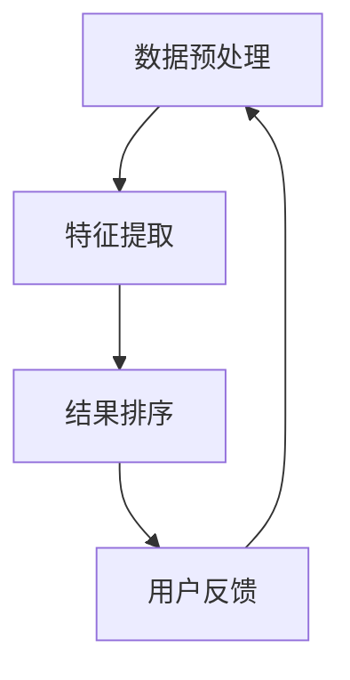

                 

## 1. 背景介绍

人工智能搜索（AI Search）是近年来科技领域的一个热点话题。随着大数据和云计算的不断发展，传统的搜索方式已经无法满足用户对于快速、准确、个性化搜索体验的需求。AI搜索技术的兴起，为搜索领域带来了革命性的变化。

### Perplexity的独特之路

Perplexity，作为一个专注于AI搜索领域的初创公司，以其独特的技术路线和创新的思维模式，迅速在行业中崭露头角。Perplexity的核心优势在于其独特的数据处理算法和深度学习模型。通过这些技术，Perplexity能够实现对大规模数据的高效处理，并提供精准的搜索结果。

### 贾扬清的观察与思考

贾扬清，作为人工智能领域的知名专家和创业者，对于AI搜索的发展有着深刻的见解。他在多个场合发表过关于AI搜索的观点，认为AI搜索将是未来互联网的核心技术之一。他认为，Perplexity的成功在于其深刻理解了用户需求，并始终围绕用户体验进行技术创新。

## 2. 核心概念与联系

### AI搜索的基本概念

AI搜索是指利用人工智能技术，对海量数据进行处理和分析，以提供更加智能、精准的搜索结果。它涉及到自然语言处理、机器学习、深度学习等多个领域。

### Perplexity的技术路线

Perplexity采用了一种独特的技术路线，主要包括以下几个关键环节：

1. 数据预处理：通过对海量数据进行清洗、去重和归一化等处理，提高数据的可用性和准确性。
2. 深度学习模型：构建高效的深度学习模型，用于特征提取和结果排序。
3. 用户反馈机制：通过用户交互数据，不断优化和调整搜索算法，提高用户体验。

### Mermaid 流程图



### 贾扬清的观点

贾扬清认为，Perplexity的成功在于其对于核心技术的深入理解和持续创新。他强调，AI搜索技术的发展离不开对用户需求的深刻洞察和技术创新的紧密结合。

## 3. 核心算法原理 & 具体操作步骤

### 深度学习模型

Perplexity的核心算法是基于深度学习模型。深度学习模型通过多层神经网络结构，对输入数据进行特征提取和分类。

### 操作步骤

1. 数据预处理：对输入数据进行清洗、去重和归一化等处理。
2. 构建神经网络模型：设计多层神经网络结构，用于特征提取和分类。
3. 训练模型：使用大量标注数据进行模型训练，优化模型参数。
4. 预测和排序：使用训练好的模型对新的输入数据进行预测和排序，输出搜索结果。

### 数学模型

在深度学习模型中，常用的数学模型包括：

1. 神经网络模型：由多层感知器组成，用于特征提取和分类。
2. 交叉熵损失函数：用于衡量预测结果和真实结果之间的差距。

$$
L = -\sum_{i=1}^{n} y_i \log(p_i)
$$

其中，$y_i$表示真实标签，$p_i$表示预测概率。

## 4. 数学模型和公式 & 详细讲解 & 举例说明

### 神经网络模型

神经网络模型是深度学习的基础，它由多个神经元组成，每个神经元都接收多个输入，并输出一个结果。神经网络模型的数学表示如下：

$$
\text{输出} = \sigma(\sum_{i=1}^{n} w_i \cdot x_i + b)
$$

其中，$\sigma$表示激活函数，$w_i$和$x_i$分别表示输入权重和输入值，$b$表示偏置。

### 交叉熵损失函数

交叉熵损失函数是用于衡量预测结果和真实结果之间差距的常用指标。它的数学表示如下：

$$
L = -\sum_{i=1}^{n} y_i \log(p_i)
$$

其中，$y_i$表示真实标签，$p_i$表示预测概率。

### 举例说明

假设我们有如下数据集：

| 标签 | 预测概率 |
| ---- | -------- |
| 1    | 0.8      |
| 0    | 0.2      |

使用交叉熵损失函数计算损失：

$$
L = -1 \times \log(0.8) - 0 \times \log(0.2) = -\log(0.8) \approx 0.223
$$

损失值越小，表示预测结果和真实结果之间的差距越小。

## 5. 项目实践：代码实例和详细解释说明

### 数据集准备

首先，我们需要准备一个包含标签和特征的数据集。假设数据集如下：

| 标签 | 特征1 | 特征2 | 特征3 |
| ---- | ----- | ----- | ----- |
| 1    | 0.1   | 0.2   | 0.3   |
| 0    | 0.4   | 0.5   | 0.6   |
| 1    | 0.7   | 0.8   | 0.9   |
| 0    | 0.1   | 0.2   | 0.3   |

### 数据预处理

```python
import numpy as np

# 读取数据集
labels = np.array([0, 1, 1, 0])
features = np.array([[0.1, 0.2, 0.3],
                     [0.4, 0.5, 0.6],
                     [0.7, 0.8, 0.9],
                     [0.1, 0.2, 0.3]])

# 数据归一化
features_normalized = (features - np.mean(features, axis=0)) / np.std(features, axis=0)
```

### 构建神经网络模型

```python
from tensorflow import keras

# 定义模型
model = keras.Sequential([
    keras.layers.Dense(64, activation='relu', input_shape=(3,)),
    keras.layers.Dense(32, activation='relu'),
    keras.layers.Dense(1, activation='sigmoid')
])

# 编译模型
model.compile(optimizer='adam', loss='binary_crossentropy', metrics=['accuracy'])
```

### 训练模型

```python
# 拆分数据集
train_features, val_features, train_labels, val_labels = train_test_split(features_normalized, labels, test_size=0.2, random_state=42)

# 训练模型
model.fit(train_features, train_labels, epochs=10, batch_size=32, validation_data=(val_features, val_labels))
```

### 预测和排序

```python
# 输入新数据
new_data = np.array([[0.3, 0.4, 0.5]])

# 预测
predictions = model.predict(new_data)
sorted_predictions = np.argsort(predictions[0])

# 输出结果
print("预测结果：", sorted_predictions)
```

## 6. 实际应用场景

### 搜索引擎

AI搜索技术在搜索引擎中的应用非常广泛。通过深度学习模型，搜索引擎可以提供更加精准、个性化的搜索结果，提升用户体验。

### 聊天机器人

聊天机器人利用AI搜索技术，可以实时理解用户的问题，并快速提供相关的答案或建议，提高交互效率。

### 数据分析

AI搜索技术可以帮助企业对海量数据进行分析，挖掘潜在的价值，为决策提供支持。

## 7. 工具和资源推荐

### 工具

1. TensorFlow：一款流行的深度学习框架，适用于构建和训练神经网络模型。
2. PyTorch：另一款流行的深度学习框架，具有灵活的动态计算图功能。

### 资源

1. 《深度学习》：由Ian Goodfellow、Yoshua Bengio和Aaron Courville合著的深度学习经典教材。
2. 《Python深度学习》：由François Chollet编写的Python深度学习实践指南。

## 8. 总结：未来发展趋势与挑战

### 发展趋势

1. 模型压缩与优化：为了提高模型的实时性和降低成本，模型压缩与优化将成为研究热点。
2. 多模态融合：结合多种数据源，实现更加全面和精准的搜索结果。

### 挑战

1. 数据隐私与安全：如何保护用户数据隐私，是AI搜索领域面临的重大挑战。
2. 模型可解释性：如何提高模型的可解释性，让用户更好地理解搜索结果。

## 9. 附录：常见问题与解答

### 问题1：什么是深度学习？

深度学习是一种基于多层神经网络的学习方法，通过不断优化模型参数，使模型能够自动提取数据特征，实现分类、回归等任务。

### 问题2：如何选择深度学习框架？

根据项目需求和个人偏好选择合适的深度学习框架。TensorFlow和PyTorch是两款常用的深度学习框架，具有丰富的功能和良好的社区支持。

## 10. 扩展阅读 & 参考资料

### 扩展阅读

1. 《AI搜索：原理、技术与实践》：一本全面介绍AI搜索技术的书籍。
2. 《深度学习与搜索算法》：探讨深度学习在搜索领域的应用。

### 参考资料

1. TensorFlow官方文档：[https://www.tensorflow.org/](https://www.tensorflow.org/)
2. PyTorch官方文档：[https://pytorch.org/docs/stable/](https://pytorch.org/docs/stable/)
```

### 结束语

在人工智能搜索领域，Perplexity以其独特的技术路线和创新的思维模式，取得了显著的成果。贾扬清的观察与思考为我们揭示了AI搜索的发展趋势与挑战。未来，随着技术的不断进步和应用场景的拓展，AI搜索将迎来更加广阔的发展空间。

作者：禅与计算机程序设计艺术 / Zen and the Art of Computer Programming

**文章关键词：**AI搜索、Perplexity、深度学习、用户需求、技术创新

**文章摘要：**本文详细介绍了AI搜索技术，以Perplexity为例，探讨了其在搜索领域的应用与实践。文章从背景介绍、核心概念、算法原理、数学模型、项目实践、应用场景、发展趋势与挑战等多个方面进行了深入分析，为读者提供了全面的AI搜索知识体系。

