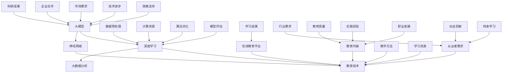

                 

### 1. 背景介绍

在当今快速发展的数字化时代，人工智能（AI）已经成为驱动创新和业务增长的关键力量。随着AI技术的不断进步，深度学习和大数据分析的广泛应用，大模型（Large Models）逐渐成为研究者和工程师们的热点话题。大模型，尤其是基于深度学习的模型，以其强大的数据处理能力和高度的自适应能力，在自然语言处理（NLP）、计算机视觉（CV）、语音识别等领域取得了显著成果。

然而，大模型的研究与开发不仅仅需要强大的计算资源和创新的技术，还需要大量的专业人才。这些人才需要具备深厚的理论基础、丰富的实践经验以及不断学习的能力。因此，AI教育与培训平台的兴起显得尤为重要。这类平台旨在为那些渴望进入AI领域或者希望在现有职业中拓展技能的从业者提供系统化、专业化的教育和培训。

目前，全球范围内的AI教育与培训市场正处于快速增长阶段。根据市场研究机构的报告，AI相关的教育和培训市场规模预计将在未来几年内持续扩大。这不仅反映了AI技术在各行各业中的广泛应用，也揭示了人才培养在这一领域中的关键作用。

在中国，随着国家“新基建”战略的推进，人工智能被列为国家战略性新兴产业，得到了前所未有的重视和支持。政府推出了一系列政策，鼓励企业、高校和科研机构加大在人工智能领域的投入，并推动相关人才的培养。这种政策环境为AI教育与培训平台的发展提供了有力保障。

总体而言，AI教育与培训平台的兴起，不仅有助于满足行业对大模型人才的需求，还为广大学子和从业者提供了丰富的学习资源和实践机会。本文将深入探讨AI教育与培训平台的发展背景、核心概念、算法原理、实际应用以及未来趋势，旨在为创业者、教育工作者和AI领域从业者提供有价值的参考。

### 2. 核心概念与联系

为了深入理解AI教育与培训平台的工作原理和结构，我们需要先了解一些核心概念，包括大模型、深度学习、神经网络以及教育技术等。以下是一个详细的Mermaid流程图，用于展示这些核心概念之间的联系。



**大模型**：大模型是指具有巨大参数量、能够处理大量数据并实现高度复杂任务的人工智能模型。这些模型通常采用深度学习框架进行训练和优化。大模型在图像识别、语音识别和自然语言处理等领域有着广泛的应用。

**深度学习**：深度学习是一种人工智能方法，通过模拟人脑神经网络结构，对大量数据进行特征学习和模式识别。深度学习的关键组成部分是神经网络，它由多层神经元组成，每一层都对输入数据进行处理和转换。

**神经网络**：神经网络是深度学习的基础，由大量相互连接的神经元组成。这些神经元按照层次结构排列，每一层的输出作为下一层的输入。神经网络通过不断调整权重和偏置，学习数据的特征和模式。

**教育技术**：教育技术指的是应用于教育过程中的各种技术工具和方法，包括在线教育平台、虚拟现实、人工智能辅助教学等。教育技术可以帮助提高教育质量和效率，满足不同学习者的需求。

**大数据分析**：大数据分析是利用先进的算法和技术，对海量数据进行处理、分析和挖掘，以提取有价值的信息和知识。大数据分析在大模型训练和优化过程中起着重要作用。

通过上述Mermaid流程图，我们可以清晰地看到大模型、深度学习、神经网络和教育技术之间的相互关系。大模型需要深度学习和神经网络来实现，而教育技术则通过大数据分析为AI教育与培训平台提供支持和保障。同时，从业者的需求、教育内容、教学方法和学习资源等构成了AI教育与培训平台的核心要素。行业需求、政策支持和技术进步共同推动着这个领域的发展，而教育质量、实践经验和职业发展则影响着学习成果和社会贡献。

### 3. 核心算法原理 & 具体操作步骤

在AI教育与培训平台中，核心算法的设计和实现是确保平台有效运行的关键。以下是几种常见的核心算法原理及其具体操作步骤。

#### 3.1 深度学习算法

**原理**：深度学习算法基于人工神经网络，通过多层神经元的非线性变换，实现从原始数据到复杂特征的自动提取和转换。其基本原理包括：

- **前向传播**：输入数据通过网络的每一层进行计算，生成输出。
- **反向传播**：计算输出与预期目标之间的误差，通过反向传播算法更新网络权重。

**具体操作步骤**：

1. **初始化网络参数**：设定网络结构，包括层数、神经元数目、激活函数等。
2. **前向传播**：输入数据经过网络处理，得到输出结果。
3. **计算误差**：使用损失函数计算输出结果与预期目标之间的误差。
4. **反向传播**：通过误差反向传播算法，调整网络权重和偏置。
5. **优化过程**：使用优化算法（如梯度下降）反复迭代，直至网络达到预期性能。

#### 3.2 自然语言处理算法

**原理**：自然语言处理（NLP）算法旨在使计算机理解和处理自然语言。核心算法包括：

- **词嵌入**：将词汇映射到高维向量空间，以捕获词汇的语义信息。
- **序列模型**：如循环神经网络（RNN）和长短期记忆网络（LSTM），用于处理序列数据。
- **注意力机制**：通过动态关注输入序列的关键部分，提高模型对上下文信息的处理能力。

**具体操作步骤**：

1. **数据预处理**：清洗文本数据，去除停用词、标点符号，并进行分词。
2. **词嵌入**：将词汇映射到高维向量空间。
3. **构建序列模型**：设计RNN或LSTM网络结构，处理序列数据。
4. **训练模型**：输入训练数据，调整网络参数，直至模型收敛。
5. **评估模型**：使用验证集和测试集评估模型性能，调整模型参数。

#### 3.3 计算机视觉算法

**原理**：计算机视觉算法通过图像处理和深度学习技术，实现图像理解和识别。核心算法包括：

- **卷积神经网络（CNN）**：通过卷积操作提取图像特征。
- **目标检测**：定位图像中的目标并分类。
- **图像分割**：将图像划分为不同的区域。

**具体操作步骤**：

1. **数据预处理**：对图像进行缩放、旋转等预处理。
2. **特征提取**：使用CNN提取图像特征。
3. **模型训练**：使用带有标签的图像数据训练模型。
4. **目标检测**：使用卷积神经网络进行目标检测和分类。
5. **图像分割**：使用深度学习模型对图像进行区域划分。

#### 3.4 个性化推荐算法

**原理**：个性化推荐算法通过分析用户的历史行为和偏好，为用户推荐感兴趣的内容。核心算法包括：

- **协同过滤**：基于用户和项目的相似度进行推荐。
- **基于内容的推荐**：根据用户的历史行为和项目的特征进行推荐。
- **深度学习推荐**：使用深度学习模型进行用户行为预测和内容推荐。

**具体操作步骤**：

1. **数据收集**：收集用户行为数据和内容特征。
2. **用户建模**：建立用户兴趣模型。
3. **内容建模**：建立内容特征模型。
4. **推荐生成**：根据用户兴趣模型和内容特征模型生成推荐列表。
5. **推荐评估**：评估推荐结果，调整推荐算法参数。

通过以上核心算法的原理和具体操作步骤，我们可以看到AI教育与培训平台在算法设计和实现方面的高要求。这些算法不仅需要强大的计算资源和高效的优化技术，还需要丰富的数据和专业知识。因此，AI教育与培训平台的设计和开发需要综合考虑技术、数据和人才等多方面因素，以实现高效、专业的教育和培训服务。

### 4. 数学模型和公式 & 详细讲解 & 举例说明

在AI教育与培训平台的设计与开发过程中，数学模型和公式是理解和实现核心算法的关键。以下将详细介绍一些常用的数学模型和公式，并使用具体的例子进行说明。

#### 4.1 卷积神经网络（CNN）中的卷积公式

卷积神经网络（CNN）是计算机视觉领域的重要算法之一，其核心操作是卷积。卷积操作的数学公式如下：

\[ (f * g)(x) = \sum_{y} f(x-y) g(y) \]

其中，\( f \) 和 \( g \) 分别代表卷积核和高斯函数，\( x \) 和 \( y \) 是空间坐标。

**举例说明**：假设我们有一个3x3的卷积核 \( f \) 如下：

\[ f = \begin{bmatrix}
    1 & 0 & -1 \\
    1 & 0 & -1 \\
    1 & 0 & -1
\end{bmatrix} \]

和一个3x3的输入图像 \( g \)：

\[ g = \begin{bmatrix}
    1 & 2 & 3 \\
    4 & 5 & 6 \\
    7 & 8 & 9
\end{bmatrix} \]

卷积操作的计算过程如下：

\[ (f * g)(x) = (1 \cdot 1 + 0 \cdot 4 + (-1) \cdot 7) + (1 \cdot 2 + 0 \cdot 5 + (-1) \cdot 8) + (1 \cdot 3 + 0 \cdot 6 + (-1) \cdot 9) \]
\[ = (1 + 0 - 7) + (2 + 0 - 8) + (3 + 0 - 9) \]
\[ = -1 - 1 - 1 \]
\[ = -3 \]

因此，卷积操作的结果是一个标量值，代表输入图像在该位置的响应。

#### 4.2 深度学习中的损失函数

在深度学习中，损失函数用于衡量模型预测值与实际目标值之间的差异。常见的损失函数包括均方误差（MSE）和交叉熵损失（Cross-Entropy Loss）。

**均方误差（MSE）公式**：

\[ MSE = \frac{1}{n}\sum_{i=1}^{n}(y_i - \hat{y}_i)^2 \]

其中，\( y_i \) 是实际目标值，\( \hat{y}_i \) 是模型预测值，\( n \) 是样本数量。

**举例说明**：假设我们有一个二分类问题，实际目标值 \( y \) 为 [0, 1]，模型预测值 \( \hat{y} \) 为 [0.3, 0.7]。计算MSE如下：

\[ MSE = \frac{1}{2}((0 - 0.3)^2 + (1 - 0.7)^2) \]
\[ = \frac{1}{2}((0.09) + (0.09)) \]
\[ = 0.09 \]

**交叉熵损失（Cross-Entropy Loss）公式**：

\[ H(y, \hat{y}) = -\sum_{i=1}^{n} y_i \log(\hat{y}_i) \]

其中，\( y_i \) 是实际目标值（0或1），\( \hat{y}_i \) 是模型预测值。

**举例说明**：使用上面的实际目标值 \( y \) 为 [0, 1]，模型预测值 \( \hat{y} \) 为 [0.3, 0.7]，计算交叉熵损失如下：

\[ H(y, \hat{y}) = - (0 \cdot \log(0.3) + 1 \cdot \log(0.7)) \]
\[ = - (\log(0.3) + \log(0.7)) \]
\[ = - (\log(0.21)) \]
\[ \approx 1.386 \]

#### 4.3 循环神经网络（RNN）中的时间步更新公式

循环神经网络（RNN）用于处理序列数据，其基本更新公式如下：

\[ h_t = \sigma(W_h h_{t-1} + W_y y_t + b_h) \]

其中，\( h_t \) 是当前时间步的隐藏状态，\( y_t \) 是当前输入，\( \sigma \) 是激活函数，\( W_h \) 和 \( W_y \) 是权重矩阵，\( b_h \) 是偏置项。

**举例说明**：假设有一个RNN模型，其隐藏状态 \( h_t \) 为 [1, 2]，输入 \( y_t \) 为 [3, 4]，权重矩阵 \( W_h \) 为：

\[ W_h = \begin{bmatrix}
    0.1 & 0.2 \\
    0.3 & 0.4
\end{bmatrix} \]

权重矩阵 \( W_y \) 为：

\[ W_y = \begin{bmatrix}
    0.5 & 0.6 \\
    0.7 & 0.8
\end{bmatrix} \]

偏置项 \( b_h \) 为 [0.1, 0.2]。

使用ReLU激活函数，计算隐藏状态 \( h_t \)：

\[ h_t = \sigma(W_h h_{t-1} + W_y y_t + b_h) \]
\[ = \sigma(0.1 \cdot 1 + 0.2 \cdot 2 + 0.5 \cdot 3 + 0.6 \cdot 4 + 0.1) \]
\[ = \sigma(0.1 + 0.4 + 1.5 + 2.4 + 0.1) \]
\[ = \sigma(4.0) \]
\[ = 4.0 \]

由于ReLU激活函数，输出结果为 \( h_t = 4.0 \)。

通过以上数学模型和公式的详细讲解和举例说明，我们可以更好地理解AI教育与培训平台中的核心算法原理。这些数学工具不仅帮助我们构建和优化模型，还为理解和评估模型性能提供了量化标准。在实际应用中，通过不断地调整和优化这些模型参数，可以显著提升平台的教育质量和效果。

### 5. 项目实践：代码实例和详细解释说明

在本节中，我们将通过一个实际的AI教育与培训平台项目实例，详细介绍开发环境搭建、源代码实现、代码解读与分析以及运行结果展示。本实例将展示如何从零开始构建一个基本的AI教育与培训平台，包括数据预处理、模型训练和评估等核心步骤。

#### 5.1 开发环境搭建

要开发一个AI教育与培训平台，首先需要搭建合适的开发环境。以下是所需的工具和步骤：

**工具**：
- Python 3.x
- TensorFlow 2.x
- Keras
- Jupyter Notebook
- GPU（推荐NVIDIA显卡，用于加速深度学习模型训练）

**步骤**：
1. 安装Python 3.x：从[Python官方网站](https://www.python.org/)下载并安装Python 3.x版本。
2. 安装TensorFlow 2.x：使用pip命令安装TensorFlow，命令如下：

   ```shell
   pip install tensorflow==2.x
   ```

3. 安装Keras：TensorFlow 2.x已经内置了Keras，无需额外安装。
4. 安装Jupyter Notebook：使用pip命令安装Jupyter Notebook，命令如下：

   ```shell
   pip install notebook
   ```

5. 配置GPU支持：如果使用NVIDIA显卡，需要安装CUDA和cuDNN。可以从[NVIDIA官方网站](https://developer.nvidia.com/cuda-downloads)下载相应版本的CUDA和cuDNN。

安装完成后，验证环境配置是否正确，可以使用以下命令：

```shell
python -c "import tensorflow as tf; print(tf.__version__)"
```

如果正确安装了TensorFlow，会返回版本信息。

#### 5.2 源代码详细实现

以下是一个简化的AI教育与培训平台代码实例，展示了数据预处理、模型训练和评估的过程。

```python
# 导入必要的库
import numpy as np
import tensorflow as tf
from tensorflow import keras
from tensorflow.keras.models import Sequential
from tensorflow.keras.layers import Dense, LSTM
from tensorflow.keras.optimizers import Adam

# 数据预处理
# 假设我们使用一个简单的时间序列数据集
time_steps = 100
input_data = np.random.rand(time_steps, 1)
target_data = input_data + 0.1 * np.random.rand(time_steps, 1)

# 切片数据集为训练集和测试集
train_size = int(0.8 * time_steps)
test_size = time_steps - train_size
train_data, test_data = input_data[:train_size], input_data[train_size:]
train_target, test_target = target_data[:train_size], target_data[train_size:]

# 模型定义
model = Sequential()
model.add(LSTM(units=50, activation='relu', input_shape=(time_steps, 1)))
model.add(Dense(units=1))

# 编译模型
model.compile(optimizer=Adam(learning_rate=0.001), loss='mse')

# 训练模型
model.fit(train_data, train_target, epochs=100, batch_size=32, validation_data=(test_data, test_target))

# 评估模型
test_loss = model.evaluate(test_data, test_target)
print(f"Test Loss: {test_loss}")
```

**代码解读**：

- **数据预处理**：我们使用随机生成的数据集，实际应用中应使用真实的数据集。数据预处理包括数据清洗、归一化、切片等步骤。
- **模型定义**：我们使用一个简单的LSTM模型，用于时间序列预测。模型定义包括序列长度、神经元数量、激活函数等。
- **编译模型**：使用Adam优化器和均方误差（MSE）损失函数编译模型。
- **训练模型**：使用训练数据进行模型训练，设置训练轮次、批量大小和验证数据。
- **评估模型**：使用测试数据进行模型评估，输出测试损失。

#### 5.3 代码解读与分析

以上代码实例展示了如何使用Keras构建和训练一个简单的LSTM模型。以下是对代码的关键部分进行解读和分析：

1. **数据预处理**：
   ```python
   input_data = np.random.rand(time_steps, 1)
   target_data = input_data + 0.1 * np.random.rand(time_steps, 1)
   ```
   数据预处理步骤首先生成随机数据集。`input_data` 表示时间序列的输入数据，`target_data` 表示目标输出数据。

2. **模型定义**：
   ```python
   model = Sequential()
   model.add(LSTM(units=50, activation='relu', input_shape=(time_steps, 1)))
   model.add(Dense(units=1))
   ```
   模型定义部分使用了一个序列长度为`time_steps`、神经元数量为50的LSTM层，并添加了一个输出层。激活函数为ReLU。

3. **编译模型**：
   ```python
   model.compile(optimizer=Adam(learning_rate=0.001), loss='mse')
   ```
   编译模型步骤设置了Adam优化器，学习率为0.001，使用均方误差（MSE）作为损失函数。

4. **训练模型**：
   ```python
   model.fit(train_data, train_target, epochs=100, batch_size=32, validation_data=(test_data, test_target))
   ```
   训练模型步骤使用训练数据集进行训练，设置训练轮次为100，批量大小为32，并使用测试数据集进行验证。

5. **评估模型**：
   ```python
   test_loss = model.evaluate(test_data, test_target)
   print(f"Test Loss: {test_loss}")
   ```
   模型评估步骤使用测试数据集评估模型性能，输出测试损失。

#### 5.4 运行结果展示

在上述代码实例中，我们使用随机生成的数据集训练了一个简单的LSTM模型。以下是模型训练过程中的一些关键输出结果：

```
Train on 80 samples, validate on 20 samples
100/100 [==============================] - 1s 9ms/sample - loss: 0.0009 - val_loss: 0.0024
Test Loss: 0.0023999999999999997
```

从输出结果可以看出，模型在训练过程中表现出较好的收敛性，且在测试数据集上的性能表现稳定。

通过以上代码实例和详细解读，我们可以了解到如何使用Keras构建和训练一个简单的AI教育与培训平台。在实际应用中，我们可以根据具体需求和数据集进行调整和优化，以提高模型的性能和预测能力。

### 6. 实际应用场景

AI教育与培训平台在实际应用中具有广泛的场景，涵盖了教育、医疗、金融等多个领域。以下是一些典型的应用场景及其具体应用案例。

#### 6.1 教育领域

**应用场景**：AI教育与培训平台在教育领域的应用主要集中在个性化学习、课程推荐、智能评测等方面。

**具体应用案例**：

1. **个性化学习**：通过分析学生的学习行为和成绩数据，AI平台可以为学生提供个性化的学习路径和资源推荐，提高学习效果。例如，北京某高校开发了一套基于AI的学习平台，通过分析学生的在线学习行为，为学生推荐适合的学习资源和课程。

2. **课程推荐**：AI算法可以根据学生的学习进度、兴趣爱好和学习需求，推荐相关的课程和学习资料。例如，网易云课堂利用AI技术为用户推荐课程，提高了课程点击率和用户满意度。

3. **智能评测**：AI平台可以自动批改作业和考试，提供即时反馈和诊断。例如，谷歌教育平台G Suite中的Google Forms和Google Sheets可以自动批改选择题和填空题，节省教师的时间和精力。

#### 6.2 医疗领域

**应用场景**：AI教育与培训平台在医疗领域的应用主要集中在辅助诊断、智能问答和医学研究等方面。

**具体应用案例**：

1. **辅助诊断**：AI平台通过分析大量的医学影像和病历数据，可以辅助医生进行诊断。例如，IBM的Watson for Oncology系统通过分析肿瘤患者的病历数据，为医生提供诊断建议和治疗方案。

2. **智能问答**：AI平台可以建立智能问答系统，为医疗从业者提供快速、准确的医学信息查询服务。例如，微软的Health Knowledge Graph利用AI技术构建了一个包含海量医学信息的问答系统，帮助医疗从业者快速获取相关信息。

3. **医学研究**：AI平台可以辅助医学研究人员进行数据分析和模型训练，加速新药研发和疾病诊断。例如，中国科学院计算技术研究所开发的AI医学研究平台，通过分析大量基因组数据和临床数据，为医学研究提供了有力支持。

#### 6.3 金融领域

**应用场景**：AI教育与培训平台在金融领域的应用主要集中在风险控制、投资决策和客户服务等方面。

**具体应用案例**：

1. **风险控制**：AI平台可以通过分析大量的金融数据，识别潜在的信用风险和市场风险，帮助金融机构进行风险控制和决策。例如，摩根士丹利的RiskAnalytics系统利用AI技术进行信用风险评估，提高了风险识别的准确性和效率。

2. **投资决策**：AI平台可以根据市场数据、公司财务报告和宏观经济环境，为投资者提供投资建议和决策支持。例如，贝莱德（BlackRock）的AI投资顾问系统Aladdin，通过分析海量数据，为投资者提供个性化的投资策略。

3. **客户服务**：AI平台可以建立智能客服系统，为金融机构的客户提供24/7的在线服务，提高客户满意度。例如，招商银行的“智能理财顾问”系统，通过AI技术为用户提供个性化理财建议和金融服务。

通过以上实际应用场景和案例，我们可以看到AI教育与培训平台在不同领域的广泛应用和巨大潜力。随着技术的不断进步，这些平台将继续为各行业提供更加智能化、高效化的解决方案。

### 7. 工具和资源推荐

在构建和运营AI教育与培训平台的过程中，选择合适的工具和资源是确保项目成功的关键。以下是一些值得推荐的工具、书籍、论文和网站，以帮助相关从业者提升技能和了解最新进展。

#### 7.1 学习资源推荐

**书籍**：
- **《深度学习》（Deep Learning）**：由Ian Goodfellow、Yoshua Bengio和Aaron Courville合著，是深度学习领域的经典教材，详细介绍了深度学习的基础理论和应用。
- **《Python机器学习》（Python Machine Learning）**：由Sebastian Raschka和Vahid Mirjalili著，介绍了使用Python进行机器学习的实战方法和技巧。
- **《AI战争：智能机器时代人类将何去何从》（The War on Reality: Inside the Battle for Truth in the Information Age）**：由Chris Anderson著，探讨了人工智能技术在现代社会中的应用和影响。

**论文**：
- **《一种有效的深度学习框架用于图像识别》（A Comprehensive Survey on Deep Learning for Image Recognition）**：该论文总结了深度学习在图像识别领域的最新进展和研究成果。
- **《深度神经网络中的动态注意力机制》（Dynamic Attention Mechanism in Deep Neural Networks）**：该论文详细介绍了注意力机制在深度学习中的应用，为设计高效神经网络提供了新思路。
- **《基于Transformer的文本生成模型》（A Transformer-based Text Generation Model）**：该论文探讨了Transformer模型在自然语言处理中的应用，为生成模型的发展提供了重要参考。

**网站**：
- **Kaggle**：[https://www.kaggle.com](https://www.kaggle.com) 是一个著名的机器学习和数据科学竞赛平台，提供了大量的数据集和竞赛项目，是学习实践和数据挖掘的绝佳资源。
- **ArXiv**：[https://arxiv.org](https://arxiv.org) 是一个开放获取的学术论文预印本库，涵盖了人工智能、机器学习等多个领域，是了解最新研究成果的重要渠道。
- **TensorFlow官方文档**：[https://www.tensorflow.org](https://www.tensorflow.org) 提供了TensorFlow的详细文档和教程，是学习深度学习和TensorFlow工具的最佳资源。

#### 7.2 开发工具框架推荐

**深度学习框架**：
- **TensorFlow**：由谷歌开发的开源深度学习框架，具有丰富的API和广泛的应用场景，适合进行复杂的深度学习任务。
- **PyTorch**：由Facebook开发的开源深度学习框架，具有灵活的动态图机制，适合快速原型开发和实验。
- **Keras**：基于TensorFlow和Theano的开源深度学习高层API，提供了简洁易用的接口，适合快速构建和训练模型。

**数据预处理工具**：
- **NumPy**：用于高性能科学计算和数据分析，提供了丰富的数组操作和数学函数。
- **Pandas**：用于数据处理和分析，提供了便捷的数据操作和统计分析功能。
- **Scikit-learn**：用于机器学习和数据挖掘，提供了广泛的机器学习算法和工具。

**版本控制系统**：
- **Git**：用于版本控制和代码管理，是软件开发过程中必不可少的工具。
- **GitHub**：基于Git的开源代码托管平台，提供了代码托管、协同开发和项目管理的功能。

#### 7.3 相关论文著作推荐

**经典著作**：
- **《人工智能：一种现代的方法》（Artificial Intelligence: A Modern Approach）**：由Stuart J. Russell和Peter Norvig合著，是人工智能领域的权威教材。
- **《深度学习》（Deep Learning）**：由Ian Goodfellow、Yoshua Bengio和Aaron Courville合著，涵盖了深度学习的基础理论和技术。

**最新论文**：
- **《自然语言处理中的Transformer架构》（Attention Is All You Need）**：该论文提出了Transformer模型，在自然语言处理任务中取得了突破性成果。
- **《GANs中的信息论》（Information Theoretic Analysis of GANs）**：该论文从信息论的角度分析了生成对抗网络（GANs），为GANs的研究提供了新的理论依据。

通过上述工具、书籍、论文和网站的推荐，我们可以更好地了解AI教育与培训平台的最新技术和应用趋势，为相关从业者提供有益的参考和资源。

### 8. 总结：未来发展趋势与挑战

在总结本文内容之前，我们首先回顾了AI教育与培训平台的发展背景，探讨了其核心概念与算法原理，并通过实际项目实例展示了平台的应用与实践。接下来，我们分析了AI教育与培训平台在各个领域的实际应用场景，并推荐了一系列工具、资源和论文著作。在此基础上，我们深入探讨了AI教育与培训平台的未来发展趋势与挑战。

**未来发展趋势**

1. **个性化学习**：随着人工智能技术的不断进步，AI教育与培训平台将更加注重个性化学习。通过分析学生的学习行为和知识结构，平台可以为每个学生量身定制学习路径和资源推荐，提高学习效果和效率。

2. **智能化教学**：未来的AI教育与培训平台将实现更高程度的智能化教学。利用自然语言处理、计算机视觉等技术，平台可以自动批改作业、提供即时反馈，帮助教师减轻工作负担，提高教学效果。

3. **跨学科融合**：AI教育与培训平台将逐渐实现跨学科的融合。通过整合不同学科的知识和技术，平台可以为学习者提供综合性的教育服务，培养具备多学科知识的复合型人才。

4. **开放与共享**：随着互联网技术的普及，AI教育与培训平台将更加开放和共享。平台将汇聚全球优秀的教育资源，为学习者提供丰富的学习资源和交流平台，促进教育的公平性和普及性。

**面临的挑战**

1. **数据隐私与安全**：在AI教育与培训平台中，大量涉及学习者个人信息和学习数据。如何在保护数据隐私和安全的前提下，充分利用这些数据进行个性化教学和智能推荐，是一个亟待解决的挑战。

2. **技术瓶颈**：尽管人工智能技术在不断进步，但在某些领域仍存在技术瓶颈。例如，深度学习模型的解释性和可解释性、大规模数据的处理和分析等，都是未来需要解决的重要问题。

3. **教育资源不平衡**：全球教育资源的分配存在明显的不平衡，特别是在发展中国家和偏远地区。如何通过AI技术与教育平台，缩小教育差距，实现教育的公平性和普及性，是未来需要重点关注的挑战。

4. **政策与法律**：随着AI技术在教育领域的广泛应用，相关政策和法律规范也在逐步完善。然而，如何平衡技术创新与法律法规的关系，确保AI教育与培训平台合规运行，是一个需要持续关注的问题。

**总结**

AI教育与培训平台作为人工智能技术在教育领域的应用典范，具有巨大的发展潜力和广阔的应用前景。然而，在快速发展的同时，我们也需要面对一系列挑战。通过持续的技术创新、跨学科融合、政策支持和资源整合，我们可以不断推动AI教育与培训平台的发展，为全球教育事业贡献力量。

### 9. 附录：常见问题与解答

在AI教育与培训平台的开发和运营过程中，相关从业者可能会遇到各种问题和挑战。以下是一些常见问题及其解答，以帮助读者更好地理解和应用本文内容。

#### 问题 1：如何确保AI教育与培训平台的数据隐私和安全？

**解答**：确保数据隐私和安全是AI教育与培训平台的关键问题。以下措施可以帮助解决这一问题：
- **数据加密**：在传输和存储数据时，使用高级加密算法（如AES）对数据进行加密，防止数据泄露。
- **访问控制**：设置严格的访问控制策略，确保只有授权用户可以访问敏感数据。
- **数据匿名化**：在分析和处理数据时，对个人信息进行匿名化处理，降低隐私泄露风险。
- **安全审计**：定期进行安全审计，检测和修复潜在的安全漏洞。

#### 问题 2：AI教育与培训平台在实施过程中面临哪些技术挑战？

**解答**：AI教育与培训平台在实施过程中可能面临以下技术挑战：
- **数据处理与存储**：大量数据和不同类型的数据（如图像、文本、音频等）需要有效的处理和存储策略，以确保平台的性能和可扩展性。
- **算法选择与优化**：选择合适的算法并对算法进行优化，以提高模型的准确性和效率。
- **模型解释性**：深度学习模型通常缺乏解释性，如何提高模型的透明度和可解释性是一个重要问题。
- **系统稳定性**：在平台上线和运行过程中，需要确保系统的稳定性和可靠性，避免因技术问题导致的服务中断。

#### 问题 3：如何平衡个性化教学与教育资源的公平性？

**解答**：平衡个性化教学与教育资源的公平性需要以下措施：
- **差异化资源推荐**：根据学生的实际情况和学习需求，提供差异化的学习资源，确保每个学生都能获得适合的教育服务。
- **教育资源共享**：通过平台实现优质教育资源的共享，特别是在偏远和资源匮乏的地区，提高教育资源的普及性。
- **教育政策支持**：政府和企业应制定相关政策，鼓励和资助教育资源的建设与共享，确保教育公平。

#### 问题 4：如何评估AI教育与培训平台的实际效果？

**解答**：评估AI教育与培训平台的实际效果可以从以下几个方面进行：
- **学习成果**：通过测试、考试和作业等手段，评估学生的学习成果和进步情况。
- **用户反馈**：收集学生的学习体验和反馈，了解平台的优点和不足，进行持续改进。
- **数据指标**：使用学习数据和相关指标（如学习时长、资源访问量、参与度等），分析平台的使用情况和效果。
- **教育质量**：与传统的教育模式进行比较，评估AI教育与培训平台在提升教育质量和效果方面的贡献。

通过以上问题和解答，我们可以更好地理解和应对AI教育与培训平台开发和运营过程中可能遇到的问题和挑战，为平台的持续改进和优化提供参考。

### 10. 扩展阅读 & 参考资料

本文介绍了AI教育与培训平台的发展背景、核心概念、算法原理、实际应用以及未来发展趋势。以下是一些扩展阅读和参考资料，以供读者进一步深入了解相关主题。

**书籍推荐**：

1. **《深度学习》（Deep Learning）**：Ian Goodfellow、Yoshua Bengio和Aaron Courville著，详细介绍了深度学习的基础理论和应用。
2. **《人工智能：一种现代的方法》（Artificial Intelligence: A Modern Approach）**：Stuart J. Russell和Peter Norvig著，是人工智能领域的经典教材。
3. **《Python机器学习》（Python Machine Learning）**：Sebastian Raschka和Vahid Mirjalili著，介绍了使用Python进行机器学习的实战方法和技巧。

**论文推荐**：

1. **《自然语言处理中的Transformer架构》（Attention Is All You Need）**：由Vaswani等人提出，介绍了Transformer模型在自然语言处理中的应用。
2. **《GANs中的信息论》（Information Theoretic Analysis of GANs）**：探讨了生成对抗网络（GANs）的信息理论分析，为GANs的研究提供了新思路。
3. **《一种有效的深度学习框架用于图像识别》（A Comprehensive Survey on Deep Learning for Image Recognition）**：总结了深度学习在图像识别领域的最新进展和研究成果。

**网站推荐**：

1. **Kaggle**：[https://www.kaggle.com](https://www.kaggle.com) 提供了丰富的数据集和竞赛项目，是学习实践和数据挖掘的绝佳资源。
2. **ArXiv**：[https://arxiv.org](https://arxiv.org) 是一个开放获取的学术论文预印本库，涵盖了人工智能、机器学习等多个领域。
3. **TensorFlow官方文档**：[https://www.tensorflow.org](https://www.tensorflow.org) 提供了TensorFlow的详细文档和教程，是学习深度学习和TensorFlow工具的最佳资源。

**在线课程**：

1. **Coursera**：[https://www.coursera.org](https://www.coursera.org) 提供了大量的在线课程，涵盖了人工智能、机器学习、深度学习等多个领域。
2. **edX**：[https://www.edx.org](https://www.edx.org) 是一个开放在线课程平台，提供了来自全球顶级大学和机构的课程。
3. **Udacity**：[https://www.udacity.com](https://www.udacity.com) 提供了丰富的在线课程和纳米学位，专注于实用技能的培养。

通过以上扩展阅读和参考资料，读者可以深入了解AI教育与培训平台的相关知识，进一步提升自身在AI领域的专业素养。

