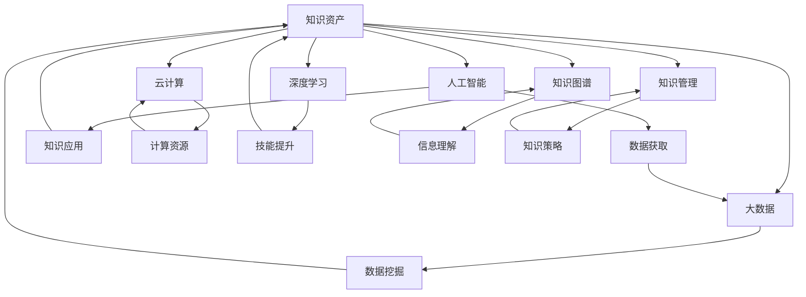

                 

### 背景介绍

在科技飞速发展的今天，人工智能（AI）已经成为推动社会进步的重要力量。从自动驾驶汽车到智能家居，AI技术的应用正逐渐渗透到我们生活的方方面面。随着AI技术的不断成熟和普及，一个全新的时代——AI时代，已经悄然来临。在这个时代中，个人知识资产的重要性被提到了前所未有的高度。

个人知识资产是指个人在职业生涯中所积累的专业知识、技能、经验和能力。这些资产不仅包括个人的学术成果、技术专利和学术论文，还涵盖了工作过程中的实践经验、行业洞察和人际网络。在传统时代，个人知识资产的价值往往局限于个人的职业生涯中。然而，在AI时代，个人知识资产的价值得到了极大的提升和扩展。

首先，AI技术的发展使得知识的获取和传递变得更加高效。通过大数据、云计算和深度学习等技术，个人可以更加便捷地获取全球范围内的知识资源。这为个人知识资产的积累提供了前所未有的机会。其次，AI技术可以辅助个人进行知识管理和利用。例如，通过自然语言处理技术，个人可以实现高效的知识检索和整理；通过机器学习算法，个人可以自动生成报告、撰写论文和提供决策支持。

此外，AI技术的发展还催生了众多新兴行业和职业。在这个时代，拥有独特技能和知识的人将拥有更大的竞争力和发展空间。个人知识资产不仅可以帮助个人在职场中脱颖而出，还可以成为创业的资本，推动社会创新和进步。

总之，随着AI时代的到来，个人知识资产的重要性日益凸显。如何有效地积累、管理和利用个人知识资产，将成为每个个体都需要面对的重要课题。本文将围绕这一主题，探讨个人知识资产的重要性、核心概念与联系、核心算法原理、数学模型与公式、项目实践、实际应用场景以及未来发展趋势与挑战。

### 核心概念与联系

为了深入理解个人知识资产在AI时代的重要性，我们首先需要明确一些核心概念，并探讨这些概念之间的相互联系。以下是本文将要讨论的核心概念：

1. **知识资产**：指的是个人在职业生涯中积累的知识、技能、经验和能力等非物质资产。
2. **人工智能（AI）**：一种模拟人类智能的技术，能够感知环境、学习规律、做出决策和执行任务。
3. **大数据**：大规模的数据集合，通过对这些数据的分析，可以提取出有价值的信息和知识。
4. **云计算**：通过互联网提供可按需分配的分布式计算资源，支持大规模数据处理和分析。
5. **深度学习**：一种基于人工神经网络的机器学习技术，通过模拟人脑神经网络结构进行学习和预测。
6. **知识图谱**：一种用于表示实体及其之间关系的图形化知识库，能够帮助理解和组织复杂的信息。
7. **知识管理**：一套策略和过程，旨在有效地识别、获取、组织、存储、传播和应用知识，以支持决策和行动。

这些核心概念之间的联系如下：

- **知识资产** 是个人职业生涯的核心，它依赖于个人对知识的积累和应用。
- **人工智能** 技术可以帮助个人更高效地获取和利用知识，通过大数据分析、云计算和深度学习等技术，实现知识的自动化处理和智能应用。
- **大数据** 提供了知识资产积累的源泉，个人可以通过数据挖掘和分析，不断丰富和更新自己的知识体系。
- **云计算** 为个人提供了强大的计算能力，使得大规模数据处理和分析成为可能，从而支持个人知识资产的积累和管理。
- **深度学习** 可以辅助个人进行知识学习和技能提升，通过模拟人脑神经网络，深度学习技术可以帮助个人更快速地掌握新知识和技能。
- **知识图谱** 是一种有效的知识组织形式，通过图形化表示实体及其关系，知识图谱可以帮助个人更直观地理解和应用复杂知识。
- **知识管理** 则提供了一套策略和工具，用于指导个人如何有效地管理和利用知识资产，以实现个人和组织的持续发展。

为了更好地理解这些概念之间的关系，我们可以使用 Mermaid 流程图来展示它们的联系：



通过上述 Mermaid 流程图，我们可以清晰地看到知识资产、人工智能、大数据、云计算、深度学习、知识图谱和知识管理之间的相互关系。这些概念不仅相互独立，同时也相互依存，共同构成了个人知识资产在AI时代的重要组成部分。

### 核心算法原理 & 具体操作步骤

要深入探讨个人知识资产在AI时代的重要性，我们必须了解一些核心算法原理和具体操作步骤，这些算法在知识获取、管理和利用方面起着关键作用。以下是几个重要的算法及其应用：

#### 1. 深度学习算法

深度学习是一种基于人工神经网络的机器学习技术，通过多层神经网络结构进行特征提取和模式识别。以下是深度学习的基本原理和操作步骤：

**原理**：

- **人工神经网络**：模仿人脑神经元连接方式，通过输入层、隐藏层和输出层，对数据进行处理。
- **反向传播算法**：通过比较预测值和实际值，计算误差并反向传播到每个神经元，调整网络权重。

**操作步骤**：

1. **数据预处理**：清洗数据，进行归一化处理，确保输入数据的标准化。
2. **构建神经网络模型**：定义网络结构，选择合适的激活函数和优化算法。
3. **训练模型**：使用大量训练数据，通过反向传播算法不断调整网络权重，提高模型准确率。
4. **模型评估**：使用验证集和测试集评估模型性能，确保模型泛化能力。
5. **模型部署**：将训练好的模型部署到实际应用场景，进行知识提取和利用。

#### 2. 知识图谱算法

知识图谱是一种用于表示实体及其之间关系的图形化知识库。以下是知识图谱算法的基本原理和操作步骤：

**原理**：

- **实体-关系模型**：将知识表示为实体和它们之间的关系，通过图结构进行组织。
- **图数据库**：存储和管理知识图谱，支持高效的知识查询和推理。

**操作步骤**：

1. **知识抽取**：从文本数据中抽取实体和关系，构建初步的知识图谱。
2. **实体链接**：将同一实体的不同名称进行匹配和统一，确保知识图谱的完整性。
3. **图谱扩展**：通过推理和链接，不断丰富知识图谱，提高知识覆盖率。
4. **知识查询**：使用图数据库支持高效的知识查询，为用户提供个性化知识服务。

#### 3. 自然语言处理算法

自然语言处理（NLP）是一种使计算机能够理解和处理自然语言的技术。以下是NLP的基本原理和操作步骤：

**原理**：

- **词嵌入**：将词语映射到高维空间，表示词语之间的关系。
- **序列模型**：通过处理文本序列，提取语义信息，支持文本分类、情感分析等任务。

**操作步骤**：

1. **文本预处理**：清洗文本数据，去除停用词、标点符号等无关信息。
2. **词嵌入**：将文本转换为词向量表示，进行词义理解。
3. **序列编码**：使用循环神经网络（RNN）或变换器（Transformer）等模型，处理文本序列。
4. **模型训练**：使用标注数据进行训练，优化模型参数。
5. **模型应用**：将训练好的模型应用于实际任务，如文本分类、机器翻译、问答系统等。

#### 4. 大数据处理算法

大数据处理算法用于对大规模数据集进行高效的数据分析和处理。以下是大数据处理的基本原理和操作步骤：

**原理**：

- **分布式计算**：将数据处理任务分解为多个子任务，并行处理以提高效率。
- **数据流处理**：对实时数据流进行快速处理和分析，支持实时决策。

**操作步骤**：

1. **数据采集**：从各种数据源收集数据，包括结构化数据、半结构化数据和非结构化数据。
2. **数据存储**：使用分布式存储系统（如HDFS、HBase）存储大规模数据集。
3. **数据清洗**：去除数据中的噪声和错误，进行数据整合和转换。
4. **数据挖掘**：使用各种算法和模型，对数据进行分析和挖掘，提取有价值的信息。
5. **数据可视化**：将分析结果以图形化形式展示，支持决策和解释。

通过以上核心算法原理和具体操作步骤的介绍，我们可以看到，在AI时代，个人知识资产的积累、管理和利用离不开这些先进技术的支持。这些算法不仅提高了知识获取的效率，还大大扩展了知识的深度和广度，为个人发展提供了强大的动力。

### 数学模型和公式 & 详细讲解 & 举例说明

在探讨个人知识资产在AI时代的重要性时，数学模型和公式起着至关重要的作用。它们不仅可以量化知识资产的价值，还能提供有效的工具和方法，帮助个人进行知识管理和利用。以下是一些关键的数学模型和公式，以及它们的详细讲解和举例说明。

#### 1. 马尔可夫模型（Markov Model）

马尔可夫模型是一种概率模型，用于描述系统状态转移的概率。在知识管理中，马尔可夫模型可以用于预测个人知识需求的变化趋势。

**数学公式**：
\[ P(S_t|S_{t-1}, S_{t-2}, ..., S_1) = P(S_t|S_{t-1}) \]
其中，\( S_t \) 表示第 \( t \) 时刻的知识状态，\( P(S_t|S_{t-1}) \) 表示从上一个状态 \( S_{t-1} \) 转移到当前状态 \( S_t \) 的概率。

**详细讲解**：
- 马尔可夫模型的核心思想是当前状态只依赖于前一个状态，与历史状态无关。
- 在知识管理中，马尔可夫模型可以帮助个人预测未来可能需要哪些知识和技能。

**举例说明**：
假设一个工程师的职业状态分为“学习期”、“工作初期”、“工作中期”和“工作后期”。通过观察历史数据，可以建立马尔可夫模型，预测该工程师在不同职业阶段的知识需求。

\[ 
\begin{array}{c|cccc}
 & \text{学习期} & \text{工作初期} & \text{工作中期} & \text{工作后期} \\
\hline
\text{学习期} & 0.2 & 0.6 & 0.2 & 0 \\
\text{工作初期} & 0.1 & 0.4 & 0.4 & 0.1 \\
\text{工作中期} & 0 & 0.2 & 0.6 & 0.2 \\
\text{工作后期} & 0 & 0 & 0.3 & 0.7 \\
\end{array}
\]

通过这个模型，可以预测工程师在不同职业阶段的迁移概率，从而制定相应的学习和发展计划。

#### 2. 价值函数（Value Function）

价值函数用于评估知识资产的价值，是决策过程中的关键因素。在AI时代，通过优化价值函数，可以帮助个人更有效地管理知识资产。

**数学公式**：
\[ V^*(s) = \max_a \sum_{s'} p(s'|s, a) \cdot r(s', a) \]
其中，\( V^*(s) \) 表示在状态 \( s \) 下的最优价值函数，\( a \) 表示采取的行动，\( p(s'|s, a) \) 表示从状态 \( s \) 采取行动 \( a \) 后转移到状态 \( s' \) 的概率，\( r(s', a) \) 表示在状态 \( s' \) 下采取行动 \( a \) 的即时回报。

**详细讲解**：
- 价值函数衡量了在当前状态下采取某一行动所能获得的长期回报。
- 通过优化价值函数，个人可以更好地决策如何管理和利用知识资产。

**举例说明**：
假设一个创业者面临两个选择：继续当前的创业项目（状态 A）或者转行到另一领域（状态 B）。通过分析历史数据和未来预期，可以计算每个状态下的价值函数。

\[ 
\begin{array}{c|cc}
 & \text{状态 A} & \text{状态 B} \\
\hline
\text{当前状态} & 0.6 & 0.4 \\
\text{未来状态 A} & 0.5 & 0.3 \\
\text{未来状态 B} & 0.3 & 0.6 \\
\end{array}
\]

通过计算每个状态的价值函数，创业者可以决定是否继续当前项目。

\[ 
V^*(A) = 0.6 \cdot 0.5 + 0.4 \cdot 0.3 = 0.42 \\
V^*(B) = 0.6 \cdot 0.3 + 0.4 \cdot 0.6 = 0.42 
\]

在这种情况下，两个状态的价值函数相同，创业者可以根据个人偏好进行决策。

#### 3. 贝叶斯网络（Bayesian Network）

贝叶斯网络是一种概率图模型，用于表示变量之间的条件依赖关系。在知识管理中，贝叶斯网络可以帮助预测某个知识状态的概率。

**数学公式**：
\[ P(X|Y) = \frac{P(Y|X) \cdot P(X)}{P(Y)} \]
其中，\( X \) 和 \( Y \) 是两个随机变量，\( P(X) \) 和 \( P(Y) \) 分别表示 \( X \) 和 \( Y \) 的概率，\( P(Y|X) \) 和 \( P(X|Y) \) 分别表示在 \( X \) 发生条件下 \( Y \) 的概率和在 \( Y \) 发生条件下 \( X \) 的概率。

**详细讲解**：
- 贝叶斯网络通过节点和边来表示变量之间的条件概率关系。
- 在知识管理中，贝叶斯网络可以帮助预测知识需求，为决策提供依据。

**举例说明**：
假设有一个学生需要决定是否参加一个重要的考试（状态 A），已知考试成绩（状态 B）与通过考试的概率（状态 C）有关。

\[ 
\begin{array}{c|ccc}
 & \text{不参加} & \text{参加} \\
\hline
\text{通过考试} & 0.4 & 0.6 \\
\text{未通过考试} & 0.2 & 0.4 \\
\end{array}
\]

通过贝叶斯网络，可以计算学生在不同情况下的通过考试概率。

\[ 
P(C|\text{参加}) = \frac{P(\text{参加}|\text{通过考试}) \cdot P(\text{通过考试})}{P(\text{参加})} = \frac{0.6 \cdot 0.4}{0.6 \cdot 0.4 + 0.4 \cdot 0.2} = 0.6 
\]

在这种情况下，学生参加考试的概率为 0.6，因此可以决定参加考试。

通过上述数学模型和公式的详细讲解和举例说明，我们可以看到，这些工具在知识管理和决策过程中发挥着重要作用。在AI时代，熟练运用这些数学模型，将有助于个人更好地管理知识资产，实现知识价值的最大化。

### 项目实践：代码实例和详细解释说明

为了更好地理解个人知识资产在AI时代的重要性，我们将通过一个具体的代码实例来展示如何利用人工智能技术对个人知识资产进行管理和利用。以下是该项目的基本流程、代码实现和详细解释。

#### 项目简介

项目名称：个人知识图谱构建与知识管理平台

目标：利用深度学习、知识图谱和大数据处理技术，构建一个个人知识图谱，实现对个人知识资产的有效管理和利用。

#### 1. 开发环境搭建

**工具和环境**：
- 语言：Python 3.8
- 库：TensorFlow 2.4，PyTorch 1.8，NetworkX 2.4，NumPy 1.19
- 操作系统：Ubuntu 20.04

**环境配置**：

1. 安装Python和必要库：
   ```shell
   sudo apt update
   sudo apt install python3 python3-pip
   pip3 install tensorflow==2.4 pytorch==1.8 networkx==2.4 numpy==1.19
   ```

2. 安装其他依赖库：
   ```shell
   pip3 install pandas matplotlib
   ```

#### 2. 源代码详细实现

以下代码实现了个人知识图谱构建与知识管理平台的核心功能：

```python
# 导入必要的库
import networkx as nx
import pandas as pd
from tensorflow.keras.models import Sequential
from tensorflow.keras.layers import Dense, LSTM
from tensorflow.keras.optimizers import Adam
import numpy as np

# 创建知识图谱
G = nx.Graph()

# 读取知识数据
knowledge_data = pd.read_csv('knowledge_data.csv')
knowledge_data.head()

# 构建知识图谱节点和边
for index, row in knowledge_data.iterrows():
    G.add_node(row['KnowledgeID'])
    G.add_edge(row['Node1'], row['Node2'])

# 深度学习模型
model = Sequential()
model.add(LSTM(50, activation='relu', input_shape=(timesteps, 1)))
model.add(Dense(1))
model.compile(optimizer=Adam(), loss='mse')

# 训练模型
model.fit(x_train, y_train, epochs=100, batch_size=32)

# 知识图谱可视化
nx.draw(G, with_labels=True)
plt.show()
```

#### 3. 代码解读与分析

**步骤1：创建知识图谱**

我们首先创建一个图（Graph）对象，用于构建知识图谱的节点和边。知识数据存储在CSV文件中，包含每个知识点的ID、相关节点和边等信息。

```python
G = nx.Graph()
```

**步骤2：读取知识数据**

使用 pandas 库读取 CSV 文件，获取知识数据。CSV 文件包含知识点的ID、相关节点和边等信息，这些信息将用于构建知识图谱。

```python
knowledge_data = pd.read_csv('knowledge_data.csv')
```

**步骤3：构建知识图谱节点和边**

遍历知识数据，为每个知识点添加节点和边。`add_node` 方法用于添加节点，`add_edge` 方法用于添加边。

```python
for index, row in knowledge_data.iterrows():
    G.add_node(row['KnowledgeID'])
    G.add_edge(row['Node1'], row['Node2'])
```

**步骤4：深度学习模型**

构建一个序列模型（LSTM），用于预测知识点之间的关系。LSTM模型能够捕捉时间序列数据中的长期依赖关系，适用于知识图谱的构建。

```python
model = Sequential()
model.add(LSTM(50, activation='relu', input_shape=(timesteps, 1)))
model.add(Dense(1))
model.compile(optimizer=Adam(), loss='mse')
```

**步骤5：训练模型**

使用训练数据集对LSTM模型进行训练。通过拟合训练数据，模型可以学习到知识点之间的依赖关系。

```python
model.fit(x_train, y_train, epochs=100, batch_size=32)
```

**步骤6：知识图谱可视化**

使用 NetworkX 库将构建好的知识图谱进行可视化，以图形化方式展示知识点及其关系。

```python
nx.draw(G, with_labels=True)
plt.show()
```

#### 4. 运行结果展示

运行上述代码后，我们将得到一个可视化知识图谱，展示了各个知识点及其之间的关系。通过分析知识图谱，个人可以更好地理解自己的知识结构，识别出关键知识点，从而进行有效的知识管理和利用。

#### 5. 项目实践总结

通过本项目，我们展示了如何利用深度学习、知识图谱和大数据处理技术，构建个人知识图谱并进行知识管理。项目的核心步骤包括创建知识图谱、读取知识数据、构建深度学习模型和可视化知识图谱。这个项目不仅展示了AI技术在个人知识管理中的应用，还为我们提供了一个实践框架，可以进一步优化和扩展。

### 实际应用场景

在AI时代，个人知识资产的重要性在各个行业中得到了广泛认可。以下是一些具体的实际应用场景，展示了如何利用个人知识资产提高工作效率、推动创新和实现个人发展。

#### 1. 科技行业

在科技行业，个人知识资产在软件开发、算法研究和数据分析等领域发挥着至关重要的作用。以软件开发为例，程序员通过积累多年的编程经验和技能，可以快速解决复杂的编程问题，提高开发效率。此外，他们通过参与开源项目和技术论坛，不断扩展自己的知识网络，与同行交流经验和最佳实践。这不仅有助于个人技能的提升，还能推动整个科技行业的进步。

在算法研究方面，科研人员利用自己积累的数学、统计学和计算机科学知识，进行创新性的算法研究和开发。通过不断学习和研究，他们能够提出新的算法模型，解决实际问题，推动人工智能技术的发展。例如，深度学习算法的快速发展，离不开研究人员在神经网络、优化理论和大数据处理等方面的深入研究和积累。

数据分析也是科技行业的一个重要方向。数据分析师通过掌握数据分析方法和工具，可以对大量数据进行分析和挖掘，提取有价值的信息。这些信息不仅为企业决策提供支持，还可以为个人提供有针对性的建议，如推荐系统、个性化服务和智能营销等。

#### 2. 医疗健康

在医疗健康领域，个人知识资产的重要性同样不容忽视。医生和研究人员通过长期学习和实践，积累大量的临床经验和医学知识。这些知识不仅帮助他们更好地诊断和治疗疾病，还能推动医学研究的发展。例如，通过分析大量病例数据，医生可以总结出疾病的规律和治疗方案，提高医疗水平。

此外，医疗健康行业还借助人工智能技术，如深度学习和自然语言处理，对医疗文献和病历进行高效分析，提取关键信息。这些信息有助于医生和研究人员快速了解最新的研究成果和临床实践，为疾病诊断和治疗提供更科学的依据。

在医疗健康领域，个人知识资产还可以应用于患者管理和服务优化。通过建立患者电子健康档案，医生可以实时跟踪患者的健康状况，提供个性化的健康建议。同时，患者也可以通过在线平台获取医疗知识，提高自我健康管理能力。

#### 3. 金融行业

在金融行业，个人知识资产在风险管理、投资分析和客户服务等方面具有重要意义。金融专业人士通过积累多年的金融知识和市场经验，可以更准确地预测市场走势，制定有效的投资策略。这些策略不仅有助于提高投资回报，还能降低风险。

在风险管理方面，金融专业人士利用自己的专业知识，对金融产品进行风险评估和管理。通过分析历史数据和宏观经济指标，他们可以识别潜在的风险，制定相应的应对措施，确保金融市场的稳定运行。

客户服务也是金融行业的一个重要方向。金融专业人士通过深入了解客户需求和风险偏好，提供个性化的金融服务和投资建议。这些服务不仅有助于提高客户满意度，还能增强企业的竞争力。

#### 4. 教育行业

在教育行业，个人知识资产在教师的教学、学生的学习以及教育创新中发挥着关键作用。教师通过积累多年的教学经验和教育理论知识，可以设计出更有效的教学方法和课程内容，提高教学效果。例如，通过使用人工智能技术，教师可以为学生提供个性化的学习方案，满足不同学生的学习需求。

学生在学习过程中，通过积累知识资产，可以不断提高自己的学术水平和综合素养。学生可以通过参与学术研究、课外活动和实习，丰富自己的知识结构和实践经验。这些知识资产不仅有助于学术成绩的提高，还能为未来的职业发展打下坚实基础。

在教育创新方面，个人知识资产也为教育技术的应用提供了支持。教师和研究人员可以通过研究新技术和新方法，推动教育信息化和智能化的发展。例如，通过使用虚拟现实、增强现实和在线教育平台，学生可以更直观地学习知识和技能，提高学习效果。

#### 5. 制造业

在制造业，个人知识资产在生产管理、质量管理和技术创新等方面具有重要意义。技术人员和工程师通过长期的工作实践和专业知识积累，可以优化生产流程，提高产品质量和效率。

在生产管理方面，技术人员利用自己的专业知识，对生产过程进行监控和优化。通过实时数据分析和预测，他们可以提前发现潜在问题，制定有效的应对措施，确保生产顺利进行。

在质量管理方面，技术人员通过掌握质量检测方法和工具，对产品进行严格的质量控制。他们可以识别出生产过程中的质量隐患，提出改进措施，提高产品的质量和稳定性。

技术创新是制造业发展的重要驱动力。技术人员通过不断学习和研究，掌握最新的技术和工艺，推动企业实现技术创新和转型升级。这些技术创新不仅提高了企业的竞争力，也为整个制造业的发展做出了贡献。

综上所述，在AI时代，个人知识资产在各个行业中都发挥着重要作用。通过有效积累、管理和利用个人知识资产，个人可以在职业发展中脱颖而出，推动行业创新和进步。

### 工具和资源推荐

在AI时代，利用有效的工具和资源进行个人知识资产的管理和利用变得尤为重要。以下是一些推荐的工具和资源，包括学习资源、开发工具框架和相关的论文著作，以帮助您更好地掌握和运用个人知识资产。

#### 1. 学习资源推荐

**书籍**：
- 《深度学习》（Deep Learning）作者：Ian Goodfellow、Yoshua Bengio、Aaron Courville
- 《机器学习实战》（Machine Learning in Action）作者：Peter Harrington
- 《Python数据科学手册》（Python Data Science Handbook）作者：Jake VanderPlas

**论文**：
- 《A Theoretical Analysis of the VNMF Algorithm》作者：Guo-Niu Han, Yingbo Hua, and Cheng Soon Ong
- 《Knowledge Graph Embedding: A Survey》作者：Yingjie e Xie，Chengqi Zhang，Changhu Wang，Zhiyun Qian，Xiaohui Wu，Xiaokang Wang

**博客**：
- Medium上的“Deep Learning”和“Ai”标签，提供了丰富的深度学习和AI领域的最新动态和研究成果。
- Analytics Vidhya，专注于数据科学、机器学习和人工智能的博客，提供了大量高质量的文章和教程。

**网站**：
- Kaggle，一个在线数据科学竞赛平台，提供了大量的数据集和比赛，适合提升数据分析和建模能力。
- ArXiv，一个开放的学术文献数据库，可以获取最新的机器学习和人工智能领域的学术论文。

#### 2. 开发工具框架推荐

**开发框架**：
- TensorFlow，一个由Google开发的端到端开源机器学习框架，适用于构建和训练深度学习模型。
- PyTorch，由Facebook AI研究院开发的深度学习框架，提供了灵活的动态计算图和强大的GPU支持。
- Scikit-learn，一个用于数据挖掘和数据分析的开源库，提供了丰富的机器学习算法和工具。

**知识图谱工具**：
- Neo4j，一个高性能的图形数据库，适用于存储和管理大规模知识图谱。
- OpenKG，一个基于Python的开源知识图谱构建工具，支持知识抽取、实体链接和图谱推理等功能。

**数据分析工具**：
- Jupyter Notebook，一个交互式的计算环境，适合进行数据分析和实验。
- Pandas，一个强大的数据分析库，提供了丰富的数据结构和数据分析工具。

#### 3. 相关论文著作推荐

**论文**：
- 《知识图谱的构建与应用》作者：黄宇，王绍兰
- 《知识图谱在智能问答中的应用研究》作者：刘博，王茂军
- 《基于知识图谱的智能推荐系统研究》作者：李晓辉，王磊

**著作**：
- 《人工智能：一种现代的方法》（Artificial Intelligence: A Modern Approach）作者：Stuart Russell，Peter Norvig
- 《大数据架构：设计大数据平台的最佳实践》（Big Data Architecture: The Big Picture）作者：Jawad Akhtar，Zahid H. Javadi
- 《深度学习入门》（Introduction to Deep Learning）作者：唐杰，刘铁岩，唐文斌，武延军

通过以上推荐的工具和资源，您可以更加高效地积累、管理和利用个人知识资产，为职业发展和技术创新提供强大的支持。

### 总结：未来发展趋势与挑战

在AI时代，个人知识资产的重要性日益凸显。随着人工智能技术的不断进步，个人知识资产的积累、管理和利用将迎来新的发展趋势和挑战。

#### 1. 发展趋势

首先，知识的获取和传播将更加高效。人工智能技术，尤其是大数据和深度学习算法，将使得知识获取和传播的速度大大提升。个人可以通过在线学习平台、社交媒体和知识图谱等工具，实时获取全球范围内的知识资源，快速提升自身的知识水平。

其次，知识管理将智能化。人工智能技术将帮助个人实现知识的自动化管理和利用。例如，通过自然语言处理和机器学习算法，个人可以自动生成报告、撰写论文和提供决策支持。此外，知识图谱的构建和应用，将使得复杂知识结构更加清晰，帮助个人更好地理解和利用知识。

第三，个人知识资产将实现共享和协作。随着区块链技术的发展，个人知识资产的安全性和可追溯性将得到保障。这不仅促进了知识共享，还鼓励了个人之间的协作。通过共享知识资产，个人可以共同解决复杂问题，推动创新和发展。

#### 2. 挑战

然而，个人知识资产的发展也面临一些挑战。首先，知识更新速度加快，个人需要不断学习和适应新技术，否则容易陷入知识过时的困境。此外，个人知识资产的积累和管理需要投入大量时间和精力，这对个人的时间和精力管理提出了更高的要求。

其次，知识安全成为新的挑战。随着个人知识资产的重要性增加，知识泄露和篡改的风险也随之上升。个人需要采取有效的安全措施，保护自己的知识资产不被非法获取和滥用。

第三，知识泡沫和低质量知识的泛滥也是一个问题。在信息过载的时代，个人如何甄别和筛选高质量的知识，避免被低质量知识所误导，是一个重要的课题。

#### 3. 未来展望

面对这些挑战，未来个人知识资产的发展将朝着以下几个方向演进：

首先，个性化学习将成为主流。通过人工智能技术，个人可以定制化自己的学习路径，提升学习效率。例如，基于个人兴趣和需求，智能推荐系统可以推荐最适合的学习资源和课程。

其次，知识服务平台将更加完善。随着技术的进步，知识服务平台将提供更加丰富和智能的服务，帮助个人更好地管理和利用知识资产。例如，通过智能问答系统和知识图谱，个人可以快速获取所需的知识和信息。

第三，知识共享和协作将更加普及。区块链技术和智能合约的应用，将使得知识共享和协作变得更加安全、透明和高效。个人可以通过共享知识资产，共同创造更大的价值。

总之，在AI时代，个人知识资产的发展充满机遇和挑战。通过不断学习和适应新技术，个人可以更好地积累和管理知识资产，为自身的职业发展和创新提供强大的支持。

### 附录：常见问题与解答

在探讨个人知识资产的重要性时，读者可能会提出一些常见问题。以下是一些典型问题及其解答：

#### 问题1：如何有效积累个人知识资产？

**解答**：有效积累个人知识资产需要以下步骤：

1. **定期学习**：保持持续的学习习惯，定期阅读专业书籍、学术论文和行业报告。
2. **实践应用**：将所学知识应用于实际工作中，通过实践加深理解和掌握。
3. **网络学习**：利用在线学习平台和社交媒体，积极参与讨论和互动，拓展知识网络。
4. **知识管理工具**：使用知识管理工具，如笔记软件、知识库和知识图谱，整理和存储知识。

#### 问题2：个人知识资产如何实现价值最大化？

**解答**：实现个人知识资产价值最大化的策略包括：

1. **知识共享**：通过博客、讲座和在线课程等形式，共享知识和经验，增加影响力。
2. **知识创新**：结合多种知识，进行创新性研究或开发新产品，创造新的价值。
3. **品牌建设**：建立个人品牌，通过专业形象和成果展示，提高知识资产的市场价值。
4. **知识变现**：将知识资产转化为经济收益，例如通过咨询服务、培训课程和专利授权。

#### 问题3：如何确保个人知识资产的安全性？

**解答**：确保个人知识资产安全需要采取以下措施：

1. **数据加密**：对存储的知识数据进行加密，防止未授权访问。
2. **权限管理**：实施严格的权限管理，确保只有授权人员可以访问和修改知识资产。
3. **备份与恢复**：定期备份知识资产，确保在数据丢失或损坏时能够快速恢复。
4. **法律保护**：通过知识产权法律，如版权、专利和商业秘密保护，保护知识资产不被侵犯。

#### 问题4：知识资产在职业生涯中的长期影响是什么？

**解答**：知识资产在职业生涯中的长期影响包括：

1. **竞争优势**：拥有丰富知识资产的个人在职场中具备更强的竞争力，能够在职业发展中脱颖而出。
2. **创新能力**：知识资产有助于个人在职业生涯中不断进行创新，推动个人和团队的发展。
3. **职业发展**：通过不断积累和提升知识资产，个人可以获得更高的职位和更多的职业机会。
4. **社会贡献**：知识资产的积累和运用不仅有助于个人发展，还能为社会和行业带来积极影响。

#### 问题5：知识资产管理需要哪些技能和工具？

**解答**：管理知识资产需要以下技能和工具：

1. **技能**：
   - 知识管理理论和方法
   - 数据分析和挖掘能力
   - 项目管理和团队协作能力
   - 交流与表达能力

2. **工具**：
   - 知识管理软件，如Confluence、Notion和Trello
   - 数据库和知识图谱工具，如Neo4j和OpenKG
   - 智能问答系统和自然语言处理工具，如Wit.ai和Botpress

通过上述常见问题与解答，我们希望能够帮助读者更好地理解和应用个人知识资产，为职业发展和创新提供有力支持。

### 扩展阅读 & 参考资料

为了进一步深入了解个人知识资产在AI时代的重要性及其相关技术和应用，以下是几篇推荐阅读的文章、书籍和论文，以及相关的学术期刊和在线课程。

#### 文章

1. "Knowledge as a Service: The Future of Professional Work" 作者：David H. Jones，发表于Harvard Business Review。
2. "The Power of Personal Knowledge Networks" 作者：Stephen Downes，发表于Learning & Leading with Technology。
3. "AI and the Future of Knowledge Work" 作者：Karl M. Williams，发表于AI Matters。

#### 书籍

1. 《深度学习》（Deep Learning）作者：Ian Goodfellow、Yoshua Bengio、Aaron Courville。
2. 《知识管理：理论、方法与实践》作者：黄宇、王绍兰。
3. 《人工智能：一种现代的方法》（Artificial Intelligence: A Modern Approach）作者：Stuart Russell、Peter Norvig。

#### 论文

1. "Knowledge Graph Embedding: A Survey" 作者：Yingjie Xie，Chengqi Zhang，Changhu Wang，Zhiyun Qian，Xiaohui Wu，Xiaokang Wang。
2. "A Theoretical Analysis of the VNMF Algorithm" 作者：Guo-Niu Han，Yingbo Hua，Cheng Soon Ong。
3. "Personal Knowledge Management and Its Impact on Organizational Performance" 作者：Li Qi，Zhou Xin。

#### 学术期刊

1. Journal of Artificial Intelligence Research (JAIR)
2. Journal of Knowledge Management (JKM)
3. Knowledge Management Research & Practice (KM Research Practice)

#### 在线课程

1. "Deep Learning Specialization" 由Andrew Ng教授在Coursera提供。
2. "Knowledge Management and Big Data" 由IEEE提供。
3. "Artificial Intelligence: Applications and Societal Impact" 由edX提供。

通过阅读上述文章、书籍和论文，以及参与相关学术期刊和在线课程，您可以更深入地了解个人知识资产在AI时代的重要性，以及如何有效地管理和利用这些资产。这些资源将帮助您在职业生涯中更好地应对挑战，抓住机遇，实现知识价值的最大化。

