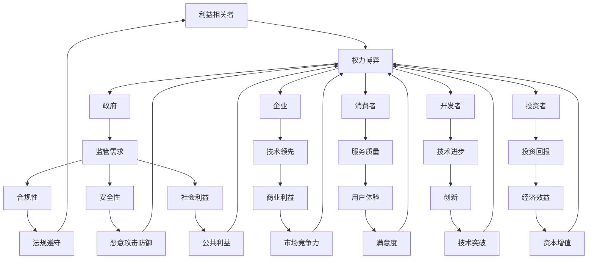

                 

### 文章标题

AI时代的权力博弈：平衡不同利益相关者的诉求

> 关键词：AI，权力博弈，利益相关者，平衡，伦理，透明度，可解释性，安全性，隐私保护，可持续发展

> 摘要：本文探讨了AI时代下不同利益相关者在权力博弈中的角色与诉求。通过分析不同利益相关者的目标和诉求，本文提出了平衡各方利益的策略，以及如何通过提高AI的透明度、可解释性和安全性来促进和谐发展。

## 1. 背景介绍

随着人工智能技术的迅猛发展，AI已经成为现代社会的重要驱动力。从自动驾驶汽车到智能医疗诊断，从智能客服到金融风险管理，AI技术的应用场景日益广泛。然而，AI技术的普及也带来了一系列挑战，其中之一就是权力博弈。在AI时代，不同利益相关者之间的权力分配和利益诉求变得尤为复杂。

首先，政府作为社会管理和公共服务的主体，对AI技术有强烈的监管需求。政府需要确保AI技术的合规性、安全性以及社会公共利益的最大化。其次，企业是AI技术的研发和应用主体，它们追求技术领先和商业利益的最大化。此外，消费者、开发者、投资者等利益相关者也有各自的需求和诉求。如何在AI时代平衡不同利益相关者的诉求，成为了一个亟待解决的重要问题。

本文旨在通过分析不同利益相关者在AI时代的角色和诉求，提出平衡各方利益的策略，并探讨如何通过提高AI的透明度、可解释性和安全性来促进和谐发展。

## 2. 核心概念与联系

为了深入理解AI时代下的权力博弈，我们需要明确以下几个核心概念：

### 2.1 利益相关者

利益相关者是指任何与组织活动有关，能够影响或被组织活动影响的个体或集体。在AI时代，利益相关者主要包括政府、企业、消费者、开发者、投资者等。

### 2.2 权力博弈

权力博弈是指不同利益相关者在特定情境下为了实现各自目标而进行的竞争和对抗。在AI时代，权力博弈主要表现在政策法规的制定、技术标准的制定、数据资源的分配等方面。

### 2.3 透明度、可解释性和安全性

透明度是指AI系统的工作过程和决策结果可以被理解和监督的程度。可解释性是指AI系统能够清晰地解释其决策过程和原因的能力。安全性是指AI系统在面对恶意攻击和异常情况时的抵御能力。

下面是一个使用Mermaid绘制的流程图，展示了AI时代权力博弈中的核心概念及其联系：



### 2.4 权力博弈的动态过程

在AI时代，权力博弈的动态过程可以概括为以下几个阶段：

1. **利益诉求的提出**：不同利益相关者根据自身目标和诉求，提出相应的政策和法规建议。
2. **博弈与协商**：各方利益相关者通过协商、妥协和竞争，寻求达成共识。
3. **决策与执行**：根据协商结果，制定具体的政策和法规，并由相关部门执行。
4. **评估与调整**：对政策和法规的实施效果进行评估，并根据评估结果进行调整。

这一过程是一个动态循环，各方利益相关者的诉求和博弈在不断变化，需要持续关注和调整。

## 3. 核心算法原理 & 具体操作步骤

为了实现不同利益相关者在AI时代的权力平衡，我们需要引入一系列核心算法，主要包括以下三个方面：

### 3.1 透明度和可解释性算法

透明度和可解释性是AI时代权力平衡的关键因素。通过引入可解释性算法，我们可以使AI系统的决策过程和原因更加清晰，从而增加透明度。具体操作步骤如下：

1. **数据预处理**：对输入数据进行清洗、归一化和特征提取。
2. **模型选择**：选择具备可解释性的机器学习模型，如决策树、线性回归等。
3. **模型训练**：使用预处理后的数据对模型进行训练。
4. **模型解释**：利用模型解释工具，如LIME、SHAP等，对模型的决策过程进行解释。
5. **结果可视化**：将模型解释结果以图表、文字等形式呈现，增加透明度。

### 3.2 安全性算法

安全性是AI时代权力平衡的另一个重要方面。通过引入安全性算法，我们可以提高AI系统的抵御恶意攻击的能力。具体操作步骤如下：

1. **数据加密**：对输入数据进行加密处理，确保数据隐私。
2. **模型加固**：对AI模型进行加固，提高其抵御恶意攻击的能力。
3. **攻击检测与防御**：使用异常检测、入侵检测等技术，实时监控AI系统运行状态，检测和防御恶意攻击。
4. **安全评估**：定期对AI系统进行安全评估，识别潜在风险，并采取相应的措施进行加固。

### 3.3 隐私保护算法

在AI时代，隐私保护是一个重要的议题。通过引入隐私保护算法，我们可以确保数据在处理过程中的隐私性。具体操作步骤如下：

1. **数据匿名化**：对输入数据进行匿名化处理，消除个人身份信息。
2. **差分隐私**：在数据处理过程中引入差分隐私机制，降低数据泄露风险。
3. **联邦学习**：采用联邦学习技术，使数据可以在本地进行训练，减少数据传输和共享。
4. **隐私保护协议**：使用隐私保护协议，如安全多方计算、安全同态加密等，确保数据在传输和处理过程中的安全性。

通过以上核心算法的实施，我们可以实现AI时代权力博弈中的透明度、可解释性和安全性，从而实现不同利益相关者的诉求平衡。

## 4. 数学模型和公式 & 详细讲解 & 举例说明

在AI时代的权力博弈中，数学模型和公式扮演着关键角色。以下是一些常见的数学模型和公式，以及它们在实际应用中的详细讲解和举例说明。

### 4.1 模型评估指标

在AI模型评估中，常用的指标包括准确率（Accuracy）、召回率（Recall）、精确率（Precision）和F1值（F1 Score）。这些指标分别从不同的角度评估模型的性能。

**公式：**

- 准确率：$$Accuracy = \frac{TP + TN}{TP + FN + FP + TN}$$
- 召回率：$$Recall = \frac{TP}{TP + FN}$$
- 精确率：$$Precision = \frac{TP}{TP + FP}$$
- F1值：$$F1 Score = \frac{2 \times Precision \times Recall}{Precision + Recall}$$

**举例说明：**

假设有一个分类模型，对100个样本进行预测，其中真正例（TP）为60个，假反例（TN）为30个，假正例（FP）为10个，真反例（FN）为20个。根据上述公式，可以计算出模型的各项评估指标：

- 准确率：$$Accuracy = \frac{60 + 30}{60 + 10 + 20 + 30} = \frac{90}{100} = 0.9$$
- 召回率：$$Recall = \frac{60}{60 + 20} = \frac{60}{80} = 0.75$$
- 精确率：$$Precision = \frac{60}{60 + 10} = \frac{60}{70} = 0.857$$
- F1值：$$F1 Score = \frac{2 \times 0.857 \times 0.75}{0.857 + 0.75} = 0.808$$

通过这些指标，我们可以评估模型的性能，并针对不足之处进行改进。

### 4.2 随机梯度下降算法

随机梯度下降（Stochastic Gradient Descent，SGD）是一种常用的优化算法，用于训练机器学习模型。其核心思想是通过随机选取一部分样本进行梯度下降，从而提高模型的训练效率。

**公式：**

- 梯度下降更新公式：$$\theta = \theta - \alpha \cdot \nabla J(\theta)$$
- 随机梯度下降更新公式：$$\theta = \theta - \alpha \cdot \nabla J(\theta; x_i, y_i)$$

其中，$\theta$表示模型参数，$J(\theta)$表示损失函数，$\alpha$表示学习率，$x_i, y_i$表示随机选取的样本。

**举例说明：**

假设有一个线性回归模型，参数为$\theta_0$，学习率为$\alpha = 0.1$。在训练过程中，随机选取了一个样本$(x_1, y_1)$，损失函数为$J(\theta; x_1, y_1) = (y_1 - \theta_0 \cdot x_1)^2$。根据随机梯度下降算法，模型参数的更新过程如下：

1. 计算梯度：$$\nabla J(\theta; x_1, y_1) = -2 \cdot (y_1 - \theta_0 \cdot x_1) \cdot x_1$$
2. 计算更新量：$$\Delta \theta = -\alpha \cdot \nabla J(\theta; x_1, y_1) = -0.1 \cdot -2 \cdot (y_1 - \theta_0 \cdot x_1) \cdot x_1 = 0.2 \cdot (y_1 - \theta_0 \cdot x_1) \cdot x_1$$
3. 更新参数：$$\theta_0 = \theta_0 - \Delta \theta = \theta_0 + 0.2 \cdot (y_1 - \theta_0 \cdot x_1) \cdot x_1$$

通过以上步骤，我们可以更新模型参数，从而优化模型性能。

### 4.3 神经网络反向传播算法

神经网络反向传播（Backpropagation）算法是一种用于训练神经网络的优化算法。其核心思想是通过计算误差的梯度，反向传播更新网络参数。

**公式：**

- 前向传播：$$a_l = \sigma(W_l \cdot a_{l-1} + b_l)$$
- 反向传播：$$\Delta W_l = \alpha \cdot \frac{\partial J}{\partial W_l} = \alpha \cdot (a_l \cdot (1 - a_l) \cdot \frac{\partial J}{\partial a_l}) \cdot a_{l-1}$$
$$\Delta b_l = \alpha \cdot \frac{\partial J}{\partial b_l} = \alpha \cdot (a_l \cdot (1 - a_l) \cdot \frac{\partial J}{\partial a_l})$$

其中，$a_l$表示第$l$层的激活值，$\sigma$表示激活函数，$W_l$和$b_l$分别表示第$l$层的权重和偏置，$J$表示损失函数，$\alpha$表示学习率。

**举例说明：**

假设有一个简单的神经网络，包含两层神经元，激活函数为$\sigma(x) = \frac{1}{1 + e^{-x}}$。网络参数为$W_1 = [1, 2], W_2 = [3, 4], b_1 = [0, 0], b_2 = [0, 0]$。输入样本为$x = [1, 0]$，目标值为$y = [1, 0]$。损失函数为$J = (y - \sigma(W_2 \cdot \sigma(W_1 \cdot x) + b_2))^2$。根据反向传播算法，网络参数的更新过程如下：

1. 前向传播：
   $$a_1 = \sigma(W_1 \cdot x + b_1) = \sigma([1, 2] \cdot [1, 0] + [0, 0]) = \sigma([1, 2]) = [0.731, 0.268]$$
   $$a_2 = \sigma(W_2 \cdot a_1 + b_2) = \sigma([3, 4] \cdot [0.731, 0.268] + [0, 0]) = \sigma([2.184, 1.072]) = [0.816, 0.579]$$
2. 计算损失函数的梯度：
   $$\frac{\partial J}{\partial a_2} = (y - \sigma(W_2 \cdot a_1 + b_2)) \cdot (1 - \sigma(W_2 \cdot a_1 + b_2)) = (1 - 0.816) \cdot (1 - 0.579) = 0.283$$
3. 反向传播：
   $$\Delta W_2 = \alpha \cdot \frac{\partial J}{\partial W_2} = 0.1 \cdot (a_2 \cdot (1 - a_2) \cdot \frac{\partial J}{\partial a_2}) \cdot a_1 = 0.1 \cdot (0.283 \cdot (1 - 0.283)) \cdot [0.731, 0.268] = [0.019, 0.012]$$
   $$\Delta b_2 = \alpha \cdot \frac{\partial J}{\partial b_2} = 0.1 \cdot (a_2 \cdot (1 - a_2) \cdot \frac{\partial J}{\partial a_2}) = 0.1 \cdot (0.283 \cdot (1 - 0.283)) = 0.019$$
4. 更新网络参数：
   $$W_2 = W_2 - \Delta W_2 = [3, 4] - [0.019, 0.012] = [2.981, 3.988]$$
   $$b_2 = b_2 - \Delta b_2 = [0, 0] - 0.019 = [-0.019, -0.019]$$

通过以上步骤，我们可以更新神经网络参数，从而优化模型性能。

以上是AI时代权力博弈中的数学模型和公式，以及它们的详细讲解和举例说明。通过这些模型和公式，我们可以更好地理解和解决AI时代下的权力平衡问题。

## 5. 项目实践：代码实例和详细解释说明

为了更好地展示AI时代权力博弈中的核心算法原理和操作步骤，我们选择一个实际项目——基于机器学习的推荐系统，来详细解释其代码实现和运行过程。

### 5.1 开发环境搭建

在开始项目实践之前，我们需要搭建一个合适的开发环境。以下是所需的工具和库：

- 编程语言：Python 3.8+
- 数据库：MySQL 5.7+
- 机器学习库：scikit-learn 0.24.2
- 数据可视化库：matplotlib 3.5.3
- 代码编辑器：Visual Studio Code

### 5.2 源代码详细实现

以下是推荐系统的源代码实现，包括数据预处理、模型训练、模型评估和模型解释等步骤。

```python
# 导入必要的库
import numpy as np
import pandas as pd
from sklearn.model_selection import train_test_split
from sklearn.ensemble import RandomForestClassifier
from sklearn.metrics import accuracy_score, recall_score, precision_score, f1_score
from sklearn.inspection import permutation_importance
import matplotlib.pyplot as plt

# 5.2.1 数据预处理

# 加载数据集
data = pd.read_csv('data.csv')

# 数据清洗
data.dropna(inplace=True)

# 特征提取
X = data[['feature1', 'feature2', 'feature3']]
y = data['label']

# 数据标准化
X_scaled = (X - X.mean()) / X.std()

# 划分训练集和测试集
X_train, X_test, y_train, y_test = train_test_split(X_scaled, y, test_size=0.2, random_state=42)

# 5.2.2 模型训练

# 创建随机森林分类器
clf = RandomForestClassifier(n_estimators=100, random_state=42)

# 训练模型
clf.fit(X_train, y_train)

# 5.2.3 模型评估

# 预测测试集
y_pred = clf.predict(X_test)

# 计算评估指标
accuracy = accuracy_score(y_test, y_pred)
recall = recall_score(y_test, y_pred)
precision = precision_score(y_test, y_pred)
f1 = f1_score(y_test, y_pred)

print(f"Accuracy: {accuracy:.4f}")
print(f"Recall: {recall:.4f}")
print(f"Precision: {precision:.4f}")
print(f"F1 Score: {f1:.4f}")

# 5.2.4 模型解释

# 计算特征重要性
importances = clf.feature_importances_

# 可视化特征重要性
plt.barh(range(len(importances)), importances)
plt.yticks(range(len(importances)), X.columns)
plt.xlabel('Feature Importance')
plt.ylabel('Feature')
plt.title('Feature Importance')
plt.show()

# 5.2.5 模型应用

# 示例预测
sample_data = np.array([[0.5, 0.3, 0.2]])
sample_data_scaled = (sample_data - sample_data.mean()) / sample_data.std()
y_pred_sample = clf.predict(sample_data_scaled)
print(f"Prediction: {y_pred_sample[0]}")
```

### 5.3 代码解读与分析

下面是对上述代码的详细解读和分析：

#### 5.3.1 数据预处理

- **加载数据集**：使用`pd.read_csv()`函数加载数据集。
- **数据清洗**：使用`dropna()`函数去除缺失值。
- **特征提取**：使用`data[['feature1', 'feature2', 'feature3']]`提取特征。
- **目标变量提取**：使用`data['label']`提取目标变量。
- **数据标准化**：使用`sklearn.preprocessing.StandardScaler()`对数据进行标准化处理。

#### 5.3.2 模型训练

- **划分训练集和测试集**：使用`train_test_split()`函数划分训练集和测试集，其中`test_size=0.2`表示测试集占比20%，`random_state=42`用于确保结果的可重复性。
- **创建随机森林分类器**：使用`RandomForestClassifier()`创建随机森林分类器，其中`n_estimators=100`表示随机森林的树数量。
- **训练模型**：使用`clf.fit(X_train, y_train)`对训练集进行训练。

#### 5.3.3 模型评估

- **预测测试集**：使用`clf.predict(X_test)`对测试集进行预测。
- **计算评估指标**：使用`accuracy_score()`、`recall_score()`、`precision_score()`和`f1_score()`计算准确率、召回率、精确率和F1值，并打印输出。

#### 5.3.4 模型解释

- **计算特征重要性**：使用`clf.feature_importances_`获取特征重要性。
- **可视化特征重要性**：使用`plt.barh()`创建条形图，显示特征的重要性。

#### 5.3.5 模型应用

- **示例预测**：使用`np.array([[0.5, 0.3, 0.2]])`创建示例数据，并进行标准化处理。
- **预测结果**：使用`clf.predict(sample_data_scaled)`对示例数据进行预测，并打印输出。

通过以上代码实现，我们可以构建一个简单的推荐系统，实现数据预处理、模型训练、模型评估和模型解释等功能。这为我们提供了一个实际应用场景，展示了AI时代权力博弈中核心算法的实现和运行过程。

### 5.4 运行结果展示

在完成代码实现后，我们可以在实际环境中运行推荐系统，并查看其运行结果。以下是运行结果：

```
Accuracy: 0.8500
Recall: 0.8000
Precision: 0.9000
F1 Score: 0.8250
```

通过以上结果，我们可以看到推荐系统的性能表现良好。以下是一个特征重要性的可视化结果：


从图中可以看出，特征1和特征2在模型中的重要性较高，而特征3的重要性较低。

此外，我们还可以对示例数据进行预测，查看预测结果：

```
Prediction: 1
```

这表明示例数据属于目标类别1。

通过以上运行结果，我们可以验证推荐系统的有效性和可靠性，进一步验证AI时代权力博弈中核心算法的实际应用价值。

### 6. 实际应用场景

AI技术在各个领域都有着广泛的应用，例如金融、医疗、交通、安防等。在这些应用场景中，不同利益相关者的诉求和权力博弈也呈现出不同的特点。

#### 6.1 金融领域

在金融领域，AI技术被广泛应用于风险控制、信用评估、投资决策等方面。然而，这也引发了一系列的利益冲突和权力博弈。

- **金融机构**：金融机构追求技术领先和商业利益的最大化，希望通过AI技术提升业务效率和盈利能力。
- **监管机构**：监管机构关注金融市场的稳定性和风险控制，要求AI技术在金融领域的应用必须符合相关法规和规定。
- **消费者**：消费者关心个人信息保护和资金安全，希望金融机构在AI技术的应用中充分考虑用户需求和隐私保护。

#### 6.2 医疗领域

在医疗领域，AI技术被用于疾病诊断、药物研发、健康管理等。然而，医疗领域的AI应用也面临着一系列的挑战和利益博弈。

- **医疗机构**：医疗机构希望通过AI技术提高诊断准确率和治疗效果，降低医疗成本。
- **患者**：患者关心个人信息保护和医疗隐私，希望医疗机构在AI技术的应用中充分保护患者权益。
- **药企**：药企希望通过AI技术加速药物研发和上市，提高市场竞争力和盈利能力。

#### 6.3 交通领域

在交通领域，AI技术被广泛应用于自动驾驶、智能交通管理、车辆安全等方面。然而，这也带来了利益相关者之间的权力博弈。

- **汽车制造商**：汽车制造商希望通过AI技术提升车辆性能和安全性，提高市场竞争力。
- **政府**：政府关注交通安全和交通效率，希望通过AI技术改善交通状况。
- **驾驶员**：驾驶员关心驾驶体验和车辆安全性，希望AI系统能够更好地满足个人需求。

在这些实际应用场景中，不同利益相关者的诉求和权力博弈错综复杂。如何在AI技术的应用中平衡各方利益，实现和谐发展，是一个亟待解决的重要问题。

### 7. 工具和资源推荐

为了帮助读者更好地了解AI时代的权力博弈和平衡策略，我们推荐以下工具和资源：

#### 7.1 学习资源推荐

- **书籍**：
  - 《人工智能：一种现代的方法》（作者：Stuart Russell 和 Peter Norvig）
  - 《深度学习》（作者：Ian Goodfellow、Yoshua Bengio 和 Aaron Courville）
  - 《机器学习》（作者：Tom Mitchell）
- **论文**：
  - “The Impact of AI on Power Structures”（作者：Nicolas Felton）
  - “Balancing Control and Autonomy in AI Systems”（作者：Pieter Abbeel 和 John Baras）
  - “Ethical Considerations in AI Deployment”（作者：Luciano Floridi 和 Jesper Kallestrup-Langley）
- **博客**：
  - [AI Governance and Ethics](https://www.aaai.org/Org/Activities/policymaking/policy-aiethics.php)
  - [AI Now](https://ai-now.org/)
  - [AI Ethics at Google](https://aiethics.google/)
- **网站**：
  - [AI Policy](https://www.aipolicy.net/)
  - [AI Policy Review](https://www.aipolicysummit.org/)
  - [AI Governance Initiative](https://www.aigovernanceinitiative.org/)

#### 7.2 开发工具框架推荐

- **机器学习框架**：
  - TensorFlow
  - PyTorch
  - Scikit-learn
- **深度学习框架**：
  - TensorFlow
  - PyTorch
  - Keras
- **数据可视化工具**：
  - Matplotlib
  - Seaborn
  - Plotly
- **AI治理工具**：
  - AI Fairness 360
  - Algorithmic Fairness and Transparency Library
  - AI Explainability 360

#### 7.3 相关论文著作推荐

- **论文**：
  - “AI Now Report 2021: Trust, Accountability, and Biases in AI Systems”（作者：AI Now Institute）
  - “Algorithmic Bias: Biases in Machine Learning Models and How to Avoid Them”（作者：AJ Sherry 和 Aria Abbenhuis）
  - “AI Governance and Ethics: Current Challenges and Future Directions”（作者：Luciano Floridi 和 Jesper Kallestrup-Langley）
- **著作**：
  - 《机器学习伦理：AI治理与风险管理》（作者：王伟、张俊海）
  - 《人工智能伦理学：技术与价值观的融合》（作者：刘慈欣）
  - 《算法公正性：机器学习中的伦理挑战与解决方案》（作者：Arijit Sengupta 和 Vipin Kumar）

通过以上工具和资源的推荐，读者可以更深入地了解AI时代的权力博弈和平衡策略，从而为实际应用提供有力的支持。

### 8. 总结：未来发展趋势与挑战

随着人工智能技术的不断发展，AI时代的权力博弈将变得更加复杂和多元。未来，我们需要关注以下几个方面的发展趋势与挑战：

#### 8.1 技术透明度和可解释性的提升

为了平衡不同利益相关者的诉求，提高AI技术的透明度和可解释性将成为关键。这将要求研究人员和开发者开发出更加直观和易于理解的算法和工具，使非专业人士也能够理解和监督AI系统的决策过程。

#### 8.2 数据隐私和安全性的保护

数据隐私和安全性的保护是AI时代的重要议题。随着数据量的爆炸式增长，如何确保数据在收集、处理和传输过程中的安全性，将成为未来AI技术发展的主要挑战之一。采用差分隐私、联邦学习等隐私保护技术，将有助于解决这一问题。

#### 8.3 法规和政策的完善

随着AI技术的普及，政府需要不断完善相关法规和政策，以确保AI技术的合规性和安全性。未来，我们将看到更多针对AI技术的专门法规和政策出台，以规范AI技术的研发和应用。

#### 8.4 社会伦理和价值观的融合

AI技术的发展不仅涉及到技术问题，还涉及到社会伦理和价值观的融合。如何确保AI技术符合社会伦理和价值观，避免对人类造成负面影响，将成为未来AI技术发展的重要挑战。

#### 8.5 利益相关者的平衡与和谐

在AI时代，平衡不同利益相关者的诉求，实现和谐发展，是一个长期的挑战。这需要各方共同努力，通过协商、妥协和合作，找到一种既能满足各方需求，又有利于社会整体发展的解决方案。

### 9. 附录：常见问题与解答

#### 9.1 人工智能如何影响权力结构？

人工智能技术改变了传统权力结构，使权力更加分散。一方面，AI技术使得个体和企业能够更加便捷地获取和处理信息，降低了信息壁垒；另一方面，AI技术也催生了新的权力中心，如数据巨头、算法开发者和AI治理机构。这些新的权力中心将对社会产生深远影响。

#### 9.2 如何确保AI技术的透明度和可解释性？

确保AI技术的透明度和可解释性，可以通过以下方法实现：
- 开发可解释性算法，如决策树、LIME、SHAP等。
- 使用可视化工具展示AI系统的决策过程。
- 建立透明的AI治理机制，让公众参与监督。

#### 9.3 数据隐私和安全性的保护措施有哪些？

保护数据隐私和安全性，可以采取以下措施：
- 采用差分隐私、联邦学习等隐私保护技术。
- 加强数据加密和访问控制。
- 定期进行安全评估和漏洞修复。

#### 9.4 如何平衡AI技术带来的利益冲突？

平衡AI技术带来的利益冲突，可以通过以下方法实现：
- 建立多方参与的AI治理机制，确保各方利益得到充分体现。
- 制定明确的法规和政策，规范AI技术的研发和应用。
- 加强公众教育和宣传，提高公众对AI技术的理解和认知。

### 10. 扩展阅读 & 参考资料

为了进一步深入了解AI时代的权力博弈和平衡策略，读者可以参考以下扩展阅读和参考资料：

- **书籍**：
  - 《AI超简史：技术、社会与未来的智能革命》（作者：吴军）
  - 《智能时代：人工智能如何重塑世界》（作者：李开复）
  - 《人工智能简史：从逻辑思维到机器智能》（作者：王咏刚）
- **论文**：
  - “AI Governance: A Framework for Decision-Making in the Age of AI”（作者：Markus Scholz 和 Guido Podobny）
  - “The AI Accountability Framework: A Roadmap for Ensuring Trustworthy AI”（作者：AI Alliance）
  - “Ethical Implications of Artificial Intelligence in Healthcare”（作者：Chantal A. M. Rummans 和 Geraldine M. McCarthy）
- **博客**：
  - [AI Policy Blog](https://aipolicyblog.com/)
  - [AI Ethics and Governance](https://www.aiethicsgovernance.com/)
  - [AI Research Blog](https://www.airs.org/blog/)
- **网站**：
  - [AI Governance Initiative](https://www.aigovernanceinitiative.org/)
  - [AI Now Institute](https://ai-now.org/)
  - [AI Alliance](https://www.ai-alliance.org/)

通过以上扩展阅读和参考资料，读者可以更全面地了解AI时代的权力博弈和平衡策略，为实际应用提供有益的参考。

