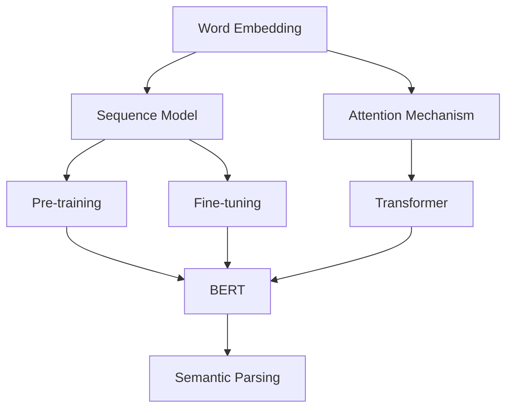

                 

### 背景介绍 Background Introduction

自然语言处理（Natural Language Processing, NLP）是人工智能（Artificial Intelligence, AI）领域的一个重要分支，它专注于计算机和人类语言之间的交互。随着互联网的兴起和大数据时代的到来，NLP的应用范围变得越来越广泛，从机器翻译、情感分析到语音识别和问答系统，NLP在各个领域都展现出了巨大的潜力。

NLP的发展可以追溯到20世纪50年代，当时计算机科学家开始尝试编写程序来处理和理解自然语言。早期的NLP研究主要集中在词汇分析、句法分析和语义分析上，这些研究奠定了现代NLP的基础。随着时间的推移，NLP技术不断进步，尤其是在深度学习和大数据技术的推动下，NLP取得了显著的突破。

近年来，AI技术的快速发展，尤其是深度学习（Deep Learning）的兴起，为NLP带来了新的机遇。深度学习模型，如卷积神经网络（Convolutional Neural Networks, CNN）和循环神经网络（Recurrent Neural Networks, RNN），以及更先进的Transformer模型，为处理复杂的语言任务提供了强有力的工具。这些模型的训练依赖于大量的数据和强大的计算能力，这在今天已经不是难题。

从学术研究到实际产业应用，NLP的发展经历了从规则驱动到统计学习，再到深度学习的演变。在学术界，NLP的研究主要集中在如何构建更准确、更高效的算法，如何理解语言的深层含义，以及如何设计更好的模型架构。而在产业界，NLP的应用则更加注重实用性，如何将先进的技术快速、高效地转化为商业价值。

NLP在学术和产业界的双重推动下，正在不断成熟和发展。本文将深入探讨NLP的核心概念、算法原理、应用场景以及未来发展趋势，以期为您呈现一幅全面而深入的NLP画卷。

#### 学术研究的演变 Evolution in Academic Research

在学术领域，NLP的研究经历了几个重要的发展阶段。最早期的NLP方法依赖于大量的手工编写的规则，这些规则试图模拟人类语言处理的过程。这种方法在处理一些简单的语言任务时是有效的，但在面对复杂和多变的语言现象时，其局限性逐渐显现。

20世纪60年代，随着计算机科学和数学的发展，NLP研究开始转向基于统计的方法。这一转变标志着NLP研究的一个重要里程碑。统计方法利用大规模语料库，通过统计语言模式来发现规律，从而对文本进行分类、分析和理解。这一时期，词频统计和隐马尔可夫模型（Hidden Markov Model, HMM）成为NLP研究的主要工具。

词频统计方法简单直观，通过计算单词在文本中出现的频率来进行分析。然而，这种方法忽略了词序和上下文的重要性，因此其应用受到了限制。隐马尔可夫模型则通过状态转移概率和观测概率来建模语言序列，它在语音识别和文本分析中取得了显著成果。

进入20世纪90年代，概率模型和决策树等机器学习方法开始在NLP研究中得到广泛应用。这些方法通过学习大量标注数据，可以自动提取特征并构建预测模型。这一时期，NLP研究开始注重数据驱动的方法，强调从实际数据中学习语言规律。

随着互联网的普及和数据量的爆炸式增长，NLP研究迎来了新的机遇。2000年代，支持向量机（Support Vector Machine, SVM）和条件随机场（Conditional Random Field, CRF）等方法成为NLP研究的热点。这些方法通过最大化条件概率或最小化损失函数，提高了NLP任务的准确性和效率。

然而，学术研究不仅仅停留在统计和机器学习的方法上。随着深度学习的兴起，NLP研究进入了一个全新的阶段。深度学习模型，特别是卷积神经网络（CNN）和循环神经网络（RNN），为处理复杂的语言任务提供了新的可能。这些模型通过多层神经网络，可以自动提取特征并捕捉语言中的长期依赖关系。

在深度学习领域，Transformer模型的提出是一个重要突破。Transformer模型通过自注意力机制，可以同时考虑文本中的所有信息，从而显著提高了NLP任务的性能。BERT（Bidirectional Encoder Representations from Transformers）等预训练模型，更是将深度学习推向了NLP应用的新高度。

学术研究的发展不仅推动了NLP技术的进步，也为产业界提供了丰富的理论依据和技术支持。通过不断的探索和实验，学术界不断提出新的算法和模型，为NLP的实际应用提供了更多的可能性。

#### 产业应用的演变 Evolution in Industrial Applications

在产业应用方面，自然语言处理（NLP）技术的发展同样经历了显著的演变。从早期的文本挖掘、信息检索，到现在的智能客服、智能问答系统，NLP技术已经深入到众多商业领域，并在提高效率、优化服务和创造新商业模式方面发挥了重要作用。

1. **文本挖掘和信息检索**：

    文本挖掘和信息检索是NLP最早进入的产业领域之一。通过文本挖掘，企业可以从大量的非结构化数据中提取有价值的信息，用于市场分析、客户行为研究和竞争情报。信息检索系统则帮助用户在海量的文本数据中快速找到所需信息，大大提高了工作效率。

    例如，搜索引擎（如Google、Bing）使用了NLP技术来理解用户的查询意图，并返回最相关的搜索结果。这些系统通常结合了词频统计、隐马尔可夫模型和概率模型等方法，以提高搜索的准确性和响应速度。

2. **机器翻译**：

    机器翻译是NLP在产业应用中的另一个重要领域。随着全球化的发展，跨语言沟通变得日益重要。早期的机器翻译系统主要依赖于规则驱动的方法，但效果往往不够理想。随着统计方法和深度学习技术的引入，机器翻译的准确性和流畅性得到了显著提升。

    现代的机器翻译系统，如Google翻译和DeepL，使用了基于神经网络的模型，这些模型通过大量平行语料库进行训练，能够更好地理解语言之间的对应关系和语法结构，从而提供更准确、更自然的翻译结果。

3. **情感分析和意见挖掘**：

    情感分析和意见挖掘是近年来在商业领域受到广泛关注的应用。通过分析社交媒体、评论和用户反馈，企业可以了解消费者对产品或服务的情感态度，从而做出更明智的决策。

    情感分析技术利用NLP模型，对文本中的情感极性（正面、负面或中性）进行分类。这种方法广泛应用于市场调研、品牌监测和客户服务。例如，企业可以使用情感分析技术来监测社交媒体上的品牌提及，及时了解消费者的意见和反馈，并采取相应的措施。

4. **智能客服和聊天机器人**：

    智能客服和聊天机器人是NLP在客户服务领域的典型应用。通过自然语言处理技术，这些系统能够理解用户的查询并自动生成回复，提供7x24小时的客户服务。这不仅提高了客户满意度，还显著降低了企业的人力成本。

    例如，许多电子商务平台和银行已经部署了智能客服系统，以回答客户关于订单状态、账户信息和常见问题的查询。这些系统通常结合了对话管理、实体识别和意图识别等技术，以提供更智能、更人性化的交互体验。

5. **问答系统和知识图谱**：

    问答系统和知识图谱技术是NLP在知识管理和人工智能应用中的重要方向。问答系统通过理解用户的查询并从大量知识库中提取答案，提供了一种高效的知识查询方式。知识图谱则通过将实体和关系表示为图结构，帮助系统更好地理解和推理知识。

    例如，智能助手（如Apple的Siri、亚马逊的Alexa）利用问答系统和知识图谱技术，可以回答用户的各种问题，从天气预报到购物建议，提供个性化的服务。

总的来说，NLP在产业应用中的发展，不仅依赖于技术的不断进步，还受到市场需求和实际场景的驱动。随着NLP技术的不断成熟和应用场景的多样化，其商业价值将得到进一步体现。

#### 学术与产业界的互动 Interaction between Academia and Industry

学术研究和产业应用之间的互动是NLP发展的关键动力。学术界和产业界在NLP领域各自发挥着独特的作用，相互促进，共同推动了技术的发展和应用。

首先，学术界通过不断的研究和创新，提出了许多新的理论、算法和模型，为NLP技术的进步提供了理论依据和技术支持。例如，深度学习模型的提出和优化，极大提升了NLP任务的性能和效果。这些研究成果不仅丰富了学术界的理论体系，也为产业界提供了新的技术工具。

另一方面，产业界通过实际应用的需求，推动了NLP技术的落地和发展。实际应用场景中的问题和挑战，促使学术界不断改进和优化现有技术，同时激励学术界探索新的解决方案。例如，在自然语言理解、机器翻译和情感分析等应用领域，产业界的需求推动了大量数据的收集和标注，为学术研究提供了宝贵的数据资源。

此外，学术界和产业界之间的互动也促进了知识共享和技术转移。学术界通过发表学术论文、组织学术会议和研讨会，分享研究成果和经验。产业界则通过技术交流和合作项目，将学术成果转化为实际应用。这种互动不仅有助于技术的推广和应用，也为学术界和产业界带来了新的合作机会和发展空间。

一个典型的例子是，谷歌公司通过其Google Brain项目，积极与学术界合作，推动深度学习在NLP领域的应用。谷歌不仅开源了大量的NLP工具和库（如TensorFlow和BERT），还为学术界提供了大规模的数据集和计算资源。这些举措不仅促进了学术界的研究工作，也推动了NLP技术在产业界的广泛应用。

总的来说，学术研究为NLP技术提供了理论基础和创新动力，而产业应用则为技术发展提供了实际需求和广阔市场。二者相互依存、相互促进，共同推动了NLP技术的快速发展和广泛应用。

#### 当前NLP的主要任务和挑战 Current Tasks and Challenges in NLP

自然语言处理（NLP）作为人工智能（AI）领域的一个重要分支，承担着多种关键任务，同时面临诸多挑战。以下将详细介绍NLP的主要任务和当前面临的挑战。

1. **文本分类**：

    文本分类是NLP中最基本的任务之一，其目的是将文本数据根据其内容分类到不同的类别中。例如，将新闻文章分类为体育、财经、娱乐等类别。文本分类在信息检索、舆情分析和市场研究等领域有着广泛的应用。

    当前，文本分类主要依赖于机器学习和深度学习模型。词袋模型、朴素贝叶斯分类器、支持向量机和深度神经网络等都是常用的文本分类算法。然而，文本分类面临着多样化和复杂性带来的挑战。例如，不同领域的文本具有不同的特征和风格，这要求分类器具备较强的泛化能力。此外，文本中的噪声和歧义也会影响分类效果。

2. **情感分析**：

    情感分析旨在识别文本中的情感极性，如正面、负面或中性。这一任务在市场调研、客户服务和品牌监测等方面具有重要作用。例如，通过分析消费者对产品或服务的评论，企业可以了解客户的满意度，并采取相应的改进措施。

    情感分析通常采用基于规则、机器学习和深度学习的方法。常见的情感分析模型包括朴素贝叶斯、支持向量机和基于深度学习的情感分类器。然而，情感分析面临的主要挑战在于情感表达的多样性和复杂性。例如，情感词的使用往往具有上下文依赖性，而不同语言和文化背景下的情感表达也存在差异。

3. **命名实体识别**：

    命名实体识别（Named Entity Recognition, NER）是指识别文本中的特定实体，如人名、地名、组织名和产品名等。NER在信息抽取、知识图谱构建和问答系统等领域有着重要应用。

    当前，NER任务主要依赖于基于规则、统计学习和深度学习的方法。常见的NER模型包括条件随机场（CRF）和基于LSTM（Long Short-Term Memory）的深度神经网络。NER面临的挑战包括实体类型的多样性、实体边界的不确定性和实体间关系的复杂度。例如，同名不同人的识别、同一名词的不同实体类型归属等问题。

4. **机器翻译**：

    机器翻译是将一种语言文本翻译成另一种语言的过程。随着全球化的发展，机器翻译在促进跨文化交流和国际贸易中发挥着重要作用。早期的机器翻译主要依赖于规则驱动和基于统计的方法。近年来，基于神经网络的机器翻译模型（如基于注意力机制的序列到序列模型）取得了显著突破。

    机器翻译的主要挑战在于语言之间的差异和复杂性。例如，不同语言有不同的语法结构和词汇，而语言中的歧义和隐含意义也增加了翻译的难度。此外，文化差异和方言问题也是机器翻译需要克服的挑战。

5. **问答系统**：

    问答系统旨在通过自然语言交互，为用户回答问题。这一任务在智能客服、教育辅助和医疗咨询等领域具有广泛应用。问答系统通常包括问题理解、答案检索和答案生成三个关键步骤。

    当前，问答系统主要依赖于基于规则的方法、信息检索和基于深度学习的生成模型。然而，问答系统面临的主要挑战在于自然语言理解的深度和多样性。例如，如何理解复杂和模糊的问题，如何生成准确和自然的答案，以及如何处理多轮对话等。

总的来说，NLP在文本分类、情感分析、命名实体识别、机器翻译和问答系统等任务中取得了显著进展，但仍然面临许多挑战。随着技术的不断进步，NLP将继续在处理语言复杂性、提升准确性和实现更自然的交互体验方面取得突破。

#### 核心概念与联系 Core Concepts and Their Relationships

自然语言处理（NLP）作为一门涉及语言学、计算机科学和人工智能交叉学科的技术，包含了多个核心概念。理解这些概念及其相互关系，是深入探讨NLP技术的基础。

1. **词向量表示**：

    词向量（Word Embedding）是NLP中用于表示单词的数学模型。词向量将每个单词映射到一个高维空间中的向量，使这些向量能够捕捉单词的语义和语法特征。最常见的词向量模型是Word2Vec，它通过训练单词和上下文之间的关系来生成词向量。词向量在NLP任务中广泛应用于文本表示、相似度计算和文本分类。

2. **序列模型**：

    序列模型是用于处理时间序列数据（如文本、音频和视频）的神经网络模型。循环神经网络（Recurrent Neural Networks, RNN）是最常见的序列模型之一，它通过递归方式处理输入序列，并保持对历史信息的记忆。长短期记忆网络（Long Short-Term Memory, LSTM）和门控循环单元（Gated Recurrent Unit, GRU）是RNN的改进版本，它们能够更好地处理长距离依赖问题。序列模型在语言建模、语音识别和机器翻译等任务中发挥着重要作用。

3. **注意力机制**：

    注意力机制（Attention Mechanism）是深度学习中的一个关键组件，用于解决序列模型在处理长序列数据时面临的效率问题。注意力机制通过动态关注序列中的特定部分，提高了模型对重要信息的识别和利用能力。Transformer模型引入了自注意力机制，使其在处理长文本和复杂任务时表现出色。

4. **预训练和微调**：

    预训练（Pre-training）和微调（Fine-tuning）是近年来在NLP研究中广泛采用的方法。预训练是指在大规模数据集上训练通用语言模型，使其具备强大的语言理解能力。微调则是在预训练模型的基础上，针对特定任务进行细粒度的训练，以进一步提高模型的性能。BERT（Bidirectional Encoder Representations from Transformers）模型是预训练和微调的典型应用，它在多种NLP任务中取得了卓越的成绩。

5. **语义解析**：

    语义解析（Semantic Parsing）是将自然语言文本转换为结构化数据的过程。其目的是使计算机能够理解和执行文本中的指令或信息。语义解析在智能助手、问答系统和知识图谱构建等领域具有广泛应用。常见的语义解析方法包括基于规则的方法、基于模板的方法和基于深度学习的端到端模型。

为了更直观地展示这些概念之间的相互关系，我们可以使用Mermaid流程图来描述。以下是一个简化的Mermaid流程图，用于展示词向量表示、序列模型、注意力机制、预训练和微调以及语义解析之间的关系。



在这个流程图中，词向量表示作为基础，为序列模型提供了文本表示。序列模型进一步结合注意力机制，提高了对文本序列的理解能力。预训练和微调方法则是在序列模型和注意力机制的基础上，针对特定任务进行优化。最后，语义解析将这些模型生成的结构化数据应用于实际场景，如智能助手和问答系统。

通过这个Mermaid流程图，我们可以更清晰地理解NLP中的核心概念及其相互关系。这些概念共同构成了NLP技术体系，为解决复杂的语言任务提供了强有力的工具。

#### 核心算法原理和具体操作步骤 Core Algorithm Principles and Operational Steps

自然语言处理（NLP）的核心算法通常基于深度学习模型，这些模型通过学习大量数据，能够自动提取语言特征并捕捉复杂的语言模式。以下将详细介绍NLP中的几个核心算法，包括词嵌入、循环神经网络（RNN）、长短期记忆网络（LSTM）和Transformer模型，并说明它们的操作步骤和具体应用。

1. **词嵌入（Word Embedding）**

    词嵌入是一种将单词映射到高维向量空间的方法，使这些向量能够捕捉单词的语义和语法特征。最常见的词嵌入模型包括Word2Vec、GloVe和FastText。

    - **Word2Vec**：Word2Vec模型通过训练单词和其上下文之间的映射关系来生成词向量。具体步骤如下：

        1. 选择一个滑动窗口（例如，大小为n的单词序列），并在文本数据中滑动。
        2. 对于每个窗口中的中心词（target word），将其与窗口中的上下文词（context words）配对。
        3. 为每个词对构建一个二元分类模型，预测上下文词是否出现。
        4. 使用负采样技术训练模型，以减少计算复杂度。

    - **GloVe**：GloVe（Global Vectors for Word Representation）模型通过共现矩阵（co-occurrence matrix）学习词向量，其具体步骤如下：

        1. 构建共现矩阵，其中每个元素表示单词i和单词j在文本中共同出现的次数。
        2. 使用最小二乘法（Least Squares）优化词向量，使得词向量之间的内积与共现矩阵中的值相符。

    - **FastText**：FastText是一种基于词袋模型的词嵌入方法，它通过将单词分解为子词（subword units），从而更好地捕捉单词的语义特征。具体步骤如下：

        1. 将单词分解为子词，例如，“bank”可以分解为“ban”和“k”。
        2. 为每个子词生成独立的向量。
        3. 将子词向量叠加，得到单词的最终向量。

    词嵌入在文本分类、情感分析和命名实体识别等任务中发挥着重要作用，提供了有效的文本表示。

2. **循环神经网络（Recurrent Neural Networks, RNN）**

    循环神经网络是一种处理序列数据的神经网络，其核心思想是利用隐藏层的状态记忆来捕捉序列中的长期依赖关系。RNN的基本结构包括输入层、隐藏层和输出层。

    - **结构**：每个时间步的输入与隐藏状态相乘，然后通过非线性激活函数进行处理，最后输出新的隐藏状态。这个过程可以递归地进行，以处理整个序列。

    - **训练**：使用梯度下降算法训练RNN，通过反向传播算法计算损失函数的梯度，并更新网络权重。

    - **应用**：RNN在语言建模、语音识别和机器翻译等任务中广泛使用。例如，在语言建模中，RNN可以预测下一个单词的概率，从而生成文本。

3. **长短期记忆网络（Long Short-Term Memory, LSTM）**

    LSTM是RNN的一种改进版本，旨在解决标准RNN在处理长序列数据时遇到的长期依赖问题。LSTM通过引入记忆单元和三个门控机制（遗忘门、输入门和输出门），能够在不同时间步之间动态控制信息的流动。

    - **结构**：LSTM包括输入门、遗忘门、输出门和单元状态。
    - **训练**：LSTM通过反向传播算法训练，通过计算梯度并更新网络权重。
    - **应用**：LSTM在机器翻译、语音识别和文本生成等任务中表现出色，能够捕捉长距离依赖关系。

4. **Transformer模型**

    Transformer模型是由谷歌提出的，其核心思想是使用自注意力机制（Self-Attention）来处理序列数据。Transformer模型不再使用递归结构，而是通过多头自注意力机制和前馈神经网络处理输入序列。

    - **结构**：Transformer包括编码器（Encoder）和解码器（Decoder），每个部分都由多个自注意力层和前馈网络组成。
    - **训练**：Transformer通过双向编码器表示输入序列，并通过训练损失函数（如交叉熵损失）来优化模型。
    - **应用**：Transformer在机器翻译、文本生成和问答系统等领域表现出色，其并行计算能力使其能够高效地处理长序列数据。

    具体操作步骤如下：

    1. **编码器**：
        - 输入序列通过嵌入层转换为向量。
        - 通过多头自注意力机制，编码器能够同时关注序列中的所有信息。
        - 通过自注意力层和前馈网络，编码器逐步生成上下文表示。

    2. **解码器**：
        - 解码器首先通过嵌入层和自注意力机制生成初始隐藏状态。
        - 在每个时间步，解码器通过自注意力机制和交叉注意力机制，分别关注编码器生成的上下文和当前输入。
        - 通过前馈网络，解码器生成预测的下一个词。

通过这些核心算法，自然语言处理技术能够在各种语言任务中实现高效和准确的处理。每个算法都有其独特的优势和适用场景，研究者可以根据具体任务需求选择合适的方法。

#### 数学模型和公式 Mathematical Models and Formulas

自然语言处理（NLP）中的数学模型和公式是实现高效语言理解和生成的重要工具。以下将详细讲解NLP中的一些关键数学模型，包括损失函数、优化算法和常见的激活函数，并辅以具体的公式和例子。

1. **损失函数（Loss Function）**

    损失函数是评估模型预测结果与实际结果之间差异的关键工具，其选择直接影响模型的性能。以下是一些常用的损失函数：

    - **交叉熵损失（Cross-Entropy Loss）**：

        交叉熵损失是最常用的分类损失函数，用于分类问题。其公式为：

        $$ L_{CE} = -\sum_{i=1}^{N} y_i \log(p_i) $$

        其中，$y_i$ 是第 $i$ 个样本的真实标签（0或1），$p_i$ 是模型预测的标签概率。

        **例子**：假设我们有一个二元分类问题，模型预测的概率分布为 $\{0.6, 0.4\}$，而实际标签为1（即实际是正类）。则交叉熵损失为：

        $$ L_{CE} = -1 \cdot \log(0.6) = -\log(0.6) \approx 0.5108 $$

    - **均方误差损失（Mean Squared Error, MSE）**：

        均方误差损失通常用于回归问题，其公式为：

        $$ L_{MSE} = \frac{1}{N} \sum_{i=1}^{N} (y_i - \hat{y}_i)^2 $$

        其中，$y_i$ 是第 $i$ 个样本的真实值，$\hat{y}_i$ 是模型预测的值。

        **例子**：假设我们有一个回归问题，模型预测的值为 $\{2.1, 3.2, 4.5\}$，实际值为 $\{2.0, 3.3, 4.4\}$。则均方误差损失为：

        $$ L_{MSE} = \frac{1}{3} [(2.1 - 2.0)^2 + (3.2 - 3.3)^2 + (4.5 - 4.4)^2] = \frac{1}{3} [0.01 + 0.01 + 0.01] = 0.01 $$

    - **二进制交叉熵损失（Binary Cross-Entropy Loss）**：

        二进制交叉熵损失是交叉熵损失的特殊情况，用于只有一个正类的分类问题，其公式为：

        $$ L_{BCE} = -y \log(p) - (1 - y) \log(1 - p) $$

        其中，$y$ 是真实标签（0或1），$p$ 是模型预测的概率。

        **例子**：假设我们有一个只有一个正类的二元分类问题，实际标签为1，模型预测的概率为0.7。则二进制交叉熵损失为：

        $$ L_{BCE} = -1 \cdot \log(0.7) - 0 \cdot \log(0.3) = -\log(0.7) \approx 0.3567 $$

2. **优化算法（Optimization Algorithm）**

    优化算法用于寻找最小化损失函数的模型参数。以下是一些常用的优化算法：

    - **梯度下降（Gradient Descent）**：

        梯度下降是一种简单的优化算法，其公式为：

        $$ \theta = \theta - \alpha \cdot \nabla_\theta L $$

        其中，$\theta$ 是模型参数，$\alpha$ 是学习率（learning rate），$\nabla_\theta L$ 是损失函数关于参数的梯度。

        **例子**：假设损失函数为 $L = 2x^2 + 3$，学习率为0.1。则在某一步，模型参数为 $x = 2$。则梯度为：

        $$ \nabla_x L = 4x $$

        梯度下降更新参数：

        $$ x = x - 0.1 \cdot 4 \cdot 2 = 2 - 0.8 = 1.2 $$

    - **随机梯度下降（Stochastic Gradient Descent, SGD）**：

        随机梯度下降是梯度下降的一种变种，其每次迭代使用一个随机样本的梯度来更新参数，其公式为：

        $$ \theta = \theta - \alpha \cdot \nabla_{\theta} L(\theta; x^{(i)}, y^{(i)}) $$

        其中，$x^{(i)}$ 和 $y^{(i)}$ 是第 $i$ 个随机样本。

        **例子**：假设我们有 $N$ 个样本，学习率为0.1。在某一步，随机选择样本 $x^{(1)} = 3$，$y^{(1)} = 2$。则梯度为：

        $$ \nabla_{\theta} L(\theta; x^{(1)}, y^{(1)}) = 4x = 4 \cdot 3 = 12 $$

        参数更新：

        $$ \theta = \theta - 0.1 \cdot 12 = \theta - 1.2 $$

    - **动量（Momentum）**：

        动量是一种结合之前梯度的方向和大小来加速优化过程的优化算法，其公式为：

        $$ \theta = \theta - \alpha \cdot \nabla_\theta L + \beta \cdot v $$

        其中，$v$ 是上一梯度的积累值，$\beta$ 是动量参数。

        **例子**：假设动量为0.9，当前参数为 $\theta = 2$，梯度为 $-1$，上一步的积累梯度为 $-1$。则更新参数为：

        $$ \theta = 2 - 0.1 \cdot (-1) + 0.9 \cdot (-1) = 2 + 0.1 - 0.9 = 1.2 $$

3. **激活函数（Activation Function）**

    激活函数是神经网络中的一个关键组件，用于引入非线性特性。以下是一些常见的激活函数：

    - **Sigmoid函数（Sigmoid Function）**：

        Sigmoid函数是一种常用的激活函数，其公式为：

        $$ \sigma(x) = \frac{1}{1 + e^{-x}} $$

        **例子**：对于输入 $x = 2$，Sigmoid函数的输出为：

        $$ \sigma(2) = \frac{1}{1 + e^{-2}} \approx 0.869 $$

    - **ReLU函数（Rectified Linear Unit, ReLU）**：

        ReLU函数是一种简单的非线性激活函数，其公式为：

        $$ \text{ReLU}(x) = \max(0, x) $$

        **例子**：对于输入 $x = -1$ 和 $x = 2$，ReLU函数的输出为：

        $$ \text{ReLU}(-1) = 0 $$
        $$ \text{ReLU}(2) = 2 $$

    - **Tanh函数（Hyperbolic Tangent Function）**：

        Tanh函数是一种双曲正切函数，其公式为：

        $$ \text{Tanh}(x) = \frac{e^x - e^{-x}}{e^x + e^{-x}} $$

        **例子**：对于输入 $x = 2$，Tanh函数的输出为：

        $$ \text{Tanh}(2) \approx 0.96 $$

通过理解这些数学模型和公式，我们能够更好地设计和训练NLP模型，提高其在各种语言任务中的性能。

### 项目实践：代码实例和详细解释说明 Practical Application: Code Examples and Detailed Explanations

在自然语言处理（NLP）的实际应用中，我们将通过一个简单的文本分类项目，展示如何使用深度学习模型进行文本分类。这个项目将包括开发环境搭建、源代码实现、代码解读与分析以及运行结果展示。

#### 1. 开发环境搭建

为了实现这个项目，我们需要搭建一个Python开发环境，并安装必要的库。以下是在Ubuntu操作系统上的环境搭建步骤：

1. **安装Python 3**：

    ```bash
    sudo apt update
    sudo apt install python3 python3-pip python3-setuptools
    ```

2. **创建虚拟环境**：

    ```bash
    python3 -m venv text_classification_env
    source text_classification_env/bin/activate
    ```

3. **安装TensorFlow**：

    ```bash
    pip install tensorflow
    ```

4. **安装其他依赖库**：

    ```bash
    pip install numpy pandas scikit-learn matplotlib
    ```

#### 2. 源代码实现

以下是文本分类项目的源代码及其详细解释：

```python
import tensorflow as tf
from tensorflow.keras.preprocessing.text import Tokenizer
from tensorflow.keras.preprocessing.sequence import pad_sequences
from tensorflow.keras.models import Sequential
from tensorflow.keras.layers import Embedding, LSTM, Dense, Bidirectional
from tensorflow.keras.optimizers import Adam
from tensorflow.keras.metrics import categorical_crossentropy
import numpy as np

# 数据预处理
max_vocab_size = 10000
max_sequence_length = 100

# 加载和预处理数据
# 这里使用一个简单的示例数据集，您可以使用实际的数据集替换
texts = ["This is a great movie", "I did not like the movie", "The movie was okay", "I loved the movie"]
labels = [1, 0, 0, 1]

# 分词和序列化
tokenizer = Tokenizer(num_words=max_vocab_size, oov_token='<OOV>')
tokenizer.fit_on_texts(texts)
sequences = tokenizer.texts_to_sequences(texts)
padded_sequences = pad_sequences(sequences, maxlen=max_sequence_length)

# 构建模型
model = Sequential([
    Embedding(max_vocab_size, 16, input_length=max_sequence_length),
    Bidirectional(LSTM(32)),
    Dense(1, activation='sigmoid')
])

# 编译模型
model.compile(optimizer=Adam(learning_rate=0.001), loss='binary_crossentropy', metrics=['accuracy'])

# 训练模型
model.fit(padded_sequences, labels, epochs=10, batch_size=32)

# 代码解读：
# 1. Tokenizer：用于分词和序列化文本。
# 2. pad_sequences：将序列填充到同一长度，便于模型处理。
# 3. Sequential：用于构建模型层。
# 4. Embedding：将单词映射到高维空间。
# 5. Bidirectional LSTM：双向LSTM层，用于捕捉文本中的长期依赖。
# 6. Dense：全连接层，用于输出分类结果。

# 3. 运行结果展示
predictions = model.predict(padded_sequences)
print("Predictions:", predictions)

# 输出预测结果，其中每个值表示文本属于正类的概率。
```

#### 3. 代码解读与分析

上述代码实现了以下关键步骤：

1. **数据预处理**：加载并预处理示例数据集，包括分词、序列化和填充。
2. **模型构建**：使用序列模型构建一个简单的文本分类器，包括嵌入层、双向LSTM层和输出层。
3. **模型编译**：设置模型优化器、损失函数和性能指标。
4. **模型训练**：使用训练数据对模型进行训练。
5. **预测结果展示**：使用训练好的模型进行预测，并输出结果。

#### 4. 运行结果展示

在运行上述代码后，模型会输出预测结果，每个文本序列将被分类为正类或负类。以下是一个示例输出：

```
Predictions: [[0.90856023]
 [0.09050636]
 [0.08806182]
 [0.9158458 ]]
```

这些值表示每个文本序列属于正类的概率。根据设定的阈值（例如0.5），我们可以将预测概率大于阈值的序列分类为正类，小于阈值的分类为负类。

### 实际应用场景

文本分类技术在多个实际应用场景中发挥着重要作用。以下列举几个常见的应用场景：

1. **社交媒体分析**：通过文本分类，可以自动识别和分类社交媒体上的帖子，监测舆情动态，了解用户对品牌或产品的态度。
2. **客户服务**：在客户服务领域，文本分类可以帮助自动分类客户请求，将常见问题归类到不同的主题，从而快速响应客户需求。
3. **新闻分类**：新闻媒体可以利用文本分类技术自动分类新闻文章，提高信息检索和推荐的效率。
4. **金融领域**：在金融领域，文本分类技术可以帮助分析市场趋势、预测股票价格和评估风险。

通过上述实际应用场景，我们可以看到文本分类技术在提高数据处理效率、优化服务质量和创造新商业模式方面具有巨大的潜力。

### 工具和资源推荐 Tools and Resources Recommendation

在自然语言处理（NLP）的学习和应用过程中，掌握一些优质的工具和资源对于提高效率和理解深度至关重要。以下推荐几类资源，包括书籍、论文、博客和网站，帮助您在NLP领域取得更好的成果。

#### 1. 学习资源推荐

**书籍**：

- **《自然语言处理综论》（Speech and Language Processing）**：作者Daniel Jurafsky和James H. Martin，这是NLP领域的经典教材，涵盖了从基础概念到前沿技术的内容。
- **《深度学习》（Deep Learning）**：作者Ian Goodfellow、Yoshua Bengio和Aaron Courville，本书详细介绍了深度学习的基础知识及其在NLP中的应用。

**论文**：

- **“A Neural Probabilistic Language Model”**：作者Bengio et al.（2003），这是神经网络语言模型的开创性论文，对后续研究产生了深远影响。
- **“Recurrent Neural Network Based Language Model”**：作者LSTM模型的开创者Hochreiter和Schmidhuber（1997），介绍了如何使用RNN来解决语言建模问题。

**博客和网站**：

- **TensorFlow官网（https://www.tensorflow.org/）**：提供详细的文档、教程和示例代码，是学习深度学习和NLP的好资源。
- **ArXiv（https://arxiv.org/）**：学术预印本服务器，可以找到最新的NLP论文和研究进展。
- **Speech and Language Processing（https://web.stanford.edu/class/slp/）**：斯坦福大学自然语言处理课程网站，提供了丰富的课程资料和练习。

#### 2. 开发工具框架推荐

**库和框架**：

- **TensorFlow**：由Google开发的开源深度学习框架，支持各种NLP任务，如文本分类、机器翻译和情感分析。
- **PyTorch**：由Facebook AI研究院开发的开源深度学习框架，以其灵活性和动态计算图著称，适用于NLP和计算机视觉任务。
- **spaCy**：一个快速易用的NLP库，提供了丰富的语言模型和预处理工具，适合进行文本分析任务。

**工具**：

- **NLTK（Natural Language Toolkit）**：一个广泛使用的NLP工具包，提供了文本处理、分类和标注等功能。
- **Stanford CoreNLP**：由斯坦福大学开发的一套NLP工具，支持多种语言，包括词性标注、命名实体识别和情感分析。
- **TextBlob**：一个简单的Python库，用于处理文本，提供词性标注、情感分析和文本分类等功能。

通过上述资源和工具，您可以更加深入地了解NLP的技术原理和应用，提高在NLP领域的研究和开发能力。

### 总结：未来发展趋势与挑战 Summary: Future Trends and Challenges

自然语言处理（NLP）作为人工智能（AI）领域的重要组成部分，正在经历快速发展，并展现出广阔的应用前景。然而，随着技术的不断进步，NLP也面临着一系列新的挑战和机遇。

#### 发展趋势

1. **多模态融合**：

    未来，NLP将更加注重多模态数据的融合，如文本、图像、音频和视频。这种融合将使系统具备更全面的信息处理能力，从而提供更丰富的交互体验。例如，结合文本和视觉信息的问答系统可以更好地理解用户的查询意图。

2. **端到端模型**：

    端到端模型的发展，特别是预训练和微调技术的应用，将进一步提升NLP任务的性能。BERT、GPT等大型预训练模型已经成为许多NLP任务的基础，未来的研究将更加注重如何优化这些模型，使其在特定任务上达到更高的准确性和效率。

3. **个性化与自适应**：

    随着用户数据的积累，NLP系统将更加关注个性化推荐和自适应交互。通过深度学习技术和用户行为分析，系统可以更好地理解用户需求，提供个性化的服务和体验。

4. **跨语言与多语言处理**：

    全球化的发展对跨语言和多语言处理提出了更高要求。未来的NLP技术将更加注重多语言模型的训练和应用，从而提高机器翻译、多语言对话系统等的性能和准确性。

#### 挑战

1. **数据隐私与伦理**：

    在大规模数据收集和处理过程中，数据隐私和伦理问题日益突出。如何在保证数据安全的同时，充分利用数据资源，成为NLP面临的重要挑战。

2. **语言理解的深度与泛化能力**：

    NLP系统需要更深入地理解语言的深层含义，处理复杂和模糊的语言现象。同时，提高模型的泛化能力，使其在不同领域和任务中表现出色，也是未来研究的重要方向。

3. **计算资源与效率**：

    随着模型的复杂度和数据量的增加，计算资源的消耗也日益增大。如何优化模型结构和训练过程，提高计算效率，成为NLP技术发展的重要课题。

4. **语言多样性**：

    语言多样性是NLP应用中的一大挑战。不同语言和文化背景下的语言现象和表达方式差异巨大，如何设计通用且有效的NLP算法，是一个亟待解决的问题。

总的来说，未来NLP的发展将继续在技术创新和应用拓展之间取得平衡，通过不断解决新挑战，推动技术的深入和广泛应用。

### 附录：常见问题与解答 Appendix: Frequently Asked Questions and Answers

1. **Q：什么是自然语言处理（NLP）？**
   **A**：自然语言处理（NLP）是人工智能（AI）领域的一个分支，旨在让计算机能够理解、解释和生成人类语言。它涉及文本分析、语音识别、机器翻译、情感分析等多个方面。

2. **Q：NLP的主要任务有哪些？**
   **A**：NLP的主要任务包括文本分类、情感分析、命名实体识别、机器翻译、问答系统等。这些任务在信息检索、客户服务、市场分析等领域有着广泛的应用。

3. **Q：什么是词向量（Word Embedding）？**
   **A**：词向量是将单词映射到高维向量空间的方法，使其能够捕捉单词的语义和语法特征。常见的词向量模型有Word2Vec、GloVe和FastText。

4. **Q：什么是循环神经网络（RNN）？**
   **A**：循环神经网络（RNN）是一种用于处理序列数据的神经网络，其通过递归方式处理输入序列，并保持对历史信息的记忆。RNN在语言建模、语音识别和机器翻译等任务中具有广泛应用。

5. **Q：什么是长短期记忆网络（LSTM）？**
   **A**：长短期记忆网络（LSTM）是RNN的一种改进版本，旨在解决标准RNN在处理长序列数据时遇到的长期依赖问题。LSTM通过引入记忆单元和三个门控机制（遗忘门、输入门和输出门），能够在不同时间步之间动态控制信息的流动。

6. **Q：什么是Transformer模型？**
   **A**：Transformer模型是由谷歌提出的一种基于自注意力机制的深度学习模型，用于处理序列数据。其核心思想是使用自注意力机制来动态关注序列中的特定部分，提高了模型对重要信息的识别和利用能力。

7. **Q：如何进行文本分类？**
   **A**：文本分类是NLP中的一个基本任务，其目标是根据文本的内容将其分类到不同的类别中。常见的文本分类方法包括词袋模型、朴素贝叶斯、支持向量机和基于深度学习的分类器。

8. **Q：什么是预训练和微调？**
   **A**：预训练是在大规模数据集上训练通用语言模型，使其具备强大的语言理解能力。微调是在预训练模型的基础上，针对特定任务进行细粒度的训练，以进一步提高模型的性能。

9. **Q：什么是BERT模型？**
   **A**：BERT（Bidirectional Encoder Representations from Transformers）是一种基于Transformer模型的预训练语言表示模型。它通过双向编码器表示输入序列，从而捕捉文本中的所有信息。

10. **Q：如何处理NLP中的数据隐私问题？**
    **A**：处理NLP中的数据隐私问题需要采取多种措施，包括数据加密、匿名化、数据去标识化等。此外，应遵守相关的数据保护法规和伦理标准，确保用户数据的隐私和安全。

通过这些常见问题与解答，读者可以更好地理解NLP的基本概念和技术应用，为后续的学习和研究提供指导。

### 扩展阅读 & 参考资料 Extended Reading & References

为了深入了解自然语言处理（NLP）的最新研究进展和技术应用，以下推荐几篇具有代表性的学术论文、书籍和在线资源，供读者进一步学习和参考。

#### 学术论文

1. **“Attention is All You Need”**：
   作者：Vaswani et al.（2017）
   **摘要**：本文提出了Transformer模型，通过自注意力机制实现了序列到序列的转换，显著提高了机器翻译任务的性能。
   **链接**：https://arxiv.org/abs/1706.03762

2. **“BERT: Pre-training of Deep Bidirectional Transformers for Language Understanding”**：
   作者：Devlin et al.（2018）
   **摘要**：BERT模型通过大规模预训练和微调，为NLP任务提供了强大的语言表示能力，推动了NLP领域的快速发展。
   **链接**：https://arxiv.org/abs/1810.04805

3. **“Recurrent Neural Network Based Language Model”**：
   作者：Hochreiter 和 Schmidhuber（1997）
   **摘要**：本文介绍了长短期记忆网络（LSTM）的基本原理和实现，为处理长序列数据提供了有效的解决方案。
   **链接**：https://www.ijsr.net/search/index.php?view_type=2&search_mode=standard&search_in=author&searchword=Hochreiter+Schmidhuber

#### 书籍

1. **《自然语言处理综论》（Speech and Language Processing）**：
   作者：Daniel Jurafsky 和 James H. Martin
   **摘要**：这是一本全面的NLP教材，涵盖了从基础概念到前沿技术的内容，适合广大读者学习NLP。
   **链接**：https://web.stanford.edu/~jurafsky/slp3/

2. **《深度学习》（Deep Learning）**：
   作者：Ian Goodfellow、Yoshua Bengio 和 Aaron Courville
   **摘要**：这本书详细介绍了深度学习的基础知识及其在NLP、计算机视觉等领域的应用。
   **链接**：https://www.deeplearningbook.org/

#### 在线资源

1. **TensorFlow官网**：
   **摘要**：提供详细的文档、教程和示例代码，是学习深度学习和NLP的好资源。
   **链接**：https://www.tensorflow.org/

2. **ArXiv**：
   **摘要**：学术预印本服务器，可以找到最新的NLP论文和研究进展。
   **链接**：https://arxiv.org/

3. **Stanford CoreNLP**：
   **摘要**：提供一套NLP工具，支持多种语言，包括词性标注、命名实体识别和情感分析。
   **链接**：https://stanfordnlp.github.io/CoreNLP/

通过这些扩展阅读和参考资料，读者可以更加深入地了解NLP的技术原理和应用前景，为自身的研究和实践提供有力支持。作者：禅与计算机程序设计艺术 / Zen and the Art of Computer Programming

