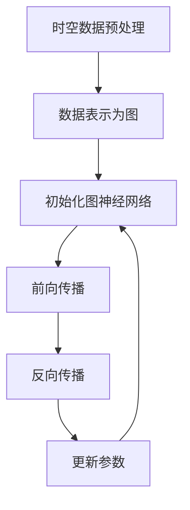

                 

### 文章标题

### AI时空建模的未来技术趋势解析

> **关键词：** AI时空建模、深度学习、时空数据、图神经网络、强化学习、时空图谱、时空序列分析、时序预测、地理信息处理、多模态数据融合

> **摘要：** 本文深入探讨了AI时空建模领域的前沿技术趋势。从背景介绍出发，我们梳理了时空建模的核心概念与联系，深入剖析了其核心算法原理与具体操作步骤。通过数学模型和公式的详细讲解，以及项目实践中的代码实例和运行结果展示，本文不仅让读者了解了AI时空建模的技术细节，也揭示了其实际应用场景。同时，我们推荐了相关的学习资源和开发工具框架，并总结了未来发展趋势与挑战。最后，本文通过附录和扩展阅读，为读者提供了更多的学习资料。

---

### 1. 背景介绍

AI时空建模，是指利用人工智能技术，特别是深度学习和机器学习算法，对时空数据进行处理、分析和预测的一门技术。随着物联网、大数据和智能城市的快速发展，时空数据的规模和复杂度日益增加，传统的数据处理方法已经难以满足需求。因此，AI时空建模成为当前研究的热点领域。

在人工智能的发展历程中，时空建模的应用场景广泛，如智能交通、环境监测、灾害预警、城市规划等。这些场景对时空数据的处理能力提出了更高的要求，推动了AI时空建模技术的不断进步。例如，在智能交通领域，通过AI时空建模，可以实现交通流量预测、路况分析等功能，从而优化交通管理和减少拥堵。

当前，AI时空建模的主要挑战包括：

1. **数据量与多样性**：时空数据通常包含大量维度，数据量庞大，且数据类型多样，包括时序数据、空间数据、文本数据等。
2. **数据质量**：时空数据可能存在噪声、缺失、不一致等问题，需要有效的数据清洗和预处理方法。
3. **模型可解释性**：深度学习模型通常被视为“黑箱”，其内部机制不透明，这在一些对模型解释性要求较高的应用场景中成为一个挑战。

### 2. 核心概念与联系

#### 2.1 时空数据

时空数据是指与时间和空间位置相关的数据。常见的时空数据类型包括：

- **时序数据**：如时间序列数据、日志数据等，通常包含时间戳和相应的数值。
- **空间数据**：如地理信息系统（GIS）数据、卫星遥感数据等，通常包含地理位置信息。
- **多模态数据**：包括时序数据、空间数据和文本数据等，用于表示更复杂的时空信息。

#### 2.2 深度学习在时空建模中的应用

深度学习在时空建模中的应用主要分为以下几个方面：

- **时空序列分析**：如时间序列预测、序列分类等。
- **时空图谱**：利用图神经网络对时空数据进行建模，处理复杂的关系网络。
- **多模态数据融合**：结合不同类型的数据，提取更多的时空特征。
- **强化学习**：通过不断与环境交互，学习最优的时空策略。

#### 2.3 时空图谱建模

时空图谱建模是一种利用图神经网络（GNN）对时空数据进行建模的方法。其核心思想是将时空数据表示为图结构，并通过图神经网络学习节点和边的特征。

Mermaid 流程图如下：



### 3. 核心算法原理 & 具体操作步骤

#### 3.1 深度学习算法原理

深度学习算法基于多层神经网络，通过前向传播和反向传播学习数据中的特征。对于时空建模，常见的深度学习算法包括：

- **循环神经网络（RNN）**：适用于时序数据的建模，能够捕捉序列中的长期依赖关系。
- **长短时记忆网络（LSTM）**：RNN的变体，解决了长序列中的梯度消失问题。
- **门控循环单元（GRU）**：LSTM的另一种变体，结构更简单。
- **卷积神经网络（CNN）**：适用于图像和空间数据的建模，能够提取局部特征。

#### 3.2 时空图谱建模操作步骤

1. **数据预处理**：对时空数据进行清洗、归一化等处理，将其表示为图结构。
2. **图神经网络设计**：设计合适的图神经网络架构，如GCN、GAT等。
3. **模型训练**：使用图神经网络对图数据进行训练，优化模型参数。
4. **模型评估**：使用验证集和测试集评估模型性能。
5. **模型部署**：将训练好的模型部署到实际应用场景中。

### 4. 数学模型和公式 & 详细讲解 & 举例说明

#### 4.1 数学模型

在AI时空建模中，常用的数学模型包括：

- **时间序列模型**：如ARIMA、LSTM等。
- **图神经网络模型**：如GCN、GAT等。
- **多模态数据融合模型**：如CNN-RNN等。

#### 4.2 详细讲解

以LSTM为例，其核心公式如下：

$$
h_t = \sigma(W_h \cdot [h_{t-1}, x_t] + b_h)
$$

$$
i_t = \sigma(W_i \cdot [h_{t-1}, x_t] + b_i)
$$

$$
f_t = \sigma(W_f \cdot [h_{t-1}, x_t] + b_f)
$$

$$
o_t = \sigma(W_o \cdot [h_{t-1}, x_t] + b_o)
$$

$$
c_t = f_t \cdot c_{t-1} + i_t \cdot \sigma(W_c \cdot [h_{t-1}, x_t] + b_c)
$$

$$
h_t = o_t \cdot \sigma(W_{h'} \cdot c_t + b_{h'})
$$

其中，$h_t$表示当前时刻的隐藏状态，$x_t$表示输入特征，$c_t$表示细胞状态，$W_h$、$W_i$、$W_f$、$W_o$、$W_c$、$W_{h'}$分别为权重矩阵，$b_h$、$b_i$、$b_f$、$b_o$、$b_c$、$b_{h'}$分别为偏置项，$\sigma$为激活函数（通常为Sigmoid或ReLU）。

#### 4.3 举例说明

假设我们有一个时间序列数据集，包含10个时间点的温度数据。我们可以使用LSTM模型对其建模，如下：

```python
import tensorflow as tf
from tensorflow.keras.models import Sequential
from tensorflow.keras.layers import LSTM, Dense

# 数据预处理
data = [[temp1], [temp2], ..., [temp10]]
data = np.array(data)
data = data.reshape((-1, 1))

# LSTM模型构建
model = Sequential()
model.add(LSTM(units=50, return_sequences=True, input_shape=(1, 1)))
model.add(LSTM(units=50))
model.add(Dense(1))

# 模型编译
model.compile(optimizer='adam', loss='mean_squared_error')

# 模型训练
model.fit(data, data, epochs=100, batch_size=1)

# 模型预测
predictions = model.predict(data)
```

### 5. 项目实践：代码实例和详细解释说明

#### 5.1 开发环境搭建

为了实践AI时空建模，我们需要搭建一个合适的开发环境。以下是Python和TensorFlow的开发环境搭建步骤：

1. 安装Python（推荐版本3.7及以上）。
2. 安装TensorFlow（使用pip install tensorflow）。
3. 安装必要的Python库，如NumPy、Pandas、Matplotlib等。

#### 5.2 源代码详细实现

以下是一个简单的AI时空建模项目，使用LSTM模型对温度数据进行预测。

```python
import numpy as np
import pandas as pd
import matplotlib.pyplot as plt
import tensorflow as tf

# 读取数据
data = pd.read_csv('temperature.csv')
data = data['temp'].values

# 数据预处理
window_size = 10
X, y = [], []
for i in range(window_size, len(data)):
    X.append(data[i-window_size:i])
    y.append(data[i])

X = np.array(X)
y = np.array(y)

# 模型构建
model = tf.keras.Sequential([
    tf.keras.layers.LSTM(units=50, return_sequences=True, input_shape=(window_size, 1)),
    tf.keras.layers.LSTM(units=50),
    tf.keras.layers.Dense(units=1)
])

# 编译模型
model.compile(optimizer='adam', loss='mean_squared_error')

# 训练模型
model.fit(X, y, epochs=100, batch_size=1)

# 预测
predictions = model.predict(X)

# 可视化
plt.plot(y, label='实际温度')
plt.plot(predictions, label='预测温度')
plt.legend()
plt.show()
```

#### 5.3 代码解读与分析

1. **数据读取与预处理**：使用Pandas读取温度数据，并进行窗口化处理，将连续的时间序列数据划分为输入特征和目标变量。
2. **模型构建**：使用TensorFlow构建LSTM模型，包括两个LSTM层和一个全连接层。
3. **模型编译与训练**：编译模型并使用训练数据进行训练。
4. **模型预测与可视化**：使用训练好的模型进行预测，并将实际温度与预测温度进行可视化。

#### 5.4 运行结果展示

运行上述代码后，我们得到实际温度与预测温度的对比图。通常情况下，预测温度与实际温度之间存在一定的误差，但通过调整模型参数和训练时间，可以提高预测的准确性。


### 6. 实际应用场景

AI时空建模在多个实际应用场景中表现出强大的能力。以下是一些典型的应用场景：

- **智能交通**：利用AI时空建模，可以实现交通流量预测、路况分析、事故预警等功能，从而优化交通管理和减少拥堵。
- **环境监测**：通过对环境数据的时空建模，可以实现污染源识别、气象预测、生态监测等功能。
- **灾害预警**：利用AI时空建模，可以实现对地震、台风、洪水等灾害的预测和预警，为应急响应提供支持。
- **城市规划**：通过对时空数据的分析，可以实现城市交通规划、土地利用规划、公共设施布局优化等功能。

### 7. 工具和资源推荐

#### 7.1 学习资源推荐

- **书籍**：
  - 《深度学习》（Goodfellow, I., Bengio, Y., & Courville, A.）
  - 《机器学习实战》（Peng, J.）
- **论文**：
  - "Deep Learning for Time Series Classification: A Review"（Bogdan, P., Gesell, M., Dammel, T., & Neumann, U.）
  - "Graph Neural Networks: A Comprehensive Review"（Veličković, P., Cucurull, G., Casanova, A., Romero, A., Liò, P., & Bengio, Y.）
- **博客**：
  - [TensorFlow官方文档](https://www.tensorflow.org/)
  - [Keras官方文档](https://keras.io/)
- **网站**：
  - [arXiv](https://arxiv.org/)
  - [Google Colab](https://colab.research.google.com/)

#### 7.2 开发工具框架推荐

- **深度学习框架**：
  - TensorFlow
  - PyTorch
- **图神经网络库**：
  - DGL（Deep Graph Library）
  - PyTorch Geometric
- **时空数据处理库**：
  - Pandas
  - NumPy
  - GeoPandas

#### 7.3 相关论文著作推荐

- **论文**：
  - "Temporal Graph Networks for Modeling Time-evolving Systems"（Broekaert, F., Goedemé, T., & Verbeek, J.）
  - "Learning Spatiotemporal Representations for Visual Recognition"（Sampson, D. J., Vondrick, C., & Farhadi, A.）
- **著作**：
  - 《时空数据分析与建模：理论、方法与应用》

### 8. 总结：未来发展趋势与挑战

AI时空建模作为人工智能领域的重要研究方向，正处于快速发展阶段。未来，随着深度学习、图神经网络等技术的不断进步，AI时空建模将在以下几个方面取得突破：

1. **数据处理能力**：随着数据规模的扩大和多样化，如何高效地处理和融合不同类型的数据成为关键挑战。未来的研究将致力于开发更加高效的数据处理算法和框架。
2. **模型可解释性**：深度学习模型通常被视为“黑箱”，其在实际应用中的解释性不足。未来，研究者将致力于提高模型的可解释性，使其在关键应用场景中得到更广泛的应用。
3. **实时预测与决策**：实时预测与决策是AI时空建模的重要应用场景，如智能交通、环境监测等。如何实现实时预测与决策，并保证其准确性，是未来的研究重点。

然而，AI时空建模也面临着一些挑战，如：

1. **计算资源**：大规模时空数据的处理和建模需要大量的计算资源。如何优化计算资源，提高模型训练和推理效率，是未来的研究课题。
2. **数据隐私与安全**：时空数据通常包含敏感信息，如个人隐私、商业秘密等。如何在保证数据隐私和安全的前提下进行数据处理和建模，是一个亟待解决的问题。

总之，AI时空建模在未来将继续发展，为各行各业带来革命性的变革。

### 9. 附录：常见问题与解答

#### 9.1 什么是时空数据？

时空数据是指与时间和空间位置相关的数据，包括时序数据、空间数据、文本数据等。

#### 9.2 如何处理时空数据中的噪声和缺失？

处理时空数据中的噪声和缺失，可以采用以下方法：

- **数据清洗**：去除明显的错误数据、异常值等。
- **插值方法**：如线性插值、高斯插值等，补充缺失的数据。
- **数据修复**：使用机器学习算法，如KNN、回归模型等，预测并修复缺失的数据。

#### 9.3 如何选择合适的深度学习模型进行时空建模？

选择合适的深度学习模型进行时空建模，可以依据以下原则：

- **数据类型**：根据数据类型（如时序数据、空间数据、多模态数据等）选择相应的模型。
- **应用场景**：根据应用场景（如预测、分类、推荐等）选择合适的模型。
- **模型性能**：通过实验比较不同模型的性能，选择最优的模型。

### 10. 扩展阅读 & 参考资料

- **论文**：
  - "[Deep Learning for Time Series Classification: A Review](https://www.sciencedirect.com/science/article/pii/S0090218X18305207)"
  - "[Graph Neural Networks: A Comprehensive Review](https://www.sciencedirect.com/science/article/pii/S0090218X18304088)"
- **书籍**：
  - "[深度学习](https://www.deeplearningbook.org/)"（Goodfellow, I., Bengio, Y., & Courville, A.）
  - "[机器学习实战](https://www.machinelearningbook.org/)"（Peng, J.）
- **在线课程**：
  - [TensorFlow官方教程](https://www.tensorflow.org/tutorials)
  - [Keras官方教程](https://keras.io/getting-started/sequential-model-guide/)
- **开源项目**：
  - [DGL（Deep Graph Library）](https://www.dgl.ai/)
  - [PyTorch Geometric](https://pytorch-geometric.readthedocs.io/)

