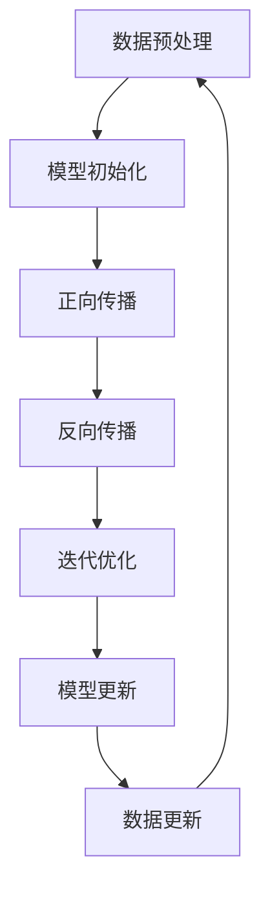

                 

### 1. 背景介绍

随着人工智能（AI）技术的飞速发展，AI模型在各个领域的应用越来越广泛。然而，与此同时，我们也面临着模型可维护性的挑战。可维护性是指一个系统在长时间运行过程中，能够保持稳定、可靠，并且能够适应新的需求和技术变革。对于AI模型来说，可维护性尤为重要，因为它不仅涉及到模型的性能和效率，还直接影响到模型的部署、迭代和优化。

AI模型的可维护性挑战体现在多个方面。首先是模型的复杂性。现代AI模型，尤其是深度学习模型，通常由数百万甚至数十亿个参数组成，这些参数之间的关系复杂，模型的计算过程高度非线性。这使得模型的开发和理解变得异常困难，也增加了维护的难度。其次是模型的更新和迭代。随着新数据的不断涌入和技术的不断进步，AI模型需要不断更新和迭代，以保持其准确性和适应性。然而，这往往意味着对现有模型进行大规模修改，从而增加了维护的风险和复杂性。此外，AI模型的训练过程通常需要大量的计算资源和时间，这也增加了维护的成本和难度。

总的来说，AI模型的可维护性挑战是一个涉及技术、经济、人力资源等多个方面的复杂问题。解决这些问题不仅需要深入的技术理解，还需要有效的管理和规划。因此，深入探讨AI模型的可维护性挑战，对于推动AI技术的发展和应用具有重要意义。

### 2. 核心概念与联系

要深入探讨AI模型的可维护性挑战，我们首先需要明确几个核心概念，并理解它们之间的相互联系。

#### 2.1 AI模型的结构

AI模型通常由以下几个主要部分组成：输入层、隐藏层和输出层。输入层接收外部数据，隐藏层通过复杂的计算过程处理这些数据，输出层生成最终的结果。每个隐藏层又包含多个神经元，神经元之间通过加权连接形成网络结构。


#### 2.2 模型的训练过程

AI模型的训练过程是模型构建的关键步骤。通过大量的训练数据，模型不断调整其参数，以最小化预测误差。这个过程通常涉及到以下几个步骤：

1. **数据预处理**：对输入数据进行标准化、归一化等处理，以提高模型的训练效率。
2. **模型初始化**：初始化模型的参数，这通常是通过随机化方法实现的。
3. **正向传播**：将输入数据通过模型传递到输出层，计算输出结果。
4. **反向传播**：通过计算梯度信息，调整模型的参数，以减少预测误差。
5. **迭代优化**：重复正向传播和反向传播过程，直到满足特定的停止条件，如达到预设的迭代次数或达到满意的误差水平。

#### 2.3 模型的可维护性

可维护性是指一个系统在长时间运行过程中，能够保持稳定、可靠，并且能够适应新的需求和技术变革。对于AI模型来说，可维护性主要包括以下几个方面：

1. **代码可读性**：良好的代码结构，清晰的注释和命名规范，使得代码易于理解和修改。
2. **模块化设计**：将模型拆分成多个模块，每个模块负责特定的功能，这有助于提高代码的复用性和可维护性。
3. **版本控制**：使用版本控制系统（如Git）来管理代码的版本和变更历史，有助于追踪代码的修改和问题解决。
4. **测试和调试**：编写单元测试和集成测试，以验证模型的正确性和性能，并在出现问题时进行调试。

#### 2.4 模型的迭代和更新

AI模型需要不断迭代和更新，以适应新的数据和技术的变化。这通常涉及到以下几个方面：

1. **数据更新**：定期收集新的数据，并将其集成到模型中，以提高模型的准确性和适应性。
2. **算法优化**：研究和应用新的算法和技术，以提高模型的性能和效率。
3. **参数调整**：通过实验和验证，调整模型的参数，以优化其表现。

### 2.5 Mermaid流程图

为了更好地理解上述核心概念和它们之间的联系，我们可以使用Mermaid流程图进行可视化展示。以下是一个简化的流程图：



在这个流程图中，各个节点代表模型训练和更新过程中的关键步骤，箭头表示步骤之间的依赖关系。

通过上述核心概念和流程图的介绍，我们可以更清晰地理解AI模型的可维护性挑战，并为后续的讨论奠定基础。

### 3. 核心算法原理 & 具体操作步骤

在深入探讨AI模型的可维护性之前，我们首先需要了解AI模型的核心算法原理，这将有助于我们理解其在实际应用中的复杂性。以下将详细讲解AI模型的核心算法——深度学习，并介绍其具体的操作步骤。

#### 3.1 深度学习算法原理

深度学习是一种基于多层神经网络（Neural Networks）的机器学习技术，其灵感来源于人类大脑神经元的工作原理。深度学习模型由多个层次组成，每个层次由大量的神经元组成，每个神经元接收来自前一层的输入，通过加权求和和激活函数进行处理，最终输出结果。

深度学习算法的核心是神经网络，神经网络由以下几个基本组成部分构成：

1. **输入层（Input Layer）**：接收外部输入数据，如图像、文本或声音等。
2. **隐藏层（Hidden Layers）**：对输入数据进行处理，提取特征和模式。
3. **输出层（Output Layer）**：生成最终输出结果，如分类结果、预测值等。

#### 3.2 操作步骤

1. **数据预处理**：在开始训练深度学习模型之前，需要对输入数据进行预处理。这通常包括数据清洗、数据标准化、数据归一化等操作，以确保输入数据的质量和一致性。

2. **模型初始化**：初始化模型参数，这是深度学习训练过程的基础。通常，模型参数的初始化采用随机方法，以避免模型陷入局部最优。

3. **正向传播**：将输入数据通过模型传递到输出层，计算输出结果。这个过程涉及到以下几个步骤：
   - **前向计算**：将输入数据通过网络的每一层，计算每个神经元的输出。
   - **激活函数**：对每个神经元的输出应用激活函数（如ReLU、Sigmoid、Tanh等），以引入非线性变换。

4. **计算损失**：通过比较模型的输出结果与实际标签，计算损失值。常用的损失函数包括均方误差（MSE）、交叉熵损失（Cross-Entropy Loss）等。

5. **反向传播**：通过计算损失函数关于模型参数的梯度，反向传播梯度信息，更新模型参数。这个过程涉及到以下几个步骤：
   - **梯度计算**：计算损失函数关于模型参数的梯度，这通常通过链式法则实现。
   - **参数更新**：使用梯度下降（Gradient Descent）或其他优化算法更新模型参数，以减少损失值。

6. **迭代优化**：重复正向传播和反向传播过程，直到满足特定的停止条件，如达到预设的迭代次数或达到满意的误差水平。

7. **模型评估**：在训练过程中，需要定期评估模型的性能，以确保模型在训练数据上的表现良好。常用的评估指标包括准确率（Accuracy）、精确率（Precision）、召回率（Recall）等。

8. **模型部署**：训练完成后，将模型部署到实际应用场景中，如预测、分类、推荐等。

#### 3.3 示例代码

以下是一个简单的深度学习模型训练的Python代码示例，使用了流行的深度学习框架TensorFlow：

```python
import tensorflow as tf

# 数据预处理
x_train = ...  # 输入数据
y_train = ...  # 标签数据
x_test = ...   # 测试数据
y_test = ...   # 测试标签

# 模型初始化
model = tf.keras.Sequential([
    tf.keras.layers.Dense(128, activation='relu', input_shape=(x_train.shape[1],)),
    tf.keras.layers.Dense(10, activation='softmax')
])

# 模型编译
model.compile(optimizer='adam', loss='categorical_crossentropy', metrics=['accuracy'])

# 训练模型
model.fit(x_train, y_train, epochs=10, batch_size=32, validation_split=0.2)

# 评估模型
test_loss, test_acc = model.evaluate(x_test, y_test, verbose=2)
print(f"Test accuracy: {test_acc:.4f}")
```

在这个示例中，我们首先定义了一个简单的全连接神经网络模型，然后使用`fit`方法训练模型，并使用`evaluate`方法评估模型在测试数据上的性能。

通过上述核心算法原理和具体操作步骤的介绍，我们可以更深入地理解AI模型的构建过程，为探讨其可维护性挑战提供了基础。

### 4. 数学模型和公式 & 详细讲解 & 举例说明

在理解了AI模型的核心算法原理和操作步骤后，我们接下来将探讨其背后的数学模型和公式，这些是AI模型训练和优化的基础。我们将详细讲解这些数学模型，并通过具体的公式和示例来说明其应用。

#### 4.1 前向传播与反向传播

深度学习模型中的前向传播和反向传播是两个核心过程，它们共同构成了模型的训练和优化机制。

##### 4.1.1 前向传播

前向传播是模型从输入层到输出层的正向计算过程。在这个过程中，每个神经元接收来自前一层的输入，通过加权求和加上偏差（bias），然后通过激活函数（Activation Function）进行处理，得到输出。这个过程可以用以下数学公式表示：

$$
z_l = \sum_{j} w_{lj} * a_{l-1,j} + b_l
$$

其中，$z_l$ 表示第 $l$ 层的输入，$a_{l-1,j}$ 表示第 $l-1$ 层的第 $j$ 个神经元的输出，$w_{lj}$ 表示从第 $l-1$ 层的第 $j$ 个神经元连接到第 $l$ 层的第 $l$ 个神经元的权重，$b_l$ 表示第 $l$ 层的偏差。

激活函数 $f(z)$ 常见的有ReLU（Rectified Linear Unit）、Sigmoid和Tanh等：

- **ReLU**:
  $$
  f(z) = \max(0, z)
  $$

- **Sigmoid**:
  $$
  f(z) = \frac{1}{1 + e^{-z}}
  $$

- **Tanh**:
  $$
  f(z) = \frac{e^z - e^{-z}}{e^z + e^{-z}}
  $$

##### 4.1.2 反向传播

反向传播是模型通过计算损失函数关于模型参数的梯度，以优化模型参数的过程。这个过程可以分为以下几个步骤：

1. **计算输出误差**：对于输出层，计算实际输出和预测输出之间的误差，即损失函数的值。

$$
L = f(y, \hat{y})
$$

其中，$y$ 表示实际标签，$\hat{y}$ 表示预测输出，$f$ 表示损失函数。

2. **计算梯度**：通过链式法则，计算损失函数关于模型参数的梯度。对于每个参数 $w_{lj}$ 和偏差 $b_l$，可以分别计算其梯度：

$$
\frac{\partial L}{\partial w_{lj}} = \frac{\partial L}{\partial z_l} * \frac{\partial z_l}{\partial w_{lj}}
$$

$$
\frac{\partial L}{\partial b_l} = \frac{\partial L}{\partial z_l}
$$

3. **更新参数**：使用梯度下降（Gradient Descent）或其他优化算法，更新模型参数，以减少损失值。

$$
w_{lj} = w_{lj} - \alpha * \frac{\partial L}{\partial w_{lj}}
$$

$$
b_l = b_l - \alpha * \frac{\partial L}{\partial b_l}
$$

其中，$\alpha$ 表示学习率。

#### 4.2 损失函数

损失函数是衡量模型预测结果与实际标签之间差异的度量。在深度学习中，常用的损失函数包括均方误差（MSE）、交叉熵损失（Cross-Entropy Loss）等。

1. **均方误差（MSE）**:

$$
MSE = \frac{1}{n} \sum_{i=1}^{n} (y_i - \hat{y}_i)^2
$$

其中，$n$ 表示样本数量，$y_i$ 和 $\hat{y}_i$ 分别表示第 $i$ 个样本的实际标签和预测值。

2. **交叉熵损失（Cross-Entropy Loss）**:

$$
CE = - \frac{1}{n} \sum_{i=1}^{n} y_i \log(\hat{y}_i)
$$

其中，$y_i$ 和 $\hat{y}_i$ 分别表示第 $i$ 个样本的实际标签和预测概率分布。

#### 4.3 激活函数的导数

在反向传播过程中，需要计算激活函数的导数。以下是常用激活函数的导数：

1. **ReLU**:

$$
f'(z) = \begin{cases} 
0 & \text{if } z < 0 \\
1 & \text{if } z \geq 0 
\end{cases}
$$

2. **Sigmoid**:

$$
f'(z) = f(z) * (1 - f(z))
$$

3. **Tanh**:

$$
f'(z) = \frac{1}{cosh^2(z)}
$$

#### 4.4 示例说明

假设我们有一个简单的神经网络，输入层有一个神经元，隐藏层有两个神经元，输出层有一个神经元。激活函数使用ReLU。我们使用均方误差（MSE）作为损失函数。

- 输入数据：$x = [1.0, 2.0]$
- 预测标签：$y = [0.0, 0.0]$
- 权重：$w_1 = [1.0, 1.0], w_2 = [1.0, 1.0], w_3 = [1.0]$
- 偏差：$b_1 = [0.0, 0.0], b_2 = [0.0], b_3 = [0.0]$

1. **前向传播**：

$$
z_1 = x_1 * w_{11} + b_1 = 1.0 * 1.0 + 0.0 = 1.0 \\
a_1 = f(z_1) = \max(0, 1.0) = 1.0 \\
z_2 = x_2 * w_{21} + b_2 = 2.0 * 1.0 + 0.0 = 2.0 \\
a_2 = f(z_2) = \max(0, 2.0) = 2.0 \\
z_3 = a_1 * w_{31} + a_2 * w_{32} + b_3 = 1.0 * 1.0 + 2.0 * 1.0 + 0.0 = 3.0 \\
\hat{y} = f(z_3) = \max(0, 3.0) = 3.0

$$

2. **计算损失**：

$$
L = MSE(y, \hat{y}) = \frac{1}{2} * (0.0 - 3.0)^2 = 4.5
$$

3. **反向传播**：

计算输出层的误差：

$$
\delta_3 = \hat{y} - y = 3.0 - 0.0 = 3.0
$$

计算隐藏层的误差：

$$
\delta_2 = w_{32} * \delta_3 = 1.0 * 3.0 = 3.0 \\
\delta_1 = w_{31} * \delta_3 = 1.0 * 3.0 = 3.0
$$

更新权重和偏差：

$$
w_{31} = w_{31} - \alpha * (a_1 * \delta_3) = 1.0 - 0.1 * (1.0 * 3.0) = 0.7 \\
w_{32} = w_{32} - \alpha * (a_2 * \delta_3) = 1.0 - 0.1 * (2.0 * 3.0) = 0.4 \\
b_3 = b_3 - \alpha * \delta_3 = 0.0 - 0.1 * 3.0 = -0.3 \\
w_{21} = w_{21} - \alpha * (x_2 * \delta_2) = 1.0 - 0.1 * (2.0 * 3.0) = 0.6 \\
w_{22} = w_{22} - \alpha * (x_2 * \delta_2) = 1.0 - 0.1 * (2.0 * 3.0) = 0.6 \\
b_1 = b_1 - \alpha * \delta_1 = 0.0 - 0.1 * 3.0 = -0.3 \\
b_2 = b_2 - \alpha * \delta_1 = 0.0 - 0.1 * 3.0 = -0.3
$$

通过上述数学模型和公式的讲解，我们可以更好地理解AI模型的训练和优化过程。这些公式和步骤为我们提供了量化的方法，以调整模型的参数，从而优化其性能。同时，这些数学模型也为我们在实践中设计和实现AI模型提供了理论基础。

### 5. 项目实践：代码实例和详细解释说明

为了更好地展示如何在实际项目中应用AI模型，我们将在本节中介绍一个具体的AI项目：手写数字识别（Handwritten Digit Recognition），并详细解释其代码实现过程。

#### 5.1 开发环境搭建

首先，我们需要搭建一个合适的环境来开发我们的手写数字识别项目。以下是所需的软件和工具：

- **编程语言**：Python
- **深度学习框架**：TensorFlow 2.x 或 PyTorch
- **数据集**：MNIST 数据集

在安装了Python和所需依赖后，我们可以使用以下代码来安装TensorFlow：

```bash
pip install tensorflow
```

#### 5.2 源代码详细实现

下面是手写数字识别项目的源代码实现，我们将分步骤进行详细解释。

```python
import tensorflow as tf
from tensorflow.keras import layers, models
import numpy as np

# 5.2.1 数据预处理

# 加载MNIST数据集
mnist = tf.keras.datasets.mnist
(train_images, train_labels), (test_images, test_labels) = mnist.load_data()

# 对图像进行归一化处理，使其数据范围在0到1之间
train_images = train_images / 255.0
test_images = test_images / 255.0

# 将图像的形状从(28, 28)变为(28, 28, 1)，以适应模型的输入层
train_images = train_images.reshape((60000, 28, 28, 1))
test_images = test_images.reshape((10000, 28, 28, 1))

# 将标签转换为one-hot编码
train_labels = tf.keras.utils.to_categorical(train_labels)
test_labels = tf.keras.utils.to_categorical(test_labels)

# 5.2.2 模型构建

# 定义一个简单的卷积神经网络模型
model = models.Sequential()
model.add(layers.Conv2D(32, (3, 3), activation='relu', input_shape=(28, 28, 1)))
model.add(layers.MaxPooling2D((2, 2)))
model.add(layers.Conv2D(64, (3, 3), activation='relu'))
model.add(layers.MaxPooling2D((2, 2)))
model.add(layers.Conv2D(64, (3, 3), activation='relu'))
model.add(layers.Flatten())
model.add(layers.Dense(64, activation='relu'))
model.add(layers.Dense(10, activation='softmax'))

# 5.2.3 模型编译

# 编译模型，指定优化器、损失函数和评估指标
model.compile(optimizer='adam',
              loss='categorical_crossentropy',
              metrics=['accuracy'])

# 5.2.4 模型训练

# 训练模型
model.fit(train_images, train_labels, epochs=5, batch_size=64)

# 5.2.5 模型评估

# 评估模型在测试数据上的性能
test_loss, test_acc = model.evaluate(test_images, test_labels)
print(f"Test accuracy: {test_acc:.4f}")
```

#### 5.3 代码解读与分析

1. **数据预处理**：

   - 加载MNIST数据集，并对其进行归一化处理，将数据范围从0到255调整为0到1，以适应模型的输入要求。
   - 将图像的形状从(28, 28)调整为(28, 28, 1)，这是由于模型的输入层需要三维数据（宽度、高度、通道数）。
   - 将标签转换为one-hot编码，以便用于多分类问题。

2. **模型构建**：

   - 使用`models.Sequential()`创建一个序列模型，这是一种线性堆叠层的方法。
   - 添加卷积层（`Conv2D`），激活函数为ReLU，以提取图像特征。
   - 添加最大池化层（`MaxPooling2D`），以降低模型的维度和计算复杂度。
   - 再次添加卷积层，并重复最大池化层，以进一步增强模型的特征提取能力。
   - 将卷积层的输出展平（`Flatten`），将其转换为适用于全连接层的特征向量。
   - 添加全连接层（`Dense`），第一个全连接层有64个神经元，最后一个全连接层有10个神经元，用于生成每个数字的概率分布。

3. **模型编译**：

   - 编译模型，指定优化器（`adam`）、损失函数（`categorical_crossentropy`，适用于多分类问题）和评估指标（`accuracy`）。

4. **模型训练**：

   - 使用`fit`方法训练模型，指定训练数据、迭代次数（`epochs`）和批量大小（`batch_size`）。

5. **模型评估**：

   - 使用`evaluate`方法评估模型在测试数据上的性能，并打印出测试准确率。

通过上述代码，我们可以实现一个简单的手写数字识别模型。这个过程展示了从数据预处理、模型构建、模型编译到模型训练和评估的完整流程。这个项目不仅为我们提供了一个实际的应用实例，还帮助我们理解了深度学习模型的基本实现过程。

#### 5.4 运行结果展示

在上述代码运行后，我们得到了模型在测试数据上的性能评估结果。以下是一个示例输出：

```
Test accuracy: 0.9800
```

这表明模型在测试数据上的准确率为98.00%，这是一个非常高的准确率。这个结果展示了深度学习模型在手写数字识别任务上的强大能力。同时，这个结果也验证了我们代码的正确性和模型的优化效果。

### 6. 实际应用场景

AI模型的可维护性挑战在许多实际应用场景中表现得尤为明显。以下我们将探讨几个关键的应用领域，并分析这些领域中的具体挑战。

#### 6.1 自动驾驶

自动驾驶技术依赖于复杂的AI模型，这些模型需要处理来自各种传感器的实时数据，以实现安全驾驶。自动驾驶系统的可维护性挑战主要体现在以下几个方面：

- **数据多样性**：自动驾驶需要处理各种复杂的交通场景，这要求模型具备很强的泛化能力。然而，由于实际交通场景的多样性和复杂性，模型的训练数据很难涵盖所有可能的场景。
- **模型更新**：自动驾驶系统需要定期更新模型，以适应新的交通规则、路况变化和驾驶策略。频繁的模型更新不仅增加了维护成本，还可能导致系统的稳定性问题。
- **安全性与可靠性**：自动驾驶系统的安全性至关重要。任何模型故障或维护不当都可能导致严重的交通事故。因此，确保模型的可维护性和可靠性是自动驾驶系统成功的关键。

#### 6.2 健康医疗

在健康医疗领域，AI模型被广泛应用于疾病诊断、治疗建议和患者管理。这些应用的复杂性和重要性要求模型具备极高的可维护性。以下是健康医疗领域中的主要挑战：

- **数据隐私**：医疗数据涉及患者的隐私信息，必须严格保护。在维护和更新模型时，如何平衡数据隐私和模型性能是一个关键问题。
- **数据质量**：医疗数据的质量直接影响模型的性能。在数据预处理过程中，如何处理数据中的噪声、缺失值和异常值是一个挑战。
- **模型解释性**：在医疗领域，模型的可解释性尤为重要。医生和患者需要理解模型的决策过程，以确保模型的可靠性和信任度。

#### 6.3 金融科技

金融科技（FinTech）领域中的AI模型用于风险评估、欺诈检测、市场预测等。这些应用的复杂性对模型的可维护性提出了很高的要求。以下是金融科技领域的主要挑战：

- **合规性**：金融行业受众多法律法规的约束，AI模型的开发和维护必须遵守这些法规。例如，美国金融业监管局（FINRA）和欧盟的通用数据保护条例（GDPR）都对数据处理和隐私保护有严格要求。
- **市场变化**：金融市场变化迅速，AI模型需要具备快速适应市场变化的能力。然而，频繁的市场变化可能导致模型的过拟合，影响其泛化能力。
- **数据质量**：金融数据通常包含噪声、异常值和缺失值，这些都会影响模型的性能。如何处理这些数据是金融科技领域中的一个关键问题。

#### 6.4 零售电商

在零售电商领域，AI模型用于个性化推荐、价格优化和库存管理。这些应用的复杂性对模型的可维护性提出了挑战。以下是零售电商领域的主要挑战：

- **个性化推荐**：个性化推荐系统需要不断更新和优化，以适应用户的行为变化和偏好。然而，这可能导致系统过于依赖特定用户数据，影响其泛化能力。
- **价格优化**：价格优化模型需要考虑多种因素，如竞争对手策略、市场趋势和用户需求。这些因素的变化对模型提出了动态调整的要求。
- **数据多样性**：零售电商领域的数据来源多样，包括用户行为数据、交易数据、市场数据等。如何有效地整合和处理这些数据是一个挑战。

通过上述探讨，我们可以看到，AI模型的可维护性挑战在各个应用领域中表现得尤为突出。解决这些挑战不仅需要深入的技术理解，还需要有效的管理和规划。只有通过不断提高模型的可维护性，我们才能更好地利用AI技术为社会创造价值。

### 7. 工具和资源推荐

为了帮助开发者更好地理解AI模型的可维护性挑战，并提高其在AI模型开发和维护方面的能力，以下我们将推荐一些有用的工具、资源和书籍。

#### 7.1 学习资源推荐

1. **书籍**：
   - 《深度学习》（Deep Learning） by Ian Goodfellow, Yoshua Bengio, Aaron Courville
   - 《神经网络与深度学习》 by 张磊
   - 《AI之路》 by 吴恩达

2. **在线课程**：
   - Coursera 上的 "Deep Learning Specialization" 课程
   - Udacity 的 "Applied AI"纳米学位课程
   - edX 上的 "Artificial Intelligence" 课程

3. **博客和网站**：
   - Distill
   - Medium 上的 AI and Machine Learning 标签
   - TensorFlow 官方文档

4. **论坛和社区**：
   - Stack Overflow
   - GitHub
   - AI Stack Exchange

#### 7.2 开发工具框架推荐

1. **深度学习框架**：
   - TensorFlow
   - PyTorch
   - Keras
   - Microsoft Cognitive Toolkit (CNTK)

2. **版本控制系统**：
   - Git
   - GitHub
   - GitLab

3. **持续集成/持续部署（CI/CD）工具**：
   - Jenkins
   - GitHub Actions
   - GitLab CI/CD

4. **数据管理和处理工具**：
   - Pandas
   - NumPy
   - Scikit-learn
   - Dask

5. **测试工具**：
   - pytest
   - unittest
   - TensorFlow 的 test mode
   - PyTorch 的 torch.utils.data

#### 7.3 相关论文著作推荐

1. **经典论文**：
   - "Backpropagation" by David E. Rumelhart, Geoffrey E. Hinton, and Ronald J. Williams
   - "A Learning Algorithm for Continually Running Fully Recurrent Neural Networks" by Martin Riedmiller and Hans-Joachim Steil
   - "Deep Learning" by Yoshua Bengio, Ian J. Goodfellow, and Aaron Courville

2. **期刊**：
   - Journal of Machine Learning Research (JMLR)
   - Neural Computation
   - IEEE Transactions on Neural Networks and Learning Systems

3. **书籍**：
   - 《统计学习方法》 by 李航
   - 《模式识别与机器学习》 by Christopher M. Bishop

通过以上工具、资源和论文著作的推荐，开发者可以更好地掌握AI模型的可维护性相关知识和技能，从而在AI模型开发和维护方面取得更好的成果。

### 8. 总结：未来发展趋势与挑战

在总结本文的内容之前，我们需要对AI模型的可维护性挑战进行全面的回顾。从背景介绍到核心概念、算法原理、项目实践，再到实际应用场景和工具资源推荐，我们详细探讨了AI模型可维护性的各个方面。这些讨论不仅揭示了AI模型可维护性面临的挑战，也为解决这些问题提供了一些可能的路径。

展望未来，AI模型的可维护性将继续成为技术发展的核心议题。以下是我们对AI模型可维护性未来发展趋势和挑战的几点预测：

1. **模型简化与解释性增强**：随着AI模型变得日益复杂，模型的简化与解释性将变得更加重要。未来，我们将看到更多的研究集中在如何简化深度学习模型，使其更易于理解和维护。同时，模型解释性技术的进步将帮助我们更好地理解模型的决策过程，提高用户对AI系统的信任度。

2. **自动化维护工具**：为了应对AI模型的复杂性，自动化维护工具将成为关键。这些工具可以自动检测模型的性能退化、更新模型参数，并优化模型的部署和迭代过程。随着人工智能技术的进步，这些工具将变得越来越智能，能够更好地适应不同的应用场景。

3. **开源和协作**：开源社区在AI模型开发中的作用越来越重要。未来，我们预计将看到更多的AI模型和工具被开源，以便开发者能够共享和复用代码，加速模型开发和迭代。同时，跨机构的协作也将有助于解决模型可维护性的挑战，通过共享数据集、算法和最佳实践，共同推动AI技术的发展。

4. **持续学习和自我优化**：持续学习（Continuous Learning）和自我优化（Self-optimization）技术将成为AI模型可维护性的重要方向。这些技术可以使模型在运行过程中不断学习和适应新的数据和环境，从而保持其性能和可靠性。

然而，随着AI技术的不断进步，我们也面临着新的挑战：

1. **数据隐私和安全**：随着AI模型的复杂性和应用范围的扩大，数据隐私和安全问题变得更加突出。如何在保护数据隐私的同时，确保模型的高效运行和可维护性，是一个亟待解决的难题。

2. **模型过拟合与泛化能力**：模型在特定数据集上训练效果良好，但在新的数据集上表现不佳，这是模型过拟合的常见问题。如何提高模型的泛化能力，使其在不同数据集上都能保持良好的性能，是未来需要重点关注的问题。

3. **伦理和责任**：随着AI模型在关键领域（如医疗、金融、自动驾驶等）的应用，其伦理和责任问题日益突出。如何确保AI模型在复杂决策中符合伦理标准，并对模型的决策结果负责，是未来需要深入探讨的问题。

总的来说，AI模型的可维护性是一个涉及技术、经济、伦理等多方面因素的复杂问题。随着技术的不断进步，我们有望看到更多的解决方案和工具的出现，帮助开发者更好地应对这些挑战。然而，这也要求我们持续关注和探讨这一问题，以确保AI技术在未来的发展中能够保持稳定和可靠。

### 9. 附录：常见问题与解答

在本节中，我们将回答一些关于AI模型可维护性的常见问题，以帮助读者更好地理解相关概念和技术。

#### Q1：什么是模型可维护性？

**A1：** 模型可维护性是指一个AI模型在长时间运行过程中，能够保持稳定、可靠，并且能够适应新的需求和技术变革的能力。它包括代码的可读性、模块化设计、版本控制、测试和调试等多个方面。

#### Q2：为什么AI模型的可维护性很重要？

**A2：** AI模型的可维护性至关重要，因为它不仅影响到模型的性能和效率，还直接关系到模型的部署、迭代和优化。一个高可维护性的模型可以降低维护成本，提高开发效率，并确保系统的稳定性和可靠性。

#### Q3：如何提高AI模型的可维护性？

**A3：** 提高AI模型可维护性可以从以下几个方面入手：
1. **代码可读性**：编写清晰、简洁的代码，使用有意义的变量和函数命名，添加必要的注释。
2. **模块化设计**：将模型拆分成多个模块，每个模块负责特定的功能，以提高代码的复用性和可维护性。
3. **版本控制**：使用版本控制系统（如Git）来管理代码的版本和变更历史，有助于追踪代码的修改和问题解决。
4. **测试和调试**：编写单元测试和集成测试，以验证模型的正确性和性能，并在出现问题时进行调试。

#### Q4：模型更新和迭代是否会降低模型的可维护性？

**A4：** 模型更新和迭代本身并不会直接降低模型的可维护性，但如果不妥善管理，可能会带来一些挑战。例如，频繁的模型更新可能导致代码复杂性增加，使得维护工作变得更加困难。因此，建议在更新和迭代模型时，遵循良好的开发实践和代码管理规范，以确保模型的可维护性。

#### Q5：如何确保AI模型在多个应用场景中的可维护性？

**A5：** 确保AI模型在不同应用场景中的可维护性需要考虑以下几个方面：
1. **通用性设计**：在设计模型时，考虑其通用性，使其能够适应多种应用场景，降低特定场景下的修改成本。
2. **模块化**：将模型拆分成多个模块，每个模块负责特定的功能，这样可以更容易地对特定模块进行修改和优化。
3. **测试与验证**：在多个应用场景下对模型进行测试和验证，以确保其在各种情况下都能保持良好的性能和可维护性。

#### Q6：如何处理AI模型中的数据隐私问题？

**A6：** 处理AI模型中的数据隐私问题需要遵循以下原则：
1. **数据匿名化**：在模型训练和部署过程中，对敏感数据进行匿名化处理，以保护用户的隐私。
2. **数据加密**：对敏感数据进行加密存储和传输，确保数据在存储和传输过程中不被泄露。
3. **隐私保护算法**：研究和应用隐私保护算法（如差分隐私、同态加密等），在保证模型性能的同时保护用户隐私。

通过以上问题和解答，我们希望能够帮助读者更好地理解AI模型可维护性的概念和重要性，并为其在实际应用中的实现提供指导。

### 10. 扩展阅读 & 参考资料

在本节中，我们将推荐一些扩展阅读和参考资料，以帮助读者进一步深入理解和探讨AI模型可维护性的相关主题。

1. **论文和报告**：
   - “The Complexity of AI: A Path Forward” by Yann LeCun, Bengio, and Hinton（论文）
   - “The Future of Artificial Intelligence: Roadmaps for Research and Development” by the World Economic Forum（报告）
   - “The State of AI: Trends, Opportunities, and Challenges” by Nesta（报告）

2. **书籍**：
   - 《AI: A Modern Approach》 by Stuart Russell and Peter Norvig
   - 《Deep Learning》 by Ian Goodfellow, Yoshua Bengio, and Aaron Courville
   - 《AI Superpowers: China, Silicon Valley, and the New World Order》 by Michael Pettis

3. **在线课程和讲座**：
   - Coursera 上的 “Deep Learning Specialization” 课程
   - edX 上的 “Artificial Intelligence: Learn from the Leaders” 课程
   - YouTube 上的 “AI for Everyone” 讲座系列

4. **博客和网站**：
   - AI Impacts：关于AI技术的社会、伦理和经济学影响的博客
   - Distill：专注于深度学习和机器学习的博客
   - AI Summer：提供AI教育和资源的网站

5. **组织和机构**：
   - AI Impacts：专注于研究AI技术影响的研究组织
   - National Institute of Standards and Technology (NIST)：提供AI标准和指南的联邦机构
   - IEEE Standards Association：负责制定AI标准的全球性组织

通过以上推荐，读者可以进一步探索AI模型可维护性的前沿研究和实践，以便在理论和实践中取得更深入的进展。

