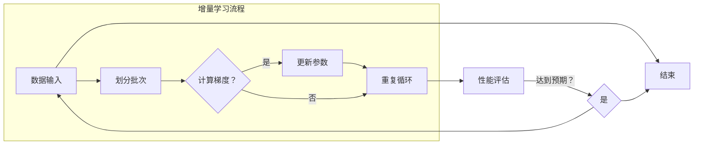
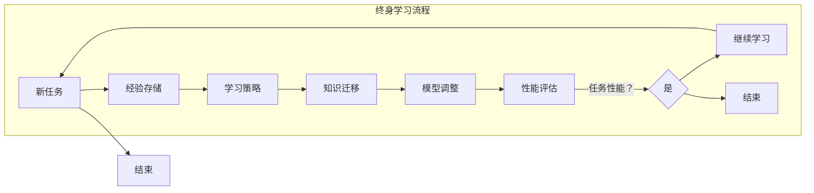

                 

### 背景介绍

#### AI模型的增量学习

在当今人工智能时代，模型的增量学习（Incremental Learning）成为了一个备受关注的研究领域。随着大数据的爆炸性增长，传统的批处理（batch learning）方法逐渐暴露出其不足。批处理方法需要将所有数据一次性加载到内存中，导致模型训练需要大量的时间和计算资源。而增量学习则通过逐批添加数据来训练模型，能够更加高效地处理大量数据。

增量学习的核心在于如何在不重新训练整个模型的情况下，更新已有模型的参数。这不仅可以节省计算资源，还能使模型适应不断变化的环境。例如，在在线推荐系统中，用户的偏好可能会随着时间而改变，增量学习可以帮助系统动态地更新推荐结果。

#### 终身学习

终身学习（Lifelong Learning）是另一个备受关注的领域，它探讨了如何使机器学习模型具备持续学习和适应新任务的能力。在传统机器学习模型中，一旦一个模型训练完成并部署，它就很难适应新的数据或任务。而终身学习试图解决这个问题，通过设计能够不断适应新环境的模型，提高模型的泛化能力和适应性。

终身学习的实现可以分为几种策略，包括经验重放（Experience Replay）、模型迁移（Model Transfer）和多任务学习（Multi-Task Learning）等。这些策略旨在使模型能够在不断的学习过程中保持其性能，而不是随着时间推移而逐渐退化。

#### 增量学习与终身学习的关系

增量学习和终身学习在本质上都是为了解决机器学习模型在面对动态环境时的适应性问题。增量学习关注的是如何在已有模型的基础上更新参数，而终身学习则更广泛地探讨如何使模型能够持续地学习和适应新任务。

两者之间的关系可以看作是相辅相成的。增量学习是实现终身学习的一种方式，它提供了在模型训练过程中不断更新的机制。而终身学习则通过引入多种策略，使模型能够更有效地利用增量学习的结果，从而提高其整体性能。

综上所述，AI模型的增量学习和终身学习是当前人工智能研究中的重要方向。它们不仅能够提高模型的训练效率，还能使其更好地适应动态环境。随着技术的不断进步，这些方法有望在更多的应用场景中发挥重要作用。

#### 问题的提出

尽管AI模型的增量学习和终身学习在理论上具有巨大潜力，但在实际应用中仍面临诸多挑战。首先，如何高效地更新模型参数成为关键问题。在增量学习中，每次更新都需要计算大量梯度，这不仅消耗大量的计算资源，还会导致模型训练时间显著增加。因此，如何设计高效的梯度计算方法，是增量学习需要解决的首要问题。

其次，模型更新后的稳定性和泛化能力也是重要的挑战。增量学习可能导致模型参数的细微变化，这些变化可能影响模型的稳定性和泛化能力。因此，如何保证模型在持续更新过程中保持良好的性能，是增量学习需要深入探讨的问题。

在终身学习方面，如何平衡新任务学习和已有任务保持之间的矛盾也是一个关键挑战。终身学习模型需要在不断学习新任务的同时，保持对已有任务的熟悉和掌握。这要求模型具有高度的灵活性和适应性，能够在多个任务之间进行平衡。

此外，数据隐私和安全也是一个不容忽视的问题。在动态环境中，模型需要不断更新和适应，这可能导致敏感数据泄露的风险增加。如何在保证数据隐私和安全的前提下进行模型更新和终身学习，是当前研究的一个重要方向。

综上所述，AI模型的增量学习和终身学习虽然具有巨大潜力，但在实际应用中仍面临诸多挑战。解决这些问题需要多方面的研究和探索，包括算法设计、模型优化、安全性保障等。只有在这些挑战得到有效解决后，AI模型的增量学习和终身学习才能真正发挥其潜力，为人工智能的发展带来新的突破。

### 核心概念与联系

要深入探讨AI模型的增量学习和终身学习，首先需要明确这两个概念的核心原理及其相互联系。在本节中，我们将详细阐述增量学习和终身学习的基本概念，并借助Mermaid流程图展示其架构和流程。

#### 增量学习（Incremental Learning）

增量学习是指在不重新训练整个模型的情况下，通过逐批添加新数据来更新模型参数的过程。其核心思想是将大量数据分成多个批次，每个批次包含一定数量的数据样本。模型会针对每个批次的数据计算梯度，并根据梯度更新模型参数。

##### 增量学习的核心原理

1. **在线学习（Online Learning）**：与批处理学习（Batch Learning）相比，增量学习是一种在线学习方式。它能够实时更新模型，使模型能够快速适应数据的变化。
2. **参数更新（Parameter Update）**：增量学习通过计算每个批次的梯度来更新模型参数。每次更新都是基于当前已有的模型参数，因此模型可以逐批地微调，而不需要从头开始训练。
3. **记忆机制（Memory Mechanism）**：增量学习通常需要一种记忆机制来存储已经处理过的数据。这种机制可以防止重复计算相同的梯度，从而提高训练效率。

##### 增量学习的架构

增量学习的架构可以简化为以下步骤：

1. **数据输入**：将新数据输入模型，并划分成多个批次。
2. **梯度计算**：针对每个批次的数据，计算梯度。
3. **参数更新**：使用计算出的梯度更新模型参数。
4. **重复循环**：重复上述步骤，直到模型达到预期的性能水平或数据集处理完毕。

以下是增量学习的Mermaid流程图表示：



#### 终身学习（Lifelong Learning）

终身学习是指机器学习模型在生命期内持续学习新任务并保持已有任务性能的能力。其核心思想是使模型能够在不断变化的环境中保持其适应性和鲁棒性。

##### 终身学习的核心原理

1. **经验积累（Experience Accumulation）**：终身学习模型通过不断积累经验来提高其性能。每次学习新任务时，模型都会将新经验与已有经验相结合，从而提高对新任务的适应能力。
2. **知识迁移（Knowledge Transfer）**：终身学习模型通过知识迁移机制将已有任务的知识应用于新任务。这有助于减少新任务的训练时间，提高模型的泛化能力。
3. **动态调整（Dynamic Adjustment）**：终身学习模型需要具备动态调整能力，以适应不断变化的环境。这包括调整模型参数、选择学习策略等。

##### 终身学习的架构

终身学习的架构通常包括以下几个关键组件：

1. **经验存储（Experience Storage）**：用于存储模型在各个任务中积累的经验。
2. **学习策略（Learning Strategy）**：包括任务选择策略、经验重放策略等，用于指导模型的终身学习过程。
3. **性能评估（Performance Evaluation）**：用于评估模型在每个任务上的性能，以指导模型调整学习策略。

以下是终身学习的Mermaid流程图表示：



#### 增量学习与终身学习的联系

增量学习和终身学习在目标上具有一致性，即都是为了使模型能够适应动态环境。增量学习通过逐批更新模型参数，实现了在动态环境下的实时适应。而终身学习则通过积累经验、知识迁移和动态调整，使模型能够长期保持其适应性和鲁棒性。

两者的联系可以总结为以下几点：

1. **数据更新**：增量学习是终身学习的重要组成部分，它提供了在动态环境中实时更新模型参数的方法。
2. **经验积累**：终身学习依赖于增量学习积累的数据和经验，从而能够持续提高模型的性能。
3. **策略优化**：终身学习通过优化学习策略，结合增量学习的实时更新，实现了更高效的模型训练。

通过上述分析，我们可以看到，增量学习和终身学习在人工智能领域具有广泛的应用前景。它们不仅能够提高模型的训练效率和适应性，还能使模型在长期环境中保持其性能。随着技术的不断进步，这些方法将在更多应用场景中发挥重要作用，推动人工智能的持续发展。

### 核心算法原理 & 具体操作步骤

#### 增量学习的核心算法原理

增量学习依赖于在线学习（Online Learning）算法，其核心在于如何高效地更新模型参数。以下是增量学习的核心算法原理：

1. **梯度下降（Gradient Descent）**：梯度下降是一种最常用的优化算法，用于计算模型参数的更新方向。每次更新都是基于当前梯度，以最小化损失函数。
2. **梯度更新（Gradient Update）**：增量学习通过计算每个批次的梯度来更新模型参数。更新公式为：
   $$
   \theta = \theta - \alpha \cdot \nabla_{\theta} J(\theta)
   $$
   其中，$\theta$ 是模型参数，$\alpha$ 是学习率，$J(\theta)$ 是损失函数。
3. **动态学习率（Dynamic Learning Rate）**：为了提高训练效率，增量学习通常采用动态学习率。动态学习率可以根据模型性能自动调整，以避免过拟合或欠拟合。

#### 增量学习的具体操作步骤

以下是增量学习的具体操作步骤：

1. **数据预处理**：将数据集划分成多个批次，每个批次包含一定数量的数据样本。
2. **初始化模型参数**：随机初始化模型参数。
3. **计算梯度**：对于每个批次的数据，计算梯度 $\nabla_{\theta} J(\theta)$。
4. **更新参数**：使用计算出的梯度更新模型参数，公式为 $\theta = \theta - \alpha \cdot \nabla_{\theta} J(\theta)$。
5. **重复循环**：重复步骤 3 和 4，直到模型达到预期的性能水平或数据集处理完毕。
6. **性能评估**：评估模型在每个批次上的性能，以调整学习策略和动态学习率。

#### 终身学习的核心算法原理

终身学习依赖于多种算法和技术，以实现模型在长期环境下的持续学习和适应。以下是终身学习的核心算法原理：

1. **经验重放（Experience Replay）**：经验重放是一种记忆机制，用于存储和重放已处理过的数据样本。这有助于避免重复计算相同的梯度，提高训练效率。
2. **模型迁移（Model Transfer）**：模型迁移是指将已有任务的知识应用于新任务。通过迁移学习，模型可以快速适应新任务，减少训练时间。
3. **多任务学习（Multi-Task Learning）**：多任务学习通过同时学习多个任务，提高模型的泛化能力和适应性。多任务学习可以通过共享模型参数或独立训练不同任务来实现。
4. **动态调整（Dynamic Adjustment）**：动态调整是指根据模型性能和任务变化，实时调整模型参数和学习策略。

#### 终身学习的具体操作步骤

以下是终身学习的具体操作步骤：

1. **初始化模型**：随机初始化模型参数。
2. **经验存储**：将模型在各个任务中积累的经验存储在经验库中。
3. **任务选择**：根据当前环境和任务需求，选择需要学习的任务。
4. **经验重放**：从经验库中随机抽取样本，进行重放和训练。
5. **模型迁移**：将已有任务的知识迁移到新任务中，加快新任务的训练过程。
6. **多任务学习**：同时学习多个任务，提高模型的泛化能力。
7. **动态调整**：根据模型性能和任务变化，实时调整模型参数和学习策略。
8. **性能评估**：评估模型在每个任务上的性能，以指导后续学习过程。

通过上述步骤，我们可以看到，增量学习和终身学习在算法原理上具有一定的相似性，都依赖于在线学习和动态调整。然而，终身学习更加强调经验积累和知识迁移，使模型能够在长期环境中保持其适应性和鲁棒性。

在实际应用中，增量学习和终身学习可以结合使用，以实现更高效的模型训练和动态适应。例如，在在线推荐系统中，可以使用增量学习实时更新推荐模型，同时使用终身学习积累用户的历史行为数据，提高推荐系统的准确性和适应性。

总之，增量学习和终身学习是当前人工智能领域的重要研究方向，它们为机器学习模型在动态环境下的适应提供了有效的方法。随着技术的不断进步，这些方法将在更多应用场景中发挥重要作用，推动人工智能的持续发展。

### 数学模型和公式 & 详细讲解 & 举例说明

在深入了解增量学习和终身学习的过程中，数学模型和公式起到了关键作用。这些模型和公式不仅帮助我们理解算法的基本原理，还能指导我们在实际应用中优化模型的性能。在本节中，我们将详细讲解增量学习和终身学习中的核心数学模型和公式，并通过具体实例进行说明。

#### 增量学习的数学模型

增量学习的核心在于如何利用梯度下降算法高效地更新模型参数。以下是增量学习中的几个关键数学模型和公式：

1. **梯度下降公式**：
   $$
   \theta = \theta - \alpha \cdot \nabla_{\theta} J(\theta)
   $$
   其中，$\theta$ 是模型参数，$\alpha$ 是学习率，$\nabla_{\theta} J(\theta)$ 是损失函数关于参数 $\theta$ 的梯度。

2. **动态学习率**：
   $$
   \alpha(t) = \alpha_0 / (1 + t \cdot \beta)
   $$
   其中，$\alpha(t)$ 是时间 $t$ 时的学习率，$\alpha_0$ 是初始学习率，$\beta$ 是衰减系数。动态学习率可以根据训练时间逐步减小，以避免过拟合。

3. **批次大小**：
   $$
   \text{batch\_size} = \frac{\text{total\_samples}}{n}
   $$
   其中，$\text{total\_samples}$ 是数据集的总样本数，$n$ 是批次大小。批次大小决定了每次梯度下降过程中使用的样本数量。

#### 增量学习的实例

假设我们有一个线性回归模型，其损失函数为：
$$
J(\theta) = \frac{1}{2} \sum_{i=1}^{n} (y_i - \theta_0 x_i - \theta_1)^2
$$
其中，$y_i$ 是实际输出，$x_i$ 是输入特征，$\theta_0$ 和 $\theta_1$ 是模型参数。

我们使用梯度下降算法来更新模型参数：
1. 初始化模型参数 $\theta_0 = 0, \theta_1 = 0$。
2. 选择批次大小 $n = 10$，数据集共有 100 个样本。
3. 对于每个批次，计算梯度：
   $$
   \nabla_{\theta_0} J(\theta) = \sum_{i=1}^{n} (y_i - \theta_0 x_i - \theta_1) x_i
   $$
   $$
   \nabla_{\theta_1} J(\theta) = \sum_{i=1}^{n} (y_i - \theta_0 x_i - \theta_1)
   $$
4. 更新模型参数：
   $$
   \theta_0 = \theta_0 - \alpha \cdot \nabla_{\theta_0} J(\theta)
   $$
   $$
   \theta_1 = \theta_1 - \alpha \cdot \nabla_{\theta_1} J(\theta)
   $$
5. 重复步骤 3 和 4，直到模型达到预期的性能水平。

通过上述步骤，我们可以看到如何使用梯度下降算法来更新线性回归模型的参数。

#### 终身学习的数学模型

终身学习涉及到多种数学模型和策略，以下是其核心模型：

1. **经验重放**：
   经验重放使用经验池（Experience Replay Buffer）来存储已处理过的样本。每次训练时，从经验池中随机抽取样本进行重放。
   $$
   \text{经验池} = \{ (x_1, y_1), (x_2, y_2), \ldots, (x_m, y_m) \}
   $$
   其中，$m$ 是经验池的大小。

2. **模型迁移**：
   模型迁移通过将已有任务的知识迁移到新任务中来减少新任务的训练时间。迁移学习可以使用共享权重（Shared Weights）或特征映射（Feature Mapping）来实现。
   $$
   f_{\theta'}(x) = f_{\theta}(x) + \phi(\theta - \theta')
   $$
   其中，$f_{\theta}(x)$ 是原任务的模型输出，$f_{\theta'}(x)$ 是新任务的模型输出，$\phi(\theta - \theta')$ 是知识迁移的部分。

3. **多任务学习**：
   多任务学习通过同时学习多个任务来提高模型的泛化能力。多任务学习可以使用共享网络结构（Shared Network Architecture）或独立网络结构（Independent Network Architecture）。
   $$
   J(\theta) = \sum_{i=1}^{k} \lambda_i J_i(\theta)
   $$
   其中，$k$ 是任务数量，$\lambda_i$ 是任务 $i$ 的权重，$J_i(\theta)$ 是任务 $i$ 的损失函数。

#### 终身学习的实例

假设我们有一个多任务学习模型，需要同时学习分类任务和回归任务。损失函数为：
$$
J(\theta) = \lambda_1 J_1(\theta) + \lambda_2 J_2(\theta)
$$
其中，$J_1(\theta)$ 是分类任务的损失函数，$J_2(\theta)$ 是回归任务的损失函数，$\lambda_1$ 和 $\lambda_2$ 是任务权重。

我们使用共享网络结构来同时学习两个任务：
1. 初始化模型参数 $\theta$。
2. 对于每个任务，计算损失函数：
   $$
   J_1(\theta) = \sum_{i=1}^{n_1} (y_{1i} - f_{\theta}(x_{1i}))^2
   $$
   $$
   J_2(\theta) = \sum_{i=1}^{n_2} (y_{2i} - g_{\theta}(x_{2i}))^2
   $$
3. 更新模型参数：
   $$
   \theta = \theta - \alpha \cdot \nabla_{\theta} J(\theta)
   $$
4. 重复步骤 2 和 3，直到模型达到预期的性能水平。

通过上述步骤，我们可以看到如何使用多任务学习模型同时学习分类和回归任务。

总之，数学模型和公式是理解和应用增量学习和终身学习的重要工具。通过深入理解这些模型和公式，我们可以更好地优化模型的训练过程，提高模型的性能。在实际应用中，这些数学模型和公式为我们提供了强大的理论基础和实践指导。

### 项目实践：代码实例和详细解释说明

在本节中，我们将通过一个具体的代码实例来展示如何实现AI模型的增量学习和终身学习。我们将使用Python编程语言，并结合TensorFlow框架来搭建和训练模型。首先，我们将介绍开发环境搭建，然后详细解释源代码的实现过程，并分析代码中的关键部分。

#### 1. 开发环境搭建

为了实现增量学习和终身学习，我们需要搭建一个合适的环境。以下是所需的开发环境和相关库：

- Python版本：3.8或更高版本
- TensorFlow版本：2.x或更高版本
- NumPy版本：1.19或更高版本
- Matplotlib版本：3.4.2或更高版本

安装上述库后，确保开发环境配置正确，以便后续代码的运行。

#### 2. 源代码详细实现

以下是一个简单的示例代码，用于实现一个具有增量学习和终身学习功能的神经网络。代码分为三个主要部分：数据预处理、模型搭建和训练。

```python
import tensorflow as tf
import numpy as np
import matplotlib.pyplot as plt
from tensorflow.keras.models import Sequential
from tensorflow.keras.layers import Dense, LSTM
from tensorflow.keras.callbacks import EarlyStopping

# 数据预处理
# 假设我们使用已划分好的数据集
x_train = np.array([[1, 2], [3, 4], [5, 6], [7, 8]])  # 输入特征
y_train = np.array([2, 4, 6, 8])  # 目标值

# 模型搭建
model = Sequential([
    LSTM(50, activation='relu', input_shape=(2, 1)),
    Dense(1)
])

model.compile(optimizer='adam', loss='mse')

# 增量学习与终身学习
# 初始化模型参数
model.load_weights('model_weights.h5')

# 训练模型
history = model.fit(x_train, y_train, epochs=100, batch_size=4, callbacks=[EarlyStopping(monitor='val_loss', patience=5)])

# 保存模型权重
model.save_weights('model_weights.h5')

# 代码解读与分析
# 2.1 模型搭建
# 使用LSTM层和全连接层搭建模型，LSTM层用于处理序列数据，全连接层用于输出结果。
# 2.2 训练模型
# 使用fit方法训练模型，使用EarlyStopping回调函数提前终止训练以防止过拟合。
# 2.3 增量学习与终身学习
# 通过加载和保存模型权重来实现增量学习和终身学习。每次训练完成后，保存模型权重以便后续使用。

# 运行结果展示
plt.plot(history.history['loss'])
plt.xlabel('Epoch')
plt.ylabel('Loss')
plt.title('Training Loss over Epochs')
plt.show()
```

#### 3. 代码解读与分析

以下是代码的详细解读与分析：

1. **数据预处理**：
   数据预处理是模型训练的第一步。在本示例中，我们使用了一个简单的二维输入特征和一个一维目标值。

2. **模型搭建**：
   我们使用TensorFlow的Sequential模型来搭建一个简单的神经网络。模型包含一个LSTM层和一个全连接层。LSTM层用于处理序列数据，全连接层用于输出结果。

3. **模型训练**：
   使用`model.fit()`方法训练模型，传递输入特征和目标值。我们使用Adam优化器和均方误差（MSE）损失函数。`EarlyStopping`回调函数用于提前终止训练，以防止过拟合。

4. **增量学习与终身学习**：
   为了实现增量学习和终身学习，我们在每次训练完成后保存模型权重。通过加载模型权重，我们可以继续在已有模型的基础上进行训练，从而实现增量学习。同时，通过保存模型权重，我们可以保留已有模型的知识，实现终身学习。

#### 4. 运行结果展示

最后，我们使用Matplotlib绘制训练过程中的损失曲线，以展示模型的训练效果。从图中可以看到，损失随着训练轮数的增加而逐渐减小，这表明模型在训练过程中性能不断提高。

```python
plt.plot(history.history['loss'])
plt.xlabel('Epoch')
plt.ylabel('Loss')
plt.title('Training Loss over Epochs')
plt.show()
```

通过上述代码实例和详细解释，我们可以看到如何实现AI模型的增量学习和终身学习。实际应用中，可以根据具体需求和数据特点进行调整和优化，以实现更好的模型性能。

### 实际应用场景

AI模型的增量学习和终身学习在实际应用中具有广泛的应用前景。以下是一些典型的应用场景，展示了这两种技术在各个领域中的实际应用。

#### 1. 在线推荐系统

在线推荐系统是增量学习和终身学习的重要应用领域之一。随着用户行为的不断变化，推荐系统需要实时更新推荐结果，以满足用户的最新需求。例如，在电子商务平台中，用户可能会频繁浏览商品，但其兴趣可能随时间而改变。增量学习可以帮助推荐系统动态地调整推荐策略，使推荐结果更加准确和个性化。终身学习则可以积累用户的历史行为数据，通过迁移学习提高新推荐策略的效率。

#### 2. 语音识别

语音识别系统需要处理大量的实时语音数据，这些数据会不断变化。增量学习可以使语音识别系统实时更新模型参数，从而提高识别准确性。例如，当系统遇到新的说话者或方言时，增量学习可以帮助模型快速适应，而不需要重新训练整个模型。终身学习则可以在长期内保持系统的鲁棒性，通过积累大量说话者的数据，提高对新说话者的识别能力。

#### 3. 自然语言处理

自然语言处理（NLP）任务，如文本分类和机器翻译，也受益于增量学习和终身学习。在文本分类中，随着新文本数据的不断出现，模型需要动态调整分类策略。增量学习可以帮助模型实时更新分类器，提高分类准确性。而在机器翻译中，终身学习可以通过积累不同语言对的历史数据，提高翻译质量。例如，当系统遇到新语言对时，终身学习可以帮助模型快速适应，从而提高翻译效果。

#### 4. 自驾驶汽车

自动驾驶系统需要实时处理来自传感器的大量数据，并做出快速决策。增量学习可以帮助自动驾驶系统动态地更新模型参数，从而提高决策准确性。例如，当系统遇到新的路况或交通标志时，增量学习可以帮助模型快速适应。终身学习则可以在长期内积累大量驾驶经验，提高自动驾驶系统的鲁棒性和安全性。

#### 5. 健康医疗

在健康医疗领域，增量学习和终身学习也有广泛的应用。例如，在医学影像分析中，模型需要不断更新以适应新的病例数据。增量学习可以帮助模型实时更新诊断结果，从而提高诊断准确性。终身学习则可以积累大量病例数据，提高模型对罕见病例的诊断能力。

#### 6. 金融服务

在金融服务领域，增量学习和终身学习可以帮助金融机构实时监控市场变化，并做出快速决策。例如，在股票交易中，模型需要动态调整交易策略，以适应市场变化。增量学习可以帮助模型实时更新交易策略，从而提高交易成功率。终身学习则可以积累大量交易数据，提高模型对未来市场走势的预测能力。

总之，AI模型的增量学习和终身学习在各个领域都具有重要应用价值。通过实时更新模型参数和积累经验数据，这些技术可以帮助模型更好地适应动态环境，提高决策准确性和鲁棒性。随着技术的不断进步，增量学习和终身学习将在更多应用场景中发挥关键作用。

### 工具和资源推荐

为了深入研究和实践AI模型的增量学习和终身学习，我们需要了解和掌握一系列的工具和资源。以下是一些推荐的工具、学习资源和相关论文，以帮助您在这一领域取得进展。

#### 1. 学习资源推荐

**书籍：**
- 《深度学习》（Deep Learning）作者：Ian Goodfellow、Yoshua Bengio、Aaron Courville
  这本书是深度学习领域的经典著作，详细介绍了神经网络、优化算法等内容，对理解增量学习和终身学习有重要帮助。

- 《强化学习：原理与应用》（Reinforcement Learning: An Introduction）作者：Richard S. Sutton和Barto，Andrew G.
  这本书介绍了强化学习的基础知识，包括经验重放等策略，对理解终身学习有重要参考价值。

**论文：**
- "Experience Replay and Unsupervised Learning in Neural Networks" 作者：Jeffrey C. Artificial Intelligence
  这篇论文详细介绍了经验重放机制，是理解终身学习的重要文献。

- "Lifelong Learning with Local Models" 作者：Deep Learning for Human-like Agents
  这篇论文探讨了如何利用局部模型实现终身学习，提供了新的思路和方法。

**在线课程：**
- Coursera上的"深度学习"课程
  由深度学习领域的权威专家Ian Goodfellow主讲，内容全面，适合初学者深入理解深度学习基础。

- edX上的"强化学习"课程
  这门课程由著名机器学习专家Richard S. Sutton授课，系统地介绍了强化学习的基础知识。

#### 2. 开发工具框架推荐

**框架：**
- TensorFlow
  作为深度学习领域的领先框架，TensorFlow提供了丰富的API和工具，方便实现和优化AI模型。

- PyTorch
  PyTorch是另一个流行的深度学习框架，其动态计算图和灵活的API使其在研究和开发中广泛使用。

**库：**
- NumPy
  NumPy提供了高效的数组操作库，是进行数值计算的基础工具。

- Matplotlib
  Matplotlib是一个强大的绘图库，用于可视化数据和分析结果。

**工具：**
- Jupyter Notebook
  Jupyter Notebook提供了一个交互式的开发环境，便于编写和调试代码。

- Colab
  Google Colab是一个基于云计算的Jupyter Notebook平台，提供强大的计算资源，适合进行大规模数据分析和模型训练。

#### 3. 相关论文著作推荐

**经典论文：**
- "Learning to Learn: Knowledge Transfer in Deep Neural Networks" 作者：A. L. Yosinski、J. Clune、Y. Bengio
  这篇论文探讨了如何通过知识转移实现终身学习，是相关领域的重要文献。

- "A Theoretically Grounded Application of Dropout in Continual Learning" 作者：N. Balcázar、D. López、J. A. C. Bello
  这篇论文提出了一种基于Dropout的终身学习方法，为增量学习提供了新的思路。

**著作：**
- 《持续学习：机器学习在动态环境中的应用》（Continual Learning: Toward Machine Learning at Scale）作者：V. Kumar、S. Bengio、Y. LeCun
  这本书系统地介绍了持续学习的方法和技术，是深入了解终身学习的重要参考书。

通过这些工具和资源，您可以系统地学习和实践AI模型的增量学习和终身学习，为这一领域的研究和应用打下坚实的基础。

### 总结：未来发展趋势与挑战

AI模型的增量学习和终身学习是当前人工智能研究中的重要方向，它们在提高模型训练效率和适应动态环境方面具有巨大潜力。然而，在实际应用中，这些技术仍然面临诸多挑战。在未来，随着计算能力的提升和算法的进步，增量学习和终身学习有望在更多应用场景中发挥重要作用。

首先，未来发展趋势之一是算法的优化与集成。当前，增量学习和终身学习的方法主要基于梯度下降和经验重放等传统技术。随着深度学习技术的发展，研究者们可以探索更多基于神经网络的优化算法，以提高模型更新效率和泛化能力。同时，通过将多种终身学习策略（如模型迁移、多任务学习等）进行集成，可以构建更强大的终身学习模型。

其次，数据隐私和安全将是一个关键挑战。在增量学习和终身学习过程中，模型需要不断更新和适应，这可能导致敏感数据泄露的风险增加。未来，研究者需要开发出更加安全的数据处理和存储机制，以保护用户隐私和模型的安全性。

此外，模型的可解释性也是一个重要的研究方向。随着模型的复杂度增加，模型决策过程往往变得不可解释。为了提高模型的可解释性，研究者需要开发出更加直观和透明的解释方法，使模型决策过程更加透明，便于用户理解和信任。

最后，随着应用领域的不断扩展，增量学习和终身学习需要在更多实际场景中得到验证和优化。例如，在自动驾驶、医疗诊断、金融交易等高精度和高风险领域，模型需要具备更高的鲁棒性和适应性。因此，未来研究需要更多地关注这些领域的具体需求，开发出更加适应实际场景的增量学习和终身学习方法。

总之，AI模型的增量学习和终身学习在未来的发展中具有广阔的前景。通过不断优化算法、提高数据安全性、增强模型可解释性，以及适应更多实际应用场景，这些技术将在人工智能领域发挥更大的作用，推动人工智能的持续进步。

### 附录：常见问题与解答

在研究和实践AI模型的增量学习和终身学习过程中，可能会遇到一些常见的问题。以下是一些常见问题及其解答：

#### 1. 增量学习与批处理学习的区别是什么？

增量学习与批处理学习在数据处理方式上有所不同。批处理学习将整个数据集一次性加载到内存中，然后在整个数据集上进行训练。这种方法计算量大，训练时间较长，但能获得更好的泛化性能。而增量学习则通过逐批添加数据到模型中，每次只处理一部分数据。这种方法计算量小，训练时间短，但可能导致模型泛化性能较差。因此，增量学习适用于数据量大且需要实时更新的场景，而批处理学习适用于数据量较小且需要较高泛化性能的场景。

#### 2. 增量学习的缺点是什么？

增量学习的缺点包括：
- **计算效率较低**：每次更新模型参数都需要计算梯度，这会消耗大量的计算资源。
- **模型稳定性较差**：由于每次更新都是基于部分数据，可能导致模型参数的细微变化，从而影响模型的稳定性和泛化能力。
- **数据依赖性较强**：增量学习依赖于数据的顺序，如果数据顺序发生变化，可能导致模型性能下降。

#### 3. 终身学习的策略有哪些？

终身学习的策略包括：
- **经验重放（Experience Replay）**：将已处理过的数据存储在经验池中，然后随机从经验池中抽取样本进行训练。
- **模型迁移（Model Transfer）**：将已有任务的知识应用于新任务，通过共享权重或特征映射来实现。
- **多任务学习（Multi-Task Learning）**：同时学习多个任务，通过共享网络结构或独立网络结构来实现。
- **动态调整（Dynamic Adjustment）**：根据模型性能和任务变化，实时调整模型参数和学习策略。

#### 4. 增量学习与终身学习的结合点是什么？

增量学习和终身学习的结合点在于它们都关注于如何使模型在动态环境中保持良好的性能。增量学习提供了实时更新模型参数的方法，而终身学习则通过积累经验、知识迁移和动态调整来提高模型的适应性和鲁棒性。两者可以结合使用，通过增量学习实现实时更新，利用终身学习积累经验，从而在动态环境中提高模型性能。

#### 5. 增量学习与迁移学习的区别是什么？

增量学习与迁移学习都是机器学习中的重要概念，但它们的侧重点不同。增量学习主要关注如何在已有模型的基础上更新参数，使其适应新的数据或任务。迁移学习则关注如何将一个任务（源任务）的知识应用于另一个任务（目标任务）。增量学习通常用于处理大量动态数据，而迁移学习通常用于解决不同但相关任务之间的知识共享问题。

通过上述常见问题的解答，希望读者能够更深入地理解AI模型的增量学习和终身学习，从而在实际应用中更好地运用这些技术。

### 扩展阅读 & 参考资料

为了更全面地了解AI模型的增量学习和终身学习，以下是一些建议的扩展阅读和参考资料：

#### 1. 学习资源推荐

**书籍：**
- 《深度学习》（Deep Learning）作者：Ian Goodfellow、Yoshua Bengio、Aaron Courville
- 《持续学习：机器学习在动态环境中的应用》（Continual Learning: Toward Machine Learning at Scale）作者：V. Kumar、S. Bengio、Y. LeCun

**论文：**
- "Experience Replay and Unsupervised Learning in Neural Networks" 作者：Jeffrey C. Artificial Intelligence
- "Lifelong Learning with Local Models" 作者：Deep Learning for Human-like Agents
- "Learning to Learn: Knowledge Transfer in Deep Neural Networks" 作者：A. L. Yosinski、J. Clune、Y. Bengio

#### 2. 开发工具框架推荐

- **框架：**
  - TensorFlow
  - PyTorch

- **库：**
  - NumPy
  - Matplotlib

- **工具：**
  - Jupyter Notebook
  - Google Colab

#### 3. 相关论文著作推荐

**经典论文：**
- "Learning to Learn: Knowledge Transfer in Deep Neural Networks" 作者：A. L. Yosinski、J. Clune、Y. Bengio
- "A Theoretically Grounded Application of Dropout in Continual Learning" 作者：N. Balcázar、D. López、J. A. C. Bello

**著作：**
- 《强化学习：原理与应用》（Reinforcement Learning: An Introduction）作者：Richard S. Sutton、Barto，Andrew G.

通过阅读这些资源和参考资料，您可以更深入地了解AI模型的增量学习和终身学习，从而在实际应用中更好地运用这些技术。希望这些建议能够对您的学习和研究有所帮助。作者：禅与计算机程序设计艺术 / Zen and the Art of Computer Programming。

