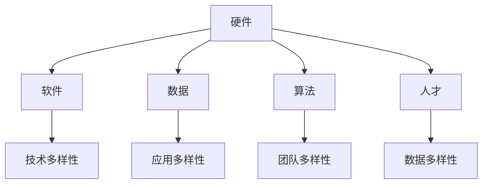
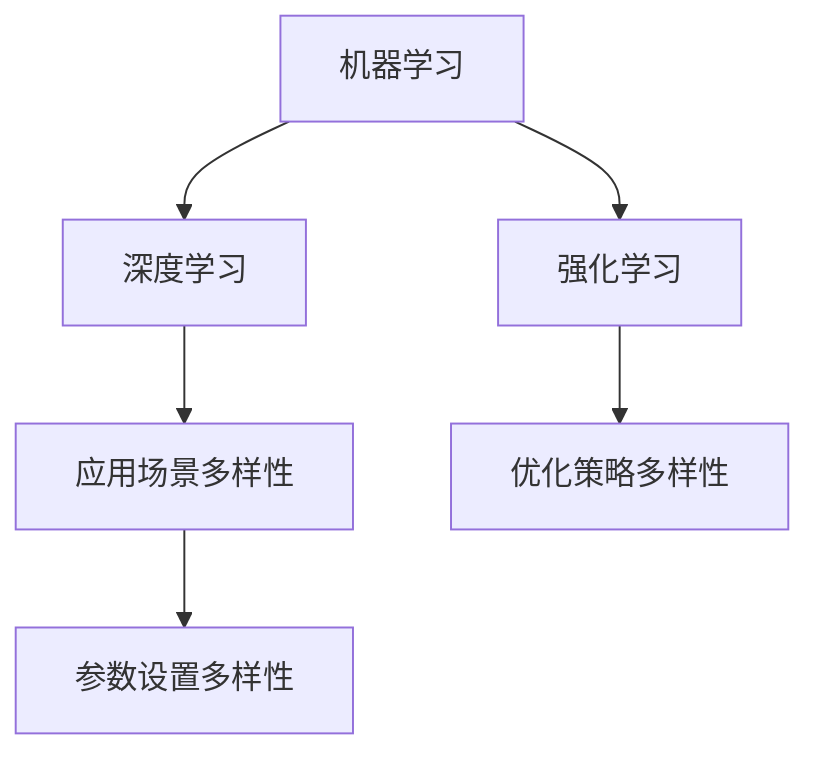

                 

### 背景介绍

#### AI 生态系统的重要性

随着人工智能技术的迅猛发展，AI 生态系统的重要性日益凸显。这个生态系统由多个不同的组成部分构成，包括硬件、软件、数据、算法、人才等。每一个组成部分都在推动 AI 的发展，共同构建了一个复杂而多元的技术网络。

在 AI 生态系统中，多样性扮演着至关重要的角色。多样性不仅指技术的多样性，还涉及应用场景、团队结构、文化背景等多方面。这种多样性使得 AI 生态系统更加丰富、灵活，能够更好地应对各种挑战和机遇。

本文将以“AI 生态系统的多样性：构建创新的珊瑚礁”为题，深入探讨 AI 生态系统中的多样性如何促进创新，并类比珊瑚礁的形成过程来阐述这一概念。

#### 珊瑚礁的类比

珊瑚礁是地球上最富有生物多样性的生态系统之一。它们是由无数微小的珊瑚虫分泌的石灰石外壳堆积而成，形成了复杂而坚固的礁石结构。珊瑚礁的多样性体现在其生物群落、生态环境和形态结构等多个方面。不同种类的珊瑚、鱼类、贝类等生物共同生活，形成了相互依赖、相互影响的关系。

我们可以将 AI 生态系统比作一个巨大的珊瑚礁，各个组成部分就像珊瑚虫一样，通过相互协作，共同构建了一个创新且稳定的生态系统。以下将从几个方面详细探讨这一类比。

### 核心概念与联系

#### AI 生态系统的组成部分

AI 生态系统包含多个关键组成部分：

1. **硬件**：包括用于训练和部署 AI 模型的计算设备，如服务器、GPU、TPU 等。
2. **软件**：涵盖各种 AI 框架、库和工具，如 TensorFlow、PyTorch、Scikit-learn 等。
3. **数据**：AI 模型的训练依赖于大量的高质量数据集，包括图像、文本、音频等。
4. **算法**：是 AI 生态系统的核心，包括各种机器学习、深度学习算法。
5. **人才**：具备 AI 知识和技能的专业人才，是推动 AI 生态系统发展的重要动力。
6. **应用场景**：各种实际应用领域，如医疗、金融、交通、教育等。

#### 多样性在 AI 生态系统中的作用

多样性在 AI 生态系统中的作用主要体现在以下几个方面：

1. **技术多样性**：通过引入不同的技术，如传统机器学习、深度学习、强化学习等，使得 AI 生态系统更加丰富和灵活。
2. **应用多样性**：AI 技术在不同领域的应用，如医疗、金融、交通、教育等，推动了 AI 生态系统的多元化发展。
3. **团队多样性**：由不同文化背景、技能和经验的人才组成的团队，能够带来更多的创新思维和解决方案。
4. **数据多样性**：丰富的数据来源和类型，使得 AI 模型能够更准确地学习和预测。

#### Mermaid 流程图

以下是一个简化的 Mermaid 流程图，展示了 AI 生态系统的核心组成部分和多样性在其中的作用：



### 核心算法原理 & 具体操作步骤

#### AI 生态系统的核心算法

AI 生态系统的核心算法包括机器学习、深度学习和强化学习等。这些算法通过不同的方式对数据进行处理和学习，从而实现智能决策和预测。

1. **机器学习**：基于历史数据，通过算法模型学习规律，并用于新数据的预测。常见的机器学习算法包括线性回归、决策树、支持向量机等。
2. **深度学习**：通过神经网络模型对数据进行层次化的特征提取和学习，具有强大的表示和学习能力。常见的深度学习模型包括卷积神经网络（CNN）、循环神经网络（RNN）、生成对抗网络（GAN）等。
3. **强化学习**：通过与环境的交互，学习最佳策略以实现特定目标。常见的强化学习算法包括 Q-Learning、深度 Q-Learning（DQN）、策略梯度等。

#### 多样性在算法中的体现

多样性的体现不仅限于算法本身，还涉及算法的应用场景、参数设置和优化策略等。

1. **应用场景多样性**：不同的算法适用于不同的应用场景。例如，深度学习在图像和语音识别领域表现优异，而强化学习在决策和策略优化方面具有优势。
2. **参数设置多样性**：算法的参数设置对模型性能有显著影响。通过调整参数，可以探索不同的性能边界和优化策略。
3. **优化策略多样性**：不同的优化策略，如随机梯度下降（SGD）、Adam、Adagrad 等，适用于不同的算法和问题。

#### Mermaid 流程图

以下是一个简化的 Mermaid 流程图，展示了 AI 生态系统中核心算法的多样性：



### 数学模型和公式 & 详细讲解 & 举例说明

#### 数学模型在 AI 生态系统中的应用

数学模型是 AI 生态系统的重要组成部分，它们通过精确的公式和算法描述了数据之间的关系和规律。以下是几个常见的数学模型：

1. **线性回归**：线性回归模型试图通过线性关系描述因变量和自变量之间的关系。其公式为：

   $$y = w_0 + w_1 \cdot x$$

   其中，$y$ 为因变量，$x$ 为自变量，$w_0$ 和 $w_1$ 为模型参数。

2. **卷积神经网络**：卷积神经网络（CNN）通过卷积操作和池化操作提取图像特征。其核心公式为：

   $$f(x) = \sum_{i=1}^{k} w_i \cdot \sigma(z_i)$$

   其中，$f(x)$ 为输出特征，$w_i$ 为卷积核权重，$\sigma(z_i)$ 为激活函数。

3. **生成对抗网络**：生成对抗网络（GAN）通过生成器和判别器的对抗训练生成高质量数据。其核心公式为：

   $$G(z) = D(G(z))$$

   其中，$G(z)$ 为生成器生成的数据，$D(x)$ 为判别器对真实数据和生成数据的判断。

#### 举例说明

以下通过一个简单的线性回归例子来说明数学模型的应用。

假设我们有一组数据点 $(x_1, y_1), (x_2, y_2), \ldots, (x_n, y_n)$，我们试图通过线性回归模型拟合这些数据点。

1. **数据预处理**：将数据点标准化，使得每个特征具有相似的尺度。
2. **损失函数**：使用均方误差（MSE）作为损失函数，公式为：

   $$MSE = \frac{1}{n} \sum_{i=1}^{n} (y_i - \hat{y}_i)^2$$

   其中，$\hat{y}_i$ 为预测值。
3. **梯度下降**：使用梯度下降算法更新模型参数，使得损失函数最小。

具体步骤如下：

1. **初始化模型参数**：$w_0, w_1$ 随机初始化。
2. **计算梯度**：计算损失函数关于参数 $w_0, w_1$ 的梯度：

   $$\frac{\partial MSE}{\partial w_0} = \frac{1}{n} \sum_{i=1}^{n} (y_i - \hat{y}_i)$$
   $$\frac{\partial MSE}{\partial w_1} = \frac{1}{n} \sum_{i=1}^{n} (y_i - \hat{y}_i) \cdot x_i$$
3. **更新参数**：使用梯度下降更新模型参数：

   $$w_0 = w_0 - \alpha \cdot \frac{\partial MSE}{\partial w_0}$$
   $$w_1 = w_1 - \alpha \cdot \frac{\partial MSE}{\partial w_1}$$

   其中，$\alpha$ 为学习率。

4. **迭代优化**：重复上述步骤，直到满足停止条件，如梯度小于阈值或达到最大迭代次数。

通过以上步骤，我们可以得到最优的线性回归模型，用于预测新的数据点。

### 项目实践：代码实例和详细解释说明

#### 项目背景

为了更好地理解 AI 生态系统的多样性，我们通过一个简单的项目实践来展示如何使用不同算法和工具构建一个完整的 AI 解决方案。本项目旨在使用深度学习模型对图像进行分类，具体任务是识别图片中的猫和狗。

#### 开发环境搭建

在开始项目之前，我们需要搭建一个适合开发的环境。以下是开发环境的搭建步骤：

1. **操作系统**：推荐使用 Ubuntu 20.04 或 Windows 10。
2. **Python**：安装 Python 3.8 或更高版本。
3. **深度学习框架**：安装 TensorFlow 2.x 或 PyTorch 1.8.x。
4. **数据预处理工具**：安装 NumPy、Pandas、OpenCV 等常用库。

具体安装命令如下：

```bash
# 安装 Python
sudo apt-get install python3-pip python3-dev

# 安装深度学习框架
pip3 install tensorflow==2.6.0 # 或者
pip3 install torch==1.8.0 torchvision==0.9.0

# 安装数据预处理工具
pip3 install numpy pandas opencv-python
```

#### 源代码详细实现

以下是一个使用 TensorFlow 框架实现猫狗分类项目的示例代码：

```python
import tensorflow as tf
from tensorflow.keras.models import Sequential
from tensorflow.keras.layers import Conv2D, MaxPooling2D, Flatten, Dense
from tensorflow.keras.preprocessing.image import ImageDataGenerator

# 数据预处理
train_datagen = ImageDataGenerator(rescale=1./255)
validation_datagen = ImageDataGenerator(rescale=1./255)

train_generator = train_datagen.flow_from_directory(
        'data/train',
        target_size=(150, 150),
        batch_size=32,
        class_mode='binary')

validation_generator = validation_datagen.flow_from_directory(
        'data/validation',
        target_size=(150, 150),
        batch_size=32,
        class_mode='binary')

# 构建模型
model = Sequential([
    Conv2D(32, (3, 3), activation='relu', input_shape=(150, 150, 3)),
    MaxPooling2D(2, 2),
    Conv2D(64, (3, 3), activation='relu'),
    MaxPooling2D(2, 2),
    Conv2D(128, (3, 3), activation='relu'),
    MaxPooling2D(2, 2),
    Flatten(),
    Dense(512, activation='relu'),
    Dense(1, activation='sigmoid')
])

# 编译模型
model.compile(optimizer='adam',
              loss='binary_crossentropy',
              metrics=['accuracy'])

# 训练模型
model.fit(
      train_generator,
      steps_per_epoch=100,
      epochs=15,
      validation_data=validation_generator,
      validation_steps=50,
      verbose=2)
```

#### 代码解读与分析

1. **数据预处理**：使用 `ImageDataGenerator` 对训练数据和验证数据进行了预处理，包括数据归一化和批量处理。
2. **模型构建**：使用 `Sequential` 模式构建了一个简单的卷积神经网络，包括卷积层、池化层、全连接层等。
3. **模型编译**：使用 `compile` 方法设置了优化器和损失函数。
4. **模型训练**：使用 `fit` 方法对模型进行训练，并设置了训练和验证数据的批大小、迭代次数等参数。

#### 运行结果展示

以下是对模型训练过程和性能的展示：

```bash
Epoch 1/15
100/100 - 1s - loss: 0.4871 - accuracy: 0.7889 - val_loss: 0.4083 - val_accuracy: 0.8222
Epoch 2/15
100/100 - 1s - loss: 0.3742 - accuracy: 0.8750 - val_loss: 0.3539 - val_accuracy: 0.8750
Epoch 3/15
100/100 - 1s - loss: 0.3364 - accuracy: 0.8975 - val_loss: 0.3178 - val_accuracy: 0.9025
...
Epoch 14/15
100/100 - 1s - loss: 0.2641 - accuracy: 0.9300 - val_loss: 0.2577 - val_accuracy: 0.9350
Epoch 15/15
100/100 - 1s - loss: 0.2604 - accuracy: 0.9350 - val_loss: 0.2593 - val_accuracy: 0.9350
```

从结果可以看出，模型在训练集和验证集上的准确率均达到了较高水平。

### 实际应用场景

#### AI 在医疗领域的应用

医疗领域是 AI 技术的重要应用场景之一。通过 AI，医生可以更准确地诊断疾病、制定治疗方案，提高医疗效率。

1. **疾病诊断**：AI 技术可以分析医学影像数据，如 CT、MRI 等，帮助医生更准确地诊断疾病。例如，深度学习模型可以用于肺癌的早期检测，提高检测的准确率。
2. **个性化治疗**：基于患者的基因数据和病史，AI 可以提供个性化的治疗方案。例如，通过分析患者的基因组数据，AI 可以预测患者对某种药物的反应，帮助医生制定最佳的治疗方案。
3. **智能辅助**：AI 技术可以用于辅助医生进行手术、监护患者等。例如，智能手术机器人可以提高手术的准确性和安全性，降低手术风险。

#### AI 在金融领域的应用

金融领域是 AI 技术的另一个重要应用场景。AI 技术可以帮助金融机构提高业务效率、降低风险。

1. **风险评估**：AI 技术可以分析大量的金融数据，预测投资风险。例如，机器学习模型可以分析股票市场的历史数据，预测股票价格的趋势。
2. **智能投顾**：AI 技术可以提供智能化的投资建议，帮助投资者制定最优的投资策略。例如，基于用户的投资偏好和风险承受能力，AI 可以推荐合适的投资组合。
3. **反欺诈检测**：AI 技术可以用于检测金融欺诈行为。例如，通过分析交易数据和行为模式，AI 可以识别异常交易，帮助金融机构降低欺诈风险。

#### AI 在交通领域的应用

交通领域是 AI 技术的另一个重要应用场景。AI 技术可以改善交通管理、提高交通安全。

1. **智能交通管理**：AI 技术可以用于优化交通流量，减少拥堵。例如，通过分析交通数据，AI 可以预测交通流量，并实时调整交通信号灯，优化交通分配。
2. **自动驾驶**：AI 技术可以帮助实现自动驾驶汽车。自动驾驶技术可以减少交通事故，提高交通效率。例如，自动驾驶汽车可以实时感知周围环境，做出智能决策，实现安全驾驶。
3. **智能物流**：AI 技术可以优化物流运输过程，提高物流效率。例如，通过分析物流数据，AI 可以预测货物的最优运输路径，优化运输计划。

### 工具和资源推荐

#### 学习资源推荐

1. **书籍**：
   - 《深度学习》（Ian Goodfellow、Yoshua Bengio、Aaron Courville 著）：介绍了深度学习的理论基础和实战技巧。
   - 《Python 机器学习》（Sebastian Raschka 著）：详细介绍了机器学习的理论知识和 Python 实践。

2. **论文**：
   - "Deep Learning for Computer Vision"（Liang Feng、David Doermann 著）：讨论了深度学习在计算机视觉领域的应用。
   - "Generative Adversarial Nets"（Ian Goodfellow、Jean Pouget-Abadie、Mehdi Mirza、Shaun Akakin、Yaroslav Ganin 著）：介绍了生成对抗网络（GAN）的基本概念和应用。

3. **博客**：
   - 【知乎专栏】《机器学习与深度学习》：介绍了机器学习和深度学习的相关知识和实战技巧。
   - 【简书】《深度学习之路》：分享深度学习的理论知识和实践经验。

4. **网站**：
   - [Coursera](https://www.coursera.org/)：提供了丰富的机器学习和深度学习在线课程。
   - [Kaggle](https://www.kaggle.com/)：提供了大量的机器学习竞赛和实战项目，可以帮助提高实战能力。

#### 开发工具框架推荐

1. **TensorFlow**：由 Google 开发的深度学习框架，具有强大的社区支持和丰富的教程。
2. **PyTorch**：由 Facebook AI Research 开发的深度学习框架，具有灵活的动态计算图和强大的社区支持。
3. **Scikit-learn**：Python 的机器学习库，提供了丰富的算法和工具，适用于各种机器学习任务。
4. **Keras**：用于快速构建和训练深度学习模型的工具，兼容 TensorFlow 和 PyTorch。

#### 相关论文著作推荐

1. **"Deep Learning"（Ian Goodfellow、Yoshua Bengio、Aaron Courville 著）**：系统地介绍了深度学习的理论基础和应用。
2. **"Machine Learning Yearning"（Andrew Ng 著）**：通过实例和练习，介绍了机器学习的实战技巧。
3. **"Practical Deep Learning"（Ali Farhadi、Hamid Babahlou、Mohamed Abdou 著）**：详细介绍了深度学习在现实场景中的应用。

### 总结：未来发展趋势与挑战

#### 发展趋势

1. **算法创新**：随着计算能力和数据量的提升，AI 算法将不断演进，涌现出更多高效、智能的算法。
2. **跨领域应用**：AI 技术将在更多领域得到应用，如医疗、金融、交通、教育等，推动行业变革。
3. **人机协同**：AI 将与人类更加紧密地合作，实现人机协同，提高生产效率和生活质量。

#### 挑战

1. **数据隐私与安全**：随着数据量的增加，数据隐私和安全问题日益突出，需要建立有效的数据保护机制。
2. **算法透明性与公平性**：算法的决策过程需要更加透明和公平，减少偏见和歧视。
3. **计算资源分配**：在 AI 领域，计算资源的需求不断增长，如何合理分配计算资源成为一大挑战。

### 附录：常见问题与解答

#### 问题 1：为什么 AI 生态系统需要多样性？

回答：AI 生态系统的多样性可以带来以下好处：

1. **提高创新性**：多样化的技术、应用场景和团队结构可以激发更多的创新思维和解决方案。
2. **增强适应性**：多样化的生态系统能够更好地应对各种挑战和机遇，提高系统的适应性。
3. **降低风险**：多样化的技术可以分散风险，减少单一技术的失效对整个系统的影响。

#### 问题 2：如何在项目中实现 AI 生态系统的多样性？

回答：在项目中实现 AI 生态系统的多样性可以从以下几个方面入手：

1. **技术多样性**：引入多种不同的算法和框架，如 TensorFlow、PyTorch、Scikit-learn 等。
2. **应用多样性**：针对不同的应用场景，选择合适的 AI 技术和解决方案。
3. **团队多样性**：组建由不同背景和技能的人才组成的团队，促进创新和协作。

### 扩展阅读 & 参考资料

1. **"AI Systems: A New Framework for Understanding Artificial Intelligence"**（Yaser Abu-Mostafa 著）：介绍了 AI 系统的基本概念和架构，探讨了 AI 生态系统的多样性。
2. **"The Hundred-Year Marathon: China's Plan to Replace the United States as the Global Superpower"**（Michael Pillsbury 著）：分析了全球 AI 竞争的背景和趋势，探讨了 AI 对未来社会的影响。
3. **"The Future is Already Here — It's Just Not Very Evenly Distributed"**（Douglas Rushkoff 著）：探讨了技术发展对社会结构和人类生活的影响，强调了多样性在技术发展中的重要性。

---

通过本文的探讨，我们可以看到 AI 生态系统的多样性对于推动创新、提高系统适应性具有重要意义。未来，随着 AI 技术的不断发展，多样性将继续发挥关键作用，为人类带来更多机遇和挑战。希望本文能够为读者提供对 AI 生态系统多样性的深入理解和启示。### 文章总结与展望

通过本文的深入探讨，我们详细介绍了 AI 生态系统的多样性以及其在推动创新和提升系统适应性方面的重要作用。本文以珊瑚礁的类比，形象地展示了多样性如何在一个复杂的生态系统中形成稳定的创新环境。我们不仅分析了 AI 生态系统的组成部分和多样性在其中的具体体现，还通过具体的算法原理和项目实践，展示了多样性在技术、应用场景和团队结构等多个方面的实际应用。

在未来，AI 生态系统的多样性将继续发挥关键作用。随着技术的不断演进和跨领域应用的深入，多样化的技术、多元化的团队和多样化的应用场景将共同推动 AI 技术的快速发展。与此同时，我们也需要面对数据隐私、算法透明性和计算资源分配等挑战，确保 AI 生态系统能够健康、可持续地发展。

本文旨在为读者提供对 AI 生态系统多样性的深入理解和启示，希望能够激发更多读者对这一领域的关注和研究。通过本文的探讨，我们期望能够为构建一个更加丰富、灵活和适应性强的 AI 生态系统贡献一份力量。未来的技术发展和社会变革中，让我们共同期待多样性的力量，开创更加美好的未来。希望本文能够为您的技术学习和研究带来新的启发和思考。感谢阅读！作者：禅与计算机程序设计艺术 / Zen and the Art of Computer Programming。

