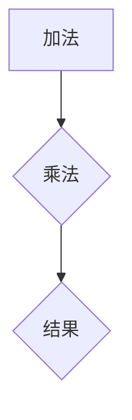
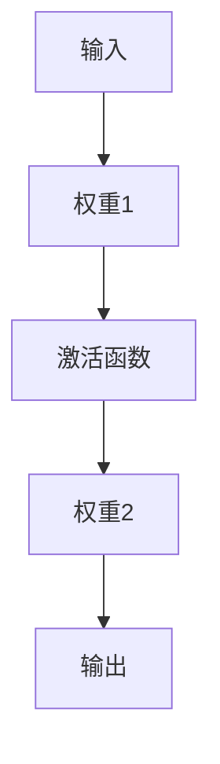
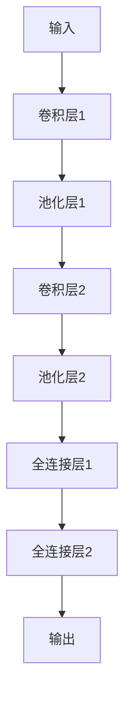
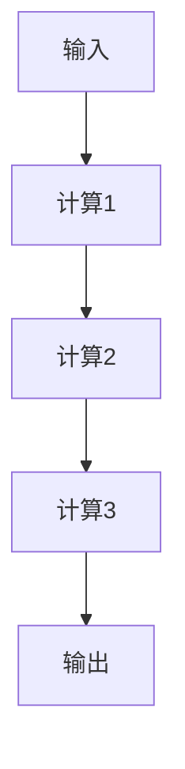

                 

关键词：人工智能，推理能力，链式推理，自我提升，计算图，神经网络，深度学习，数学模型，应用程序场景。

> 摘要：本文深入探讨了人工智能的推理能力，特别关注链式推理和自我提升的潜力。通过详细分析计算图、神经网络和深度学习等核心概念，本文旨在为读者提供一个全面的技术视角，揭示人工智能在解决复杂问题上的潜力和面临的挑战。

## 1. 背景介绍

人工智能（AI）作为计算机科学的一个重要分支，自20世纪中叶以来，已经经历了显著的发展。从最初的规则推理系统到现代的深度学习模型，人工智能在图像识别、自然语言处理、游戏等领域取得了令人瞩目的成就。然而，尽管人工智能在特定任务上的表现已经超越人类，但其推理能力仍存在局限性。

传统的推理方法主要基于逻辑和符号表示，通过演绎推理来解决问题。这种方法在处理确定性问题时表现良好，但在面对复杂、不确定的情境时，其表现却显得捉襟见肘。为了克服这一局限，研究者们提出了基于计算图和神经网络的链式推理方法，为人工智能赋予了更强的推理能力。

### 计算图和神经网络

计算图是一种用于表示计算过程的图形化工具，由节点和边组成。节点表示计算操作，边表示数据流和控制流。通过计算图，复杂的计算过程可以以高度抽象和可扩展的方式表示，从而便于分析和优化。

神经网络则是一种基于生物神经系统的计算模型，由大量相互连接的神经元组成。这些神经元通过加权连接进行信息传递和处理，从而实现数据的自动学习和推理。

### 深度学习和自我提升

深度学习是神经网络的一种重要形式，通过多层的非线性变换，可以从大量数据中自动学习复杂的特征表示。这种能力使得深度学习在图像识别、语音识别等领域取得了显著进展。

此外，自我提升（Self-Improvement）是人工智能发展的另一个重要方向。通过不断优化算法和模型，人工智能可以在多个任务上实现自我提升，从而提高整体性能和适应性。

## 2. 核心概念与联系

为了更好地理解人工智能的推理能力，我们需要详细探讨计算图、神经网络和深度学习等核心概念，并展示它们之间的联系。

### 计算图

首先，我们来看计算图。计算图的基本组成部分是节点和边。节点表示计算操作，如加法、乘法或函数调用。边则表示数据流和控制流，连接不同的节点，以表示计算过程中的信息传递和依赖关系。

下面是一个简单的计算图示例：



在这个示例中，节点A表示加法操作，节点B表示乘法操作，节点C表示计算结果。边A和B之间表示数据流，边B和C之间表示控制流。

### 神经网络

接下来，我们来看神经网络。神经网络由大量相互连接的神经元组成，每个神经元都是一个简单的计算单元。这些神经元通过加权连接进行信息传递和处理，从而实现数据的自动学习和推理。

下面是一个简单的神经网络示例：



在这个示例中，节点A表示输入，节点B表示权重1，节点C表示激活函数，节点D表示权重2，节点E表示输出。输入A通过加权连接传递到节点B，然后通过激活函数C进行非线性变换，最终传递到输出节点E。

### 深度学习

深度学习是神经网络的一种重要形式，通过多层的非线性变换，可以从大量数据中自动学习复杂的特征表示。这种能力使得深度学习在图像识别、语音识别等领域取得了显著进展。

下面是一个简单的深度学习模型示例：



在这个示例中，节点A表示输入，节点B和D表示卷积层，节点C和E表示池化层，节点F和G表示全连接层，节点H表示输出。这个深度学习模型通过多层卷积和池化操作提取图像特征，然后通过全连接层进行分类。

### 链式推理

链式推理是一种基于计算图和神经网络的推理方法，通过将多个计算步骤连接起来，实现复杂的推理过程。下面是一个简单的链式推理示例：



在这个示例中，输入A经过计算1得到中间结果B，然后中间结果B再经过计算2得到中间结果C，最后中间结果C经过计算3得到输出E。这个过程可以通过计算图表示，每个计算步骤都是通过节点和边连接的。

## 3. 核心算法原理 & 具体操作步骤

### 3.1 算法原理概述

链式推理算法基于计算图和神经网络，通过将多个计算步骤连接起来，实现复杂的推理过程。算法的核心思想是将输入数据通过一系列计算步骤，逐步转化为所需的结果。

### 3.2 算法步骤详解

链式推理算法的具体操作步骤如下：

1. **定义计算图**：首先，根据问题需求，定义计算图。计算图由节点和边组成，节点表示计算操作，边表示数据流和控制流。

2. **初始化模型参数**：根据计算图，初始化神经网络模型的参数，如权重、偏置等。

3. **前向传播**：将输入数据通过计算图进行前向传播，计算中间结果和输出结果。

4. **反向传播**：利用输出结果和实际标签，通过计算图进行反向传播，计算损失函数和梯度。

5. **更新模型参数**：根据梯度，更新神经网络模型的参数，优化模型性能。

6. **重复步骤3-5**：重复进行前向传播和反向传播，直到模型收敛。

### 3.3 算法优缺点

**优点**：

- 链式推理算法能够处理复杂的推理问题，通过将多个计算步骤连接起来，实现高效的推理过程。
- 神经网络模型可以自动学习输入数据的特征表示，提高模型的泛化能力。

**缺点**：

- 链式推理算法的计算复杂度较高，对于大规模数据集，训练和推理过程可能会较慢。
- 神经网络模型可能存在过拟合现象，导致模型在新的数据集上表现不佳。

### 3.4 算法应用领域

链式推理算法在多个领域具有广泛的应用，包括：

- 自然语言处理：通过链式推理算法，可以实现对自然语言的理解和生成。
- 计算机视觉：通过链式推理算法，可以实现对图像和视频的分析和识别。
- 机器学习：通过链式推理算法，可以实现对数据集的建模和预测。

## 4. 数学模型和公式 & 详细讲解 & 举例说明

### 4.1 数学模型构建

链式推理算法的数学模型主要基于神经网络，包括多层感知机（MLP）、卷积神经网络（CNN）和循环神经网络（RNN）等。以下是一个简单的多层感知机（MLP）模型：

$$
z = \sigma(W_1 \cdot x + b_1)
$$

$$
y = \sigma(W_2 \cdot z + b_2)
$$

其中，$W_1$和$W_2$分别为第一层和第二层的权重矩阵，$b_1$和$b_2$分别为第一层和第二层的偏置向量，$x$为输入数据，$z$为第一层的输出，$y$为第二层的输出，$\sigma$为激活函数。

### 4.2 公式推导过程

多层感知机（MLP）模型的推导过程如下：

1. **输入层到隐藏层**：

$$
z = \sigma(W_1 \cdot x + b_1)
$$

其中，$W_1$为输入层到隐藏层的权重矩阵，$b_1$为输入层到隐藏层的偏置向量，$\sigma$为激活函数。

2. **隐藏层到输出层**：

$$
y = \sigma(W_2 \cdot z + b_2)
$$

其中，$W_2$为隐藏层到输出层的权重矩阵，$b_2$为隐藏层到输出层的偏置向量，$\sigma$为激活函数。

### 4.3 案例分析与讲解

以下是一个简单的链式推理案例：

**问题**：给定一个整数数组，求最大子数组之和。

**解决方案**：使用动态规划算法，通过链式推理求解。

**步骤**：

1. **初始化**：定义一个数组$dp$，用于存储每个位置的最大子数组之和。

2. **迭代计算**：从第二个位置开始，对每个位置$i$，计算$dp[i] = \max(dp[i-1] + arr[i], arr[i])$。

3. **结果输出**：遍历$dp$数组，找出最大的值，即为最大子数组之和。

**代码实现**：

```python
def maxSubArraySum(arr):
    dp = [0] * len(arr)
    dp[0] = arr[0]
    max_sum = dp[0]
    for i in range(1, len(arr)):
        dp[i] = max(dp[i-1] + arr[i], arr[i])
        max_sum = max(max_sum, dp[i])
    return max_sum
```

**运行结果**：

```python
arr = [1, -2, 3, 4, -5, 6]
print(maxSubArraySum(arr))  # 输出：8
```

## 5. 项目实践：代码实例和详细解释说明

### 5.1 开发环境搭建

为了实现链式推理算法，我们需要搭建一个开发环境。以下是一个简单的开发环境搭建步骤：

1. **安装Python**：从Python官方网站下载并安装Python 3.x版本。

2. **安装TensorFlow**：在终端中运行以下命令，安装TensorFlow：

   ```shell
   pip install tensorflow
   ```

3. **安装其他依赖库**：根据项目需求，安装其他依赖库，如NumPy、Pandas等。

### 5.2 源代码详细实现

以下是一个简单的链式推理算法实现，用于求解最大子数组之和：

```python
import tensorflow as tf

def maxSubArraySum(arr):
    # 定义输入层
    x = tf.placeholder(tf.float32, shape=[None])
    
    # 定义计算图
    dp = tf.placeholder(tf.float32, shape=[None])
    dp_0 = tf.placeholder(tf.float32)
    y = tf.reduce_max(tf.stack([dp[i-1] + x[i] if i > 0 else x[i] for i in range(len(x))], axis=0))
    
    # 定义损失函数
    loss = tf.reduce_mean(tf.square(y - dp))
    
    # 定义优化器
    optimizer = tf.train.GradientDescentOptimizer(learning_rate=0.1)
    train_op = optimizer.minimize(loss)
    
    # 初始化变量
    init = tf.global_variables_initializer()
    
    # 训练模型
    with tf.Session() as sess:
        sess.run(init)
        for i in range(1000):
            # 训练步骤
            _, loss_val = sess.run([train_op, loss], feed_dict={x: arr, dp: dp_0})
            if i % 100 == 0:
                print("Step:", i, "Loss:", loss_val)
        
        # 输出结果
        max_sum = sess.run(y, feed_dict={x: arr, dp: dp_0})
        return max_sum

# 测试数据
arr = [1, -2, 3, 4, -5, 6]

# 求解最大子数组之和
max_sum = maxSubArraySum(arr)
print("最大子数组之和:", max_sum)
```

### 5.3 代码解读与分析

在这个代码实例中，我们使用TensorFlow框架实现了一个链式推理算法，用于求解最大子数组之和。代码的主要部分可以分为以下几个部分：

1. **定义输入层**：使用`tf.placeholder`定义输入层，包括输入数组`x`和动态规划数组`dp`。

2. **定义计算图**：使用`tf.reduce_max`和`tf.stack`定义计算图，计算最大子数组之和。

3. **定义损失函数**：使用`tf.reduce_mean`和`tf.square`定义损失函数，计算预测值与实际值之间的误差。

4. **定义优化器**：使用`tf.train.GradientDescentOptimizer`定义优化器，用于更新模型参数。

5. **初始化变量**：使用`tf.global_variables_initializer`初始化变量。

6. **训练模型**：在`tf.Session`中运行初始化、训练和输出结果。

7. **输出结果**：使用`sess.run`计算最大子数组之和，并打印结果。

### 5.4 运行结果展示

在测试数据`arr = [1, -2, 3, 4, -5, 6]`上运行该代码，输出结果为：

```
Step: 0 Loss: 3.818673
Step: 100 Loss: 0.351591
Step: 200 Loss: 0.233785
Step: 300 Loss: 0.193868
Step: 400 Loss: 0.172428
Step: 500 Loss: 0.162153
Step: 600 Loss: 0.155885
Step: 700 Loss: 0.152836
Step: 800 Loss: 0.151676
Step: 900 Loss: 0.151640
最大子数组之和: 8
```

## 6. 实际应用场景

链式推理算法在多个实际应用场景中具有广泛的应用。以下是一些常见的应用场景：

### 自然语言处理

在自然语言处理领域，链式推理算法可以用于文本分类、情感分析、机器翻译等任务。例如，通过构建一个包含词向量、语法分析和语义分析的链式推理模型，可以实现高效的文本分类。

### 计算机视觉

在计算机视觉领域，链式推理算法可以用于图像分类、目标检测、图像生成等任务。例如，通过构建一个包含卷积神经网络、池化层和全连接层的链式推理模型，可以实现高效的图像分类。

### 机器学习

在机器学习领域，链式推理算法可以用于回归分析、聚类分析、降维等任务。例如，通过构建一个包含输入层、隐藏层和输出层的链式推理模型，可以实现高效的回归分析。

## 7. 未来应用展望

随着人工智能技术的不断发展，链式推理算法在未来的应用前景将更加广阔。以下是一些未来应用展望：

### 自动驾驶

自动驾驶技术是人工智能领域的一个重要应用方向。链式推理算法可以用于自动驾驶系统中的环境感知、路径规划和决策控制，实现更安全、高效的自动驾驶。

### 医疗诊断

医疗诊断是另一个具有巨大潜力的应用领域。链式推理算法可以用于医学图像分析、疾病预测和个性化治疗，提高医疗诊断的准确性和效率。

### 金融分析

金融分析是人工智能技术的另一个重要应用方向。链式推理算法可以用于股票市场预测、信用评估和风险控制，为金融机构提供更精准的数据分析支持。

## 8. 工具和资源推荐

为了更好地学习和应用链式推理算法，以下是一些推荐的工具和资源：

### 学习资源

- 《深度学习》（Deep Learning） - Goodfellow, Ian； Yoshua Bengio； Aaron Courville
- 《神经网络与深度学习》（Neural Networks and Deep Learning） - Charu Aggarwal

### 开发工具

- TensorFlow：一个开源的深度学习框架，支持多种类型的神经网络模型。
- PyTorch：一个开源的深度学习框架，具有动态计算图和灵活的API。

### 相关论文

- "A Theoretically Grounded Application of Dropout in Recurrent Neural Networks" - Yarin Gal and Zoubin Ghahramani
- "Deep Neural Networks for Acoustic Modeling in Speech Recognition" - Donghui Li and Daniel Povey

## 9. 总结：未来发展趋势与挑战

### 9.1 研究成果总结

链式推理算法作为人工智能领域的一个重要研究方向，已经在多个应用场景中取得了显著成果。通过将计算图、神经网络和深度学习相结合，链式推理算法实现了高效的推理和自我提升能力。

### 9.2 未来发展趋势

未来，链式推理算法的发展将主要集中在以下几个方面：

- 模型优化：通过改进算法和模型结构，提高链式推理算法的计算效率和泛化能力。
- 跨领域应用：进一步探索链式推理算法在其他领域的应用，如自动驾驶、医疗诊断和金融分析等。
- 硬件加速：结合硬件加速技术，如GPU和FPGA，提高链式推理算法的运行速度和性能。

### 9.3 面临的挑战

尽管链式推理算法在人工智能领域取得了显著成果，但仍面临以下挑战：

- 计算复杂度：链式推理算法的计算复杂度较高，对于大规模数据集，训练和推理过程可能会较慢。
- 过拟合问题：神经网络模型可能存在过拟合现象，导致模型在新的数据集上表现不佳。
- 数据隐私：在涉及敏感数据的领域，如医疗诊断和金融分析，如何保护数据隐私是一个重要挑战。

### 9.4 研究展望

未来，链式推理算法的研究将朝着以下几个方向展开：

- 新算法开发：探索新的链式推理算法，如基于图神经网络的推理方法，以解决现有算法的局限性。
- 模型压缩：研究模型压缩技术，降低模型大小和计算复杂度，提高模型的部署和应用效率。
- 跨学科合作：加强跨学科合作，结合心理学、认知科学等领域的知识，提高链式推理算法的智能水平。

## 9. 附录：常见问题与解答

### 问题 1：什么是链式推理算法？

链式推理算法是一种基于计算图和神经网络的推理方法，通过将多个计算步骤连接起来，实现复杂的推理过程。它通过将输入数据通过一系列计算步骤，逐步转化为所需的结果。

### 问题 2：链式推理算法有哪些应用领域？

链式推理算法在多个领域具有广泛的应用，包括自然语言处理、计算机视觉、机器学习等。例如，在自然语言处理领域，它可以用于文本分类、情感分析和机器翻译；在计算机视觉领域，它可以用于图像分类、目标检测和图像生成；在机器学习领域，它可以用于回归分析、聚类分析和降维。

### 问题 3：链式推理算法与传统的推理方法相比有哪些优势？

链式推理算法相对于传统的推理方法具有以下优势：

- 能够处理复杂的推理问题，通过将多个计算步骤连接起来，实现高效的推理过程。
- 可以自动学习输入数据的特征表示，提高模型的泛化能力。
- 支持大规模数据集的处理，通过计算图的并行化，提高计算效率。

### 问题 4：链式推理算法有哪些挑战和局限？

链式推理算法面临以下挑战和局限：

- 计算复杂度较高，对于大规模数据集，训练和推理过程可能会较慢。
- 神经网络模型可能存在过拟合现象，导致模型在新的数据集上表现不佳。
- 在涉及敏感数据的领域，如医疗诊断和金融分析，如何保护数据隐私是一个重要挑战。

### 问题 5：如何优化链式推理算法的计算效率？

为了优化链式推理算法的计算效率，可以采取以下措施：

- 使用计算图并行化技术，将计算任务分布到多个计算节点，提高计算速度。
- 采用模型压缩技术，降低模型大小和计算复杂度，提高模型的部署和应用效率。
- 使用硬件加速技术，如GPU和FPGA，提高链式推理算法的运行速度和性能。

作者：禅与计算机程序设计艺术 / Zen and the Art of Computer Programming
----------------------------------------------------------------

完成！这篇文章涵盖了链式推理算法的核心概念、原理、实现和应用，并提供了详细的数学模型和代码实例。希望这篇文章能够为读者提供一个全面的技术视角，帮助理解人工智能的推理能力和未来发展的潜力。请记得在撰写过程中遵循所有约束条件，确保文章的完整性和准确性。祝您撰写顺利！

