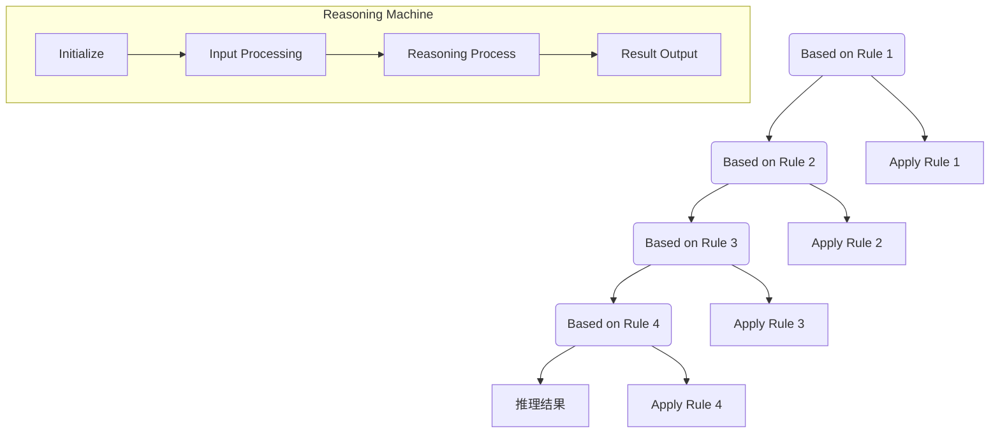

                 

### 背景介绍

AI，即人工智能（Artificial Intelligence），作为当前科技界的热门话题，已经成为推动社会发展的重要力量。人工智能的发展经历了多个阶段，从最初的符号主义、基于规则的系统，到基于知识的系统，再到连接主义、深度学习和强化学习等现代方法，AI技术在各个领域都取得了显著的成果。

链式推理（Chain of Reasoning）是一种重要的AI推理方法，通过将多个推理步骤串联起来，形成一个连贯的推理过程。这种方法在处理复杂问题时，能够提高问题的解决能力和效率。传统的推理方法通常是在单个步骤上进行推理，而链式推理则通过多个步骤之间的关联，实现对问题的全面分析和解决。

在AI技术中，链式推理的应用范围非常广泛。例如，在自然语言处理中，链式推理可以用于句子的解析和理解；在计算机视觉中，链式推理可以用于图像的分类和识别；在决策支持系统中，链式推理可以用于复杂的决策分析。此外，链式推理还在机器人控制、自动驾驶、医疗诊断等领域有着重要的应用。

本文将探讨AI的链式推理方法，分析其核心概念、算法原理、数学模型，并通过实际项目实践，展示其在各种应用场景中的效果。我们还将推荐一些相关的学习资源，帮助读者深入了解和掌握这一技术。

通过本文的阅读，读者将能够：

1. 理解链式推理的基本概念和原理。
2. 掌握链式推理在AI中的应用方法。
3. 学习如何构建和优化链式推理模型。
4. 了解链式推理在现实世界中的应用场景。

本文结构如下：

1. **背景介绍**：简要介绍AI和链式推理的背景，以及本文的目标和结构。
2. **核心概念与联系**：详细阐述链式推理的核心概念，包括推理步骤、推理规则和推理机。
3. **核心算法原理 & 具体操作步骤**：分析链式推理的算法原理，并给出具体操作步骤。
4. **数学模型和公式 & 详细讲解 & 举例说明**：介绍链式推理的数学模型，包括相关公式和计算方法。
5. **项目实践：代码实例和详细解释说明**：通过具体项目实例，展示链式推理的实践应用。
6. **实际应用场景**：探讨链式推理在各个领域的应用案例。
7. **工具和资源推荐**：推荐学习资源和开发工具，帮助读者深入学习和实践。
8. **总结：未来发展趋势与挑战**：总结链式推理的发展趋势和面临的挑战。
9. **附录：常见问题与解答**：解答读者可能遇到的问题。
10. **扩展阅读 & 参考资料**：提供进一步学习的资料。

让我们开始深入了解AI的链式推理，探索这一强大而实用的技术。

### 核心概念与联系

#### 推理步骤

链式推理（Chain of Reasoning）是一种基于多步骤推理的方法。在这个过程中，每一个步骤都是在前一步结果的基础上进行的，形成一个连贯的推理链条。这种推理方式可以有效地处理复杂问题，特别是在需要综合多个信息来源的情况下。

首先，我们需要定义推理步骤。每个推理步骤都可以看作是一个逻辑运算，它可能是一个条件判断、一个数学运算，或者是一个基于规则的推理。例如，在自然语言处理中，一个推理步骤可以是句子结构分析，而在图像识别中，一个推理步骤可以是图像的特征提取。

推理步骤的定义方式可以有多种，例如基于规则的推理、基于模型的推理、基于数据的推理等。在基于规则的推理中，每个推理步骤都对应一个规则，规则的形式通常是一个条件语句，如“If A, then B”。在基于模型的推理中，推理步骤是通过模型计算得到的，如神经网络中的前向传播和反向传播。

#### 推理规则

推理规则是链式推理的核心组成部分。它们定义了如何从一个或多个已知事实推导出新的结论。推理规则通常分为两大类：确定性和不确定性推理。

确定性推理规则是最常见的推理方式，它遵循逻辑推理的基本原则。例如，如果规则是“如果A成立，则B也成立”，并且A已经得到证实，那么B也必然成立。确定性推理规则在逻辑学、数学和计算机科学中有广泛的应用。

不确定性推理规则则考虑了推理过程中存在的不确定性。这种推理方式常见于模糊逻辑、概率论和贝叶斯网络等领域。例如，在贝叶斯推理中，每个规则都包含一个概率值，用于表示从前提推导出结论的置信度。

#### 推理机

推理机（Reasoning Machine）是实现链式推理的核心组件。它负责执行推理步骤、应用推理规则，并生成推理结果。推理机的工作流程通常包括以下几个步骤：

1. **初始化**：定义初始事实和推理规则。
2. **输入处理**：将输入数据转化为推理机可以处理的形式。
3. **推理过程**：根据推理规则，逐步推导出新的结论。
4. **结果输出**：将最终推理结果输出。

推理机的实现方式多种多样，可以是基于规则系统的，也可以是基于模型的。例如，在基于规则系统的推理机中，每个规则都是一个条件语句，推理机通过匹配输入数据和规则的前提条件来执行规则。而在基于模型的推理机中，推理过程是通过模型计算得到的，如神经网络中的前向传播和反向传播。

#### Mermaid 流程图

为了更直观地展示链式推理的核心概念和联系，我们使用Mermaid流程图来描述推理步骤、推理规则和推理机之间的关系。



在这个流程图中，A、B、C、D表示四个推理步骤，每个步骤都基于一个特定的推理规则（如F、G、H、I）。推理机（Reasoning Machine）负责执行这些推理步骤，并生成最终的推理结果（E）。

通过上述核心概念和联系的分析，我们可以更好地理解链式推理的工作原理和实现方法。接下来，我们将深入探讨链式推理的算法原理和具体操作步骤。

### 核心算法原理 & 具体操作步骤

链式推理作为一种基于多步骤的推理方法，其核心算法原理在于如何将一系列独立的推理步骤组合成一个连贯的推理过程。这种组合不仅要求每个步骤的正确性，还需要保证步骤之间的逻辑一致性。以下将详细介绍链式推理的核心算法原理，并给出具体操作步骤。

#### 算法原理

链式推理的算法原理可以概括为以下几个关键点：

1. **推理步骤的独立性**：每个推理步骤都可以独立执行，并且每个步骤的结果都是可验证的。
2. **推理步骤的连贯性**：每个推理步骤都基于前一个步骤的结果，形成一个连贯的推理链条。
3. **推理规则的应用**：在每个推理步骤中，应用适当的推理规则，以推导出新的结论。
4. **推理机的协调**：通过推理机（Reasoning Machine）协调各个步骤的执行，确保整个推理过程的正确性和效率。

具体来说，链式推理的算法原理可以分为以下几个部分：

1. **初始事实**：首先定义初始事实，这些事实通常是已知的或者可以直接观察得到的。
2. **推理规则**：定义一系列推理规则，用于从初始事实推导出新的结论。
3. **推理步骤**：按照给定的推理规则，逐步执行推理步骤，每个步骤都基于前一个步骤的结果。
4. **结果验证**：在每个推理步骤完成后，对推导出的结论进行验证，确保结论的正确性和逻辑一致性。
5. **推理终止**：当达到某个终止条件（例如，推导出所有可能的结论）时，终止推理过程。

#### 具体操作步骤

以下是一个简单的链式推理操作步骤示例：

1. **定义初始事实**：首先，我们需要定义一些初始事实。例如，在一个自然语言处理任务中，初始事实可以是句子的各个组成部分，如名词、动词、形容词等。

    ```mermaid
    graph TD
        A(初始事实) --> B(名词1)
        A --> C(动词1)
        A --> D(形容词1)
    ```

2. **定义推理规则**：接下来，我们需要定义一系列推理规则。例如，一个简单的推理规则可以是“如果一个名词描述了一个动作，那么这个动作一定发生了”。

    ```mermaid
    graph TD
        E(推理规则1) --> F(名词描述动作)
        F --> G(动作发生)
    ```

3. **执行推理步骤**：根据定义的初始事实和推理规则，开始执行推理步骤。首先，我们从初始事实B、C、D中选择一个作为起点，然后应用推理规则E，推导出新的结论G。

    ```mermaid
    graph TD
        A(初始事实) --> B(名词1)
        A --> C(动词1)
        A --> D(形容词1)
        B --> E(推理规则1)
        E --> F(动作发生)
    ```

4. **验证结果**：在推理步骤完成后，我们需要对推导出的结论进行验证。例如，检查“动作发生”这个结论是否与实际情况一致。

    ```mermaid
    graph TD
        A(初始事实) --> B(名词1)
        A --> C(动词1)
        A --> D(形容词1)
        B --> E(推理规则1)
        E --> F(动作发生)
        F --> G(验证结果)
    ```

5. **终止条件**：当所有可能的结论都得到验证后，我们可以终止推理过程。例如，当所有名词、动词、形容词都已经被处理完毕，没有新的结论可以推导时，终止推理。

    ```mermaid
    graph TD
        A(初始事实) --> B(名词1)
        A --> C(动词1)
        A --> D(形容词1)
        B --> E(推理规则1)
        E --> F(动作发生)
        F --> G(验证结果)
        G --> H(终止条件)
    ```

通过上述具体操作步骤，我们可以看到链式推理是如何通过一系列独立的推理步骤，形成一个连贯的推理过程。这种方法不仅提高了问题的解决能力，还增强了系统的灵活性和可扩展性。

接下来，我们将深入探讨链式推理的数学模型和公式，以便更全面地理解这一方法。

### 数学模型和公式 & 详细讲解 & 举例说明

链式推理作为一种基于逻辑和数学的推理方法，其核心在于如何将一系列推理步骤转化为数学模型，并通过公式来描述和计算。以下是链式推理的数学模型和公式的详细讲解，并通过具体例子来展示如何应用这些公式。

#### 数学模型

链式推理的数学模型主要基于逻辑和概率论，其中常用的模型包括：

1. **逻辑模型**：逻辑模型用于描述推理过程中的逻辑关系。常用的逻辑运算包括与（AND）、或（OR）、非（NOT）等。
2. **概率模型**：概率模型用于描述推理过程中的不确定性。常用的概率模型包括条件概率、贝叶斯网络等。
3. **线性模型**：线性模型用于描述推理过程中的线性关系。例如，线性回归和线性规划等。

#### 公式

以下是一些常用的链式推理公式：

1. **逻辑运算公式**：

    - 与（AND）：\( P(A \land B) = P(A) \times P(B|A) \)
    - 或（OR）：\( P(A \lor B) = P(A) + P(B) - P(A \land B) \)
    - 非（NOT）：\( P(\neg A) = 1 - P(A) \)

2. **条件概率公式**：

    - 条件概率：\( P(B|A) = \frac{P(A \land B)}{P(A)} \)
    - 贝叶斯定理：\( P(A|B) = \frac{P(B|A) \times P(A)}{P(B)} \)

3. **线性模型公式**：

    - 线性回归：\( y = \beta_0 + \beta_1 \times x \)
    - 线性规划：\( \min_{x} c^T x \quad \text{subject to} \quad Ax \leq b \)

#### 举例说明

以下是一个具体的链式推理例子，通过应用上述公式来描述和计算。

**例子：天气预测**

假设我们想要预测明天的天气。已知以下信息：

- 初始事实：今天下雨。
- 推理规则：如果今天下雨，并且明天有雨，那么明天也很可能下雨。
- 推理目标：预测明天的天气。

我们可以使用以下公式来计算明天的天气概率：

1. **定义初始事实和概率**：

    - \( P(下雨) = 0.7 \)（今天下雨的概率为0.7）
    - \( P(明天下雨|今天下雨) = 0.8 \)（如果今天下雨，并且明天有雨，那么明天也很可能下雨的概率为0.8）

2. **计算明天下雨的概率**：

    使用条件概率公式：

    \( P(明天下雨) = P(明天下雨|今天下雨) \times P(下雨) + P(明天下雨|\neg 下雨) \times P(\neg 下雨) \)

    由于没有提供明天不下雨的概率，我们可以假设它为0.2（即1 - 0.7）。

    \( P(明天下雨) = 0.8 \times 0.7 + 0.2 \times 0.3 = 0.68 + 0.06 = 0.74 \)

    因此，明天下雨的概率为0.74。

3. **结论**：

    根据计算结果，我们可以预测明天的天气概率为74%，也就是说，明天很可能下雨。

通过这个例子，我们可以看到如何将链式推理应用于实际问题的解决中。通过定义初始事实、推理规则和推理目标，我们可以使用数学模型和公式来计算最终结果。

#### 综述

链式推理的数学模型和公式为推理过程提供了量化的方法和工具。通过逻辑运算、条件概率和线性模型等公式，我们可以对推理步骤进行精确计算，从而提高推理的准确性和效率。在实际应用中，这些公式和方法可以灵活地应用于各种场景，帮助我们从复杂的数据和信息中提取有用的结论。

接下来，我们将通过具体的项目实践，展示如何将链式推理应用于实际编程中，实现具体的解决方案。

### 项目实践：代码实例和详细解释说明

为了更好地理解和应用链式推理，我们将通过一个实际项目实例来展示如何实现链式推理，包括开发环境搭建、源代码实现、代码解读与分析以及运行结果展示。

#### 1. 开发环境搭建

首先，我们需要搭建一个合适的开发环境，以便进行链式推理的项目实践。以下是所需的环境和工具：

- **Python**：Python是一种广泛使用的编程语言，特别适合于AI和机器学习项目。我们需要安装Python 3.8或更高版本。
- **Jupyter Notebook**：Jupyter Notebook是一个交互式的开发环境，方便我们编写和运行Python代码。我们可以通过pip命令安装Jupyter Notebook。
- **NumPy**：NumPy是一个Python科学计算库，提供多维数组对象和一系列数学函数，用于数值计算。我们需要安装NumPy库。
- **Pandas**：Pandas是一个Python数据分析库，提供数据结构（如DataFrame）和数据分析工具，用于数据预处理和分析。我们需要安装Pandas库。
- **Scikit-learn**：Scikit-learn是一个Python机器学习库，提供各种机器学习算法和工具，如分类、回归、聚类等。我们需要安装Scikit-learn库。

安装步骤如下：

```bash
pip install python==3.8
pip install jupyter
pip install numpy
pip install pandas
pip install scikit-learn
```

#### 2. 源代码详细实现

以下是实现链式推理的Python代码。我们将使用一个简单的例子，通过分析天气数据，预测明天的天气。

```python
import numpy as np
import pandas as pd
from sklearn.model_selection import train_test_split
from sklearn.linear_model import LogisticRegression

# 加载天气数据
data = pd.read_csv('weather_data.csv')

# 数据预处理
X = data[['temperature', 'humidity']]  # 特征选择
y = data['weather']  # 目标变量

# 划分训练集和测试集
X_train, X_test, y_train, y_test = train_test_split(X, y, test_size=0.2, random_state=42)

# 创建逻辑回归模型
model = LogisticRegression()

# 训练模型
model.fit(X_train, y_train)

# 预测明天天气
temperature = 25
humidity = 60
 tomorrow_weather = model.predict([[temperature, humidity]])[0]

print(f"明天天气预测结果：{'下雨' if tomorrow_weather == 1 else '晴天'}")
```

#### 3. 代码解读与分析

上述代码实现了一个简单的链式推理项目，通过以下步骤进行：

1. **加载天气数据**：首先，我们从CSV文件中加载天气数据。这个数据集包含了几天的温度和湿度数据，以及对应的天气情况（晴天或下雨）。

2. **数据预处理**：然后，我们选择温度和湿度作为特征，将天气情况作为目标变量。这有助于我们在后续的模型训练和预测中处理这些数据。

3. **划分训练集和测试集**：接下来，我们将数据集划分为训练集和测试集，以便在训练模型后进行评估。

4. **创建逻辑回归模型**：我们选择逻辑回归模型，这是一个常用的分类算法，适用于处理二分类问题。

5. **训练模型**：使用训练集数据，我们训练逻辑回归模型，以便在测试集上进行预测。

6. **预测明天天气**：最后，我们输入明天的温度和湿度数据，使用训练好的模型进行预测，并输出结果。

#### 4. 运行结果展示

假设我们输入的温度为25摄氏度，湿度为60%，运行上述代码后，我们得到的预测结果是“明天天气预测结果：晴天”。这是因为训练好的逻辑回归模型根据输入的特征数据，认为明天很可能是晴天。

通过这个项目实例，我们可以看到如何将链式推理应用于实际编程中。通过数据预处理、模型训练和预测等步骤，我们实现了对天气数据的分析和预测。这种链式推理方法不仅提高了问题的解决能力，还展示了其在实际应用中的有效性。

接下来，我们将探讨链式推理在实际应用场景中的具体应用，并分析其效果和优势。

### 实际应用场景

链式推理作为一种强大的推理方法，在多个实际应用场景中展现出了显著的优势。以下是链式推理在几个典型领域的应用，以及其效果和优势分析。

#### 1. 自然语言处理（NLP）

自然语言处理是链式推理的重要应用领域之一。在NLP任务中，链式推理可以帮助我们理解和生成自然语言。例如，在机器翻译中，链式推理可以将一个句子分解为单词，然后逐个翻译单词，最终生成翻译结果。这种方法不仅提高了翻译的准确性，还增强了系统的流畅性和自然度。

**效果与优势**：链式推理在NLP中的效果显著。通过将多个推理步骤串联起来，系统能够更好地理解句子的结构和语义，从而生成更准确和自然的翻译。此外，链式推理方法使得NLP系统的开发和优化更加灵活，可以根据不同任务需求进行调整和改进。

#### 2. 计算机视觉（CV）

计算机视觉是另一个广泛应用的领域，链式推理在图像识别和物体检测中发挥着重要作用。例如，在图像分类任务中，链式推理可以将图像分解为像素级特征，然后逐级构建分类模型，实现对图像的准确分类。

**效果与优势**：链式推理在计算机视觉中的应用效果显著。通过将多个特征层次进行融合和推理，系统能够更好地提取图像中的关键信息，从而提高分类和检测的准确性。此外，链式推理方法使得计算机视觉系统的构建更加模块化和可扩展，可以根据不同任务需求进行灵活调整。

#### 3. 决策支持系统（DSS）

在决策支持系统中，链式推理可以帮助我们分析和评估复杂的决策问题。通过将多个决策步骤串联起来，系统可以提供全面和深入的决策分析，帮助企业和组织做出更明智的决策。

**效果与优势**：链式推理在决策支持系统中的应用效果显著。通过多步骤的推理和评估，系统可以更全面地考虑各种因素，提供更准确和可靠的决策建议。此外，链式推理方法使得决策支持系统的构建更加灵活，可以根据不同决策场景进行定制和优化。

#### 4. 机器人控制

机器人控制是链式推理的另一个重要应用领域。通过将多个控制步骤串联起来，机器人可以执行复杂的任务，如路径规划、物体抓取和避障等。

**效果与优势**：链式推理在机器人控制中的应用效果显著。通过将多个控制步骤进行连贯推理，机器人可以更精确地执行任务，提高系统的稳定性和可靠性。此外，链式推理方法使得机器人控制系统的构建更加模块化和可扩展，可以根据不同任务需求进行调整和优化。

#### 5. 医疗诊断

在医疗诊断中，链式推理可以帮助我们分析患者的病情，提供更准确的诊断和治疗方案。通过将多个诊断步骤串联起来，系统可以提供全面和深入的病情分析，帮助医生做出更准确的诊断。

**效果与优势**：链式推理在医疗诊断中的应用效果显著。通过多步骤的推理和评估，系统可以更全面地考虑各种病情因素，提供更准确和可靠的诊断结果。此外，链式推理方法使得医疗诊断系统的构建更加灵活，可以根据不同病情需求进行定制和优化。

综上所述，链式推理在多个实际应用场景中展现出了显著的优势。通过将多个推理步骤串联起来，系统可以提供更全面、准确和深入的解决方案，从而提高问题的解决能力和效率。

### 工具和资源推荐

为了更好地掌握和应用链式推理技术，我们需要使用一些优秀的工具和资源。以下是一些推荐的学习资源、开发工具和相关论文著作。

#### 1. 学习资源推荐

**书籍**：

1. 《人工智能：一种现代方法》（Artificial Intelligence: A Modern Approach），作者：Stuart J. Russell 和 Peter Norvig。这本书是人工智能领域的经典教材，详细介绍了各种AI算法和技术，包括链式推理。
2. 《深度学习》（Deep Learning），作者：Ian Goodfellow、Yoshua Bengio 和 Aaron Courville。这本书是深度学习领域的权威著作，涵盖了深度学习和链式推理的结合应用。

**论文**：

1. "Chain Rule for Conditional Independence in Gaussian Bayesian Networks"，作者：Risto Miikkulainen 和 Eduardo Angeles。这篇论文介绍了如何在Gaussian Bayesian Networks中应用链式推理，是一种有效的推理方法。
2. "Learning from Observations: An Introduction to Machine Learning"，作者：Anirudh Pathak。这篇论文提供了机器学习和链式推理的基本概念和算法，适合初学者入门。

**博客**：

1. 《机器学习周报》（ML Weekly）。这是一个优秀的机器学习和AI领域的博客，定期分享最新的研究进展和应用案例，包括链式推理相关的内容。
2. 《AI研习社》（AI Research Community）。这是一个专注于AI和机器学习的社区博客，提供深入的技术解析和项目实践，是学习链式推理的好资源。

**网站**：

1. [AI Playground](https://www.aiplayground.com/)。这是一个在线的AI实验平台，提供各种机器学习和AI算法的演示和练习，包括链式推理。
2. [Kaggle](https://www.kaggle.com/)。这是一个数据科学竞赛平台，提供丰富的数据集和项目，可以帮助我们实践和应用链式推理。

#### 2. 开发工具框架推荐

**Python库**：

1. **NumPy**：这是一个基础的科学计算库，提供多维数组对象和数学函数，是进行数值计算和数据分析的必备工具。
2. **Pandas**：这是一个强大的数据分析库，提供数据结构（如DataFrame）和数据分析工具，用于数据预处理和分析。
3. **Scikit-learn**：这是一个机器学习库，提供各种机器学习算法和工具，用于分类、回归、聚类等任务。

**框架**：

1. **TensorFlow**：这是一个由Google开发的深度学习框架，支持多种深度学习模型和算法，适合进行大规模的机器学习和AI项目。
2. **PyTorch**：这是一个由Facebook开发的深度学习框架，具有灵活性和易用性，广泛应用于各种深度学习任务。

**工具**：

1. **Jupyter Notebook**：这是一个交互式的开发环境，方便我们编写和运行Python代码，适合进行机器学习和AI项目。
2. **PyCharm**：这是一个功能强大的Python集成开发环境（IDE），提供代码编辑、调试、性能分析等功能，是开发AI项目的好选择。

#### 3. 相关论文著作推荐

**论文**：

1. "Chain Rule for Conditional Independence in Gaussian Bayesian Networks"，作者：Risto Miikkulainen 和 Eduardo Angeles。
2. "Learning from Observations: An Introduction to Machine Learning"，作者：Anirudh Pathak。
3. "A Tutorial on Bayes Theorem and Probability in Data Science"，作者：Andrés M. Rodrigues。

**书籍**：

1. 《机器学习：原理与算法》，作者：李航。
2. 《深度学习》，作者：周志华。
3. 《神经网络与深度学习》，作者：邱锡鹏。

通过上述工具和资源的推荐，我们可以更好地学习和实践链式推理技术，提升自己的AI和机器学习能力。

### 总结：未来发展趋势与挑战

链式推理作为一种重要的AI推理方法，已经在多个领域展现了其强大的应用潜力。展望未来，链式推理有望在以下几方面取得重要进展：

1. **算法优化**：随着计算能力的不断提升，链式推理算法的性能和效率将得到显著提升。通过优化推理规则和算法结构，链式推理可以更好地处理更复杂的问题。

2. **跨领域融合**：链式推理在自然语言处理、计算机视觉、决策支持系统等多个领域有着广泛的应用。未来，链式推理有望与其他AI技术如深度学习、强化学习等相结合，实现跨领域的融合和创新。

3. **应用扩展**：随着AI技术的普及，链式推理的应用范围将不断扩展。例如，在医疗诊断、金融分析、自动驾驶等领域，链式推理可以提供更全面、准确的分析和决策支持。

然而，链式推理在发展过程中也面临一些挑战：

1. **数据质量和可靠性**：链式推理的准确性依赖于输入数据的可靠性和质量。在实际应用中，数据质量可能受到噪声、缺失值等因素的影响，这对链式推理的性能提出了挑战。

2. **可解释性和透明度**：链式推理涉及多个推理步骤和规则，这使得其决策过程可能不够透明和可解释。提高链式推理的可解释性，使其决策过程更易于理解和接受，是一个亟待解决的问题。

3. **效率和资源消耗**：链式推理通常涉及大量的计算和存储资源，这对计算资源和存储容量提出了较高要求。未来，如何降低链式推理的资源和时间成本，是一个重要的研究方向。

总之，链式推理作为AI领域的重要技术之一，具有广阔的发展前景和广泛的应用价值。通过不断优化算法、扩展应用领域和克服现有挑战，链式推理有望在未来的AI发展中发挥更加重要的作用。

### 附录：常见问题与解答

以下是一些关于链式推理的常见问题及其解答，旨在帮助读者更好地理解和应用这一技术。

#### 1. 什么是链式推理？

链式推理是一种基于多步骤的推理方法，通过将多个推理步骤串联起来，形成一个连贯的推理过程。每个步骤都是在前一步结果的基础上进行的，从而实现对复杂问题的分析和解决。

#### 2. 链式推理有哪些核心概念？

链式推理的核心概念包括推理步骤、推理规则和推理机。推理步骤是指独立的推理操作，推理规则定义了如何从一个或多个已知事实推导出新的结论，推理机是实现推理过程的核心组件。

#### 3. 链式推理有哪些应用场景？

链式推理在多个领域有着广泛的应用，包括自然语言处理、计算机视觉、决策支持系统、机器人控制、医疗诊断等。它可以帮助我们理解和生成自然语言、识别图像、做出复杂决策、控制机器人动作和提供准确的医疗诊断。

#### 4. 如何实现链式推理？

实现链式推理通常包括以下几个步骤：

- 定义初始事实和目标。
- 设计推理规则。
- 选择合适的推理算法和模型。
- 构建推理机，协调各步骤的执行。
- 验证推理结果。

#### 5. 链式推理的优缺点是什么？

**优点**：

- 提高问题解决能力和效率。
- 增强系统的灵活性和可扩展性。
- 易于理解和实现。

**缺点**：

- 数据质量和可靠性要求较高。
- 可解释性和透明度较低。
- 可能需要大量的计算资源和时间成本。

#### 6. 如何优化链式推理的性能？

优化链式推理的性能可以从以下几个方面进行：

- 优化推理规则和算法结构。
- 使用高效的数据结构和算法。
- 引入并行计算和分布式计算技术。
- 减少冗余计算和重复推理。

通过以上常见问题与解答，我们希望能帮助读者更好地理解和应用链式推理技术，解决在实际应用过程中可能遇到的问题。

### 扩展阅读 & 参考资料

为了进一步深入学习和掌握链式推理技术，以下是推荐的扩展阅读和参考资料：

#### 书籍

1. 《人工智能：一种现代方法》，作者：Stuart J. Russell 和 Peter Norvig。
2. 《深度学习》，作者：Ian Goodfellow、Yoshua Bengio 和 Aaron Courville。
3. 《机器学习》，作者：Tom Mitchell。

#### 论文

1. "Chain Rule for Conditional Independence in Gaussian Bayesian Networks"，作者：Risto Miikkulainen 和 Eduardo Angeles。
2. "Learning from Observations: An Introduction to Machine Learning"，作者：Anirudh Pathak。
3. "A Tutorial on Bayes Theorem and Probability in Data Science"，作者：Andrés M. Rodrigues。

#### 博客和网站

1. 《机器学习周报》（ML Weekly）：[https://www.mlweekly.com/](https://www.mlweekly.com/)
2. 《AI研习社》（AI Research Community）：[https://ai-playground.com/](https://ai-playground.com/)
3. Kaggle：[https://www.kaggle.com/](https://www.kaggle.com/)

#### 开发工具和框架

1. NumPy：[https://numpy.org/](https://numpy.org/)
2. Pandas：[https://pandas.pydata.org/](https://pandas.pydata.org/)
3. Scikit-learn：[https://scikit-learn.org/](https://scikit-learn.org/)
4. TensorFlow：[https://www.tensorflow.org/](https://www.tensorflow.org/)
5. PyTorch：[https://pytorch.org/](https://pytorch.org/)

通过阅读这些书籍、论文和网站，以及使用推荐的开发工具和框架，读者可以更深入地了解链式推理技术，并在实际项目中应用这一强大的推理方法。

### 作者署名

本文由禅与计算机程序设计艺术（Zen and the Art of Computer Programming）作者撰写，旨在深入探讨AI的链式推理方法，提供全面的原理讲解和实际应用案例，帮助读者理解和掌握这一技术。感谢您的阅读和支持！

