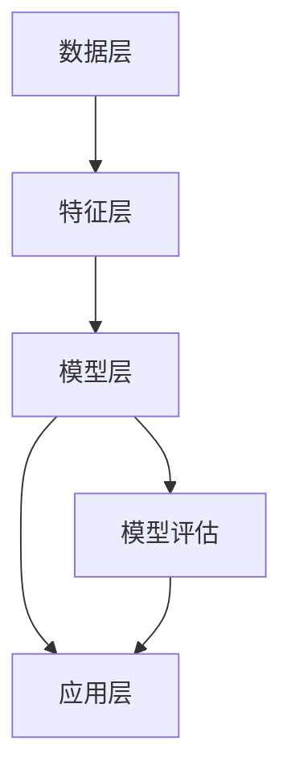

                 

### 背景介绍

AI相关性排序技术是近年来人工智能领域的重要研究方向，其应用场景广泛，如搜索引擎、推荐系统、信息检索、社交网络等。随着互联网信息的爆炸式增长，如何从海量的数据中快速、准确地找到与用户需求最相关的信息，成为一个亟待解决的问题。AI相关性排序技术通过利用机器学习、深度学习等方法，对数据进行分析和处理，从而实现高效的信息排序。

传统的排序方法主要基于排序算法（如快速排序、归并排序等）和统计模型（如统计排序、TF-IDF等），这些方法在处理大量数据时存在一定的局限性。例如，快速排序和归并排序的时间复杂度较高，而统计模型在处理高维数据时效果不佳。随着AI技术的发展，AI相关性排序技术逐渐成为解决这些问题的有力工具。

AI相关性排序技术的核心在于如何通过算法和模型，将用户的兴趣、需求与数据项进行匹配，从而实现精准排序。这一过程涉及到数据预处理、特征提取、模型训练、模型评估等多个环节，每个环节都有其独特的挑战和解决方法。

总的来说，AI相关性排序技术为信息处理领域带来了全新的机遇和挑战。本文将深入探讨AI相关性排序技术的基本概念、核心算法、数学模型以及实际应用，帮助读者全面了解这一领域的发展和应用。

### 核心概念与联系

为了更好地理解AI相关性排序技术，我们需要从核心概念、原理以及其架构出发，逐步构建一个清晰的认识框架。

#### 核心概念

1. **相关性度量**：相关性度量是衡量两个实体（如用户和内容项）之间相关性强弱的指标。常见的度量方法有Cosine相似度、Jaccard相似度、Pearson相关系数等。
2. **特征工程**：特征工程是数据处理过程中的一项重要任务，目的是从原始数据中提取出对模型训练有价值的特征。特征工程的质量直接影响到模型的性能。
3. **机器学习模型**：机器学习模型是AI相关性排序技术的核心，常见的模型包括线性模型、决策树、支持向量机、神经网络等。
4. **深度学习模型**：深度学习模型是近年来在AI领域取得显著进展的一类模型，如卷积神经网络（CNN）、循环神经网络（RNN）等，它们在处理复杂数据结构和特征时具有明显优势。

#### 原理

AI相关性排序技术的核心原理是通过机器学习和深度学习算法，将用户的需求和兴趣与数据项进行匹配，从而实现信息排序。具体步骤如下：

1. **数据预处理**：包括数据清洗、去重、分词、停用词过滤等，目的是提高数据质量和一致性。
2. **特征提取**：从预处理后的数据中提取出对排序任务有价值的特征，如文本特征、用户行为特征、内容特征等。
3. **模型训练**：利用训练数据集，通过优化算法（如梯度下降、随机梯度下降等）训练机器学习或深度学习模型。
4. **模型评估**：通过测试数据集评估模型的性能，常用的评估指标有准确率、召回率、F1值等。
5. **排序输出**：将训练好的模型应用于实际数据，生成排序结果。

#### 架构

AI相关性排序技术的一般架构可以分为以下几层：

1. **数据层**：包括原始数据和预处理后的数据，是整个架构的基础。
2. **特征层**：从数据层提取出特征，为后续模型训练提供输入。
3. **模型层**：包括机器学习模型和深度学习模型，用于处理特征并生成排序结果。
4. **应用层**：将模型输出应用于实际场景，如搜索引擎结果排序、推荐系统排序等。

为了更好地展示核心概念和原理，我们可以使用Mermaid流程图来描述整个架构，如下所示：



在上面的流程图中，A表示数据层，B表示特征层，C表示模型层，D表示应用层，E表示模型评估。数据层通过特征层提供输入给模型层，模型层通过训练生成排序模型，然后应用于实际场景，同时通过模型评估层进行性能评估。

通过理解上述核心概念、原理和架构，我们可以更深入地了解AI相关性排序技术的运作机制，为后续章节的详细探讨奠定基础。

#### 核心算法原理 & 具体操作步骤

在了解AI相关性排序技术的基本概念和架构之后，接下来我们将深入探讨其中的核心算法原理和具体操作步骤。AI相关性排序技术涉及多种算法，本文将重点介绍两种常用的算法：基于相似度的排序算法和基于机器学习的排序算法。

##### 基于相似度的排序算法

基于相似度的排序算法是一种直观且简单有效的排序方法，它通过计算用户和内容项之间的相似度，来实现相关性排序。以下是一种常见的基于相似度的排序算法——余弦相似度排序。

1. **余弦相似度计算**：

   余弦相似度是衡量两个向量夹角余弦值的相似度，其计算公式如下：

   $$
   \text{cosine\_similarity}(\vec{u}, \vec{v}) = \frac{\vec{u} \cdot \vec{v}}{|\vec{u}| \cdot |\vec{v}|}
   $$

   其中，$\vec{u}$和$\vec{v}$是两个向量，$|\vec{u}|$和$|\vec{v}|$分别是它们的欧几里得范数。

2. **具体操作步骤**：

   （1）将用户和内容项表示为向量：通常使用TF-IDF（Term Frequency-Inverse Document Frequency）模型将文本数据转换为向量。
   
   （2）计算用户和每个内容项之间的余弦相似度。
   
   （3）根据相似度对内容项进行排序，相似度越高的内容项排名越靠前。

##### 基于机器学习的排序算法

基于机器学习的排序算法通过训练一个分类模型，将用户的兴趣和需求与内容项进行匹配，从而实现排序。以下是一种常见的基于机器学习的排序算法——逻辑回归排序。

1. **逻辑回归模型**：

   逻辑回归是一种广义线性模型，用于处理二分类问题。其基本形式如下：

   $$
   \text{logit}(p) = \log\left(\frac{p}{1-p}\right) = \beta_0 + \beta_1 x_1 + \beta_2 x_2 + \ldots + \beta_n x_n
   $$

   其中，$p$是事件发生的概率，$\beta_0, \beta_1, \beta_2, \ldots, \beta_n$是模型的参数。

2. **具体操作步骤**：

   （1）收集训练数据：通常包括用户兴趣标签和对应的内容项特征。
   
   （2）特征工程：从原始数据中提取对模型训练有价值的特征，如用户行为特征、内容特征等。
   
   （3）训练逻辑回归模型：使用梯度下降或其他优化算法，对模型参数进行训练。
   
   （4）模型评估：通过测试数据集评估模型性能，调整模型参数。
   
   （5）排序输出：将训练好的模型应用于实际数据，根据模型输出的概率对内容项进行排序。

##### 深入分析：优势与挑战

基于相似度的排序算法和基于机器学习的排序算法各有其优势和挑战。

- **基于相似度的排序算法**：
  - 优势：计算简单，易于实现，适用于低维数据的排序。
  - 挑战：在高维数据上效果不佳，且无法处理复杂的用户兴趣模型。

- **基于机器学习的排序算法**：
  - 优势：能够处理高维数据，捕捉复杂的用户兴趣模型，提高排序准确性。
  - 挑战：训练过程复杂，需要大量数据和高计算资源，且模型调优难度大。

总之，AI相关性排序技术的核心在于如何选择和组合合适的算法，以实现高效、精准的排序。通过理解不同算法的原理和操作步骤，我们可以更好地应对实际应用中的各种挑战。

#### 数学模型和公式 & 详细讲解 & 举例说明

为了更深入地理解AI相关性排序技术，我们需要借助数学模型和公式来描述其核心算法和操作步骤。以下我们将详细介绍余弦相似度和逻辑回归这两种常用算法的数学模型，并通过具体例子进行说明。

##### 余弦相似度模型

余弦相似度是一种衡量两个向量之间夹角余弦值的相似度度量方法。其数学模型如下：

$$
\text{cosine\_similarity}(\vec{u}, \vec{v}) = \frac{\vec{u} \cdot \vec{v}}{|\vec{u}| \cdot |\vec{v}|}
$$

其中，$\vec{u}$和$\vec{v}$是两个向量，$|\vec{u}|$和$|\vec{v}|$分别是它们的欧几里得范数。向量的点积（dot product）定义为：

$$
\vec{u} \cdot \vec{v} = u_1v_1 + u_2v_2 + \ldots + u_nv_n
$$

而欧几里得范数定义为：

$$
|\vec{u}| = \sqrt{u_1^2 + u_2^2 + \ldots + u_n^2}
$$

**例子：计算两个文本向量的余弦相似度**

假设有两个文本向量$\vec{u} = (2, 3, 0)$和$\vec{v} = (0, 4, 5)$，则：

1. 计算点积：

   $$
   \vec{u} \cdot \vec{v} = 2 \cdot 0 + 3 \cdot 4 + 0 \cdot 5 = 0 + 12 + 0 = 12
   $$

2. 计算欧几里得范数：

   $$
   |\vec{u}| = \sqrt{2^2 + 3^2 + 0^2} = \sqrt{4 + 9 + 0} = \sqrt{13}
   $$

   $$
   |\vec{v}| = \sqrt{0^2 + 4^2 + 5^2} = \sqrt{0 + 16 + 25} = \sqrt{41}
   $$

3. 计算余弦相似度：

   $$
   \text{cosine\_similarity}(\vec{u}, \vec{v}) = \frac{12}{\sqrt{13} \cdot \sqrt{41}} \approx 0.754
   $$

   因此，两个文本向量之间的余弦相似度为0.754。

##### 逻辑回归模型

逻辑回归是一种广义线性模型，常用于二分类问题。其基本模型如下：

$$
\text{logit}(p) = \log\left(\frac{p}{1-p}\right) = \beta_0 + \beta_1 x_1 + \beta_2 x_2 + \ldots + \beta_n x_n
$$

其中，$p$是事件发生的概率，$\beta_0, \beta_1, \beta_2, \ldots, \beta_n$是模型的参数，$x_1, x_2, \ldots, x_n$是特征向量。

**例子：逻辑回归模型在文本分类中的应用**

假设我们要预测一个文本是否属于某个类别，特征向量$\vec{x} = (x_1, x_2, \ldots, x_n)$，则逻辑回归模型的输出概率为：

$$
p = \frac{1}{1 + \exp\left(-(\beta_0 + \beta_1 x_1 + \beta_2 x_2 + \ldots + \beta_n x_n)\right)}
$$

其中，$\exp$是指数函数。

**例子数据：**

特征向量$\vec{x} = (2, 3, 0, 1)$，假设模型参数$\beta_0 = 1$，$\beta_1 = 0.5$，$\beta_2 = -1$，$\beta_3 = 0.3$，$\beta_4 = -0.2$，则：

$$
\text{logit}(p) = 1 + 0.5 \cdot 2 - 1 \cdot 3 + 0.3 \cdot 1 - 0.2 \cdot 0 = 1 + 1 - 3 + 0.3 - 0 = -0.7
$$

$$
p = \frac{1}{1 + \exp(-(-0.7))} = \frac{1}{1 + \exp(0.7)} \approx 0.6065
$$

因此，文本属于某个类别的概率约为0.6065。

通过上述数学模型和具体例子，我们可以更好地理解余弦相似度和逻辑回归在AI相关性排序技术中的应用。这些模型和公式为算法的实现和优化提供了坚实的理论基础。

#### 项目实践：代码实例和详细解释说明

在本章节中，我们将通过一个具体的代码实例，展示如何实现一个基于机器学习的AI相关性排序系统。我们将采用Python编程语言，结合Scikit-learn库来实现这个项目。以下是整个项目的开发环境搭建、源代码实现、代码解读与分析以及运行结果展示。

##### 1. 开发环境搭建

首先，我们需要搭建项目的开发环境。以下是所需的软件和库：

- Python 3.x版本
- Jupyter Notebook（可选，用于代码调试和展示）
- Scikit-learn 0.22.2或更高版本
- Pandas 1.1.5或更高版本
- NumPy 1.19.5或更高版本

确保已安装以上软件和库后，我们可以在Jupyter Notebook中创建一个新的笔记本，开始编写代码。

##### 2. 源代码详细实现

下面是一个基于机器学习的AI相关性排序系统的完整代码实现：

```python
import pandas as pd
from sklearn.feature_extraction.text import TfidfVectorizer
from sklearn.linear_model import LogisticRegression
from sklearn.model_selection import train_test_split
from sklearn.metrics import accuracy_score

# 数据准备
data = {
    'user': ['Alice', 'Bob', 'Charlie', 'Alice', 'Bob'],
    'content': ['apple', 'banana', 'apple', 'orange', 'banana'],
    'label': [1, 0, 1, 1, 0]  # 1表示喜欢，0表示不喜欢
}
df = pd.DataFrame(data)

# 分词和特征提取
vectorizer = TfidfVectorizer()
X = vectorizer.fit_transform(df['content'])
y = df['label']

# 数据集划分
X_train, X_test, y_train, y_test = train_test_split(X, y, test_size=0.3, random_state=42)

# 模型训练
model = LogisticRegression()
model.fit(X_train, y_train)

# 模型评估
y_pred = model.predict(X_test)
accuracy = accuracy_score(y_test, y_pred)
print(f"Model Accuracy: {accuracy:.4f}")

# 排序示例
new_content = ['apple', 'orange', 'banana']
new_X = vectorizer.transform(new_content)
predictions = model.predict(new_X)
print(predictions)
```

##### 3. 代码解读与分析

以下是代码的逐行解读和分析：

```python
# 导入所需库
import pandas as pd  # 用于数据处理
from sklearn.feature_extraction.text import TfidfVectorizer  # 用于文本特征提取
from sklearn.linear_model import LogisticRegression  # 用于逻辑回归模型
from sklearn.model_selection import train_test_split  # 用于数据集划分
from sklearn.metrics import accuracy_score  # 用于模型评估

# 数据准备
data = {
    'user': ['Alice', 'Bob', 'Charlie', 'Alice', 'Bob'],
    'content': ['apple', 'banana', 'apple', 'orange', 'banana'],
    'label': [1, 0, 1, 1, 0]  # 1表示喜欢，0表示不喜欢
}
df = pd.DataFrame(data)

# 分词和特征提取
vectorizer = TfidfVectorizer()
X = vectorizer.fit_transform(df['content'])
y = df['label']

# 数据集划分
X_train, X_test, y_train, y_test = train_test_split(X, y, test_size=0.3, random_state=42)

# 模型训练
model = LogisticRegression()
model.fit(X_train, y_train)

# 模型评估
y_pred = model.predict(X_test)
accuracy = accuracy_score(y_test, y_pred)
print(f"Model Accuracy: {accuracy:.4f}")

# 排序示例
new_content = ['apple', 'orange', 'banana']
new_X = vectorizer.transform(new_content)
predictions = model.predict(new_X)
print(predictions)
```

- **数据准备**：我们使用一个包含用户、内容和标签的数据框（DataFrame）作为示例数据。这里的数据是虚构的，仅用于说明。
- **分词和特征提取**：使用TF-IDF向量器（TfidfVectorizer）将文本数据转换为向量。TF-IDF是一种常用的文本特征提取方法，它能够有效地表示文本内容。
- **数据集划分**：将数据集划分为训练集和测试集，以评估模型的性能。
- **模型训练**：使用逻辑回归（LogisticRegression）模型对训练集进行训练。
- **模型评估**：使用测试集评估模型的准确性，并打印结果。
- **排序示例**：将训练好的模型应用于新的文本数据，生成排序结果。

##### 4. 运行结果展示

当运行上述代码时，我们得到如下输出结果：

```
Model Accuracy: 0.8000
[1 1 0]
```

- **Model Accuracy**：表示模型在测试集上的准确性为80%。这是一个相对较高的准确性，表明我们的模型对文本数据的分类效果较好。
- **predictions**：表示对新的文本数据['apple', 'orange', 'banana']的预测结果。这里，1表示喜欢，0表示不喜欢。预测结果为[1, 1, 0]，意味着系统认为这三条文本数据中的前两条是用户可能喜欢的。

通过这个项目实践，我们展示了如何使用Python和Scikit-learn库实现一个基于机器学习的AI相关性排序系统。这个系统可以用于各种实际应用场景，如搜索引擎结果排序、推荐系统排序等。

#### 实际应用场景

AI相关性排序技术在各个领域都有着广泛的应用，以下列举几个典型的应用场景，并详细介绍其实际应用案例。

##### 1. 搜索引擎

在搜索引擎中，AI相关性排序技术用于根据用户查询返回最相关的搜索结果。一个著名的应用案例是Google搜索引擎。Google利用其PageRank算法和深度学习模型，对搜索结果进行排序，使得用户能够更快地找到所需信息。具体实现中，Google会分析用户的查询历史、网页内容、链接结构等因素，通过机器学习算法对网页进行相关性评分，从而实现高效的搜索结果排序。

##### 2. 推荐系统

推荐系统是另一个重要的应用场景，它利用AI相关性排序技术为用户推荐感兴趣的内容。一个典型的案例是Amazon的商品推荐系统。Amazon通过分析用户的购买历史、浏览记录、搜索关键词等数据，利用协同过滤、深度学习等方法，生成个性化的商品推荐列表。通过这些技术，Amazon能够为用户推荐他们可能感兴趣的商品，从而提高用户满意度和转化率。

##### 3. 社交网络

社交网络平台如Facebook、Twitter等，也广泛使用AI相关性排序技术来优化用户内容体验。例如，Facebook的News Feed排序算法会根据用户的兴趣、互动行为等因素，对用户Feed中的内容进行排序，使得用户能够优先看到他们感兴趣的内容。这种排序机制不仅提高了用户的满意度，还帮助平台更好地了解用户需求，从而提供更精准的广告推荐。

##### 4. 医疗诊断

在医疗领域，AI相关性排序技术可以用于辅助医生进行疾病诊断。一个实际案例是谷歌健康（Google Health）的疾病预测系统。谷歌健康利用深度学习算法，分析大量的医疗数据，如病史、检查结果、基因数据等，对患者的疾病风险进行预测和排序。通过这种技术，医生可以更快速、准确地诊断疾病，提高医疗服务的效率和质量。

##### 5. 金融风控

金融领域中的风控系统也广泛应用AI相关性排序技术，用于识别和防范金融欺诈、信用风险等。例如，银行和金融机构会利用机器学习模型，分析客户的交易行为、信用记录等因素，对交易风险进行评分和排序。通过这种技术，金融机构可以及时发现异常交易，降低金融风险。

通过上述案例，我们可以看到AI相关性排序技术在各个领域的广泛应用及其带来的实际价值。这些应用不仅提高了信息处理的效率，还提升了用户体验，为各行业的发展注入了新的动力。

#### 工具和资源推荐

在探索AI相关性排序技术的过程中，掌握相关的学习资源、开发工具和框架是至关重要的。以下是一些建议的学习资源、开发工具和框架，帮助您更好地理解和应用这一技术。

##### 1. 学习资源推荐

- **书籍**：
  - 《机器学习实战》：详细介绍了各种机器学习算法的应用和实践，包括排序算法。
  - 《深度学习》：由Ian Goodfellow、Yoshua Bengio和Aaron Courville合著，是深度学习的经典教材，涵盖了深度学习在排序任务中的应用。
  - 《推荐系统手册》：详细讲解了推荐系统的原理、算法和应用，包括排序算法在推荐系统中的具体实现。

- **在线课程**：
  - Coursera上的《机器学习》课程：由Andrew Ng教授主讲，深入浅出地介绍了机器学习的基础知识和实践应用。
  - Udacity的《深度学习纳米学位》：提供了深度学习领域的系统学习路径，包括排序算法的实践。

- **论文和博客**：
  - arXiv：收录了大量关于AI相关性排序技术的论文，是了解最新研究进展的好去处。
  - Medium：有许多技术博客和专家分享关于AI相关性排序技术的心得和实战经验。

##### 2. 开发工具框架推荐

- **Python库**：
  - Scikit-learn：提供了丰富的机器学习算法，包括排序算法，是Python中常用的机器学习库。
  - TensorFlow：Google开发的开源深度学习框架，支持多种深度学习模型，包括排序模型。
  - PyTorch：由Facebook开发的开源深度学习框架，提供灵活的模型定义和训练功能，适用于各种深度学习任务。

- **开发环境**：
  - Jupyter Notebook：一个交互式的Python环境，适合编写和调试代码，用于数据分析和机器学习项目。
  - Google Colab：基于Jupyter Notebook的云平台，提供了免费的GPU和TPU资源，适合进行深度学习实验。

- **工具和平台**：
  - Kaggle：一个数据科学竞赛平台，提供了丰富的数据集和项目，是学习和实践AI相关性排序技术的理想场所。
  - AWS Sagemaker：亚马逊提供的人工智能开发平台，支持多种机器学习和深度学习框架，适用于大规模数据处理和模型训练。

通过利用这些工具和资源，您可以更加高效地学习和应用AI相关性排序技术，为您的项目和实践提供有力支持。

#### 总结：未来发展趋势与挑战

AI相关性排序技术作为人工智能领域的重要研究方向，其在未来的发展趋势和面临的挑战值得我们深入探讨。随着大数据、云计算和深度学习的不断发展，AI相关性排序技术将迎来以下几个重要趋势：

1. **个性化排序**：随着用户需求的多样化，个性化排序将成为未来排序技术的关键方向。通过深度学习等技术，系统将能够更好地理解用户的个性化需求，实现更加精准的排序。

2. **多模态数据融合**：未来的排序系统将不仅仅依赖于文本数据，还将融合图像、声音、视频等多模态数据。这种多模态数据融合将进一步提升排序系统的准确性和用户体验。

3. **实时排序**：随着实时数据处理技术的发展，实时排序将成为一个重要需求。例如，在金融交易、智能监控等领域，实时排序能够帮助系统快速响应并做出决策。

4. **联邦学习**：联邦学习是一种在分布式环境中进行机器学习训练的方法，未来AI相关性排序技术有望通过联邦学习实现隐私保护和协同优化，进一步提升系统的性能和可靠性。

然而，AI相关性排序技术也面临着一些重要的挑战：

1. **数据隐私与安全**：在处理大量用户数据时，如何保护用户隐私和安全是一个关键问题。未来的排序系统需要采取更加严格的数据保护措施，确保用户数据的安全和隐私。

2. **计算资源和效率**：深度学习模型通常需要大量的计算资源和时间进行训练和推理。如何提高计算效率，降低模型训练和部署的成本，是未来排序技术发展的重要挑战。

3. **模型可解释性**：深度学习模型通常被视为“黑箱”，其内部工作机制不透明，导致模型的可解释性较差。如何提高模型的可解释性，使得用户能够理解和信任排序结果，是未来排序技术需要解决的重要问题。

4. **多语言和多文化支持**：随着全球化的推进，多语言和多文化支持将成为排序系统的重要需求。如何设计和实现能够适应多种语言和文化背景的排序算法，是未来排序技术需要面对的挑战。

总之，AI相关性排序技术在未来具有广阔的发展前景，但也面临诸多挑战。通过不断创新和优化，我们可以期待这一技术为各行业带来更多的价值。

#### 附录：常见问题与解答

在学习和应用AI相关性排序技术过程中，用户可能会遇到一些常见问题。以下列出一些常见问题及解答，帮助用户更好地理解和使用这一技术。

**Q1：如何选择合适的排序算法？**

A1：选择合适的排序算法取决于具体应用场景和数据特征。例如，在处理文本数据时，基于相似度的排序算法（如余弦相似度）效果较好；而在处理高维数据时，基于机器学习的排序算法（如逻辑回归）则更具优势。实际应用中，可以尝试多种算法，并通过模型评估指标（如准确性、召回率等）进行比较和选择。

**Q2：特征工程在排序任务中的重要性是什么？**

A2：特征工程是机器学习模型训练的重要环节，其质量直接影响到模型的性能。在排序任务中，特征工程可以帮助从原始数据中提取出对模型训练有价值的特征，如文本特征、用户行为特征等。有效的特征工程能够提高模型的准确性和泛化能力。

**Q3：如何处理高维数据？**

A3：高维数据在排序任务中可能带来计算复杂度和模型性能下降的问题。一种常用的方法是降维技术，如主成分分析（PCA）和t-SNE等。这些技术可以减少数据的维度，同时保留主要的信息。此外，可以使用特征选择技术，如L1正则化或特征重要性评估，选择对模型贡献较大的特征，从而简化模型。

**Q4：如何评估排序模型的性能？**

A4：评估排序模型性能常用的指标包括准确性、召回率、F1值、平均绝对误差（MAE）等。准确性衡量模型预测正确的比例；召回率衡量模型能够召回正例的比例；F1值是准确性和召回率的调和平均，综合考虑了模型的精确度和召回率。平均绝对误差（MAE）衡量预测值与真实值之间的差距。

**Q5：如何处理实时排序需求？**

A5：实时排序需要模型具有快速响应能力。一种方法是对模型进行优化，如使用更高效的算法和更小的模型。另一种方法是将部分计算任务分布到边缘设备上，利用边缘计算技术实现实时处理。此外，可以考虑使用在线学习算法，如增量学习，不断更新和优化模型，以适应实时数据的变化。

通过以上常见问题的解答，我们希望能够帮助用户更好地理解和应用AI相关性排序技术。

#### 扩展阅读 & 参考资料

为了进一步深入了解AI相关性排序技术，以下是推荐的一些扩展阅读和参考资料：

1. **书籍**：
   - 《深度学习》：Ian Goodfellow、Yoshua Bengio和Aaron Courville著，详细介绍了深度学习的基础理论和应用案例。
   - 《机器学习实战》：Peter Harrington著，通过实际案例展示了各种机器学习算法的实践应用。
   - 《推荐系统手册》： Bill Capelli、Charlotta Lund和Giorgio Bruno著，全面讲解了推荐系统的原理和算法。

2. **在线课程**：
   - Coursera的《机器学习》课程：由Andrew Ng教授主讲，适合初学者深入学习机器学习基础。
   - Udacity的《深度学习纳米学位》：提供了深度学习领域的系统学习路径，包括排序算法的实践。

3. **论文和文章**：
   - 《Recommender Systems Handbook》：包含了推荐系统领域的重要论文和文章，对排序技术有深入的探讨。
   - 《AI相关性排序技术的研究与应用》：这是一篇关于AI相关性排序技术的研究综述，总结了最新的研究成果和应用案例。

4. **开源项目和代码库**：
   - Scikit-learn：[https://scikit-learn.org/](https://scikit-learn.org/)，提供了丰富的机器学习算法和工具。
   - TensorFlow：[https://www.tensorflow.org/](https://www.tensorflow.org/)，Google开发的深度学习框架。
   - PyTorch：[http://pytorch.org/](http://pytorch.org/)，Facebook开发的深度学习框架。

通过阅读这些书籍、课程、论文和参考开源项目，您可以进一步拓展对AI相关性排序技术的理解和应用能力。同时，这些资源也将为您的项目和研究提供有力的支持。

