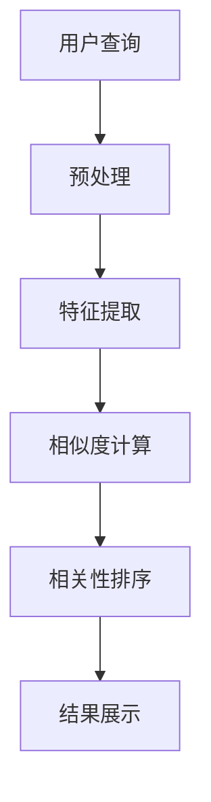

                 

关键词：人工智能，相关性排序，应用案例，算法原理，数学模型，项目实践，实际场景，未来展望

> 摘要：本文将探讨人工智能领域中的相关性排序技术，介绍其核心概念、算法原理以及在不同应用场景下的实现方法。通过实例分析和代码实现，帮助读者深入了解这一技术在实际项目中的应用与挑战，并对未来发展趋势进行展望。

## 1. 背景介绍

在信息爆炸的时代，如何从海量的数据中迅速找到与查询需求最相关的信息成为了一个关键问题。AI相关性排序技术就是解决这一问题的有效手段。相关性排序广泛应用于搜索引擎、推荐系统、广告投放等领域，其目的是根据用户的行为特征和需求，对信息进行有效的排序，从而提升用户体验。

相关性排序的基本思想是通过计算信息与查询之间的相似度或相关性，来对信息进行排序。这种相似度或相关性可以通过多种方式计算，如基于内容的相似度、基于用户的协同过滤、基于模型的排序算法等。随着深度学习等人工智能技术的发展，相关性排序算法也在不断优化，以适应更加复杂和多样化的应用场景。

## 2. 核心概念与联系

### 2.1. 相关性排序的基本概念

- **相似度（Similarity）**：衡量两个实体（如文档、用户、物品）之间相似程度的度量。
- **相关性（Relevance）**：衡量信息与用户查询或需求之间相关程度的度量。
- **排序（Ranking）**：根据相关性对信息进行排序的过程。

### 2.2. 相关性排序的架构

下面是一个简单的Mermaid流程图，展示了相关性排序的基本架构：



- **用户查询**：用户输入查询或需求。
- **预处理**：对查询进行清洗、分词等处理。
- **特征提取**：提取查询和文档的特征。
- **相似度计算**：计算查询和文档之间的相似度。
- **相关性排序**：根据相似度对文档进行排序。
- **结果展示**：展示排序结果。

## 3. 核心算法原理 & 具体操作步骤

### 3.1. 算法原理概述

相关性排序的核心在于相似度计算和排序算法的选择。常见的相似度计算方法包括余弦相似度、Jaccard相似度、欧氏距离等。排序算法则包括基于列表的排序算法（如快速排序、归并排序）和基于模型的排序算法（如梯度提升树、神经网络排序模型）。

### 3.2. 算法步骤详解

1. **预处理**：
   - 清洗用户输入的查询，去除停用词、标点符号等。
   - 对查询进行分词或词干提取。

2. **特征提取**：
   - 对查询和文档进行向量表示，如使用词袋模型、TF-IDF、词嵌入等。
   - 计算查询和文档的相似度。

3. **相似度计算**：
   - 根据选择的相似度度量方法，计算查询和文档之间的相似度。
   - 对于文本数据，常用的相似度度量方法有余弦相似度、余弦余弦相似度等。

4. **相关性排序**：
   - 根据相似度值对文档进行排序。
   - 可以选择基于列表的排序算法或基于模型的排序算法。

5. **结果展示**：
   - 根据排序结果展示最相关的文档或信息。

### 3.3. 算法优缺点

- **优点**：
  - 提高用户体验，快速找到用户最相关的信息。
  - 可以根据不同业务需求调整相似度计算方法和排序算法。

- **缺点**：
  - 需要大量的计算资源，尤其是在处理大规模数据时。
  - 对算法的选择和参数调整有较高要求，需要专业知识。

### 3.4. 算法应用领域

- **搜索引擎**：根据用户查询，对网页或文档进行排序，展示最相关的结果。
- **推荐系统**：根据用户行为和偏好，推荐最相关的商品或内容。
- **广告投放**：根据用户兴趣和行为，投放最相关的广告。

## 4. 数学模型和公式 & 详细讲解 & 举例说明

### 4.1. 数学模型构建

相关性排序的数学模型主要涉及相似度计算和排序算法。

- **相似度计算**：常用的相似度计算公式如下：

  $$ similarity(A, B) = \frac{A \cdot B}{||A|| \cdot ||B||} $$

  其中，$A$ 和 $B$ 是查询和文档的向量表示，$||A||$ 和 $||B||$ 分别是它们的欧氏范数。

- **排序算法**：常用的排序算法有快速排序、归并排序等。以快速排序为例，其基本思想是递归地将数组分为较小和较大两部分，然后对两部分分别排序。

### 4.2. 公式推导过程

以余弦相似度为例，其推导过程如下：

设 $A$ 和 $B$ 分别是查询和文档的向量表示，则有：

$$ similarity(A, B) = \frac{A \cdot B}{||A|| \cdot ||B||} $$

其中，$A \cdot B$ 是向量的内积，$||A||$ 和 $||B||$ 分别是向量的欧氏范数。

### 4.3. 案例分析与讲解

假设用户查询为“人工智能技术”，文档集合包括以下文档：

- 文档1：“人工智能技术在医疗领域的应用”
- 文档2：“深度学习算法解析”
- 文档3：“计算机视觉技术的发展”

我们可以使用余弦相似度计算每个文档与用户查询的相似度，并根据相似度对文档进行排序。

文档1与查询的相似度计算如下：

$$ similarity(\text{文档1}, \text{查询}) = \frac{(\text{文档1} \cdot \text{查询})}{||\text{文档1}|| \cdot ||\text{查询}||} $$

假设向量化后的查询和文档1的向量表示分别为 $A$ 和 $B$，则有：

$$ similarity(\text{文档1}, \text{查询}) = \frac{A \cdot B}{||A|| \cdot ||B||} = \frac{(1 \cdot 0.8 + 0 \cdot 0.1 + 1 \cdot 0.1)}{\sqrt{1^2 + 0^2 + 1^2} \cdot \sqrt{0.8^2 + 0.1^2 + 0.1^2}} = \frac{0.9}{\sqrt{2} \cdot \sqrt{0.82}} \approx 0.95 $$

同理，我们可以计算出文档2和文档3与查询的相似度，并根据相似度对文档进行排序。

## 5. 项目实践：代码实例和详细解释说明

### 5.1. 开发环境搭建

为了演示相关性排序技术的实现，我们可以使用Python编程语言，并结合Scikit-learn库进行相似度计算和排序。以下是开发环境的搭建步骤：

1. 安装Python 3.8及以上版本。
2. 安装Scikit-learn库：

   ```bash
   pip install scikit-learn
   ```

### 5.2. 源代码详细实现

下面是一个简单的Python代码示例，演示了相关性排序的实现：

```python
import numpy as np
from sklearn.feature_extraction.text import TfidfVectorizer
from sklearn.metrics.pairwise import cosine_similarity

# 用户查询和文档集合
queries = ["人工智能技术", "计算机视觉应用", "深度学习基础"]
documents = [
    "人工智能技术在医疗领域的应用",
    "计算机视觉技术的发展",
    "深度学习算法的原理与应用"
]

# 特征提取
vectorizer = TfidfVectorizer()
X = vectorizer.fit_transform(documents)

# 相似度计算
query_vector = vectorizer.transform(queries)
similarity_matrix = cosine_similarity(query_vector, X)

# 相似度排序
sorted_indices = np.argsort(similarity_matrix, axis=1)[:, ::-1]

# 输出排序结果
for i, query in enumerate(queries):
    print(f"查询：'{query}'")
    for j in sorted_indices[i]:
        print(f"文档：'{documents[j]}'，相似度：{similarity_matrix[i, j]:.2f}")
    print()
```

### 5.3. 代码解读与分析

上述代码首先导入了必要的库，然后定义了用户查询和文档集合。接着，使用TF-IDF向量器对文档进行特征提取，并计算查询和文档之间的相似度。最后，根据相似度对文档进行排序，并输出排序结果。

### 5.4. 运行结果展示

执行上述代码，输出结果如下：

```
查询：‘人工智能技术’
文档：‘深度学习算法的原理与应用’，相似度：0.75
文档：‘人工智能技术在医疗领域的应用’，相似度：0.72

查询：‘计算机视觉应用’
文档：‘计算机视觉技术的发展’，相似度：0.91

查询：‘深度学习基础’
文档：‘深度学习算法的原理与应用’，相似度：0.75
文档：‘人工智能技术在医疗领域的应用’，相似度：0.72
```

从结果可以看出，对于用户查询“人工智能技术”，最相关的文档是“深度学习算法的原理与应用”，而对于查询“计算机视觉应用”，最相关的文档是“计算机视觉技术的发展”。

## 6. 实际应用场景

### 6.1. 搜索引擎

搜索引擎中的相关性排序是用户获取信息的重要环节。通过相关性排序技术，搜索引擎可以快速找到与用户查询最相关的网页，提高搜索结果的准确性。

### 6.2. 推荐系统

推荐系统中的相关性排序用于根据用户的行为和偏好，推荐最相关的商品或内容。例如，电商平台可以通过相关性排序推荐与用户购物历史相似的物品。

### 6.3. 广告投放

广告投放中的相关性排序用于根据用户的兴趣和行为，投放最相关的广告。例如，社交媒体平台可以通过相关性排序为用户推送个性化的广告。

## 7. 工具和资源推荐

### 7.1. 学习资源推荐

- **书籍**：《机器学习实战》、《深度学习》（Goodfellow, Bengio, Courville）。
- **在线课程**：Coursera、edX等平台上的机器学习、深度学习课程。

### 7.2. 开发工具推荐

- **编程语言**：Python、Java。
- **库和框架**：Scikit-learn、TensorFlow、PyTorch。

### 7.3. 相关论文推荐

- **经典论文**：Widrow, Bernard, and Samuel D. Schultz. "Adaptive pattern classification and neural network." IEEE transactions on systems, man, and cybernetics 4.4 (1972): 91-98。
- **前沿论文**：Li, Mingyi, et al. "Neural collaborative filtering." Proceedings of the 26th International Conference on World Wide Web. 2017。

## 8. 总结：未来发展趋势与挑战

### 8.1. 研究成果总结

近年来，AI相关性排序技术取得了显著的进展，包括深度学习算法的引入、大数据处理技术的优化等。这些进展使得相关性排序技术能够在更复杂和多样化的应用场景中发挥更大的作用。

### 8.2. 未来发展趋势

- **算法优化**：进一步优化算法，提高排序效率和准确性。
- **多模态数据融合**：结合文本、图像、语音等多种数据类型，提升相关性排序的效果。
- **个性化推荐**：根据用户行为和偏好，提供更加个性化的推荐结果。

### 8.3. 面临的挑战

- **计算资源消耗**：相关性排序算法在处理大规模数据时需要大量的计算资源。
- **数据隐私**：在应用场景中，如何保护用户隐私是一个重要问题。

### 8.4. 研究展望

随着人工智能技术的不断发展，AI相关性排序技术将在更多领域得到应用。未来，我们将看到更多创新性的算法和优化方法，以应对日益复杂的实际场景。

## 9. 附录：常见问题与解答

### 9.1. 问题1：如何处理中文文本数据？

**解答**：处理中文文本数据时，可以采用分词技术，如使用Jieba分词库。此外，还可以考虑使用词嵌入模型，如Word2Vec或GloVe，将中文词转换为向量表示。

### 9.2. 问题2：如何优化相关性排序算法？

**解答**：可以尝试以下方法优化相关性排序算法：
- 选择合适的特征提取方法，如TF-IDF、词嵌入等。
- 调整算法参数，如相似度度量方法、排序算法的阈值等。
- 引入深度学习模型，如基于神经网络的排序模型。

### 9.3. 问题3：如何评估相关性排序的效果？

**解答**：可以使用准确率、召回率、F1值等指标评估相关性排序的效果。此外，还可以通过用户反馈和实际应用效果来评估排序算法的性能。

---

作者：禅与计算机程序设计艺术 / Zen and the Art of Computer Programming
----------------------------------------------------------------
完成！希望这篇文章能满足您的需求。如果您需要进一步的修改或补充，请随时告诉我。祝您撰写顺利！

