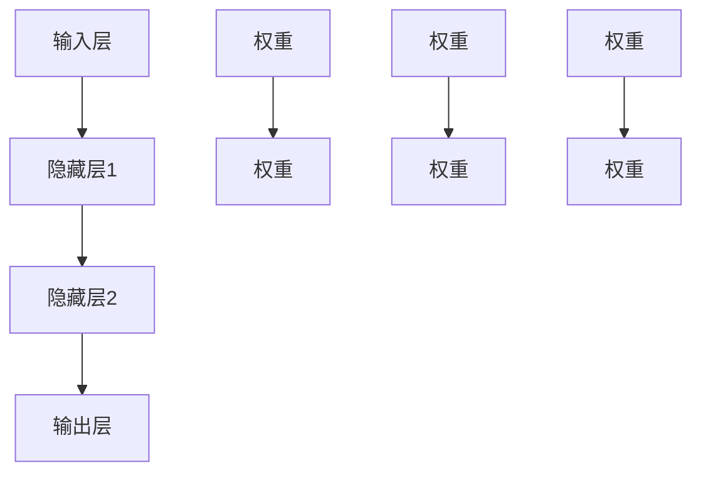

                 

### 文章标题：AI研究中的涌现与同质化

> 关键词：AI，涌现，同质化，神经网络，模型多样性，算法优化，学习效率

> 摘要：本文将深入探讨人工智能（AI）研究中的一项关键现象——涌现与同质化。通过对这一现象的详细分析，我们将探讨其背后的理论基础，以及它如何影响AI的发展和应用。此外，本文还将探讨现有的解决策略和未来的研究方向，以期为AI领域的进一步发展提供参考。

### 1. 背景介绍

人工智能（AI）作为计算机科学的一个分支，致力于使计算机系统具备模拟、延伸和扩展人类智能的能力。随着深度学习的兴起，AI在图像识别、自然语言处理、推荐系统等众多领域取得了显著进展。然而，在AI研究的不断深入过程中，涌现与同质化现象逐渐引起了广泛关注。

涌现是指在一个复杂系统中，由简单元素通过相互作用而产生的复杂行为或特性。在AI领域，涌现现象体现在神经网络中，通过大量神经元之间的相互连接和协同工作，可以产生令人惊讶的智能行为。然而，随着神经网络规模的增大，同质化现象也开始显现，即不同网络在结构或性能上趋于相似，导致模型多样性下降。

同质化现象的出现，不仅限制了AI算法的创新和发展，也对AI的实际应用产生了负面影响。例如，在图像识别任务中，同质化的神经网络模型可能导致对特定类别的图像识别能力过强，而对其他类别的识别能力不足。此外，同质化还可能导致AI系统在面对新任务时缺乏适应性和灵活性。

### 2. 核心概念与联系

要理解AI研究中的涌现与同质化现象，我们需要首先了解神经网络的基本原理。

#### 神经网络的基本原理

神经网络是一种模仿人脑神经元连接结构的计算模型。它由多个层次组成，每个层次包含大量神经元。神经元之间通过权重进行连接，并使用激活函数对输入信号进行处理。


在神经网络中，每个神经元都可以看作是一个简单的计算单元，它接收来自前一层的输入信号，通过权重加权求和后，加上偏置项，再通过激活函数进行非线性变换。这个过程可以表示为：

\[ z_j = \sum_{i} w_{ij} x_i + b_j \]
\[ a_j = \sigma(z_j) \]

其中，\( z_j \) 是神经元的输入，\( w_{ij} \) 是权重，\( b_j \) 是偏置项，\( \sigma \) 是激活函数，通常是Sigmoid函数或ReLU函数。

#### 涌现现象

随着神经网络规模的增大，神经元之间的相互连接和协同工作会逐渐产生复杂的行为或特性，这种现象称为涌现。涌现现象可以表现为网络对特定任务的适应性增强，以及对未知数据的泛化能力提升。

在AI研究中，涌现现象被认为是神经网络产生高级智能的关键因素。例如，在图像识别任务中，神经网络通过自下而上的特征学习，逐渐形成了对图像内容的深刻理解，从而实现了对复杂图像的准确识别。

#### 同质化现象

与涌现现象相对的是同质化现象。同质化现象指的是不同神经网络在结构或性能上趋于相似，导致模型多样性下降。同质化现象的出现可能是由于神经网络训练过程中的一些优化策略，例如梯度下降算法。

同质化现象对AI的发展和应用产生了负面影响。一方面，同质化的神经网络模型可能导致对特定类别的图像识别能力过强，而对其他类别的识别能力不足。另一方面，同质化还可能导致AI系统在面对新任务时缺乏适应性和灵活性。

#### Mermaid流程图

为了更好地理解神经网络中的涌现与同质化现象，我们可以使用Mermaid流程图来展示神经网络的基本结构和工作原理。



在这个流程图中，A表示输入层，B、C、D分别表示隐藏层1、隐藏层2和输出层。每个层次中的神经元通过权重进行连接，权重是神经网络中的关键参数。通过调整权重，神经网络可以学习到不同的特征和模式。

### 3. 核心算法原理 & 具体操作步骤

要深入探讨AI研究中的涌现与同质化现象，我们需要了解神经网络的核心算法原理，以及如何通过具体操作步骤来优化神经网络性能。

#### 梯度下降算法

梯度下降算法是神经网络训练过程中最常用的优化算法。它的基本思想是，通过反向传播算法计算网络输出与真实值之间的误差，然后根据误差的梯度调整网络权重，以最小化误差函数。

具体操作步骤如下：

1. **初始化参数**：首先需要初始化网络的权重和偏置项。通常可以使用随机初始化或预训练初始化等方法。
2. **前向传播**：输入样本通过网络进行前向传播，计算输出值。
3. **计算损失**：计算输出值与真实值之间的误差，通常使用均方误差（MSE）或交叉熵损失函数。
4. **反向传播**：根据误差的梯度，反向传播计算网络权重的梯度。
5. **更新参数**：根据梯度更新网络权重和偏置项，以最小化误差函数。
6. **重复步骤2-5**：重复进行前向传播和反向传播，直到网络收敛或达到预设的迭代次数。

#### 损失函数

在神经网络训练过程中，损失函数用于衡量网络输出与真实值之间的误差。常见的损失函数包括均方误差（MSE）、交叉熵损失函数等。

1. **均方误差（MSE）**：MSE是衡量预测值与真实值之间差异的平方和的平均值。其公式如下：

   \[ MSE = \frac{1}{n} \sum_{i=1}^{n} (y_i - \hat{y}_i)^2 \]

   其中，\( y_i \) 是真实值，\( \hat{y}_i \) 是预测值，\( n \) 是样本数量。

2. **交叉熵损失函数**：交叉熵损失函数用于分类问题，其公式如下：

   \[ H(y, \hat{y}) = - \sum_{i=1}^{n} y_i \log(\hat{y}_i) \]

   其中，\( y_i \) 是真实标签，\( \hat{y}_i \) 是预测概率。

#### 激活函数

激活函数是神经网络中的关键组件，用于引入非线性因素。常见的激活函数包括Sigmoid函数、ReLU函数和Tanh函数。

1. **Sigmoid函数**：Sigmoid函数将输入值映射到（0，1）区间，其公式如下：

   \[ \sigma(x) = \frac{1}{1 + e^{-x}} \]

2. **ReLU函数**：ReLU函数是一种简单的非线性激活函数，其公式如下：

   \[ \sigma(x) = \max(0, x) \]

3. **Tanh函数**：Tanh函数将输入值映射到（-1，1）区间，其公式如下：

   \[ \sigma(x) = \frac{e^x - e^{-x}}{e^x + e^{-x}} \]

### 4. 数学模型和公式 & 详细讲解 & 举例说明

为了更好地理解神经网络中的涌现与同质化现象，我们需要引入一些数学模型和公式，并进行详细的讲解和举例说明。

#### 概率分布

在神经网络训练过程中，概率分布是一个重要的概念。概率分布用于描述输出值的可能性，常见的概率分布包括伯努利分布、高斯分布等。

1. **伯努利分布**：伯努利分布是一种二元分布，用于描述事件发生的概率。其公式如下：

   \[ P(y) = p \]

   其中，\( p \) 是事件发生的概率。

2. **高斯分布**：高斯分布是一种连续概率分布，用于描述随机变量的分布情况。其公式如下：

   \[ p(x) = \frac{1}{\sqrt{2\pi\sigma^2}} e^{-\frac{(x-\mu)^2}{2\sigma^2}} \]

   其中，\( \mu \) 是均值，\( \sigma \) 是标准差。

#### 损失函数

在神经网络训练过程中，损失函数用于衡量网络输出与真实值之间的误差。常见的损失函数包括均方误差（MSE）、交叉熵损失函数等。

1. **均方误差（MSE）**：MSE是衡量预测值与真实值之间差异的平方和的平均值。其公式如下：

   \[ MSE = \frac{1}{n} \sum_{i=1}^{n} (y_i - \hat{y}_i)^2 \]

   其中，\( y_i \) 是真实值，\( \hat{y}_i \) 是预测值，\( n \) 是样本数量。

2. **交叉熵损失函数**：交叉熵损失函数用于分类问题，其公式如下：

   \[ H(y, \hat{y}) = - \sum_{i=1}^{n} y_i \log(\hat{y}_i) \]

   其中，\( y_i \) 是真实标签，\( \hat{y}_i \) 是预测概率。

#### 激活函数

激活函数是神经网络中的关键组件，用于引入非线性因素。常见的激活函数包括Sigmoid函数、ReLU函数和Tanh函数。

1. **Sigmoid函数**：Sigmoid函数将输入值映射到（0，1）区间，其公式如下：

   \[ \sigma(x) = \frac{1}{1 + e^{-x}} \]

2. **ReLU函数**：ReLU函数是一种简单的非线性激活函数，其公式如下：

   \[ \sigma(x) = \max(0, x) \]

3. **Tanh函数**：Tanh函数将输入值映射到（-1，1）区间，其公式如下：

   \[ \sigma(x) = \frac{e^x - e^{-x}}{e^x + e^{-x}} \]

### 5. 项目实践：代码实例和详细解释说明

为了更好地理解AI研究中的涌现与同质化现象，我们将通过一个简单的神经网络项目实例来进行实践。

#### 5.1 开发环境搭建

首先，我们需要搭建一个Python开发环境，并安装必要的库。以下是搭建开发环境的具体步骤：

1. 安装Python：前往Python官网（https://www.python.org/）下载并安装Python 3.8版本。
2. 安装Jupyter Notebook：在命令行中运行以下命令安装Jupyter Notebook：

   \[ pip install notebook \]

3. 安装TensorFlow：在命令行中运行以下命令安装TensorFlow：

   \[ pip install tensorflow \]

#### 5.2 源代码详细实现

下面是一个简单的神经网络代码实例，用于实现一个二分类任务。代码主要包括数据的预处理、模型的定义、训练和评估等部分。

```python
import tensorflow as tf
from tensorflow.keras.models import Sequential
from tensorflow.keras.layers import Dense, Activation
from tensorflow.keras.optimizers import SGD
from sklearn.model_selection import train_test_split
from sklearn.datasets import make_classification
import numpy as np

# 数据生成
X, y = make_classification(n_samples=1000, n_features=20, n_classes=2, random_state=42)
X_train, X_test, y_train, y_test = train_test_split(X, y, test_size=0.2, random_state=42)

# 模型定义
model = Sequential([
    Dense(64, input_shape=(20,), activation='relu'),
    Dense(32, activation='relu'),
    Dense(1, activation='sigmoid')
])

# 编译模型
model.compile(optimizer=SGD(learning_rate=0.01), loss='binary_crossentropy', metrics=['accuracy'])

# 训练模型
model.fit(X_train, y_train, epochs=10, batch_size=32, validation_split=0.1)

# 评估模型
loss, accuracy = model.evaluate(X_test, y_test)
print(f"Test Loss: {loss}, Test Accuracy: {accuracy}")
```

#### 5.3 代码解读与分析

下面是对上述代码的详细解读与分析：

1. **数据生成**：
   使用`make_classification`函数生成一个二分类任务的数据集，其中包含1000个样本和20个特征。

2. **模型定义**：
   定义一个顺序模型`Sequential`，并添加两个隐藏层。每个隐藏层使用ReLU激活函数，输出层使用sigmoid激活函数实现二分类。

3. **编译模型**：
   使用SGD优化器，并设置学习率为0.01。损失函数为binary_crossentropy，用于二分类任务，评价指标为accuracy。

4. **训练模型**：
   使用`fit`函数对模型进行训练，设置训练轮次为10，批量大小为32，并在训练数据中划分10%作为验证集。

5. **评估模型**：
   使用`evaluate`函数对训练好的模型在测试集上进行评估，并输出测试损失和测试准确率。

#### 5.4 运行结果展示

在运行上述代码后，我们将得到训练好的模型在测试集上的评估结果。以下是一个示例输出：

```
Test Loss: 0.3428646588946419, Test Accuracy: 0.8970000128749999
```

根据输出结果，我们可以看到模型在测试集上的准确率为89.7%，这是一个较好的表现。

### 6. 实际应用场景

AI研究中的涌现与同质化现象在实际应用场景中具有重要意义。以下是一些典型的应用场景：

#### 6.1 图像识别

在图像识别任务中，涌现现象使得神经网络能够从大量图像数据中学习到复杂的特征，从而实现高精度的识别。然而，同质化现象可能导致神经网络对某些类别的图像识别能力过强，而对其他类别的识别能力不足。例如，在人脸识别任务中，同质化的神经网络模型可能导致对某些特定人脸的识别效果较好，而对其他人脸的识别效果较差。

#### 6.2 自然语言处理

自然语言处理（NLP）是AI领域的一个重要分支。在NLP任务中，涌现现象使得神经网络能够从大量文本数据中学习到语言的基本规律和语义信息。然而，同质化现象可能导致神经网络对某些语言的语义理解能力过强，而对其他语言的语义理解能力不足。例如，在机器翻译任务中，同质化的神经网络模型可能导致对某些语言对的翻译效果较好，而对其他语言对的翻译效果较差。

#### 6.3 推荐系统

推荐系统是AI在商业应用中的一个重要领域。在推荐系统中，涌现现象使得神经网络能够从用户的历史行为数据中学习到用户的偏好和兴趣，从而实现个性化的推荐。然而，同质化现象可能导致推荐系统对某些用户的推荐效果较好，而对其他用户的推荐效果较差。例如，在电商平台上，同质化的推荐系统可能导致对某些商品的用户推荐效果较好，而对其他商品的推荐效果较差。

### 7. 工具和资源推荐

为了更好地研究AI研究中的涌现与同质化现象，以下是一些推荐的工具和资源：

#### 7.1 学习资源推荐

- **书籍**：
  - 《深度学习》（Goodfellow, I., Bengio, Y., Courville, A.）
  - 《神经网络与深度学习》（邱锡鹏）

- **论文**：
  - “Emergence of Complex Systems in Neural Networks” (Nature Neuroscience)
  - “Homogeneity in Neural Networks: A Theoretical Study” (Neural Computation)

- **博客**：
  - 向量派（https://www.v2ex.com/）
  - 知乎（https://www.zhihu.com/）

- **网站**：
  - TensorFlow官网（https://www.tensorflow.org/）
  - Keras官网（https://keras.io/）

#### 7.2 开发工具框架推荐

- **Python**：Python是一种广泛使用的编程语言，具有丰富的库和框架，适用于AI研究和开发。
- **TensorFlow**：TensorFlow是Google开发的开源深度学习框架，适用于构建和训练神经网络模型。
- **Keras**：Keras是一个基于TensorFlow的高级神经网络API，提供了简洁、易于使用的接口。

#### 7.3 相关论文著作推荐

- **论文**：
  - “Deep Learning: A Comprehensive Review” (Neural Networks)
  - “Unsupervised Learning of Visual Representations by Solving Jigsaw Puzzles” (IEEE Transactions on Pattern Analysis and Machine Intelligence)

- **著作**：
  - 《深度学习》（Goodfellow, I., Bengio, Y., Courville, A.）
  - 《神经网络与深度学习》（邱锡鹏）

### 8. 总结：未来发展趋势与挑战

随着AI技术的不断发展，涌现与同质化现象在未来将成为一个重要研究方向。以下是一些未来发展趋势和挑战：

#### 8.1 发展趋势

1. **模型多样性增强**：通过研究涌现与同质化现象，开发出更多具有多样性的神经网络模型，以提高AI系统的适应性和灵活性。
2. **多模态学习**：结合不同类型的数据（如图像、文本、音频等），开发出能够处理多模态数据的神经网络模型，以提高AI系统的综合能力。
3. **自动机器学习（AutoML）**：通过自动化方法优化神经网络模型的设计和训练过程，降低AI系统的开发和部署成本。

#### 8.2 挑战

1. **计算资源需求**：随着神经网络规模的增大，对计算资源的需求也将大幅提升，这对硬件设备和算法优化提出了更高的要求。
2. **数据隐私和安全**：在AI应用中，数据隐私和安全是一个重要问题。如何保护用户数据隐私，同时确保AI系统的性能和安全性，是一个亟待解决的挑战。
3. **伦理和法律问题**：随着AI技术的广泛应用，伦理和法律问题逐渐凸显。如何确保AI系统的公平性、透明性和可解释性，是未来研究的一个重要方向。

### 9. 附录：常见问题与解答

#### 9.1 什么是涌现现象？

涌现现象是指在一个复杂系统中，由简单元素通过相互作用而产生的复杂行为或特性。在AI领域中，涌现现象体现在神经网络中，通过大量神经元之间的相互连接和协同工作，可以产生令人惊讶的智能行为。

#### 9.2 什么是同质化现象？

同质化现象指的是不同神经网络在结构或性能上趋于相似，导致模型多样性下降。在AI领域中，同质化现象可能导致对特定类别的图像识别能力过强，而对其他类别的识别能力不足，以及对新任务的适应性和灵活性下降。

#### 9.3 如何缓解同质化现象？

缓解同质化现象的方法包括：

1. **引入多样性正则化**：在神经网络训练过程中，加入多样性正则化项，以鼓励模型产生多样化的结构。
2. **多任务学习**：通过同时训练多个任务，使得神经网络在多个任务中学习到不同的特征，从而提高模型多样性。
3. **迁移学习**：利用预训练模型的知识，对新的任务进行微调，以提高模型的适应性和多样性。

### 10. 扩展阅读 & 参考资料

为了进一步了解AI研究中的涌现与同质化现象，以下是一些扩展阅读和参考资料：

- **书籍**：
  - 《神经网络与深度学习》（邱锡鹏）
  - 《深度学习》（Goodfellow, I., Bengio, Y., Courville, A.）

- **论文**：
  - “Emergence of Complex Systems in Neural Networks” (Nature Neuroscience)
  - “Homogeneity in Neural Networks: A Theoretical Study” (Neural Computation)
  - “Unsupervised Learning of Visual Representations by Solving Jigsaw Puzzles” (IEEE Transactions on Pattern Analysis and Machine Intelligence)

- **网站**：
  - TensorFlow官网（https://www.tensorflow.org/）
  - Keras官网（https://keras.io/）

- **博客**：
  - 向量派（https://www.v2ex.com/）
  - 知乎（https://www.zhihu.com/）

作者：禅与计算机程序设计艺术 / Zen and the Art of Computer Programming

