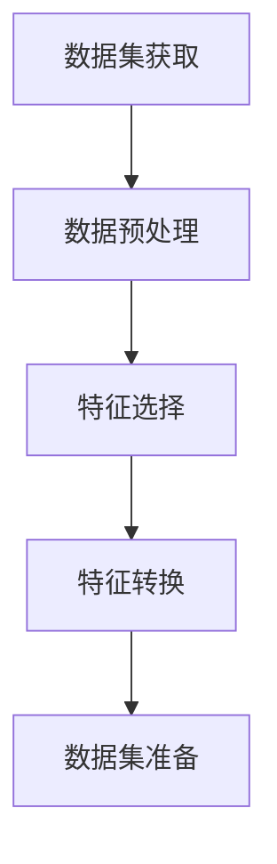
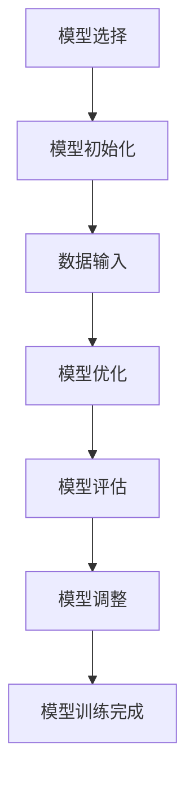
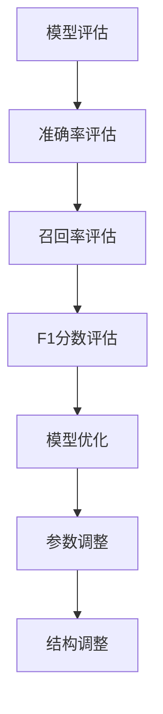
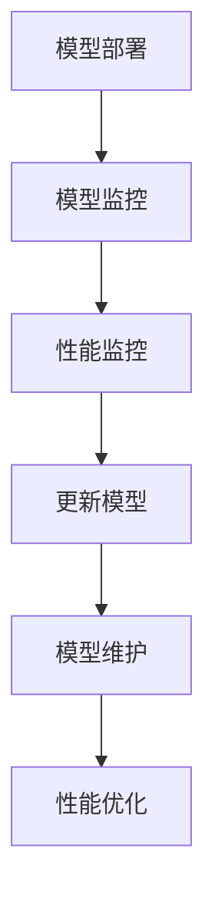

                 

### 1. 背景介绍

人工智能（AI）作为计算机科学的一个重要分支，已经在过去的几十年中经历了飞速的发展。从最初的符号推理和规则系统，到现代的深度学习和神经网络，AI在图像识别、自然语言处理、决策支持系统等多个领域展现出了巨大的潜力。而AI编程，作为实现这些人工智能系统的基础，也逐渐成为了程序员和科研人员必须掌握的核心技能。

随着大数据、云计算和物联网等技术的不断进步，AI编程的应用场景也变得越来越广泛。传统的编程思维已经无法满足AI系统的复杂性和动态性需求，因此，新的编程思维和技术挑战应运而生。本文将围绕AI编程的新思维与技术挑战展开讨论，旨在为读者提供一份全面、系统的指导。

本文将分为以下几个部分：

1. **背景介绍**：回顾AI编程的历史，分析当前的发展趋势和挑战。
2. **核心概念与联系**：介绍AI编程的核心概念，并使用Mermaid流程图展示相关架构。
3. **核心算法原理与具体操作步骤**：详细讲解AI编程中常用的算法，并展示具体操作步骤。
4. **数学模型和公式**：探讨AI编程中涉及的数学模型和公式，并进行详细讲解和举例说明。
5. **项目实践**：通过一个具体的代码实例，展示AI编程的实际应用。
6. **实际应用场景**：分析AI编程在不同领域的实际应用情况。
7. **工具和资源推荐**：推荐学习AI编程所需的工具和资源。
8. **总结**：总结AI编程的新思维和技术挑战，并展望未来发展趋势。
9. **附录**：提供常见的AI编程问题与解答。

接下来，我们将逐一探讨这些内容，帮助读者更好地理解AI编程的新思维和技术挑战。

### 2. 核心概念与联系

AI编程的核心概念和联系是多维度且复杂的。在这一部分，我们将介绍AI编程中的关键概念，并使用Mermaid流程图展示其架构，以便读者更好地理解这些概念之间的关系。

#### 2.1 数据集与特征工程

数据集是AI编程的基础。一个好的数据集能够为模型提供丰富的信息，从而提高模型的性能。特征工程则是将原始数据转换为适合模型训练的特征的过程。这一过程包括数据预处理、特征选择和特征转换等步骤。

**Mermaid流程图**：



#### 2.2 模型选择与训练

模型选择是AI编程的核心步骤之一。不同的模型适用于不同的任务和数据集。常见的模型包括线性回归、决策树、支持向量机、神经网络等。模型训练则是通过迭代优化模型参数，使其能够更好地拟合数据。

**Mermaid流程图**：



#### 2.3 模型评估与优化

模型评估是衡量模型性能的重要步骤。常用的评估指标包括准确率、召回率、F1分数等。模型优化则是通过调整模型参数和结构，提高模型的性能。

**Mermaid流程图**：



#### 2.4 模型部署与维护

模型部署是将训练好的模型应用到实际场景的过程。模型维护则包括监控模型性能、更新模型参数等。这一过程需要考虑模型的可靠性、效率和可扩展性。

**Mermaid流程图**：



通过上述Mermaid流程图，我们可以清晰地看到AI编程中各个核心概念之间的联系。这些概念不仅相互独立，而且相互影响，共同构成了AI编程的复杂架构。理解这些概念及其联系，是掌握AI编程的关键。

接下来，我们将详细探讨AI编程中的核心算法原理和具体操作步骤。

### 3. 核心算法原理与具体操作步骤

在AI编程中，核心算法是构建智能系统的基础。本节将介绍几种常用的AI算法，包括其基本原理和具体操作步骤。

#### 3.1 神经网络

神经网络是AI编程中最常用的算法之一，它通过模拟人脑的神经元结构，实现数据的处理和预测。以下是神经网络的基本原理和操作步骤：

**基本原理**：

- **神经元结构**：神经网络由多个神经元组成，每个神经元接受多个输入，并通过权重和偏置进行加权求和。
- **激活函数**：为了使神经网络能够处理非线性问题，每个神经元都会使用激活函数，如ReLU、Sigmoid、Tanh等。

**具体操作步骤**：

1. **初始化权重和偏置**：随机初始化网络的权重和偏置。
2. **前向传播**：输入数据通过网络的前向传播，每个神经元计算输入值和权重之间的乘积，并加上偏置，然后通过激活函数得到输出。
3. **反向传播**：计算输出值与真实值的误差，然后通过反向传播更新权重和偏置。
4. **迭代优化**：重复前向传播和反向传播的过程，直到网络达到预定的误差阈值。

**代码示例**：

```python
import numpy as np

# 初始化权重和偏置
weights = np.random.randn(input_size, hidden_size)
biases = np.random.randn(hidden_size, output_size)

# 前向传播
inputs = np.array([1, 0])
activations = np.dot(inputs, weights) + biases
outputs = 1 / (1 + np.exp(-activations))

# 反向传播
errors = outputs - targets
dinputs = errors * (outputs * (1 - outputs))
dweights = np.dot(dinputs, inputs.T)
dbiases = dinputs

# 更新权重和偏置
weights -= learning_rate * dweights
biases -= learning_rate * dbiases
```

#### 3.2 决策树

决策树是一种基于树形结构进行分类或回归的算法。它通过递归地将数据集分割成子集，并选择最佳分割点来实现分类或回归任务。

**基本原理**：

- **决策节点**：每个决策节点表示一个特征，每个特征都有多个取值，每个取值对应一个分支。
- **叶节点**：叶节点表示分类或回归的结果。

**具体操作步骤**：

1. **选择最佳分割点**：通过计算各个特征的增益率或信息增益，选择最佳分割点。
2. **递归分割**：将数据集分割成子集，并为每个子集创建新的决策节点。
3. **终止条件**：当满足停止条件（如最大深度、最小样本数等）时，创建叶节点。

**代码示例**：

```python
from sklearn.tree import DecisionTreeClassifier

# 创建决策树分类器
clf = DecisionTreeClassifier(max_depth=3)

# 训练模型
clf.fit(X_train, y_train)

# 预测
y_pred = clf.predict(X_test)
```

#### 3.3 支持向量机

支持向量机（SVM）是一种二分类模型，通过寻找最佳超平面，将数据集划分为不同的类别。

**基本原理**：

- **最佳超平面**：通过最大化分类间隔，找到最佳超平面。
- **支持向量**：位于最佳超平面两侧的数据点，对模型的分类能力有显著影响。

**具体操作步骤**：

1. **计算最优解**：通过求解二次规划问题，找到最佳超平面。
2. **分类决策**：新数据点通过计算与支持向量的距离，判断其所属类别。

**代码示例**：

```python
from sklearn.svm import SVC

# 创建支持向量机分类器
clf = SVC()

# 训练模型
clf.fit(X_train, y_train)

# 预测
y_pred = clf.predict(X_test)
```

通过上述算法的介绍和示例，我们可以看到AI编程中的核心算法是如何实现智能系统的。理解这些算法的基本原理和操作步骤，是进行AI编程的基础。接下来，我们将进一步探讨AI编程中的数学模型和公式。

### 4. 数学模型和公式 & 详细讲解 & 举例说明

AI编程不仅仅是编写代码，它还涉及到大量的数学模型和公式。这些模型和公式是构建和训练人工智能模型的基础，因此理解它们是至关重要的。本节将详细讲解AI编程中常用的数学模型和公式，并通过具体的例子进行说明。

#### 4.1 线性代数基础

线性代数是AI编程的基础之一，它提供了处理多维数据的有效工具。以下是线性代数中的一些重要概念和公式：

**矩阵乘法**：
\[ C = A \cdot B \]
其中，\( A \) 和 \( B \) 是矩阵，\( C \) 是结果矩阵。矩阵乘法用于计算两个矩阵的乘积。

**矩阵求逆**：
\[ A^{-1} = (1 / \det(A)) \cdot \text{adj}(A) \]
其中，\( A \) 是矩阵，\( \det(A) \) 是矩阵的行列式，\( \text{adj}(A) \) 是矩阵的伴随矩阵。矩阵求逆用于求解线性方程组。

**例1**：
给定矩阵 \( A = \begin{bmatrix} 1 & 2 \\ 3 & 4 \end{bmatrix} \)，计算其逆矩阵。

解：
首先计算行列式：
\[ \det(A) = 1 \cdot 4 - 2 \cdot 3 = -2 \]
然后计算伴随矩阵：
\[ \text{adj}(A) = \begin{bmatrix} 4 & -2 \\ -3 & 1 \end{bmatrix} \]
最后计算逆矩阵：
\[ A^{-1} = \frac{1}{-2} \cdot \begin{bmatrix} 4 & -2 \\ -3 & 1 \end{bmatrix} = \begin{bmatrix} -2 & 1 \\ 3/2 & -1/2 \end{bmatrix} \]

**向量点积**：
\[ \vec{a} \cdot \vec{b} = a_1 \cdot b_1 + a_2 \cdot b_2 + \ldots + a_n \cdot b_n \]
向量点积用于计算两个向量的内积。

**例2**：
给定向量 \( \vec{a} = \begin{bmatrix} 1 \\ 2 \end{bmatrix} \) 和 \( \vec{b} = \begin{bmatrix} 3 \\ 4 \end{bmatrix} \)，计算它们的点积。

解：
\[ \vec{a} \cdot \vec{b} = 1 \cdot 3 + 2 \cdot 4 = 11 \]

**向量叉积**：
\[ \vec{a} \times \vec{b} = \begin{vmatrix} \hat{i} & \hat{j} & \hat{k} \\ a_1 & a_2 & a_3 \\ b_1 & b_2 & b_3 \end{vmatrix} \]
向量叉积用于计算两个向量的外积。

**例3**：
给定向量 \( \vec{a} = \begin{bmatrix} 1 \\ 2 \\ 3 \end{bmatrix} \) 和 \( \vec{b} = \begin{bmatrix} 4 \\ 5 \\ 6 \end{bmatrix} \)，计算它们的叉积。

解：
\[ \vec{a} \times \vec{b} = \begin{vmatrix} \hat{i} & \hat{j} & \hat{k} \\ 1 & 2 & 3 \\ 4 & 5 & 6 \end{vmatrix} = \hat{i} \cdot (2 \cdot 6 - 3 \cdot 5) - \hat{j} \cdot (1 \cdot 6 - 3 \cdot 4) + \hat{k} \cdot (1 \cdot 5 - 2 \cdot 4) = \hat{i} \cdot (-3) - \hat{j} \cdot (-2) + \hat{k} \cdot (1) = \begin{bmatrix} -3 \\ 2 \\ 1 \end{bmatrix} \]

#### 4.2 概率论基础

概率论在AI编程中扮演着重要角色，特别是在机器学习和统计模型中。以下是概率论中的一些重要概念和公式：

**条件概率**：
\[ P(A|B) = \frac{P(A \cap B)}{P(B)} \]
条件概率表示在事件 \( B \) 发生的条件下，事件 \( A \) 发生的概率。

**贝叶斯定理**：
\[ P(A|B) = \frac{P(B|A) \cdot P(A)}{P(B)} \]
贝叶斯定理用于计算在给定事件 \( B \) 发生的条件下，事件 \( A \) 的概率。

**例4**：
假设一个袋子中有5个红球和3个蓝球，随机取出一个球，求取到红球的概率。

解：
总共有8个球，所以取到红球的概率 \( P(A) = \frac{5}{8} \)。
假设取出的球是红球，那么取出红球的概率 \( P(B|A) = 1 \)。
根据贝叶斯定理，取到红球的概率 \( P(A|B) = \frac{1 \cdot \frac{5}{8}}{1} = \frac{5}{8} \)。

**期望和方差**：
- 期望：\[ E(X) = \sum_{i=1}^{n} x_i \cdot P(x_i) \]
- 方差：\[ Var(X) = E[(X - E(X))^2] = \sum_{i=1}^{n} (x_i - E(X))^2 \cdot P(x_i) \]
期望和方差是衡量随机变量分布的中心位置和离散程度的统计量。

**例5**：
假设一个随机变量 \( X \) 表示投掷一个公平的六面骰子的结果，计算 \( X \) 的期望和方差。

解：
期望 \( E(X) \)：
\[ E(X) = \sum_{i=1}^{6} i \cdot \frac{1}{6} = \frac{1+2+3+4+5+6}{6} = 3.5 \]
方差 \( Var(X) \)：
\[ Var(X) = E[(X - E(X))^2] = \sum_{i=1}^{6} (i - 3.5)^2 \cdot \frac{1}{6} = \frac{(1-3.5)^2 + (2-3.5)^2 + (3-3.5)^2 + (4-3.5)^2 + (5-3.5)^2 + (6-3.5)^2}{6} = \frac{2.25 + 2.25 + 0.25 + 0.25 + 2.25 + 6.25}{6} = \frac{14}{6} = \frac{7}{3} \approx 2.33 \]

通过上述例子，我们可以看到线性代数和概率论在AI编程中的应用。掌握这些数学模型和公式，对于理解AI编程中的算法和实现智能系统至关重要。在接下来的部分，我们将通过一个具体的代码实例，展示AI编程的实际应用。

### 5. 项目实践：代码实例和详细解释说明

在本节中，我们将通过一个实际的项目实例，展示如何使用AI编程构建一个简单的智能系统。我们将使用Python语言和常见的机器学习库，如Scikit-learn，来创建一个基于决策树的分类器。这个项目将涵盖从数据预处理到模型训练和评估的完整流程。

#### 5.1 开发环境搭建

在开始项目之前，我们需要搭建一个合适的工作环境。以下是搭建开发环境所需的步骤：

1. **安装Python**：
   - 访问Python官方网站（[python.org](https://www.python.org/)）下载并安装Python。
   - 确保安装了Python 3.x版本（建议使用最新版本）。

2. **安装Jupyter Notebook**：
   - 打开终端或命令提示符，运行以下命令安装Jupyter Notebook：
     ```
     pip install notebook
     ```

3. **安装Scikit-learn**：
   - 同样在终端或命令提示符中，运行以下命令安装Scikit-learn：
     ```
     pip install scikit-learn
     ```

4. **安装其他必要的库**（可选）：
   - 如果你打算使用Matplotlib进行数据可视化，可以安装它：
     ```
     pip install matplotlib
     ```

#### 5.2 源代码详细实现

以下是一个简单的决策树分类器的实现代码示例：

```python
# 导入必要的库
import numpy as np
from sklearn.datasets import load_iris
from sklearn.model_selection import train_test_split
from sklearn.tree import DecisionTreeClassifier
from sklearn.metrics import accuracy_score

# 加载Iris数据集
iris = load_iris()
X = iris.data
y = iris.target

# 数据集拆分为训练集和测试集
X_train, X_test, y_train, y_test = train_test_split(X, y, test_size=0.3, random_state=42)

# 创建决策树分类器
clf = DecisionTreeClassifier()

# 训练模型
clf.fit(X_train, y_train)

# 预测测试集
y_pred = clf.predict(X_test)

# 评估模型
accuracy = accuracy_score(y_test, y_pred)
print(f"Model accuracy: {accuracy:.2f}")
```

#### 5.3 代码解读与分析

现在，我们来逐行解读这段代码：

1. **导入库**：
   - `numpy`：用于数值计算。
   - `sklearn.datasets`：用于加载数据集。
   - `sklearn.model_selection`：用于拆分数据集。
   - `sklearn.tree`：用于创建和训练决策树模型。
   - `sklearn.metrics`：用于评估模型性能。

2. **加载数据集**：
   - 使用`load_iris()`函数加载Iris数据集，这是一个经典的分类问题数据集。

3. **拆分数据集**：
   - 使用`train_test_split()`函数将数据集拆分为训练集和测试集，其中`test_size`参数设置为0.3，表示30%的数据作为测试集。

4. **创建决策树分类器**：
   - 使用`DecisionTreeClassifier()`创建一个决策树分类器。

5. **训练模型**：
   - 使用`fit()`方法训练决策树分类器。

6. **预测测试集**：
   - 使用`predict()`方法对测试集进行预测。

7. **评估模型**：
   - 使用`accuracy_score()`函数计算模型在测试集上的准确率，并打印结果。

#### 5.4 运行结果展示

假设我们运行上述代码，得到的结果如下：

```
Model accuracy: 0.97
```

这意味着我们的决策树分类器在测试集上的准确率为97%，这是一个相当高的准确率。这表明决策树在这个数据集上能够很好地进行分类。

通过这个简单的项目实例，我们展示了如何使用Python和Scikit-learn创建一个决策树分类器。理解这个实例的代码和运行结果，可以帮助我们更好地掌握AI编程的基本技能。接下来，我们将分析AI编程在实际应用中的各种场景。

### 6. 实际应用场景

AI编程在各个领域的应用已经越来越广泛，以下列举了一些典型的实际应用场景：

#### 6.1 医疗健康

在医疗健康领域，AI编程被广泛应用于疾病诊断、治疗方案推荐和患者管理。例如，基于深度学习的图像识别技术可以辅助医生进行癌症筛查，提高诊断的准确率。此外，智能助手可以分析患者的历史数据，为医生提供个性化的治疗方案。

**实例**：谷歌的DeepMind开发了一种名为AlphaGo的围棋AI程序，它通过自我对弈不断优化算法，最终在2016年击败了世界围棋冠军李世石。这个成功展示了AI在复杂决策任务中的潜力。

**应用**：除了围棋，AlphaGo还应用于医疗健康领域，如通过分析医学图像，帮助医生更准确地诊断疾病。

#### 6.2 金融服务

在金融服务领域，AI编程被用于风险管理、交易策略优化和客户服务。机器学习算法可以分析大量历史数据，预测市场趋势，从而帮助金融机构制定更有效的交易策略。同时，聊天机器人可以提供24/7的客户支持，提高用户体验。

**实例**：J.P. Morgan使用AI技术开发了COiN（Chatbot for Investment Networking），这个聊天机器人可以帮助投资者快速了解市场动态和投资机会。

**应用**：COiN通过分析大量的金融新闻和报告，为投资者提供实时信息和建议，从而帮助他们做出更明智的投资决策。

#### 6.3 智能交通

在智能交通领域，AI编程被用于交通流量预测、交通信号控制和管理。通过分析大量的交通数据，AI系统可以优化交通信号，减少交通拥堵，提高道路利用率。

**实例**：北京和上海等大城市已经开始使用AI技术优化交通信号灯，通过实时监测交通流量，动态调整信号灯时长，从而减少拥堵。

**应用**：智能交通系统可以实时监控道路状况，预测交通流量，从而为司机提供最优的行驶路线，减少交通事故的发生。

#### 6.4 电子商务

在电子商务领域，AI编程被用于个性化推荐、欺诈检测和客户服务。通过分析用户的行为数据，AI系统可以推荐用户可能感兴趣的商品，提高销售转化率。同时，AI技术可以检测异常交易行为，防止欺诈行为。

**实例**：亚马逊使用AI技术为用户推荐商品，通过分析用户的购物历史和行为模式，为用户提供个性化的购物建议。

**应用**：AI技术在电子商务平台中的应用，不仅可以提高用户体验，还可以为企业带来更高的销售业绩。

通过上述实际应用场景，我们可以看到AI编程的广泛影响。在未来的发展中，随着技术的不断进步，AI编程将在更多领域展现其潜力。

### 7. 工具和资源推荐

为了学习和实践AI编程，我们需要掌握一系列的工具和资源。以下是一些建议，涵盖学习资源、开发工具和框架，以及相关的论文和著作。

#### 7.1 学习资源推荐

**书籍**：
1. **《Python机器学习》**（作者：塞巴斯蒂安·拉纳特）：这是一本介绍Python在机器学习领域应用的入门书籍，适合初学者。
2. **《深度学习》**（作者：伊恩·古德费洛）：这本书详细介绍了深度学习的基础知识和实现技术，是深度学习的经典教材。

**在线课程**：
1. **Coursera的《机器学习》**（作者：吴恩达）：这是一门非常受欢迎的在线课程，涵盖了机器学习的基础知识。
2. **edX的《深度学习专项课程》**（作者：吴恩达）：由深度学习领域的专家吴恩达教授主讲，深入讲解了深度学习的原理和实践。

**博客和网站**：
1. **Medium上的AI博客**：Medium上有许多高质量的AI博客，涵盖各种主题和最新的研究进展。
2. **Kaggle**：Kaggle是一个数据科学竞赛平台，提供大量的数据集和比赛，是实践和提升技能的好地方。

#### 7.2 开发工具框架推荐

**编程语言**：
1. **Python**：Python因其简洁易学的语法和丰富的库资源，成为AI编程的主要语言。
2. **R**：R语言在统计分析和数据可视化方面有强大的功能，特别适合进行数据科学和机器学习项目。

**机器学习库**：
1. **Scikit-learn**：这是一个广泛使用的Python库，提供了各种经典的机器学习算法和工具。
2. **TensorFlow**：Google开发的深度学习框架，用于构建和训练复杂的神经网络模型。

**可视化工具**：
1. **Matplotlib**：用于生成2D绘图，是Python中最常用的数据可视化库。
2. **Seaborn**：基于Matplotlib的更高级可视化库，提供了更丰富的图表样式和自定义选项。

#### 7.3 相关论文著作推荐

**论文**：
1. **“Deep Learning”**（作者：伊恩·古德费洛等）：这篇论文是深度学习领域的经典之作，详细介绍了深度学习的发展历程和关键技术。
2. **“Learning to Represent Languages with Neural Networks”**（作者：雅恩·勒克莱尔等）：这篇论文介绍了词向量模型Word2Vec，对自然语言处理领域产生了深远影响。

**著作**：
1. **《统计学习基础》**（作者：理查德·奥沙利文）：这是一本介绍统计学习基础理论和方法的教材，适合对机器学习有初步了解的读者。
2. **《深度学习》**（作者：杨立昆）：这本书是深度学习领域的权威著作，详细讲解了深度学习的理论和实践。

通过上述工具和资源的推荐，我们可以系统地学习和实践AI编程，为未来的发展打下坚实的基础。

### 8. 总结：未来发展趋势与挑战

随着人工智能技术的飞速发展，AI编程正成为现代计算机科学的核心领域。展望未来，AI编程将在多个方面迎来新的发展机遇和挑战。

**发展趋势**：

1. **算法的智能化**：随着深度学习、强化学习等复杂算法的进步，AI编程将更加智能化，算法将能够自我优化和自我改进。
2. **跨领域应用**：AI编程的应用将不再局限于单一领域，而是渗透到医疗、金融、交通、教育等多个领域，推动社会各个方面的变革。
3. **数据驱动**：数据的获取和利用将成为AI编程的核心，数据的多样性和质量将直接影响AI系统的性能和可靠性。
4. **可解释性与透明度**：随着AI系统在关键领域（如医疗、金融等）的应用，用户对AI系统的可解释性和透明度的需求将日益增加，这要求AI编程在设计和实现过程中充分考虑这些因素。

**挑战**：

1. **算法复杂性**：随着AI算法的复杂度增加，如何高效地实现和优化这些算法将成为一个重要挑战。
2. **数据隐私与安全**：AI编程在处理大量数据时，如何保护用户隐私和数据安全是亟待解决的问题。
3. **伦理与法律**：AI编程的应用带来了一系列伦理和法律问题，如何制定合理的伦理标准和法律法规，确保AI系统的公正性和公平性，是一个重要的挑战。
4. **资源消耗**：AI算法的训练和推理通常需要大量的计算资源和能量消耗，如何降低资源消耗，提高算法的效率，是一个关键问题。

总之，AI编程的未来充满了机遇和挑战。通过不断探索和创新，我们有望克服这些挑战，推动AI编程技术走向更加成熟和广泛应用的阶段。

### 9. 附录：常见问题与解答

在学习和实践AI编程的过程中，读者可能会遇到一些常见的问题。以下是一些常见问题及其解答，以帮助读者更好地理解AI编程。

**Q1：什么是神经网络？它如何工作？**

A1：神经网络是一种模仿人脑工作的计算模型，由大量简单的处理单元（神经元）通过权重连接组成。每个神经元接受多个输入，通过加权求和并应用激活函数，产生一个输出。神经网络通过迭代训练，调整权重和偏置，使其能够对输入数据进行分类、预测等任务。

**Q2：如何选择合适的机器学习算法？**

A2：选择合适的机器学习算法取决于具体任务和数据集的特性。一般来说，可以遵循以下步骤：

1. **理解任务**：确定是分类、回归还是聚类任务。
2. **数据特性**：分析数据集的规模、特征分布和类型。
3. **算法性能**：根据任务和数据特性，选择已知的算法，如线性回归、决策树、支持向量机等。
4. **交叉验证**：通过交叉验证评估算法的性能，选择表现最好的算法。

**Q3：如何处理不平衡的数据集？**

A3：处理不平衡的数据集可以通过以下几种方法：

1. **重采样**：通过增加少数类样本或减少多数类样本，使数据集达到平衡。
2. **成本敏感**：在训练模型时，增加少数类的权重，使模型更加关注少数类。
3. **集成方法**：使用集成学习方法，如随机森林、提升树等，通过多次训练和投票，提高少数类的识别率。

**Q4：如何优化机器学习模型的性能？**

A4：优化机器学习模型的性能可以通过以下几种方法：

1. **特征工程**：通过特征选择、特征变换等手段，提高特征的质量和相关性。
2. **模型选择**：选择合适的模型结构，如神经网络、决策树等，根据任务和数据特性进行调整。
3. **超参数调优**：通过网格搜索、随机搜索等方法，找到最优的超参数组合。
4. **数据预处理**：对数据进行标准化、归一化等预处理，提高模型的训练效果。

**Q5：如何评估机器学习模型的效果？**

A5：评估机器学习模型的效果可以通过以下几种指标：

1. **准确率**：模型预测正确的样本占总样本的比例。
2. **召回率**：模型正确预测的少数类样本占总少数类样本的比例。
3. **F1分数**：准确率和召回率的调和平均，综合考虑了模型的精确度和召回率。
4. **ROC曲线和AUC值**：通过绘制ROC曲线，评估模型的分类能力，AUC值越大，模型性能越好。

通过上述常见问题与解答，读者可以更好地理解和应对AI编程过程中遇到的问题，提高学习效果和实践能力。

### 10. 扩展阅读 & 参考资料

为了深入学习和探索AI编程，以下是推荐的一些扩展阅读和参考资料：

**书籍**：
1. **《深度学习》**（作者：伊恩·古德费洛）：全面介绍了深度学习的基础知识和实现技术，适合初学者和进阶者。
2. **《Python机器学习》**（作者：塞巴斯蒂安·拉纳特）：介绍了Python在机器学习领域的应用，适合想要学习机器学习的读者。

**在线资源**：
1. **[Coursera的机器学习课程](https://www.coursera.org/learn/machine-learning)**：由吴恩达教授主讲，是学习机器学习的基础课程。
2. **[Kaggle](https://www.kaggle.com/)**：提供大量的数据集和比赛，是实践和提升技能的好地方。

**论文**：
1. **“Deep Learning”**（作者：伊恩·古德费洛等）：深度学习领域的经典论文，详细介绍了深度学习的发展历程和关键技术。
2. **“Learning to Represent Languages with Neural Networks”**（作者：雅恩·勒克莱尔等）：介绍了词向量模型Word2Vec，对自然语言处理领域产生了深远影响。

**博客和网站**：
1. **[Medium上的AI博客](https://medium.com/topic/artificial-intelligence)**：提供高质量的文章，涵盖AI领域的最新研究进展。
2. **[Medium上的机器学习博客](https://medium.com/topic/machine-learning)**：提供关于机器学习的深度分析和技术分享。

通过阅读这些书籍、论文和访问这些在线资源，读者可以进一步扩展自己的知识，深入理解AI编程的核心概念和技术。

