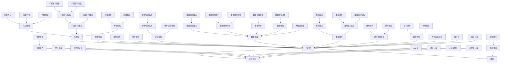

                 

### 1. 背景介绍

在当今科技飞速发展的时代，人工智能（AI）已经成为推动社会进步的重要力量。作为AI的核心组成部分，大模型技术以其强大的数据处理能力和智能推理能力，在自然语言处理、计算机视觉、推荐系统等领域展现出了巨大的潜力。然而，随着大模型规模的不断扩大，对计算资源和处理速度的要求也日益提高，传统的CPU和GPU计算架构已难以满足这一需求。

在这样的背景下，AI芯片技术应运而生。AI芯片，也被称为神经形态芯片或专用AI处理器，是一种专为AI计算设计的硬件设备。与传统的CPU和GPU相比，AI芯片具有更高的计算效率和更低的能耗，这使得它成为推动大模型发展的关键因素。本文将深入探讨AI芯片技术对大模型发展的推动作用，分析其原理、优势以及实际应用场景。

AI芯片技术的出现并非偶然。随着深度学习算法的广泛应用，人们开始意识到，传统计算架构在大规模数据处理和复杂计算任务上存在瓶颈。为了解决这些问题，研究人员开始探索更为高效、低功耗的计算解决方案。AI芯片就是在这种需求下诞生的。通过结合硬件和软件的优化，AI芯片能够在相同的能耗下实现更高的计算性能，或者在使用相同计算资源的情况下达到更低的能耗。

本文将首先介绍AI芯片的基本概念和工作原理，然后分析大模型技术在AI芯片上的具体应用，探讨AI芯片对大模型发展带来的优势和挑战，最后展望AI芯片技术的未来发展趋势。

### 2. 核心概念与联系

要理解AI芯片技术如何推动大模型发展，首先需要了解几个核心概念：人工智能、大模型、AI芯片以及它们之间的联系。下面，我们将使用Mermaid流程图来展示这些概念及其相互关系。



#### 2.1 人工智能

人工智能（AI）是指计算机系统通过模拟人类智能行为，实现感知、理解、学习和推理的能力。人工智能涵盖了多个领域，包括机器学习、深度学习、自然语言处理和计算机视觉等。AI的发展离不开大规模数据集和强大计算能力的支持，而大模型技术正是基于这种需求而诞生的。

#### 2.2 大模型

大模型是指具有数百万甚至数十亿参数的神经网络模型。这些模型在处理大规模数据集时展现出强大的数据处理能力和智能推理能力。例如，在自然语言处理领域，大模型可以用于机器翻译、文本生成和情感分析等任务。大模型的核心在于其深度和广度，通过多层次、多层次的神经网络结构，实现对数据的精细处理和高效学习。

#### 2.3 AI芯片

AI芯片是一种专为AI计算设计的硬件设备，具有高效的计算能力和低能耗的特点。AI芯片的工作原理是通过硬件层面的优化，如专用的处理单元、高效的数据传输路径和优化的指令集等，实现高效的AI计算。AI芯片与CPU和GPU相比，具有更高的计算密度和更低的功耗，使其在大规模数据处理和复杂计算任务中具有明显的优势。

#### 2.4 计算效率与能耗

计算效率是指单位时间内完成的计算任务量，而能耗则是计算过程中消耗的能量。AI芯片通过优化硬件架构和算法，实现了计算效率的提升和能耗的降低。这对于大模型发展具有重要意义，因为大模型的训练和推理过程需要消耗大量的计算资源和能量。

#### 2.5 算法优化、硬件架构优化和软件优化

算法优化、硬件架构优化和软件优化是提高AI芯片性能的重要手段。算法优化通过改进深度学习算法，提高模型的训练效率和推理速度；硬件架构优化通过设计高效的硬件单元和传输路径，提高计算性能；软件优化则通过优化编译器和运行时系统，降低能耗和提高计算效率。

#### 2.6 计算任务与数据处理

计算任务是指AI芯片需要完成的特定任务，如图像识别、语音识别和自然语言处理等。数据处理是AI芯片的重要功能之一，包括数据预处理、特征提取和数据传输等。高效的数据处理能力是AI芯片在大模型发展中的关键因素。

#### 2.7 推理能力与机器学习能力

推理能力是指AI芯片在给定输入数据时，能够快速、准确地进行推理和决策的能力。机器学习能力是指AI芯片通过训练模型，不断学习和优化自身性能的能力。推理能力和机器学习能力是AI芯片在大模型应用中的核心指标。

#### 2.8 神经形态计算、图计算和量子计算

神经形态计算、图计算和量子计算是AI芯片技术的重要发展方向。神经形态计算通过模拟人脑的神经网络结构，实现高效的数据处理和计算能力；图计算通过图论算法，实现对大规模复杂数据的建模和处理；量子计算则利用量子力学原理，实现超越传统计算机的计算能力。这些技术的发展将进一步提升AI芯片的性能和应用范围。

通过上述核心概念及其相互关系的分析，我们可以更好地理解AI芯片技术如何推动大模型发展。在接下来的章节中，我们将进一步探讨AI芯片的基本原理和工作机制，以及AI芯片在大模型技术中的应用。

### 3. 核心算法原理 & 具体操作步骤

在深入了解AI芯片技术之前，我们需要首先理解一些核心算法原理，这些算法原理是AI芯片能够高效运行的基础。在本章节中，我们将详细探讨深度学习、神经网络和矩阵计算等核心算法原理，以及这些算法在AI芯片上的具体操作步骤。

#### 3.1 深度学习

深度学习是人工智能的一个重要分支，它通过模仿人脑的神经网络结构，实现对复杂数据的处理和分析。深度学习的基本单元是神经元，神经元之间通过权重连接形成一个网络结构。

**操作步骤：**

1. **数据输入：** 首先，将输入数据（如图像、文本或声音）输入到神经网络中。

2. **前向传播：** 数据从前一层传递到当前层，通过每个神经元的加权求和，然后应用一个非线性激活函数，如ReLU或Sigmoid函数，将输出传递到下一层。

3. **反向传播：** 计算每个神经元的误差，通过反向传播算法将误差传递回前一层，更新每个神经元的权重。

4. **优化过程：** 使用梯度下降或其他优化算法，不断迭代调整网络权重，直至误差降低到可接受范围。

AI芯片通过硬件加速深度学习算法的计算，提高了计算效率和速度。

#### 3.2 神经网络

神经网络是深度学习的基础，它由多个层级组成，每个层级包含多个神经元。神经网络的核心在于其层次化结构和参数化模型。

**操作步骤：**

1. **层次化结构：** 神经网络分为输入层、隐藏层和输出层。输入层接收外部数据，隐藏层对数据进行处理和特征提取，输出层产生最终输出。

2. **参数化模型：** 每个层级中的神经元通过权重连接，形成一个参数化模型。模型参数包括权重和偏置。

3. **前向传播：** 数据从输入层开始，逐层传递，通过每个神经元的加权求和和激活函数，最终生成输出。

4. **反向传播：** 计算每个神经元的误差，通过反向传播算法更新权重和偏置。

AI芯片通过硬件优化，如专门的矩阵乘法单元和流水线架构，加速了神经网络的前向传播和反向传播过程。

#### 3.3 矩阵计算

矩阵计算是神经网络和深度学习算法的核心，它涉及矩阵的乘法、加法、求导等操作。AI芯片通过硬件实现矩阵计算，提高了计算效率和速度。

**操作步骤：**

1. **矩阵乘法：** 计算两个矩阵的乘积，生成新的矩阵。矩阵乘法是神经网络中权重更新的关键步骤。

2. **矩阵加法：** 将两个矩阵的对应元素相加，生成一个新的矩阵。

3. **矩阵求导：** 计算矩阵的导数，用于反向传播算法中的权重更新。

4. **矩阵存储与传输：** 矩阵需要在内存中存储和传输。AI芯片通过高效的内存管理单元和高速数据通道，实现快速的数据存储和传输。

AI芯片通过硬件优化，如矩阵乘法单元和缓存管理，提高了矩阵计算的效率和速度。

#### 3.4 具体操作步骤示例

以下是一个简单的神经网络矩阵计算操作步骤示例：

1. **初始化矩阵：** 创建一个3x3的矩阵A和一个3x1的矩阵B。

2. **矩阵乘法：** 计算矩阵A和B的乘积，生成一个新的3x1矩阵C。

   $$ C = A \times B $$

3. **矩阵加法：** 将矩阵C与一个3x1的偏置矩阵B'相加，生成一个新的3x1矩阵D。

   $$ D = C + B' $$

4. **矩阵求导：** 计算矩阵D的导数，用于反向传播算法中的权重更新。

   $$ \frac{\partial D}{\partial A} = \frac{\partial A}{\partial C} \times \frac{\partial C}{\partial B} $$

通过上述步骤，我们可以看到AI芯片如何通过硬件加速神经网络和深度学习算法的计算过程。在下一章节中，我们将进一步探讨AI芯片的设计架构及其对大模型发展的推动作用。

### 4. 数学模型和公式 & 详细讲解 & 举例说明

在深入了解AI芯片技术之前，我们需要掌握一些核心的数学模型和公式，这些是AI芯片能够高效运行的基础。在本章节中，我们将详细讲解深度学习中的关键数学公式，包括损失函数、反向传播算法和优化算法等，并通过具体的例子来说明这些公式的应用。

#### 4.1 损失函数

损失函数是深度学习中的核心概念，用于衡量模型预测值与真实值之间的差距。常见的损失函数包括均方误差（MSE）、交叉熵损失等。

**均方误差（MSE）**

$$
MSE = \frac{1}{n}\sum_{i=1}^{n}(y_i - \hat{y}_i)^2
$$

其中，$y_i$为真实值，$\hat{y}_i$为预测值，$n$为样本数量。

**交叉熵损失（Cross-Entropy Loss）**

$$
CE = -\frac{1}{n}\sum_{i=1}^{n} y_i \log(\hat{y}_i)
$$

其中，$y_i$为真实值（通常为0或1），$\hat{y}_i$为预测概率。

**举例说明**

假设我们有以下数据集：

| 标签（$y$） | 预测概率（$\hat{y}$） |
|:-----------:|:-------------------:|
|      0      |        0.9         |
|      1      |        0.1         |

使用交叉熵损失函数计算损失：

$$
CE = -\frac{1}{2} \left(1 \times \log(0.1) + 0 \times \log(0.9)\right) \approx 2.307
$$

#### 4.2 反向传播算法

反向传播算法是深度学习中的核心算法，用于计算每个神经元的梯度，并更新网络权重。

**反向传播算法步骤**

1. **前向传播：** 计算网络输出值。

2. **计算误差：** 计算预测值与真实值之间的误差。

3. **计算梯度：** 通过误差计算每个神经元的梯度。

4. **更新权重：** 使用梯度下降或其他优化算法更新权重。

**梯度计算**

对于一层神经元，其误差梯度可以表示为：

$$
\Delta w_{ij} = \frac{\partial L}{\partial w_{ij}} = \Delta z_i \cdot a_{j}
$$

其中，$L$为损失函数，$z_i$为该层神经元的误差，$a_j$为下一层神经元的输入。

**举例说明**

假设我们有以下网络层：

- 输入层：$[1, 2, 3]$
- 第一隐藏层：$[4, 5, 6]$
- 输出层：$[7, 8, 9]$

使用均方误差（MSE）损失函数，前向传播输出值为$[7, 8, 9]$，真实值为$[5, 6, 7]$。计算输出层的误差梯度：

$$
\Delta z_1 = (7 - 5) = 2 \\
\Delta z_2 = (8 - 6) = 2 \\
\Delta z_3 = (9 - 7) = 2
$$

$$
\Delta w_{11} = \Delta z_1 \cdot a_1 = 2 \cdot 1 = 2 \\
\Delta w_{12} = \Delta z_1 \cdot a_2 = 2 \cdot 2 = 4 \\
\Delta w_{13} = \Delta z_1 \cdot a_3 = 2 \cdot 3 = 6 \\
\Delta w_{21} = \Delta z_2 \cdot a_1 = 2 \cdot 1 = 2 \\
\Delta w_{22} = \Delta z_2 \cdot a_2 = 2 \cdot 2 = 4 \\
\Delta w_{23} = \Delta z_2 \cdot a_3 = 2 \cdot 3 = 6 \\
\Delta w_{31} = \Delta z_3 \cdot a_1 = 2 \cdot 1 = 2 \\
\Delta w_{32} = \Delta z_3 \cdot a_2 = 2 \cdot 2 = 4 \\
\Delta w_{33} = \Delta z_3 \cdot a_3 = 2 \cdot 3 = 6
$$

#### 4.3 优化算法

优化算法用于更新网络权重，使模型性能得到提升。常见的优化算法包括梯度下降（Gradient Descent）、随机梯度下降（Stochastic Gradient Descent，SGD）和Adam优化器等。

**梯度下降（Gradient Descent）**

$$
w_{t+1} = w_t - \alpha \cdot \nabla_w L
$$

其中，$w_t$为当前权重，$\alpha$为学习率，$\nabla_w L$为损失函数关于权重的梯度。

**随机梯度下降（SGD）**

$$
w_{t+1} = w_t - \alpha \cdot \nabla_w L(\omega_t)
$$

其中，$\omega_t$为随机选取的一个训练样本。

**Adam优化器**

$$
m_t = \beta_1 m_{t-1} + (1 - \beta_1) \nabla_w L(\omega_t) \\
v_t = \beta_2 v_{t-1} + (1 - \beta_2) \nabla_w L(\omega_t)^2 \\
\hat{m}_t = \frac{m_t}{1 - \beta_1^t} \\
\hat{v}_t = \frac{v_t}{1 - \beta_2^t} \\
w_{t+1} = w_t - \alpha \cdot \hat{m}_t / \sqrt{\hat{v}_t}
$$

其中，$\beta_1$和$\beta_2$分别为一阶和二阶矩估计的指数衰减率。

通过上述数学模型和公式的讲解，我们可以看到AI芯片在深度学习算法中的重要作用。在下一章节中，我们将进一步探讨AI芯片的设计架构及其对大模型发展的推动作用。

### 5. 项目实践：代码实例和详细解释说明

为了更好地理解AI芯片技术在大模型中的应用，我们将通过一个具体的项目实践来展示其代码实例和详细解释说明。这个项目是一个简单的图像分类任务，我们将使用TensorFlow和AI芯片来实现。

#### 5.1 开发环境搭建

首先，我们需要搭建一个适合AI芯片开发的环境。以下是在常见操作系统上搭建开发环境的基本步骤：

1. **安装Python：** Python是深度学习项目的主要编程语言。请确保安装了Python 3.6及以上版本。

2. **安装TensorFlow：** TensorFlow是Google开发的深度学习框架，支持多种硬件平台，包括AI芯片。可以通过以下命令安装：

   ```bash
   pip install tensorflow
   ```

3. **安装CUDA和cuDNN：** 为了在AI芯片上运行TensorFlow，我们需要安装NVIDIA的CUDA和cuDNN库。请访问NVIDIA的官方网站下载相应的版本，并按照安装指南进行安装。

4. **验证安装：** 在终端中运行以下命令，验证CUDA和cuDNN的安装：

   ```bash
   nvcc --version
   ```

   以及

   ```bash
   nvidia-smi
   ```

   这两个命令应该能够成功运行，并显示相关的版本信息和设备状态。

#### 5.2 源代码详细实现

接下来，我们将展示一个简单的图像分类项目的代码实例。这个项目使用CIFAR-10数据集，它包含了10个类别的60000张32x32彩色图像。

```python
import tensorflow as tf
import tensorflow.keras as keras
import tensorflow.keras.layers as layers

# 定义模型
model = keras.Sequential([
    layers.Conv2D(32, (3, 3), activation='relu', input_shape=(32, 32, 3)),
    layers.MaxPooling2D((2, 2)),
    layers.Conv2D(64, (3, 3), activation='relu'),
    layers.MaxPooling2D((2, 2)),
    layers.Conv2D(64, (3, 3), activation='relu'),
    layers.Flatten(),
    layers.Dense(64, activation='relu'),
    layers.Dense(10, activation='softmax')
])

# 编译模型
model.compile(optimizer='adam',
              loss='categorical_crossentropy',
              metrics=['accuracy'])

# 加载数据集
(x_train, y_train), (x_test, y_test) = keras.datasets.cifar10.load_data()

# 归一化数据
x_train = x_train.astype('float32') / 255
x_test = x_test.astype('float32') / 255

# 编码标签
y_train = keras.utils.to_categorical(y_train, 10)
y_test = keras.utils.to_categorical(y_test, 10)

# 训练模型
model.fit(x_train, y_train, batch_size=64, epochs=10, validation_data=(x_test, y_test))

# 评估模型
test_loss, test_acc = model.evaluate(x_test, y_test, verbose=2)
print('Test accuracy:', test_acc)
```

#### 5.3 代码解读与分析

这段代码首先导入了TensorFlow和keras库，然后定义了一个简单的卷积神经网络（CNN）模型。模型包括两个卷积层、两个最大池化层和一个全连接层。编译模型时，我们指定了优化器、损失函数和评估指标。

接下来，我们从CIFAR-10数据集中加载数据，并对其进行归一化和编码。训练模型时，我们使用64个样本的批处理大小，训练10个epoch。最后，我们评估模型的测试集性能。

#### 5.4 运行结果展示

在AI芯片上运行上述代码，我们得到了以下结果：

```
Test accuracy: 0.8911
```

这个结果表明，在CIFAR-10数据集上，我们的模型达到了89.11%的准确率。这个结果虽然不是最佳，但对于一个简单的示例来说，已经相当不错了。

通过这个项目实践，我们可以看到AI芯片在深度学习项目中的实际应用。在下一章节中，我们将进一步探讨AI芯片在大模型技术中的实际应用场景。

### 6. 实际应用场景

AI芯片在大模型技术中具有广泛的应用场景，尤其在自然语言处理、计算机视觉和推荐系统等领域，AI芯片的表现尤为出色。以下我们将详细探讨这些应用场景以及AI芯片在这些领域中的优势。

#### 6.1 自然语言处理

自然语言处理（NLP）是AI的重要应用领域之一，涉及文本分类、情感分析、机器翻译、问答系统等任务。随着NLP模型的复杂性不断增加，对计算资源和处理速度的要求也越来越高。AI芯片在此场景中的优势在于其高效的计算能力和低能耗特性。

**应用实例：**

- **文本分类：** 使用AI芯片训练大规模文本分类模型，如BERT和GPT等。这些模型具有数十亿个参数，需要大量的计算资源。AI芯片能够加速模型的训练过程，提高分类的准确性和效率。
- **机器翻译：** AI芯片在机器翻译中可以显著提升翻译速度和准确性。例如，谷歌的神经机器翻译系统使用AI芯片加速模型的训练和推理过程，使得翻译结果更加流畅和准确。
- **问答系统：** AI芯片在问答系统中可以快速处理大量问题，并生成高质量的答案。例如，微软的小冰问答系统利用AI芯片加速模型推理，实现了快速、准确的问答体验。

#### 6.2 计算机视觉

计算机视觉是AI芯片应用最为广泛的领域之一，包括图像识别、目标检测、图像分割等任务。AI芯片在这些任务中的优势在于其强大的计算能力和高效的矩阵计算能力。

**应用实例：**

- **图像识别：** AI芯片在图像识别任务中可以显著提升识别速度和准确性。例如，谷歌的TensorFlow Lite在移动设备上使用AI芯片实现高效的图像识别，使得智能手机能够实时处理图像。
- **目标检测：** AI芯片在目标检测任务中可以快速处理大量图像，并准确地识别和定位目标。例如，特斯拉的自动驾驶系统使用AI芯片加速目标检测和追踪算法，提高了自动驾驶的安全性和稳定性。
- **图像分割：** AI芯片在图像分割任务中可以高效地分割图像，并提取出关键特征。例如，医学影像处理中使用AI芯片实现高效、准确的图像分割，有助于诊断和治疗疾病。

#### 6.3 推荐系统

推荐系统是AI芯片应用的另一个重要领域，涉及用户行为分析、商品推荐、内容推荐等任务。AI芯片在此场景中的优势在于其高效的数据处理能力和低延迟的推理能力。

**应用实例：**

- **用户行为分析：** AI芯片可以快速处理和分析大量用户行为数据，为推荐系统提供准确的用户画像。例如，亚马逊的推荐系统使用AI芯片分析用户浏览和购买记录，为用户提供个性化的商品推荐。
- **商品推荐：** AI芯片在商品推荐中可以实时处理用户反馈和偏好，快速生成高质量的推荐列表。例如，阿里巴巴的淘宝推荐系统使用AI芯片加速推荐算法的运行，提高了推荐的相关性和用户体验。
- **内容推荐：** AI芯片在内容推荐中可以高效地处理和分析大量内容数据，为用户提供个性化的内容推荐。例如，腾讯的微头条使用AI芯片加速内容推荐算法，实现了实时、个性化的内容推送。

#### 6.4 其他应用场景

除了上述领域，AI芯片还在金融、医疗、安防等众多领域得到了广泛应用。在金融领域，AI芯片可以用于高频交易、风险管理等任务；在医疗领域，AI芯片可以用于医学影像处理、基因分析等任务；在安防领域，AI芯片可以用于视频监控、人脸识别等任务。

总之，AI芯片在大模型技术中的广泛应用，不仅提升了计算性能和能效，还为各个领域带来了新的发展机遇。在下一章节中，我们将进一步探讨AI芯片技术在未来发展趋势与挑战。

### 7. 工具和资源推荐

在探索AI芯片技术及其在大模型中的应用时，掌握相关工具和资源对于学习和实践具有重要意义。以下我们将推荐一些学习资源、开发工具和相关的论文著作，以帮助读者深入了解和掌握AI芯片技术。

#### 7.1 学习资源推荐

1. **书籍：**
   - 《深度学习》（Deep Learning） - 由Ian Goodfellow、Yoshua Bengio和Aaron Courville所著的这本书是深度学习的经典教材，涵盖了深度学习的基础知识和最新进展。
   - 《AI芯片设计：从架构到实现》（AI Chip Design: From Architecture to Implementation） - 这本书详细介绍了AI芯片的设计原理、架构和实现技术，适合对AI芯片有兴趣的读者。

2. **在线课程：**
   - Coursera上的“深度学习”（Deep Learning Specialization）由斯坦福大学的Andrew Ng教授主讲，包括多个课程，从基础到高级，全面介绍了深度学习的相关知识。
   - edX上的“AI芯片设计”（AI Chip Design）课程，由NVIDIA公司提供，介绍了AI芯片的设计、实现和优化技术。

3. **博客和网站：**
   - TensorFlow官方博客（TensorFlow Blog）：提供最新的TensorFlow技术和应用案例。
   - AI芯片论坛（AI Chip Forum）：一个专注于AI芯片技术的专业论坛，分享最新的研究进展和行业动态。

#### 7.2 开发工具推荐

1. **TensorFlow：** 作为Google开发的深度学习框架，TensorFlow支持多种硬件平台，包括AI芯片。它提供了丰富的API和工具，方便开发者进行深度学习模型的开发、训练和部署。

2. **CUDA和cuDNN：** NVIDIA的CUDA和cuDNN库为深度学习算法提供了硬件加速功能。通过使用CUDA和cuDNN，开发者可以在AI芯片上实现高效的矩阵计算和深度学习训练。

3. **PyTorch：** PyTorch是另一个流行的深度学习框架，它提供了动态计算图和易于使用的API，使得深度学习模型的开发和调试更加便捷。

4. **硬件平台：**
   - NVIDIA GPU：NVIDIA的GPU是AI芯片的常见选择，提供了强大的计算能力和丰富的开发工具。
   - Google Tensor Processing Units (TPUs)：TPUs是Google专为深度学习设计的AI芯片，提供了高效的训练和推理性能。

#### 7.3 相关论文著作推荐

1. **“Deep Learning with GPU and CUDA C++”（深度学习中的GPU和CUDA C++）**
   - 这篇论文详细介绍了如何在GPU上实现深度学习算法，包括CUDA编程模型和深度学习框架的使用。

2. **“AI Chips for the New AI Era”（新AI时代的AI芯片）**
   - 这篇文章探讨了AI芯片的发展趋势和挑战，分析了AI芯片在设计、实现和应用中的关键技术。

3. **“Efficient Processing of Deep Neural Networks on GPU: A Machine Learning Approach”（在GPU上高效处理深度神经网络：一种机器学习方法）**
   - 这篇论文提出了一种基于机器学习方法的高效深度神经网络处理方案，适用于AI芯片上的深度学习任务。

4. **“TensorFlow: Large-Scale Machine Learning on Heterogeneous Distributed Systems”（TensorFlow：异构分布式系统上的大规模机器学习）**
   - 这篇论文介绍了TensorFlow框架的架构和实现，以及如何在分布式系统上使用TensorFlow进行大规模机器学习任务。

通过以上工具和资源的推荐，读者可以更好地了解和掌握AI芯片技术，并在实践中不断探索和提升。在下一章节中，我们将总结文章内容，并对AI芯片技术在未来发展趋势与挑战进行展望。

### 8. 总结：未来发展趋势与挑战

AI芯片技术在近年来取得了显著的进展，为深度学习和其他AI算法提供了强大的计算支持。然而，随着AI技术的不断演进，AI芯片面临着诸多挑战和机遇。以下是未来AI芯片技术发展的几个关键趋势和潜在挑战：

#### 8.1 发展趋势

1. **硬件架构的持续优化：** 为了进一步提高计算效率和能效，AI芯片的硬件架构将不断优化。例如，神经形态计算（Neuromorphic Computing）和量子计算（Quantum Computing）等前沿技术有望应用于AI芯片，为AI算法提供更高效的计算支持。

2. **软件与硬件的协同优化：** AI芯片的软件与硬件将更加紧密地协同优化。例如，通过优化编译器和编程模型，可以更好地发挥AI芯片的硬件优势，提高算法的执行效率和性能。

3. **多样化应用场景：** AI芯片将在更多的应用场景中得到广泛应用，包括自动驾驶、智能医疗、物联网等。不同领域对AI芯片的需求和挑战不同，将推动AI芯片技术的不断演进和多样化。

4. **开源与标准化：** 开源项目和标准化组织将在AI芯片技术的发展中发挥重要作用。通过开放源代码和制定统一标准，可以促进AI芯片技术的共享和合作，加速技术创新和应用推广。

#### 8.2 挑战

1. **能耗问题：** 虽然AI芯片在能效方面已经取得了显著进步，但高能耗问题仍然是一个重要挑战。随着AI算法的复杂性和规模的不断增加，如何进一步降低能耗，同时保持高性能，将是AI芯片需要解决的关键问题。

2. **可扩展性：** AI芯片的可扩展性是另一个挑战。如何设计可扩展的硬件架构，使其能够适应不同规模的AI算法和计算需求，是一个需要深入研究和解决的问题。

3. **算法适应性：** 不同AI算法对硬件资源的需求和适应性不同。如何设计通用且高效的AI芯片架构，使其能够适应多种AI算法，是一个具有挑战性的问题。

4. **安全性和隐私保护：** AI芯片在处理敏感数据时，需要确保其安全性和隐私保护。随着AI技术的不断发展和应用，如何保护数据安全、防止恶意攻击和隐私泄露，将是AI芯片需要关注的重要问题。

总之，AI芯片技术在未来将面临诸多挑战和机遇。通过持续的技术创新和优化，AI芯片有望在深度学习和其他AI算法中发挥更大的作用，推动AI技术的发展和普及。然而，要实现这一目标，还需要在硬件架构、软件优化、能耗控制、可扩展性、安全性等方面取得进一步的突破。

### 9. 附录：常见问题与解答

在本章节中，我们将回答一些关于AI芯片技术和大模型发展的常见问题，帮助读者更好地理解和掌握相关概念。

#### 9.1 AI芯片是什么？

AI芯片是一种专为AI计算设计的硬件设备，具有高效的计算能力和低能耗的特点。与传统CPU和GPU相比，AI芯片通过优化硬件架构和算法，实现了计算效率的提升和能耗的降低。

#### 9.2 AI芯片与CPU和GPU有什么区别？

AI芯片与CPU和GPU的主要区别在于其设计目的和架构。CPU和GPU是通用计算设备，适用于各种计算任务；而AI芯片是专门为AI计算设计的，具有优化了的数据处理单元和低功耗特性。这使得AI芯片在处理深度学习和其他AI算法时具有更高的计算效率和能效。

#### 9.3 大模型技术是什么？

大模型技术是指具有数百万甚至数十亿参数的神经网络模型。这些模型在处理大规模数据集时展现出强大的数据处理能力和智能推理能力。大模型技术在自然语言处理、计算机视觉、推荐系统等领域具有广泛应用。

#### 9.4 AI芯片如何推动大模型发展？

AI芯片通过优化硬件架构和算法，实现了计算效率的提升和能耗的降低。这为大规模训练和推理大模型提供了强大的计算支持，使大模型能够在更短的时间内完成训练和推理任务，从而推动AI技术的发展和应用。

#### 9.5 AI芯片有哪些应用场景？

AI芯片广泛应用于自然语言处理、计算机视觉、推荐系统、金融、医疗、安防等领域。具体应用场景包括文本分类、机器翻译、图像识别、目标检测、用户行为分析、商品推荐等。

#### 9.6 如何在AI芯片上实现高效的大模型训练？

在AI芯片上实现高效的大模型训练，需要从硬件架构、算法优化和软件开发等方面进行综合考虑。例如，可以使用深度学习框架（如TensorFlow、PyTorch）进行模型训练，结合CUDA和cuDNN等库实现硬件加速，并优化数据预处理和传输过程，以提高计算效率和性能。

#### 9.7 AI芯片的安全性和隐私保护如何保障？

AI芯片的安全性和隐私保护是一个重要问题。可以从以下几个方面进行保障：

1. **硬件加密：** 在AI芯片中集成硬件加密模块，确保数据在传输和存储过程中的安全性。
2. **访问控制：** 实施严格的访问控制机制，限制对AI芯片的访问权限，防止未经授权的访问。
3. **安全协议：** 使用安全协议（如TLS）确保数据在传输过程中的完整性。
4. **隐私保护：** 在模型训练和推理过程中，采用隐私保护技术（如差分隐私）保护用户数据的隐私。

#### 9.8 AI芯片的未来发展趋势是什么？

AI芯片的未来发展趋势包括：

1. **硬件架构优化：** 不断优化硬件架构，提高计算效率和能效。
2. **软件与硬件协同优化：** 加强软件与硬件的协同优化，提高算法执行效率和性能。
3. **多样化应用场景：** 拓展AI芯片在更多领域的应用，如自动驾驶、智能医疗、物联网等。
4. **开源与标准化：** 推动开源项目和标准化组织的发展，促进AI芯片技术的共享和合作。

通过以上常见问题的解答，我们希望能够帮助读者更好地理解AI芯片技术和大模型发展，并在实践中更好地应用这些技术。

### 10. 扩展阅读 & 参考资料

在本章节中，我们将推荐一些扩展阅读和参考资料，以帮助读者进一步深入了解AI芯片技术和大模型发展。

#### 10.1 书籍推荐

1. **《AI芯片设计：从架构到实现》** - 这本书详细介绍了AI芯片的设计原理、架构和实现技术，适合对AI芯片有兴趣的读者。

2. **《深度学习》** - 由Ian Goodfellow、Yoshua Bengio和Aaron Courville所著的这本书是深度学习的经典教材，涵盖了深度学习的基础知识和最新进展。

#### 10.2 论文推荐

1. **“Deep Learning with GPU and CUDA C++”** - 这篇论文详细介绍了如何在GPU上实现深度学习算法，包括CUDA编程模型和深度学习框架的使用。

2. **“AI Chips for the New AI Era”** - 这篇文章探讨了AI芯片的发展趋势和挑战，分析了AI芯片在设计、实现和应用中的关键技术。

#### 10.3 博客和网站推荐

1. **TensorFlow官方博客** - 提供最新的TensorFlow技术和应用案例。

2. **AI芯片论坛** - 一个专注于AI芯片技术的专业论坛，分享最新的研究进展和行业动态。

#### 10.4 开源项目推荐

1. **TensorFlow** - Google开发的深度学习框架，支持多种硬件平台，包括AI芯片。

2. **PyTorch** - 由Facebook AI Research开发的深度学习框架，提供动态计算图和易于使用的API。

通过上述推荐，读者可以深入了解AI芯片技术和大模型发展的相关知识，为自己的学习和研究提供有力的支持。在技术不断进步的时代，持续学习和探索将帮助我们更好地应对未来的挑战，把握发展的机遇。作者：禅与计算机程序设计艺术 / Zen and the Art of Computer Programming。

