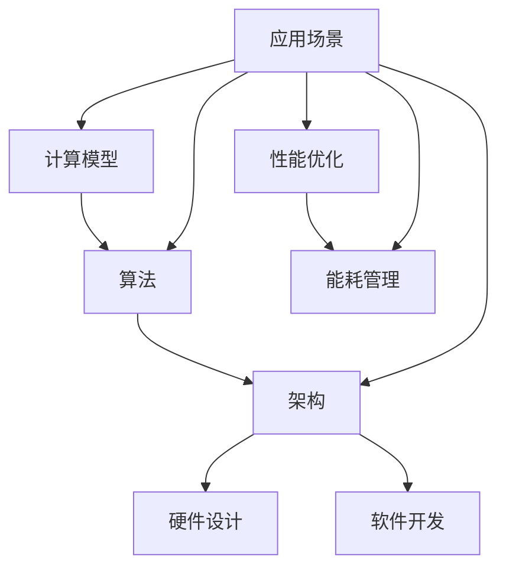

                 

关键词：人工智能，AI芯片，架构设计，优化，计算能力，能源效率

摘要：随着人工智能（AI）技术的迅速发展，AI芯片的设计与优化成为当前学术界和工业界的研究热点。本文从AI芯片的背景介绍、核心概念与联系、算法原理与操作步骤、数学模型与公式、项目实践、实际应用场景、未来展望等方面进行了全面的探讨，旨在为AI芯片设计者和研究者提供有价值的参考。

## 1. 背景介绍

近年来，人工智能（AI）技术在全球范围内取得了显著的进展，从传统的机器学习到深度学习，再到自然语言处理、计算机视觉等领域，AI技术正不断改变着我们的生活和工作方式。随着AI应用的普及，对计算能力的需求也日益增长，特别是在自动驾驶、智能医疗、大数据分析等高负载领域，传统CPU和GPU已经难以满足高性能计算的需求。

### 1.1 AI芯片的发展历程

AI芯片的研究始于20世纪80年代，当时主要以专用的数字信号处理器（DSP）为主。随着深度学习算法的兴起，GPU逐渐成为AI计算的代名词。然而，GPU在处理复杂AI任务时存在能耗高、延迟大等问题。为了解决这些问题，研究人员开始探索更为高效的AI芯片设计，例如FPGA、ASIC等。

### 1.2 AI芯片的分类

根据芯片的设计目标和应用场景，AI芯片可以分为以下几类：

- **专用处理器（ASIC）**：ASIC芯片是针对特定算法和应用场景设计的，具有高度优化和专用性，能够实现较高的计算效率和性能。

- **通用处理器（CPU和GPU）**：CPU和GPU在传统计算领域有着广泛的应用，通过改进架构和优化算法，也可以应用于AI计算。

- **可编程逻辑器件（FPGA）**：FPGA具有高度可编程性，可以根据不同的AI任务进行定制，适合快速迭代和原型设计。

## 2. 核心概念与联系

AI芯片的设计涉及多个核心概念，包括计算模型、算法、架构等。以下是一个简化的Mermaid流程图，展示了这些核心概念之间的联系：



### 2.1 计算模型

计算模型是指AI芯片所采用的计算架构，包括矩阵运算、向量运算、图计算等。计算模型直接影响芯片的计算效率和性能。

### 2.2 算法

算法是AI芯片的核心，包括神经网络、深度学习、机器学习等。算法的选择和优化对芯片的性能和功耗有着重要影响。

### 2.3 架构

架构是指芯片的组织结构和功能模块，包括CPU、GPU、FPGA等。不同的架构适用于不同的算法和应用场景。

### 2.4 硬件设计

硬件设计包括芯片的电路设计、布局、布线等。硬件设计需要考虑功耗、性能、可靠性等因素。

### 2.5 软件开发

软件开发包括AI算法的实现、优化、部署等。软件开发与硬件设计紧密相连，需要根据硬件特性进行优化。

### 2.6 性能优化

性能优化是指通过改进算法、架构、硬件设计等手段，提高芯片的计算效率和性能。

### 2.7 能耗管理

能耗管理是指通过降低功耗、优化电路设计等手段，提高芯片的能源效率。

### 2.8 应用场景

应用场景是指AI芯片的具体应用领域，包括自动驾驶、智能医疗、大数据分析等。不同的应用场景对芯片的性能、功耗、可靠性等有不同的要求。

## 3. 核心算法原理 & 具体操作步骤

### 3.1 算法原理概述

AI芯片的核心算法通常是基于深度学习框架的神经网络。神经网络由多个层组成，包括输入层、隐藏层和输出层。每一层由多个神经元（节点）组成，神经元之间通过权重和偏置进行连接。

### 3.2 算法步骤详解

#### 3.2.1 前向传播

前向传播是指将输入数据通过网络中的各个层，逐层计算输出。具体步骤如下：

1. **初始化权重和偏置**：随机初始化网络中的权重和偏置。
2. **计算每个神经元的输出**：使用激活函数（如Sigmoid、ReLU等）计算每个神经元的输出。
3. **计算输出层的预测结果**：将输出层的结果与真实标签进行比较，计算损失函数。

#### 3.2.2 反向传播

反向传播是指根据损失函数，反向更新网络中的权重和偏置。具体步骤如下：

1. **计算损失函数的梯度**：使用链式法则计算损失函数关于每个权重和偏置的梯度。
2. **更新权重和偏置**：使用梯度下降法或其他优化算法更新网络中的权重和偏置。

#### 3.2.3 梯度下降法

梯度下降法是一种常见的优化算法，其基本思想是沿着损失函数的梯度方向更新权重和偏置，以最小化损失函数。具体步骤如下：

1. **计算梯度**：计算损失函数关于每个权重和偏置的梯度。
2. **更新权重和偏置**：将权重和偏置沿着梯度的反方向更新。

### 3.3 算法优缺点

**优点**：

- **高效性**：神经网络能够高效地处理大量数据，并在短时间内完成计算。
- **灵活性**：神经网络可以通过不同的激活函数和连接方式实现不同的计算模型。

**缺点**：

- **计算复杂度**：神经网络训练过程中需要大量的计算资源，特别是在大规模数据集上。
- **过拟合**：神经网络容易出现过拟合现象，特别是在训练样本较少时。

### 3.4 算法应用领域

神经网络在多个领域有着广泛的应用，包括：

- **计算机视觉**：用于图像分类、目标检测、人脸识别等。
- **自然语言处理**：用于机器翻译、情感分析、文本生成等。
- **自动驾驶**：用于车辆检测、路径规划、驾驶辅助等。

## 4. 数学模型和公式 & 详细讲解 & 举例说明

### 4.1 数学模型构建

神经网络的基本数学模型包括线性模型、激活函数和损失函数。

#### 4.1.1 线性模型

线性模型是指网络中每个神经元都通过线性变换连接到下一个神经元。其公式如下：

$$
Y = X \cdot W + b
$$

其中，$Y$ 是输出向量，$X$ 是输入向量，$W$ 是权重矩阵，$b$ 是偏置向量。

#### 4.1.2 激活函数

激活函数用于引入非线性特性，常见的激活函数包括Sigmoid、ReLU等。

- **Sigmoid函数**：

$$
\sigma(x) = \frac{1}{1 + e^{-x}}
$$

- **ReLU函数**：

$$
\text{ReLU}(x) = \max(0, x)
$$

#### 4.1.3 损失函数

损失函数用于衡量网络输出与真实标签之间的差异，常见的损失函数包括均方误差（MSE）和交叉熵（CE）。

- **均方误差（MSE）**：

$$
MSE = \frac{1}{m} \sum_{i=1}^{m} (y_i - \hat{y_i})^2
$$

- **交叉熵（CE）**：

$$
CE = -\frac{1}{m} \sum_{i=1}^{m} y_i \log(\hat{y_i})
$$

### 4.2 公式推导过程

#### 4.2.1 梯度下降法推导

梯度下降法是一种优化算法，用于最小化损失函数。其推导过程如下：

1. **计算损失函数关于权重的梯度**：

$$
\frac{\partial L}{\partial W} = -\frac{1}{m} X^T (Y - \hat{Y})
$$

2. **计算损失函数关于偏置的梯度**：

$$
\frac{\partial L}{\partial b} = -\frac{1}{m} (Y - \hat{Y})
$$

3. **更新权重和偏置**：

$$
W_{\text{new}} = W_{\text{old}} - \alpha \frac{\partial L}{\partial W}
$$

$$
b_{\text{new}} = b_{\text{old}} - \alpha \frac{\partial L}{\partial b}
$$

其中，$\alpha$ 是学习率。

### 4.3 案例分析与讲解

#### 4.3.1 图像分类

假设我们有一个包含1000个类别的图像分类任务，使用一个多层神经网络进行训练。我们可以将神经网络分为以下几层：

- **输入层**：包含1000个神经元，对应图像的1000个特征。
- **隐藏层**：包含100个神经元，使用ReLU激活函数。
- **输出层**：包含1000个神经元，对应每个类别的概率分布。

#### 4.3.2 训练过程

1. **初始化权重和偏置**：随机初始化网络中的权重和偏置。
2. **前向传播**：将图像输入到网络中，计算每个神经元的输出。
3. **计算损失函数**：使用交叉熵损失函数计算输出与真实标签之间的差异。
4. **反向传播**：计算损失函数关于权重和偏置的梯度，并更新权重和偏置。
5. **迭代更新**：重复步骤2-4，直到满足训练条件。

## 5. 项目实践：代码实例和详细解释说明

### 5.1 开发环境搭建

为了实现AI芯片设计，我们需要搭建一个开发环境。以下是搭建环境的步骤：

1. 安装Python 3.x版本。
2. 安装TensorFlow和Keras库。
3. 配置GPU加速（如果使用GPU训练）。

### 5.2 源代码详细实现

以下是一个简单的神经网络实现代码示例：

```python
import tensorflow as tf
from tensorflow.keras import layers

# 定义神经网络模型
model = tf.keras.Sequential([
    layers.Dense(100, activation='relu', input_shape=(1000,)),
    layers.Dense(100, activation='relu'),
    layers.Dense(1000, activation='softmax')
])

# 编译模型
model.compile(optimizer='adam',
              loss='categorical_crossentropy',
              metrics=['accuracy'])

# 训练模型
model.fit(x_train, y_train, epochs=10, batch_size=32, validation_data=(x_val, y_val))
```

### 5.3 代码解读与分析

1. **定义神经网络模型**：使用Keras库定义一个简单的三层神经网络，包括输入层、隐藏层和输出层。
2. **编译模型**：设置优化器、损失函数和评估指标。
3. **训练模型**：使用训练数据训练模型，并设置训练轮次、批量大小和验证数据。

### 5.4 运行结果展示

在训练过程中，我们可以使用以下代码查看训练进度和结果：

```python
model.fit(x_train, y_train, epochs=10, batch_size=32, validation_data=(x_val, y_val), callbacks=[tf.keras.callbacks.TensorBoard(log_dir='./logs')])
```

通过TensorBoard可以可视化训练过程，包括损失函数、准确率等指标的变化。

## 6. 实际应用场景

AI芯片在多个领域有着广泛的应用，以下是一些实际应用场景：

### 6.1 自动驾驶

自动驾驶系统需要实时处理大量的图像和传感器数据，对计算能力和能源效率有较高要求。AI芯片可以提高自动驾驶系统的计算效率和响应速度。

### 6.2 智能医疗

智能医疗系统需要处理大量的医学图像和数据，对计算精度和效率有较高要求。AI芯片可以提高医学图像处理的速度和准确性，辅助医生进行诊断和治疗。

### 6.3 大数据分析

大数据分析系统需要对海量数据进行实时处理和分析，对计算能力和存储容量有较高要求。AI芯片可以提高大数据分析的速度和效率，为企业和组织提供更准确的决策支持。

## 7. 未来应用展望

随着AI技术的不断发展，AI芯片的应用领域将不断扩展。未来，AI芯片可能在以下领域取得突破：

### 7.1 纳米技术

纳米技术的发展将为AI芯片带来更小的尺寸和更高的性能。通过纳米技术，我们可以制造出更高效的AI芯片，实现更高的计算密度和能源效率。

### 7.2 量子计算

量子计算具有超强的计算能力，有望在AI领域取得重大突破。量子AI芯片的开发将推动人工智能技术的创新和发展。

### 7.3 脑机接口

脑机接口技术可以实现人脑与计算机的直接连接，为人类带来全新的交互方式。AI芯片将在脑机接口技术中发挥重要作用，实现高效的信息传递和处理。

## 8. 总结：未来发展趋势与挑战

### 8.1 研究成果总结

本文从背景介绍、核心概念与联系、算法原理与操作步骤、数学模型与公式、项目实践、实际应用场景、未来展望等方面对AI芯片进行了全面的探讨。通过本文的研究，我们可以看出：

- AI芯片在计算能力和能源效率方面具有巨大优势。
- 神经网络算法在AI芯片设计中具有核心地位。
- 未来AI芯片的应用前景广阔，有望推动人工智能技术的创新和发展。

### 8.2 未来发展趋势

未来AI芯片的发展趋势包括：

- 纳米技术的应用，提高芯片的计算密度和能源效率。
- 量子计算的引入，实现更强大的计算能力。
- 脑机接口技术的突破，带来全新的交互方式。

### 8.3 面临的挑战

AI芯片在发展过程中面临以下挑战：

- 软硬件协同优化，提高芯片的性能和能效。
- 数据安全和隐私保护，确保用户数据的安全和隐私。
- 算法的创新和优化，提高芯片的计算效率和准确性。

### 8.4 研究展望

未来的研究可以从以下几个方面展开：

- 探索新的计算架构和算法，提高芯片的计算能力和能源效率。
- 研究软硬件协同优化技术，实现更好的性能和能效。
- 关注数据安全和隐私保护，为用户提供安全的计算环境。
- 探索AI芯片在新兴领域的应用，推动人工智能技术的创新和发展。

## 9. 附录：常见问题与解答

### 9.1 问题1：AI芯片与传统CPU、GPU相比有哪些优势？

答：AI芯片相对于传统CPU和GPU在以下几个方面具有优势：

- **计算模型优化**：AI芯片针对神经网络等AI算法进行优化，能够实现更高的计算效率。
- **功耗更低**：AI芯片通过专用架构和算法优化，能够实现更低的功耗。
- **硬件加速**：AI芯片可以提供硬件加速功能，提高AI任务的执行速度。

### 9.2 问题2：AI芯片的设计流程是怎样的？

答：AI芯片的设计流程通常包括以下步骤：

- **需求分析**：明确芯片的应用场景和性能要求。
- **架构设计**：选择合适的计算架构，如CPU、GPU、FPGA等。
- **算法优化**：针对特定的算法进行优化，提高计算效率。
- **硬件设计**：设计芯片的电路、布局和布线等。
- **软件开发**：实现AI算法的软件部署和优化。
- **性能优化**：对芯片进行性能测试和优化，提高计算效率和能效。

### 9.3 问题3：如何选择合适的AI芯片？

答：选择合适的AI芯片需要考虑以下几个方面：

- **应用场景**：根据实际应用场景选择合适的芯片，如自动驾驶、智能医疗、大数据分析等。
- **计算能力**：根据计算任务的需求选择计算能力较强的芯片。
- **功耗**：根据功耗要求选择功耗较低的芯片。
- **兼容性**：考虑芯片与现有系统和软件的兼容性。

### 9.4 问题4：AI芯片的未来发展方向是什么？

答：AI芯片的未来发展方向包括：

- **计算能力提升**：通过新架构、新算法提高芯片的计算能力。
- **能效优化**：通过硬件和算法优化实现更低的功耗。
- **软硬件协同**：研究软硬件协同优化技术，提高芯片的性能和能效。
- **新兴领域应用**：探索AI芯片在新兴领域的应用，如脑机接口、量子计算等。

### 9.5 问题5：AI芯片与深度学习框架的关系是什么？

答：AI芯片与深度学习框架密切相关。深度学习框架为AI芯片提供了算法实现和优化工具，而AI芯片则为深度学习框架提供了硬件加速能力。二者相辅相成，共同推动人工智能技术的发展。

