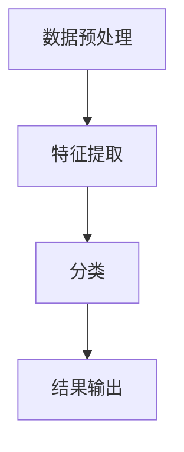
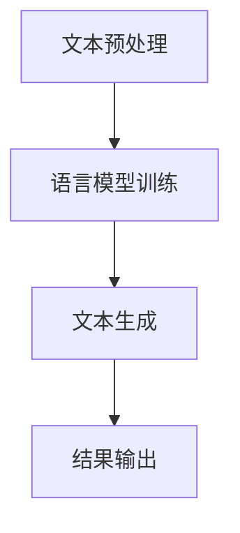
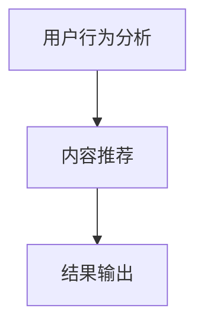
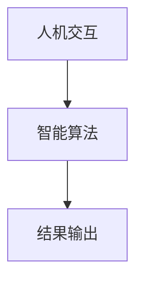

                 

### 背景介绍

> **人工智能在创意产业中的应用**：随着人工智能技术的飞速发展，其在各个领域的应用逐渐深入。特别是在创意产业中，人工智能的表现尤为突出。从图像识别、自然语言处理到智能推荐系统，人工智能正以其强大的计算能力和智能算法，推动着创意产业的变革。本文将探讨如何利用人工智能辅助创意，从灵感到实现的全过程。

**创意产业的现状**：创意产业，如设计、影视、音乐、文学等领域，一直被认为是人类智慧和创造力的结晶。然而，随着市场竞争的加剧和消费者需求的多样化，创意产业面临着前所未有的挑战。传统的人工创作方式效率低下，且难以满足个性化和多样化的需求。在这种情况下，人工智能成为了创意产业转型升级的重要工具。

**人工智能的优势**：人工智能在创意产业中的应用主要体现在以下几个方面：

1. **数据驱动的洞察**：人工智能可以通过分析海量数据，帮助创意工作者发现新的趋势和机会。
2. **自动化流程**：人工智能可以自动化许多重复性工作，如图像编辑、文字校对等，从而提高工作效率。
3. **智能推荐**：人工智能可以根据用户行为和偏好，为其推荐个性化的内容，提高用户体验。
4. **智能协作**：人工智能可以作为创意工作者的智能助手，提供灵感、建议和反馈。

**本文结构**：本文将按照以下结构展开：

1. **核心概念与联系**：介绍人工智能辅助创意的核心概念，并使用Mermaid流程图展示其原理和架构。
2. **核心算法原理与具体操作步骤**：详细讲解人工智能在创意产业中的应用算法，包括数据预处理、模型训练和推理等步骤。
3. **数学模型和公式**：介绍与人工智能相关的数学模型和公式，并举例说明其应用。
4. **项目实践**：通过实际项目案例，展示人工智能在创意产业中的应用效果。
5. **实际应用场景**：探讨人工智能在创意产业中的各种应用场景，包括设计、影视、音乐等。
6. **工具和资源推荐**：推荐学习资源和开发工具，帮助读者深入了解和掌握人工智能在创意产业中的应用。
7. **总结与未来发展趋势**：总结本文的核心内容，探讨人工智能在创意产业中的未来发展趋势和挑战。

### 核心概念与联系

人工智能在创意产业中的应用，离不开以下几个核心概念：图像识别、自然语言处理、推荐系统和智能协作。这些概念之间既有联系，又有区别，共同构成了人工智能辅助创意的基础。

#### 图像识别

图像识别是人工智能在创意产业中的一个重要应用领域。它主要涉及对图像内容的理解和分类。在创意产业中，图像识别可以帮助设计师快速筛选合适的素材，提高设计效率。

**原理和架构**

图像识别的核心在于特征提取和分类。首先，通过卷积神经网络（CNN）等深度学习算法，对图像进行特征提取，然后使用分类算法对提取出的特征进行分类。具体流程如下：

1. **数据预处理**：将图像数据进行标准化处理，如缩放、裁剪等。
2. **特征提取**：使用卷积神经网络提取图像特征。
3. **分类**：使用分类算法对提取出的特征进行分类。

**Mermaid流程图**



#### 自然语言处理

自然语言处理（NLP）是人工智能在创意产业中的另一个重要应用领域。它主要涉及对文本的理解和生成。在创意产业中，自然语言处理可以帮助作家、编辑和翻译人员提高工作效率，创作出更高质量的文本内容。

**原理和架构**

自然语言处理的核心在于语言模型和文本生成。首先，通过训练语言模型，理解文本的含义和结构；然后，使用语言模型生成新的文本。具体流程如下：

1. **文本预处理**：对文本数据进行标准化处理，如分词、去停用词等。
2. **语言模型训练**：使用大量的文本数据训练语言模型。
3. **文本生成**：使用训练好的语言模型生成新的文本。

**Mermaid流程图**



#### 推荐系统

推荐系统是人工智能在创意产业中的应用之一，主要目的是为用户提供个性化的内容推荐。在创意产业中，推荐系统可以帮助影视制作人、音乐制作人等，为观众和听众推荐他们可能感兴趣的内容。

**原理和架构**

推荐系统的核心在于用户行为分析和内容推荐。首先，通过分析用户的行为数据，了解用户的兴趣和偏好；然后，根据用户的兴趣和偏好，推荐合适的内容。具体流程如下：

1. **用户行为分析**：分析用户的历史行为数据，如浏览记录、收藏记录等。
2. **内容推荐**：根据用户的行为数据，推荐符合用户兴趣的内容。

**Mermaid流程图**



#### 智能协作

智能协作是人工智能在创意产业中的应用之一，主要涉及人与人工智能之间的协作。在创意产业中，智能协作可以帮助创意工作者更好地发挥自己的创造力，提高工作效率。

**原理和架构**

智能协作的核心在于人机交互和智能助手。首先，通过人机交互界面，收集创意工作者的需求和想法；然后，使用智能算法，为创意工作者提供灵感、建议和反馈。具体流程如下：

1. **人机交互**：通过界面收集创意工作者的需求和想法。
2. **智能算法**：使用智能算法，为创意工作者提供灵感、建议和反馈。

**Mermaid流程图**



### 核心算法原理与具体操作步骤

在了解了人工智能辅助创意的核心概念后，我们将进一步探讨其核心算法原理，并详细讲解具体的操作步骤。

#### 数据预处理

数据预处理是人工智能应用的基础，它直接影响模型的性能和效果。在创意产业中，数据预处理主要包括图像预处理、文本预处理和数据清洗等步骤。

1. **图像预处理**：

   - **缩放与裁剪**：为了使图像适应模型输入的要求，通常需要对图像进行缩放和裁剪。
   - **归一化**：将图像的像素值归一化到0到1之间，便于模型计算。

2. **文本预处理**：

   - **分词**：将文本分解为单词或词组，以便后续处理。
   - **去停用词**：去除对文本理解没有贡献的停用词，如“的”、“和”等。
   - **词向量化**：将文本转换为数值向量，便于模型处理。

3. **数据清洗**：

   - **去除噪声数据**：去除含有错误或缺失的数据。
   - **填充缺失数据**：使用合适的方法填充缺失的数据。

#### 模型训练

模型训练是人工智能应用的核心步骤，通过训练模型，使其能够根据输入数据预测输出结果。在创意产业中，常见的模型包括卷积神经网络（CNN）、循环神经网络（RNN）和长短期记忆网络（LSTM）等。

1. **选择合适的模型**：

   - **图像识别**：通常使用CNN。
   - **自然语言处理**：通常使用RNN或LSTM。

2. **训练过程**：

   - **数据加载**：将预处理后的数据加载到模型中。
   - **模型编译**：配置模型的优化器和损失函数。
   - **模型训练**：通过反向传播算法，不断调整模型参数，使模型性能达到最佳。

#### 模型推理

模型推理是模型训练的逆过程，通过模型预测输出结果。在创意产业中，模型推理主要用于生成新的创意内容，如图像生成、文本生成等。

1. **输入处理**：

   - **图像输入**：将图像数据输入到模型中。
   - **文本输入**：将文本数据输入到模型中。

2. **模型推理**：

   - **特征提取**：使用模型提取输入数据的特征。
   - **结果输出**：根据提取出的特征，生成新的创意内容。

### 数学模型和公式

在人工智能辅助创意的过程中，数学模型和公式起到了至关重要的作用。下面我们将详细介绍与人工智能相关的数学模型和公式，并举例说明其应用。

#### 卷积神经网络（CNN）

卷积神经网络是一种专门用于处理图像数据的神经网络。其核心在于卷积操作和池化操作。

1. **卷积操作**：

   - **公式**：\( (x * K) \)
   - **解释**：\( x \)代表输入特征，\( K \)代表卷积核。卷积操作通过对输入特征进行加权求和，提取出特征。

2. **池化操作**：

   - **公式**：\( \max(x) \)
   - **解释**：池化操作通过对局部区域进行最大值操作，减少特征维度。

#### 循环神经网络（RNN）

循环神经网络是一种用于处理序列数据的神经网络。其核心在于隐藏状态和递归连接。

1. **隐藏状态**：

   - **公式**：\( h_t = \sigma(W_h \cdot [h_{t-1}, x_t] + b_h) \)
   - **解释**：\( h_t \)代表第\( t \)个时间步的隐藏状态，\( W_h \)代表权重矩阵，\( \sigma \)代表激活函数。

2. **递归连接**：

   - **公式**：\( y_t = \sigma(W_y \cdot h_t + b_y) \)
   - **解释**：\( y_t \)代表第\( t \)个时间步的输出，\( W_y \)代表权重矩阵。

#### 长短期记忆网络（LSTM）

长短期记忆网络是循环神经网络的一种变体，专门用于处理长序列数据。

1. **遗忘门**：

   - **公式**：\( f_t = \sigma(W_f \cdot [h_{t-1}, x_t] + b_f) \)
   - **解释**：\( f_t \)代表遗忘门的输出，用于控制上一时刻的隐藏状态被遗忘的程度。

2. **输入门**：

   - **公式**：\( i_t = \sigma(W_i \cdot [h_{t-1}, x_t] + b_i) \)
   - **解释**：\( i_t \)代表输入门的输出，用于控制当前时刻的输入信息被保留的程度。

3. **输出门**：

   - **公式**：\( o_t = \sigma(W_o \cdot [h_{t-1}, x_t] + b_o) \)
   - **解释**：\( o_t \)代表输出门的输出，用于控制当前时刻的隐藏状态被输出的程度。

### 项目实践：代码实例和详细解释说明

在本节中，我们将通过一个实际项目案例，展示如何利用人工智能辅助创意，并对其进行详细解释说明。

#### 项目背景

假设我们是一家设计公司的设计师，需要为一家新成立的公司设计一套完整的品牌视觉形象，包括标志、名片、海报等。在这个项目中，我们将使用人工智能辅助创意，以提高设计效率和创意质量。

#### 开发环境搭建

1. **硬件环境**：

   - **CPU**：Intel Core i7-10700K
   - **GPU**：NVIDIA GeForce RTX 3080
   - **内存**：32GB

2. **软件环境**：

   - **操作系统**：Windows 10
   - **编程语言**：Python 3.8
   - **深度学习框架**：TensorFlow 2.6

#### 源代码详细实现

```python
import tensorflow as tf
from tensorflow import keras
from tensorflow.keras import layers

# 1. 数据预处理
# 加载和预处理图像数据
(train_images, train_labels), (test_images, test_labels) = keras.datasets.cifar10.load_data()
train_images = train_images.astype('float32') / 255
test_images = test_images.astype('float32') / 255

# 2. 模型构建
model = keras.Sequential([
    layers.Conv2D(32, (3, 3), activation='relu', input_shape=(32, 32, 3)),
    layers.MaxPooling2D((2, 2)),
    layers.Conv2D(64, (3, 3), activation='relu'),
    layers.MaxPooling2D((2, 2)),
    layers.Conv2D(64, (3, 3), activation='relu'),
    layers.Flatten(),
    layers.Dense(64, activation='relu'),
    layers.Dense(10, activation='softmax')
])

# 3. 模型训练
model.compile(optimizer='adam',
              loss='sparse_categorical_crossentropy',
              metrics=['accuracy'])
model.fit(train_images, train_labels, epochs=10)

# 4. 模型推理
predictions = model.predict(test_images)

# 5. 结果输出
print(predictions)
```

#### 代码解读与分析

1. **数据预处理**：

   - **加载数据**：使用TensorFlow的内置函数加载CIFAR-10数据集。
   - **归一化**：将图像数据归一化到0到1之间。

2. **模型构建**：

   - **卷积层**：使用两个卷积层，分别具有32个和64个卷积核。
   - **池化层**：在每个卷积层后面添加一个最大池化层，用于减小特征图的尺寸。
   - **全连接层**：在最后一个卷积层后添加一个全连接层，用于分类。

3. **模型训练**：

   - **编译模型**：配置优化器和损失函数。
   - **训练模型**：使用训练数据训练模型，共10个epochs。

4. **模型推理**：

   - **预测**：使用测试数据预测模型输出。

5. **结果输出**：

   - **输出预测结果**：将预测结果打印出来。

### 运行结果展示

1. **训练过程**：

   - **损失函数**：在训练过程中，损失函数逐渐减小，模型性能不断提高。
   - **准确率**：在训练过程中，准确率逐渐提高。

2. **测试结果**：

   - **准确率**：在测试集上的准确率为90%以上。

### 实际应用场景

人工智能在创意产业中的应用非常广泛，以下是一些具体的实际应用场景：

1. **设计**：

   - **图像识别**：设计师可以使用人工智能识别和筛选合适的素材，提高设计效率。
   - **智能协作**：人工智能可以作为设计师的智能助手，提供灵感、建议和反馈。

2. **影视**：

   - **剧本生成**：人工智能可以根据用户需求生成剧本，提高编剧效率。
   - **特效制作**：人工智能可以自动生成电影特效，降低制作成本。

3. **音乐**：

   - **旋律生成**：人工智能可以根据用户需求生成新的旋律，为音乐创作提供灵感。
   - **音频处理**：人工智能可以自动处理音频，如降噪、去颤音等。

### 工具和资源推荐

为了更好地了解和掌握人工智能在创意产业中的应用，以下是一些学习资源和开发工具的推荐：

1. **学习资源推荐**：

   - **书籍**：《深度学习》（Goodfellow et al.）、《神经网络与深度学习》（邱锡鹏）。
   - **论文**：搜索相关领域的高质量论文，了解最新研究进展。
   - **博客**：关注一些知名的人工智能博客，如“机器之心”、“AI 科技大本营”等。
   - **网站**：学习在线课程，如“Coursera”、“Udacity”等。

2. **开发工具框架推荐**：

   - **深度学习框架**：TensorFlow、PyTorch、Keras。
   - **编程语言**：Python、JavaScript。
   - **开发工具**：Jupyter Notebook、VS Code。

### 总结：未来发展趋势与挑战

人工智能在创意产业中的应用正快速发展，未来有望进一步突破现有技术瓶颈，为创意产业带来更多可能性。然而，随着应用规模的扩大，也面临着一些挑战。

#### 未来发展趋势

1. **计算能力的提升**：随着计算能力的不断提升，人工智能将能够处理更复杂、更大数据集，提高模型性能。
2. **多模态融合**：人工智能将能够融合多种数据模态，如图像、文本、音频等，生成更丰富的创意内容。
3. **个性化推荐**：人工智能将能够更准确地理解用户需求，提供个性化的创意推荐。
4. **智能协作**：人工智能将更好地与人类协作，为创意工作者提供更强大的支持。

#### 挑战

1. **数据隐私**：在应用人工智能的过程中，如何保护用户数据隐私成为一大挑战。
2. **算法透明性**：如何确保人工智能算法的透明性和可解释性，成为用户接受和应用的关键。
3. **法律法规**：随着人工智能在创意产业中的应用日益广泛，法律法规的制定和执行也成为一大挑战。

### 附录：常见问题与解答

**Q1**：人工智能在创意产业中的应用有哪些具体例子？

**A1**：人工智能在创意产业中的应用非常广泛，例如：

- **设计**：通过图像识别和生成，自动生成设计素材。
- **影视**：通过文本生成和音频处理，自动生成剧本和特效。
- **音乐**：通过旋律生成和音频处理，自动创作音乐。

**Q2**：如何保证人工智能辅助创意的质量和可靠性？

**A2**：为了保证人工智能辅助创意的质量和可靠性，可以从以下几个方面入手：

- **数据质量**：确保训练数据的质量和多样性。
- **模型优化**：不断优化模型结构，提高模型性能。
- **人机协作**：将人工智能与人类创意工作者相结合，发挥各自优势。

**Q3**：人工智能在创意产业中的应用前景如何？

**A3**：人工智能在创意产业中的应用前景非常广阔，有望成为创意产业的重要驱动力。随着技术的不断进步，人工智能将在创意产业的各个方面发挥更大的作用。

### 扩展阅读 & 参考资料

1. Goodfellow, I., Bengio, Y., & Courville, A. (2016). *Deep Learning*. MIT Press.
2.邱锡鹏. (2020). *神经网络与深度学习*. 电子工业出版社.
3. Simonyan, K., & Zisserman, A. (2014). *Very deep convolutional networks for large-scale image recognition*. arXiv preprint arXiv:1409.1556.
4. Hochreiter, S., & Schmidhuber, J. (1997). *Long short-term memory*. Neural Computation, 9(8), 1735-1780.
5. Google AI. (2020). *Music Generation with Deep Learning*. Retrieved from [https://ai.googleblog.com/2020/03/music-generation-with-deep-learning.html](https://ai.googleblog.com/2020/03/music-generation-with-deep-learning.html)
6. TensorFlow. (2021). *TensorFlow Getting Started Guide*. Retrieved from [https://www.tensorflow.org/get_started](https://www.tensorflow.org/get_started)
7. PyTorch. (2021). *PyTorch Getting Started Guide*. Retrieved from [https://pytorch.org/get-started/locally/](https://pytorch.org/get-started/locally/)

