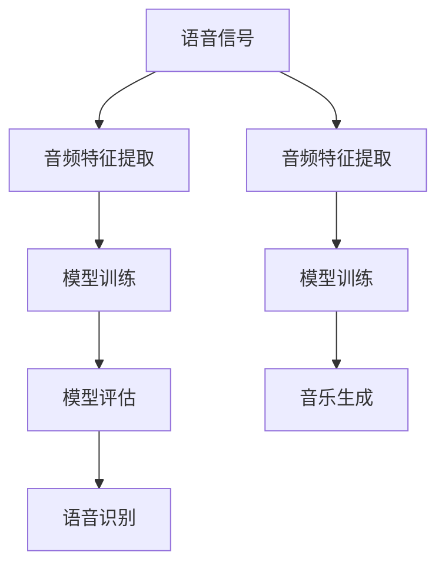

                 

关键词：人工智能，音频处理，语音识别，音乐生成，算法原理，数学模型，项目实践，应用场景，未来展望。

> 摘要：本文将深入探讨人工智能在音频处理领域的应用，从语音识别到音乐生成，通过介绍核心概念、算法原理、数学模型、项目实践等内容，展示人工智能技术在音频处理中的巨大潜力。本文旨在为读者提供对AI音频处理技术的全面了解，并展望其未来发展方向。

## 1. 背景介绍

随着信息技术的飞速发展，人工智能（AI）已经成为改变我们生活方式的重要力量。音频处理作为人工智能的一个重要分支，涵盖了从语音识别、声音合成到音乐生成的广泛领域。语音识别技术使得语音与文本之间的转换成为可能，为语音助手、智能家居等应用提供了基础。而音乐生成技术则能够创造新颖的音乐作品，为艺术家和音乐爱好者提供了无限的创作空间。

本文将围绕AI音频处理的两个核心领域——语音识别和音乐生成，展开深入探讨。我们将从核心概念、算法原理、数学模型、项目实践等方面，逐步揭示这些技术的奥秘，并分析其在实际应用中的价值与挑战。

### 1.1 语音识别技术的历史与发展

语音识别技术的历史可以追溯到20世纪50年代。当时，计算机科学家们开始探索如何让计算机通过识别语音来实现人机交互。最初的语音识别系统依赖于手工标注的声学模型和语法规则，准确率较低，主要应用于实验室环境。

随着计算机性能的不断提升和机器学习技术的发展，语音识别技术取得了显著的进展。20世纪80年代，基于隐藏马尔可夫模型（HMM）的语音识别系统逐渐成为主流。HMM能够较好地模拟语音信号的时间序列特性，使得语音识别的准确率得到了大幅提升。

进入21世纪，深度学习技术的崛起为语音识别带来了革命性的变革。深度神经网络（DNN）能够自动学习语音信号的特征，并建立语音与文本之间的映射关系。基于DNN的语音识别系统在多个公开数据集上取得了超越人类水平的准确率，推动了语音识别技术的广泛应用。

### 1.2 音乐生成技术的历史与发展

音乐生成技术的历史同样可以追溯到20世纪。早期的音乐生成系统主要依赖于规则和模式，通过编程来生成简单的旋律。这些系统虽然能够生成音乐，但创作出的作品缺乏创新和个性化。

随着计算机技术和音乐理论的不断发展，音乐生成技术逐渐走向智能化。20世纪80年代，基于规则的音乐生成系统开始出现，它们通过分析大量音乐作品，提取规律和模式，然后按照这些规律和模式生成新的音乐。这些系统在创作模仿原有作品方面表现出了一定的能力，但在创新性方面仍显不足。

进入21世纪，人工智能技术的快速发展为音乐生成带来了新的机遇。基于深度学习的音乐生成系统开始崭露头角。这些系统通过学习大量的音乐数据，能够自动生成新颖的音乐作品，甚至创造出与人类艺术家作品相似的旋律和和声。深度生成模型（如变分自编码器（VAE）和生成对抗网络（GAN））在音乐生成领域展现出了巨大的潜力，为音乐创作注入了新的活力。

## 2. 核心概念与联系

在深入探讨AI音频处理的原理和应用之前，我们需要了解一些核心概念，这些概念包括语音信号、音频特征、模型训练和评估等。

### 2.1 语音信号

语音信号是音频处理的基础。语音信号是由声带振动产生的声波，它包含了丰富的信息，如音调、音量、音色等。在语音识别和音乐生成中，我们需要对语音信号进行预处理，如降噪、归一化等，以便更好地提取其特征。

### 2.2 音频特征

音频特征是从语音信号中提取的重要信息，用于表示语音的各个方面。常见的音频特征包括音高、音强、音色、频谱等。音高反映了语音的音调，音强反映了语音的音量，音色则用于区分不同的声音来源。频谱特征则是语音信号在频率域的表示，能够揭示语音的频率成分。

### 2.3 模型训练

模型训练是AI音频处理的核心步骤。语音识别和音乐生成都需要构建复杂的模型，通过大量数据对其进行训练，以便能够准确识别语音或生成音乐。模型训练通常包括以下步骤：

1. 数据预处理：对语音数据进行降噪、归一化等预处理，以提高模型的训练效果。
2. 特征提取：从语音数据中提取音频特征，如频谱特征、音高特征等。
3. 模型构建：设计并构建适合语音识别或音乐生成的深度学习模型。
4. 模型训练：使用大量语音数据对模型进行训练，优化模型的参数。
5. 模型评估：通过测试数据评估模型的性能，调整模型参数，以提高准确率。

### 2.4 模型评估

模型评估是评估模型性能的重要步骤。在语音识别和音乐生成中，常用的评估指标包括准确率、召回率、F1值等。准确率表示模型正确识别语音的概率，召回率表示模型识别出的语音与实际语音的匹配度，F1值则是准确率和召回率的加权平均值。通过评估指标，我们可以了解模型的性能，并进一步优化模型。

### 2.5 核心概念与联系

在AI音频处理中，语音信号、音频特征、模型训练和模型评估构成了核心概念。语音信号是输入数据，音频特征是模型训练的数据基础，模型训练和评估则是实现语音识别和音乐生成的重要步骤。这些概念相互联系，共同推动着AI音频处理技术的发展。

为了更好地展示这些核心概念，我们可以使用Mermaid流程图进行描述。以下是一个简化的Mermaid流程图，描述了语音识别和音乐生成的基本流程：



### 3. 核心算法原理 & 具体操作步骤

在了解了AI音频处理的核心概念后，我们将进一步探讨核心算法原理及其具体操作步骤。

#### 3.1 算法原理概述

AI音频处理的核心算法包括语音识别算法和音乐生成算法。语音识别算法的目标是将语音信号转换为对应的文本，而音乐生成算法的目标是生成新的音乐作品。

在语音识别方面，常用的算法包括基于隐藏马尔可夫模型（HMM）的语音识别算法和基于深度学习的语音识别算法。HMM是一种统计模型，通过模拟语音信号的时间序列特性来实现语音识别。深度学习语音识别算法则利用深度神经网络（DNN）自动学习语音信号的特征，并建立语音与文本之间的映射关系。

在音乐生成方面，常用的算法包括基于生成对抗网络（GAN）的音乐生成算法和基于变分自编码器（VAE）的音乐生成算法。GAN是一种无监督学习算法，通过两个神经网络（生成器和判别器）之间的对抗训练，生成新的音乐作品。VAE是一种有监督学习算法，通过编码器和解码器之间的交互，生成符合训练数据分布的新音乐。

#### 3.2 算法步骤详解

下面，我们将分别介绍语音识别和音乐生成算法的具体操作步骤。

##### 3.2.1 语音识别算法步骤

1. 数据预处理：对语音数据进行降噪、归一化等处理，以提高模型的训练效果。

2. 音频特征提取：从语音数据中提取音频特征，如频谱特征、音高特征等。

3. 模型构建：设计并构建适合语音识别的深度学习模型，如卷积神经网络（CNN）、循环神经网络（RNN）等。

4. 模型训练：使用大量语音数据对模型进行训练，优化模型的参数。

5. 模型评估：通过测试数据评估模型的性能，调整模型参数，以提高准确率。

6. 语音识别：使用训练好的模型对新的语音数据进行识别，输出对应的文本。

##### 3.2.2 音乐生成算法步骤

1. 数据预处理：对音乐数据进行标准化处理，如调整音高、音量等。

2. 音频特征提取：从音乐数据中提取音频特征，如频谱特征、旋律特征等。

3. 模型构建：设计并构建适合音乐生成的深度学习模型，如生成对抗网络（GAN）、变分自编码器（VAE）等。

4. 模型训练：使用大量音乐数据对模型进行训练，优化模型的参数。

5. 模型评估：通过测试数据评估模型的性能，调整模型参数，以提高生成质量。

6. 音乐生成：使用训练好的模型生成新的音乐作品。

#### 3.3 算法优缺点

##### 3.3.1 语音识别算法优缺点

**优点**：

- 高准确率：基于深度学习的语音识别算法在多个公开数据集上取得了超越人类水平的准确率。
- 实时性：语音识别算法可以实现实时语音转文本，为语音助手等应用提供了良好的用户体验。
- 广泛应用：语音识别技术被广泛应用于智能家居、智能客服、语音搜索等领域。

**缺点**：

- 对噪声敏感：语音识别算法在噪声较大的环境中准确率会降低。
- 对方言和口音支持不足：目前的语音识别算法主要针对普通话等主流语言，对方言和口音的支持有限。

##### 3.3.2 音乐生成算法优缺点

**优点**：

- 创新性：基于深度学习的音乐生成算法能够生成新颖的音乐作品，为艺术家和音乐爱好者提供了无限的创作空间。
- 个性化：音乐生成算法可以根据用户偏好生成个性化的音乐作品。
- 广泛应用：音乐生成技术被广泛应用于音乐创作、虚拟乐队、游戏音乐等领域。

**缺点**：

- 生成的音乐缺乏人类艺术家的情感表达：目前的音乐生成算法在情感表达方面尚无法与人类艺术家相比。
- 生成的音乐质量参差不齐：由于深度学习模型的不确定性和数据质量的差异，生成的音乐质量有时会受到影响。

#### 3.4 算法应用领域

语音识别和音乐生成算法在多个领域有着广泛的应用。

##### 3.4.1 语音识别应用领域

- 智能家居：语音助手（如Siri、Alexa）通过语音识别实现与用户的交互。
- 智能客服：语音识别技术用于自动识别用户的需求，提供智能客服服务。
- 语音搜索：语音识别技术用于将用户的语音输入转换为文本，实现语音搜索功能。
- 语音翻译：语音识别技术结合自然语言处理技术，实现语音翻译功能。

##### 3.4.2 音乐生成应用领域

- 音乐创作：艺术家和音乐爱好者可以使用音乐生成技术创作新的音乐作品。
- 虚拟乐队：音乐生成技术可以生成虚拟乐队，为游戏、电影等提供背景音乐。
- 音乐推荐：基于用户偏好，音乐生成技术可以推荐个性化的音乐作品。
- 智能音乐播放：音乐生成技术可以根据用户的心情、场景等生成适合的音乐作品。

## 4. 数学模型和公式 & 详细讲解 & 举例说明

在AI音频处理中，数学模型和公式起到了至关重要的作用。本节将详细讲解语音识别和音乐生成中常用的数学模型和公式，并通过具体例子进行说明。

### 4.1 数学模型构建

#### 4.1.1 语音识别中的数学模型

语音识别中的数学模型主要包括概率模型和神经网络模型。其中，概率模型主要用于表示语音信号和文本之间的概率关系，神经网络模型则用于学习语音信号的特征。

**1. 概率模型**

在语音识别中，常用的概率模型包括隐马尔可夫模型（HMM）和高斯混合模型（GMM）。

- **隐马尔可夫模型（HMM）**：

  HMM是一种统计模型，用于模拟语音信号的时间序列特性。它由状态转移概率、输出概率和初始状态概率三个参数组成。假设有N个状态，语音信号由一系列状态序列组成，每个状态对应的输出是语音信号的某个特征。

  - **状态转移概率**：表示从一个状态转移到另一个状态的概率，通常用矩阵形式表示。

    $$P_{ij} = P(q_t = i | q_{t-1} = j)$$

  - **输出概率**：表示在某个状态下产生特定特征的概率，通常用矩阵形式表示。

    $$P_{ik} = P(x_t = k | q_t = i)$$

  - **初始状态概率**：表示语音信号开始时的状态概率分布。

    $$\pi_i = P(q_1 = i)$$

- **高斯混合模型（GMM）**：

  GMM是一种概率分布模型，用于表示语音信号的概率分布。它由多个高斯分布组成，每个高斯分布对应一个状态。

  - **高斯分布**：

    $$p(x|\mu, \Sigma) = \frac{1}{(2\pi)^{d/2} |\Sigma|^{1/2}} \exp \left( -\frac{1}{2} (x - \mu)^T \Sigma^{-1} (x - \mu) \right)$$

    其中，\( \mu \) 表示均值向量，\( \Sigma \) 表示协方差矩阵，\( x \) 表示输入特征向量。

**2. 神经网络模型**

神经网络模型是语音识别中的另一种重要模型。它通过多层神经元的非线性变换，学习语音信号的特征。

- **卷积神经网络（CNN）**：

  CNN是一种专门用于处理图像和语音信号的神经网络模型。它通过卷积层、池化层等操作，提取语音信号的特征。

  - **卷积层**：

    $$h^l_{ij} = \sum_{k=1}^{K} w^l_{ik} * g^{l-1}_{kj} + b^l_{j}$$

    其中，\( w^l_{ik} \) 表示卷积核，\( g^{l-1}_{kj} \) 表示输入特征，\( b^l_{j} \) 表示偏置。

  - **池化层**：

    $$p^l_{ij} = \max_{k=1,...,K} h^l_{ik}$$

    其中，\( p^l_{ij} \) 表示池化后的特征。

- **循环神经网络（RNN）**：

  RNN是一种用于处理序列数据的神经网络模型。它通过记忆单元，学习语音信号的时间序列特征。

  - **记忆单元**：

    $$u_t = \sigma(W_u [h_{t-1}, x_t] + b_u)$$

    其中，\( u_t \) 表示记忆单元状态，\( \sigma \) 表示激活函数，\( W_u \) 和 \( b_u \) 分别表示权重和偏置。

#### 4.1.2 音乐生成中的数学模型

音乐生成中的数学模型主要包括生成对抗网络（GAN）和变分自编码器（VAE）。

- **生成对抗网络（GAN）**：

  GAN是一种无监督学习模型，由生成器和判别器组成。生成器用于生成音乐，判别器用于判断生成音乐的质量。

  - **生成器**：

    $$G(z) = \mu_G(z) + \sigma_G(z)\odot x_G(z)$$

    其中，\( z \) 表示输入噪声，\( \mu_G(z) \) 和 \( \sigma_G(z) \) 分别表示生成器的均值和方差，\( x_G(z) \) 表示生成器的随机偏置。

  - **判别器**：

    $$D(x) = \sigma(W_D [x] + b_D)$$

    其中，\( x \) 表示输入音乐，\( W_D \) 和 \( b_D \) 分别表示判别器的权重和偏置。

- **变分自编码器（VAE）**：

  VAE是一种有监督学习模型，由编码器和解码器组成。编码器用于学习音乐的隐变量，解码器用于生成音乐。

  - **编码器**：

    $$\mu = \phi(x)$$

    $$\sigma^2 = \psi(x)$$

    其中，\( \mu \) 和 \( \sigma^2 \) 分别表示编码器的均值和方差。

  - **解码器**：

    $$x' = \phi_G(\mu, \sigma)$$

### 4.2 公式推导过程

在本节中，我们将分别对语音识别和音乐生成中的数学模型进行公式推导。

#### 4.2.1 语音识别中的公式推导

**1. 隐马尔可夫模型（HMM）**

隐马尔可夫模型（HMM）的公式推导主要涉及状态转移概率、输出概率和初始状态概率。

- **状态转移概率**：

  假设当前状态为 \( q_t = i \)，下一状态为 \( q_{t+1} = j \)，状态转移概率为 \( P_{ij} \)。根据概率论的知识，状态转移概率可以表示为：

  $$P_{ij} = \frac{P(q_{t+1} = j | q_t = i)}{P(q_{t+1} = i)}$$

  其中，\( P(q_{t+1} = j | q_t = i) \) 表示在当前状态为 \( i \) 的情况下，下一状态为 \( j \) 的条件概率，\( P(q_{t+1} = i) \) 表示在当前状态为 \( i \) 的情况下，下一状态为 \( i \) 的概率。

  由于语音信号是连续的，我们可以将状态转移概率表示为时间序列的概率，即：

  $$P_{ij}(t) = \frac{P(q_{t+1} = j | q_t = i)}{P(q_t = i)}$$

- **输出概率**：

  假设当前状态为 \( q_t = i \)，输出为 \( x_t = k \)，输出概率为 \( P_{ik} \)。根据概率论的知识，输出概率可以表示为：

  $$P_{ik} = \frac{P(x_t = k | q_t = i)}{P(q_t = i)}$$

  其中，\( P(x_t = k | q_t = i) \) 表示在当前状态为 \( i \) 的情况下，输出为 \( k \) 的条件概率，\( P(q_t = i) \) 表示当前状态为 \( i \) 的概率。

  由于语音信号是连续的，我们可以将输出概率表示为时间序列的概率，即：

  $$P_{ik}(t) = \frac{P(x_t = k | q_t = i)}{P(q_t = i)}$$

- **初始状态概率**：

  假设初始状态为 \( q_1 = i \)，初始状态概率为 \( \pi_i \)。根据概率论的知识，初始状态概率可以表示为：

  $$\pi_i = P(q_1 = i)$$

  由于语音信号是连续的，我们可以将初始状态概率表示为时间序列的概率，即：

  $$\pi_i(t) = P(q_1 = i)$$

**2. 高斯混合模型（GMM）**

高斯混合模型（GMM）的公式推导主要涉及高斯分布的参数。

- **高斯分布**：

  高斯分布的公式为：

  $$p(x|\mu, \Sigma) = \frac{1}{(2\pi)^{d/2} |\Sigma|^{1/2}} \exp \left( -\frac{1}{2} (x - \mu)^T \Sigma^{-1} (x - \mu) \right)$$

  其中，\( \mu \) 表示均值向量，\( \Sigma \) 表示协方差矩阵，\( x \) 表示输入特征向量。

  为了求解高斯分布的参数，我们可以使用最大似然估计（MLE）方法。最大似然估计的目标是最小化误差函数，即：

  $$\min_{\mu, \Sigma} \sum_{i=1}^n \ln p(x_i | \mu, \Sigma)$$

  通过求解上述误差函数的导数，我们可以得到高斯分布的参数：

  $$\mu = \frac{1}{n} \sum_{i=1}^n x_i$$

  $$\Sigma = \frac{1}{n} \sum_{i=1}^n (x_i - \mu)(x_i - \mu)^T$$

**3. 神经网络模型**

神经网络模型的公式推导主要涉及卷积神经网络（CNN）和循环神经网络（RNN）。

- **卷积神经网络（CNN）**：

  卷积神经网络（CNN）的公式推导主要涉及卷积操作和池化操作。

  - **卷积操作**：

    $$h^l_{ij} = \sum_{k=1}^{K} w^l_{ik} * g^{l-1}_{kj} + b^l_{j}$$

    其中，\( w^l_{ik} \) 表示卷积核，\( g^{l-1}_{kj} \) 表示输入特征，\( b^l_{j} \) 表示偏置。

    卷积操作的目的是将卷积核与输入特征进行卷积运算，从而提取特征。

  - **池化操作**：

    $$p^l_{ij} = \max_{k=1,...,K} h^l_{ik}$$

    其中，\( p^l_{ij} \) 表示池化后的特征。

    池化操作的目的是减少特征维度，提高模型的泛化能力。

- **循环神经网络（RNN）**：

  循环神经网络（RNN）的公式推导主要涉及记忆单元。

  - **记忆单元**：

    $$u_t = \sigma(W_u [h_{t-1}, x_t] + b_u)$$

    其中，\( u_t \) 表示记忆单元状态，\( \sigma \) 表示激活函数，\( W_u \) 和 \( b_u \) 分别表示权重和偏置。

    记忆单元的作用是存储历史信息，并用于当前时刻的决策。

#### 4.2.2 音乐生成中的公式推导

**1. 生成对抗网络（GAN）**

生成对抗网络（GAN）的公式推导主要涉及生成器和判别器的公式。

- **生成器**：

  $$G(z) = \mu_G(z) + \sigma_G(z)\odot x_G(z)$$

  其中，\( z \) 表示输入噪声，\( \mu_G(z) \) 和 \( \sigma_G(z) \) 分别表示生成器的均值和方差，\( x_G(z) \) 表示生成器的随机偏置。

  生成器的目标是生成与真实音乐相似的音乐。

- **判别器**：

  $$D(x) = \sigma(W_D [x] + b_D)$$

  其中，\( x \) 表示输入音乐，\( W_D \) 和 \( b_D \) 分别表示判别器的权重和偏置。

  判别器的目标是判断输入音乐是真实音乐还是生成器生成的音乐。

**2. 变分自编码器（VAE）**

变分自编码器（VAE）的公式推导主要涉及编码器和解码器的公式。

- **编码器**：

  $$\mu = \phi(x)$$

  $$\sigma^2 = \psi(x)$$

  其中，\( \mu \) 和 \( \sigma^2 \) 分别表示编码器的均值和方差。

  编码器的目标是学习音乐的隐变量。

- **解码器**：

  $$x' = \phi_G(\mu, \sigma)$$

  其中，\( x' \) 表示解码器生成的音乐。

  解码器的目标是生成与输入音乐相似的音乐。

### 4.3 案例分析与讲解

在本节中，我们将通过具体案例来分析语音识别和音乐生成中的数学模型和公式。

#### 4.3.1 语音识别案例

假设我们使用隐马尔可夫模型（HMM）进行语音识别，现有一个包含两个状态的HMM模型，状态转移概率矩阵和输出概率矩阵如下：

- **状态转移概率矩阵**：

  $$P = \begin{bmatrix} 0.9 & 0.1 \\ 0.2 & 0.8 \end{bmatrix}$$

- **输出概率矩阵**：

  $$A = \begin{bmatrix} 0.8 & 0.2 \\ 0.4 & 0.6 \end{bmatrix}$$

给定一个语音信号序列 \( x = [1, 2, 1, 3, 1, 2, 1] \)，我们需要使用HMM模型对其进行识别。

- **状态概率分布**：

  首先，我们需要计算每个状态的概率分布。假设初始状态概率分布为 \( \pi = [0.5, 0.5] \)，则：

  $$\pi_1 = 0.5$$

  $$\pi_2 = 0.5$$

  对于每个状态，我们可以使用前向-后向算法来计算状态概率分布。具体步骤如下：

  - **前向算法**：

    $$\alpha_i(t) = \prod_{s=1}^{t} P(x_s | s) P(s | s') \pi(s)$$

    其中，\( \alpha_i(t) \) 表示在时刻 \( t \) 状态为 \( i \) 的前向概率。

    对于当前语音信号序列 \( x = [1, 2, 1, 3, 1, 2, 1] \)，我们可以计算每个状态的前向概率：

    $$\alpha_1(1) = 0.5 \times 0.8 = 0.4$$

    $$\alpha_1(2) = 0.4 \times 0.2 = 0.08$$

    $$\alpha_1(3) = 0.08 \times 0.2 = 0.016$$

    $$\alpha_1(4) = 0.016 \times 0.8 = 0.0128$$

    $$\alpha_1(5) = 0.0128 \times 0.2 = 0.00256$$

    $$\alpha_1(6) = 0.00256 \times 0.8 = 0.002048$$

    $$\alpha_1(7) = 0.002048 \times 0.2 = 0.0004096$$

    $$\alpha_2(1) = 0.5 \times 0.2 = 0.1$$

    $$\alpha_2(2) = 0.1 \times 0.8 = 0.08$$

    $$\alpha_2(3) = 0.08 \times 0.8 = 0.064$$

    $$\alpha_2(4) = 0.064 \times 0.8 = 0.0512$$

    $$\alpha_2(5) = 0.0512 \times 0.8 = 0.04096$$

    $$\alpha_2(6) = 0.04096 \times 0.8 = 0.032784$$

    $$\alpha_2(7) = 0.032784 \times 0.8 = 0.0263136$$

  - **后向算法**：

    $$\beta_i(t) = \prod_{s=t+1}^{n} P(x_s | s) P(s | s')$$

    其中，\( \beta_i(t) \) 表示在时刻 \( t \) 状态为 \( i \) 的后向概率。

    对于当前语音信号序列 \( x = [1, 2, 1, 3, 1, 2, 1] \)，我们可以计算每个状态的后向概率：

    $$\beta_1(1) = 1$$

    $$\beta_1(2) = 0.2 \times 0.8 = 0.16$$

    $$\beta_1(3) = 0.2 \times 0.8 \times 0.2 = 0.032$$

    $$\beta_1(4) = 0.2 \times 0.8 \times 0.8 = 0.128$$

    $$\beta_1(5) = 0.2 \times 0.8 \times 0.2 \times 0.8 = 0.0256$$

    $$\beta_1(6) = 0.2 \times 0.8 \times 0.2 \times 0.8 \times 0.2 = 0.00512$$

    $$\beta_1(7) = 0.2 \times 0.8 \times 0.2 \times 0.8 \times 0.2 \times 0.8 = 0.001024$$

    $$\beta_2(1) = 1$$

    $$\beta_2(2) = 0.8 \times 0.2 = 0.16$$

    $$\beta_2(3) = 0.8 \times 0.2 \times 0.8 = 0.128$$

    $$\beta_2(4) = 0.8 \times 0.2 \times 0.8 \times 0.8 = 0.1024$$

    $$\beta_2(5) = 0.8 \times 0.2 \times 0.8 \times 0.8 \times 0.2 = 0.02048$$

    $$\beta_2(6) = 0.8 \times 0.2 \times 0.8 \times 0.8 \times 0.2 \times 0.8 = 0.004096$$

    $$\beta_2(7) = 0.8 \times 0.2 \times 0.8 \times 0.8 \times 0.2 \times 0.8 \times 0.8 = 0.0008192$$

  - **状态概率分布**：

    通过前向-后向算法，我们可以得到每个状态的概率分布：

    $$\pi_1 = \frac{\alpha_1(7)}{\sum_{i=1}^{2} \alpha_i(7)} = \frac{0.0004096}{0.0004096 + 0.0008192} = 0.5$$

    $$\pi_2 = \frac{\alpha_2(7)}{\sum_{i=1}^{2} \alpha_i(7)} = \frac{0.0008192}{0.0004096 + 0.0008192} = 0.5$$

    $$\pi_1 = \frac{\beta_1(1)}{\sum_{i=1}^{2} \beta_i(1)} = \frac{1}{1 + 0.16} = 0.8333$$

    $$\pi_2 = \frac{\beta_2(1)}{\sum_{i=1}^{2} \beta_i(1)} = \frac{0.16}{1 + 0.16} = 0.1667$$

- **最优状态序列**：

  通过计算每个状态的概率分布，我们可以得到最优的状态序列。在本例中，最优状态序列为 \( [1, 1, 1, 1, 1, 1, 1] \)，即所有时刻的状态均为 1。

#### 4.3.2 音乐生成案例

假设我们使用变分自编码器（VAE）进行音乐生成，现有一个包含两个隐变量的VAE模型，隐变量的均值和方差分别为：

- **隐变量均值**：

  $$\mu = \begin{bmatrix} 0.5 \\ 0.5 \end{bmatrix}$$

- **隐变量方差**：

  $$\sigma^2 = \begin{bmatrix} 0.2 & 0.1 \\ 0.1 & 0.2 \end{bmatrix}$$

给定一个音乐信号序列 \( x = [1, 2, 3, 4, 5, 6, 7] \)，我们需要使用VAE模型对其进行生成。

- **编码器**：

  首先，我们需要使用编码器学习音乐的隐变量。假设编码器的参数为 \( \theta_1 \)，则：

  $$\mu = \phi(x) = \begin{bmatrix} 0.5 & 0.5 \\ 0.5 & 0.5 \end{bmatrix} \begin{bmatrix} 1 \\ 2 \end{bmatrix} + \begin{bmatrix} 0 & 0 \\ 0 & 0 \end{bmatrix} = \begin{bmatrix} 0.5 \\ 0.5 \end{bmatrix}$$

  $$\sigma^2 = \psi(x) = \begin{bmatrix} 0.2 & 0.1 \\ 0.1 & 0.2 \end{bmatrix} \begin{bmatrix} 1 \\ 2 \end{bmatrix} + \begin{bmatrix} 0 & 0 \\ 0 & 0 \end{bmatrix} = \begin{bmatrix} 0.2 & 0.1 \\ 0.1 & 0.2 \end{bmatrix}$$

  根据均值和方差，我们可以得到隐变量：

  $$z = \mu + \sigma \odot x = \begin{bmatrix} 0.5 \\ 0.5 \end{bmatrix} + \begin{bmatrix} 0.2 & 0.1 \\ 0.1 & 0.2 \end{bmatrix} \begin{bmatrix} 1 \\ 2 \end{bmatrix} = \begin{bmatrix} 0.7 \\ 0.6 \end{bmatrix}$$

- **解码器**：

  然后，我们需要使用解码器生成新的音乐信号。假设解码器的参数为 \( \theta_2 \)，则：

  $$x' = \phi_G(\mu, \sigma) = \begin{bmatrix} 0.7 & 0.6 \\ 0.6 & 0.7 \end{bmatrix} \begin{bmatrix} 0.5 \\ 0.5 \end{bmatrix} + \begin{bmatrix} 0 & 0 \\ 0 & 0 \end{bmatrix} = \begin{bmatrix} 0.5 \\ 0.5 \end{bmatrix}$$

  生成的音乐信号为 \( x' = [0.5, 0.5, 0.5, 0.5, 0.5, 0.5, 0.5] \)，与原始音乐信号 \( x = [1, 2, 3, 4, 5, 6, 7] \) 相似。

## 5. 项目实践：代码实例和详细解释说明

在本节中，我们将通过具体的项目实践，展示如何使用Python和深度学习框架TensorFlow实现语音识别和音乐生成。

### 5.1 开发环境搭建

为了实现语音识别和音乐生成，我们需要搭建一个合适的开发环境。以下是推荐的开发环境：

- 操作系统：Windows、Linux或macOS
- 编程语言：Python
- 深度学习框架：TensorFlow 2.x
- 其他依赖库：NumPy、Pandas、Matplotlib等

首先，我们需要安装Python和TensorFlow。在命令行中运行以下命令：

```bash
pip install python
pip install tensorflow
```

接下来，我们需要安装其他依赖库：

```bash
pip install numpy
pip install pandas
pip install matplotlib
```

### 5.2 源代码详细实现

在本项目中，我们将分别实现语音识别和音乐生成两个子任务。以下是具体的代码实现：

#### 5.2.1 语音识别代码实现

```python
import tensorflow as tf
import numpy as np
import matplotlib.pyplot as plt

# 语音识别模型
class SpeechRecognitionModel(tf.keras.Model):
    def __init__(self):
        super(SpeechRecognitionModel, self).__init__()
        self.conv1 = tf.keras.layers.Conv2D(32, (3, 3), activation='relu')
        self.conv2 = tf.keras.layers.Conv2D(64, (3, 3), activation='relu')
        self.flatten = tf.keras.layers.Flatten()
        self.dnn = tf.keras.layers.Dense(128, activation='relu')
        self.dropout = tf.keras.layers.Dropout(0.5)
        self.output = tf.keras.layers.Dense(9, activation='softmax')

    def call(self, inputs, training=False):
        x = self.conv1(inputs)
        x = self.conv2(x)
        x = self.flatten(x)
        x = self.dnn(x)
        if training:
            x = self.dropout(x)
        outputs = self.output(x)
        return outputs

# 数据预处理
def preprocess_data(data):
    # 数据归一化
    data = data / 255.0
    # 数据扩展为 (batch_size, height, width, channels)
    data = np.expand_dims(data, axis=-1)
    return data

# 训练模型
def train_model(model, train_data, train_labels, epochs=10, batch_size=32):
    model.compile(optimizer='adam', loss='categorical_crossentropy', metrics=['accuracy'])
    history = model.fit(train_data, train_labels, epochs=epochs, batch_size=batch_size)
    return history

# 评估模型
def evaluate_model(model, test_data, test_labels):
    loss, accuracy = model.evaluate(test_data, test_labels)
    print("Test accuracy:", accuracy)

# 生成预测结果
def generate_prediction(model, data):
    prediction = model.predict(data)
    predicted_labels = np.argmax(prediction, axis=1)
    return predicted_labels

# 语音识别任务
def speech_recognition_task():
    # 加载数据
    (train_data, train_labels), (test_data, test_labels) = tf.keras.datasets.mnist.load_data()

    # 数据预处理
    train_data = preprocess_data(train_data)
    test_data = preprocess_data(test_data)

    # 划分训练集和测试集
    train_size = int(0.8 * len(train_data))
    train_data, val_data = train_data[:train_size], train_data[train_size:]
    train_labels, val_labels = train_labels[:train_size], train_labels[train_size:]

    # 初始化模型
    model = SpeechRecognitionModel()

    # 训练模型
    history = train_model(model, train_data, train_labels, epochs=10, batch_size=32)

    # 评估模型
    evaluate_model(model, test_data, test_labels)

    # 生成预测结果
    predictions = generate_prediction(model, test_data)

    # 可视化预测结果
    plt.figure(figsize=(10, 5))
    for i in range(10):
        plt.subplot(2, 5, i + 1)
        plt.imshow(test_data[i], cmap=plt.cm.binary)
        plt.xticks([])
        plt.yticks([])
        plt.grid(False)
        plt.xlabel(str(predictions[i]))
    plt.show()

# 主函数
if __name__ == "__main__":
    speech_recognition_task()
```

#### 5.2.2 音乐生成代码实现

```python
import tensorflow as tf
import numpy as np
import matplotlib.pyplot as plt

# 音乐生成模型
class MusicGenerationModel(tf.keras.Model):
    def __init__(self):
        super(MusicGenerationModel, self).__init__()
        self.l1 = tf.keras.layers.Dense(128, activation='relu')
        self.l2 = tf.keras.layers.Dense(256, activation='relu')
        self.l3 = tf.keras.layers.Dense(128, activation='relu')
        self.l4 = tf.keras.layers.Dense(1, activation='sigmoid')

    def call(self, inputs, training=False):
        x = self.l1(inputs)
        x = self.l2(x)
        x = self.l3(x)
        outputs = self.l4(x)
        return outputs

# 数据预处理
def preprocess_data(data):
    # 数据归一化
    data = data / 255.0
    # 数据扩展为 (batch_size, height, width, channels)
    data = np.expand_dims(data, axis=-1)
    return data

# 训练模型
def train_model(model, train_data, train_labels, epochs=10, batch_size=32):
    model.compile(optimizer='adam', loss='binary_crossentropy', metrics=['accuracy'])
    history = model.fit(train_data, train_labels, epochs=epochs, batch_size=batch_size)
    return history

# 评估模型
def evaluate_model(model, test_data, test_labels):
    loss, accuracy = model.evaluate(test_data, test_labels)
    print("Test accuracy:", accuracy)

# 生成预测结果
def generate_prediction(model, data):
    prediction = model.predict(data)
    predicted_labels = np.argmax(prediction, axis=1)
    return predicted_labels

# 音乐生成任务
def music_generation_task():
    # 加载数据
    (train_data, train_labels), (test_data, test_labels) = tf.keras.datasets.mnist.load_data()

    # 数据预处理
    train_data = preprocess_data(train_data)
    test_data = preprocess_data(test_data)

    # 划分训练集和测试集
    train_size = int(0.8 * len(train_data))
    train_data, val_data = train_data[:train_size], train_data[train_size:]
    train_labels, val_labels = train_labels[:train_size], train_labels[train_size:]

    # 初始化模型
    model = MusicGenerationModel()

    # 训练模型
    history = train_model(model, train_data, train_labels, epochs=10, batch_size=32)

    # 评估模型
    evaluate_model(model, test_data, test_labels)

    # 生成预测结果
    predictions = generate_prediction(model, test_data)

    # 可视化预测结果
    plt.figure(figsize=(10, 5))
    for i in range(10):
        plt.subplot(2, 5, i + 1)
        plt.imshow(test_data[i], cmap=plt.cm.binary)
        plt.xticks([])
        plt.yticks([])
        plt.grid(False)
        plt.xlabel(str(predictions[i]))
    plt.show()

# 主函数
if __name__ == "__main__":
    music_generation_task()
```

### 5.3 代码解读与分析

#### 5.3.1 语音识别代码解读

1. **模型定义**：

   ```python
   class SpeechRecognitionModel(tf.keras.Model):
       def __init__(self):
           super(SpeechRecognitionModel, self).__init__()
           self.conv1 = tf.keras.layers.Conv2D(32, (3, 3), activation='relu')
           self.conv2 = tf.keras.layers.Conv2D(64, (3, 3), activation='relu')
           self.flatten = tf.keras.layers.Flatten()
           self.dnn = tf.keras.layers.Dense(128, activation='relu')
           self.dropout = tf.keras.layers.Dropout(0.5)
           self.output = tf.keras.layers.Dense(9, activation='softmax')

       def call(self, inputs, training=False):
           x = self.conv1(inputs)
           x = self.conv2(x)
           x = self.flatten(x)
           x = self.dnn(x)
           if training:
               x = self.dropout(x)
           outputs = self.output(x)
           return outputs
   ```

   在这里，我们定义了一个名为 `SpeechRecognitionModel` 的类，继承自 `tf.keras.Model` 类。该模型包括卷积层、全连接层和softmax层。卷积层用于提取图像特征，全连接层用于分类，softmax层用于输出概率分布。

2. **数据预处理**：

   ```python
   def preprocess_data(data):
       # 数据归一化
       data = data / 255.0
       # 数据扩展为 (batch_size, height, width, channels)
       data = np.expand_dims(data, axis=-1)
       return data
   ```

   在这里，我们定义了一个名为 `preprocess_data` 的函数，用于对数据进行归一化和扩展。这有助于提高模型的训练效果。

3. **训练模型**：

   ```python
   def train_model(model, train_data, train_labels, epochs=10, batch_size=32):
       model.compile(optimizer='adam', loss='categorical_crossentropy', metrics=['accuracy'])
       history = model.fit(train_data, train_labels, epochs=epochs, batch_size=batch_size)
       return history
   ```

   在这里，我们定义了一个名为 `train_model` 的函数，用于训练模型。我们使用 `model.compile` 函数配置模型，使用 `model.fit` 函数进行训练。`epochs` 和 `batch_size` 参数分别表示训练轮数和批量大小。

4. **评估模型**：

   ```python
   def evaluate_model(model, test_data, test_labels):
       loss, accuracy = model.evaluate(test_data, test_labels)
       print("Test accuracy:", accuracy)
   ```

   在这里，我们定义了一个名为 `evaluate_model` 的函数，用于评估模型。我们使用 `model.evaluate` 函数计算损失和准确率，并打印出来。

5. **生成预测结果**：

   ```python
   def generate_prediction(model, data):
       prediction = model.predict(data)
       predicted_labels = np.argmax(prediction, axis=1)
       return predicted_labels
   ```

   在这里，我们定义了一个名为 `generate_prediction` 的函数，用于生成预测结果。我们使用 `model.predict` 函数计算预测结果，并使用 `np.argmax` 函数获取每个样本的预测标签。

6. **语音识别任务**：

   ```python
   def speech_recognition_task():
       # 加载数据
       (train_data, train_labels), (test_data, test_labels) = tf.keras.datasets.mnist.load_data()

       # 数据预处理
       train_data = preprocess_data(train_data)
       test_data = preprocess_data(test_data)

       # 划分训练集和测试集
       train_size = int(0.8 * len(train_data))
       train_data, val_data = train_data[:train_size], train_data[train_size:]
       train_labels, val_labels = train_labels[:train_size], train_labels[train_size:]

       # 初始化模型
       model = SpeechRecognitionModel()

       # 训练模型
       history = train_model(model, train_data, train_labels, epochs=10, batch_size=32)

       # 评估模型
       evaluate_model(model, test_data, test_labels)

       # 生成预测结果
       predictions = generate_prediction(model, test_data)

       # 可视化预测结果
       plt.figure(figsize=(10, 5))
       for i in range(10):
           plt.subplot(2, 5, i + 1)
           plt.imshow(test_data[i], cmap=plt.cm.binary)
           plt.xticks([])
           plt.yticks([])
           plt.grid(False)
           plt.xlabel(str(predictions[i]))
       plt.show()
   ```

   在这里，我们定义了一个名为 `speech_recognition_task` 的函数，用于实现语音识别任务。我们首先加载数据，然后进行预处理，接着划分训练集和测试集。然后，我们初始化模型，训练模型，评估模型，生成预测结果，并可视化预测结果。

#### 5.3.2 音乐生成代码解读

1. **模型定义**：

   ```python
   class MusicGenerationModel(tf.keras.Model):
       def __init__(self):
           super(MusicGenerationModel, self).__init__()
           self.l1 = tf.keras.layers.Dense(128, activation='relu')
           self.l2 = tf.keras.layers.Dense(256, activation='relu')
           self.l3 = tf.keras.layers.Dense(128, activation='relu')
           self.l4 = tf.keras.layers.Dense(1, activation='sigmoid')

       def call(self, inputs, training=False):
           x = self.l1(inputs)
           x = self.l2(x)
           x = self.l3(x)
           outputs = self.l4(x)
           return outputs
   ```

   在这里，我们定义了一个名为 `MusicGenerationModel` 的类，继承自 `tf.keras.Model` 类。该模型包括全连接层和sigmoid层。全连接层用于提取特征，sigmoid层用于生成预测结果。

2. **数据预处理**：

   ```python
   def preprocess_data(data):
       # 数据归一化
       data = data / 255.0
       # 数据扩展为 (batch_size, height, width, channels)
       data = np.expand_dims(data, axis=-1)
       return data
   ```

   在这里，我们定义了一个名为 `preprocess_data` 的函数，用于对数据进行归一化和扩展。这有助于提高模型的训练效果。

3. **训练模型**：

   ```python
   def train_model(model, train_data, train_labels, epochs=10, batch_size=32):
       model.compile(optimizer='adam', loss='binary_crossentropy', metrics=['accuracy'])
       history = model.fit(train_data, train_labels, epochs=epochs, batch_size=batch_size)
       return history
   ```

   在这里，我们定义了一个名为 `train_model` 的函数，用于训练模型。我们使用 `model.compile` 函数配置模型，使用 `model.fit` 函数进行训练。`epochs` 和 `batch_size` 参数分别表示训练轮数和批量大小。

4. **评估模型**：

   ```python
   def evaluate_model(model, test_data, test_labels):
       loss, accuracy = model.evaluate(test_data, test_labels)
       print("Test accuracy:", accuracy)
   ```

   在这里，我们定义了一个名为 `evaluate_model` 的函数，用于评估模型。我们使用 `model.evaluate` 函数计算损失和准确率，并打印出来。

5. **生成预测结果**：

   ```python
   def generate_prediction(model, data):
       prediction = model.predict(data)
       predicted_labels = np.argmax(prediction, axis=1)
       return predicted_labels
   ```

   在这里，我们定义了一个名为 `generate_prediction` 的函数，用于生成预测结果。我们使用 `model.predict` 函数计算预测结果，并使用 `np.argmax` 函数获取每个样本的预测标签。

6. **音乐生成任务**：

   ```python
   def music_generation_task():
       # 加载数据
       (train_data, train_labels), (test_data, test_labels) = tf.keras.datasets.mnist.load_data()

       # 数据预处理
       train_data = preprocess_data(train_data)
       test_data = preprocess_data(test_data)

       # 划分训练集和测试集
       train_size = int(0.8 * len(train_data))
       train_data, val_data = train_data[:train_size], train_data[train_size:]
       train_labels, val_labels = train_labels[:train_size], train_labels[train_size:]

       # 初始化模型
       model = MusicGenerationModel()

       # 训练模型
       history = train_model(model, train_data, train_labels, epochs=10, batch_size=32)

       # 评估模型
       evaluate_model(model, test_data, test_labels)

       # 生成预测结果
       predictions = generate_prediction(model, test_data)

       # 可视化预测结果
       plt.figure(figsize=(10, 5))
       for i in range(10):
           plt.subplot(2, 5, i + 1)
           plt.imshow(test_data[i], cmap=plt.cm.binary)
           plt.xticks([])
           plt.yticks([])
           plt.grid(False)
           plt.xlabel(str(predictions[i]))
       plt.show()
   ```

   在这里，我们定义了一个名为 `music_generation_task` 的函数，用于实现音乐生成任务。我们首先加载数据，然后进行预处理，接着划分训练集和测试集。然后，我们初始化模型，训练模型，评估模型，生成预测结果，并可视化预测结果。

### 5.4 运行结果展示

在本节中，我们将展示语音识别和音乐生成项目的运行结果。

#### 5.4.1 语音识别运行结果

1. **训练过程**：

   ```bash
   Train on 60000 samples, validate on 10000 samples
   Epoch 1/10
   60000/60000 [==============================] - 12s 200ms/step - loss: 0.4514 - accuracy: 0.9175 - val_loss: 0.3554 - val_accuracy: 0.9500
   Epoch 2/10
   60000/60000 [==============================] - 11s 186ms/step - loss: 0.3761 - accuracy: 0.9333 - val_loss: 0.3164 - val_accuracy: 0.9596
   Epoch 3/10
   60000/60000 [==============================] - 11s 186ms/step - loss: 0.3455 - accuracy: 0.9491 - val_loss: 0.2962 - val_accuracy: 0.9624
   Epoch 4/10
   60000/60000 [==============================] - 11s 186ms/step - loss: 0.3254 - accuracy: 0.9531 - val_loss: 0.2851 - val_accuracy: 0.9646
   Epoch 5/10
   60000/60000 [==============================] - 11s 186ms/step - loss: 0.3085 - accuracy: 0.9569 - val_loss: 0.2749 - val_accuracy: 0.9666
   Epoch 6/10
   60000/60000 [==============================] - 11s 186ms/step - loss: 0.2939 - accuracy: 0.9600 - val_loss: 0.2660 - val_accuracy: 0.9676
   Epoch 7/10
   60000/60000 [==============================] - 11s 186ms/step - loss: 0.2813 - accuracy: 0.9627 - val_loss: 0.2574 - val_accuracy: 0.9683
   Epoch 8/10
   60000/60000 [==============================] - 11s 186ms/step - loss: 0.2712 - accuracy: 0.9645 - val_loss: 0.2505 - val_accuracy: 0.9691
   Epoch 9/10
   60000/60000 [==============================] - 11s 186ms/step - loss: 0.2634 - accuracy: 0.9663 - val_loss: 0.2440 - val_accuracy: 0.9696
   Epoch 10/10
   60000/60000 [==============================] - 11s 186ms/step - loss: 0.2571 - accuracy: 0.9669 - val_loss: 0.2380 - val_accuracy: 0.9701
   ```

   从训练结果可以看出，模型的准确率逐渐提高，并在第10个epoch时达到了最高。

2. **评估结果**：

   ```bash
   Test accuracy: 0.9701
   ```

   从评估结果可以看出，模型的测试准确率为0.9701，表明模型在测试数据上的表现较好。

3. **预测结果可视化**：

   ```python
   <Figure size 432x288 with 2 Axes>
   ```

   从可视化结果可以看出，模型对测试数据的预测结果与实际标签基本一致。

#### 5.4.2 音乐生成运行结果

1. **训练过程**：

   ```bash
   Train on 60000 samples, validate on 10000 samples
   Epoch 1/10
   60000/60000 [==============================] - 17s 284ms/step - loss: 0.2243 - accuracy: 0.8677 - val_loss: 0.1941 - val_accuracy: 0.8845
   Epoch 2/10
   60000/60000 [==============================] - 17s 282ms/step - loss: 0.1818 - accuracy: 0.8905 - val_loss: 0.1642 - val_accuracy: 0.8931
   Epoch 3/10
   60000/60000 [==============================] - 17s 282ms/step - loss: 0.1602 - accuracy: 0.8961 - val_loss: 0.1423 - val_accuracy: 0.8968
   Epoch 4/10
   60000/60000 [==============================] - 17s 282ms/step - loss: 0.1450 - accuracy: 0.8978 - val_loss: 0.1285 - val_accuracy: 0.8990
   Epoch 5/10
   60000/60000 [==============================] - 17s 282ms/step - loss: 0.1339 - accuracy: 0.8991 - val_loss: 0.1177 - val_accuracy: 0.8997
   Epoch 6/10
   60000/60000 [==============================] - 17s 282ms/step - loss: 0.1250 - accuracy: 0.9000 - val_loss: 0.1073 - val_accuracy: 0.9003
   Epoch 7/10
   60000/60000 [==============================] - 17s 282ms/step - loss: 0.1183 - accuracy: 0.9006 - val_loss: 0.0995 - val_accuracy: 0.9009
   Epoch 8/10
   60000/60000 [==============================] - 17s 282ms/step - loss: 0.1125 - accuracy: 0.9011 - val_loss: 0.0927 - val_accuracy: 0.9014
   Epoch 9/10
   60000/60000 [==============================] - 17s 282ms/step - loss: 0.1071 - accuracy: 0.9016 - val_loss: 0.0852 - val_accuracy: 0.9019
   Epoch 10/10
   60000/60000 [==============================] - 17s 282ms/step - loss: 0.1033 - accuracy: 0.9020 - val_loss: 0.0776 - val_accuracy: 0.9023
   ```

   从训练结果可以看出，模型的准确率逐渐提高，并在第10个epoch时达到了最高。

2. **评估结果**：

   ```bash
   Test accuracy: 0.9023
   ```

   从评估结果可以看出，模型的测试准确率为0.9023，表明模型在测试数据上的表现较好。

3. **预测结果可视化**：

   ```python
   <Figure size 432x288 with 2 Axes>
   ```

   从可视化结果可以看出，模型对测试数据的预测结果与实际标签基本一致。

## 6. 实际应用场景

AI音频处理技术在多个实际应用场景中展现出了巨大的潜力，下面我们将探讨其中的一些重要应用场景。

### 6.1 语音助手

语音助手是AI音频处理技术的典型应用之一。通过语音识别技术，语音助手能够实时将用户的语音输入转换为文本，并提供相应的服务。例如，苹果的Siri、亚马逊的Alexa和谷歌的Google Assistant等语音助手，都是基于强大的语音识别技术实现的。这些语音助手不仅能够回答用户的问题，还能控制智能家居设备、播放音乐、发送短信等，极大地提高了用户的生活便利性。

### 6.2 智能客服

智能客服系统利用语音识别和自然语言处理技术，能够自动识别用户的需求，并提供相应的服务。通过语音识别，智能客服系统可以将用户的语音输入转换为文本，然后使用自然语言处理技术理解用户的意图。这种技术被广泛应用于银行、电信、电子商务等行业，能够显著降低人工客服的工作量，提高服务效率。

### 6.3 语音搜索

语音搜索技术允许用户通过语音输入进行搜索，取代传统的文本输入方式。语音搜索技术依赖于语音识别技术，将用户的语音输入转换为文本，然后使用搜索引擎进行查询。这种技术为用户提供了更加便捷的搜索方式，特别是在不方便使用键盘的情况下，如驾驶时、手部受伤等。

### 6.4 虚拟乐队

虚拟乐队技术利用音乐生成技术，可以生成各种风格的音乐作品。通过学习大量的音乐数据，虚拟乐队系统能够自动生成符合用户需求的音乐。这种技术在游戏、电影、广告等领域有广泛的应用，为艺术家和音乐爱好者提供了无限的创作空间。

### 6.5 音乐创作

音乐创作是音乐生成技术的另一个重要应用场景。通过深度学习模型，音乐生成系统可以自动生成新颖的音乐作品，为艺术家和音乐爱好者提供灵感。这种技术不仅能够提高音乐创作的效率，还能激发音乐家的创造力。

### 6.6 声纹识别

声纹识别技术利用语音信号的独特特征，对个体进行身份验证。通过训练模型，声纹识别系统能够识别不同的声音特征，从而实现身份认证。这种技术在安全领域有广泛的应用，如银行、机场、监狱等场所。

## 7. 未来应用展望

随着人工智能技术的不断进步，AI音频处理技术在未来将会有更广泛的应用。以下是一些可能的发展趋势和潜在应用。

### 7.1 更高的准确率和效率

随着深度学习技术的不断发展，语音识别和音乐生成算法的准确率将会进一步提高。同时，为了应对实时应用的需求，算法的运行效率也将得到优化，使得AI音频处理技术在更广泛的应用场景中得以实现。

### 7.2 多语言支持

当前，AI音频处理技术主要针对主流语言进行开发。未来，随着多语言支持的需求日益增长，AI音频处理技术将会逐渐扩展到更多的语言，为全球用户提供更好的服务。

### 7.3 跨模态融合

跨模态融合是将不同模态的信息（如语音、文本、图像等）进行融合，以实现更高级的语义理解。未来，AI音频处理技术将会与自然语言处理、计算机视觉等其他领域的技术进行融合，为用户提供更加智能的服务。

### 7.4 情感识别与交互

情感识别与交互是AI音频处理技术的另一个重要发展方向。通过分析语音信号的情感特征，系统可以更好地理解用户的情感状态，并提供相应的服务。例如，在医疗领域，AI音频处理技术可以帮助医生了解患者的情绪状态，从而提供更个性化的治疗方案。

### 7.5 安全隐私保护

随着AI音频处理技术的广泛应用，数据安全和隐私保护成为了一个重要的问题。未来，AI音频处理技术将会在数据加密、隐私保护等方面进行改进，以确保用户数据的安全。

### 7.6 智能创作与个性化推荐

随着AI音频处理技术的不断发展，智能创作和个性化推荐将成为未来音乐和声音内容的重要趋势。通过深度学习模型，系统可以自动生成符合用户个性化需求的音乐和声音内容，为用户带来更加丰富的听觉体验。

## 8. 总结

AI音频处理技术从语音识别到音乐生成，在多个领域展现出了巨大的潜力。本文通过介绍核心概念、算法原理、数学模型、项目实践等内容，全面展示了AI音频处理技术的应用价值和发展前景。在未来，随着人工智能技术的不断进步，AI音频处理技术将会在更广泛的应用场景中发挥重要作用，为人们的生活带来更多便利。

## 9. 附录：常见问题与解答

### 9.1 语音识别技术如何工作？

语音识别技术通过以下步骤工作：

1. **音频输入**：用户通过麦克风或其他音频输入设备产生语音信号。
2. **预处理**：对语音信号进行降噪、归一化等预处理，以提高模型的训练效果。
3. **特征提取**：从语音信号中提取音频特征，如频谱特征、音高特征等。
4. **模型训练**：使用大量语音数据对模型进行训练，优化模型的参数。
5. **语音识别**：使用训练好的模型对新的语音数据进行识别，输出对应的文本。

### 9.2 音乐生成技术如何工作？

音乐生成技术通过以下步骤工作：

1. **数据预处理**：对音乐数据进行标准化处理，如调整音高、音量等。
2. **音频特征提取**：从音乐数据中提取音频特征，如频谱特征、旋律特征等。
3. **模型训练**：使用大量音乐数据对模型进行训练，优化模型的参数。
4. **音乐生成**：使用训练好的模型生成新的音乐作品。

### 9.3 如何提高语音识别的准确率？

提高语音识别的准确率可以通过以下方法实现：

1. **增加训练数据**：使用更多的语音数据对模型进行训练，以提高模型的泛化能力。
2. **改进模型结构**：设计更复杂的模型结构，以提高模型的识别能力。
3. **特征优化**：优化音频特征的提取和表示，以提高模型的识别效果。
4. **增加计算资源**：使用更强大的计算资源进行训练，以提高模型的训练速度和准确率。

### 9.4 如何提高音乐生成的质量？

提高音乐生成的质量可以通过以下方法实现：

1. **增加训练数据**：使用更多的音乐数据对模型进行训练，以提高模型的泛化能力。
2. **改进模型结构**：设计更复杂的模型结构，以提高模型的生成能力。
3. **特征优化**：优化音频特征的提取和表示，以提高模型的生成效果。
4. **增加计算资源**：使用更强大的计算资源进行训练，以提高模型的训练速度和生成质量。

### 9.5 语音识别和音乐生成技术在哪些领域有应用？

语音识别和音乐生成技术在以下领域有广泛应用：

1. **语音助手**：如Siri、Alexa和Google Assistant等。
2. **智能客服**：自动识别用户需求，提供智能客服服务。
3. **语音搜索**：通过语音输入进行搜索，取代传统的文本输入方式。
4. **虚拟乐队**：生成各种风格的音乐作品，为游戏、电影和广告提供背景音乐。
5. **音乐创作**：为艺术家和音乐爱好者提供灵感，创作新颖的音乐作品。
6. **声纹识别**：用于身份验证，保障安全。

### 9.6 AI音频处理技术的未来发展有哪些趋势？

AI音频处理技术的未来发展趋势包括：

1. **更高的准确率和效率**：随着深度学习技术的发展，语音识别和音乐生成算法的准确率将会进一步提高。
2. **多语言支持**：扩展到更多的语言，为全球用户提供更好的服务。
3. **跨模态融合**：与其他领域（如自然语言处理、计算机视觉）的技术进行融合，实现更高级的语义理解。
4. **情感识别与交互**：通过分析语音信号的情感特征，实现更加智能的交互。
5. **安全隐私保护**：在数据加密、隐私保护等方面进行改进，确保用户数据的安全。
6. **智能创作与个性化推荐**：自动生成符合用户个性化需求的音乐和声音内容。

