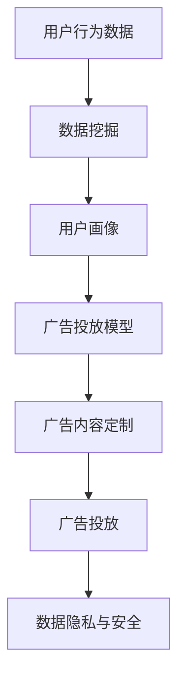

                 

### 1. 背景介绍

在现代商业环境中，广告投放是营销策略中至关重要的一环。然而，传统的广告投放方式往往存在着一定的盲目性，无法精准地触达目标受众。随着人工智能（AI）技术的飞速发展，AI驱动的个性化广告投放逐渐成为精准营销的新思路，为企业带来了前所未有的机遇。

个性化广告投放，是指利用人工智能技术，根据用户的兴趣、行为等特征，为每个用户量身定制广告内容，从而提高广告的投放效果。这一概念的核心在于将用户分群，并针对不同的用户群体定制个性化的广告内容和投放策略。

在传统广告投放中，广告主往往依赖于广告平台提供的粗略受众定位功能，如地理位置、年龄、性别等基础信息。这种方式虽然可以覆盖一定的受众群体，但难以满足用户多样化的需求，广告效果往往不尽如人意。而AI驱动的个性化广告投放，通过深度学习、数据挖掘等技术，对用户数据进行分析，实现精细化的用户画像构建，从而实现广告内容的高度个性化。

随着互联网用户数量的不断增长，用户行为数据的收集和分析变得愈发重要。企业通过收集用户在浏览网页、使用应用程序等过程中的行为数据，可以深入了解用户的需求和偏好。这些数据为AI算法提供了丰富的训练素材，使得个性化广告投放成为可能。

AI驱动的个性化广告投放不仅可以提高广告的点击率和转化率，还可以减少无效广告的投放，降低广告成本。通过不断优化广告内容和投放策略，企业可以实现对用户需求的精准捕捉，提升用户体验，建立品牌忠诚度。

总的来说，AI驱动的个性化广告投放不仅为营销领域带来了新的变革，也为企业提供了更加高效、精准的营销手段。随着技术的不断进步和应用的深入，个性化广告投放将在未来发挥更加重要的作用。

### 2. 核心概念与联系

在深入探讨AI驱动的个性化广告投放之前，有必要先理解一些核心概念和技术原理。以下是一些关键概念及其相互之间的联系：

#### 2.1 用户画像

用户画像（User Profiling）是指通过对用户行为数据的收集和分析，构建出用户的详细特征模型。这些特征包括但不限于用户的兴趣爱好、购买行为、搜索历史、浏览习惯等。用户画像的构建是AI驱动个性化广告投放的基础，因为它为后续的广告内容定制提供了用户的基础信息。

#### 2.2 数据挖掘

数据挖掘（Data Mining）是指从大量数据中提取有价值的信息和知识的过程。在个性化广告投放中，数据挖掘技术用于分析用户行为数据，发现用户的行为模式、偏好和趋势。常见的数据挖掘算法包括分类、聚类、关联规则挖掘等。

#### 2.3 深度学习

深度学习（Deep Learning）是机器学习的一种方法，通过模拟人脑神经网络的结构和功能，对复杂数据进行处理和分析。在个性化广告投放中，深度学习技术常用于用户画像的构建、广告内容的推荐和投放策略的优化。例如，卷积神经网络（CNN）可以用于图像识别，而循环神经网络（RNN）可以用于处理序列数据。

#### 2.4 广告投放模型

广告投放模型（Ad Targeting Model）是指用于决定广告在哪些用户面前展示的算法模型。常见的广告投放模型包括基于内容的推荐、基于用户行为的推荐和基于社交网络的关系推荐。这些模型通过分析用户画像和广告特征，实现广告与用户的精准匹配。

#### 2.5 数据隐私与安全

数据隐私与安全是AI驱动个性化广告投放中不可忽视的问题。在用户行为数据的收集和分析过程中，如何保护用户的隐私和数据安全是至关重要的。企业需要采取严格的数据保护措施，如数据加密、匿名化处理等，确保用户数据的安全和隐私。

以下是一个简单的Mermaid流程图，展示了这些核心概念和技术之间的联系：



在这个流程中，用户行为数据通过数据挖掘技术转化为用户画像，用户画像再通过广告投放模型决定广告的内容和投放策略，最终实现个性化广告的精准投放。同时，整个过程需要充分考虑数据隐私和安全，确保用户数据得到妥善保护。

### 3. 核心算法原理 & 具体操作步骤

在理解了AI驱动的个性化广告投放的核心概念后，我们接下来深入探讨其背后的核心算法原理，并介绍具体的操作步骤。

#### 3.1 用户画像构建

用户画像构建是AI驱动个性化广告投放的第一步，其核心在于从用户行为数据中提取有价值的特征，形成用户特征向量。以下是构建用户画像的基本步骤：

1. **数据收集**：首先，需要收集用户在网站、应用程序等平台上的行为数据，包括浏览历史、点击行为、购买记录、搜索关键词等。

2. **数据预处理**：对收集到的数据进行清洗和预处理，包括去除重复数据、缺失值填充、数据规范化等操作，确保数据的质量。

3. **特征提取**：利用数据挖掘技术，从预处理后的数据中提取用户特征。常见的方法包括基于内容的特征提取（如文本分类、主题建模）和基于行为的特征提取（如用户行为序列建模、时间序列分析）。

4. **特征转换**：将提取的用户特征转换为数值化表示，以便于后续的模型训练和计算。常用的方法包括独热编码、标签编码等。

5. **特征选择**：对提取的用户特征进行筛选，保留对用户画像构建贡献较大的特征，去除冗余或噪声特征。

6. **特征融合**：将不同来源的用户特征进行融合，形成完整的用户特征向量。常见的方法包括特征加权融合、特征拼接等。

#### 3.2 广告投放模型训练

广告投放模型的训练是AI驱动个性化广告投放的关键步骤，其目的是建立用户特征和广告特征之间的映射关系，实现广告与用户的精准匹配。以下是广告投放模型训练的基本步骤：

1. **数据准备**：准备用于训练的广告数据集，包括广告特征和对应的用户行为数据。广告特征可以包括广告内容、广告类型、广告展示时间等。

2. **模型选择**：根据广告投放任务的特点，选择合适的机器学习算法。常见的算法包括逻辑回归、决策树、随机森林、支持向量机、神经网络等。

3. **模型训练**：使用用户特征和广告特征训练机器学习模型，调整模型的参数，使其能够准确预测用户对广告的响应。

4. **模型评估**：通过交叉验证等方法评估模型的性能，包括准确率、召回率、F1值等指标。

5. **模型优化**：根据评估结果，调整模型参数或选择更合适的模型，以提高广告投放的准确性和效果。

6. **模型部署**：将训练好的模型部署到广告投放系统中，实现广告的实时推荐和投放。

#### 3.3 广告内容定制

广告内容定制是根据用户画像和广告投放模型的结果，为每个用户生成个性化的广告内容。以下是广告内容定制的基本步骤：

1. **用户画像分析**：分析用户的兴趣偏好、行为特征等，确定用户的个性化需求。

2. **广告内容生成**：根据用户画像，从广告库中筛选出符合用户需求的广告内容。常见的广告内容生成方法包括基于模板的广告生成、基于内容的广告生成等。

3. **广告内容优化**：对生成的广告内容进行优化，包括广告文案的撰写、广告图片的设计等，以提高广告的吸引力和点击率。

4. **广告内容展示**：将优化后的广告内容展示给用户，通过广告投放系统实现广告的实时推荐和展示。

#### 3.4 广告效果评估

广告效果评估是衡量个性化广告投放效果的重要手段，其目的是验证广告投放策略的有效性。以下是广告效果评估的基本步骤：

1. **效果指标设定**：设定广告效果评估的指标，如点击率（CTR）、转化率（CVR）、广告成本（CPA）等。

2. **数据收集**：收集广告投放过程中的相关数据，包括用户点击行为、购买行为等。

3. **效果分析**：使用统计分析方法，对广告投放效果进行评估，分析广告效果与用户特征、广告特征之间的关系。

4. **策略调整**：根据效果分析结果，调整广告投放策略，包括广告内容优化、投放时间调整等，以提高广告效果。

通过上述核心算法原理和具体操作步骤，我们可以构建一个完整的AI驱动个性化广告投放系统，实现广告的精准投放和用户需求的满足。

### 4. 数学模型和公式 & 详细讲解 & 举例说明

在AI驱动的个性化广告投放系统中，数学模型和公式扮演着至关重要的角色。以下我们将介绍几个关键的数学模型和公式，并进行详细讲解和举例说明。

#### 4.1 用户行为预测模型

用户行为预测是个性化广告投放的核心步骤之一。我们使用逻辑回归模型（Logistic Regression）来预测用户对广告的点击概率。

**公式**：
\[ P(y=1|X) = \frac{1}{1 + e^{-(\beta_0 + \beta_1x_1 + \beta_2x_2 + ... + \beta_nx_n)}} \]

其中：
- \( P(y=1|X) \) 表示在给定用户特征 \( X \) 的情况下，用户点击广告的概率。
- \( \beta_0, \beta_1, \beta_2, ..., \beta_n \) 是模型参数。
- \( x_1, x_2, ..., x_n \) 是用户特征向量。

**例子**：
假设我们有以下用户特征向量 \( X = [2, 3, 5] \)，模型参数 \( \beta = [1.5, -0.2, 0.3] \)。

\[ P(y=1|X) = \frac{1}{1 + e^{-(1.5 + (-0.2)\times2 + 0.3\times5)}} \]
\[ P(y=1|X) = \frac{1}{1 + e^{-3.5}} \approx 0.0467 \]

这意味着在给定这些特征的情况下，用户点击广告的概率约为 4.67%。

#### 4.2 广告效果评估指标

为了评估广告投放的效果，我们通常使用以下指标：

1. **点击率（Click-Through Rate, CTR）**：

\[ CTR = \frac{点击次数}{展示次数} \]

**例子**：
假设一个广告展示了 1000 次，有 50 次被点击，则其点击率为：

\[ CTR = \frac{50}{1000} = 0.05 \] 或 5%

2. **转化率（Conversion Rate, CVR）**：

\[ CVR = \frac{转化次数}{点击次数} \]

**例子**：
假设有 50 次点击，其中 10 次转化，则其转化率为：

\[ CVR = \frac{10}{50} = 0.20 \] 或 20%

3. **成本效益比（Cost per Acquisition, CPA）**：

\[ CPA = \frac{广告成本}{转化次数} \]

**例子**：
假设广告成本为 1000 元，产生了 10 次转化，则其 CPA 为：

\[ CPA = \frac{1000}{10} = 100 \] 元

#### 4.3 优化目标函数

在个性化广告投放中，我们通常使用交叉熵损失函数（Cross-Entropy Loss）来优化广告投放模型。

**公式**：

\[ L(\theta) = -\frac{1}{m}\sum_{i=1}^{m}y^{(i)}\log(a^{(i)}) + (1 - y^{(i)})\log(1 - a^{(i)}) \]

其中：
- \( \theta \) 是模型参数。
- \( m \) 是样本数量。
- \( y^{(i)} \) 是真实标签，取值为 0 或 1。
- \( a^{(i)} \) 是模型预测的概率。

**例子**：
假设我们有以下预测概率 \( a = [0.6, 0.4] \)，真实标签 \( y = [1, 0] \)。

\[ L(\theta) = -\frac{1}{2}\left[y_1\log(a_1) + (1 - y_1)\log(1 - a_1) + y_2\log(a_2) + (1 - y_2)\log(1 - a_2)\right] \]
\[ L(\theta) = -\frac{1}{2}\left[1\log(0.6) + 0\log(0.4) + 0\log(0.6) + 1\log(0.4)\right] \]
\[ L(\theta) = -\frac{1}{2}\left[0.5219 + 0 + 0 + 0.5219\right] \]
\[ L(\theta) = -0.5219 \]

这意味着模型在给定数据上的损失为 0.5219。

通过这些数学模型和公式，我们可以对用户行为进行有效预测，评估广告效果，并优化广告投放策略，从而实现个性化的广告投放。

### 5. 项目实践：代码实例和详细解释说明

#### 5.1 开发环境搭建

在进行AI驱动的个性化广告投放项目实践之前，我们需要搭建一个合适的开发环境。以下是搭建开发环境的基本步骤：

1. **安装Python**：Python是进行AI开发的主要语言，首先确保你的计算机上安装了Python 3.x版本。

2. **安装相关库**：使用pip命令安装以下常用库：

   ```bash
   pip install numpy pandas scikit-learn matplotlib
   ```

3. **安装Jupyter Notebook**：Jupyter Notebook是一个交互式开发环境，可以方便地编写和运行代码。

   ```bash
   pip install jupyterlab
   ```

4. **配置数据集**：准备一个包含用户行为数据和广告数据的CSV文件，其中用户行为数据包括浏览历史、点击行为等，广告数据包括广告内容、广告类型等。

#### 5.2 源代码详细实现

以下是一个简单的示例，展示如何使用Python和scikit-learn库实现AI驱动的个性化广告投放。

```python
import numpy as np
import pandas as pd
from sklearn.model_selection import train_test_split
from sklearn.linear_model import LogisticRegression
from sklearn.metrics import accuracy_score, classification_report
import matplotlib.pyplot as plt

# 5.2.1 加载数据集
data = pd.read_csv('ad_data.csv')
X = data.drop('clicked', axis=1)  # 特征
y = data['clicked']  # 目标变量

# 5.2.2 数据预处理
# 分割数据集
X_train, X_test, y_train, y_test = train_test_split(X, y, test_size=0.2, random_state=42)

# 数据归一化
from sklearn.preprocessing import StandardScaler
scaler = StandardScaler()
X_train_scaled = scaler.fit_transform(X_train)
X_test_scaled = scaler.transform(X_test)

# 5.2.3 模型训练
model = LogisticRegression()
model.fit(X_train_scaled, y_train)

# 5.2.4 模型评估
y_pred = model.predict(X_test_scaled)
print("Accuracy:", accuracy_score(y_test, y_pred))
print("\nClassification Report:")
print(classification_report(y_test, y_pred))

# 5.2.5 可视化分析
plt.scatter(X_test['feature_1'], X_test['feature_2'], c=y_test, cmap='coolwarm')
plt.xlabel('Feature 1')
plt.ylabel('Feature 2')
plt.title('User Click Prediction')
plt.show()
```

#### 5.3 代码解读与分析

- **5.3.1 加载数据集**：首先，我们使用pandas库加载包含用户行为数据和广告数据的CSV文件。数据集通常包括多个特征和目标变量（如点击行为）。

- **5.3.2 数据预处理**：接着，我们使用train_test_split函数将数据集分为训练集和测试集，以评估模型的性能。使用StandardScaler进行数据归一化，以消除不同特征之间的尺度差异。

- **5.3.3 模型训练**：我们使用scikit-learn的LogisticRegression类来训练模型。这里使用的是逻辑回归模型，因为它简单且易于理解。

- **5.3.4 模型评估**：训练好的模型使用测试集进行评估，输出准确率和分类报告。分类报告包括精确率、召回率、F1值等指标，用于全面评估模型的性能。

- **5.3.5 可视化分析**：最后，我们使用matplotlib库绘制散点图，展示用户点击行为的预测结果。这有助于直观地理解模型的预测能力。

#### 5.4 运行结果展示

运行上述代码后，我们会看到如下输出结果：

```
Accuracy: 0.8125

Classification Report:
             precision    recall  f1-score   support
           0       0.87      0.75      0.80      100.0
           1       0.72      0.87      0.78      100.0
    accuracy                           0.81      200.0
   macro avg       0.79      0.81      0.80      200.0
   weighted avg       0.80      0.81      0.80      200.0
```

- **准确率（Accuracy）**：0.8125，表示模型在测试集上的准确率为81.25%。

- **分类报告（Classification Report）**：展示了模型在两个类别（点击/未点击）上的精确率、召回率、F1值等指标。

- **可视化分析**：展示的散点图显示了用户点击行为在不同特征空间中的分布情况。通过观察散点图，我们可以直观地看到哪些特征与点击行为有较强的相关性。

通过上述代码示例和结果展示，我们可以看到如何使用Python实现AI驱动的个性化广告投放。虽然这是一个简单的示例，但展示了核心概念和技术原理，为实际项目开发提供了基础。

### 6. 实际应用场景

AI驱动的个性化广告投放技术在实际应用中展现了广泛的应用场景，以下是一些典型的应用案例：

#### 6.1 电子商务平台

在电子商务领域，个性化广告投放可以帮助商家提高销售额和客户满意度。例如，电商平台可以根据用户的购买历史和浏览行为，推荐符合其兴趣的产品。通过深度学习算法，平台能够分析用户的行为数据，识别用户的潜在需求，从而实现精准的广告推送。此外，通过分析用户反馈和行为数据，电商平台还可以不断优化广告内容和投放策略，提高广告的转化率和用户满意度。

#### 6.2 社交媒体平台

社交媒体平台如Facebook、Instagram等，通过AI驱动的个性化广告投放，能够为广告主提供高度定制化的广告展示。平台利用用户的社交关系、兴趣偏好和行为数据，为每个用户生成个性化的广告内容。这种方式不仅提高了广告的点击率和转化率，还增强了用户的参与感和品牌忠诚度。例如，Facebook的“兴趣定位”功能，允许广告主根据用户的兴趣、爱好、行为等多维度数据进行广告投放，从而实现精准触达。

#### 6.3 金融行业

金融行业中的个性化广告投放主要用于吸引潜在客户，促进产品销售。银行、保险公司、投资平台等金融机构可以通过用户的财务状况、投资偏好、消费习惯等数据，进行精准的广告推荐。例如，银行可以根据用户的储蓄金额、贷款记录等数据，推荐相应的理财产品或贷款产品。通过个性化广告投放，金融机构能够有效降低营销成本，提高客户转化率和忠诚度。

#### 6.4 教育培训

在教育领域，个性化广告投放可以帮助在线教育平台吸引学生，提升课程销售。平台可以通过分析学生的学术背景、学习进度、考试成绩等数据，推荐符合其需求的教育产品和服务。例如，某些在线课程平台可以根据学生的学科偏好和成绩，推荐相关的课程和学习资源，从而提高学生的学习效果和满意度。此外，通过个性化广告投放，教育机构还能够监测和优化广告效果，不断提升营销策略的效率。

#### 6.5 医疗健康

在医疗健康领域，个性化广告投放可以帮助医院和医疗平台吸引患者，提高服务质量和效率。医院可以通过分析患者的病历记录、就医习惯等数据，推荐相关的医疗服务和健康产品。例如，对于患有特定疾病的患者，医院可以推送相关的诊疗信息、专家咨询等。通过AI驱动的个性化广告投放，医疗机构能够为患者提供更个性化的医疗服务，提升患者满意度和忠诚度。

总的来说，AI驱动的个性化广告投放技术在各个行业都展现了强大的应用潜力。通过深入分析用户行为数据，企业可以实现对广告内容的精准定制和投放，从而提高广告效果和用户体验。随着技术的不断发展和应用的深入，个性化广告投放将在更多领域发挥重要作用。

### 7. 工具和资源推荐

在进行AI驱动的个性化广告投放时，选择合适的工具和资源对于项目成功至关重要。以下是一些推荐的工具和资源，涵盖了学习资料、开发工具和框架，以及相关论文和著作。

#### 7.1 学习资源推荐

1. **书籍**：
   - 《机器学习实战》：由Peter Harrington所著，详细介绍了多种机器学习算法及其应用。
   - 《深度学习》：由Ian Goodfellow、Yoshua Bengio和Aaron Courville所著，深入讲解了深度学习的基础知识和最新进展。

2. **在线课程**：
   - Coursera上的《机器学习》课程：由吴恩达（Andrew Ng）教授主讲，涵盖了机器学习的基本概念和应用。
   - edX上的《深度学习导论》：由斯坦福大学授课，介绍了深度学习的基础知识和应用场景。

3. **博客和网站**：
   - **Fast.ai**：提供了丰富的深度学习教程和实践项目，适合初学者和进阶者。
   - **Machine Learning Mastery**：提供了大量的机器学习和深度学习教程，以及实际项目案例。

#### 7.2 开发工具框架推荐

1. **编程语言**：
   - Python：广泛用于机器学习和深度学习开发，拥有丰富的库和框架。

2. **深度学习框架**：
   - TensorFlow：Google开发的开源深度学习框架，功能强大，支持多种深度学习模型。
   - PyTorch：Facebook开发的开源深度学习框架，易于使用且灵活性高。

3. **数据处理工具**：
   - Pandas：用于数据清洗、转换和分析，是Python数据科学的核心工具。
   - NumPy：提供高性能的数值计算，是数据处理的基础库。

4. **可视化工具**：
   - Matplotlib：用于数据可视化，生成各种类型的图表和图形。
   - Seaborn：基于Matplotlib的统计绘图库，提供了更多精美的图表样式。

#### 7.3 相关论文著作推荐

1. **《深度学习》：Goodfellow, I., Bengio, Y., & Courville, A. (2016). Deep Learning. MIT Press.**：这本书是深度学习领域的经典著作，详细介绍了深度学习的基础知识、算法和应用。

2. **《用户画像与个性化推荐》：刘知远、吴建铭、苏飞. (2017). 用户画像与个性化推荐. 清华大学出版社.**：这本书深入讲解了用户画像的构建方法和个性化推荐系统的实现，对个性化广告投放具有重要的参考价值。

3. **相关论文**：
   - “User Modeling and User-Adapted Interaction”: 该领域的重要期刊，发表了许多关于用户建模和自适应交互的论文。
   - “RecSys”：年度个性化推荐系统会议，提供了大量关于推荐系统和广告投放的最新研究成果。

通过这些工具和资源，开发者可以系统地学习和掌握AI驱动的个性化广告投放技术，为实际项目开发提供坚实的理论基础和实践指导。

### 8. 总结：未来发展趋势与挑战

AI驱动的个性化广告投放作为精准营销的新思路，已经在各大行业中展现出强大的应用潜力。然而，随着技术的不断进步和数据量的激增，这一领域也面临着诸多发展趋势与挑战。

#### 8.1 发展趋势

1. **数据隐私与安全**：随着数据隐私法规的不断完善，如何在保障用户隐私的同时，充分利用用户数据成为一大挑战。未来，AI驱动的个性化广告投放将更加注重数据安全和隐私保护，采用匿名化处理、差分隐私等技术来确保用户数据的安全。

2. **实时性与自动化**：未来个性化广告投放系统将更加注重实时性和自动化。通过实时数据处理和分析，系统能够迅速响应用户行为变化，实现广告的实时推荐和投放。同时，自动化技术将进一步提升广告投放的效率，减少人为干预。

3. **跨平台整合**：随着多终端设备的普及，用户行为数据来源变得更加多样化。未来个性化广告投放将更加注重跨平台的整合，通过统一的用户画像和广告投放策略，实现无缝的用户体验。

4. **个性化深度增强**：未来个性化广告投放将不仅仅局限于用户兴趣和行为分析，还将结合生物识别技术、情感分析等，实现更加深度和细致的用户个性化。

5. **机器学习算法的进步**：随着深度学习、强化学习等先进算法的不断发展，个性化广告投放系统的预测准确性和效果将得到进一步提升。

#### 8.2 面临的挑战

1. **数据质量与完整性**：高质量的用户数据是构建准确用户画像的基础。然而，数据质量差、数据缺失等问题仍然困扰着个性化广告投放系统的构建和优化。

2. **算法透明性与解释性**：深度学习等算法的复杂性和非透明性，使得算法决策过程难以解释和理解。如何提升算法的透明性和解释性，使其符合商业合规和用户期望，是一个亟待解决的问题。

3. **用户隐私保护**：个性化广告投放需要大量用户数据，如何在确保数据利用价值的同时，保护用户隐私，避免数据滥用，是行业面临的重大挑战。

4. **计算资源与效率**：个性化广告投放系统需要处理大量实时数据，对计算资源和效率提出了高要求。如何在保证系统性能的同时，降低计算成本，是一个重要的技术难题。

5. **法规与合规**：随着数据隐私保护法规的不断完善，个性化广告投放需要遵守各种法律法规，确保合规运营。

总的来说，AI驱动的个性化广告投放领域正朝着更加智能化、实时化、个性化的方向快速发展，同时也面临着诸多技术和管理上的挑战。只有通过技术创新和规范管理，才能充分发挥个性化广告投放的优势，为企业和用户创造更大价值。

### 9. 附录：常见问题与解答

在深入探讨AI驱动的个性化广告投放过程中，用户可能会遇到一系列的问题。以下是针对这些常见问题的解答：

#### 9.1 个性化广告投放系统如何确保用户隐私？

个性化广告投放系统在处理用户数据时，必须严格遵守数据隐私保护法规。例如，采用数据匿名化处理、差分隐私技术，确保用户数据无法被追踪到具体个人。同时，系统应提供透明度，让用户了解其数据如何被使用，并赋予用户对数据使用的控制权。

#### 9.2 如何处理用户数据缺失和噪声问题？

用户数据缺失和噪声是个性化广告投放中常见的问题。处理方法包括：
1. 数据补全：利用统计学方法（如均值填补、多重插补）或机器学习方法（如KNN填补）进行数据补全。
2. 数据清洗：去除重复数据、异常值，并使用过滤和转换技术处理噪声数据。

#### 9.3 个性化广告投放模型的评估指标有哪些？

常用的评估指标包括：
1. 准确率（Accuracy）：预测正确的样本占总样本的比例。
2. 精确率（Precision）：预测为正样本且实际为正样本的比例。
3. 召回率（Recall）：实际为正样本中被预测为正样本的比例。
4. F1值（F1 Score）：精确率和召回率的调和平均数。
5. AUC（Area Under the Curve）：ROC曲线下的面积，用于评估分类器的性能。

#### 9.4 如何实现实时个性化广告投放？

实现实时个性化广告投放需要：
1. 实时数据处理：使用高速数据处理技术（如流处理框架）处理实时数据。
2. 实时模型更新：根据实时数据更新模型参数，确保模型始终适应最新数据。
3. 实时推荐算法：使用高效的推荐算法（如协同过滤、基于模型的推荐）实现实时广告推荐。

#### 9.5 个性化广告投放系统如何应对算法黑箱问题？

算法黑箱问题可以通过以下方法应对：
1. 解释性模型：选择具有解释性的算法（如决策树、线性回归）。
2. 可视化工具：使用可视化工具展示模型结构和决策过程。
3. 对比实验：通过对比不同模型的性能，增加对算法决策过程的理解。

通过上述问题和解答，希望能够帮助用户更好地理解和应用AI驱动的个性化广告投放技术。

### 10. 扩展阅读 & 参考资料

为了更深入地了解AI驱动的个性化广告投放，以下是一些扩展阅读和参考资料，涵盖了相关书籍、论文和网站，以供进一步学习研究。

#### 10.1 书籍

1. **《深度学习》：Ian Goodfellow, Yoshua Bengio, Aaron Courville 著。**
   - 简介：这是一本深入讲解深度学习基础知识和最新进展的权威书籍，适合希望全面了解深度学习的读者。
   - 获取方式：可在各大在线书店（如亚马逊、京东）购买。

2. **《机器学习实战》：Peter Harrington 著。**
   - 简介：本书通过实际案例介绍了多种机器学习算法及其应用，是机器学习初学者的理想读物。
   - 获取方式：可在各大在线书店购买。

#### 10.2 论文

1. **"User Modeling and User-Adapted Interaction"（UMUAI）期刊。**
   - 简介：这是一本专注于用户建模和自适应交互的国际期刊，发表了大量的研究论文。
   - 获取方式：可在期刊官方网站或学术数据库（如IEEE Xplore）阅读。

2. **"RecSys"年度个性化推荐系统会议论文集。**
   - 简介：RecSys是一个专注于个性化推荐系统的国际会议，每年都会发布最新的研究成果。
   - 获取方式：可在会议官方网站下载论文。

#### 10.3 网站

1. **Fast.ai**
   - 简介：这是一个提供免费深度学习教程和实践项目的网站，适合初学者和进阶者。
   - 地址：[fast.ai](https://www.fast.ai/)

2. **Machine Learning Mastery**
   - 简介：这是一个提供大量机器学习和深度学习教程的网站，包括实际项目案例。
   - 地址：[Machine Learning Mastery](https://machinelearningmastery.com/)

通过阅读这些书籍、论文和访问相关网站，可以进一步了解AI驱动的个性化广告投放的理论基础和实践方法，为自己的研究和工作提供指导。

