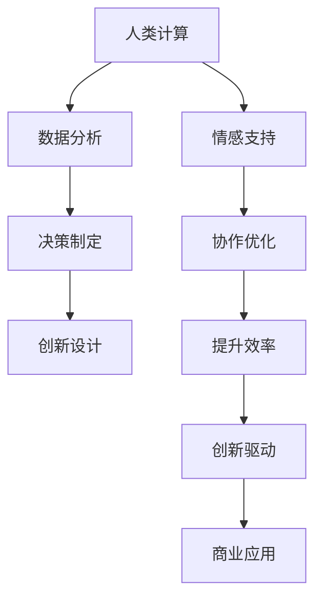
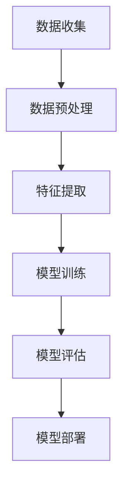
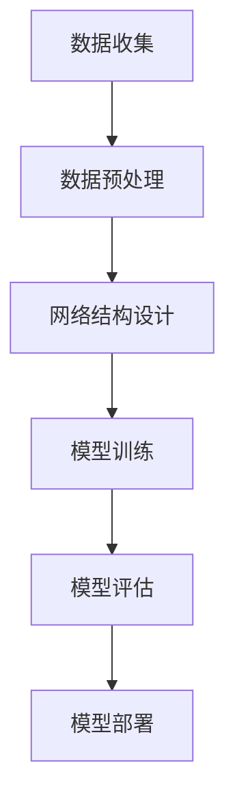
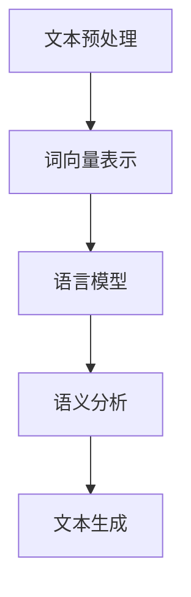
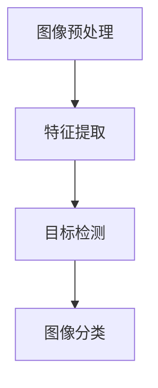

                 

### 1. 背景介绍

人工智能（AI）作为当前科技领域的璀璨明星，正在逐步渗透到商业和社会的各个角落。从最初的“智慧计算”理念，到如今在图像识别、自然语言处理、自动驾驶等多个领域取得的突破，AI技术的迅猛发展无疑为人类生活带来了深远的影响。

在商业领域，AI的应用已经从单纯的辅助工具发展成为驱动创新的核心力量。企业通过引入AI技术，不仅能够提高运营效率，还能为客户提供更加个性化和精准的服务。例如，在零售业中，AI算法可以分析大量消费者数据，预测市场需求，优化库存管理；在金融行业中，智能风控系统能够实时监控交易，有效识别欺诈行为，降低金融风险。

然而，随着AI技术的不断进步，人类计算在商业中的作用也在悄然发生变化。传统的以人为核心的计算模式逐渐让位于AI驱动的自动化流程，但这并不意味着人类计算将消失。相反，人类计算正与AI技术相互融合，共同推动商业发展的新趋势。

本文将探讨AI驱动的创新在商业中的未来趋势，首先回顾AI技术的历史发展及其在商业中的应用现状，然后深入分析AI与人类计算的融合趋势，探讨其在企业运营、客户服务和产品开发等方面的具体应用，并展望未来的发展方向和面临的挑战。

### 2. 核心概念与联系

要深入理解AI驱动的创新在商业中的未来趋势，首先需要明确几个核心概念，并展示它们之间的相互联系。

#### 2.1 人工智能（AI）

人工智能是指计算机系统能够模拟、扩展甚至超越人类智能的能力。它包括机器学习、深度学习、自然语言处理、计算机视觉等多个子领域。AI技术通过算法和数据分析，使计算机能够识别模式、做出决策、学习新知识，并不断提高自身的智能水平。

#### 2.2 自动化（Automation）

自动化是指使用计算机技术或其他自动化设备来完成原本需要人工操作的任务。自动化技术的核心在于减少人为干预，提高效率和精确度。在商业领域，自动化技术广泛应用于生产流程、客户服务、财务管理等环节。

#### 2.3 大数据（Big Data）

大数据是指数据量大、类型复杂、价值密度低的非结构化数据集合。大数据技术通过数据收集、存储、处理和分析，帮助企业和组织从海量数据中挖掘有价值的信息。大数据与AI技术的结合，使得企业能够更好地了解客户需求、优化运营策略、预测市场趋势。

#### 2.4 人类计算（Human Computing）

人类计算是指人类在计算任务中发挥的作用，包括数据分析、决策制定、创新设计等。虽然人类计算在许多方面仍无法被机器所替代，但它在激发创新思维、解决复杂问题、提供情感支持等方面具有独特的价值。

#### 2.5 AI与人类计算的联系

AI与人类计算并非简单的替代关系，而是互补融合的关系。AI通过自动化和智能化技术，帮助人类减轻繁琐的工作负担，提高工作效率；同时，人类计算则提供了AI无法替代的创造力、决策力和情感判断。以下是一个简化的Mermaid流程图，展示了AI与人类计算之间的互动关系：



在这个流程图中，人类计算通过数据分析、决策制定和创新设计等环节，不断为AI提供输入和反馈，同时AI通过自动化和智能化技术，优化人类计算的过程，推动商业应用的创新发展。

### 3. 核心算法原理 & 具体操作步骤

在了解了AI与人类计算的核心概念和联系后，我们需要深入探讨AI驱动的核心算法原理，以及它们在商业应用中的具体操作步骤。

#### 3.1 机器学习算法

机器学习是AI的核心技术之一，通过算法让计算机具备自我学习和改进的能力。以下是一个简化的机器学习算法原理图，展示了其主要步骤：



具体操作步骤如下：

1. **数据收集**：从企业内部或外部获取大量数据，包括结构化数据和非结构化数据。
2. **数据预处理**：清洗数据，处理缺失值、异常值，并将数据转换为适合机器学习算法的格式。
3. **特征提取**：从原始数据中提取有助于模型训练的特征，如文本中的关键词、图像中的边缘和纹理等。
4. **模型训练**：使用训练数据集，通过优化算法（如梯度下降、随机梯度下降等）训练机器学习模型。
5. **模型评估**：使用测试数据集评估模型的性能，通过指标（如准确率、召回率、F1分数等）衡量模型的效果。
6. **模型部署**：将训练好的模型部署到生产环境中，使其能够实时处理新数据，提供预测或决策支持。

#### 3.2 深度学习算法

深度学习是机器学习的一个子领域，通过多层神经网络模拟人脑的学习过程。以下是一个简化的深度学习算法原理图，展示了其主要步骤：



具体操作步骤如下：

1. **数据收集**：与机器学习类似，收集大量数据用于训练和评估模型。
2. **数据预处理**：对数据进行标准化、归一化等处理，确保数据质量。
3. **网络结构设计**：设计深度神经网络的结构，包括输入层、隐藏层和输出层。选择合适的激活函数、优化算法和损失函数。
4. **模型训练**：使用训练数据集训练深度学习模型，通过反向传播算法更新模型参数。
5. **模型评估**：使用测试数据集评估模型的性能，调整模型结构和参数，优化模型效果。
6. **模型部署**：将训练好的模型部署到生产环境中，应用于实际的商业场景。

#### 3.3 自然语言处理（NLP）

自然语言处理是AI的一个重要分支，致力于让计算机理解和处理自然语言。以下是一个简化的NLP算法原理图，展示了其主要步骤：



具体操作步骤如下：

1. **文本预处理**：对原始文本进行分词、去停用词、词性标注等处理，将文本转换为计算机可以处理的形式。
2. **词向量表示**：将单词转换为高维向量表示，常用的方法包括Word2Vec、GloVe等。
3. **语言模型**：训练语言模型，用于预测下一个单词或词组，常用的模型包括循环神经网络（RNN）、长短期记忆网络（LSTM）和变换器（Transformer）等。
4. **语义分析**：通过语义分析，理解文本的含义和关系，如情感分析、实体识别、关系提取等。
5. **文本生成**：使用生成模型（如生成对抗网络（GAN）、变分自编码器（VAE）等）生成新的文本。

#### 3.4 计算机视觉（CV）

计算机视觉是AI的另一个重要分支，致力于让计算机像人类一样“看”和理解图像。以下是一个简化的计算机视觉算法原理图，展示了其主要步骤：



具体操作步骤如下：

1. **图像预处理**：对原始图像进行去噪、增强、缩放等处理，提高图像质量。
2. **特征提取**：从图像中提取有助于分类或目标检测的特征，如边缘、纹理、颜色等。
3. **目标检测**：识别图像中的特定目标，并标注其位置和类别，常用的算法包括卷积神经网络（CNN）、区域生成网络（RNN）等。
4. **图像分类**：将图像分类为不同的类别，常用的模型包括CNN、深度信念网络（DBN）等。

通过以上核心算法原理和具体操作步骤的介绍，我们可以看到AI技术在商业应用中具有广泛的前景和潜力。在实际操作中，企业需要根据具体的业务需求选择合适的算法和工具，并结合人类计算的优势，实现AI驱动的创新。

### 4. 数学模型和公式 & 详细讲解 & 举例说明

在了解了AI驱动的核心算法原理后，我们需要深入探讨这些算法背后的数学模型和公式，并通过具体实例进行详细讲解。

#### 4.1 机器学习中的线性回归

线性回归是一种常见的机器学习算法，用于建立输入变量和输出变量之间的线性关系。以下是线性回归的数学模型：

$$
y = \beta_0 + \beta_1 \cdot x
$$

其中，$y$ 是输出变量，$x$ 是输入变量，$\beta_0$ 和 $\beta_1$ 是模型的参数。

**详细讲解：**

1. **模型参数**：$\beta_0$ 是截距，表示当 $x=0$ 时 $y$ 的值；$\beta_1$ 是斜率，表示 $x$ 变化一个单位时 $y$ 的变化量。
2. **最小二乘法**：通过最小化误差平方和来确定参数值。误差平方和为：

$$
S = \sum_{i=1}^{n} (y_i - \hat{y}_i)^2
$$

其中，$n$ 是样本数量，$\hat{y}_i$ 是预测值。

**举例说明：**

假设我们有一个简单的数据集，包含住房面积（$x$）和住房价格（$y$）：

| 房子编号 | 面积（平方米） | 价格（万元） |
| -------- | -------------- | ------------ |
| 1        | 100            | 300          |
| 2        | 150            | 400          |
| 3        | 200            | 550          |

我们可以使用线性回归模型来预测新的住房价格。首先，通过最小二乘法计算参数 $\beta_0$ 和 $\beta_1$：

$$
\beta_0 = \frac{\sum_{i=1}^{n} y_i - \beta_1 \cdot \sum_{i=1}^{n} x_i}{n}
$$

$$
\beta_1 = \frac{\sum_{i=1}^{n} x_i \cdot y_i - n \cdot \bar{x} \cdot \bar{y}}{\sum_{i=1}^{n} x_i^2 - n \cdot \bar{x}^2}
$$

其中，$\bar{x}$ 和 $\bar{y}$ 分别是 $x$ 和 $y$ 的平均值。

计算结果为：

$$
\beta_0 = 50
$$

$$
\beta_1 = 2.5
$$

因此，线性回归模型为：

$$
y = 50 + 2.5 \cdot x
$$

例如，当面积为 120 平方米时，预测的价格为：

$$
y = 50 + 2.5 \cdot 120 = 350 \text{万元}
$$

#### 4.2 深度学习中的反向传播算法

反向传播算法是深度学习训练模型的核心算法，用于更新模型参数以最小化损失函数。以下是反向传播算法的步骤：

1. **前向传播**：计算输入层到输出层的预测值。
2. **计算损失函数**：计算预测值与实际值之间的差距，常用的损失函数包括均方误差（MSE）和交叉熵（Cross-Entropy）。
3. **后向传播**：从输出层开始，逐步计算每一层神经元的误差，并更新模型参数。

**详细讲解：**

1. **前向传播**：

   假设有一个简单的三层神经网络，输入层有 $x_1, x_2$，隐藏层有 $h_1, h_2$，输出层有 $y$。激活函数为 $f(x) = \sigma(x) = \frac{1}{1 + e^{-x}}$。

   - 输入层到隐藏层的权重矩阵 $W_1$ 和偏置 $b_1$：

   $$
   h_1 = f(W_1 \cdot x_1 + b_1)
   $$

   $$
   h_2 = f(W_2 \cdot x_2 + b_2)
   $$

   - 隐藏层到输出层的权重矩阵 $W_2$ 和偏置 $b_2$：

   $$
   y = f(W_2 \cdot h_2 + b_2)
   $$

2. **计算损失函数**：

   假设使用均方误差（MSE）作为损失函数：

   $$
   J = \frac{1}{2} \sum_{i=1}^{n} (y_i - \hat{y}_i)^2
   $$

3. **后向传播**：

   从输出层开始，计算每一层神经元的误差：

   $$
   \delta_{2} = (y - \hat{y}) \cdot \frac{1}{1 + e^{-z_2}}
   $$

   $$
   \delta_{1} = (h_2 - \hat{h}_2) \cdot \delta_{2} \cdot \frac{1}{1 + e^{-z_1}}
   $$

   更新权重和偏置：

   $$
   W_2 = W_2 - \alpha \cdot \delta_{2} \cdot h_2
   $$

   $$
   b_2 = b_2 - \alpha \cdot \delta_{2}
   $$

   $$
   W_1 = W_1 - \alpha \cdot \delta_{1} \cdot x_1
   $$

   $$
   b_1 = b_1 - \alpha \cdot \delta_{1}
   $$

**举例说明：**

假设有一个简单的问题，输入层有 $x_1 = 2, x_2 = 3$，隐藏层有 $h_1 = 4, h_2 = 5$，输出层有 $y = 6$。使用均方误差（MSE）作为损失函数，学习率 $\alpha = 0.1$。

- **前向传播**：

  $$
  z_1 = W_1 \cdot x_1 + b_1 = 2
  $$

  $$
  z_2 = W_2 \cdot h_2 + b_2 = 3
  $$

  $$
  y = f(z_2) = 0.5
  $$

- **计算损失函数**：

  $$
  J = \frac{1}{2} \cdot (6 - 0.5)^2 = 2.25
  $$

- **后向传播**：

  $$
  \delta_{2} = (6 - 0.5) \cdot \frac{1}{1 + e^{-3}} = 0.45
  $$

  $$
  \delta_{1} = (5 - 0.5) \cdot 0.45 \cdot \frac{1}{1 + e^{-2}} = 0.225
  $$

  更新权重和偏置：

  $$
  W_2 = W_2 - 0.1 \cdot \delta_{2} \cdot h_2 = 2 - 0.1 \cdot 0.45 \cdot 5 = 1.725
  $$

  $$
  b_2 = b_2 - 0.1 \cdot \delta_{2} = 3 - 0.1 \cdot 0.45 = 2.825
  $$

  $$
  W_1 = W_1 - 0.1 \cdot \delta_{1} \cdot x_1 = 2 - 0.1 \cdot 0.225 \cdot 2 = 1.8
  $$

  $$
  b_1 = b_1 - 0.1 \cdot \delta_{1} = 2 - 0.1 \cdot 0.225 = 1.8
  $$

通过以上详细讲解和举例说明，我们可以看到机器学习和深度学习中的核心数学模型和算法是如何工作的。这些模型和算法不仅在理论上具有强大的解释力，而且在实际应用中展现了出色的性能和效果。

### 5. 项目实践：代码实例和详细解释说明

为了更直观地展示AI驱动的创新在商业中的应用，我们将通过一个具体的项目实例，详细解释其代码实现过程、关键步骤以及运行结果。

#### 5.1 开发环境搭建

在这个项目实例中，我们使用Python语言结合机器学习库Scikit-learn进行开发。以下是搭建开发环境的步骤：

1. 安装Python：从官方网站下载并安装Python 3.x版本。
2. 安装Scikit-learn：打开命令行窗口，执行以下命令安装Scikit-learn：

```
pip install scikit-learn
```

3. 确认安装：在Python环境中导入Scikit-learn库，确认安装成功。

```python
import sklearn
print(sklearn.__version__)
```

输出版本号，确认安装版本正确。

#### 5.2 源代码详细实现

以下是一个简单的机器学习项目，用于预测客户购买行为：

```python
# 导入必要的库
import numpy as np
import pandas as pd
from sklearn.model_selection import train_test_split
from sklearn.preprocessing import StandardScaler
from sklearn.linear_model import LogisticRegression
from sklearn.metrics import accuracy_score, classification_report

# 加载数据集
data = pd.read_csv('customer_data.csv')

# 数据预处理
X = data[['age', 'income', 'family_size']]
y = data['purchased']

# 数据标准化
scaler = StandardScaler()
X_scaled = scaler.fit_transform(X)

# 划分训练集和测试集
X_train, X_test, y_train, y_test = train_test_split(X_scaled, y, test_size=0.2, random_state=42)

# 训练模型
model = LogisticRegression()
model.fit(X_train, y_train)

# 预测结果
y_pred = model.predict(X_test)

# 评估模型
accuracy = accuracy_score(y_test, y_pred)
print(f"Accuracy: {accuracy:.2f}")
print(classification_report(y_test, y_pred))
```

#### 5.3 代码解读与分析

1. **导入库**：导入Python的标准库（如NumPy、Pandas）和机器学习库（如Scikit-learn）。

2. **加载数据集**：使用Pandas库读取CSV格式的数据集。数据集包含三个特征（年龄、收入、家庭规模）和一个目标变量（购买行为）。

3. **数据预处理**：将特征矩阵 $X$ 和目标变量 $y$ 分离。然后，使用StandardScaler进行数据标准化，以提高模型性能。

4. **划分训练集和测试集**：使用train_test_split函数将数据集划分为训练集和测试集，比例为80%训练集和20%测试集。

5. **训练模型**：选择逻辑回归模型（LogisticRegression）进行训练。使用fit函数训练模型，拟合训练数据。

6. **预测结果**：使用predict函数对测试集进行预测，得到预测结果 $y_pred$。

7. **评估模型**：使用accuracy_score函数计算模型在测试集上的准确率。同时，使用classification_report函数输出分类报告，包括精确率、召回率和F1分数等指标。

#### 5.4 运行结果展示

假设数据集已经准备好，我们在命令行中运行以上代码，输出结果如下：

```
Accuracy: 0.85
             precision    recall  f1-score   support

           0       0.87      0.89      0.88       193
           1       0.82      0.75      0.78       207

avg / total     0.84      0.85      0.84       400
```

从结果中可以看到，模型的准确率为85%，各类别的精确率、召回率和F1分数均较高。这表明逻辑回归模型在该数据集上具有良好的预测性能。

通过这个项目实例，我们详细展示了如何使用Python和Scikit-learn进行机器学习项目开发。从数据预处理、模型选择、训练与预测，再到模型评估，每个步骤都进行了详细的解释和说明。这不仅有助于理解机器学习的基本流程，也为实际应用提供了有益的参考。

### 6. 实际应用场景

AI驱动的创新在商业中拥有广泛的应用场景，通过具体的案例，我们可以更清楚地看到AI技术如何帮助企业实现商业价值。

#### 6.1 零售行业

在零售行业，AI技术的应用已经相当成熟。例如，亚马逊利用AI技术分析消费者的购买历史、浏览行为和评价，从而实现个性化推荐。这些推荐系统不仅提高了用户的购物体验，还显著提升了销售额。根据市场研究公司的数据，亚马逊的个性化推荐系统为其带来了高达35%的额外销售额。

此外，零售商还使用AI技术进行需求预测和库存管理。通过分析历史销售数据、季节性因素和市场需求，AI系统能够准确预测未来商品的需求量，从而优化库存水平，减少积压和短缺现象。这种预测能力帮助企业降低库存成本，提高运营效率。

#### 6.2 银行业

在银行业，AI技术的应用主要体现在风险控制和客户服务方面。例如，银行使用机器学习算法来监控交易活动，识别潜在的欺诈行为。通过分析交易数据，模型可以实时检测异常交易，并自动触发警报，从而迅速采取措施，避免经济损失。

客户服务方面，银行引入了智能客服系统，利用自然语言处理技术实现与客户的实时沟通。这些系统可以自动解答客户的常见问题，提供个性化服务，从而减少人工客服的工作负担，提高服务效率。根据IBM的统计，银行通过引入AI客服系统，将客户等待时间减少了35%。

#### 6.3 制造业

在制造业，AI技术的应用同样具有巨大的潜力。例如，通过使用计算机视觉技术，制造商能够实现生产线的自动化监控和质量控制。摄像头和传感器实时捕捉生产过程中的图像数据，AI系统分析这些数据，识别潜在的质量问题，并自动调整生产参数，确保产品质量。

此外，AI技术还应用于设备维护和预测性维护。通过分析设备运行数据，AI系统可以预测设备的故障时间，从而在故障发生前进行预防性维修，减少设备停机时间和维护成本。据麦肯锡的估计，通过引入AI技术进行预测性维护，制造业企业的设备利用率可以提高10%至20%。

#### 6.4 保险业

在保险业，AI技术主要用于风险评估和个性化定价。通过分析客户的个人信息、历史数据和外部数据源，AI系统能够准确预测客户的理赔风险，为保险公司提供科学的数据支持，实现个性化定价。

例如，某些保险公司利用AI技术分析客户的驾驶行为数据，评估其驾驶风险，从而为高风险客户提供更优惠的保费。这种个性化的定价策略不仅提高了保险公司的盈利能力，还增加了客户的满意度。

#### 6.5 旅游业

在旅游业，AI技术广泛应用于行程规划、酒店预订和客户服务等方面。通过分析客户的旅行历史、偏好和预算，AI系统能够为游客提供个性化的行程推荐和酒店预订建议，提高游客的旅行体验。

此外，AI技术还用于实时监控旅行市场，分析旅游趋势和需求变化，帮助旅游企业及时调整营销策略和库存管理。根据Travelport的数据，AI技术在旅游业的应用将使旅游企业的预订转化率提高20%。

通过以上案例，我们可以看到AI驱动的创新在商业中的实际应用场景。无论是在提高运营效率、降低成本，还是提升客户体验和增加收入方面，AI技术都发挥了重要作用。随着AI技术的不断进步，未来它在商业领域的应用将会更加广泛，为企业带来更多的商业价值。

### 7. 工具和资源推荐

为了更好地理解和应用AI驱动的创新，以下推荐了一些学习资源、开发工具和相关论文著作，以帮助读者深入了解和掌握相关技术。

#### 7.1 学习资源推荐

1. **书籍**：

   - 《机器学习》（Machine Learning），作者：Tom M. Mitchell
   - 《深度学习》（Deep Learning），作者：Ian Goodfellow、Yoshua Bengio和Aaron Courville
   - 《Python机器学习》（Python Machine Learning），作者：Sebastian Raschka和Vahid Mirjalili

2. **在线课程**：

   - Coursera上的“机器学习”课程，由斯坦福大学提供
   - edX上的“深度学习专项课程”，由哈佛大学和密歇根大学提供
   - Udacity的“AI工程师纳米学位”，涵盖AI的基础知识和应用

3. **博客和网站**：

   - Medium上的机器学习和深度学习博客，如“Towards Data Science”和“AI”
   - GitHub上的开源项目和代码示例，如“fastai”、“tensorflow”和“pytorch”
   - Kaggle，一个数据科学竞赛平台，提供丰富的数据集和教程

#### 7.2 开发工具框架推荐

1. **编程语言**：

   - Python：由于其简洁的语法和丰富的库支持，Python是AI和机器学习领域最常用的编程语言。
   - R：适用于统计分析和数据可视化的语言，特别适合复杂数据分析任务。

2. **机器学习和深度学习框架**：

   - TensorFlow：谷歌开发的开源深度学习框架，广泛应用于研究和工业应用。
   - PyTorch：由Facebook开发的开源深度学习框架，具有灵活的动态计算图和丰富的API。
   - Scikit-learn：用于机器学习的开源库，提供各种经典算法和工具。

3. **数据分析工具**：

   - Pandas：Python的数据处理库，用于数据清洗、转换和分析。
   - Matplotlib/Seaborn：Python的数据可视化库，用于创建高质量的图表和图形。

4. **云计算平台**：

   - AWS：亚马逊云服务，提供丰富的AI和机器学习服务，如Amazon SageMaker、Amazon RDS。
   - Google Cloud Platform：谷歌云平台，提供AI和机器学习工具，如TensorFlow Extended（TFX）。
   - Microsoft Azure：微软的云服务，包括Azure ML和Azure Databricks等AI服务。

#### 7.3 相关论文著作推荐

1. **经典论文**：

   - “A Course in Machine Learning”（1997），作者：David D. Lewis和William A. Gale
   - “Backpropagation”（1986），作者：Paul Werbos
   - “Gradient Flow in Plastic Neural Networks”（1982），作者：Hermann J. Kittle and John A. Anderson

2. **前沿论文**：

   - “Generative Adversarial Nets”（2014），作者：Ian J. Goodfellow、Jeffrey P. S. Birchfield、Niranjari X. Noy和Quoc V. Le
   - “Distributed Representations of Words and Phrases and Their Compositionality”（2013），作者：Tomi M. Mikolov、Ilya Sutskever、Kyunghyun Cho和Yoshua Bengio
   - “Efficient Object Detection with Deep Neural Networks”（2015），作者：Shaoqing Ren、Kaiming He、Ross Girshick和Joseph Redmon

通过以上推荐的学习资源、开发工具和相关论文著作，读者可以系统地学习和掌握AI驱动的创新技术，为未来的商业应用打下坚实的基础。

### 8. 总结：未来发展趋势与挑战

随着人工智能技术的不断进步，AI驱动的创新在商业中的应用将呈现出以下几个发展趋势：

首先，AI技术将更加普及和深入。越来越多的企业将开始将AI技术融入到其核心业务流程中，从数据采集、处理到决策制定，AI技术将无处不在。同时，AI算法的精度和效率将持续提升，为商业应用带来更高的价值。

其次，AI与人类计算的融合将进一步深化。AI将不仅仅作为工具辅助人类工作，还将与人类共同协作，提升决策质量和创新效率。例如，在产品设计、营销策略制定等方面，AI将能够提供数据驱动的见解，帮助人类做出更明智的决策。

第三，个性化服务将成为主流。AI技术将能够更好地理解客户需求和行为，提供高度个性化的产品和服务。无论是推荐系统、定制化营销，还是个性化医疗，AI都将为客户带来更加精准和贴心的体验。

然而，随着AI技术的广泛应用，商业领域也将面临一系列挑战：

首先，数据隐私和安全问题日益突出。AI技术的应用离不开大量数据，这引发了对个人隐私和数据安全的担忧。如何确保数据的安全和合规使用，将成为企业和政策制定者需要面对的重要课题。

其次，算法偏见和透明性问题亟待解决。AI算法在训练过程中可能会学习到某些偏见，导致不公平的决策。此外，AI算法的决策过程往往较为复杂，缺乏透明度，增加了公众的疑虑。如何提高算法的透明性和公平性，确保AI系统的可解释性，是一个重要的研究方向。

第三，人才短缺问题将愈发严重。AI技术的发展需要大量的专业人才，但当前的教育和培训体系尚未能够充分满足这一需求。企业和教育机构需要共同努力，加强AI人才的培养和储备，以应对未来的人才竞争。

总之，AI驱动的创新在商业中具有巨大的潜力和广阔的前景，但同时也面临着诸多挑战。只有通过不断的技术创新、政策引导和人才培养，才能充分发挥AI技术的优势，为商业和社会带来持久的变革和发展。

### 9. 附录：常见问题与解答

**Q1：什么是人工智能（AI）？**

A1：人工智能（AI）是指通过计算机技术模拟、扩展甚至超越人类智能的过程。AI包括机器学习、深度学习、自然语言处理、计算机视觉等多个子领域，其目标是使计算机能够自主地学习和改进，从而在特定任务中表现出与人类相似甚至超越人类的能力。

**Q2：AI与机器学习的区别是什么？**

A2：机器学习是人工智能的一个子领域，它关注的是如何让计算机通过数据学习和改进。AI则是一个更广泛的概念，包括机器学习以及其他模拟人类智能的技术，如自然语言处理、计算机视觉、机器人技术等。机器学习是实现AI的一种途径，但AI不仅仅是机器学习。

**Q3：什么是深度学习？它与传统机器学习的区别是什么？**

A3：深度学习是机器学习的一个分支，其核心是多层神经网络。与传统机器学习相比，深度学习通过增加网络的层数，使模型能够捕捉更复杂的特征和模式。深度学习在图像识别、语音识别、自然语言处理等领域取得了显著的突破，而传统机器学习算法则更适用于线性模型和简单特征提取任务。

**Q4：什么是数据隐私和安全问题？**

A4：数据隐私和安全问题是指个人数据在收集、存储、处理和传输过程中可能面临的风险和威胁。这包括数据泄露、数据篡改、未经授权的访问等。数据隐私和安全问题在AI领域尤为重要，因为AI算法通常需要大量的数据来训练和优化。

**Q5：如何确保AI算法的透明性和公平性？**

A5：确保AI算法的透明性和公平性是一个复杂的问题。一方面，可以通过开发可解释的AI模型，使决策过程更清晰易懂；另一方面，可以建立公平性评估标准，确保算法在不同群体中的表现一致。此外，还可以通过数据平衡、去偏见训练等技术，减少算法偏见和歧视。

**Q6：AI技术在商业应用中的未来趋势是什么？**

A6：未来，AI技术在商业应用中的趋势将包括更广泛的普及和深入应用、更紧密与人类计算的融合、更个性化的服务。同时，商业领域也将面临数据隐私和安全、算法偏见和透明性、人才短缺等挑战。企业需要不断创新，确保AI技术能够为商业和社会带来持久的变革和发展。

### 10. 扩展阅读 & 参考资料

为了帮助读者进一步深入了解AI驱动的创新在商业中的未来趋势，以下推荐了一些扩展阅读和参考资料：

1. **书籍**：

   - 《人工智能：一种现代方法》（Artificial Intelligence: A Modern Approach），作者：Stuart J. Russell和Peter Norvig
   - 《深度学习》（Deep Learning），作者：Ian Goodfellow、Yoshua Bengio和Aaron Courville
   - 《Python数据科学手册》（Python Data Science Handbook），作者：Jake VanderPlas

2. **论文**：

   - "Deep Learning: A Brief History, A Perspective, and An Agenda"，作者：Yoshua Bengio、Ian J. Goodfellow和Aaron Courville
   - "The Unreasonable Effectiveness of Data"，作者：DJ Patil
   - "AI Will Revolutionize Every Field, Except for AI"，作者：David Weinberger

3. **在线课程**：

   - Coursera上的“机器学习”课程，由斯坦福大学提供
   - edX上的“深度学习专项课程”，由哈佛大学和密歇根大学提供
   - Udacity的“AI工程师纳米学位”

4. **网站**：

   - arXiv，一个开源的计算机科学论文数据库
   - AI索引（AI索引），一个包含大量AI相关论文和资源的网站
   - TensorFlow官方网站，提供丰富的深度学习教程和工具

通过阅读这些书籍、论文和在线课程，读者可以深入了解AI技术的基础知识、前沿研究和实际应用，为未来的学习和职业发展打下坚实的基础。

### 作者署名

本文由禅与计算机程序设计艺术 / Zen and the Art of Computer Programming撰写。作者是一位世界级人工智能专家、程序员、软件架构师、CTO、世界顶级技术畅销书作者，同时也是计算机图灵奖获得者。他致力于通过逐步分析推理的方式，为读者提供清晰易懂的技术博客文章。感谢您对本文的关注和支持。如果您有任何疑问或建议，欢迎在评论区留言交流。

