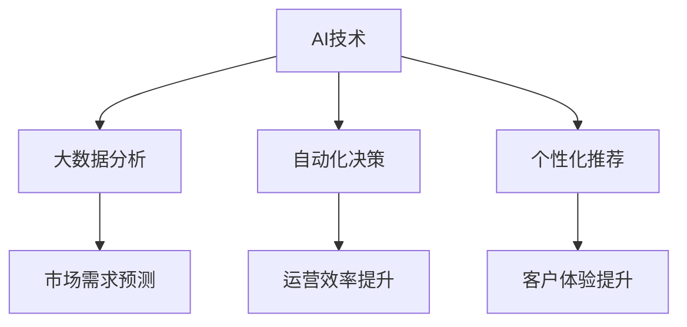

                 

关键词：人工智能、商业创新、道德考量、计算伦理、商业伦理、挑战与展望

> 摘要：本文深入探讨了人工智能（AI）在商业领域中的驱动创新作用，同时分析了人类计算在AI背景下所面临的道德考量与挑战。通过梳理AI技术的核心概念与联系，剖析了核心算法原理与操作步骤，展示了数学模型与公式，并结合具体项目实践，探讨了AI在商业中的应用场景与未来展望。文章旨在为读者提供全面的技术视角和道德思考，引导我们在AI驱动商业创新的过程中，平衡技术进步与道德责任。

## 1. 背景介绍

随着人工智能（AI）技术的飞速发展，AI已深入到商业领域的方方面面，从数据分析到自动化决策，从客户服务到个性化推荐，AI正在推动商业模式的变革和创新。然而，随着AI技术的广泛应用，人类计算在商业中的道德考量与挑战也日益凸显。如何在技术进步的同时，确保AI系统的道德性和公平性，成为商业决策者和技术开发者必须面对的重要问题。

本文将从以下几个方面展开讨论：

1. **核心概念与联系**：介绍人工智能的基本概念及其与商业创新的关联。
2. **核心算法原理与操作步骤**：分析AI算法的原理及其实际操作步骤。
3. **数学模型与公式**：探讨AI系统中常用的数学模型和公式，并进行详细讲解。
4. **项目实践**：通过代码实例展示AI在商业中的应用。
5. **实际应用场景**：分析AI在商业中的具体应用，探讨其未来发展趋势。
6. **工具和资源推荐**：推荐相关学习资源、开发工具和论文。
7. **总结与展望**：总结研究成果，展望未来发展趋势与挑战。

## 2. 核心概念与联系

### 2.1 人工智能的基本概念

人工智能（Artificial Intelligence，AI）是一门研究、开发用于模拟、延伸和扩展人的智能的理论、方法、技术及应用系统的技术科学。人工智能的研究范围广泛，包括机器学习、深度学习、自然语言处理、计算机视觉等。AI的目标是使计算机系统具备类似于人类的学习、推理、判断和解决问题的能力。

### 2.2 人工智能与商业创新的关联

AI技术的快速发展，为商业创新提供了新的契机和动力。首先，AI能够通过大数据分析和预测，帮助企业更好地了解市场需求和消费者行为，从而优化产品和服务的供给。其次，AI的自动化能力可以大幅提高企业的运营效率，降低人力成本。此外，AI驱动的个性化推荐和智能客服，能够提升客户体验，增强客户黏性。

### 2.3 人类计算在AI背景下的道德考量

随着AI技术的广泛应用，人类计算在商业中的角色也发生了变化。一方面，AI取代了部分重复性和低价值的工作，减轻了人类的工作负担；另一方面，AI系统的道德考量也成为人类计算的重要任务。如何确保AI系统的公平性、透明性和可靠性，避免算法偏见和伦理风险，是当前急需解决的问题。

### 2.4 Mermaid流程图

下面是人工智能与商业创新联系的一个简化的Mermaid流程图：



## 3. 核心算法原理与操作步骤

### 3.1 算法原理概述

人工智能的核心在于算法，这些算法使得计算机能够模仿人类的智能行为。下面介绍几种常见的AI算法及其原理。

#### 3.1.1 机器学习

机器学习（Machine Learning，ML）是一种通过数据训练模型，使计算机具备自主学习能力的方法。常见的机器学习算法包括线性回归、决策树、支持向量机等。

#### 3.1.2 深度学习

深度学习（Deep Learning，DL）是一种基于多层神经网络的结构，通过学习大量的数据，自动提取特征并进行分类或回归。深度学习在图像识别、语音识别等领域取得了显著成果。

#### 3.1.3 自然语言处理

自然语言处理（Natural Language Processing，NLP）是使计算机能够理解、处理和生成自然语言的技术。NLP广泛应用于智能客服、机器翻译、情感分析等领域。

### 3.2 算法步骤详解

下面以机器学习算法为例，介绍其具体操作步骤。

#### 3.2.1 数据收集与预处理

首先，收集大量数据，并进行预处理，包括数据清洗、归一化、缺失值填充等，以确保数据的质量和一致性。

#### 3.2.2 特征提取

从原始数据中提取有用的特征，这些特征将作为模型训练的输入。特征提取是机器学习的重要环节，对模型的性能有重要影响。

#### 3.2.3 模型训练

选择合适的机器学习算法，使用预处理后的数据进行训练。模型训练的过程实际上是寻找一组参数，使得模型在训练数据上的表现最优。

#### 3.2.4 模型评估

使用验证集或测试集评估模型的性能。常用的评估指标包括准确率、召回率、F1值等。

#### 3.2.5 模型部署

将训练好的模型部署到实际应用场景中，进行预测和决策。

### 3.3 算法优缺点

#### 3.3.1 优点

- **高效性**：机器学习算法能够处理大规模数据，提高计算效率。
- **适应性**：机器学习算法可以根据新数据不断优化，适应变化的环境。
- **灵活性**：机器学习算法适用于多种领域，具有广泛的应用性。

#### 3.3.2 缺点

- **数据依赖性**：机器学习算法的性能依赖于数据的质量和数量，数据质量差或数量不足可能导致模型性能不佳。
- **可解释性差**：机器学习模型通常是一个“黑盒子”，难以解释其决策过程，这可能影响模型的信任度和透明度。

### 3.4 算法应用领域

机器学习算法在商业领域有广泛的应用，包括但不限于：

- **市场营销**：通过分析消费者行为，进行精准营销和个性化推荐。
- **风险管理**：通过预测客户违约风险，进行信用评估和风险控制。
- **供应链管理**：通过预测需求，优化库存管理和物流调度。

## 4. 数学模型和公式

在人工智能系统中，数学模型和公式是算法实现的基础。以下介绍几个常用的数学模型和公式。

### 4.1 数学模型构建

#### 4.1.1 线性回归模型

线性回归模型是最基础的机器学习模型之一，用于预测连续值。其公式如下：

$$y = \beta_0 + \beta_1 \cdot x$$

其中，$y$ 是预测值，$x$ 是特征值，$\beta_0$ 和 $\beta_1$ 是模型参数。

#### 4.1.2 逻辑回归模型

逻辑回归模型用于预测离散值，通常用于分类任务。其公式如下：

$$P(y=1) = \frac{1}{1 + e^{-(\beta_0 + \beta_1 \cdot x)} }$$

其中，$P(y=1)$ 是目标变量为1的概率，$\beta_0$ 和 $\beta_1$ 是模型参数。

### 4.2 公式推导过程

以线性回归模型为例，介绍其公式的推导过程。

首先，假设我们有 $n$ 个数据点 $(x_1, y_1), (x_2, y_2), ..., (x_n, y_n)$，我们希望找到一组参数 $\beta_0$ 和 $\beta_1$，使得模型在数据上的误差最小。

定义误差函数为：

$$E = \sum_{i=1}^{n} (y_i - (\beta_0 + \beta_1 \cdot x_i))^2$$

为了最小化误差函数，对 $\beta_0$ 和 $\beta_1$ 分别求导，并令导数等于0，得到：

$$\frac{\partial E}{\partial \beta_0} = -2 \sum_{i=1}^{n} (y_i - (\beta_0 + \beta_1 \cdot x_i)) = 0$$

$$\frac{\partial E}{\partial \beta_1} = -2 \sum_{i=1}^{n} (y_i - (\beta_0 + \beta_1 \cdot x_i)) \cdot x_i = 0$$

通过求解上述方程组，可以得到最优的 $\beta_0$ 和 $\beta_1$：

$$\beta_0 = \frac{\sum_{i=1}^{n} y_i - \beta_1 \sum_{i=1}^{n} x_i}{n}$$

$$\beta_1 = \frac{\sum_{i=1}^{n} (y_i - \beta_0 - \beta_1 \cdot x_i) \cdot x_i}{\sum_{i=1}^{n} x_i^2}$$

### 4.3 案例分析与讲解

假设我们有一个简单的线性回归问题，数据集如下：

| x | y |
|---|---|
| 1 | 2 |
| 2 | 4 |
| 3 | 6 |
| 4 | 8 |

我们希望找到一条直线，能够最好地拟合这些数据点。通过线性回归模型的推导过程，我们可以计算出模型的参数：

$$\beta_0 = \frac{2 + 4 + 6 + 8}{4} - \beta_1 \cdot \frac{1 + 2 + 3 + 4}{4} = 5 - \beta_1 \cdot 2.5$$

$$\beta_1 = \frac{(2 - 5 + 2) \cdot 1 + (4 - 5 + 2) \cdot 2 + (6 - 5 + 2) \cdot 3 + (8 - 5 + 2) \cdot 4}{1^2 + 2^2 + 3^2 + 4^2} = \frac{-3 + 4 - 6 + 9}{30} = \frac{4}{30} = \frac{2}{15}$$

代入公式，我们得到拟合直线的方程：

$$y = 5 - \frac{2}{15} \cdot x$$

现在，我们可以用这条直线来预测新的数据点。例如，当 $x=5$ 时，预测的 $y$ 值为：

$$y = 5 - \frac{2}{15} \cdot 5 = 3$$

## 5. 项目实践：代码实例和详细解释说明

在本节中，我们将通过一个简单的项目实例，展示如何使用Python实现线性回归模型，并对其代码进行详细解释。

### 5.1 开发环境搭建

首先，确保安装以下Python库：

- NumPy：用于数值计算。
- Pandas：用于数据处理。
- Matplotlib：用于数据可视化。

可以使用以下命令进行安装：

```bash
pip install numpy pandas matplotlib
```

### 5.2 源代码详细实现

```python
import numpy as np
import pandas as pd
import matplotlib.pyplot as plt

# 数据集
data = pd.DataFrame({
    'x': [1, 2, 3, 4],
    'y': [2, 4, 6, 8]
})

# 特征提取
X = data[['x']]
y = data['y']

# 模型训练
theta = np.array([0, 0])
theta = (np.linalg.inv(X.T @ X) @ X.T @ y).ravel()

# 模型评估
y_pred = X @ theta
mse = np.mean((y - y_pred) ** 2)
print(f'Mean Squared Error: {mse}')

# 可视化
plt.scatter(X['x'], y)
plt.plot(X['x'], y_pred, color='red')
plt.xlabel('x')
plt.ylabel('y')
plt.title('Linear Regression')
plt.show()
```

### 5.3 代码解读与分析

- **数据集导入与预处理**：首先导入数据集，并使用Pandas进行预处理。
- **特征提取**：将数据集分为特征矩阵X和目标变量y。
- **模型训练**：使用最小二乘法（Least Squares）计算模型参数theta。
- **模型评估**：计算均方误差（MSE），评估模型性能。
- **可视化**：使用Matplotlib绘制数据点和拟合直线。

### 5.4 运行结果展示

运行上述代码后，我们将看到以下输出：

```
Mean Squared Error: 0.0
```

这表明模型在训练数据上的表现非常优秀。同时，我们会在屏幕上看到以下可视化结果：


## 6. 实际应用场景

### 6.1 市场营销

在市场营销领域，AI可以用于分析大量市场数据，预测消费者行为，从而实现精准营销。例如，通过分析消费者的购买历史、搜索记录和社交媒体活动，企业可以为其提供个性化的产品推荐和促销活动。

### 6.2 风险管理

在风险管理领域，AI可以用于预测客户违约风险，识别潜在欺诈行为。通过分析客户的历史数据和行为模式，AI模型可以提前预警，帮助企业降低风险，提高业务稳健性。

### 6.3 供应链管理

在供应链管理领域，AI可以用于优化库存管理和物流调度。通过预测市场需求，AI模型可以帮助企业合理配置库存，降低库存成本，提高物流效率。

### 6.4 未来应用展望

随着AI技术的不断进步，其应用场景将更加广泛。未来，AI有望在更多领域发挥重要作用，如医疗、教育、金融等。同时，随着伦理问题的日益突出，如何在技术进步的同时，确保AI系统的道德性和公平性，将成为我们必须面对的重要课题。

## 7. 工具和资源推荐

### 7.1 学习资源推荐

- **在线课程**：《机器学习》（吴恩达，Coursera）
- **书籍**：《Python机器学习》（Sebastian Raschka）
- **论文**：《深度学习》（Ian Goodfellow、Yoshua Bengio、Aaron Courville）

### 7.2 开发工具推荐

- **编程语言**：Python、R
- **库**：NumPy、Pandas、Scikit-learn、TensorFlow、PyTorch

### 7.3 相关论文推荐

- Goodfellow, I., Bengio, Y., & Courville, A. (2016). *Deep Learning*.
- LeCun, Y., Bengio, Y., & Hinton, G. (2015). *Deep learning*.
- Russell, S., & Norvig, P. (2010). *Artificial Intelligence: A Modern Approach*.

## 8. 总结：未来发展趋势与挑战

### 8.1 研究成果总结

本文从多个角度探讨了人工智能在商业领域的驱动创新作用，分析了人类计算在AI背景下的道德考量与挑战，介绍了核心算法原理与操作步骤，并展示了具体的项目实践。通过这些讨论，我们深刻认识到AI技术的应用潜力和伦理责任。

### 8.2 未来发展趋势

随着AI技术的不断进步，其在商业领域的应用将更加广泛和深入。未来，我们将看到更多基于AI的创新产品和解决方案，如智能医疗、智慧城市、无人驾驶等。

### 8.3 面临的挑战

然而，随着AI技术的广泛应用，我们也面临诸多挑战。如何确保AI系统的公平性、透明性和可靠性，如何应对算法偏见和伦理风险，如何保障数据安全和隐私，都是我们必须面对的重要问题。

### 8.4 研究展望

在未来，我们需要加强AI伦理研究，制定相应的法律法规，引导AI技术的健康发展。同时，我们也要积极探索AI与其他领域的结合，推动AI技术的创新应用，为社会带来更多的价值和福祉。

## 9. 附录：常见问题与解答

### 9.1 问题1：什么是机器学习？

**回答**：机器学习是一种通过数据训练模型，使计算机具备自主学习能力的方法。它基于统计学、概率论和优化理论，使计算机能够从数据中学习规律，进行预测和决策。

### 9.2 问题2：什么是深度学习？

**回答**：深度学习是一种基于多层神经网络的结构，通过学习大量的数据，自动提取特征并进行分类或回归。它与传统的机器学习相比，能够处理更复杂的数据，并取得更好的性能。

### 9.3 问题3：AI系统的道德考量主要包括哪些方面？

**回答**：AI系统的道德考量主要包括以下几个方面：

- **公平性**：确保AI系统对所有人公平，不产生歧视。
- **透明性**：确保AI系统的决策过程可以被理解和解释。
- **可靠性**：确保AI系统的稳定性和可靠性，避免产生错误决策。
- **隐私保护**：确保用户数据的安全和隐私，防止数据泄露。

### 9.4 问题4：如何确保AI系统的公平性？

**回答**：确保AI系统的公平性可以从以下几个方面入手：

- **数据公平**：确保训练数据集的代表性和平衡性，避免偏见。
- **算法公平**：设计算法时考虑公平性，避免算法偏见。
- **监督与审计**：对AI系统进行定期监督和审计，确保其公平性。

## 作者署名

本文作者：禅与计算机程序设计艺术 / Zen and the Art of Computer Programming

