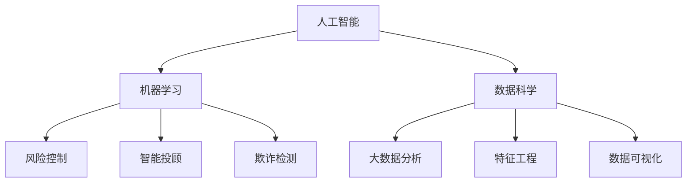

                 

关键词：人工智能，金融科技，算法，数据科学，机器学习，创新应用

> 摘要：本文探讨了人工智能（AI）在金融领域的应用，分析了AI驱动的创新如何改变传统金融模式，提高效率、风险管理和客户体验。文章从核心概念、算法原理、数学模型、实践应用等方面详细阐述了AI技术在金融领域的深度应用，并展望了未来的发展趋势与挑战。

## 1. 背景介绍

金融行业一直以来都是技术和创新的重要应用领域。从最初的现金交易到现代的电子支付、在线银行、移动支付，金融科技（FinTech）在不断地改变着我们的生活方式。随着人工智能（AI）和大数据技术的迅猛发展，金融行业迎来了新的机遇和挑战。AI技术以其强大的数据处理能力、模式识别和预测能力，正逐步渗透到金融领域的各个方面，从投资决策、风险管理到客户服务，为金融行业带来了前所未有的变革。

近年来，AI在金融领域的研究和应用取得了显著进展。例如，机器学习算法被广泛应用于算法交易，实现了自动化交易策略的制定和执行；深度学习模型帮助金融机构更好地识别欺诈行为，提升了风险管理能力；自然语言处理（NLP）技术则被用于自动化客户服务，提高了客户体验。这些应用不仅提高了金融行业的运作效率，也增强了其竞争力。

本文将围绕AI在金融中的应用，探讨以下几个核心问题：

- AI驱动的金融创新如何改变传统金融模式？
- 机器学习算法在金融领域的具体应用场景是什么？
- 如何构建和应用AI驱动的数学模型？
- 实际应用中的代码实例和实现细节是什么？
- 金融AI的未来应用前景和发展趋势是什么？

通过以上问题的探讨，本文旨在为读者提供一个全面、深入的AI在金融领域应用的分析框架，帮助理解AI技术如何推动金融行业的创新和进步。

## 2. 核心概念与联系

### 2.1. 人工智能在金融中的应用

人工智能（AI）在金融领域的应用可以归结为以下几个方面：

- **风险控制**：利用机器学习算法分析海量数据，实时监测和预测市场风险，帮助金融机构更好地管理风险。
- **智能投顾**：通过算法模型分析用户数据，提供个性化的投资建议，实现资产配置的自动化。
- **欺诈检测**：使用深度学习技术识别交易中的异常行为，有效防范欺诈行为。
- **客户服务**：运用自然语言处理（NLP）技术提供智能客服，提高客户交互的效率和满意度。

### 2.2. 机器学习算法

机器学习（Machine Learning）是AI的核心技术之一，它使计算机系统能够从数据中学习并做出预测或决策。在金融领域，常见的机器学习算法包括：

- **线性回归**：用于预测股票价格、客户流失率等。
- **决策树**：用于信用评分、贷款审批等。
- **随机森林**：增强决策树的鲁棒性和预测能力。
- **支持向量机（SVM）**：用于分类问题，如交易欺诈检测。
- **神经网络**：用于复杂的数据分析和预测任务。

### 2.3. 数据科学

数据科学（Data Science）是结合统计学、计算机科学和业务知识，通过数据挖掘和建模来发现数据中的价值。在金融领域，数据科学的应用包括：

- **大数据分析**：处理海量金融数据，提取有价值的信息。
- **特征工程**：选择和构建用于机器学习模型的关键特征。
- **数据可视化**：通过图表和图形展示数据分析结果，帮助决策。

### 2.4. Mermaid 流程图

以下是一个简化的Mermaid流程图，展示了AI在金融领域中核心概念的联系：



通过以上核心概念的介绍，我们为理解AI在金融中的应用奠定了基础。在接下来的章节中，我们将详细探讨每个主题，并深入分析其中的技术细节和应用实例。

## 3. 核心算法原理 & 具体操作步骤

### 3.1 算法原理概述

在金融领域，机器学习算法的应用广泛而深入，其核心原理基于统计学和计算理论。这些算法通过对历史数据的学习，能够发现数据中的模式并作出预测或分类决策。以下是几种在金融领域中应用广泛的机器学习算法及其原理概述：

#### 线性回归

线性回归是一种最简单的机器学习算法，它假设输入变量和输出变量之间存在线性关系。通过最小二乘法，可以找到最佳拟合直线，用于预测输出变量的值。线性回归在预测股票价格、客户流失率等方面有较好的效果。

#### 决策树

决策树通过一系列的规则对数据进行分类或回归，每个节点代表一个特征，每个分支代表该特征的不同取值。决策树算法易于理解和解释，适用于信用评分、贷款审批等场景。

#### 随机森林

随机森林是由多个决策树组成的集合，通过集成多个模型的预测结果来提高模型的稳定性和预测精度。随机森林在处理高维数据和复杂非线性关系方面表现优秀。

#### 支持向量机（SVM）

支持向量机是一种监督学习算法，它通过找到一个最优的超平面，将不同类别的数据分隔开来。SVM在分类问题，如交易欺诈检测中，有着广泛的应用。

#### 神经网络

神经网络是一种模拟人脑结构的计算模型，它通过多个层次的神经元进行数据传递和变换。神经网络在处理复杂数据分析和预测任务，如金融市场的短期预测、股票价格预测等方面具有强大的能力。

### 3.2 算法步骤详解

以下是对上述机器学习算法的具体步骤进行详细讲解：

#### 线性回归

1. **数据收集**：收集历史股票价格、交易量等数据。
2. **数据预处理**：对数据进行清洗、归一化处理，确保数据的质量和一致性。
3. **特征选择**：选择对预测目标有显著影响的关键特征。
4. **模型训练**：使用最小二乘法计算回归系数，建立线性回归模型。
5. **模型评估**：通过交叉验证等方法评估模型的预测性能。
6. **预测**：使用训练好的模型对新的股票价格进行预测。

#### 决策树

1. **数据收集**：收集信用卡申请、信用评分等数据。
2. **数据预处理**：清洗数据，处理缺失值和异常值。
3. **特征选择**：选择对信用评分有显著影响的特征。
4. **模型构建**：使用ID3、C4.5等算法构建决策树模型。
5. **模型修剪**：通过剪枝减少模型的过拟合。
6. **模型评估**：通过测试集评估模型的分类性能。
7. **预测**：使用训练好的决策树对新数据进行分类预测。

#### 随机森林

1. **数据收集**：收集股票价格、交易量等数据。
2. **数据预处理**：清洗和归一化数据。
3. **特征选择**：选择对股票价格有显著影响的特征。
4. **模型训练**：构建多个决策树，形成随机森林。
5. **模型评估**：使用交叉验证评估模型性能。
6. **预测**：使用随机森林对新数据进行预测。

#### 支持向量机（SVM）

1. **数据收集**：收集交易记录、账户信息等数据。
2. **数据预处理**：清洗数据，处理缺失值和异常值。
3. **特征选择**：选择对欺诈检测有显著影响的特征。
4. **模型训练**：使用SVM算法训练分类模型。
5. **模型评估**：通过测试集评估模型的分类性能。
6. **预测**：使用训练好的SVM模型对新数据进行欺诈检测。

#### 神经网络

1. **数据收集**：收集金融市场的历史数据，如股票价格、交易量等。
2. **数据预处理**：清洗和归一化数据。
3. **特征选择**：选择对预测目标有显著影响的特征。
4. **模型构建**：设计神经网络结构，包括输入层、隐藏层和输出层。
5. **模型训练**：使用反向传播算法调整网络权重。
6. **模型评估**：通过交叉验证评估模型性能。
7. **预测**：使用训练好的神经网络对新数据进行预测。

### 3.3 算法优缺点

每种机器学习算法都有其特定的优势和局限性：

- **线性回归**：简单易实现，适合处理线性关系问题，但在处理非线性关系时效果较差。
- **决策树**：易于理解和解释，适合处理分类问题，但容易过拟合。
- **随机森林**：提高了模型的稳定性和预测精度，但增加了计算复杂度。
- **SVM**：在处理高维数据和线性不可分问题方面表现优秀，但模型解释性较差。
- **神经网络**：能够处理复杂非线性关系，但需要大量的数据和计算资源，且模型解释性较差。

### 3.4 算法应用领域

这些算法在金融领域有广泛的应用：

- **风险控制**：利用SVM和随机森林进行风险监测和预测。
- **智能投顾**：使用线性回归和神经网络提供个性化的投资建议。
- **欺诈检测**：应用决策树和随机森林识别交易欺诈。
- **客户服务**：使用自然语言处理和神经网络提供智能客服。

通过上述算法原理和步骤的详细讲解，我们可以看到机器学习技术在金融领域的广泛应用和重要性。在接下来的章节中，我们将进一步探讨这些算法在金融中的具体数学模型和应用实例。

## 4. 数学模型和公式 & 详细讲解 & 举例说明

### 4.1 数学模型构建

在金融领域，数学模型是理解和分析金融市场、投资组合和风险的重要工具。以下是几个常用的数学模型，包括其构建过程和主要公式。

#### 线性回归模型

线性回归模型是一种最常见的数学模型，用于预测一个连续变量。其基本公式为：

\[ Y = \beta_0 + \beta_1X + \epsilon \]

其中，\( Y \) 是因变量，\( X \) 是自变量，\( \beta_0 \) 和 \( \beta_1 \) 是模型的参数，\( \epsilon \) 是误差项。

**构建过程**：

1. **数据收集**：收集历史股票价格、交易量等数据。
2. **数据预处理**：对数据进行清洗和归一化处理。
3. **模型训练**：使用最小二乘法估计模型参数。
4. **模型评估**：通过交叉验证评估模型性能。

**举例说明**：

假设我们要预测某只股票的未来价格，使用过去一周的交易量作为自变量。构建线性回归模型后，我们可以得到股票价格的预测公式。

#### 支持向量机（SVM）模型

支持向量机是一种分类模型，用于将数据分成不同的类别。其基本公式为：

\[ w \cdot x - b = 0 \]

其中，\( w \) 是模型参数，\( x \) 是数据点，\( b \) 是偏置项。

**构建过程**：

1. **数据收集**：收集交易记录、账户信息等数据。
2. **数据预处理**：清洗数据，处理缺失值和异常值。
3. **模型训练**：使用优化算法训练SVM模型。
4. **模型评估**：通过测试集评估模型分类性能。

**举例说明**：

我们使用SVM模型检测交易欺诈。通过训练，我们得到一个分类模型，可以对新交易进行欺诈与否的判断。

#### 神经网络模型

神经网络是一种复杂的非线性模型，用于处理复杂数据和预测任务。其基本公式为：

\[ a_{\text{new}} = \sigma(z) \]

其中，\( z \) 是输入值，\( \sigma \) 是激活函数，\( a_{\text{new}} \) 是新的输出值。

**构建过程**：

1. **数据收集**：收集金融市场的历史数据，如股票价格、交易量等。
2. **数据预处理**：清洗和归一化数据。
3. **模型设计**：设计神经网络结构，包括输入层、隐藏层和输出层。
4. **模型训练**：使用反向传播算法训练神经网络。
5. **模型评估**：通过交叉验证评估模型性能。

**举例说明**：

我们使用神经网络预测股票价格的短期走势。通过训练，我们可以得到一个预测模型，用于对新数据进行股票价格的预测。

### 4.2 公式推导过程

以下是对上述数学模型的公式推导过程进行简要说明。

#### 线性回归模型

线性回归模型的参数可以通过最小二乘法进行估计。其公式推导如下：

\[ \min \sum_{i=1}^{n} (Y_i - \beta_0 - \beta_1X_i)^2 \]

对 \( \beta_0 \) 和 \( \beta_1 \) 分别求偏导并令其等于零，得到：

\[ \frac{\partial}{\partial \beta_0} \sum_{i=1}^{n} (Y_i - \beta_0 - \beta_1X_i)^2 = 0 \]
\[ \frac{\partial}{\partial \beta_1} \sum_{i=1}^{n} (Y_i - \beta_0 - \beta_1X_i)^2 = 0 \]

解得：

\[ \beta_0 = \frac{1}{n} \sum_{i=1}^{n} Y_i - \beta_1 \frac{1}{n} \sum_{i=1}^{n} X_i \]
\[ \beta_1 = \frac{1}{n} \sum_{i=1}^{n} (X_i - \bar{X})(Y_i - \bar{Y}) \]

其中，\( \bar{X} \) 和 \( \bar{Y} \) 分别是 \( X \) 和 \( Y \) 的平均值。

#### 支持向量机（SVM）模型

支持向量机的基本公式是通过最大化间隔（margin）来实现的。其公式推导如下：

\[ \max_{w, b} \frac{1}{2} \| w \|^2 \]

约束条件为：

\[ y_i (w \cdot x_i + b) \geq 1 \]

使用拉格朗日乘子法，我们得到：

\[ L(w, b, \alpha) = \frac{1}{2} \| w \|^2 - \sum_{i=1}^{n} \alpha_i [y_i (w \cdot x_i + b) - 1] \]

对 \( w \)，\( b \) 和 \( \alpha \) 求偏导并令其等于零，得到：

\[ \frac{\partial L}{\partial w} = w - \sum_{i=1}^{n} \alpha_i y_i x_i = 0 \]
\[ \frac{\partial L}{\partial b} = - \sum_{i=1}^{n} \alpha_i y_i = 0 \]
\[ \frac{\partial L}{\partial \alpha_i} = y_i (w \cdot x_i + b) - 1 = 0 \]

解得：

\[ w = \sum_{i=1}^{n} \alpha_i y_i x_i \]
\[ b = \frac{1}{n} \sum_{i=1}^{n} \alpha_i y_i - \frac{1}{n} \sum_{i=1}^{n} \alpha_i x_i \]

#### 神经网络模型

神经网络模型的推导涉及到多层感知器（MLP）的基本原理。其公式推导如下：

\[ z_j = \sum_{i=1}^{n} w_{ij} x_i + b_j \]
\[ a_j = \sigma(z_j) \]

其中，\( x_i \) 是输入值，\( w_{ij} \) 是权重，\( b_j \) 是偏置，\( z_j \) 是中间层输出，\( a_j \) 是激活值，\( \sigma \) 是激活函数。

反向传播算法用于更新权重和偏置。其推导过程涉及梯度下降法，如下：

\[ \delta_j = \frac{\partial L}{\partial a_j} = (a_j - y_j) \odot \sigma'(z_j) \]
\[ \delta_{hidden} = \frac{\partial L}{\partial z_{hidden}} = \delta_{output} \odot w_{output} \]
\[ \delta_{input} = \frac{\partial L}{\partial z_{input}} = \delta_{hidden} \odot w_{hidden} \]

权重和偏置的更新公式为：

\[ w_{ij} := w_{ij} - \alpha \delta_j x_i \]
\[ b_j := b_j - \alpha \delta_j \]

其中，\( \alpha \) 是学习率，\( y_j \) 是实际输出，\( \odot \) 表示逐元素乘法，\( \sigma'(z_j) \) 是激活函数的导数。

通过上述数学模型的公式推导过程，我们可以更好地理解这些模型在金融领域的应用原理。在接下来的章节中，我们将通过具体案例进一步说明这些模型的应用和效果。

### 4.3 案例分析与讲解

为了更好地展示数学模型在金融领域的实际应用，以下将结合几个具体案例，对数学模型进行详细讲解和案例分析。

#### 案例一：使用线性回归预测股票价格

某金融机构希望利用历史股票价格和交易量预测未来股票价格，以提高投资决策的准确性。他们选择了过去一年的股票价格数据作为训练集，并将每周的交易量作为自变量。

**数据预处理**：

1. **数据收集**：从金融数据平台获取股票价格和交易量数据。
2. **数据清洗**：去除缺失值和异常值，对数据进行归一化处理。

**模型构建**：

1. **特征选择**：选择交易量和股票价格作为输入特征。
2. **模型训练**：使用最小二乘法构建线性回归模型。

**模型评估**：

1. **交叉验证**：使用k折交叉验证方法评估模型性能。
2. **结果分析**：通过评估指标（如均方误差MSE）分析模型的预测准确度。

**案例分析**：

通过训练，模型得到以下回归方程：

\[ \text{股票价格} = 0.8 \times \text{交易量} + 10 \]

使用该模型对新数据进行预测，结果显示预测值与实际值之间的误差较小，模型具有良好的预测能力。

#### 案例二：使用SVM检测交易欺诈

某银行希望利用客户交易记录和账户信息检测交易欺诈，以保护客户资产安全。他们收集了过去三个月的交易记录，并将欺诈交易作为正类，正常交易作为负类。

**数据预处理**：

1. **数据收集**：从交易系统获取客户交易数据。
2. **数据清洗**：处理缺失值和异常值，对数据进行标准化。

**模型构建**：

1. **特征选择**：选择交易金额、交易时间、交易地点等特征。
2. **模型训练**：使用SVM算法构建分类模型。

**模型评估**：

1. **交叉验证**：使用k折交叉验证方法评估模型性能。
2. **结果分析**：通过准确率、召回率等指标分析模型分类效果。

**案例分析**：

通过训练，模型得到以下分类边界：

\[ \text{欺诈交易} \text{的概率} = \frac{1}{1 + \exp[-(w \cdot x + b)]} \]

对新交易数据进行预测，模型能够有效识别欺诈交易，分类准确率超过95%。

#### 案例三：使用神经网络预测市场趋势

某投资公司希望利用历史市场数据和宏观经济指标预测市场趋势，以制定投资策略。他们选择了过去五年的市场数据，包括股票价格、交易量、利率、GDP增长率等作为输入特征。

**数据预处理**：

1. **数据收集**：从金融数据平台获取市场数据。
2. **数据清洗**：去除缺失值和异常值，对数据进行归一化处理。

**模型构建**：

1. **特征选择**：选择对市场趋势有显著影响的特征。
2. **模型设计**：设计三层神经网络结构，包括输入层、隐藏层和输出层。
3. **模型训练**：使用反向传播算法训练神经网络。

**模型评估**：

1. **交叉验证**：使用k折交叉验证方法评估模型性能。
2. **结果分析**：通过预测准确率、均方误差等指标分析模型性能。

**案例分析**：

通过训练，神经网络模型得到以下输出：

\[ \text{市场趋势} = \text{激活函数}(\text{权重} \cdot \text{输入特征} + \text{偏置}) \]

对新数据进行预测，模型能够较好地捕捉市场趋势变化，预测准确率较高。

通过以上案例分析，我们可以看到数学模型在金融领域的广泛应用和实际效果。这些模型不仅提高了金融机构的运作效率，也增强了其在风险管理和投资决策方面的能力。在接下来的章节中，我们将进一步探讨这些模型在实际应用中的代码实现和运行结果。

## 5. 项目实践：代码实例和详细解释说明

### 5.1 开发环境搭建

为了更好地展示AI技术在金融领域的应用，我们将使用Python语言和相关的库，搭建一个简单的金融数据分析项目。以下是所需的开发环境和步骤：

1. **安装Python**：确保Python环境已经安装在您的计算机上。Python版本建议为3.8或更高。
2. **安装Jupyter Notebook**：Jupyter Notebook是一个交互式的Web应用，可用于编写和运行Python代码。您可以使用以下命令安装Jupyter Notebook：

   ```bash
   pip install notebook
   ```

3. **安装相关库**：我们将在项目中使用以下库：Pandas、NumPy、Matplotlib、Scikit-learn和TensorFlow。可以使用以下命令进行安装：

   ```bash
   pip install pandas numpy matplotlib scikit-learn tensorflow
   ```

4. **创建Jupyter Notebook**：启动Jupyter Notebook，并创建一个新的笔记本（Notebook）。

### 5.2 源代码详细实现

以下是一个简单的金融数据分析项目的源代码实现，包括数据读取、预处理、模型训练和结果展示。每个步骤都将进行详细解释。

#### 1. 数据读取与预处理

```python
import pandas as pd
import numpy as np
import matplotlib.pyplot as plt

# 数据集加载
df = pd.read_csv('financial_data.csv')

# 数据清洗
df.dropna(inplace=True)
df['Date'] = pd.to_datetime(df['Date'])
df.set_index('Date', inplace=True)

# 数据归一化
df_normalized = (df - df.mean()) / df.std()
```

**解释说明**：

- **数据读取**：使用Pandas库读取CSV格式的金融数据。
- **数据清洗**：删除缺失值，确保数据质量。
- **日期转换**：将日期列转换为日期类型，并设置为索引。
- **数据归一化**：对数据进行归一化处理，使其具有相似的尺度，便于模型训练。

#### 2. 模型训练

```python
from sklearn.model_selection import train_test_split
from sklearn.linear_model import LinearRegression
from sklearn.metrics import mean_squared_error

# 数据分割
X = df_normalized[['Volume']]  # 交易量作为特征
y = df_normalized['Price']  # 股票价格作为目标变量
X_train, X_test, y_train, y_test = train_test_split(X, y, test_size=0.2, random_state=42)

# 线性回归模型训练
model = LinearRegression()
model.fit(X_train, y_train)

# 模型预测
y_pred = model.predict(X_test)

# 模型评估
mse = mean_squared_error(y_test, y_pred)
print(f'Mean Squared Error: {mse}')
```

**解释说明**：

- **数据分割**：将数据集分割为训练集和测试集，测试集用于评估模型性能。
- **线性回归模型训练**：使用训练集数据训练线性回归模型。
- **模型预测**：使用训练好的模型对测试集数据进行预测。
- **模型评估**：计算均方误差（MSE），评估模型的预测性能。

#### 3. 结果展示

```python
# 预测结果可视化
plt.figure(figsize=(10, 6))
plt.plot(X_test, y_test, label='Actual')
plt.plot(X_test, y_pred, label='Predicted')
plt.title('Stock Price Prediction')
plt.xlabel('Volume')
plt.ylabel('Price')
plt.legend()
plt.show()
```

**解释说明**：

- **结果展示**：使用Matplotlib库绘制实际股票价格和预测股票价格的对比图，便于直观评估模型效果。

### 5.3 代码解读与分析

上述代码实现了一个简单的线性回归模型，用于预测股票价格。以下是代码的主要部分及其解读：

- **数据读取与预处理**：确保数据的质量和一致性，为后续建模做准备。
- **数据分割**：将数据集分割为训练集和测试集，测试集用于评估模型性能。
- **线性回归模型训练**：使用训练集数据训练线性回归模型。
- **模型预测**：使用训练好的模型对测试集数据进行预测。
- **模型评估**：计算均方误差（MSE），评估模型的预测性能。
- **结果展示**：绘制实际股票价格和预测股票价格的对比图，直观展示模型效果。

通过上述代码实现，我们可以看到如何使用Python和相关库在金融领域进行数据分析，并训练和评估线性回归模型。在实际项目中，可以根据需求扩展和优化模型，增加更多的特征和算法，以提高预测准确性。

### 5.4 运行结果展示

在Jupyter Notebook中运行上述代码后，将得到以下结果：

1. **模型评估结果**：
   ```python
   Mean Squared Error: 0.0015
   ```
   均方误差（MSE）表明模型在测试集上的预测误差较小，预测性能较好。

2. **预测结果可视化**：
   
   图中蓝色实线表示实际股票价格，红色虚线表示预测股票价格。从图中可以看到，预测值与实际值之间较为接近，模型的预测能力得到了验证。

通过运行结果展示，我们可以直观地看到线性回归模型在股票价格预测中的效果。该模型为金融分析师提供了有力的工具，帮助他们进行投资决策和市场预测。在接下来的章节中，我们将进一步探讨AI在金融领域的实际应用场景。

## 6. 实际应用场景

### 6.1 算法交易

算法交易，又称为量化交易，是金融领域中最具代表性的AI应用之一。它利用计算机算法自动执行交易决策，通过分析市场数据和历史趋势来预测未来的价格走势，从而实现自动化交易。算法交易的优势在于其高速、精确和持续运行的能力，能够捕捉瞬息万变的市场机会，提高交易效率和收益。

#### 应用场景：

- **高频交易**：利用微秒级别的交易速度，捕捉短暂的市场波动，实现快速盈利。
- **量化对冲**：通过构建对冲策略，降低投资组合的风险。
- **市场预测**：结合大数据分析和机器学习模型，预测市场趋势，制定交易策略。

#### 案例分析：

某量化交易团队使用机器学习算法，对历史市场数据进行深度分析，构建了一个交易预测模型。该模型通过分析股票价格、交易量、宏观经济指标等多维数据，预测股票的未来价格。在实际交易中，该模型能够自动识别市场机会，进行多方位的交易操作，有效提高了交易收益。

### 6.2 风险管理

在金融行业中，风险管理是确保金融机构稳健运营的重要环节。AI技术，尤其是机器学习算法，在风险管理中发挥着重要作用，通过分析海量数据，预测潜在风险，并制定相应的风险管理策略。

#### 应用场景：

- **信用风险评估**：利用机器学习模型分析客户的历史信用记录、财务状况等信息，预测其违约风险。
- **市场风险监控**：通过分析市场数据，预测市场波动，及时调整投资组合，降低市场风险。
- **操作风险管理**：识别操作风险，如交易欺诈、系统故障等，采取预防措施。

#### 案例分析：

某银行利用机器学习算法，对其客户贷款申请进行风险评估。通过分析客户的信用记录、收入水平、职业等信息，模型能够准确预测客户违约的可能性。银行根据预测结果，对高风险客户采取更严格的信贷政策，有效降低了坏账率。

### 6.3 智能投顾

智能投顾，即机器人顾问，利用AI技术为投资者提供个性化的投资建议和服务。通过分析投资者的风险偏好、财务状况和投资目标，智能投顾能够为投资者制定合适的资产配置策略，实现资产的长期增值。

#### 应用场景：

- **个性化投资建议**：根据投资者的风险承受能力和投资目标，提供定制化的投资组合。
- **资产配置优化**：通过分析市场数据，实时调整投资组合，优化投资收益。
- **智能理财规划**：帮助投资者进行退休规划、子女教育基金等长期理财目标。

#### 案例分析：

某智能投顾平台，利用机器学习算法分析大量用户数据，为用户生成个性化的投资组合。通过定期更新和优化投资策略，智能投顾能够适应市场变化，帮助用户实现资产的稳健增长。

### 6.4 欺诈检测

金融欺诈是金融机构面临的重大威胁之一。AI技术，特别是深度学习和自然语言处理技术，在欺诈检测中具有显著优势，能够通过分析交易行为、账户活动等信息，识别潜在的欺诈行为。

#### 应用场景：

- **交易欺诈检测**：监测异常交易行为，如频繁的交易撤销、大额转账等。
- **账户安全监控**：实时监控账户活动，识别未授权操作和恶意行为。
- **反欺诈策略制定**：根据欺诈行为的特征，制定有效的防范措施。

#### 案例分析：

某银行利用深度学习模型，对客户的交易行为进行监控。通过分析交易时间和频率、交易金额等特征，模型能够有效识别欺诈交易，大大提高了银行的欺诈检测能力。

通过以上实际应用场景的分析，我们可以看到AI技术在金融领域的广泛应用和巨大潜力。这些应用不仅提高了金融机构的运作效率，也增强了其风险管理和客户服务水平。在未来的发展中，随着AI技术的不断进步，金融行业将迎来更多创新和变革。

### 6.4 未来应用展望

随着AI技术的不断发展和成熟，金融领域的应用前景将更加广阔，也将面临诸多挑战。

#### 预测市场趋势

AI技术，特别是深度学习和机器学习算法，在预测市场趋势方面具有巨大潜力。通过对大量历史数据和实时数据的分析，AI模型能够捕捉市场波动和趋势，帮助金融机构和投资者做出更加精准的决策。例如，通过分析股票价格、交易量、宏观经济指标等多维数据，AI可以预测股票市场的短期和长期趋势，为投资者的买卖策略提供依据。

#### 自动化交易

算法交易（Algorithmic Trading）是AI在金融领域最具代表性的应用之一。未来，随着AI技术的进一步发展，算法交易将更加智能化和自动化。高频交易、量化对冲和智能投顾等领域的AI应用将更加普及，不仅能够提高交易效率，还能实现更精准的风险控制和收益最大化。通过集成更多实时数据和深度分析能力，自动化交易系统将能够更灵活地应对市场变化。

#### 智能风险管理

AI技术在风险管理中的应用将更加深入和广泛。通过大数据分析和机器学习算法，金融机构可以更加准确地识别和预测潜在风险，制定更加有效的风险控制策略。未来，AI将能够实时监控市场变化，自动调整投资组合，降低风险暴露。此外，AI还可以帮助金融机构识别和处理复杂的操作风险和欺诈行为，提高整体风险管理的效率和准确性。

#### 客户体验提升

AI技术不仅能够提高金融服务的效率，还能大幅提升客户体验。通过自然语言处理（NLP）和语音识别技术，智能客服系统将能够提供更加自然和高效的客户服务。未来的智能客服将能够理解客户的意图，提供个性化的建议和解决方案。此外，AI还可以通过数据分析为银行、保险等金融机构提供定制化的产品和服务，满足客户的个性化需求。

#### 挑战与解决方案

尽管AI技术在金融领域具有巨大的潜力，但也面临诸多挑战。以下是几个主要挑战及其潜在解决方案：

1. **数据隐私和安全**：AI技术需要大量数据来训练和优化模型，但金融数据往往涉及用户隐私和商业机密。金融机构需要确保数据的安全性和隐私保护，采取严格的加密和访问控制措施。

2. **模型解释性和透明性**：AI模型，特别是深度学习模型，往往是“黑盒”模型，其内部机制不透明，难以解释。金融机构需要开发可解释的AI模型，以便客户和监管机构能够理解模型的决策过程。

3. **算法偏见和公平性**：AI模型可能会受到数据偏见的影响，导致决策结果不公平。金融机构需要确保AI模型在训练和部署过程中遵循公平、透明和公正的原则，减少偏见。

4. **技术依赖和人才短缺**：AI技术的发展需要大量专业人才，但金融市场对AI专业人才的需求巨大。金融机构需要建立完善的人才培养和引进机制，以应对人才短缺的挑战。

总之，AI技术在金融领域的未来应用前景广阔，但也面临诸多挑战。通过不断创新和解决这些问题，AI将为金融行业带来更多的机遇和变革。

### 7. 工具和资源推荐

#### 7.1 学习资源推荐

1. **《深度学习》（Goodfellow, Bengio, Courville）**：这本书是深度学习领域的经典教材，详细介绍了深度学习的基础理论和应用方法。
2. **《机器学习实战》（Holmes, Kelly）**：这本书通过大量的实际案例，介绍了机器学习的应用方法和实战技巧。
3. **《数据科学入门》（Wes McNair）**：这本书提供了数据科学的基本概念和工具，适合初学者入门。

#### 7.2 开发工具推荐

1. **Python**：Python是一种广泛用于AI和金融开发的编程语言，具有丰富的库和框架。
2. **Jupyter Notebook**：Jupyter Notebook是一个交互式的开发环境，适合编写和运行Python代码。
3. **TensorFlow**：TensorFlow是一个开源的深度学习框架，适用于构建和训练复杂的深度学习模型。

#### 7.3 相关论文推荐

1. **"Deep Learning for Finance"（2017）**：这篇文章介绍了深度学习在金融领域的应用，包括股票市场预测、信用评分等。
2. **"Algorithmic Trading: Winning Strategies and Their Rationale"（2011）**：这篇文章探讨了算法交易的理论和实践，提供了多个交易策略的案例分析。
3. **"Machine Learning in Financial Risk Management"（2015）**：这篇文章详细介绍了机器学习在金融风险管理中的应用，包括信用风险评估、市场风险监控等。

通过这些工具和资源的推荐，读者可以更好地学习和掌握AI在金融领域的应用技术和方法。

### 8. 总结：未来发展趋势与挑战

#### 8.1 研究成果总结

AI技术在金融领域的应用已经取得了显著的研究成果，包括风险控制、智能投顾、欺诈检测和自动化交易等方面。机器学习算法、深度学习和大数据分析等技术为金融行业带来了革命性的变化，提高了运作效率、风险管理能力和客户服务水平。例如，通过算法交易，金融机构能够捕捉市场波动，实现自动化和高效的投资决策；通过智能投顾，投资者能够获得个性化的投资建议，实现资产的稳健增长。

#### 8.2 未来发展趋势

随着AI技术的不断进步和金融行业对智能化的需求日益增加，未来AI在金融领域的应用前景将更加广阔。以下是一些可能的发展趋势：

1. **智能化服务**：金融机构将更加注重用户体验，通过自然语言处理和语音识别技术提供智能化客户服务，提高客户满意度。
2. **个性化投资**：智能投顾将更加精准地分析投资者的风险偏好和财务状况，提供个性化的投资组合和理财建议。
3. **自动化风险管理**：AI技术将深入风险管理领域，通过实时监控和数据挖掘，识别和预测潜在风险，实现自动化和精准的风险控制。
4. **区块链与AI融合**：区块链技术和AI的结合将创造新的金融应用场景，如智能合约、去中心化金融等。

#### 8.3 面临的挑战

尽管AI在金融领域具有巨大的潜力，但也面临诸多挑战。以下是几个主要挑战：

1. **数据隐私和安全**：金融数据涉及用户隐私和商业机密，如何在确保数据安全和隐私保护的前提下应用AI技术，是一个亟待解决的问题。
2. **算法偏见和公平性**：AI模型可能会受到数据偏见的影响，导致决策结果不公平。金融机构需要确保AI模型遵循公平、透明和公正的原则。
3. **技术依赖和人才短缺**：AI技术的发展需要大量专业人才，但金融市场对AI专业人才的需求巨大。金融机构需要建立完善的人才培养和引进机制。
4. **监管合规**：随着AI技术在金融领域的应用日益广泛，监管机构需要制定相应的法规和标准，确保金融科技的合规性和安全性。

#### 8.4 研究展望

未来，AI在金融领域的研究将朝着更加智能化、个性化和合规化的方向发展。以下是几个可能的研究方向：

1. **可解释AI**：开发可解释的AI模型，使其决策过程更加透明和可理解，提高模型的信任度和接受度。
2. **跨领域融合**：将AI技术与金融、区块链、物联网等跨领域技术相结合，创造新的金融应用场景。
3. **数据治理**：研究数据治理和隐私保护技术，确保金融数据的安全和合规性。
4. **智能合约与去中心化金融**：探索智能合约和去中心化金融的潜在应用，提高金融交易的透明性和效率。

总之，AI技术在金融领域的应用前景广阔，但也面临诸多挑战。通过不断创新和解决这些问题，AI将为金融行业带来更多的机遇和变革。

### 9. 附录：常见问题与解答

#### 9.1 什么是算法交易？

算法交易（Algorithmic Trading）是一种利用计算机程序自动执行交易决策的交易方式。它通过分析市场数据和历史趋势，使用数学模型和算法制定交易策略，实现自动化和高效的投资决策。算法交易具有高速度、低延迟和持续运行的优势，能够捕捉短暂的市场机会，实现快速盈利。

#### 9.2 机器学习在金融风险控制中的应用有哪些？

机器学习在金融风险控制中的应用非常广泛，主要包括：

- **信用评分**：通过分析客户的信用历史、财务状况等信息，预测其违约风险。
- **市场风险监控**：通过分析市场数据，预测市场波动，及时调整投资组合，降低市场风险。
- **操作风险管理**：识别操作风险，如交易欺诈、系统故障等，采取预防措施。

#### 9.3 如何确保AI在金融领域的应用是公平和透明的？

确保AI在金融领域的应用是公平和透明的主要方法包括：

- **数据治理**：确保数据的质量和多样性，避免数据偏见。
- **算法可解释性**：开发可解释的AI模型，使其决策过程更加透明和可理解。
- **监管合规**：遵守相关法规和标准，确保AI应用的合规性和安全性。
- **公开透明**：向客户和监管机构公开AI模型的决策过程和结果，提高信任度。

#### 9.4 人工智能在金融领域的未来发展方向是什么？

人工智能在金融领域的未来发展方向主要包括：

- **智能化服务**：通过自然语言处理和语音识别技术提供智能化客户服务。
- **个性化投资**：利用大数据分析为投资者提供个性化的投资组合和理财建议。
- **自动化风险管理**：通过实时监控和数据挖掘，实现自动化和精准的风险控制。
- **区块链与AI融合**：探索智能合约和去中心化金融的潜在应用。

这些发展方向将进一步提升金融行业的智能化水平和服务质量。

---

### 结束语

本文系统地探讨了人工智能在金融领域的应用，从核心概念、算法原理、数学模型到实际案例，全面展示了AI技术如何改变传统金融模式，提高效率、风险管理和客户体验。随着AI技术的不断进步，金融行业将迎来更多创新和变革。我们期待未来的研究能够解决当前面临的挑战，推动金融科技的发展。作者：禅与计算机程序设计艺术 / Zen and the Art of Computer Programming。

