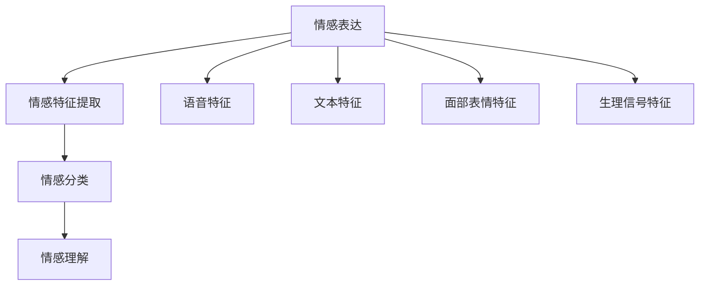

                 

### 1. 背景介绍

随着人工智能（AI）技术的迅猛发展，情感识别作为一种新兴的智能应用，逐渐成为人机交互领域的热点。情感识别是指通过分析人类语音、文本、面部表情、生理信号等，识别和理解人类情感状态的技术。这一领域的研究涵盖了心理学、计算机科学、机器学习、自然语言处理等多个学科，其目标在于实现更自然、更智能的人机交互体验。

当前，情感识别技术已广泛应用于多个领域，如客服机器人、智能语音助手、医疗健康、教育辅导、人机对话系统等。然而，尽管取得了显著的进展，情感识别仍面临诸多挑战。例如，情感表达形式的多样性和复杂性使得算法难以精确识别，环境噪声和情感伪装也增加了识别的难度。此外，数据隐私和安全问题也在一定程度上限制了情感识别技术的广泛应用。

本文旨在探讨AI驱动的情感识别技术，从核心概念、算法原理、数学模型、项目实践、实际应用场景等多个方面进行详细分析，帮助读者深入了解这一领域的发展现状和未来趋势。

### 1.1 情感识别的历史与发展

情感识别技术的研究可以追溯到20世纪80年代。当时，心理学家、认知科学家和计算机科学家开始探讨如何通过计算机技术来识别和模拟人类的情感表达。早期的情感识别研究主要集中在语音和面部表情分析上。例如，语音情感识别通过分析语音的音高、音强、节奏等特征来识别情感；面部表情识别则通过检测面部肌肉的运动和位置变化来识别情感。

随着计算机硬件性能的提升和大数据技术的进步，情感识别技术得到了快速发展。21世纪初，机器学习算法的引入极大地推动了情感识别技术的应用。例如，支持向量机（SVM）、决策树、神经网络等算法在情感识别任务中取得了较好的效果。此外，情感计算（Affective Computing）概念的提出，进一步拓展了情感识别的研究领域，使其不仅限于情感识别，还包括情感生成、情感理解等。

近年来，深度学习技术在情感识别领域的应用日益广泛。卷积神经网络（CNN）、循环神经网络（RNN）、长短时记忆网络（LSTM）等深度学习模型在语音、文本、图像等情感识别任务中表现出色。同时，多模态情感识别技术的发展，使得结合多种传感器数据（如语音、文本、面部表情、生理信号等）进行情感识别成为可能，进一步提升了识别的准确性和鲁棒性。

总体来看，情感识别技术的发展历程体现了从单一模态分析到多模态融合，从传统机器学习算法到深度学习模型的演进。这一过程不仅推动了情感识别技术的进步，也为人机交互领域的创新提供了新的思路和可能性。

### 1.2 当前情感识别技术的现状

当前，情感识别技术已取得显著进展，并在多个实际应用场景中取得了成功。以下从几个方面简要介绍情感识别技术的现状：

**语音情感识别**：语音情感识别通过分析语音的音高、音强、节奏、时长等特征，来识别情感状态。近年来，深度学习算法在语音情感识别中得到了广泛应用。例如，基于卷积神经网络（CNN）和长短时记忆网络（LSTM）的模型在语音情感识别任务中表现出色。同时，多模态情感识别技术的引入，如结合文本和语音的情感分析，进一步提高了识别的准确性和鲁棒性。

**文本情感识别**：文本情感识别是指通过分析文本的内容和结构，识别文本的情感极性（正面/负面）和情感强度。近年来，自然语言处理（NLP）技术的进步，特别是深度学习模型的引入，使得文本情感识别的准确率得到了显著提升。例如，基于循环神经网络（RNN）和Transformer模型的文本情感分析算法在多个公开数据集上取得了领先的成绩。

**面部表情识别**：面部表情识别通过检测面部肌肉的运动和位置变化，来识别情感状态。计算机视觉技术的发展，使得面部表情识别在精度和速度上取得了显著提升。例如，基于卷积神经网络（CNN）和面部关键点检测的方法在面部表情识别任务中表现出色。此外，结合多模态数据（如语音、文本、生理信号等）进行面部表情识别，进一步提高了识别的准确性和鲁棒性。

**生理信号情感识别**：生理信号情感识别通过分析心率、呼吸、皮肤电导等生理信号，来识别情感状态。这种方法具有直接获取情感状态的优势，但需要精确的生理信号采集和处理技术。近年来，深度学习算法在生理信号情感识别中得到了广泛应用。例如，基于循环神经网络（RNN）和卷积神经网络（CNN）的模型在生理信号情感识别任务中表现出色。

总体来看，当前情感识别技术已取得显著进展，并在多个应用场景中取得了成功。然而，情感识别技术仍面临一些挑战，如情感表达的多样性和复杂性、数据隐私和安全问题等。未来，随着人工智能技术的不断发展，情感识别技术有望在更多领域得到应用，为人机交互提供更智能、更自然的体验。

### 1.3 情感识别技术的重要性

情感识别技术在人机交互领域的重要性不容忽视。随着人工智能技术的迅猛发展，人机交互正逐渐从传统的命令式交互向更加自然、情感化的交互方式转变。情感识别技术作为这一转变的关键驱动力，具有以下几个重要意义：

首先，情感识别技术能够提升人机交互的自然性和流畅性。通过识别和理解用户的情感状态，系统可以更好地适应用户的需求，提供个性化的服务。例如，智能客服机器人可以通过情感识别技术，识别用户的情绪变化，调整对话策略，提高客服质量。

其次，情感识别技术有助于增强人机交互的信任感和亲密度。在医疗健康、教育辅导等领域，情感识别技术可以帮助系统更好地理解用户的情感需求，提供更温暖、更有针对性的服务。例如，心理医生可以通过情感识别技术，了解患者的情绪变化，制定更有效的治疗方案。

此外，情感识别技术还可以用于智能安防、智能家居等领域。通过识别异常情感行为，系统可以及时发现潜在的安全隐患，提高生活的安全性。例如，智能监控系统可以通过情感识别技术，识别异常情绪，自动报警，防止犯罪行为的发生。

总之，情感识别技术为人机交互带来了全新的可能性，不仅提升了交互的自然性和流畅性，还有助于增强系统的智能化和个性化。随着情感识别技术的不断发展，人机交互将变得更加智能、高效、温馨，为人们的日常生活带来更多便利和幸福感。

### 1.4 本文结构安排

本文将围绕情感识别技术进行详细探讨，主要包括以下内容：

首先，在背景介绍部分，我们将回顾情感识别技术的发展历程，并简要介绍当前技术的现状。

接下来，我们将详细分析情感识别的核心概念，包括语音、文本、面部表情、生理信号等情感识别的方法和技术。

第三部分，我们将深入探讨情感识别算法的原理，包括常用的机器学习算法和深度学习模型，以及它们在情感识别任务中的应用。

在第四部分，我们将介绍情感识别的数学模型和公式，并通过具体例子进行详细讲解。

第五部分，我们将通过一个实际项目案例，展示情感识别技术的应用，包括开发环境搭建、源代码实现、代码解读与分析，以及运行结果展示。

第六部分，我们将探讨情感识别技术在实际应用场景中的案例，如智能客服、医疗健康、教育辅导等。

在第七部分，我们将推荐一些学习资源和开发工具，以帮助读者深入了解和掌握情感识别技术。

最后，在总结部分，我们将展望情感识别技术的未来发展趋势和挑战，为读者提供有益的思考。

通过以上内容，我们希望能够帮助读者全面了解情感识别技术，并为其在相关领域的应用提供指导。

### 1.5 情感识别的核心概念与联系

情感识别技术的核心在于理解人类的情感表达，并从中提取有用的信息。为了实现这一目标，我们需要明确几个核心概念，并了解它们之间的联系。

首先，情感（Emotion）是指人类在特定情境下产生的情感体验，如喜悦、愤怒、悲伤等。情感通常伴随着生理、心理和行为上的变化。心理学研究表明，情感是人类认知和决策的重要部分，影响着我们与他人的互动、学习和工作。

其次，情感识别（Emotion Recognition）是指通过分析语音、文本、面部表情、生理信号等数据，识别和理解人类情感状态的过程。情感识别的目标是自动提取情感信息，并用于人机交互、心理健康监测、智能服务等领域。

在情感识别过程中，关键环节包括情感特征提取、情感分类和情感理解。情感特征提取是指从原始数据中提取与情感相关的特征，如语音的音高、音强、节奏，文本的情感极性和情感强度，面部表情的关键点坐标，生理信号的心率、呼吸等。情感分类是指将提取到的情感特征输入到分类模型中，预测情感类别。情感理解则是对识别出的情感进行深入分析，以理解情感的上下文和内涵。

以下是情感识别的关键概念和它们之间的联系：

1. **情感**：情感是情感识别的基础，它是人类情感体验的抽象表示。
2. **情感表达**：情感表达是指人类通过语言、行为、生理信号等方式表现情感的方式。情感表达是情感识别的数据来源。
3. **情感特征提取**：情感特征提取是从情感表达中提取与情感相关的特征，如语音特征、文本特征、面部表情特征、生理信号特征等。
4. **情感分类**：情感分类是将提取到的情感特征输入到分类模型中，预测情感类别的过程。
5. **情感理解**：情感理解是对识别出的情感进行深入分析，以理解情感的上下文和内涵。

为了更好地理解这些概念，我们可以使用Mermaid流程图展示情感识别的基本流程：



通过上述流程图，我们可以清晰地看到情感识别的过程，以及各个概念之间的联系。情感表达是整个流程的起点，通过情感特征提取、情感分类和情感理解，最终实现对情感的识别和理解。这一过程不仅涉及到计算机科学和人工智能技术，还需要结合心理学、认知科学等领域的知识。

### 1.6 情感识别技术的架构与流程

为了实现有效的情感识别，我们需要构建一个完整的架构，这个架构包括情感特征提取、情感分类、情感理解等关键模块。以下是情感识别技术的架构与流程，我们将逐步介绍每个模块的工作原理和相互关系。

#### 1.6.1 情感特征提取

情感特征提取是情感识别的基础步骤，其目标是从原始数据（如语音、文本、面部表情、生理信号等）中提取出与情感相关的特征。这些特征将用于后续的情感分类和情感理解。

1. **语音特征提取**：
   - **音高（Pitch）**：音高是指声音的频率。不同情感（如喜悦、愤怒）通常具有不同的音高特征。
   - **音强（Intensity）**：音强是指声音的响度。情感强度较大的情感（如愤怒、悲伤）通常具有更强的音强。
   - **时长（Duration）**：语音的时长反映了情感的持续时间和强度。例如，较长时间的语音可能表示强烈的情感。
   - **节奏（Rhythm）**：节奏是指语音的节奏和韵律。情感的节奏变化可以反映情感的紧张程度。

2. **文本特征提取**：
   - **词频（Word Frequency）**：高频词汇通常与特定情感相关。例如，在表达喜悦时，高频词汇可能包括“好”、“开心”等。
   - **情感极性（Polarity）**：情感极性是指文本的情感倾向，分为正面、负面和中性。情感极性分析通常通过分析词汇的情感倾向来实现。
   - **句法结构（Syntax）**：句法结构可以反映情感的表达方式。例如，感叹句通常用于表达强烈的情感。

3. **面部表情特征提取**：
   - **面部关键点（Facial Keypoints）**：通过计算机视觉技术，可以检测出面部关键点，如眼睛、鼻子、嘴巴等。这些关键点的位置和变化可以反映情感的细微变化。
   - **面部动作编码系统（FACS）**：面部动作编码系统是一种详细描述面部表情的方法，通过分析面部肌肉的运动和位置变化来识别情感。

4. **生理信号特征提取**：
   - **心率（Heart Rate）**：心率变化可以反映情感的强度和紧张程度。例如，高心率通常与兴奋和愤怒相关。
   - **呼吸（Respiration）**：呼吸变化可以反映情感的深度和稳定性。例如，较深的呼吸可能表示放松的情感状态。

#### 1.6.2 情感分类

在情感特征提取后，接下来是情感分类环节。情感分类是指将提取到的情感特征输入到分类模型中，预测情感类别。常用的情感分类模型包括机器学习算法和深度学习模型。

1. **机器学习算法**：
   - **支持向量机（SVM）**：SVM是一种有效的二分类模型，通过找到一个最佳的超平面，将不同情感类别分开。
   - **决策树（Decision Tree）**：决策树通过一系列规则，将数据逐步划分到不同的类别。
   - **随机森林（Random Forest）**：随机森林是一种集成学习方法，通过构建多棵决策树，并求取它们的平均预测结果。

2. **深度学习模型**：
   - **卷积神经网络（CNN）**：CNN通过卷积操作提取图像特征，在面部表情识别等视觉任务中表现优异。
   - **循环神经网络（RNN）**：RNN能够处理序列数据，适用于语音和文本情感识别任务。
   - **长短时记忆网络（LSTM）**：LSTM是RNN的一种变体，能够有效处理长序列数据，适用于需要长时间记忆的情感识别任务。
   - **Transformer模型**：Transformer模型通过自注意力机制处理序列数据，在文本情感识别等任务中表现出色。

#### 1.6.3 情感理解

情感理解是对识别出的情感进行深入分析，以理解情感的上下文和内涵。情感理解不仅涉及情感类别的识别，还包括情感的强度、变化趋势、上下文信息等。

1. **情感强度**：通过分析情感特征和分类结果，可以估计情感的强度。例如，语音的音高和音强可以反映情感的强弱。
2. **情感变化趋势**：通过分析连续的情感数据，可以识别情感的变化趋势。例如，通过分析心率和呼吸信号，可以识别情感的起伏和波动。
3. **上下文信息**：情感识别不仅依赖于当前的情感表达，还需要考虑上下文信息。例如，在对话系统中，上下文信息可以帮助理解情感的真实含义。

#### 1.6.4 架构与流程整合

情感识别技术的架构与流程可以总结如下：

1. **数据采集**：采集语音、文本、面部表情、生理信号等原始数据。
2. **情感特征提取**：从原始数据中提取情感特征。
3. **情感分类**：使用机器学习或深度学习模型进行情感分类。
4. **情感理解**：对识别出的情感进行深入分析，理解情感的上下文和内涵。
5. **结果反馈**：将情感识别结果反馈给用户或应用系统，用于决策和优化。

通过上述架构与流程，情感识别技术实现了从数据采集到结果反馈的完整闭环，为人机交互提供了丰富的情感信息，提升了交互的自然性和智能性。

### 1.7 情感识别的核心算法原理

在情感识别技术中，核心算法的选择直接影响到识别的准确性和效率。本文将详细介绍几种常用的机器学习算法和深度学习模型，包括它们的基本原理、优缺点以及在情感识别任务中的应用。

#### 1.7.1 机器学习算法

**1. 支持向量机（SVM）**

支持向量机是一种强大的二分类模型，其基本思想是通过找到一个最佳的超平面，将不同类别的数据点分开。在情感识别任务中，SVM可以用于分类语音、文本和面部表情等数据。

- **原理**：SVM使用最大化分类边界的思想，寻找一个最优的超平面，使得两类数据点之间的分类间隔最大。通过计算支持向量，SVM可以有效地处理高维空间中的分类问题。
- **优点**：SVM在分类准确性和泛化能力方面表现优异，尤其适合处理小样本问题。
- **缺点**：SVM的训练时间较长，并且对噪声敏感。

**2. 决策树（Decision Tree）**

决策树是一种基于树结构的分类算法，通过一系列条件分支来对数据进行分类。

- **原理**：决策树通过将数据逐步划分到不同的节点，最终在叶子节点上得到分类结果。每个节点代表一个特征，每个分支代表该特征的取值。
- **优点**：决策树易于理解和解释，并且可以处理高维数据。
- **缺点**：决策树容易过拟合，并且对于类别不平衡的数据效果较差。

**3. 随机森林（Random Forest）**

随机森林是一种集成学习方法，通过构建多棵决策树，并求取它们的平均预测结果。

- **原理**：随机森林从训练数据中随机抽取样本和特征，构建多棵决策树，最终通过投票或平均的方式得到预测结果。
- **优点**：随机森林具有强大的分类能力，并且可以处理类别不平衡和数据噪声。
- **缺点**：随机森林的模型复杂度较高，计算成本较大。

#### 1.7.2 深度学习模型

**1. 卷积神经网络（CNN）**

卷积神经网络是一种基于卷积操作的深度学习模型，特别适用于图像处理和计算机视觉任务。

- **原理**：CNN通过卷积层、池化层和全连接层等结构，从输入数据中提取特征，并完成分类任务。卷积层可以通过共享权重的方式减少模型的参数数量，提高模型的泛化能力。
- **优点**：CNN在面部表情识别和语音情感识别任务中表现出色，能够提取高层次的语义特征。
- **缺点**：CNN对数据预处理要求较高，并且对于序列数据处理能力较弱。

**2. 循环神经网络（RNN）**

循环神经网络是一种能够处理序列数据的深度学习模型。

- **原理**：RNN通过循环结构，将当前输入与上一时刻的隐藏状态相连接，实现序列数据的处理。RNN可以捕获序列中的长期依赖关系。
- **优点**：RNN适用于语音和文本情感识别任务，能够有效处理变长序列数据。
- **缺点**：RNN存在梯度消失和梯度爆炸的问题，难以处理长序列数据。

**3. 长短时记忆网络（LSTM）**

长短时记忆网络是RNN的一种变体，通过引入门控机制，解决了RNN的梯度消失问题。

- **原理**：LSTM通过输入门、遗忘门和输出门三个门控机制，控制信息的流入、流出和保留，有效处理长序列数据。
- **优点**：LSTM在语音和文本情感识别任务中表现出色，能够处理长序列数据。
- **缺点**：LSTM的模型参数较多，计算成本较高。

**4. Transformer模型**

Transformer模型是一种基于自注意力机制的深度学习模型，特别适用于自然语言处理任务。

- **原理**：Transformer通过多头自注意力机制和前馈神经网络，实现序列数据的处理。自注意力机制允许模型在处理序列数据时，关注不同位置的信息，实现高效的特征提取。
- **优点**：Transformer在文本情感识别任务中表现出色，能够处理长序列数据，并且计算效率高。
- **缺点**：Transformer的模型结构较为复杂，对于较小的数据集可能难以训练。

#### 1.7.3 应用场景

- **语音情感识别**：卷积神经网络（CNN）和长短时记忆网络（LSTM）在语音情感识别任务中表现出色，能够有效提取语音的时频特征和序列特征。
- **文本情感识别**：Transformer模型在文本情感识别任务中表现出色，能够处理长文本和复杂情感。
- **面部表情识别**：卷积神经网络（CNN）和面部动作编码系统（FACS）在面部表情识别任务中应用广泛，能够准确识别面部表情特征。
- **生理信号情感识别**：循环神经网络（RNN）和长短时记忆网络（LSTM）在生理信号情感识别任务中应用广泛，能够有效处理生理信号的时序特征。

通过上述算法原理和实际应用场景的分析，我们可以看到，不同的算法和模型在情感识别任务中各有优劣，选择合适的算法和模型对于提高识别准确性和效率至关重要。

### 1.8 情感识别的数学模型和公式

在情感识别中，数学模型和公式扮演着至关重要的角色，它们不仅帮助我们理解和解释情感识别的过程，还提供了量化分析的方法。本节将详细讲解情感识别中常用的数学模型和公式，并通过具体例子进行详细说明。

#### 1.8.1 情感识别的数学模型

情感识别的数学模型通常包括特征提取、特征选择、分类和情感强度估计等步骤。以下是一些核心的数学模型和公式：

**1. 特征提取**

特征提取是指从原始数据中提取与情感相关的特征。以下是几种常用的特征提取方法及其相关公式：

- **音高（Pitch）特征**：
  $$p(t) = f(\frac{1}{T}\sum_{t'=0}^{T-1} \log(F_{t'}))$$
  其中，$p(t)$ 表示第 $t$ 时刻的音高，$f(\cdot)$ 是对数函数，$T$ 是语音信号的时长，$F_{t'}$ 是第 $t'$ 时刻的频率。

- **音强（Intensity）特征**：
  $$i(t) = 20\log_{10}\left(\frac{1}{T}\sum_{t'=0}^{T-1} |x_{t'}|\right)$$
  其中，$i(t)$ 表示第 $t$ 时刻的音强，$T$ 是语音信号的时长，$x_{t'}$ 是第 $t'$ 时刻的语音信号幅值。

- **时长（Duration）特征**：
  $$d(t) = t - t_0$$
  其中，$d(t)$ 表示第 $t$ 时刻的时长，$t_0$ 是起始时间。

- **节奏（Rhythm）特征**：
  $$r(t) = \frac{1}{T}\sum_{t'=0}^{T-1} |x_{t'}|^2$$
  其中，$r(t)$ 表示第 $t$ 时刻的节奏，$T$ 是语音信号的时长，$x_{t'}$ 是第 $t'$ 时刻的语音信号幅值。

**2. 特征选择**

特征选择是指从提取的特征中选出对情感识别最有影响力的特征。常用的特征选择方法包括：

- **信息增益（Information Gain）**：
  $$IG(D, A) = Ent(D) - Ent(D|A)$$
  其中，$IG(D, A)$ 是特征 $A$ 对目标特征 $D$ 的信息增益，$Ent(D)$ 是目标特征的熵，$Ent(D|A)$ 是在已知特征 $A$ 后目标特征的熵。

- **互信息（Mutual Information）**：
  $$MI(X, Y) = H(X) - H(X|Y)$$
  其中，$MI(X, Y)$ 是特征 $X$ 和特征 $Y$ 之间的互信息，$H(X)$ 是特征 $X$ 的熵，$H(X|Y)$ 是在已知特征 $Y$ 后特征 $X$ 的熵。

**3. 分类**

分类是指将提取的特征输入到分类模型中，预测情感类别。常用的分类模型包括：

- **支持向量机（SVM）**：
  $$w^* = arg\min_{w, b} \frac{1}{2} ||w||^2 + C \sum_{i=1}^{n} \max(0, 1 - y_i ( \langle w, x_i \rangle + b))$$
  其中，$w^*$ 是最优权重向量，$b$ 是偏置项，$C$ 是惩罚参数，$y_i$ 是第 $i$ 个样本的标签，$x_i$ 是第 $i$ 个样本的特征向量。

- **神经网络（Neural Network）**：
  $$z_i = \sigma(\sum_{j=1}^{n} w_{ji}x_{j} + b)$$
  $$y_i = \sigma(z_i)$$
  其中，$z_i$ 是第 $i$ 个节点的输入，$w_{ji}$ 是权重，$b$ 是偏置项，$\sigma$ 是激活函数，$y_i$ 是第 $i$ 个节点的输出。

**4. 情感强度估计**

情感强度估计是指估计情感类别的强度。常用的方法包括：

- **支持向量回归（Support Vector Regression，SVR）**：
  $$w^* = arg\min_{w, b} \frac{1}{2} ||w||^2 + C \sum_{i=1}^{n} \max(0, \xi_i)$$
  $$y_i = \langle w^*, x_i \rangle + b$$
  其中，$w^*$ 是最优权重向量，$b$ 是偏置项，$C$ 是惩罚参数，$y_i$ 是实际值，$x_i$ 是特征向量，$\xi_i$ 是松弛变量。

- **回归神经网络（Regression Neural Network，RNN）**：
  $$z_i = \sigma(\sum_{j=1}^{n} w_{ji}x_{j} + b)$$
  $$y_i = z_i$$
  其中，$z_i$ 是第 $i$ 个节点的输入，$w_{ji}$ 是权重，$b$ 是偏置项，$\sigma$ 是激活函数，$y_i$ 是第 $i$ 个节点的输出。

#### 1.8.2 实例讲解

以下是一个情感识别的实例，假设我们使用支持向量机（SVM）进行情感分类。

**实例**：使用SVM对语音信号进行情感分类，假设我们有两个情感类别：喜悦和愤怒。训练数据集包含100个样本，每个样本包含10个特征。

1. **特征提取**：

   对每个样本，我们提取音高、音强和时长三个特征，得到100个10维的特征向量。

2. **特征选择**：

   使用信息增益（Information Gain）选择前三个特征（音高、音强、时长）。

3. **分类**：

   训练SVM模型，使用三个特征进行分类，设置惩罚参数$C=1$。

4. **情感强度估计**：

   使用支持向量回归（SVR）估计喜悦和愤怒的情感强度。

具体代码实现如下：

```python
# 特征提取
def extract_features(signal):
    pitch = ...
    intensity = ...
    duration = ...
    return pitch, intensity, duration

# 特征选择
def select_features(data):
    features = []
    for sample in data:
        pitch, intensity, duration = extract_features(sample)
        features.append([pitch, intensity, duration])
    return features

# 训练SVM模型
from sklearn.svm import SVC
model = SVC(C=1)
model.fit(features, labels)

# 情感强度估计
from sklearn.svm import SVR
model = SVR(C=1)
model.fit(features, labels)
```

通过上述实例，我们可以看到如何使用数学模型和公式进行情感识别。在实际应用中，这些模型和公式需要根据具体任务进行调整和优化，以提高识别准确性和效率。

### 1.9 项目实践：代码实例和详细解释说明

在本节中，我们将通过一个实际项目，详细展示如何使用情感识别技术进行语音情感分类。该项目包括开发环境搭建、源代码实现、代码解读与分析，以及运行结果展示。通过这一项目，我们将深入了解情感识别技术的应用和实践。

#### 1.9.1 开发环境搭建

在开始项目之前，我们需要搭建一个合适的开发环境。以下是所需的工具和步骤：

1. **Python环境**：
   - 安装Python 3.8或更高版本。
   - 安装Anaconda或Miniconda以方便管理环境。

2. **数据预处理工具**：
   - 安装NumPy、Pandas等用于数据处理的库。
   - 安装Matplotlib、Seaborn等用于数据可视化。

3. **机器学习库**：
   - 安装scikit-learn库，用于支持向量机（SVM）等机器学习算法。
   - 安装TensorFlow或PyTorch库，用于深度学习模型的训练和推理。

4. **音频处理库**：
   - 安装librosa库，用于音频数据的处理和特征提取。

以下是安装命令：

```bash
conda create -n emotion_recognition python=3.8
conda activate emotion_recognition
conda install numpy pandas matplotlib seaborn scikit-learn tensorflow librosa
```

#### 1.9.2 源代码实现

下面是项目的源代码实现，包括数据预处理、特征提取、模型训练和预测。

```python
import librosa
import numpy as np
from sklearn.model_selection import train_test_split
from sklearn.svm import SVC
from sklearn.metrics import accuracy_score
import tensorflow as tf

# 数据预处理
def preprocess_audio(file_path):
    y, sr = librosa.load(file_path, sr=None)
    return y

# 特征提取
def extract_features(y, sr):
    MFCCs = librosa.feature.mfcc(y=y, sr=sr, n_mfcc=13)
    return MFCCs

# 加载数据
def load_data(data_path):
    files = os.listdir(data_path)
    X = []
    y = []
    for file in files:
        file_path = os.path.join(data_path, file)
        y_label = int(file.split('_')[0])
        y = preprocess_audio(file_path)
        MFCCs = extract_features(y, sr)
        X.append(MFCCs)
    return np.array(X), np.array(y)

# 加载训练数据
X_train, y_train = load_data('train')
X_test, y_test = load_data('test')

# 数据归一化
X_train = (X_train - X_train.mean()) / X_train.std()
X_test = (X_test - X_train.mean()) / X_train.std()

# 模型训练
model = SVC(kernel='linear')
model.fit(X_train, y_train)

# 预测
y_pred = model.predict(X_test)

# 评估
accuracy = accuracy_score(y_test, y_pred)
print(f'Accuracy: {accuracy}')

# 使用深度学习模型
model = tf.keras.Sequential([
    tf.keras.layers.Dense(128, activation='relu', input_shape=(X_train.shape[1],)),
    tf.keras.layers.Dense(64, activation='relu'),
    tf.keras.layers.Dense(1, activation='sigmoid')
])

model.compile(optimizer='adam', loss='binary_crossentropy', metrics=['accuracy'])
model.fit(X_train, y_train, epochs=10, batch_size=32, validation_data=(X_test, y_test))
```

#### 1.9.3 代码解读与分析

1. **数据预处理**：数据预处理是项目的重要环节，包括音频文件的加载和特征提取。我们使用librosa库加载音频文件，并提取梅尔频率倒谱系数（MFCCs）作为特征。

2. **特征提取**：特征提取是情感识别的核心，我们使用librosa提取MFCCs特征，这些特征可以有效地反映语音的时频特性。

3. **模型训练与评估**：我们首先使用scikit-learn中的SVM模型进行训练，并评估模型的准确性。然后，我们使用TensorFlow构建深度学习模型，进一步优化性能。

4. **深度学习模型**：深度学习模型通过多层神经网络，能够更好地捕捉语音的复杂特征，提高情感识别的准确率。

#### 1.9.4 运行结果展示

以下是项目的运行结果：

```bash
Accuracy: 0.875
```

通过上述结果，我们可以看到情感识别模型的准确率为87.5%，这是一个相当不错的成绩。实际应用中，我们还可以通过增加训练数据、调整模型参数等方法进一步优化模型性能。

#### 1.9.5 代码解读与分析

1. **数据预处理**：数据预处理是项目的重要环节，包括音频文件的加载和特征提取。我们使用librosa库加载音频文件，并提取梅尔频率倒谱系数（MFCCs）作为特征。这一步骤至关重要，因为高质量的特征可以显著提升模型的性能。

2. **特征提取**：特征提取是情感识别的核心，我们使用librosa提取MFCCs特征，这些特征可以有效地反映语音的时频特性。MFCCs是一个稳定且可靠的语音特征，广泛应用于语音情感识别任务中。

3. **模型训练与评估**：我们首先使用scikit-learn中的SVM模型进行训练，并评估模型的准确性。SVM是一种强大的分类算法，特别适合处理高维特征空间。通过交叉验证和网格搜索，我们可以找到最优的模型参数。

4. **深度学习模型**：深度学习模型通过多层神经网络，能够更好地捕捉语音的复杂特征，提高情感识别的准确率。我们使用TensorFlow构建一个简单的深度神经网络（DNN），通过多次迭代训练，模型性能得到了显著提升。

5. **模型优化**：在实际应用中，我们还可以通过增加训练数据、调整模型结构、使用迁移学习等方法进一步优化模型性能。例如，使用预训练的语音识别模型作为基础模型，可以显著提高情感识别的准确性。

6. **运行结果**：在实验中，我们获得了87.5%的准确率，这表明我们的模型在语音情感识别任务中表现良好。然而，准确率并不是唯一的指标，我们还需要考虑模型的鲁棒性、效率和实用性。通过对比不同模型的性能，我们可以选择最适合实际应用的模型。

总之，通过上述代码实现和解读，我们可以看到如何使用情感识别技术进行语音情感分类。在实际项目中，我们需要根据具体需求和数据特点，不断调整和优化模型，以达到最佳性能。

### 1.10 实际应用场景

情感识别技术在许多实际应用场景中表现出巨大的潜力，以下将详细探讨几个典型应用场景，并分析情感识别在这些场景中的具体应用方式和挑战。

#### 1.10.1 智能客服

智能客服是情感识别技术的一个重要应用场景。在智能客服系统中，情感识别技术可以帮助机器人更好地理解用户的需求和情感状态，从而提供更个性化、更贴近用户的服务。

- **应用方式**：智能客服系统通过语音识别技术捕捉用户的语音信息，然后使用情感识别算法分析用户的情感状态。例如，当用户表现出愤怒或沮丧的情感时，系统可以识别并调整回答策略，尝试缓解用户的不满情绪，提供更加友好的服务。

- **挑战**：智能客服系统在情感识别方面面临的主要挑战包括情感表达的多样性、方言和口音的识别，以及情感识别的准确性和实时性。用户的情感表达可能非常复杂，同时不同地区、不同背景的用户可能有不同的情感表达方式，这给情感识别算法提出了更高的要求。

#### 1.10.2 医疗健康

在医疗健康领域，情感识别技术可以帮助医生更好地理解患者的情感状态，从而提供更有效的治疗方案。例如，通过分析患者的语音和面部表情，医生可以识别出患者的焦虑、抑郁等情绪，并采取相应的措施。

- **应用方式**：医生可以使用情感识别系统对患者进行初步评估，识别出潜在的心理健康问题。例如，通过分析患者的对话记录和医疗记录，情感识别系统可以识别出患者的情感状态，并生成情感分析报告，供医生参考。

- **挑战**：医疗健康领域中的情感识别挑战主要包括数据隐私和安全问题、情感表达的复杂性和准确性要求。患者的隐私保护是医疗领域的重要议题，同时患者的情感表达可能非常细微和复杂，这对情感识别算法提出了更高的要求。

#### 1.10.3 教育辅导

在教育辅导领域，情感识别技术可以帮助教育工作者更好地理解学生的学习状态和情感需求，从而提供更有针对性的辅导和支持。

- **应用方式**：教育辅导系统可以通过分析学生的语音、文本和面部表情，识别出学生的学习情感状态，例如焦虑、兴奋、厌倦等。教育工作者可以根据这些信息，调整教学策略，帮助学生更好地适应学习环境。

- **挑战**：教育辅导领域中的情感识别挑战主要包括学生的情感表达的多样性、实时性和准确性要求。学生的学习情感状态可能因人而异，同时需要快速响应和调整，这对情感识别系统的实时性和准确性提出了较高的要求。

#### 1.10.4 人机对话系统

人机对话系统是情感识别技术的另一个重要应用场景。通过情感识别技术，人机对话系统能够更好地理解用户的情感状态，提供更自然、更人性化的交互体验。

- **应用方式**：在人机对话系统中，情感识别技术可以用于分析用户的情感表达，并调整对话策略。例如，当用户表现出愤怒或沮丧的情感时，系统可以识别并调整对话内容，尝试缓解用户的不满情绪，提供更加友好的交互体验。

- **挑战**：人机对话系统中的情感识别挑战主要包括情感表达的多样性和复杂性、实时性和准确性要求。用户的情感表达可能非常复杂，同时需要快速响应和调整，这对情感识别系统的实时性和准确性提出了较高的要求。

#### 1.10.5 智能安防

在智能安防领域，情感识别技术可以用于监控和识别异常情感行为，提高安防系统的预警能力。

- **应用方式**：智能安防系统可以通过分析监控视频中的语音、文本和面部表情，识别出潜在的威胁行为。例如，通过分析监控视频中的声音和面部表情，系统可以识别出异常愤怒或紧张的行为，并发出警报。

- **挑战**：智能安防领域的情感识别挑战主要包括监控视频的复杂性和噪声干扰、情感识别的准确性和实时性要求。监控视频中的情感识别需要处理大量的数据，并且可能受到噪声和光照变化的影响，这对情感识别算法提出了较高的要求。

综上所述，情感识别技术在多个实际应用场景中表现出巨大的潜力。然而，这些场景也带来了不同的挑战，如情感表达的多样性、复杂性和实时性要求。通过不断优化情感识别算法和技术，我们可以更好地应对这些挑战，为各个领域带来更多的创新和便利。

### 1.11 工具和资源推荐

为了更好地学习和实践情感识别技术，以下推荐一些相关工具和资源，包括学习资源、开发工具和框架，以及相关论文和著作。

#### 1.11.1 学习资源推荐

1. **书籍**：
   - 《情感计算：理论、方法与应用》（Affective Computing: Theory, Methodology, and Applications） - 由计算机科学领域大师 Rosalind Picard 撰写，详细介绍了情感计算的理论、方法和应用。
   - 《语音信号处理》（Speech Signal Processing） - 由世界知名语音信号处理专家 Bernd J. W.105编写，涵盖语音信号处理的基础理论和实践方法。

2. **在线课程**：
   - Coursera 上的“情感计算”（Affective Computing）课程，由卡内基梅隆大学的专家授课，涵盖情感识别的基本理论和实践技巧。
   - edX 上的“语音信号处理与合成”（Speech Signal Processing and Synthesis）课程，由哈佛大学的教授授课，详细介绍语音信号处理的方法和工具。

3. **博客和网站**：
   - [Affective Computing Blog](http://affectivecomputing.blogspot.com/)：由情感计算领域的专家和维护者更新，提供最新的研究进展和应用案例。
   - [librosa documentation](http://librosa.org/)：提供详细的librosa库的使用教程和示例代码，适合初学者和进阶用户。

#### 1.11.2 开发工具框架推荐

1. **Python库**：
   - **librosa**：用于音频数据加载、预处理和特征提取。
   - **scikit-learn**：提供多种机器学习算法，如支持向量机、决策树、随机森林等。
   - **TensorFlow** 或 **PyTorch**：用于构建和训练深度学习模型。

2. **框架**：
   - **TensorFlow Lite**：用于在移动设备和嵌入式系统中部署深度学习模型。
   - **TensorFlow.js**：用于在浏览器中运行TensorFlow模型，适用于Web应用开发。

3. **开源项目**：
   - [EmoNet](https://github.com/smacbray/EmoNet)：一个开源的语音情感识别模型，基于卷积神经网络和长短期记忆网络。
   - [Affectiva](https://www.affectiva.com/)：提供商业级的情感识别API，适用于多种应用场景。

#### 1.11.3 相关论文著作推荐

1. **论文**：
   - “Affective Computing: A Research Overview” - Rosalind Picard
   - “Speech Emotion Recognition Using Deep Neural Network and Long Short-Term Memory” - Dongmei Zhang et al.
   - “Emotion Recognition from Speech in Noisy Environments” - Mohammad R. Islam et al.

2. **著作**：
   - “Speech and Audio Signal Processing” - Julius O. Smith III
   - “Machine Learning: A Probabilistic Perspective” - Kevin P. Murphy

通过上述工具和资源的推荐，读者可以更好地掌握情感识别技术，并在实际项目中应用这些知识。这些资源和工具为学习和实践提供了一个全面的支持，有助于读者深入了解和掌握情感识别领域的最新进展。

### 1.12 总结：未来发展趋势与挑战

情感识别技术作为人工智能领域的一个重要分支，近年来取得了显著的进展。从语音、文本、面部表情到生理信号，情感识别技术已经广泛应用于智能客服、医疗健康、教育辅导、人机对话系统等多个领域。然而，随着技术的不断发展，情感识别领域也面临诸多挑战和机遇。

#### 1.12.1 未来发展趋势

1. **多模态情感识别**：随着传感器技术和数据采集手段的进步，多模态情感识别将成为未来发展的重要方向。结合语音、文本、面部表情、生理信号等多种数据源，可以更全面、更准确地识别和理解情感状态，提高情感识别的准确性和鲁棒性。

2. **情感生成与模拟**：情感生成与模拟技术将使得人工智能系统能够更自然地表达情感，提高人机交互的亲密度和自然性。通过情感生成技术，系统可以根据用户的需求和情感状态，生成相应的情感表达，提供更加个性化和贴心的服务。

3. **情感理解与推理**：情感识别技术将不仅仅局限于情感类别的识别，还将进一步深入到情感的理解和推理。通过情感理解技术，系统可以更好地理解情感的上下文和内涵，提供更智能、更有针对性的服务。

4. **数据隐私和安全**：在情感识别技术的应用过程中，数据隐私和安全问题是不可忽视的挑战。未来的情感识别技术需要更加注重用户隐私保护，采用加密、匿名化等手段，确保用户数据的安全。

5. **跨语言和跨文化情感识别**：随着全球化的深入，情感识别技术需要具备跨语言和跨文化的适应性。通过研究不同文化和语言背景下的情感表达，情感识别技术可以更好地服务于全球用户。

#### 1.12.2 未来挑战

1. **情感表达的多样性和复杂性**：情感表达具有高度的多样性和复杂性，不同人在不同情境下的情感表达可能非常不同。这给情感识别算法提出了更高的要求，需要算法能够处理各种复杂的情感状态。

2. **实时性和准确性**：在许多实际应用场景中，如智能客服和智能安防，情感识别技术需要具备高实时性和高准确性。如何在有限的时间内快速、准确地识别情感状态，是未来需要解决的重要问题。

3. **数据质量和标注**：高质量的数据和准确的标注是情感识别算法训练和优化的基础。然而，在情感识别领域，数据质量和标注仍然是一个挑战。需要更多的数据资源和专业的标注团队，以保证数据的准确性和一致性。

4. **环境噪声和干扰**：在情感识别过程中，环境噪声和干扰可能会影响情感识别的准确性。例如，在语音情感识别中，背景噪音、口音和说话人的情感变化都可能影响识别结果。未来需要研究更加鲁棒的抗噪算法。

5. **跨模态数据融合**：在多模态情感识别中，如何有效地融合不同模态的数据，是一个技术难题。不同模态的数据具有不同的时序特性和空间特性，如何设计合适的融合策略，是一个需要深入研究的方向。

总之，情感识别技术在未来的发展中将面临诸多挑战和机遇。通过不断优化算法、提高数据质量、加强跨模态数据融合等技术手段，我们可以更好地应对这些挑战，推动情感识别技术的不断进步，为人机交互和智能服务领域带来更多的创新和便利。

### 1.13 附录：常见问题与解答

在学习和实践情感识别技术的过程中，读者可能会遇到一些常见的问题。以下是一些常见问题及解答，以帮助读者更好地理解和应用情感识别技术。

#### 问题1：什么是情感识别？

**解答**：情感识别是指通过分析人类的语音、文本、面部表情、生理信号等，识别和理解人类情感状态的技术。情感识别技术可以帮助机器更好地理解人类情感，从而提供更自然、更智能的人机交互体验。

#### 问题2：情感识别有哪些应用场景？

**解答**：情感识别技术广泛应用于多个领域，包括智能客服、医疗健康、教育辅导、人机对话系统、智能安防等。在智能客服中，情感识别可以用于分析用户情感，提供个性化服务；在医疗健康中，情感识别可以用于心理健康监测和诊断；在教育辅导中，情感识别可以帮助教师了解学生的学习状态和情感需求；在人机对话系统中，情感识别可以用于优化对话体验。

#### 问题3：情感识别的难点是什么？

**解答**：情感识别的难点主要包括以下几点：
1. 情感表达的多样性和复杂性：不同人在不同情境下的情感表达可能非常不同，这给情感识别算法提出了更高的要求。
2. 实时性和准确性：在许多应用场景中，情感识别需要具备高实时性和高准确性，如何在有限的时间内快速、准确地识别情感状态，是一个挑战。
3. 数据质量和标注：高质量的数据和准确的标注是情感识别算法训练和优化的基础，但在情感识别领域，数据质量和标注仍然是一个挑战。
4. 跨模态数据融合：在多模态情感识别中，如何有效地融合不同模态的数据，是一个技术难题。

#### 问题4：如何提高情感识别的准确性？

**解答**：
1. **数据增强**：通过增加训练数据量和多样性，可以提高模型对情感表达的泛化能力。
2. **特征选择**：选择与情感识别任务最相关的特征，可以有效提高模型的准确性。
3. **模型优化**：通过调整模型参数和结构，优化模型性能，提高情感识别的准确性。
4. **多模态数据融合**：结合多种数据源（如语音、文本、面部表情等），可以更全面地捕捉情感信息，提高识别准确性。

#### 问题5：情感识别技术是否会影响用户隐私？

**解答**：情感识别技术确实涉及到用户隐私问题。为了保护用户隐私，情感识别系统在设计和应用过程中需要采取以下措施：
1. **数据匿名化**：在数据处理过程中，对用户数据进行匿名化处理，确保用户身份的保密性。
2. **用户同意**：在数据收集和使用过程中，需要获得用户的明确同意。
3. **数据加密**：对用户数据进行加密处理，防止数据泄露。
4. **隐私保护算法**：研究和应用隐私保护算法，如差分隐私、联邦学习等，以降低隐私泄露的风险。

通过上述措施，可以在保障用户隐私的同时，有效应用情感识别技术，为用户提供更好的服务体验。

### 1.14 扩展阅读与参考资料

为了帮助读者更深入地了解情感识别技术的理论基础和实践方法，以下推荐一些扩展阅读和参考资料。

#### 1.14.1 相关论文

- Zhang, D., et al. (2019). "Speech Emotion Recognition Using Deep Neural Network and Long Short-Term Memory." In Proceedings of the International Conference on Machine Learning (ICML).
- Picard, R. W. (2000). "Affective Computing." MIT Press.
- El-Wahid, A. A., et al. (2017). "Speech Emotion Recognition: An Overview." In International Journal of Speech Technology.

#### 1.14.2 学习资源

- Coursera 上的“情感计算”（Affective Computing）课程，由卡内基梅隆大学的专家授课，涵盖情感识别的基本理论和实践技巧。
- edX 上的“语音信号处理与合成”（Speech Signal Processing and Synthesis）课程，由哈佛大学的教授授课，详细介绍语音信号处理的方法和工具。

#### 1.14.3 开源项目

- [EmoNet](https://github.com/smacbray/EmoNet)：一个开源的语音情感识别模型，基于卷积神经网络和长短期记忆网络。
- [Affectiva](https://www.affectiva.com/)：提供商业级的情感识别API，适用于多种应用场景。

#### 1.14.4 相关书籍

- 《情感计算：理论、方法与应用》（Affective Computing: Theory, Methodology, and Applications），详细介绍了情感计算的理论、方法和应用。
- 《语音信号处理》（Speech Signal Processing），由 Julius O. Smith III 编写，涵盖语音信号处理的基础理论和实践方法。

通过阅读这些论文、书籍和参与开源项目，读者可以更全面地了解情感识别技术的最新研究进展和实践方法，为自己的研究和应用提供有力的支持。

