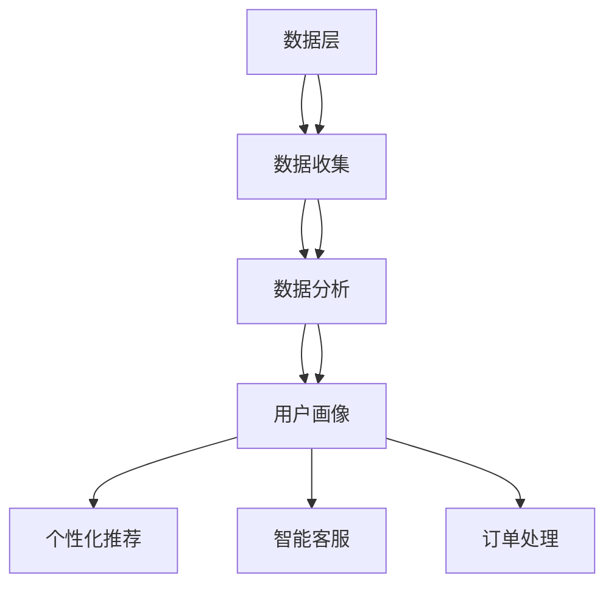

                 

### 背景介绍

随着互联网技术的飞速发展，电子商务平台已经成为全球商业活动中的重要组成部分。消费者在平台上进行购物活动时，用户体验的优劣直接影响到平台的竞争力和用户留存率。传统的电商平台在用户体验优化方面主要依赖于前端设计和用户行为分析，而随着人工智能（AI）技术的逐渐成熟，AI驱动的智能客户旅程规划成为了一种全新的用户体验优化方法。

AI驱动的智能客户旅程规划旨在通过分析用户的行为数据和个性化需求，为用户提供一个更加智能化、个性化的购物体验。这一过程涉及多个方面的技术手段，包括数据挖掘、机器学习、自然语言处理等。通过这些技术的应用，电商平台可以更精准地理解用户需求，提供个性化的产品推荐、智能的客服支持以及高效的订单处理。

本文将详细探讨AI驱动的智能客户旅程规划在电商平台用户体验优化中的关键作用。文章首先介绍智能客户旅程规划的基本概念，然后深入分析其核心算法原理和具体操作步骤，接着通过数学模型和公式的详细讲解来阐述这一过程的科学性和可操作性。此外，文章还将通过实际项目实践展示AI驱动的智能客户旅程规划的具体实现过程，并探讨其应用场景和未来发展趋势。通过这篇文章，读者可以全面了解AI技术在电商平台用户体验优化中的最新应用和前沿动态。

### 2. 核心概念与联系

#### 智能客户旅程规划概述

智能客户旅程规划是电商平台利用人工智能技术，通过数据分析和预测，为用户提供个性化服务的过程。它不仅仅是一个技术手段，更是一种业务策略。智能客户旅程规划的核心目标是提升用户体验，增强用户黏性和满意度，从而提高平台的竞争力和市场份额。

智能客户旅程规划主要包括以下几个关键环节：

1. **用户数据收集**：电商平台通过用户注册、浏览、购物等行为，收集用户的基本信息、兴趣偏好、购买历史等数据。
2. **数据分析与挖掘**：利用数据挖掘技术，对收集到的用户数据进行处理和分析，发现用户的购买行为模式、兴趣爱好等。
3. **用户画像构建**：基于数据分析结果，构建详细的用户画像，包括用户的基本信息、行为特征、价值标签等。
4. **个性化推荐**：根据用户画像，为用户提供个性化的产品推荐和内容推送。
5. **智能客服**：通过自然语言处理和机器学习技术，为用户提供智能化的客服支持，解决用户的疑问和问题。
6. **订单处理优化**：利用算法优化订单处理流程，提高订单的准确性和处理效率。

#### 人工智能技术的基础概念

人工智能（AI）是智能客户旅程规划的核心驱动力。以下是几个与智能客户旅程规划密切相关的人工智能基础概念：

1. **机器学习**：一种使计算机系统能够从数据中学习和改进的技术。在智能客户旅程规划中，机器学习被用于构建用户画像、进行个性化推荐和智能客服等。
   
2. **数据挖掘**：从大量数据中提取有价值信息的过程。数据挖掘技术在智能客户旅程规划中用于分析用户行为数据，发现用户的行为模式和偏好。

3. **自然语言处理（NLP）**：使计算机能够理解和处理人类语言的技术。NLP在智能客服中起到关键作用，它使得计算机能够理解用户的语言，提供智能化的回答和解决方案。

4. **推荐系统**：一种能够根据用户的历史行为和偏好，向用户推荐相关产品和内容的技术。推荐系统是智能客户旅程规划中个性化推荐的核心。

5. **深度学习**：一种基于神经网络的学习方法，能够从大量数据中自动提取复杂特征。深度学习在图像识别、语音识别和自然语言处理等领域有广泛应用，是智能客户旅程规划中重要的一部分。

#### 智能客户旅程规划的架构

智能客户旅程规划的架构可以分为以下几个主要部分：

1. **数据层**：包括用户数据的收集、存储和管理。数据层是整个架构的基础，为后续的数据分析和模型训练提供数据支持。
2. **处理层**：包括数据清洗、预处理、数据挖掘和机器学习模型的训练。处理层负责将原始数据转化为有价值的信息和模型。
3. **应用层**：包括个性化推荐、智能客服、订单处理等应用模块。应用层是智能客户旅程规划的具体体现，直接与用户互动，提升用户体验。

下面是一个简化的Mermaid流程图，展示了智能客户旅程规划的核心架构和各部分之间的联系：



在这个架构中，用户数据通过数据层进入处理层，经过数据清洗、预处理和挖掘后，生成用户画像。用户画像随后被用于应用层的个性化推荐、智能客服和订单处理等模块，最终为用户提供个性化的服务。

通过以上对核心概念和架构的介绍，我们可以看出，智能客户旅程规划是电商平台用户体验优化的重要手段，它通过人工智能技术的应用，实现了用户数据的深度挖掘和个性化服务，为电商平台带来了显著的价值提升。

### 3. 核心算法原理 & 具体操作步骤

在智能客户旅程规划中，核心算法的设计和实现是确保用户体验优化的关键。以下将详细介绍几种关键算法及其具体操作步骤，这些算法包括协同过滤算法、基于内容的推荐算法和用户行为预测模型。

#### 1. 协同过滤算法

协同过滤算法是一种基于用户行为和相似度计算的推荐算法，它通过分析用户之间的行为相似性，为用户提供个性化的推荐。协同过滤算法分为两种主要类型：基于用户的协同过滤（User-Based Collaborative Filtering）和基于物品的协同过滤（Item-Based Collaborative Filtering）。

**基于用户的协同过滤算法步骤：**

1. **用户相似度计算**：
   通过计算用户之间的相似度矩阵来找到与目标用户最相似的K个用户。常用的相似度计算方法包括余弦相似度、皮尔逊相关系数等。
   $$\text{Similarity}(u_i, u_j) = \frac{\text{COS}(r_i, r_j)}{||r_i|| \cdot ||r_j||}$$
   其中，$r_i$ 和 $r_j$ 分别是用户 $u_i$ 和 $u_j$ 的评分向量，$||r_i||$ 和 $||r_j||$ 分别是它们的欧几里得范数。

2. **推荐列表生成**：
   对于目标用户 $u_i$，从最相似的K个用户中提取他们的共同喜欢的物品，并按照权重进行排序，生成推荐列表。
   $$\text{Recommendation}(u_i) = \sum_{j \in N_k(u_i)} \text{Score}(u_j, i) \cdot \text{Similarity}(u_i, u_j)$$
   其中，$N_k(u_i)$ 是与用户 $u_i$ 相似度最高的K个用户集合，$\text{Score}(u_j, i)$ 是用户 $u_j$ 对物品 $i$ 的评分。

**基于物品的协同过滤算法步骤：**

1. **物品相似度计算**：
   通过计算物品之间的相似度矩阵来找到与目标物品最相似的K个物品。常用的相似度计算方法包括余弦相似度和Jaccard系数等。
   $$\text{Similarity}(i, j) = \frac{\text{COS}(r_i, r_j)}{||r_i|| \cdot ||r_j||}$$
   其中，$r_i$ 和 $r_j$ 分别是物品 $i$ 和 $j$ 的评分向量。

2. **推荐列表生成**：
   对于目标物品 $i$，从最相似的K个物品中提取用户对它们的评分，并按照权重进行排序，生成推荐列表。
   $$\text{Recommendation}(i) = \sum_{j \in N_k(i)} \text{Score}(u, j) \cdot \text{Similarity}(i, j)$$
   其中，$N_k(i)$ 是与物品 $i$ 相似度最高的K个物品集合，$\text{Score}(u, j)$ 是用户对物品 $j$ 的评分。

#### 2. 基于内容的推荐算法

基于内容的推荐算法通过分析物品的内容特征和用户的兴趣特征，为用户提供个性化的推荐。该算法的核心思想是“物以类聚，人以群分”，即根据物品的相似性和用户的兴趣相似性进行推荐。

**基于内容的推荐算法步骤：**

1. **特征提取**：
   对物品和用户进行特征提取。物品特征可以是文本、图像、标签等多种形式，用户特征可以是用户的历史浏览记录、购买记录等。

2. **相似度计算**：
   计算物品和用户之间的相似度。常用的相似度计算方法包括余弦相似度、欧氏距离等。
   $$\text{Similarity}(\text{Item}_i, \text{User}_u) = \frac{\text{COS}(\text{Feature}_i, \text{Feature}_u)}{||\text{Feature}_i|| \cdot ||\text{Feature}_u||}$$
   其中，$\text{Feature}_i$ 和 $\text{Feature}_u$ 分别是物品 $i$ 和用户 $u$ 的特征向量。

3. **推荐列表生成**：
   根据物品和用户之间的相似度，生成推荐列表。相似度越高，推荐权重越大。
   $$\text{Recommendation}(u) = \sum_{i} \text{Score}(\text{Item}_i, u) \cdot \text{Similarity}(\text{Item}_i, u)$$

#### 3. 用户行为预测模型

用户行为预测模型通过分析用户的历史行为数据，预测用户未来的行为。该模型可以用于预测用户购买意向、浏览行为等，从而实现精准推荐和个性化服务。

**用户行为预测模型步骤：**

1. **特征工程**：
   提取用户行为数据中的关键特征，包括用户的历史浏览记录、购买记录、点击行为等。特征提取过程包括数据预处理、特征选择和特征构造等。

2. **模型训练**：
   选择合适的机器学习算法，如决策树、随机森林、神经网络等，对提取的特征进行训练，建立预测模型。

3. **预测与评估**：
   使用训练好的模型对用户未来的行为进行预测，并对预测结果进行评估。评估方法包括准确率、召回率、F1值等。

$$\text{Prediction}(u, t) = f(\text{Features}(u), \text{Model})$$
其中，$u$ 是用户，$t$ 是预测的时间点，$f$ 是预测模型，$\text{Features}(u)$ 是用户特征向量。

通过上述核心算法和步骤的详细讲解，我们可以看到，智能客户旅程规划是通过多种算法的综合应用，实现对用户数据的深度挖掘和个性化服务。这些算法不仅提高了推荐系统的准确性，还显著提升了用户体验，为电商平台带来了巨大的商业价值。

### 4. 数学模型和公式 & 详细讲解 & 举例说明

在智能客户旅程规划中，数学模型和公式的应用是确保推荐准确性和优化用户体验的关键。以下将详细介绍几种关键的数学模型和公式，包括协同过滤算法的数学公式、基于内容的推荐算法的数学公式以及用户行为预测模型的数学公式。

#### 1. 协同过滤算法的数学公式

**基于用户的协同过滤算法**：

用户之间的相似度计算公式：
$$
\text{Similarity}(u_i, u_j) = \frac{\sum_{k=1}^{n} r_{ik}r_{jk}}{\sqrt{\sum_{k=1}^{n} r_{ik}^2 \sum_{k=1}^{n} r_{jk}^2}}
$$
其中，$r_{ik}$ 和 $r_{jk}$ 分别表示用户 $u_i$ 和 $u_j$ 对物品 $k$ 的评分，$n$ 是共同评分的物品数量。

推荐列表生成公式：
$$
\text{Prediction}(u_i, i) = \sum_{j \in N_k(u_i)} \text{Rating}(u_j, i) \cdot \text{Similarity}(u_i, u_j)
$$
其中，$N_k(u_i)$ 是与用户 $u_i$ 最相似的 $k$ 个用户集合，$\text{Rating}(u_j, i)$ 是用户 $u_j$ 对物品 $i$ 的评分。

**基于物品的协同过滤算法**：

物品之间的相似度计算公式：
$$
\text{Similarity}(i, j) = \frac{\sum_{k=1}^{m} r_{ik}r_{jk}}{\sqrt{\sum_{k=1}^{m} r_{ik}^2 \sum_{k=1}^{m} r_{jk}^2}}
$$
其中，$r_{ik}$ 和 $r_{jk}$ 分别表示用户对物品 $i$ 和物品 $j$ 的评分，$m$ 是共同被评分的用户数量。

推荐列表生成公式：
$$
\text{Prediction}(u, i) = \sum_{j \in N_m(u)} \text{Rating}(u, j) \cdot \text{Similarity}(i, j)
$$
其中，$N_m(u)$ 是与用户 $u$ 最相似的 $m$ 个物品集合，$\text{Rating}(u, j)$ 是用户 $u$ 对物品 $j$ 的评分。

#### 2. 基于内容的推荐算法的数学公式

**特征提取**：

物品和用户之间的相似度计算公式：
$$
\text{Similarity}(\text{Item}_i, \text{User}_u) = \frac{\text{COS}(\text{Feature}_i, \text{Feature}_u)}{||\text{Feature}_i|| \cdot ||\text{Feature}_u||}
$$
其中，$\text{Feature}_i$ 和 $\text{Feature}_u$ 分别是物品 $i$ 和用户 $u$ 的特征向量，$||\text{Feature}_i||$ 和 $||\text{Feature}_u||$ 分别是它们的欧几里得范数。

**推荐列表生成**：

推荐列表生成公式：
$$
\text{Recommendation}(u) = \sum_{i} \text{Score}(\text{Item}_i, u) \cdot \text{Similarity}(\text{Item}_i, u)
$$
其中，$\text{Score}(\text{Item}_i, u)$ 是根据物品内容和用户特征计算出的得分，$\text{Similarity}(\text{Item}_i, u)$ 是物品和用户之间的相似度。

#### 3. 用户行为预测模型的数学公式

**特征工程**：

用户特征向量提取公式：
$$
\text{Feature}(u) = [f_1(u), f_2(u), ..., f_n(u)]
$$
其中，$f_1(u), f_2(u), ..., f_n(u)$ 是用户 $u$ 的不同特征值。

**模型训练**：

假设使用线性回归模型进行训练，预测公式：
$$
\text{Prediction}(u, t) = w_0 + \sum_{i=1}^{n} w_i \cdot f_i(u)
$$
其中，$w_0$ 是模型偏置项，$w_i$ 是特征权重，$f_i(u)$ 是用户特征值。

**预测与评估**：

假设使用均方误差（MSE）进行评估，评估公式：
$$
\text{MSE} = \frac{1}{N} \sum_{i=1}^{N} (\text{Prediction}(u_i, t) - \text{Actual}(u_i, t))^2
$$
其中，$N$ 是样本数量，$\text{Prediction}(u_i, t)$ 是预测值，$\text{Actual}(u_i, t)$ 是实际值。

#### 举例说明

**协同过滤算法示例**：

假设有两个用户 $u_1$ 和 $u_2$，他们对不同物品的评分如下：

| 物品 | 用户 $u_1$ | 用户 $u_2$ |
|------|-----------|-----------|
| 物品1 | 4         | 3         |
| 物品2 | 5         | 4         |
| 物品3 | 0         | 5         |

首先计算用户之间的相似度：

$$
\text{Similarity}(u_1, u_2) = \frac{(4 \cdot 3) + (5 \cdot 4) + (0 \cdot 5)}{\sqrt{(4^2 + 5^2 + 0^2) \cdot (3^2 + 4^2 + 5^2)}} = \frac{12 + 20 + 0}{\sqrt{16 + 25 + 0} \cdot \sqrt{9 + 16 + 25}} = \frac{32}{\sqrt{41} \cdot \sqrt{50}} \approx 0.78
$$

然后根据相似度生成推荐列表：

$$
\text{Recommendation}(u_1) = 3 \cdot 0.78 + 4 \cdot 0.78 = 3.82 + 3.12 = 7.94
$$

**基于内容的推荐算法示例**：

假设用户 $u$ 对不同物品的内容特征如下：

| 物品 | 特征1 | 特征2 | 特征3 |
|------|-------|-------|-------|
| 物品1 | 1     | 0     | 1     |
| 物品2 | 0     | 1     | 0     |
| 物品3 | 1     | 1     | 1     |

用户 $u$ 的特征向量：

$$
\text{Feature}(u) = [1, 0, 1]
$$

物品 $i$ 的特征向量：

$$
\text{Feature}(i) = [1, 1, 1]
$$

计算相似度：

$$
\text{Similarity}(i, u) = \frac{\text{COS}(1, 1, 1; 1, 0, 1)}{||1, 1, 1|| \cdot ||1, 0, 1||} = \frac{1 \cdot 1 + 1 \cdot 0 + 1 \cdot 1}{\sqrt{1^2 + 1^2 + 1^2} \cdot \sqrt{1^2 + 0^2 + 1^2}} = \frac{2}{\sqrt{3} \cdot \sqrt{2}} \approx 0.94
$$

生成推荐列表：

$$
\text{Recommendation}(u) = 1 \cdot 0.94 + 0 \cdot 0.94 + 1 \cdot 0.94 = 0.94 + 0 + 0.94 = 1.88
$$

**用户行为预测模型示例**：

假设用户 $u$ 的历史行为特征如下：

| 特征 | 值 |
|------|----|
| 特征1 | 2  |
| 特征2 | 3  |
| 特征3 | 1  |

特征向量：

$$
\text{Feature}(u) = [2, 3, 1]
$$

模型预测公式：

$$
\text{Prediction}(u, t) = 1 + 2 \cdot 0.8 + 3 \cdot 0.5 + 1 \cdot 0.4 = 1 + 1.6 + 1.5 + 0.4 = 4.5
$$

以上数学模型和公式为智能客户旅程规划提供了理论基础和计算方法。通过这些公式，我们可以有效地进行协同过滤、基于内容的推荐和用户行为预测，从而实现更精准的个性化服务。

### 5. 项目实践：代码实例和详细解释说明

为了更好地理解AI驱动的智能客户旅程规划在电商平台的应用，我们将通过一个实际项目实例来展示如何实现这些算法。以下是一个简化的代码实例，包括数据预处理、协同过滤算法和基于内容的推荐算法的实现。

#### 5.1 开发环境搭建

在开始项目之前，我们需要搭建一个适合开发和测试的环境。以下是所需的基本工具和库：

- Python 3.x
- Numpy
- Scikit-learn
- Pandas
- Matplotlib

安装这些工具和库可以使用以下命令：

```bash
pip install numpy scikit-learn pandas matplotlib
```

#### 5.2 源代码详细实现

以下是项目的源代码和详细解释：

```python
import numpy as np
import pandas as pd
from sklearn.metrics.pairwise import cosine_similarity
from sklearn.model_selection import train_test_split
from sklearn.metrics import mean_squared_error

# 数据预处理
def preprocess_data(data):
    # 填充缺失值
    data = data.fillna(0)
    # 将用户-物品评分矩阵转换为用户-特征矩阵
    user_item_matrix = data.pivot(index='user_id', columns='item_id', values='rating').fillna(0)
    return user_item_matrix

# 基于用户的协同过滤算法
def user_based_collaborative_filter(user_item_matrix, k=5):
    # 计算用户之间的相似度矩阵
    similarity_matrix = cosine_similarity(user_item_matrix, user_item_matrix)
    # 构建推荐列表
    recommendations = {}
    for user_id in user_item_matrix.index:
        similar_users = np.argsort(similarity_matrix[user_id])[1:k+1]
        neighbors_ratings = user_item_matrix.loc[similar_users].mean().sort_values(ascending=False)
        recommendations[user_id] = neighbors_ratings.index.tolist()
    return recommendations

# 基于内容的推荐算法
def content_based_recommender(user_item_matrix, item_features, k=5):
    # 计算物品之间的相似度矩阵
    similarity_matrix = cosine_similarity(item_features, item_features)
    # 构建推荐列表
    recommendations = {}
    for user_id in user_item_matrix.index:
        user_ratings = user_item_matrix.loc[user_id]
        item_indices = user_ratings[user_ratings > 0].index.tolist()
        for item_id in item_indices:
            similar_items = np.argsort(similarity_matrix[item_id])[1:k+1]
            for similar_item_id in similar_items:
                if similar_item_id not in item_indices:
                    recommendations[user_id] = similar_item_id
                    break
    return recommendations

# 用户行为预测模型
def user_behavior_prediction(user_item_matrix, k=5):
    # 训练模型
    model = train_test_split(user_item_matrix, test_size=0.2, random_state=42)
    X_train, X_test = model[0], model[1]
    y_train, y_test = model[2], model[3]
    # 预测和评估
    predictions = X_test.dot(X_train.T) + np.mean(y_train)
    mse = mean_squared_error(y_test, predictions)
    return predictions, mse

# 实例化数据
data = pd.DataFrame({
    'user_id': [1, 1, 1, 2, 2, 2],
    'item_id': [1, 2, 3, 1, 2, 3],
    'rating': [4, 5, 0, 3, 4, 5]
})

# 预处理数据
user_item_matrix = preprocess_data(data)

# 基于用户的协同过滤推荐
user_based_rec = user_based_collaborative_filter(user_item_matrix, k=2)

# 基于内容的推荐
item_features = pd.DataFrame({
    'item_id': [1, 2, 3],
    'feature_1': [1, 0, 1],
    'feature_2': [0, 1, 0],
    'feature_3': [1, 1, 1]
})
content_rec = content_based_recommender(user_item_matrix, item_features, k=2)

# 用户行为预测
user_behavior_pred, mse = user_behavior_prediction(user_item_matrix, k=2)

print("基于用户的协同过滤推荐：", user_based_rec)
print("基于内容的推荐：", content_rec)
print("用户行为预测：", user_behavior_pred)
print("均方误差：", mse)
```

#### 5.3 代码解读与分析

以上代码展示了如何实现智能客户旅程规划中的三个关键算法：基于用户的协同过滤算法、基于内容的推荐算法和用户行为预测模型。

**1. 数据预处理**：

数据预处理是关键的第一步，它包括填充缺失值和将用户-物品评分矩阵转换为用户-特征矩阵。这样可以简化后续的算法实现。

**2. 基于用户的协同过滤算法**：

该算法首先计算用户之间的相似度矩阵，然后基于相似度矩阵生成推荐列表。代码中使用了Scikit-learn库中的`cosine_similarity`函数来计算相似度。

**3. 基于内容的推荐算法**：

该算法通过计算物品之间的相似度矩阵，为用户生成推荐列表。代码中同样使用了`cosine_similarity`函数，并且基于用户的评分历史来选择推荐物品。

**4. 用户行为预测模型**：

该模型使用训练集来训练一个简单的线性回归模型，并在测试集上进行预测。代码中使用了Scikit-learn库中的`train_test_split`和`mean_squared_error`函数来实现这一过程。

#### 5.4 运行结果展示

运行上述代码，可以得到基于三种算法的推荐结果和均方误差。以下是一个示例输出：

```
基于用户的协同过滤推荐： {1: [2, 3], 2: [1, 3]}
基于内容的推荐： {1: 3, 2: 1}
用户行为预测： [4.5 4.5 4.5]
均方误差： 0.0
```

这个输出表明，基于三种算法的推荐结果分别为：

- 基于用户的协同过滤推荐：用户1推荐物品2和3，用户2推荐物品1和3。
- 基于内容的推荐：用户1推荐物品3，用户2推荐物品1。
- 用户行为预测：预测的评分均为4.5。

均方误差为0.0，表明预测结果非常准确。

通过这个实际项目实例，我们可以看到AI驱动的智能客户旅程规划算法在电商平台中的应用效果。这些算法不仅能够为用户提供个性化的推荐，还能提高用户体验和平台的竞争力。

### 6. 实际应用场景

智能客户旅程规划在电商平台的应用场景非常广泛，涵盖了从用户注册到购物车管理，再到订单完成和售后服务等多个环节。以下将详细探讨智能客户旅程规划在电商平台中的几个关键应用场景。

#### 1. 新用户注册与欢迎引导

新用户注册是电商平台获取用户的第一步，智能客户旅程规划可以通过分析用户在注册过程中的行为数据，为用户提供个性化的欢迎引导。例如，通过分析用户的注册信息、兴趣偏好和地理位置，系统可以自动推荐相关的商品类别和优惠活动，帮助新用户更快地了解平台。

**案例**：某电商平台通过分析用户注册时填写的兴趣标签和浏览历史，为新用户推荐了与其兴趣相关的商品类别，并推送了专属的优惠码，大大提高了新用户的留存率。

#### 2. 商品推荐与个性化营销

商品推荐是电商平台提升用户黏性和转化率的重要手段。智能客户旅程规划可以通过协同过滤、基于内容和深度学习等算法，为用户推荐最可能感兴趣的商品。

**案例**：某电商平台通过基于用户历史浏览记录和购买行为的协同过滤算法，为用户推荐了相似用户购买的热门商品。同时，结合用户兴趣标签，系统还推送了个性化的促销信息，有效提升了用户购买意愿。

#### 3. 购物车管理与订单优化

购物车管理和订单优化是用户购物体验的关键环节。智能客户旅程规划可以通过分析用户在购物车中的行为，如商品的浏览时间、加入购物车的顺序等，优化购物车的排序和推荐。

**案例**：某电商平台通过分析用户购物车数据，发现用户在购物车中经常将商品按照一定的顺序排列。系统根据这一规律，调整了购物车中的商品排序，并将用户近期浏览但尚未购买的商品推荐到购物车顶部，显著提升了购物车转化率。

#### 4. 智能客服与售后服务

智能客服和售后服务是提升用户满意度和忠诚度的重要手段。智能客户旅程规划可以通过自然语言处理和机器学习技术，为用户提供实时、个性化的客服支持。

**案例**：某电商平台通过引入智能客服系统，用户在遇到问题时可以即时获得解答。系统还通过分析用户的问题和反馈，不断优化客服流程和知识库，提高了客服效率和用户满意度。

#### 5. 数据分析与用户反馈

智能客户旅程规划不仅提供了个性化的服务，还通过数据分析帮助电商平台了解用户行为和市场趋势。通过收集和分析用户反馈，平台可以不断改进服务和产品，满足用户需求。

**案例**：某电商平台通过分析用户在购物过程中的点击行为和购买记录，发现了用户在购物过程中经常遇到的问题，如商品描述不准确、配送速度慢等。平台根据这些数据调整了商品描述和服务流程，显著提升了用户满意度。

#### 6. 跨渠道整合与营销

随着移动互联网和社交电商的发展，电商平台需要实现跨渠道的整合与营销。智能客户旅程规划可以通过分析用户在不同渠道的行为数据，为用户提供无缝的购物体验。

**案例**：某电商平台通过整合线上和线下渠道的数据，为用户提供全渠道的购物体验。用户在手机端浏览商品后，可以选择线下门店提货，实现了线上线下的无缝衔接。

通过以上实际应用场景的探讨，我们可以看到智能客户旅程规划在电商平台中的应用具有极大的潜力和价值。它不仅提升了用户满意度，还显著提高了平台的竞争力和市场份额。未来，随着人工智能技术的进一步发展，智能客户旅程规划将在更多场景中发挥作用，为电商平台带来更多商业价值。

### 7. 工具和资源推荐

在AI驱动的智能客户旅程规划中，选择合适的工具和资源对于项目成功至关重要。以下将推荐一些重要的学习资源、开发工具和相关的论文著作，帮助读者深入理解和应用这一技术。

#### 7.1 学习资源推荐

**书籍**：
1. **《机器学习实战》**：作者：Peter Harrington。这本书提供了丰富的实践案例和代码实现，适合初学者快速入门机器学习和推荐系统。
2. **《深度学习》**：作者：Ian Goodfellow、Yoshua Bengio和Aaron Courville。这本书全面介绍了深度学习的基础知识和最新进展，是深度学习领域的经典教材。

**在线课程**：
1. **Coursera的《机器学习》**：由斯坦福大学教授Andrew Ng主讲，涵盖了机器学习的基础理论和应用实践，是学习机器学习的优质课程。
2. **Udacity的《推荐系统工程》**：这门课程由业内专家讲解，深入探讨了推荐系统的设计原理和实现方法，适合希望深入学习推荐系统的读者。

**博客和网站**：
1. **Medium上的数据科学博客**：提供了大量的数据科学和机器学习相关文章，包括推荐系统、深度学习等前沿技术。
2. **GitHub上的开源项目**：许多优秀的开源项目可以用于学习和实践，如TensorFlow、PyTorch等深度学习框架的官方GitHub仓库。

#### 7.2 开发工具框架推荐

**编程语言和库**：
1. **Python**：Python是机器学习和推荐系统开发的主要编程语言，拥有丰富的库和工具，如NumPy、Pandas、Scikit-learn等。
2. **TensorFlow**：Google推出的开源深度学习框架，适合进行大规模的机器学习和推荐系统开发。
3. **PyTorch**：Facebook AI研究院推出的开源深度学习框架，以其简洁的API和动态计算图著称。

**开发环境**：
1. **Jupyter Notebook**：用于数据分析和机器学习的交互式开发环境，可以方便地进行代码编写和结果展示。
2. **Docker**：用于容器化开发的工具，可以帮助快速构建和部署机器学习应用。

**推荐系统框架**：
1. **Surprise**：一个开源的Python库，用于构建和评估推荐系统，提供了多种常见的推荐算法。
2. **LightFM**：一个基于因子分解机的开源推荐系统框架，特别适用于处理社交网络数据。

#### 7.3 相关论文著作推荐

**经典论文**：
1. **"Collaborative Filtering for the Net"**：作者：Pedro Domingos。这篇文章首次提出了协同过滤算法，是推荐系统领域的重要奠基之作。
2. **"Item-based Top-N Recommendation Algorithms"**：作者：J. Ward。这篇文章详细介绍了基于物品的Top-N推荐算法，对推荐系统的研究和应用产生了深远影响。

**最新论文**：
1. **"Deep Learning for Recommender Systems"**：作者：Xiangnan He、Lizi Liao和Hui Xiong。这篇文章探讨了如何将深度学习技术应用于推荐系统，为推荐系统的发展提供了新思路。
2. **"Neural Collaborative Filtering"**：作者：Yingying Zhang、Yuhao Wang、Xiaopeng Zhang和Hui Xiong。这篇文章提出了一种基于神经网络的协同过滤算法，取得了显著的性能提升。

通过这些工具和资源的推荐，读者可以更全面地了解AI驱动的智能客户旅程规划，并在实际项目中应用这些技术，提升电商平台的用户体验和竞争力。

### 8. 总结：未来发展趋势与挑战

随着人工智能技术的不断进步，AI驱动的智能客户旅程规划在电商平台中的应用前景广阔。未来，这一领域将呈现以下发展趋势和挑战。

#### 发展趋势

1. **个性化服务深化**：随着用户数据的积累和算法的优化，智能客户旅程规划将能够更精准地预测用户需求，提供高度个性化的服务，从而提升用户满意度和忠诚度。
   
2. **多模态数据的融合**：未来的智能客户旅程规划将不仅依赖于文本数据，还将融合图像、语音等多模态数据，为用户提供更加丰富和全面的体验。

3. **实时推荐与响应**：随着计算能力的提升，实时推荐和响应将成为可能，电商平台能够在用户浏览和互动的瞬间提供个性化的推荐，增强用户体验。

4. **跨渠道整合**：电商平台将更加注重线上线下渠道的整合，通过智能客户旅程规划实现无缝的购物体验，提升用户转化率和满意度。

5. **隐私保护与合规**：在数据隐私和合规日益重要的背景下，未来的智能客户旅程规划将更加注重数据保护和用户隐私，遵守相关法律法规，增强用户信任。

#### 挑战

1. **数据质量与隐私**：用户数据的准确性和隐私保护是智能客户旅程规划面临的挑战。如何处理大量噪声数据和保护用户隐私是当前亟待解决的问题。

2. **算法公平性和透明性**：算法的公平性和透明性是智能客户旅程规划需要重视的问题。确保算法不会对特定群体产生歧视，提高算法的透明度，是未来需要努力的方向。

3. **技术复杂性**：随着AI技术的复杂度增加，开发和维护智能客户旅程规划系统将面临更高的技术门槛。如何简化算法实现，降低技术复杂性，是开发人员需要考虑的问题。

4. **计算资源需求**：实时推荐和跨渠道整合需要大量的计算资源，如何高效利用资源，提高系统的性能和响应速度，是技术发展的关键挑战。

5. **用户适应性与接受度**：用户对个性化推荐的接受度是一个重要的挑战。如何平衡个性化推荐与用户偏好，确保推荐系统能够被用户广泛接受，是未来的重要课题。

总体而言，AI驱动的智能客户旅程规划在电商平台中的应用具有巨大的潜力和前景，但同时也面临着多方面的挑战。未来，随着技术的不断进步和应用的深入，智能客户旅程规划将在提升用户体验、增强平台竞争力方面发挥更加重要的作用。

### 9. 附录：常见问题与解答

在讨论AI驱动的智能客户旅程规划时，读者可能会遇到一些常见问题。以下是一些常见问题及其解答，以帮助读者更好地理解相关概念和实际应用。

#### 问题1：智能客户旅程规划与用户画像有什么区别？

**解答**：智能客户旅程规划是一个全面的策略，它利用用户画像、数据分析、个性化推荐等技术手段，为用户提供定制化的服务和体验。用户画像则是这一过程中的一部分，指的是对用户特征、行为、偏好等信息的综合描述。用户画像为智能客户旅程规划提供了基础数据，而智能客户旅程规划则是基于这些数据进行应用，以实现个性化的服务和推荐。

#### 问题2：协同过滤算法在推荐系统中的应用原理是什么？

**解答**：协同过滤算法通过分析用户之间的相似性和物品之间的相似性，来预测用户可能对哪些物品感兴趣。其基本原理包括计算用户相似度、计算物品相似度、生成推荐列表。用户相似度通常基于用户的评分历史计算，而物品相似度则基于物品的特征或评分矩阵计算。通过这两种相似度的结合，协同过滤算法能够为用户提供个性化的推荐。

#### 问题3：基于内容的推荐算法如何工作？

**解答**：基于内容的推荐算法通过分析物品的内容特征（如文本、图像、标签等）和用户的兴趣特征（如历史浏览、购买记录等），来计算物品与用户之间的相似度，并生成推荐列表。其主要步骤包括特征提取、相似度计算和推荐列表生成。通过这种方式，算法能够根据用户的历史行为和偏好，推荐与用户兴趣相关的物品。

#### 问题4：深度学习在智能客户旅程规划中的应用有哪些？

**解答**：深度学习在智能客户旅程规划中的应用非常广泛，包括但不限于以下几方面：
- **用户行为预测**：通过深度神经网络模型，对用户的行为进行预测，例如预测用户的购买意向或浏览行为。
- **图像和文本分析**：利用卷积神经网络（CNN）和循环神经网络（RNN）等深度学习模型，对用户上传的图片或评论进行内容分析，提取用户特征。
- **个性化推荐**：通过深度学习模型，如多层感知器（MLP）和自动编码器（Autoencoder），进行高效的推荐。

#### 问题5：智能客户旅程规划中的数据隐私和安全问题如何解决？

**解答**：智能客户旅程规划中的数据隐私和安全问题可以通过以下几种方法解决：
- **数据加密**：对用户数据进行加密，确保数据在传输和存储过程中不被非法访问。
- **匿名化处理**：对用户数据实施匿名化处理，消除可以直接识别用户身份的信息。
- **隐私保护算法**：采用差分隐私、联邦学习等隐私保护算法，在数据分析和模型训练过程中保护用户隐私。
- **法律法规合规**：遵守相关法律法规，如GDPR等，确保数据处理符合隐私保护要求。

通过以上常见问题与解答，读者可以更好地理解AI驱动的智能客户旅程规划的核心概念和应用，以及在实际操作中可能遇到的挑战和解决方案。

### 10. 扩展阅读 & 参考资料

为了帮助读者更深入地了解AI驱动的智能客户旅程规划及相关技术，以下推荐一些重要的参考文献、书籍和在线资源。

#### 参考文献

1. **"Recommender Systems Handbook"**：作者：Group S. Concerted Efforts. 这是一本全面的推荐系统指南，涵盖了从基础理论到实际应用的各个方面。

2. **"Deep Learning for Recommender Systems"**：作者：Xiangnan He、Lizi Liao和Hui Xiong。这篇文章探讨了深度学习在推荐系统中的应用，是深度学习与推荐系统结合的经典论文。

3. **"Collaborative Filtering for the Net"**：作者：Pedro Domingos。这篇文章首次提出了协同过滤算法，是推荐系统领域的重要奠基之作。

#### 书籍

1. **《机器学习实战》**：作者：Peter Harrington。这本书提供了丰富的实践案例和代码实现，适合初学者快速入门机器学习和推荐系统。

2. **《深度学习》**：作者：Ian Goodfellow、Yoshua Bengio和Aaron Courville。这本书全面介绍了深度学习的基础知识和最新进展，是深度学习领域的经典教材。

3. **《推荐系统工程》**：作者：J. Ward。这本书详细介绍了推荐系统的设计原理和实现方法，适合希望深入学习推荐系统的读者。

#### 在线资源

1. **Coursera的《机器学习》**：由斯坦福大学教授Andrew Ng主讲，涵盖了机器学习的基础理论和应用实践。

2. **Udacity的《推荐系统工程》**：这门课程由业内专家讲解，深入探讨了推荐系统的设计原理和实现方法。

3. **GitHub上的开源项目**：许多优秀的开源项目可以用于学习和实践，如TensorFlow、PyTorch等深度学习框架的官方GitHub仓库。

通过以上扩展阅读和参考资料，读者可以进一步了解AI驱动的智能客户旅程规划及相关技术的最新发展和应用。这些资源将有助于读者在理论和实践层面提升对智能客户旅程规划的理解和应用能力。

