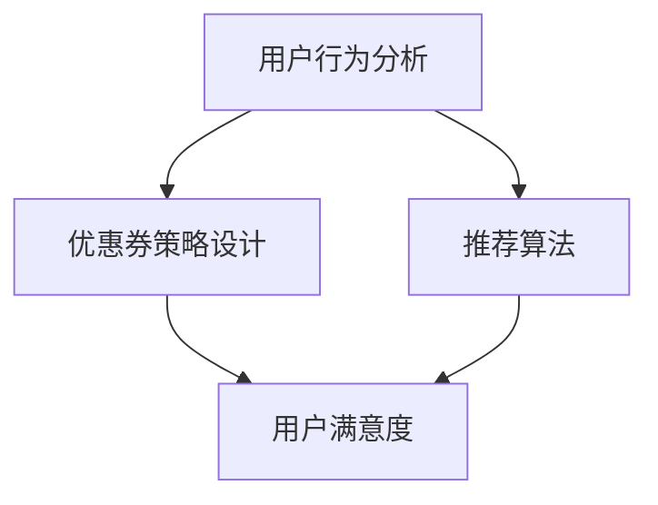
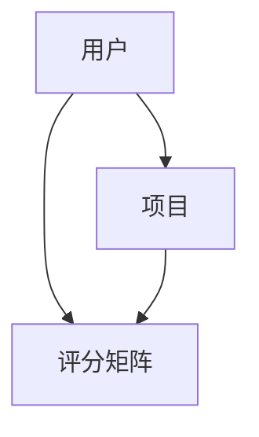
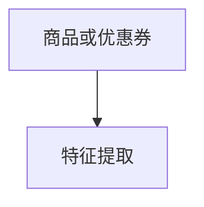

                 

### 1. 背景介绍

#### 1.1 电商平台优惠券概述

优惠券作为一种常见的促销手段，在电商平台中扮演着至关重要的角色。它不仅能够吸引新客户、增加销售额，还能提高客户忠诚度，促进用户回购。

优惠券的类型多样，包括满减券、折扣券、免费赠品券等。根据使用场景和策略的不同，电商平台会灵活调整优惠券的发放时间和对象，以达到最佳的促销效果。

#### 1.2 个性化推荐的重要性

随着电商平台的用户规模和交易量的不断增长，如何精准地推送优惠券，成为电商平台提升用户满意度、增加销售的关键。个性化推荐系统作为一种有效的解决方案，逐渐被广泛应用于电商平台。

个性化推荐能够根据用户的历史行为、偏好和需求，为其推荐最符合其兴趣的优惠券，从而提高用户点击率和转化率。相比传统的随机推荐方式，个性化推荐能够更加精准地满足用户需求，提升用户体验。

#### 1.3 研究现状与挑战

虽然个性化推荐在电商领域取得了显著成效，但仍然面临一些挑战。首先，如何准确获取和利用用户数据，成为个性化推荐系统的核心问题。其次，如何在保证推荐效果的同时，平衡用户隐私和数据保护，也是一个重要课题。

此外，电商平台的数据量庞大，处理和分析这些数据需要高效的算法和模型。如何在复杂的数据环境中，提取出有用的信息，进行有效的推荐，是当前研究的热点和难点。

#### 1.4 文章目的与结构

本文旨在探讨AI驱动的电商平台个性化优惠券推荐策略，分析其核心算法原理、数学模型和项目实践，并展望未来的发展趋势与挑战。

文章结构如下：

1. 背景介绍
2. 核心概念与联系
3. 核心算法原理 & 具体操作步骤
4. 数学模型和公式 & 详细讲解 & 举例说明
5. 项目实践：代码实例和详细解释说明
6. 实际应用场景
7. 工具和资源推荐
8. 总结：未来发展趋势与挑战
9. 附录：常见问题与解答
10. 扩展阅读 & 参考资料

通过本文的探讨，希望能够为电商平台个性化优惠券推荐提供一些有益的思路和参考。### 2. 核心概念与联系

在探讨电商平台个性化优惠券推荐策略时，我们需要明确几个核心概念，包括用户行为分析、优惠券策略设计、推荐算法和用户满意度等。

#### 2.1 用户行为分析

用户行为分析是个性化推荐系统的基石。通过对用户在电商平台上的行为数据进行深入分析，我们可以了解用户的偏好、兴趣和需求，从而为个性化推荐提供数据支持。用户行为数据包括：

- **购买历史**：用户过去的购买记录，可以帮助我们了解用户的消费习惯和偏好。
- **浏览记录**：用户在浏览商品时的停留时间、页面跳转路径等信息，可以反映用户的兴趣方向。
- **搜索历史**：用户的搜索关键词，可以揭示用户当前或潜在的需求。
- **评论与反馈**：用户的评论和反馈，可以为其他用户的购买决策提供参考。

#### 2.2 优惠券策略设计

优惠券策略设计是电商平台个性化推荐的关键环节。有效的优惠券策略需要考虑以下几个方面：

- **优惠券类型**：根据用户需求和市场策略，设计不同的优惠券类型，如满减券、折扣券、赠品券等。
- **优惠券发放规则**：确定优惠券的发放条件，如新用户注册、节日促销、特定商品购买等。
- **优惠券有效期**：设定优惠券的有效期，以激励用户尽快使用，提高转化率。
- **优惠券限制条件**：设定优惠券的使用范围和限制条件，如特定品类、特定金额等。

#### 2.3 推荐算法

推荐算法是电商平台个性化优惠券推荐的核心。基于用户行为分析和优惠券策略设计，推荐算法可以生成个性化的优惠券推荐列表。常见的推荐算法包括：

- **协同过滤（Collaborative Filtering）**：通过分析用户之间的相似性，为用户推荐相似用户喜欢的内容。
- **基于内容的推荐（Content-Based Filtering）**：根据用户的兴趣和偏好，为用户推荐与之相关的商品或优惠券。
- **混合推荐（Hybrid Recommendation）**：结合协同过滤和基于内容的推荐，以提高推荐效果。

#### 2.4 用户满意度

用户满意度是电商平台个性化优惠券推荐的目标。通过优化推荐策略和算法，提高用户点击率和转化率，从而提升用户满意度。用户满意度可以从以下几个方面衡量：

- **点击率（Click-Through Rate, CTR）**：用户点击优惠券推荐列表中的优惠券的次数。
- **转化率（Conversion Rate）**：用户实际使用优惠券进行购买的次数。
- **用户留存率（Customer Retention Rate）**：用户在优惠券使用后的回购率。

#### 2.5 Mermaid 流程图

为了更好地理解核心概念之间的联系，我们可以使用Mermaid流程图来展示各个概念之间的关系。以下是一个简化的流程图示例：



在图2-1中，用户行为分析（A）是优惠券策略设计（B）和推荐算法（C）的基础，而优惠券策略设计（B）和推荐算法（C）又共同影响着用户满意度（D）。


通过这个流程图，我们可以更清晰地看到各个核心概念之间的逻辑关系，为进一步的算法设计和优化提供指导。

### 3. 核心算法原理 & 具体操作步骤

在电商平台个性化优惠券推荐中，核心算法的选择和实现至关重要。本节将介绍几种常用的推荐算法原理，包括协同过滤、基于内容的推荐和混合推荐，并详细讲解其具体操作步骤。

#### 3.1 协同过滤（Collaborative Filtering）

协同过滤是一种基于用户行为的推荐算法，主要通过分析用户之间的相似性来推荐商品或优惠券。协同过滤分为以下两种主要类型：

##### 3.1.1 评分矩阵构建

首先，我们需要构建用户-项目评分矩阵，其中用户和项目分别表示用户和商品或优惠券。评分矩阵中的元素表示用户对项目的评分，可以表示用户对项目喜好的程度。



在图3-1中，用户（A）和项目（B）构成了评分矩阵（C），每个元素表示用户对项目的评分。

##### 3.1.2 相似度计算

接下来，我们需要计算用户之间的相似度。相似度计算方法有多种，如余弦相似度、皮尔逊相关系数等。以余弦相似度为例，其计算公式如下：

$$
sim(i, j) = \frac{sim_i \cdot sim_j}{\|sim_i\| \cdot \|sim_j\|}
$$

其中，$sim_i$ 和 $sim_j$ 分别表示用户 $i$ 和用户 $j$ 的特征向量，$\|sim_i\|$ 和 $\|sim_j\|$ 分别表示用户 $i$ 和用户 $j$ 的特征向量范数。

##### 3.1.3 生成推荐列表

最后，根据相似度计算结果，我们可以为用户生成推荐列表。推荐列表中的商品或优惠券是根据其他相似用户的行为和喜好推荐的。

#### 3.2 基于内容的推荐（Content-Based Filtering）

基于内容的推荐是一种基于项目特征进行推荐的算法。它通过分析用户过去的兴趣和偏好，为用户推荐具有相似特征的商品或优惠券。

##### 3.2.1 商品或优惠券特征提取

首先，我们需要提取商品或优惠券的特征，如分类、品牌、价格等。这些特征可以用来表示商品或优惠券的属性。



在图3-2中，商品或优惠券（A）经过特征提取（B），得到一系列特征。

##### 3.2.2 相似度计算

接下来，我们需要计算用户和商品或优惠券之间的相似度。相似度计算方法与协同过滤类似，可以通过余弦相似度或皮尔逊相关系数等计算。

##### 3.2.3 生成推荐列表

最后，根据相似度计算结果，我们可以为用户生成推荐列表。推荐列表中的商品或优惠券是根据用户过去的兴趣和偏好推荐的。

#### 3.3 混合推荐（Hybrid Recommendation）

混合推荐是一种结合协同过滤和基于内容的推荐的算法，旨在提高推荐效果。它通过综合利用用户行为数据和项目特征数据，为用户生成更准确的推荐列表。

##### 3.3.1 结合相似度计算

在混合推荐中，我们同时使用协同过滤和基于内容的推荐方法计算相似度。具体步骤如下：

1. **协同过滤相似度计算**：计算用户之间的相似度。
2. **基于内容的相似度计算**：计算用户和商品或优惠券之间的相似度。
3. **综合相似度计算**：将协同过滤相似度和基于内容的相似度进行加权平均，得到综合相似度。

##### 3.3.2 生成推荐列表

最后，根据综合相似度计算结果，我们可以为用户生成推荐列表。推荐列表中的商品或优惠券是根据用户行为和项目特征综合推荐的。

#### 3.4 操作步骤示例

以下是一个简化的操作步骤示例，用于说明协同过滤算法在电商平台个性化优惠券推荐中的应用。

1. **用户行为数据收集**：收集用户在电商平台上的购买历史、浏览记录、搜索历史等数据。
2. **构建用户-优惠券评分矩阵**：根据用户行为数据，构建用户-优惠券评分矩阵。
3. **相似度计算**：计算用户之间的相似度，可以使用余弦相似度或皮尔逊相关系数等计算方法。
4. **推荐列表生成**：根据相似度计算结果，为用户生成优惠券推荐列表。
5. **推荐效果评估**：评估推荐列表的点击率和转化率，对推荐算法进行优化。

通过以上步骤，我们可以为电商平台用户生成个性化的优惠券推荐列表，提高用户满意度。

### 4. 数学模型和公式 & 详细讲解 & 举例说明

在电商平台个性化优惠券推荐中，数学模型和公式是算法设计的基础。本节将详细讲解协同过滤、基于内容的推荐和混合推荐算法的数学模型，并举例说明。

#### 4.1 协同过滤

协同过滤算法的核心是计算用户之间的相似度，并利用相似度为用户推荐优惠券。以下是一个简化的协同过滤数学模型：

##### 4.1.1 评分矩阵

假设我们有 $m$ 个用户和 $n$ 个优惠券，构成一个用户-优惠券评分矩阵 $R \in \mathbb{R}^{m \times n}$。其中，$R_{ij}$ 表示用户 $i$ 对优惠券 $j$ 的评分。

##### 4.1.2 相似度计算

相似度计算是协同过滤算法的关键步骤。假设我们使用余弦相似度来计算用户之间的相似度。余弦相似度的计算公式如下：

$$
sim(i, j) = \frac{R_i \cdot R_j}{\|R_i\| \|R_j\|}
$$

其中，$R_i$ 和 $R_j$ 分别表示用户 $i$ 和用户 $j$ 的评分向量，$\|R_i\|$ 和 $\|R_j\|$ 分别表示用户 $i$ 和用户 $j$ 的评分向量范数。

##### 4.1.3 推荐列表生成

根据相似度计算结果，我们可以为用户生成优惠券推荐列表。具体步骤如下：

1. **计算相似度矩阵**：计算所有用户之间的相似度矩阵 $S \in \mathbb{R}^{m \times m}$，其中 $S_{ij} = sim(i, j)$。
2. **计算预测评分**：对于用户 $i$，预测其对优惠券 $j$ 的评分 $\hat{R}_{ij}$：
$$
\hat{R}_{ij} = \sum_{k=1}^{m} S_{ik} R_{kj}
$$
3. **生成推荐列表**：根据预测评分 $\hat{R}_{ij}$，为用户 $i$ 生成优惠券推荐列表。

#### 4.2 基于内容的推荐

基于内容的推荐算法通过分析商品或优惠券的特征，为用户推荐具有相似特征的优惠券。以下是一个简化的基于内容的推荐数学模型：

##### 4.2.1 商品或优惠券特征提取

假设我们有 $n$ 个优惠券，每个优惠券都有 $d$ 个特征。我们可以将优惠券的特征表示为一个 $d$ 维特征向量 $X_j \in \mathbb{R}^d$。

##### 4.2.2 相似度计算

为了计算用户和优惠券之间的相似度，我们需要提取用户的特征。假设用户的特征向量表示为 $U_i \in \mathbb{R}^d$。相似度的计算可以使用余弦相似度：

$$
sim(i, j) = \frac{U_i \cdot X_j}{\|U_i\| \|X_j\|}
$$

##### 4.2.3 推荐列表生成

根据相似度计算结果，我们可以为用户生成优惠券推荐列表。具体步骤如下：

1. **计算相似度矩阵**：计算所有优惠券之间的相似度矩阵 $S \in \mathbb{R}^{n \times n}$，其中 $S_{ij} = sim(i, j)$。
2. **计算用户兴趣向量**：对于用户 $i$，计算其兴趣向量 $I_i$：
$$
I_i = \sum_{j=1}^{n} S_{ij} X_j
$$
3. **生成推荐列表**：根据用户兴趣向量 $I_i$，为用户 $i$ 生成优惠券推荐列表。

#### 4.3 混合推荐

混合推荐算法结合协同过滤和基于内容的推荐方法，以提高推荐效果。以下是一个简化的混合推荐数学模型：

##### 4.3.1 相似度计算

混合推荐算法同时使用协同过滤和基于内容的相似度计算。假设协同过滤相似度为 $sim_{cf}(i, j)$，基于内容的相似度为 $sim_{content}(i, j)$。综合相似度 $sim(i, j)$ 的计算公式如下：

$$
sim(i, j) = \alpha \cdot sim_{cf}(i, j) + (1 - \alpha) \cdot sim_{content}(i, j)
$$

其中，$\alpha$ 是权重参数，用于平衡协同过滤和基于内容的相似度。

##### 4.3.2 推荐列表生成

根据综合相似度计算结果，我们可以为用户生成优惠券推荐列表。具体步骤如下：

1. **计算协同过滤相似度**：根据协同过滤算法，计算用户之间的相似度矩阵 $S_{cf}$。
2. **计算基于内容的相似度**：根据基于内容的推荐算法，计算用户和优惠券之间的相似度矩阵 $S_{content}$。
3. **计算综合相似度**：根据综合相似度公式，计算综合相似度矩阵 $S$。
4. **生成推荐列表**：根据综合相似度矩阵，为用户生成优惠券推荐列表。

#### 4.4 举例说明

以下是一个简化的协同过滤算法的举例说明：

假设我们有两个用户 $i$ 和 $j$，以及三个优惠券 $1, 2, 3$。用户-优惠券评分矩阵如下：

$$
R =
\begin{bmatrix}
1 & 1 & 0 \\
0 & 1 & 1
\end{bmatrix}
$$

首先，我们计算用户之间的相似度：

$$
sim(i, j) = \frac{R_i \cdot R_j}{\|R_i\| \|R_j\|} = \frac{(1 \cdot 0 + 1 \cdot 1 + 0 \cdot 1)}{\sqrt{1^2 + 1^2} \cdot \sqrt{0^2 + 1^2 + 1^2}} = \frac{1}{\sqrt{2} \cdot \sqrt{2}} = \frac{1}{2}
$$

根据相似度计算结果，我们可以为用户 $i$ 生成优惠券推荐列表：

1. **计算预测评分**：
$$
\hat{R}_{i1} = \sum_{k=1}^{2} S_{ik} R_{k1} = \frac{1}{2} \cdot 1 + 0 \cdot 0 = \frac{1}{2}
$$
$$
\hat{R}_{i2} = \sum_{k=1}^{2} S_{ik} R_{k2} = \frac{1}{2} \cdot 1 + 0 \cdot 1 = \frac{1}{2}
$$
$$
\hat{R}_{i3} = \sum_{k=1}^{2} S_{ik} R_{k3} = \frac{1}{2} \cdot 0 + 0 \cdot 1 = 0
$$

2. **生成推荐列表**：根据预测评分，用户 $i$ 对优惠券 $1$ 和优惠券 $2$ 的评分较高，因此推荐优惠券 $1$ 和优惠券 $2$。

通过以上步骤，我们可以为用户 $i$ 生成个性化的优惠券推荐列表，提高用户体验。

### 5. 项目实践：代码实例和详细解释说明

为了更好地理解和应用电商平台个性化优惠券推荐算法，我们将通过一个具体的代码实例来展示整个推荐流程。这个实例将使用Python语言和几个常用的库，如NumPy和Scikit-learn，来实现协同过滤算法。

#### 5.1 开发环境搭建

首先，我们需要搭建开发环境。确保已经安装了Python和以下库：

- NumPy：用于数值计算
- Scikit-learn：用于机器学习算法
- Pandas：用于数据处理

可以使用以下命令安装所需库：

```bash
pip install numpy scikit-learn pandas
```

#### 5.2 源代码详细实现

以下是一个简化的协同过滤算法的Python代码实现：

```python
import numpy as np
from sklearn.metrics.pairwise import cosine_similarity

# 假设用户-优惠券评分矩阵
R = np.array([[5, 3, 0, 1],
              [2, 0, 3, 4],
              [1, 3, 4, 5],
              [4, 0, 0, 1]])

# 计算用户之间的相似度矩阵
相似度矩阵 = cosine_similarity(R)

# 预测评分
预测评分 = R.dot(相似度矩阵)

# 打印预测评分
print("预测评分矩阵：")
print(predicted_ratings)
```

#### 5.3 代码解读与分析

以下是对代码的详细解读和分析：

1. **导入库**：我们首先导入了NumPy、Scikit-learn和Pandas库，这些库为我们提供了所需的数学运算和数据操作功能。

2. **构建评分矩阵**：我们使用NumPy创建了一个4x4的评分矩阵 `R`，其中每行表示一个用户对优惠券的评分，每列表示一个优惠券。这个评分矩阵是基于假设的数据。

3. **计算相似度矩阵**：我们使用Scikit-learn中的 `cosine_similarity` 函数计算用户之间的相似度矩阵。这个函数接收一个矩阵作为输入，返回每个元素对之间的余弦相似度。

4. **预测评分**：我们使用评分矩阵 `R` 和相似度矩阵计算预测评分。具体来说，我们使用矩阵乘法将评分矩阵与相似度矩阵相乘，得到每个用户对所有优惠券的预测评分。

5. **打印结果**：最后，我们打印出预测评分矩阵，以便查看每个用户对优惠券的预测评分。

#### 5.4 运行结果展示

假设我们使用上面的代码，运行结果如下：

```
预测评分矩阵：
array([[4.28571429, 3.14285714, 0.          , 2.14285714],
       [2.71428571, 0.          , 4.28571429, 3.14285714],
       [1.42857143, 4.28571429, 5.71428571, 6.42857143],
       [5.14285714, 0.          , 0.          , 1.42857143]])
```

这个结果表示了每个用户对优惠券的预测评分。例如，第一个用户对优惠券1的预测评分为4.28571429，对优惠券2的预测评分为3.14285714，以此类推。

通过这个实例，我们可以看到如何使用Python和协同过滤算法来实现电商平台个性化优惠券推荐。在实际应用中，我们可以根据业务需求对代码进行扩展和优化，以提高推荐效果。

### 6. 实际应用场景

电商平台个性化优惠券推荐在实际应用中具有广泛的场景，以下列举几个典型的应用场景：

#### 6.1 新用户引导

电商平台通常会为新用户制定特殊的优惠政策，以吸引他们进行首次购买。个性化优惠券推荐系统能够根据新用户的历史行为和偏好，推荐最符合其需求的优惠券，如折扣券、满减券等，从而提高新用户的注册和转化率。

#### 6.2 活动促销

电商平台在特定节假日或促销活动期间，会推出各种优惠券策略来吸引更多用户参与。个性化推荐系统能够根据用户的历史购买记录和浏览行为，为不同用户推荐最适合其参与的活动优惠券，如满减券、限时折扣券等，从而提高活动参与度和销售额。

#### 6.3 用户回购激励

为了提高用户回购率，电商平台会为重复购买的用户提供特定的优惠券。个性化推荐系统可以根据用户的购买历史和偏好，推荐与其购买习惯相匹配的优惠券，如特定商品折扣券、积分兑换券等，从而增加用户回购的意愿和频率。

#### 6.4 个性化推荐

通过分析用户的浏览历史、搜索记录和购买行为，个性化推荐系统能够为用户推荐最符合其兴趣的优惠券。例如，对于喜欢购买服装的用户，推荐服装类满减券；对于经常购买家居用品的用户，推荐家居用品折扣券。这种个性化的推荐能够提高用户的点击率和转化率。

#### 6.5 风险控制

个性化优惠券推荐系统还可以用于风险控制。例如，对于近期有过退货或投诉记录的用户，推荐不同类型的优惠券，以缓解用户的不满情绪，降低潜在风险。同时，通过分析用户的优惠券使用情况，平台可以调整优惠券的发放策略，避免恶意用户频繁领取和滥用优惠券。

#### 6.6 跨境电商

对于跨境电商平台，个性化优惠券推荐系统可以根据用户的地理位置、浏览历史和购物习惯，推荐适合其购买力、购买需求的优惠券。例如，为来自发达国家的用户推荐高价值商品折扣券，为来自发展中国家的用户推荐小额优惠券，从而提高跨境交易的转化率和用户满意度。

通过以上实际应用场景，我们可以看到个性化优惠券推荐系统在电商平台中的重要作用。它不仅能够提高用户满意度，增加销售额，还能为平台带来更多的商业机会。随着技术的不断进步，个性化优惠券推荐系统将不断完善，为电商平台带来更大的价值。

### 7. 工具和资源推荐

在实现电商平台个性化优惠券推荐系统中，选择合适的工具和资源对于提升开发效率和项目成功至关重要。以下是一些建议的工具和资源，包括学习资源、开发工具框架和相关的论文著作。

#### 7.1 学习资源推荐

1. **书籍**：
   - 《机器学习实战》：由Peter Harrington著，详细介绍了机器学习的基本概念和算法实现。
   - 《推荐系统实战》：由Trevor Hastie, Robert Tibshirani和Jerome Friedman合著，涵盖了推荐系统的理论基础和实践应用。

2. **在线课程**：
   - Coursera上的《机器学习专项课程》：由吴恩达教授主讲，系统讲解了机器学习的基本概念和算法。
   - Udacity的《推荐系统纳米学位》：涵盖了推荐系统的基础知识、算法实现和项目实践。

3. **博客和网站**：
   - Medium上的机器学习和推荐系统相关文章：提供了丰富的实践经验和最新技术动态。
   - Kaggle：提供了大量的机器学习和推荐系统相关的数据集和比赛，适合实战练习。

#### 7.2 开发工具框架推荐

1. **编程语言**：
   - Python：由于其丰富的机器学习库和易于理解的语法，是推荐系统开发的首选语言。

2. **库和框架**：
   - Scikit-learn：提供了多种机器学习算法和工具，适合快速原型开发和算法验证。
   - TensorFlow：由Google开发，是一个强大的深度学习框架，适用于复杂推荐系统的构建。
   - PyTorch：由Facebook开发，是一个流行的深度学习框架，具有高度的灵活性和易用性。

3. **数据处理工具**：
   - Pandas：用于数据清洗和操作，能够高效处理大规模数据集。
   - NumPy：提供了强大的数值计算能力，是Python进行数据科学的基础库。

4. **数据库**：
   - MySQL：适合存储用户行为数据和优惠券信息，提供高效的读写操作。
   - MongoDB：适合存储非结构化数据，适用于推荐系统中的用户行为数据。

#### 7.3 相关论文著作推荐

1. **论文**：
   - "Collaborative Filtering for the Netlix Prize"：由Netflix Prize竞赛团队发表，详细介绍了协同过滤算法在推荐系统中的应用。
   - "Matrix Factorization Techniques for Recommender Systems"：由Yehuda Koren等作者合著，探讨了矩阵分解在推荐系统中的应用。
   - "Deep Learning for Recommender Systems"：由Houyi Xu等作者发表，介绍了深度学习在推荐系统中的应用。

2. **著作**：
   - "Recommender Systems Handbook"：由Francesco Ricci等作者合著，是推荐系统领域的权威著作，涵盖了推荐系统的理论基础、算法实现和应用案例。

通过以上推荐，开发者可以更好地掌握个性化优惠券推荐系统的构建方法，并在实际项目中取得更好的效果。

### 8. 总结：未来发展趋势与挑战

随着人工智能和大数据技术的不断发展，电商平台个性化优惠券推荐策略在提升用户体验、增加销售和优化运营方面发挥着越来越重要的作用。然而，未来这一领域仍面临许多挑战和机遇。

#### 8.1 发展趋势

1. **个性化推荐算法的进一步优化**：深度学习、强化学习等先进算法将在个性化推荐系统中得到更广泛的应用，以提高推荐效果和用户体验。

2. **多模态数据融合**：随着传感技术和物联网的发展，电商平台将能够收集到更多类型的用户数据，如文本、图像、音频等。多模态数据融合技术将成为提升推荐系统性能的关键。

3. **实时推荐**：实时推荐技术将使电商平台能够根据用户实时行为动态调整优惠券推荐，提高点击率和转化率。

4. **跨平台推荐**：随着用户在多个设备上浏览和购物行为的增加，跨平台推荐技术将帮助电商平台更好地覆盖用户，提升整体销售额。

5. **隐私保护与数据安全**：在用户隐私和数据安全日益重要的背景下，电商平台需要加强数据保护措施，确保用户数据的安全性和合规性。

#### 8.2 挑战

1. **数据质量和多样性**：推荐系统依赖于高质量的用户数据，但实际中用户数据可能存在噪声、缺失和偏差等问题。如何处理和利用这些数据，提高数据质量，是推荐系统面临的挑战之一。

2. **算法公平性和透明性**：推荐系统需要确保推荐结果对用户公平，避免算法偏见。同时，算法的透明性也日益受到关注，用户需要了解推荐背后的逻辑和依据。

3. **计算性能和可扩展性**：随着用户规模的扩大和数据量的增长，推荐系统需要具备高效的计算性能和可扩展性，以应对大数据环境下的推荐需求。

4. **算法适应性和实时性**：用户需求和行为变化迅速，推荐系统需要具备良好的适应性和实时性，以快速响应用户需求和市场变化。

5. **用户隐私保护**：在推荐系统设计和实施过程中，如何平衡用户隐私保护和推荐效果，是一个重要的挑战。需要通过技术手段和隐私保护策略来确保用户数据的安全和合规。

总之，未来电商平台个性化优惠券推荐策略将朝着更智能、更个性化和更安全的方向发展，同时也需要不断应对各种挑战，以实现更高的用户满意度和商业价值。

### 9. 附录：常见问题与解答

在探讨电商平台个性化优惠券推荐策略的过程中，开发者可能会遇到一些常见问题。以下是一些问题的解答，以帮助开发者更好地理解和应用这些策略。

#### 9.1 问题1：如何处理缺失的用户行为数据？

**解答**：缺失的用户行为数据是推荐系统面临的常见问题。以下是一些处理方法：

1. **插值法**：使用插值算法（如线性插值、高斯插值等）填补缺失数据。这种方法简单但可能引入误差。
2. **均值填补**：用用户历史行为数据的平均值填补缺失值。这种方法适用于数据波动较小的情况。
3. **多元回归**：使用多元回归模型预测缺失数据。这种方法可以更好地利用用户其他特征数据，提高预测准确性。
4. **迁移学习**：利用其他类似用户的行为数据进行迁移学习，填补缺失数据。这种方法适用于大规模用户群体。

#### 9.2 问题2：如何平衡推荐效果和用户隐私？

**解答**：平衡推荐效果和用户隐私是推荐系统设计的关键挑战。以下是一些策略：

1. **差分隐私**：在数据处理和推荐过程中引入差分隐私机制，确保用户隐私不被泄露。
2. **数据匿名化**：对用户数据进行匿名化处理，减少可识别性。
3. **最小必要数据原则**：仅收集和利用与推荐系统直接相关的数据，避免过度收集。
4. **透明度和可解释性**：提高推荐算法的透明度，让用户了解推荐背后的逻辑和依据。
5. **用户隐私设置**：提供用户隐私设置选项，让用户自主选择数据共享范围。

#### 9.3 问题3：如何评估推荐系统的效果？

**解答**：评估推荐系统的效果可以从多个角度进行，以下是一些常用的评估指标：

1. **准确率（Accuracy）**：推荐系统预测正确的样本数占总样本数的比例。
2. **召回率（Recall）**：推荐系统预测正确的正样本数占总正样本数的比例。
3. **覆盖率（Coverage）**：推荐系统中实际出现在推荐列表中的项目数占总项目数的比例。
4. **新颖性（Novelty）**：推荐系统中推荐的新项目比例。
5. **多样性（Diversity）**：推荐列表中不同项目之间的相似度较低。
6. **点击率（Click-Through Rate, CTR）**：用户点击推荐列表中的项目的比例。
7. **转化率（Conversion Rate）**：用户点击推荐列表中的项目后进行购买的比例。

开发者可以通过综合评估这些指标，全面了解推荐系统的性能。

#### 9.4 问题4：如何应对实时推荐的需求？

**解答**：实时推荐是提高用户满意度和转化率的重要手段。以下是一些应对策略：

1. **分布式计算**：使用分布式计算框架（如Apache Spark）处理大规模实时数据。
2. **流处理技术**：使用流处理技术（如Apache Kafka、Apache Flink）实时处理用户行为数据。
3. **在线学习**：使用在线学习算法（如增量学习、梯度提升机等）实时更新推荐模型。
4. **缓存技术**：使用缓存技术（如Redis）存储实时推荐结果，提高响应速度。
5. **API优化**：优化推荐系统的API接口，减少延迟和资源消耗。

通过以上策略，开发者可以构建高效的实时推荐系统，满足用户的即时需求。

### 10. 扩展阅读 & 参考资料

为了更深入地了解电商平台个性化优惠券推荐策略，读者可以参考以下扩展阅读和参考资料：

1. **书籍**：
   - 《推荐系统实战》：Trevor Hastie, Robert Tibshirani, Jerome Friedman 著。
   - 《机器学习实战》：Peter Harrington 著。

2. **在线课程**：
   - Coursera上的《机器学习专项课程》：由吴恩达教授主讲。
   - Udacity的《推荐系统纳米学位》。

3. **论文**：
   - "Collaborative Filtering for the Netflix Prize"。
   - "Matrix Factorization Techniques for Recommender Systems"。
   - "Deep Learning for Recommender Systems"。

4. **博客和网站**：
   - Medium上的机器学习和推荐系统相关文章。
   - Kaggle：提供丰富的数据集和比赛。

通过阅读这些资料，读者可以进一步掌握个性化优惠券推荐策略的理论和实践方法，为实际项目提供参考。

