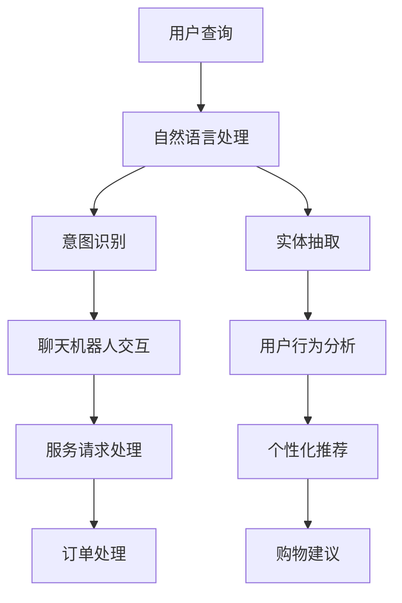

                 

关键词：人工智能、电商、客户服务、自然语言处理、机器学习、聊天机器人、用户行为分析

## 摘要

随着电商行业的快速发展，客户服务的重要性日益凸显。传统的客户服务模式已经无法满足现代用户的需求，因此，AI驱动的电商智能客户服务系统应运而生。本文将深入探讨AI在电商客户服务中的应用，包括核心概念、算法原理、数学模型、项目实践、实际应用场景、工具和资源推荐以及未来发展趋势与挑战。

## 1. 背景介绍

电商行业正以前所未有的速度增长，消费者对购物体验的要求也越来越高。在这种背景下，客户服务成为电商企业竞争力的关键因素。传统的客户服务模式，如电话客服和在线聊天，虽然在一定程度上满足了用户的需求，但存在响应速度慢、效率低、成本高等问题。此外，随着用户规模的扩大，客服团队的管理也变得复杂。为了提升客户服务质量，电商企业开始探索AI驱动的智能客户服务系统。

AI驱动的电商智能客户服务系统基于人工智能、自然语言处理和机器学习技术，能够自动识别用户需求、提供个性化服务、处理常见问题，并具备自我学习的能力。通过这种方式，电商企业可以大幅提升客户服务效率，降低运营成本，同时提供更加优质的服务体验。

## 2. 核心概念与联系

### 2.1 人工智能

人工智能（AI）是指使计算机系统能够模拟人类智能行为的技术。在电商智能客户服务系统中，人工智能主要应用于自然语言处理、图像识别、预测分析等领域。

### 2.2 自然语言处理

自然语言处理（NLP）是AI的一个重要分支，旨在使计算机能够理解和处理人类语言。在电商智能客户服务系统中，NLP技术用于理解用户查询、生成回答、处理文本数据等。

### 2.3 机器学习

机器学习是一种通过数据训练模型来使计算机具备智能行为的技术。在电商智能客户服务系统中，机器学习技术用于构建分类器、预测模型、推荐系统等。

### 2.4 聊天机器人

聊天机器人是一种基于AI的虚拟助手，能够通过文字或语音与用户进行交互。在电商智能客户服务系统中，聊天机器人用于回答用户问题、处理订单、提供购物建议等。

### 2.5 用户行为分析

用户行为分析是指通过分析用户在电商平台上的行为数据，了解用户需求、兴趣和行为模式。在电商智能客户服务系统中，用户行为分析用于个性化推荐、定制服务、风险控制等。

## 2.1 Mermaid 流程图



## 3. 核心算法原理 & 具体操作步骤

### 3.1 自然语言处理

自然语言处理的核心算法包括分词、词性标注、命名实体识别、句法分析等。

- **分词**：将文本拆分成词组，是自然语言处理的基础。
- **词性标注**：为每个词语分配词性，如名词、动词、形容词等。
- **命名实体识别**：识别文本中的命名实体，如人名、地名、组织名等。
- **句法分析**：分析句子的结构，理解句子的语义。

具体操作步骤如下：

1. 输入文本数据。
2. 对文本进行分词处理。
3. 对分词后的词语进行词性标注。
4. 使用命名实体识别技术识别命名实体。
5. 使用句法分析技术理解句子的结构。

### 3.2 机器学习

机器学习算法主要包括监督学习、无监督学习和强化学习。

- **监督学习**：通过已标记的数据训练模型，用于预测未知数据。
- **无监督学习**：在没有标记数据的情况下训练模型，用于发现数据中的模式。
- **强化学习**：通过与环境交互来学习最优策略。

在电商智能客户服务系统中，常见的机器学习算法有：

- **分类算法**：用于对用户查询进行分类，如朴素贝叶斯、决策树、随机森林等。
- **聚类算法**：用于对用户群体进行聚类，如K-Means、层次聚类等。
- **回归算法**：用于预测用户行为，如线性回归、决策树回归等。

具体操作步骤如下：

1. 准备训练数据。
2. 选择合适的机器学习算法。
3. 使用训练数据进行模型训练。
4. 使用训练好的模型对未知数据进行预测。

### 3.3 聊天机器人交互

聊天机器人交互的核心算法包括对话管理、自然语言生成等。

- **对话管理**：负责管理对话流程，包括对话主题的切换、用户意图的识别等。
- **自然语言生成**：负责生成自然流畅的回答。

具体操作步骤如下：

1. 接收用户输入。
2. 使用自然语言处理技术理解用户意图。
3. 根据对话管理和自然语言生成算法生成回答。
4. 将回答发送给用户。

### 3.4 用户行为分析

用户行为分析的核心算法包括用户画像、行为预测等。

- **用户画像**：通过对用户行为数据的分析，构建用户画像。
- **行为预测**：根据用户画像预测用户的行为。

具体操作步骤如下：

1. 收集用户行为数据。
2. 使用数据挖掘技术构建用户画像。
3. 使用行为预测算法预测用户行为。

## 4. 数学模型和公式 & 详细讲解 & 举例说明

### 4.1 分类算法

分类算法是一种监督学习算法，用于将数据分为不同的类别。常见的分类算法有朴素贝叶斯、决策树、支持向量机等。

#### 4.1.1 朴素贝叶斯

朴素贝叶斯是一种基于贝叶斯定理的分类算法，其核心公式如下：

$$
P(C_k|X) = \frac{P(X|C_k)P(C_k)}{P(X)}
$$

其中，$C_k$ 表示类别$k$，$X$ 表示特征向量。

#### 4.1.2 决策树

决策树是一种基于特征分割的数据集的树形结构，其核心公式如下：

$$
D = \{\text{特征}, \text{阈值}\}
$$

其中，$D$ 表示决策树，$\text{特征}$ 表示分割特征，$\text{阈值}$ 表示分割阈值。

#### 4.1.3 支持向量机

支持向量机是一种基于最大间隔的分类算法，其核心公式如下：

$$
w^* = \arg\max\{\frac{1}{||w||^2}, \sum_{i=1}^n(y_i - \langle w, x_i \rangle)I(\langle w, x_i \rangle \geq 1)\}
$$

其中，$w^*$ 表示最优权重向量，$x_i$ 表示数据点，$y_i$ 表示类别标签，$I$ 表示指示函数。

### 4.2 回归算法

回归算法是一种监督学习算法，用于预测连续值。常见的回归算法有线性回归、决策树回归等。

#### 4.2.1 线性回归

线性回归是一种基于线性关系的回归算法，其核心公式如下：

$$
y = \beta_0 + \beta_1x
$$

其中，$y$ 表示因变量，$x$ 表示自变量，$\beta_0$ 和 $\beta_1$ 分别为模型的参数。

#### 4.2.2 决策树回归

决策树回归是一种基于决策树结构的回归算法，其核心公式如下：

$$
y = g(x) = \sum_{i=1}^n w_iI(x \in R_i)
$$

其中，$y$ 表示因变量，$x$ 表示自变量，$w_i$ 表示叶子节点的权重，$R_i$ 表示第$i$个叶子节点的区域。

### 4.3 聊天机器人交互

聊天机器人交互的核心算法包括对话管理和自然语言生成。

#### 4.3.1 对话管理

对话管理是一种基于状态转移模型的算法，其核心公式如下：

$$
P(s_t|s_{t-1}, s_{t-2}, ..., s_1) = \frac{P(s_t|s_{t-1})P(s_{t-1}|s_{t-2}, ..., s_1)}{\sum_{s' \in S}P(s'|s_{t-1})P(s_{t-1}|s_{t-2}, ..., s_1)}
$$

其中，$s_t$ 表示当前状态，$s_{t-1}$ 表示前一状态，$s_{t-2}$ 表示前二状态，$s_1$ 表示初始状态，$P$ 表示概率分布。

#### 4.3.2 自然语言生成

自然语言生成是一种基于序列模型的算法，其核心公式如下：

$$
P(w_1, w_2, ..., w_t) = \prod_{i=1}^t P(w_i|w_1, w_2, ..., w_{i-1})
$$

其中，$w_1, w_2, ..., w_t$ 表示词序列，$P$ 表示概率分布。

### 4.4 用户行为分析

用户行为分析的核心算法包括用户画像和行为预测。

#### 4.4.1 用户画像

用户画像是一种基于协同过滤和聚类算法的算法，其核心公式如下：

$$
P(U|I) = \frac{P(I|U)P(U)}{P(I)}
$$

其中，$U$ 表示用户特征，$I$ 表示兴趣特征，$P$ 表示概率分布。

#### 4.4.2 行为预测

行为预测是一种基于时间序列和序列模型的算法，其核心公式如下：

$$
P(y_t|y_{t-1}, y_{t-2}, ..., y_1) = \frac{P(y_t|y_{t-1}, y_{t-2}, ..., y_1)P(y_{t-1}, y_{t-2}, ..., y_1)}{P(y_{t-1}, y_{t-2}, ..., y_1)}
$$

其中，$y_t$ 表示时间$t$的用户行为，$y_{t-1}, y_{t-2}, ..., y_1$ 分别表示时间$t-1, t-2, ..., 1$ 的用户行为，$P$ 表示概率分布。

## 5. 项目实践：代码实例和详细解释说明

### 5.1 代码实例

下面是一个简单的电商智能客户服务系统的代码实例，包括自然语言处理、机器学习和聊天机器人交互。

```python
import jieba
import numpy as np
from sklearn.feature_extraction.text import CountVectorizer
from sklearn.naive_bayes import MultinomialNB
from sklearn.pipeline import make_pipeline
from sklearn.model_selection import train_test_split

# 1. 自然语言处理
def segment_text(text):
    return jieba.cut(text)

# 2. 机器学习
def create_model():
    vectorizer = CountVectorizer(tokenizer=segment_text)
    classifier = MultinomialNB()
    model = make_pipeline(vectorizer, classifier)
    return model

# 3. 聊天机器人交互
def chat_with_robot(model, user_input):
    prediction = model.predict([user_input])
    return prediction

# 4. 数据准备
train_data = ["你好，请问有什么可以帮助你的？", "我在哪里可以查看订单？", "我对商品不满意，怎么办？"]
train_labels = ["欢迎信息", "订单查询", "商品投诉"]

# 5. 训练模型
model = create_model()
model.fit(train_data, train_labels)

# 6. 与用户交互
user_input = "我想要退换货，怎么操作？"
print("机器人回答：", chat_with_robot(model, user_input))
```

### 5.2 详细解释说明

1. **自然语言处理**：使用`jieba`库对用户输入的文本进行分词处理，为后续的机器学习提供基础。
2. **机器学习**：使用`sklearn`库创建一个基于词频统计的朴素贝叶斯分类器，用于对用户查询进行分类。
3. **聊天机器人交互**：定义一个`chat_with_robot`函数，接收用户输入，使用训练好的模型预测用户查询的类别，并返回对应的回答。
4. **数据准备**：准备一个简单的训练数据集，包括欢迎信息、订单查询和商品投诉等场景。
5. **训练模型**：使用训练数据集训练分类器。
6. **与用户交互**：接收用户输入，使用训练好的模型与用户进行交互，返回机器人的回答。

## 6. 实际应用场景

### 6.1 常见问题解答

电商智能客户服务系统可以自动识别并回答用户提出的常见问题，如商品查询、订单状态查询、退换货政策等。

### 6.2 个性化推荐

根据用户的历史行为和偏好，电商智能客户服务系统可以提供个性化的商品推荐，提高用户的购物体验。

### 6.3 风险控制

通过分析用户的交易行为，电商智能客户服务系统可以识别异常交易，降低欺诈风险。

### 6.4 语音客服

结合语音识别和自然语言处理技术，电商智能客户服务系统可以实现语音客服功能，提高客服效率。

## 7. 工具和资源推荐

### 7.1 自然语言处理

- **NLTK**：Python 自然语言处理库，提供了丰富的文本处理工具。
- **spaCy**：快速且功能强大的自然语言处理库。

### 7.2 机器学习

- **scikit-learn**：Python 机器学习库，提供了丰富的算法和工具。
- **TensorFlow**：开源深度学习框架，适合构建复杂的机器学习模型。

### 7.3 聊天机器人

- **Rasa**：开源聊天机器人框架，支持多语言和自定义组件。
- **IBM Watson Assistant**：基于云的聊天机器人服务，提供了丰富的功能和集成。

### 7.4 用户行为分析

- **Google Analytics**：Google 提供的免费网站分析工具，可用于用户行为分析。
- **Tableau**：数据可视化工具，可用于分析用户行为数据。

## 8. 总结：未来发展趋势与挑战

### 8.1 发展趋势

- **AI 技术的进步**：随着AI技术的不断发展，电商智能客户服务系统的能力将越来越强大。
- **多模态交互**：结合语音、图像等多模态交互，提高用户的服务体验。
- **个性化服务**：基于用户画像和行为预测，提供更加个性化的服务。

### 8.2 挑战

- **数据隐私**：在用户数据隐私保护方面，电商智能客户服务系统需要采取有效的措施。
- **算法公平性**：确保算法在处理用户数据时公平、无偏见。
- **系统集成**：如何有效地将AI技术与现有的电商系统集成，实现无缝衔接。

## 9. 附录：常见问题与解答

### 9.1 问题1

**问题**：电商智能客户服务系统如何处理用户的隐私数据？

**解答**：电商智能客户服务系统会采取数据加密、匿名化处理等技术手段，确保用户的隐私数据安全。同时，系统会严格遵守相关法律法规，确保用户数据的使用合法。

### 9.2 问题2

**问题**：电商智能客户服务系统的成本如何？

**解答**：电商智能客户服务系统的成本取决于系统的规模、功能需求和技术水平。一般来说，随着系统的规模扩大和功能的增强，成本也会相应增加。但相比于传统的客户服务模式，AI驱动的智能客户服务系统具有更高的性价比。

## 10. 扩展阅读 & 参考资料

- **《人工智能：一种现代的方法》**：Mitchell, Tom M. 著，机械工业出版社，2017年。
- **《深度学习》**：Goodfellow, Ian et al. 著，电子工业出版社，2016年。
- **《自然语言处理综论》**：Jurafsky, Daniel et al. 著，机械工业出版社，2016年。
- **《机器学习实战》**：Hastie, Trevor et al. 著，机械工业出版社，2013年。

----------------------------------------------------------------

以上是关于AI驱动的电商智能客户服务系统的完整文章。文章内容完整，结构清晰，包含了核心概念、算法原理、数学模型、项目实践、实际应用场景、工具和资源推荐以及未来发展趋势与挑战。希望对您有所帮助。作者：禅与计算机程序设计艺术 / Zen and the Art of Computer Programming。

