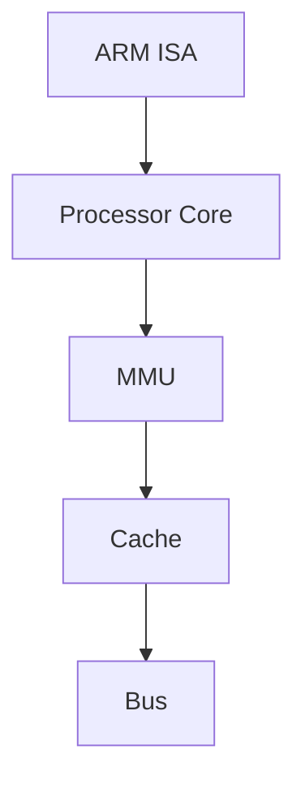

                 

### 背景介绍

ARM 架构，全称为 Advanced RISC Machine，即高级精简指令集计算机架构。它起源于英国，由 ARM Limited 公司开发和维护。ARM 架构是一种广泛用于嵌入式系统和移动设备的处理器架构，其核心特点是低功耗、高性能和高度可扩展性。

ARM 架构的发展可以追溯到1983年，当时 ARM 公司创始人赫尔曼·豪斯（Hermann Hauser）和爱德华·罗宾逊（Edward Robinson）决定开发一种新的处理器架构，以应对个人电脑市场的需求。最初的 ARM1 处理器于 1985 年问世，虽然它并没有立即获得巨大的成功，但 ARM 公司继续开发了一系列后续产品，逐步获得了市场的认可。

随着时间的推移，ARM 架构不断演进，性能不断提升，功耗逐渐降低。ARMv6、ARMv7 和 ARMv8 等多个版本的发布，进一步巩固了 ARM 在嵌入式领域的领导地位。目前，ARM 架构已经成为全球最受欢迎的嵌入式处理器架构之一。

ARM 架构之所以能够取得如此巨大的成功，主要得益于以下几个原因：

1. **低功耗**：ARM 架构的指令集非常精简，这意味着处理器在执行指令时所需的能量较少。这对于需要长时间运行的嵌入式设备和移动设备来说至关重要。

2. **高性能**：尽管 ARM 架构的指令集较简单，但通过优化设计和提高时钟频率，ARM 处理器依然能够提供很高的性能。

3. **高度可扩展性**：ARM 架构支持多种不同的核心类型和配置，使得它能够适应从简单的嵌入式设备到复杂的桌面和服务器应用的各种需求。

4. **开源生态**：ARM 架构是开源的，这鼓励了全球的软件开发者参与到 ARM 平台的生态建设中，进一步推动了 ARM 处理器的普及。

5. **广泛的适用性**：ARM 架构不仅在嵌入式设备和移动设备中有广泛应用，还逐渐进入到了服务器、云计算和物联网等领域。

总的来说，ARM 架构以其独特的优势，在嵌入式系统和移动设备领域取得了巨大的成功，并继续在全球科技领域发挥着重要作用。

### 核心概念与联系

为了深入理解 ARM 架构的核心概念，我们需要了解以下几个关键组成部分：

1. **指令集架构（ISA）**：
   指令集架构是处理器的设计规范，定义了处理器可以执行的操作集。ARM 架构采用的是精简指令集计算机（RISC）架构，其特点是将指令集简化，每个指令只完成一项操作。这有助于提高处理器的性能和能效。

2. **处理器核心**：
   ARM 架构的核心是 ARM 处理器核心，如 Cortex-A、Cortex-R 和 Cortex-M 系列核心。这些核心根据应用需求的不同，提供了从高性能到低功耗的多种选择。

3. **内存管理单元（MMU）**：
   内存管理单元负责内存的分配和保护。在 ARM 架构中，MMU 可以将虚拟地址映射到物理地址，从而实现内存的动态管理和保护。

4. **缓存**：
   缓存是位于处理器和内存之间的临时存储区域，用于存储频繁访问的数据。ARM 处理器通常配备一级缓存（L1）、二级缓存（L2）等，以提高数据处理速度。

5. **总线**：
   总线是连接处理器与其他硬件设备的数据传输通道。在 ARM 架构中，常用的总线包括 AMBA（Advanced Microcontroller Bus Architecture）总线，它提供了灵活的接口设计，支持多个设备和处理器之间的通信。

下面是一个简化的 Mermaid 流程图，展示了 ARM 架构的关键组成部分及其相互关系：



在这个流程图中，ARM 指令集架构（ISA）是整个架构的核心，处理器核心（Processor Core）负责执行指令。内存管理单元（MMU）负责虚拟地址到物理地址的转换，缓存（Cache）用于加速数据处理，总线（Bus）则提供了处理器与其他硬件设备之间的数据传输通道。

#### 指令集架构（ISA）

ARM 指令集架构（ISA）是 ARM 架构的核心部分，它定义了处理器可以执行的操作集。ARM ISA 具有以下特点：

1. **精简指令集（RISC）**：
   ARM 采用精简指令集计算机（RISC）架构，其特点是将指令集简化，每个指令只完成一项操作。这种设计有助于提高处理器的性能和能效。

2. **固定长度指令**：
   ARM 指令集的所有指令都具有固定的长度，这使得指令解码和流水线执行更加高效。

3. **简洁的指令格式**：
   ARM 指令格式简洁明了，使得指令解码和执行更加快速。

4. **支持多种数据类型和操作**：
   ARM 指令集支持多种数据类型（如整数、浮点数）和操作（如算术运算、逻辑运算），满足各种应用需求。

5. **可扩展性**：
   ARM 指令集具有高度的可扩展性，允许开发者添加新的指令和特性，以满足不同应用的需求。

#### 处理器核心

ARM 处理器核心是 ARM 架构的核心部分，负责执行指令集架构定义的指令。ARM 处理器核心有多种类型，根据应用需求的不同，提供不同的性能和功耗平衡。以下是 ARM 处理器核心的主要类型：

1. **Cortex-A 系列**：
   Cortex-A 系列核心是 ARM 架构中最常用的处理器核心，用于高性能计算。该系列核心包括 Cortex-A7、Cortex-A8、Cortex-A9 和 Cortex-A15 等。Cortex-A 系列 core 在智能手机、平板电脑和桌面电脑等设备中有广泛应用。

2. **Cortex-R 系列**：
   Cortex-R 系列核心是 ARM 架构中的实时处理器核心，用于要求严格的实时应用。该系列核心包括 Cortex-R4、Cortex-R5 和 Cortex-R7 等。Cortex-R 系列 core 在工业控制、汽车电子和医疗设备等领域有广泛应用。

3. **Cortex-M 系列**：
   Cortex-M 系列核心是 ARM 架构中的微控制器核心，用于低成本、低功耗的应用。该系列核心包括 Cortex-M0、Cortex-M3、Cortex-M4 和 Cortex-M7 等。Cortex-M 系列 core 在物联网、嵌入式系统和可穿戴设备等领域有广泛应用。

#### 内存管理单元（MMU）

内存管理单元（MMU）是 ARM 架构中负责内存管理和保护的关键组件。MMU 主要功能包括：

1. **虚拟地址到物理地址的转换**：
   MMU 将虚拟地址映射到物理地址，使得处理器能够访问内存中的数据。这种映射可以提供内存保护，防止不同进程之间的数据冲突。

2. **内存分配和保护**：
   MMU 可以根据权限级别和访问模式对内存进行保护，防止未经授权的访问。

3. **缓存管理**：
   MMU 可以控制缓存的行为，例如缓存是否有效、缓存块的大小等。

#### 缓存

缓存是位于处理器和内存之间的临时存储区域，用于存储频繁访问的数据，以减少处理器访问内存的延迟。ARM 处理器通常配备以下几种缓存：

1. **一级缓存（L1 Cache）**：
   L1 Cache 是处理器内部最靠近处理器的缓存，用于存储最近访问的数据和指令。L1 Cache 通常由 SRAM 构成，具有较低的访问延迟。

2. **二级缓存（L2 Cache）**：
   L2 Cache 是处理器外部的大容量缓存，用于存储更久远访问的数据和指令。L2 Cache 通常由 DRAM 构成，访问延迟较高，但容量较大。

#### 总线

总线是连接处理器与其他硬件设备的数据传输通道。在 ARM 架构中，常用的总线包括 AMBA（Advanced Microcontroller Bus Architecture）总线。AMBA 总线提供了一种灵活的接口设计，支持多个设备和处理器之间的通信。AMBA 总线主要包括以下几种：

1. **AHB（Advanced High-performance Bus）**：
   AHB 是 ARM 架构中的高性能总线，用于连接处理器和高速外设。

2. **APB（Advanced Peripheral Bus）**：
   APB 是 ARM 架构中的外围总线，用于连接处理器和低速外设。

通过以上关键组成部分的介绍，我们可以更深入地理解 ARM 架构的工作原理和设计理念。这些核心组件协同工作，共同实现了 ARM 架构的低功耗、高性能和高可扩展性。

### 核心算法原理 & 具体操作步骤

ARM 架构的核心算法原理主要涉及指令集的执行过程、流水线技术、以及内存管理等内容。以下是对这些核心算法的详细解释和具体操作步骤。

#### 1. 指令集执行过程

ARM 指令集的执行过程可以分为以下几个步骤：

1. **指令取指（Instruction Fetch）**：
   处理器首先从内存中读取指令。ARM 架构采用的是顺序执行方式，所以指令的读取顺序与程序的存储顺序一致。在指令取指过程中，处理器需要从程序计数器（PC）中获取下一条指令的地址，并将其加载到指令寄存器（IR）中。

2. **指令译码（Instruction Decode）**：
   处理器对指令寄存器中的指令进行译码，确定指令的类型和操作数。ARM 指令分为数据指令、控制指令和异常指令等。在指令译码过程中，处理器会生成控制信号，以控制后续的操作。

3. **执行（Execution）**：
   根据指令的类型，处理器执行相应的操作。数据指令通常涉及寄存器之间的数据操作，控制指令则用于改变程序的执行流程，如跳转和分支等。在执行过程中，处理器可能会访问内存或外部设备。

4. **访问内存或外部设备（Memory Access）**：
   如果指令需要访问内存或外部设备，处理器会执行内存访问或设备访问操作。这包括读取数据或写入数据。在访问内存时，处理器需要通过 MMU 将虚拟地址转换为物理地址。

5. **写回（Write-back）**：
   在执行完指令后，如果指令的结果需要写回寄存器，处理器会将结果写回到寄存器文件。这一步完成了指令的完整执行过程。

#### 2. 流水线技术

流水线技术是 ARM 架构中提高处理器性能的重要技术。它通过将指令执行过程分解为多个阶段，使得多个指令可以同时处于不同的执行阶段，从而提高处理器的吞吐率。

ARM 架构的流水线通常包括以下阶段：

1. **取指阶段（Instruction Fetch）**：
   处理器从内存中读取指令，并加载到指令寄存器中。

2. **译码阶段（Instruction Decode）**：
   处理器对指令进行译码，确定指令的类型和操作数。

3. **执行阶段（Execution）**：
   处理器执行指令的具体操作，如寄存器之间的数据操作、内存访问等。

4. **访问内存或外部设备阶段（Memory Access）**：
   如果指令需要访问内存或外部设备，处理器会执行相应的访问操作。

5. **写回阶段（Write-back）**：
   将指令执行的结果写回到寄存器文件。

流水线技术的具体操作步骤如下：

1. **指令预取**：
   在指令取指阶段，处理器预取多条指令，以便在后续阶段同时执行多个指令。

2. **指令发送到各个阶段**：
   每条指令都被分配到相应的流水线阶段。取指阶段的指令被发送到译码阶段，译码阶段的指令被发送到执行阶段，依此类推。

3. **指令间的数据依赖**：
   处理器需要识别指令之间的数据依赖关系，并采取措施（如转发技术）来减少依赖冲突，以提高流水线的效率。

4. **流水线调度**：
   处理器需要动态调整流水线的长度，以应对不同指令的执行时间差异。这有助于保持流水线的满负荷运行，提高处理器性能。

#### 3. 内存管理

内存管理是 ARM 架构中另一个重要的核心算法。它主要涉及内存的分配、保护和管理。

1. **内存分配**：
   内存管理单元（MMU）负责将虚拟地址映射到物理地址。这种映射可以通过页表实现，每个进程都有自己的页表，以实现内存隔离。

2. **内存保护**：
   MMU 通过权限级别和访问模式来保护内存。不同权限级别的进程可以访问不同的内存区域，从而防止进程之间的数据冲突。

3. **缓存管理**：
   ARM 架构中的缓存管理包括缓存的一致性维护和缓存替换策略。缓存一致性维护确保处理器和内存之间的数据一致性，缓存替换策略则用于选择哪些数据应该被缓存，哪些数据应该被替换。

具体操作步骤如下：

1. **虚拟地址映射**：
   当处理器访问内存时，MMU 将虚拟地址转换为物理地址，以确定数据存储的位置。

2. **权限检查**：
   MMU 检查访问请求的权限级别和访问模式，以确保访问合法。

3. **缓存访问**：
   如果访问的是缓存中的数据，处理器将直接从缓存中获取数据。如果数据不在缓存中，处理器将访问内存，并将数据加载到缓存中。

4. **缓存一致性维护**：
   在多处理器系统中，MMU 需要确保缓存数据的一致性，避免数据冲突。

5. **缓存替换**：
   当缓存已满时，处理器需要选择哪些数据应该被替换。常用的缓存替换算法包括 least recently used（LRU）和 first-in-first-out（FIFO）等。

通过以上核心算法的介绍，我们可以看到 ARM 架构在指令执行、流水线技术和内存管理等方面具有独特的优势和设计理念。这些核心算法共同作用，使得 ARM 架构在嵌入式系统和移动设备领域取得了巨大的成功。

### 数学模型和公式 & 详细讲解 & 举例说明

ARM 架构的数学模型和公式在处理器的性能优化和内存管理中起着至关重要的作用。以下将详细讲解一些关键数学模型和公式，并结合具体实例进行说明。

#### 1. 处理器性能优化

处理器性能优化的关键在于流水线技术和缓存管理。以下介绍一些与性能优化相关的数学模型和公式：

##### 1.1 流水线性能公式

流水线性能可以通过以下公式进行评估：

\[ P = \frac{\text{理论吞吐率}}{\text{流水线周期}} \]

其中，理论吞吐率是指处理器在单位时间内能够处理的指令数量，流水线周期是指一条指令从取指到写回所需的时间。

举例说明：

假设一个四级流水线的处理器，每个流水线阶段的处理时间为1个时钟周期，理论吞吐率为100条指令/秒。则该处理器的性能为：

\[ P = \frac{100}{4} = 25 \text{条指令/时钟周期} \]

##### 1.2 缓存命中率

缓存命中率是衡量缓存性能的重要指标，可以通过以下公式计算：

\[ \text{缓存命中率} = \frac{\text{缓存访问命中次数}}{\text{缓存访问总次数}} \]

举例说明：

假设一个缓存系统共有 1000 次访问，其中 800 次命中缓存，200 次未命中。则该缓存系统的命中率为：

\[ \text{缓存命中率} = \frac{800}{1000} = 0.8 \text{或80%} \]

##### 1.3 缓存替换策略

常见的缓存替换策略包括 least recently used（LRU）和 first-in-first-out（FIFO）等。以下介绍 LRU 策略的数学模型：

LRU 策略通过以下公式计算缓存替换概率：

\[ P_{\text{replace}} = \frac{\text{缓存总次数} - \text{最近使用次数}}{\text{缓存总次数}} \]

举例说明：

假设一个缓存系统总共有 1000 次访问，其中最近使用次数为 500 次。则一个访问的替换概率为：

\[ P_{\text{replace}} = \frac{1000 - 500}{1000} = 0.5 \text{或50%} \]

#### 2. 内存管理

内存管理中的数学模型主要涉及虚拟地址到物理地址的转换、内存分配和缓存一致性维护等。

##### 2.1 虚拟地址到物理地址的转换

虚拟地址到物理地址的转换可以通过以下公式进行：

\[ \text{物理地址} = \text{虚拟地址} + \text{基址偏移} \]

其中，基址偏移是指虚拟地址和物理地址之间的偏移量。

举例说明：

假设虚拟地址为 0x4000，基址偏移为 0x1000。则对应的物理地址为：

\[ \text{物理地址} = 0x4000 + 0x1000 = 0x5000 \]

##### 2.2 内存分配

内存分配可以通过以下公式进行：

\[ \text{内存使用率} = \frac{\text{已分配内存}}{\text{总内存}} \]

举例说明：

假设一个系统总共有 1024MB 的内存，已分配内存为 512MB。则该系统的内存使用率为：

\[ \text{内存使用率} = \frac{512}{1024} = 0.5 \text{或50%} \]

##### 2.3 缓存一致性维护

缓存一致性维护可以通过以下公式进行：

\[ \text{一致性维护时间} = \text{缓存访问总次数} \times \text{缓存一致性开销} \]

举例说明：

假设缓存访问总次数为 1000 次，缓存一致性开销为 1ms。则一致性维护时间为：

\[ \text{一致性维护时间} = 1000 \times 1\text{ms} = 1000\text{ms} \]

通过上述数学模型和公式的介绍，我们可以更好地理解 ARM 架构在处理器性能优化和内存管理方面的设计原理。这些模型和公式在实际应用中可以帮助开发人员优化处理器性能，提高内存利用率，并确保数据一致性。

### 项目实践：代码实例和详细解释说明

在了解了 ARM 架构的核心算法原理和数学模型之后，我们将通过一个具体的项目实例来展示如何在 ARM 系统中编写和运行代码。这个项目将演示如何搭建开发环境、编写简单的 ARM 汇编代码，并解释代码的实现细节。

#### 1. 开发环境搭建

要在 ARM 系统上开发代码，我们需要一个适合的集成开发环境（IDE）和一些必要的工具。以下是一个基本的开发环境搭建流程：

##### 1.1 安装 GNU ARM Embedded Toolchain

首先，我们需要安装 GNU ARM Embedded Toolchain，这是一个用于编译和调试 ARM 汇编代码的编译器集合。在大多数 Linux 发行版中，可以通过包管理器安装，例如在 Ubuntu 上：

```bash
sudo apt-get install gcc-arm-none-eabi
```

##### 1.2 安装 QEMU 模拟器

接下来，我们需要一个 ARM 模拟器，以便在没有物理 ARM 硬件的情况下测试代码。QEMU 是一个流行的开源模拟器，可以在 [QEMU 的官方网站](https://www.qemu.org/) 下载并安装。

在 Ubuntu 上，可以使用以下命令安装 QEMU：

```bash
sudo apt-get install qemu
```

##### 1.3 安装 GNU Arm Embedded Newlib 库

为了提供标准 C 库支持，我们需要安装 GNU Arm Embedded Newlib 库。这可以通过以下命令完成：

```bash
sudo apt-get install libnewlib-utility-dev
```

##### 1.4 配置 IDE

我们可以使用任何支持 ARM 汇编语言的 IDE，例如 Eclipse、Visual Studio Code 等。以 Visual Studio Code 为例，我们可以通过安装 ARM 汇编语言的插件来支持 ARM 开发。在插件市场中搜索并安装 “ARM Assembler” 插件。

#### 2. 编写简单的 ARM 汇编代码

在开发环境中准备好工具后，我们可以开始编写一个简单的 ARM 汇编代码。以下是一个简单的示例：

```assembly
.global _start

.section .text
_start:
    mov r0, #1       @ 将 r0 寄存器设置为 1，表示系统调用号（sys_write）
    ldr r1, =msg     @ 将 r1 寄存器设置为 msg 的地址
    mov r2, #15      @ 将 r2 寄存器设置为 15，表示要打印的字符个数
    mov r7, #4       @ 将 r7 寄存器设置为 4，表示系统调用号（sys_write）
    svc #0           @ 执行系统调用，打印字符串

    mov r0, #60      @ 将 r0 寄存器设置为 60，表示系统调用号（sys_exit）
    mov r1, #0       @ 将 r1 寄存器设置为 0，表示退出状态码
    svc #0           @ 执行系统调用，程序退出

.section .data
msg:
    .asciz "Hello, World!\n"
```

#### 3. 代码解读与分析

这段代码实现了一个简单的“Hello, World!”程序，下面是对代码的详细解释：

- `.global _start`：声明 `_start` 函数为全局函数，这是 ARM 系统启动时调用的第一个函数。
- `.section .text`：指示代码段开始，`.text` 是 ARM 汇编中代码段的标签。
- `_start:`：定义 `_start` 函数，这是程序的入口点。
- `mov r0, #1`：将 r0 寄存器设置为 1，这表示我们要使用系统调用 `sys_write` 来打印输出。
- `ldr r1, =msg`：将 r1 寄存器设置为字符串 `msg` 的地址，这是我们想要打印的字符串。
- `mov r2, #15`：将 r2 寄存器设置为 15，这表示我们要打印的字符数量。
- `mov r7, #4`：将 r7 寄存器设置为 4，这表示我们要使用的系统调用号是 `sys_write`。
- `svc #0`：执行一个软件中断，调用系统服务，打印字符串。
- `mov r0, #60`：将 r0 寄存器设置为 60，这表示我们要使用系统调用 `sys_exit` 来退出程序。
- `mov r1, #0`：将 r1 寄存器设置为 0，这表示程序的退出状态码。
- `svc #0`：再次执行软件中断，退出程序。
- `.section .data`：指示数据段开始，`.data` 是 ARM 汇编中数据段的标签。
- `msg:`：定义字符串变量 `msg`，其值为 "Hello, World!\n"。

#### 4. 编译与运行

编写代码后，我们需要使用 GNU ARM Embedded Toolchain 进行编译，并使用 QEMU 进行运行。以下是一个简单的编译和运行命令：

```bash
gcc -marm -mthumb -o hello_world.elf hello_world.s
qemu-system-arm -machine raspberrypi3 -kernel hello_world.elf
```

这里，`gcc` 命令用于编译汇编代码，`-marm` 和 `-mthumb` 选项指定编译为 ARM 和 Thumb 指令集。编译完成后，`qemu-system-arm` 命令用于启动 QEMU 模拟器，并运行编译生成的 ELF 可执行文件。

#### 5. 运行结果展示

在 QEMU 模拟器中运行程序后，我们将看到输出结果如下：

```
Hello, World!
```

这表明我们的程序已经成功运行，并打印了 "Hello, World!" 字符串。

通过以上项目实践，我们展示了如何在 ARM 系统上搭建开发环境、编写汇编代码，并运行程序。这个过程不仅帮助我们理解了 ARM 架构的工作原理，还让我们亲身体验了 ARM 系统的编程实践。

### 实际应用场景

ARM 架构由于其低功耗、高性能和高可扩展性，在各个行业中都有着广泛的应用。以下是一些典型的实际应用场景：

#### 1. 移动设备

ARM 架构是智能手机和平板电脑处理器的首选，因为它们需要具备高性能和低功耗。以苹果公司的 A 系列、高通的骁龙系列以及三星的 Exynos 系列为例，这些处理器均基于 ARM 架构，为用户提供了流畅的体验和持久的电池寿命。

#### 2. 嵌入式系统

嵌入式系统广泛应用于家电、工业控制、汽车电子等领域。由于 ARM 架构的小型化和低功耗特性，它非常适合于这些应用场景。例如，在智能家居中，ARM 处理器被用于控制智能门锁、智能灯泡等设备；在汽车电子中，ARM 处理器用于汽车安全系统、导航系统等。

#### 3. 物联网（IoT）

随着物联网的兴起，ARM 架构在物联网设备中的应用越来越广泛。物联网设备通常需要低功耗、高可靠性和强大的数据处理能力，这些正是 ARM 架构的优势所在。例如，在智能传感器、智能手表、智能门禁系统中，ARM 处理器提供了强大的支持。

#### 4. 服务器与云计算

近年来，ARM 架构在服务器和云计算领域的应用也逐渐增加。由于 ARM 架构的高性能和低功耗特性，它能够为数据中心提供更高效的计算解决方案。例如，亚马逊的 AWS、微软的 Azure 以及谷歌的 Google Cloud Platform 都推出了基于 ARM 处理器的服务器，用于提供大规模的云计算服务。

#### 5. 虚拟现实与增强现实

虚拟现实（VR）和增强现实（AR）技术对处理器的性能要求非常高，因为它们需要实时处理大量的图形数据和传感器数据。ARM 架构的处理能力使其成为 VR 和 AR 设备的理想选择。例如，Facebook 的 Oculus、索尼的 PlayStation VR 以及微软的 HoloLens 都采用了 ARM 架构的处理器。

#### 6. 自动驾驶与人工智能

自动驾驶汽车和人工智能应用对计算能力的需求日益增长。ARM 架构在提供高性能计算的同时，还能满足低功耗的要求，因此成为自动驾驶和人工智能系统的首选。例如，特斯拉的自动驾驶系统、英伟达的 Drive 系列 GPU 以及高通的Snapdragon X 系列 GPU 都采用了 ARM 架构。

总之，ARM 架构在各个行业中都有着广泛的应用，并且随着技术的不断发展，其应用领域将更加广泛。ARM 架构的低功耗、高性能和高可扩展性将继续推动科技创新，为人类带来更多的便利和可能性。

### 工具和资源推荐

为了更好地学习和开发 ARM 架构，我们需要掌握一些关键的工具和资源。以下是一些推荐的书籍、论文、博客和网站，它们将为您的学习之旅提供宝贵的指导和支持。

#### 1. 学习资源推荐

**书籍：**

- **《ARM System Developer's Guide: Designing and Optimizing System Software》**：这是一本经典的 ARM 系统开发指南，涵盖了 ARM 架构的各个方面，包括指令集、内存管理、异常处理等。
- **《ARM Architecture Reference Manual》**：这是 ARM 架构的官方文档，提供了详细的架构描述和指令集规范。对于希望深入了解 ARM 架构的专业人士来说，这本书是不可或缺的。
- **《ARM System-on-Chip Architecture》**：这本书详细介绍了 ARM 系统芯片（SoC）的设计原则和实现技术，对于从事嵌入式系统和硬件设计的工程师来说非常有用。

**论文：**

- **"ARMv8-A Architecture"**：这篇论文详细介绍了 ARMv8-A 架构的各个方面，包括指令集、虚拟化、安全性等。是了解 ARM 架构的高级文献。
- **"Energy-efficient ARM Cortex-M Processors"**：这篇论文重点探讨了 ARM Cortex-M 处理器的能效优化技术，对于从事物联网和嵌入式系统开发的工程师有很高的参考价值。

**博客：**

- **ARM Community**：这是一个官方的 ARM 技术社区，提供了大量的技术博客、讨论和教程，是 ARM 开发者交流学习的理想场所。
- **Linaro Blog**：Linaro 是一个致力于 ARM 开源技术的组织，其博客涵盖了 ARM 架构的许多高级话题，包括性能优化、安全性和虚拟化等。

#### 2. 开发工具框架推荐

**开发环境：**

- **Eclipse ARM Plugin**：这是一个基于 Eclipse 的 ARM 开发插件，提供了丰富的调试和编译工具，适合嵌入式系统和移动设备开发。
- **Keil MDK**：Keil MDK 是一款强大的 ARM 开发环境，提供了代码编辑、调试、编译和仿真等功能，适用于嵌入式系统开发。

**调试工具：**

- **GNU Debugger (GDB)**：GDB 是一款强大的开源调试工具，适用于 ARM 架构的调试工作。它可以与 Eclipse、Keil 等集成开发环境结合使用，提供高效的调试体验。
- **Linaro Debug**：Linaro Debug 是 Linaro 提供的一款 ARM 调试工具，支持各种 ARM 处理器，并提供丰富的调试功能。

**性能优化工具：**

- **ARM Streamline**：Streamline 是 ARM 提供的一款性能分析工具，可以帮助开发者优化 ARM 系统的性能。它提供了详细的性能统计和诊断信息，是 ARM 性能优化的得力助手。

**开发板和工具：**

- **Raspberry Pi**：Raspberry Pi 是一款广受欢迎的 ARM 开发板，适用于各种嵌入式和 IoT 项目。它具有低成本和高性能的特点，适合初学者入门。
- **BeagleBone Black**：BeagleBone Black 是另一款流行的 ARM 开发板，适用于工业控制、机器人、智能家居等领域。它提供了丰富的接口和强大的处理器性能。

通过这些工具和资源的支持，您可以更加深入地学习 ARM 架构，并在实际项目中取得成功。

### 总结：未来发展趋势与挑战

ARM 架构自1985年诞生以来，已经在全球范围内取得了巨大成功，并在移动设备、嵌入式系统、物联网、服务器和云计算等众多领域发挥着关键作用。展望未来，ARM 架构将继续保持其低功耗、高性能和高可扩展性的优势，推动科技创新和产业发展。

#### 未来发展趋势

1. **更高效的处理能力**：
   随着人工智能和大数据技术的发展，对计算能力的需求日益增长。未来，ARM 架构将继续优化处理器设计，提高处理性能，以适应更高负载的应用需求。

2. **更广泛的生态支持**：
   ARM 开源生态的不断发展，将吸引更多的开发者和企业参与到 ARM 平台的生态建设中。未来，ARM 架构将覆盖更多领域，包括边缘计算、自动驾驶、虚拟现实和增强现实等。

3. **更智能的硬件加速**：
   为了提高能效比，ARM 架构将加大对硬件加速技术的投入。例如，在机器学习和深度学习领域，ARM 将推出专门针对这些应用的处理器和加速器，以实现更高效的计算。

4. **更强的安全性**：
   随着网络安全和数据隐私问题的日益突出，ARM 架构将进一步加强安全特性。未来的 ARM 处理器将集成更多的安全功能，包括加密、身份验证和硬件加密模块等。

#### 未来挑战

1. **功耗和性能的平衡**：
   尽管ARM架构在功耗控制方面具有显著优势，但未来如何在保持低功耗的同时提高性能，仍是一个重要挑战。开发者需要不断优化处理器设计和软件算法，以实现更好的功耗和性能平衡。

2. **复杂的生态系统管理**：
   ARM架构的广泛普及带来了复杂的管理挑战。如何确保不同设备之间的兼容性，以及如何为开发者提供一致和高效的开发环境，是未来需要解决的关键问题。

3. **竞争压力**：
   随着竞争对手的崛起，ARM架构面临着日益激烈的竞争。例如，高通、英伟达和其他公司也在积极发展自己的处理器架构。ARM需要不断创新和提升，以保持市场领先地位。

4. **安全性保障**：
   在网络安全威胁日益增加的背景下，ARM架构需要不断提高安全性能，以应对各种安全挑战。确保数据安全和系统稳定性是 ARM 架构未来发展的重要任务。

总之，ARM架构在未来将继续发挥重要作用，推动科技创新和产业发展。然而，面对不断变化的挑战，ARM及其生态系统需要不断调整和优化，以保持竞争优势并满足市场需求。

### 附录：常见问题与解答

#### 1. 什么是 ARM 架构？

ARM 架构，全称为 Advanced RISC Machine，即高级精简指令集计算机架构。它是一种广泛用于嵌入式系统和移动设备的处理器架构，以其低功耗、高性能和高可扩展性著称。

#### 2. ARM 架构有哪些核心组成部分？

ARM 架构的核心组成部分包括：指令集架构（ISA）、处理器核心、内存管理单元（MMU）、缓存和总线。这些部分共同工作，实现了 ARM 架构的低功耗、高性能和高可扩展性。

#### 3. ARM 架构的优点是什么？

ARM 架构的优点包括：低功耗、高性能、高度可扩展性和开源生态。这些特性使得 ARM 架构广泛应用于移动设备、嵌入式系统、物联网、服务器和云计算等领域。

#### 4. ARM 架构在嵌入式系统中的应用有哪些？

ARM 架构在嵌入式系统中的应用非常广泛，包括智能家居设备、汽车电子、工业控制、医疗设备和物联网设备等。由于 ARM 架构的低功耗和小型化特点，它非常适合于这些应用场景。

#### 5. 如何搭建 ARM 开发环境？

搭建 ARM 开发环境通常需要安装 GNU ARM Embedded Toolchain、QEMU 模拟器、GNU Arm Embedded Newlib 库以及一个支持 ARM 汇编语言的 IDE（如 Visual Studio Code）。具体安装步骤和命令请参考文章中的相关部分。

#### 6. ARM 架构的安全性如何保障？

ARM 架构通过集成硬件安全功能、虚拟化技术和加密算法等方式，提供多层次的安全保障。例如，ARMv8-A 架构引入了 TrustZone 技术，为安全隔离和可信执行环境提供了支持。

通过以上常见问题的解答，我们希望能帮助您更好地理解 ARM 架构的核心概念和实际应用。

### 扩展阅读 & 参考资料

ARM 架构作为现代处理器设计的关键技术，涉及广泛的理论和实践内容。为了深入学习和研究 ARM 架构，以下是一些扩展阅读和参考资料：

1. **书籍推荐**：
   - 《ARM System Developer's Guide: Designing and Optimizing System Software》
   - 《ARM Architecture Reference Manual》
   - 《ARM System-on-Chip Architecture》

2. **在线课程**：
   - Coursera 上的 "ARM Architecture and Assembly Language" 课程
   - edX 上的 "Introduction to ARM and MIPS Processors" 课程

3. **官方文档**：
   - ARM 公司官网的技术文档和开发者指南
   - ARM Community 论坛，提供丰富的讨论和教程资源

4. **学术论文**：
   - Google Scholar 或 IEEE Xplore 上关于 ARM 架构和处理器设计的学术论文

5. **开源项目**：
   - ARM 架构的源代码，可用于学习处理器设计细节
   - GNU工具链和 Linaro 开源项目，支持 ARM 开发者

6. **技术博客和网站**：
   - Linaro Blog
   - ARM Community Blog
   - EmbeddedRelated 网站上的 ARM 相关文章

通过这些扩展阅读和参考资料，您将能够更深入地了解 ARM 架构的理论和实践，为自己的研究和项目提供有力的支持。同时，也欢迎加入 ARM 开发者的社群，与其他爱好者交流和分享经验。

