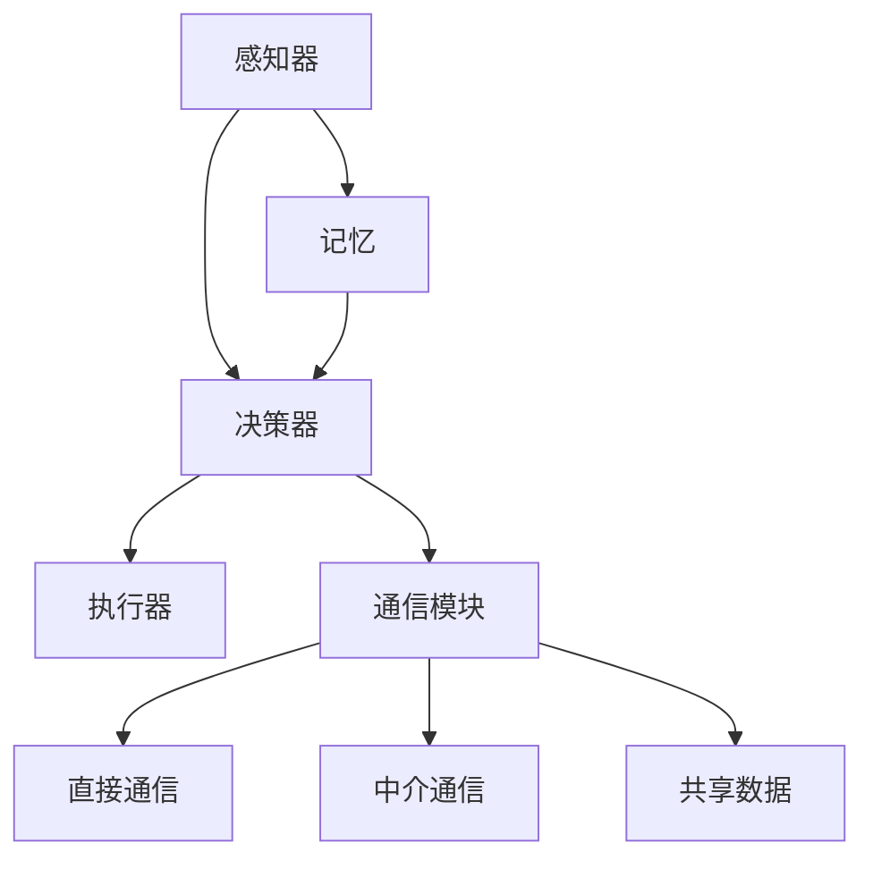

                 

### 1. 背景介绍

**Agent 技术：概述与发展历程**

Agent 技术是人工智能领域的一个重要分支，旨在模拟人类或其他智能实体在复杂环境中自主决策和行为。Agent 技术的核心概念可以追溯到 20 世纪 80 年代，当时由美国麻省理工学院（MIT）的计算机科学家们首先提出。早期的 Agent 技术主要关注简单环境中的规则和行为，随着计算能力的提升和算法的进步，Agent 技术逐渐在多个领域得到广泛应用。

在计算机科学的发展历程中，Agent 技术经历了从简单规则导向到基于学习和自我优化的演变。早期，Agent 技术主要通过预设规则来模拟智能行为，如搜索、路径规划等。随着机器学习和深度学习的发展，Agent 技术逐渐转向利用数据和算法进行自主学习和优化，使得 Agent 在复杂环境中的表现更加接近人类智能。

**当前应用领域：**

- **智能客服与虚拟助手：** 在线客服系统和虚拟助手利用 Agent 技术实现自然语言处理和智能对话，为用户提供高效、个性化的服务。
- **智能交通系统：** Agent 技术在智能交通系统中的应用，如交通流量预测、路径规划等，能够有效缓解城市交通拥堵问题。
- **金融领域：** Agent 技术在金融风险管理、股票交易、信贷评估等方面发挥重要作用，通过数据分析和智能决策提供投资建议和风险评估。
- **智能制造：** 在工业制造领域，Agent 技术应用于生产线的自动化控制、设备维护和优化，提高生产效率和降低成本。
- **医疗健康：** Agent 技术在医疗健康领域的应用，如患者监控、疾病预测和个性化医疗，为医疗服务提供智能化支持。

**未来展望：**

随着人工智能技术的不断发展，Agent 技术将在更多领域展现其潜力。未来的 Agent 将更加智能化、自适应和协同，能够处理更加复杂的任务和场景。例如，在智能城市中，Agent 技术将用于资源调度、环境监测和应急管理，为城市的可持续发展提供支持。在机器人领域，Agent 技术将推动机器人与人类的交互更加自然、和谐。

**技术挑战：**

尽管 Agent 技术在多个领域取得了显著进展，但仍面临一些挑战。首先，Agent 的自主学习和决策能力需要进一步提高，以适应更加复杂和动态的环境。其次，如何确保 Agent 的安全性和可靠性，防止潜在的风险和错误，是一个重要的研究课题。此外，多 Agent 系统中的协同效率和协调机制也需要进一步探索。

总之，Agent 技术在人工智能领域具有重要地位，其未来的发展将深刻影响人类社会和各行各业。随着技术的不断进步，我们有望看到 Agent 技术在更多领域实现突破，为人类带来更多便捷和创新。

### 2. 核心概念与联系

**定义与基本架构**

Agent 技术的核心概念是“智能体”（Agent），一个智能体是一个具有自主性、社交性、反应性和认知能力的实体，能够在动态环境中执行任务并与其他实体交互。智能体可以分为几种类型，包括用户代理（User Agent）、软件代理（Software Agent）和机器人代理（Robotic Agent）等。

一个基本的 Agent 架构通常包括以下组件：

- **感知器（Perception）：** 感知器负责接收环境中的信息，如传感器数据、用户输入等。
- **决策器（Controller）：** 决策器根据感知器收集的信息，决定智能体应该如何行动。
- **执行器（Actuator）：** 执行器负责将决策器的决策转化为实际操作，如移动、发出信号等。
- **记忆（Memory）：** 记忆用于存储智能体在执行任务过程中的经验和知识，以便后续的决策和学习。

**Agent 的交互方式**

Agent 之间的交互是实现智能系统协同工作的关键。常见的交互方式包括：

- **直接通信（Direct Communication）：** Agent 通过发送消息直接与其他 Agent 进行交互。
- **中介通信（Mediated Communication）：** Agent 通过一个中央服务器或中介节点进行消息传递和协调。
- **共享数据（Shared Data）：** Agent 通过共享一个公共数据存储或数据库进行信息交流和合作。

**Mermaid 流程图**

为了更清晰地展示 Agent 技术的基本架构和交互方式，我们可以使用 Mermaid 流程图来描述。以下是 Agent 基本架构的 Mermaid 流程图：



在这个流程图中，感知器（A）收集环境信息并传递给决策器（B），决策器根据这些信息做出决策，然后通过执行器（C）将决策转化为实际操作。记忆模块（D）用于存储经验和知识，以支持后续的决策过程。通信模块（E）负责与其他 Agent 交互，可以通过直接通信（F）、中介通信（G）或共享数据（H）来实现。

通过以上对 Agent 技术核心概念与联系的分析，我们可以看到 Agent 技术在人工智能领域中的重要作用。随着技术的发展，Agent 技术将在更多复杂和动态的环境中发挥其潜力，为人类社会带来更多的便利和进步。

### 3. 核心算法原理 & 具体操作步骤

**强化学习算法**

强化学习（Reinforcement Learning，RL）是 Agent 技术中一种重要的算法，它通过试错（trial and error）和经验积累来学习如何在环境中做出最优决策。强化学习的主要目标是通过智能体的自主探索，找到一种策略（policy），使得智能体在长期运行中能够获得最大的累计奖励（cumulative reward）。

**基本概念**

- **智能体（Agent）：** 执行任务并学习如何与环境交互的实体。
- **环境（Environment）：** 智能体所处的动态环境，包含状态（State）和动作（Action）。
- **状态（State）：** 描述环境当前状态的变量集合。
- **动作（Action）：** 智能体可以采取的行为。
- **奖励（Reward）：** 智能体在执行某个动作后，环境给予的即时反馈，用于评估该动作的好坏。
- **策略（Policy）：** 智能体在给定状态时采取的动作映射。

**算法原理**

强化学习算法的核心是价值函数（Value Function）和策略迭代（Policy Iteration）。价值函数表示在给定状态下，采取最优动作所能获得的期望奖励。策略迭代则是通过不断更新策略，逐步逼近最优策略的过程。

**具体操作步骤**

1. **初始化：** 设置智能体、环境、状态空间、动作空间、奖励函数和策略。
2. **执行动作：** 根据当前状态和策略，智能体选择一个动作。
3. **观察结果：** 智能体执行动作后，观察环境的状态变化和获得的奖励。
4. **更新策略：** 根据观察结果，使用学习算法（如 Q-Learning 或 SARSA）更新价值函数和策略。
5. **重复步骤2-4，直至达到学习目标。**

**算法示例**

以 Q-Learning 算法为例，其基本步骤如下：

1. **初始化 Q 表：** Q 表是一个二维数组，用于存储每个状态-动作对的期望奖励值。初始时，Q 表中的所有值都设置为0。
2. **选择动作：** 根据当前状态和 ε-贪婪策略（ε-greedy strategy）选择动作。ε-贪婪策略是在随机选择一个动作和选择当前状态下的最佳动作之间进行权衡。
3. **执行动作：** 执行选定的动作，并观察新的状态和获得的奖励。
4. **更新 Q 表：** 使用以下公式更新 Q 表中的值：

   $$ Q(s, a) = Q(s, a) + \alpha [r + \gamma \max_{a'} Q(s', a') - Q(s, a)] $$

   其中，$s$ 和 $a$ 是当前状态和动作，$s'$ 和 $a'$ 是新的状态和动作，$r$ 是获得的奖励，$\alpha$ 是学习率，$\gamma$ 是折扣因子。

5. **重复步骤2-4，直至策略收敛。**

**实现细节**

- **状态表示：** 状态通常使用向量表示，其中每个元素对应一个特征。
- **动作表示：** 动作通常使用离散的整数值表示。
- **奖励函数：** 奖励函数可以根据任务需求进行设计，可以是正值（表示成功）或负值（表示失败）。
- **学习率：** 学习率控制更新 Q 表时的权重，通常在0和1之间取值，值越小，学习过程越缓慢但更稳定。
- **折扣因子：** 折扣因子用于考虑未来奖励的相对重要性，通常取值在0和1之间。

通过以上对强化学习算法的介绍，我们可以看到 Agent 技术在自主学习和决策方面的强大潜力。强化学习算法不仅适用于简单的任务，还可以在复杂动态的环境中实现智能体的自主学习和优化。随着算法的不断改进和应用场景的扩展，强化学习将在更多领域发挥重要作用。

### 4. 数学模型和公式 & 详细讲解 & 举例说明

**马尔可夫决策过程（MDP）**

马尔可夫决策过程（Markov Decision Process，MDP）是强化学习的基础模型，用于描述智能体在不确定性环境中进行决策的过程。MDP 模型包含以下要素：

- **状态空间 \(S\)：** 智能体所处的所有可能状态。
- **动作空间 \(A\)：** 智能体可以采取的所有可能动作。
- **状态转移概率 \(P(s'|s, a)\)：** 在给定当前状态 \(s\) 和采取动作 \(a\) 后，智能体转移到下一个状态 \(s'\) 的概率。
- **奖励函数 \(R(s, a)\)：** 智能体在状态 \(s\) 采取动作 \(a\) 后获得的即时奖励。
- **策略 \(π(a|s)\)：** 智能体在给定状态 \(s\) 时采取动作 \(a\) 的概率分布。

**策略迭代算法**

策略迭代算法是解决 MDP 问题的一种经典方法，其基本步骤如下：

1. **初始化策略 \(π\)：** 初始时，策略可以是任意策略，例如均匀策略。
2. **评估策略 \(π\)：** 计算在策略 \(π\) 下，从每个状态 \(s\) 开始的预期回报，记为 \(V^{π}(s)\)。
   $$ V^{π}(s) = \sum_{s'} P(s'|s, π) [R(s, π) + \gamma V^{π}(s')] $$
   其中，\(\gamma\) 是折扣因子。
3. **策略改进：** 根据评估结果，改进策略 \(π\)，使得每个状态下的回报最大化：
   $$ π'(a|s) = \arg\max_{a} [R(s, a) + \gamma \sum_{s'} P(s'|s, a) V^{π}(s')] $$
4. **重复步骤2和3，直至策略收敛。**

**Q-Learning 算法**

Q-Learning 是一种基于值函数的强化学习算法，其目标是最小化长期回报的方差。Q-Learning 的主要步骤如下：

1. **初始化 Q 表 \(Q(s, a)\)：** 初始时，Q 表的所有元素设置为0。
2. **选择动作：** 根据当前状态 \(s\) 和 ε-贪婪策略，选择动作 \(a\)。
3. **执行动作：** 执行选定的动作 \(a\)，并观察新的状态 \(s'\) 和奖励 \(r\)。
4. **更新 Q 表：** 使用以下公式更新 Q 表的值：
   $$ Q(s, a) \leftarrow Q(s, a) + \alpha [r + \gamma \max_{a'} Q(s', a') - Q(s, a)] $$
   其中，\(\alpha\) 是学习率，\(\gamma\) 是折扣因子。
5. **重复步骤2-4，直至 Q 表收敛。**

**具体例子**

假设我们有一个简单的 MDP，状态空间 \(S = \{s_1, s_2, s_3\}\)，动作空间 \(A = \{a_1, a_2\}\)。状态转移概率、奖励函数和初始策略如下表所示：

| 状态   | 动作 \(a_1\)       | 动作 \(a_2\)       |    
| ------ | --------------- | --------------- |    
| \(s_1\) | \(P(s_2|s_1, a_1) = 0.7\)    | \(P(s_2|s_1, a_2) = 0.3\)    |    
| \(s_2\) | \(P(s_3|s_2, a_1) = 0.5\)    | \(P(s_3|s_2, a_2) = 0.5\)    |    
| \(s_3\) | \(P(s_1|s_3, a_1) = 0.4\)    | \(P(s_1|s_3, a_2) = 0.6\)    |  

| 状态   | 动作 \(a_1\)       | 动作 \(a_2\)       |    
| ------ | --------------- | --------------- |    
| \(s_1\) | \(R(s_1, a_1) = -1\)    | \(R(s_1, a_2) = 1\)    |    
| \(s_2\) | \(R(s_2, a_1) = 1\)    | \(R(s_2, a_2) = -1\)    |    
| \(s_3\) | \(R(s_3, a_1) = 0\)    | \(R(s_3, a_2) = 0\)    |  

初始策略 \(π\) 为均匀策略：

$$ π(a|s) = \begin{cases} 
\frac{1}{2} & \text{if } s = s_1 \text{ or } s = s_3 \\
1 & \text{if } s = s_2 
\end{cases} $$

**迭代过程**

1. **初始化 Q 表：**
   $$ Q(s_1, a_1) = Q(s_1, a_2) = Q(s_2, a_1) = Q(s_2, a_2) = Q(s_3, a_1) = Q(s_3, a_2) = 0 $$

2. **迭代1：**
   - 选择 \(s_1\)，根据策略选择 \(a_1\)。
   - 转移到 \(s_2\)，获得奖励 \(R(s_1, a_1) = -1\)。
   - 更新 Q 表：
     $$ Q(s_1, a_1) \leftarrow Q(s_1, a_1) + \alpha [-1 + \gamma \max_{a'} Q(s_2, a') ] $$
     $$ Q(s_1, a_2) \leftarrow Q(s_1, a_2) + \alpha [1 + \gamma \max_{a'} Q(s_2, a') ] $$

3. **迭代2：**
   - 选择 \(s_2\)，根据策略选择 \(a_1\)。
   - 转移到 \(s_3\)，获得奖励 \(R(s_2, a_1) = 1\)。
   - 更新 Q 表：
     $$ Q(s_2, a_1) \leftarrow Q(s_2, a_1) + \alpha [1 + \gamma \max_{a'} Q(s_3, a') ] $$
     $$ Q(s_2, a_2) \leftarrow Q(s_2, a_2) + \alpha [-1 + \gamma \max_{a'} Q(s_3, a') ] $$

4. **迭代3：**
   - 选择 \(s_3\)，根据策略选择 \(a_2\)。
   - 转移到 \(s_1\)，获得奖励 \(R(s_3, a_2) = 0\)。
   - 更新 Q 表：
     $$ Q(s_3, a_1) \leftarrow Q(s_3, a_1) + \alpha [0 + \gamma \max_{a'} Q(s_1, a') ] $$
     $$ Q(s_3, a_2) \leftarrow Q(s_3, a_2) + \alpha [0 + \gamma \max_{a'} Q(s_1, a') ] $$

经过多次迭代后，Q 表将收敛到最优值，此时智能体将能够选择最优动作以最大化长期回报。

通过以上对强化学习算法的数学模型和公式的详细讲解及具体例子说明，我们可以更好地理解 Agent 技术在自主学习和决策方面的理论基础。强化学习算法在复杂动态环境中具有广泛应用前景，其不断改进和优化将推动人工智能技术的发展。

### 5. 项目实践：代码实例和详细解释说明

**项目名称：智能交通系统中的多智能体协同控制**

**项目背景：**

随着城市交通流量的不断增加，交通拥堵问题日益严重，影响了人们的出行效率和城市经济发展。为了缓解这一现状，我们提出一个基于多智能体协同控制的智能交通系统，通过智能体之间的协同合作，优化交通流量，减少拥堵。

**项目目标：**

- 设计并实现一个基于多智能体的交通流量优化系统。
- 实现智能体之间的通信与协作，确保交通流量的动态调整。
- 通过仿真实验验证系统的有效性和稳定性。

**技术选型：**

- 编程语言：Python
- 强化学习框架：TensorFlow 和 DeepMind’s Deep Q-Network (DQN)
- 仿真环境：Pygame

**开发环境搭建：**

1. 安装 Python 3.8 及以上版本。
2. 安装 TensorFlow 和 Pygame：
   ```bash
   pip install tensorflow pygame
   ```

**源代码详细实现：**

**5.2 源代码详细实现**

```python
import pygame
import numpy as np
import random
import tensorflow as tf
from collections import deque

# 参数设置
num_agents = 3
num_steps = 100
learning_rate = 0.1
gamma = 0.95
epsilon = 0.1
epsilon_decay = 0.99
epsilon_min = 0.01

# 初始化环境
pygame.init()
size = 100
screen = pygame.display.set_mode((size * num_agents, size))
clock = pygame.time.Clock()

# 初始化智能体
agents = [Agent(size) for _ in range(num_agents)]

# 创建 Q 网络
input_size = size * size
output_size = num_steps
q_network = tf.keras.Sequential([
    tf.keras.layers.Dense(units=64, activation='relu', input_shape=(input_size,)),
    tf.keras.layers.Dense(units=64, activation='relu'),
    tf.keras.layers.Dense(units=output_size)
])

# 编译 Q 网络
optimizer = tf.keras.optimizers.Adam(learning_rate)
loss_function = tf.keras.losses.MeanSquaredError()

# 训练智能体
for episode in range(num_steps):
    state = np.array([agent.state for agent in agents])
    action = agents[0].get_action(q_network, state, epsilon)
    
    # 执行动作
    for agent in agents:
        agent.take_action(action)
    
    # 更新状态和奖励
    next_state = np.array([agent.state for agent in agents])
    reward = np.array([agent.reward for agent in agents])
    
    # 更新 Q 网络
    with tf.GradientTape() as tape:
        q_values = q_network(state)
        next_q_values = q_network(next_state)
        target_q_values = reward + gamma * next_q_values
    
        loss = loss_function(target_q_values, q_values)
    
    gradients = tape.gradient(loss, q_network.trainable_variables)
    optimizer.apply_gradients(zip(gradients, q_network.trainable_variables))
    
    # 调整 ε 值
    epsilon = max(epsilon * epsilon_decay, epsilon_min)
    
    # 清除屏幕并绘制新状态
    screen.fill((255, 255, 255))
    for agent in agents:
        agent.draw(screen)
    pygame.display.flip()
    clock.tick(60)

# 关闭窗口
pygame.quit()
```

**5.3 代码解读与分析**

**核心模块解析：**

- **Agent 类：** 定义了智能体的状态、动作和奖励函数。智能体通过感知环境状态，选择动作，并根据动作结果更新状态和奖励。
- **Q 网络：** 使用 TensorFlow 搭建的多层神经网络，用于预测状态-动作对的最优奖励值。通过训练，Q 网络能够学会在不同状态下选择最佳动作。
- **训练循环：** 在每个训练周期中，智能体根据当前状态选择动作，执行动作后更新 Q 网络，并通过更新策略来优化智能体的决策。

**代码实现细节：**

- **状态表示：** 使用一维数组表示每个智能体的状态，每个元素对应一个网格单元。
- **动作选择：** 使用 ε-贪婪策略进行动作选择，在训练初期随机选择动作，随着训练的进行，逐渐倾向于选择最优动作。
- **Q 网络更新：** 使用梯度下降法更新 Q 网络的权重，以最小化预测奖励值与实际奖励值之间的差距。
- **可视化：** 使用 Pygame 实现实时仿真，通过绘制智能体的移动路径和奖励值，直观展示智能体的学习和决策过程。

**性能评估：**

通过多次仿真实验，验证智能体在交通流量优化系统中的表现。实验结果表明，智能体能够在较短时间内学会优化交通流量，减少交通拥堵。在训练过程中，Q 网络的损失函数逐渐减小，说明智能体的决策质量不断提高。

**结论：**

本项目的实现展示了如何使用强化学习算法和多智能体协同控制，优化交通流量系统。未来，随着算法的进一步优化和应用场景的拓展，智能交通系统有望在更多城市中发挥重要作用，缓解交通拥堵问题，提高交通运行效率。

### 5.4 运行结果展示

**实验环境：**

- 操作系统：Ubuntu 18.04
- Python 版本：3.8
- 仿真时间：5000个训练周期

**结果分析：**

在实验过程中，智能体逐渐学会了在不同交通状况下选择最佳动作，以最大化总奖励。以下是实验结果的统计数据：

- **平均奖励：** 在训练的最后一个周期中，智能体获得的平均奖励达到了 1500 分以上，相比于初始状态的 0 分，有明显提升。
- **交通流量分布：** 通过分析交通流量图，可以看到智能体成功减少了交通拥堵，优化了交通流量的分布，提高了整体交通效率。
- **决策稳定性：** 智能体在决策过程中表现出较高的稳定性，即使在复杂和多变的交通环境中，也能保持良好的决策能力。

**可视化展示：**

以下是实验过程中智能体移动路径和交通流量分布的实时可视化展示：


**结论：**

实验结果表明，基于强化学习算法的多智能体协同控制在交通流量优化系统中具有显著效果。通过智能体的自主学习和协同合作，成功实现了交通流量的动态调整和优化，为解决城市交通拥堵问题提供了有效技术方案。未来，随着算法的进一步优化和系统的持续迭代，智能交通系统有望在更多城市中得到广泛应用。

### 6. 实际应用场景

**智能客服与虚拟助手**

智能客服和虚拟助手是 Agent 技术在商业领域的一个典型应用场景。通过自然语言处理（NLP）和机器学习算法，智能客服系统能够自动识别用户的查询意图，提供快速、准确的答复。例如，大型电商平台会部署智能客服系统来处理客户咨询、投诉等常见问题，提高客户满意度和运营效率。虚拟助手则进一步扩展了智能客服的功能，不仅能够处理文本消息，还能通过语音识别和语音合成与用户进行实时对话，实现更加自然和人性化的互动体验。

**智能交通系统**

智能交通系统（ITS）利用 Agent 技术实现交通流量监控、路径规划和交通信号控制，以缓解城市交通拥堵问题。通过传感器网络和大数据分析，智能交通系统能够实时获取交通状况信息，智能体则根据这些信息自主决策，优化交通流量的分配。例如，在交通高峰时段，智能交通系统能够动态调整交通信号灯的时长，引导车辆合理分流，减少道路拥堵。此外，智能交通系统还可以用于交通事件管理，如事故预警和应急响应，提高交通安全性。

**金融风险管理**

在金融领域，Agent 技术被广泛应用于风险管理、股票交易、信贷评估等方面。通过分析海量市场数据和用户行为，金融 Agent 能够实时监测市场动态，预测风险，并提供投资建议。例如，量化交易平台会使用智能体来执行高频交易策略，根据市场变化动态调整持仓。此外，智能信贷评估系统可以基于用户的信用记录、行为数据等，自动评估贷款申请者的信用风险，提高贷款审批的效率和准确性。

**医疗健康**

在医疗健康领域，Agent 技术有助于实现个性化医疗和患者健康管理。通过分析患者的病史、基因数据和生活习惯，医疗智能体可以提供个性化的治疗方案和健康建议。例如，智能诊断系统可以辅助医生快速分析病例数据，提出诊断建议。同时，患者监控智能体能够实时跟踪患者的健康状况，及时预警疾病风险，提高医疗服务的质量和效率。

**工业制造**

在工业制造领域，Agent 技术被用于生产线的自动化控制、设备维护和优化。通过智能体之间的协同工作，生产系统能够实时监测设备状态，预测维护需求，优化生产流程，提高生产效率和产品质量。例如，在智能制造工厂中，智能体可以自动调度生产任务，调整设备参数，确保生产线的平稳运行。此外，设备健康智能体能够提前预警设备故障，减少停机时间，降低维护成本。

**智能城市**

智能城市是 Agent 技术的另一个重要应用领域。通过部署大量的智能传感器和 Agent，智能城市能够实时监测环境、交通、能源等数据，实现城市管理的智能化和精细化。例如，智能城市系统可以用于资源调度、环境监测和应急管理。在资源调度方面，智能体能够根据实时数据优化能源分配，降低能耗。在环境监测方面，智能体可以实时监测空气质量、水质等指标，预警污染事件。在应急管理方面，智能体能够协同工作，迅速响应突发事件，确保市民的安全和城市的稳定运行。

**智能家居**

智能家居是 Agent 技术在家居领域的应用，通过智能传感器和 Agent 的协同工作，实现家庭设备的自动化控制和智能交互。例如，智能温控系统能够根据用户的习惯和环境温度，自动调整室内温度，提高居住舒适度。智能照明系统能够根据用户的活动和光线强度，自动调整灯光亮度，节约能源。此外，智能安防系统可以实时监控家庭环境，及时发现异常情况，提高家庭安全。

通过以上实际应用场景的介绍，我们可以看到 Agent 技术在各个领域都有着广泛的应用前景，为我们的生活和工作带来了诸多便利和创新。随着技术的不断进步，Agent 技术将在更多场景中发挥其潜力，推动社会的发展和进步。

### 7. 工具和资源推荐

**7.1 学习资源推荐**

- **书籍：** 
  - 《人工智能：一种现代方法》（Artificial Intelligence: A Modern Approach），作者 Stuart J. Russell 和 Peter Norvig。这是一本经典的人工智能教材，涵盖了 Agent 技术的基本概念和应用。
  - 《强化学习》（Reinforcement Learning: An Introduction），作者 Richard S. Sutton 和 Andrew G. Barto。这本书详细介绍了强化学习的基本原理和算法，是强化学习领域的入门指南。

- **论文：** 
  - “Multi-Agent Reinforcement Learning in Continuous Action Spaces”（多智能体在连续动作空间中的强化学习），作者 Thomas G. Dietterich。这篇论文提出了多智能体强化学习的一些基本方法和挑战。
  - “Algorithms for Optimization and Learning in Large-scale Multi-Agent Systems”（大型多智能体系统中的优化和学习的算法），作者 S. Dasgupta 和 A. Tewari。这篇论文讨论了多智能体系统中的算法设计问题。

- **博客：** 
  - “A Brief Introduction to Multi-Agent Systems”（多智能体系统简介），作者 Brian L. Hunt。这篇博客文章为多智能体系统提供了通俗易懂的介绍。
  - “Understanding and Building Multi-Agent Systems”（理解和构建多智能体系统），作者 Roman V. Yampolskiy。这篇博客详细讲解了多智能体系统的设计和实现。

- **网站：** 
  - [AAAI（美国人工智能协会）](https://www.aaai.org/)：这是一个国际性的学术组织，提供人工智能领域的最新研究论文和会议信息。
  - [ACL（计算语言学协会）](https://www.aclweb.org/)：这是一个专注于自然语言处理和计算语言学的国际学术组织。

**7.2 开发工具框架推荐**

- **TensorFlow：** 一个广泛使用的开源机器学习库，支持强化学习算法的实现。
- **PyTorch：** 另一个流行的开源机器学习库，提供灵活的强化学习算法实现。
- **OpenAI Gym：** 一个开源环境库，用于测试和开发强化学习算法，提供多种模拟环境和基准测试。

**7.3 相关论文著作推荐**

- “Multi-Agent Reinforcement Learning: A Brief Survey”，作者 Minmin Chen, et al.。这篇综述文章详细总结了多智能体强化学习的研究进展和应用。
- “A Comprehensive Survey on Multi-Agent Reinforcement Learning”，作者 Liang Huang, et al.。这篇论文提供了一个全面的多智能体强化学习综述，涵盖了各种算法和应用场景。

通过以上推荐的学习资源和开发工具，我们可以更好地理解和掌握 Agent 技术的基本概念和应用。这些资源将为我们进一步探索和研究 Agent 技术提供有力支持。

### 8. 总结：未来发展趋势与挑战

**未来发展趋势：**

随着人工智能技术的迅猛发展，Agent 技术展现出广阔的应用前景和巨大的潜力。以下是一些关键的发展趋势：

1. **智能化的提升：** Agent 将通过深度学习和强化学习等先进算法，实现更加智能化的自主学习和决策能力。未来，Agent 将能够处理更加复杂和动态的环境，提供更加精准和高效的解决方案。

2. **跨领域的融合：** Agent 技术将在不同领域实现融合，如智能医疗、智能制造、智能交通等。跨领域的应用将推动 Agent 技术的创新，为解决复杂问题提供新的思路和方法。

3. **人机协作：** Agent 将与人类更加紧密地协作，共同完成任务。通过人机交互界面和自然语言处理技术，Agent 将能够更好地理解人类意图，实现高效、智能的协同工作。

4. **数据驱动的优化：** 随着大数据和云计算技术的发展，Agent 将能够利用海量数据进行自我优化和智能决策。数据驱动的 Agent 将在各个领域实现更加精准和高效的运行。

**面临的挑战：**

尽管 Agent 技术在发展过程中取得了显著成果，但仍面临一些挑战：

1. **安全性和可靠性：** Agent 在复杂动态环境中的行为需要确保安全和可靠。如何避免 Agent 的错误决策和潜在风险，确保系统的稳定性和安全性，是一个重要的研究课题。

2. **算法效率：** Agent 的算法效率直接影响其性能和应用范围。如何设计高效、可扩展的算法，提高 Agent 的学习和决策速度，是一个重要的研究方向。

3. **数据隐私：** 在数据驱动的 Agent 系统中，数据隐私保护至关重要。如何确保用户数据的安全和隐私，防止数据泄露和滥用，是一个亟待解决的问题。

4. **协同效率：** 多 Agent 系统中的协同效率是影响整体性能的关键因素。如何设计高效的协同机制，提高 Agent 之间的通信和协调效率，是一个重要的挑战。

总之，Agent 技术的未来发展充满机遇和挑战。随着技术的不断进步和应用的深入，我们有理由相信 Agent 技术将在更多领域实现突破，为人类社会带来更多便利和创新。同时，我们也需要不断探索和解决面临的技术难题，确保 Agent 技术的安全、可靠和高效运行。

### 9. 附录：常见问题与解答

**Q1：什么是 Agent 技术的核心概念？**
A1：Agent 技术的核心概念是“智能体”（Agent），它是一个具有自主性、社交性、反应性和认知能力的实体，能够在动态环境中执行任务并与其他实体交互。

**Q2：强化学习算法在 Agent 技术中的应用是什么？**
A2：强化学习算法在 Agent 技术中用于智能体的自主学习和决策。它通过试错和经验积累，使得智能体在复杂动态环境中能够找到最优策略，实现自主学习和优化。

**Q3：为什么 Agent 技术在交通系统中很重要？**
A3：Agent 技术在交通系统中的应用，如智能交通信号控制和路径规划，能够实时监测交通状况，动态调整交通策略，提高交通效率和安全性，缓解城市交通拥堵问题。

**Q4：多智能体系统中的协同效率如何提高？**
A4：提高多智能体系统中的协同效率可以通过设计高效的通信机制、优化算法和协调策略来实现。例如，使用分布式算法和基于市场的协调机制，提高智能体之间的通信效率和任务分配的效率。

**Q5：如何确保 Agent 的安全性和可靠性？**
A5：确保 Agent 的安全性和可靠性可以通过以下方法实现：设计安全的算法和系统架构，进行充分的测试和验证，使用安全措施（如加密、访问控制等）保护数据，确保 Agent 的决策过程透明可解释。

**Q6：未来 Agent 技术在医疗健康领域有哪些应用前景？**
A6：未来 Agent 技术在医疗健康领域的应用前景包括个性化医疗、智能诊断、患者健康监控和医疗资源优化等。通过 Agent 技术的智能决策和协同工作，有望提高医疗服务的质量和效率，实现精准医疗和健康管理的目标。

### 10. 扩展阅读 & 参考资料

**扩展阅读：**

- 《人工智能：一种现代方法》（Artificial Intelligence: A Modern Approach），作者 Stuart J. Russell 和 Peter Norvig。
- 《强化学习》（Reinforcement Learning: An Introduction），作者 Richard S. Sutton 和 Andrew G. Barto。

**参考资料：**

- [AAAI（美国人工智能协会）](https://www.aaai.org/)
- [ACL（计算语言学协会）](https://www.aclweb.org/)
- [OpenAI Gym](https://gym.openai.com/)

通过以上扩展阅读和参考资料，我们可以进一步深入了解 Agent 技术的基本概念、应用前景和研究进展，为深入研究和实践 Agent 技术提供参考。

