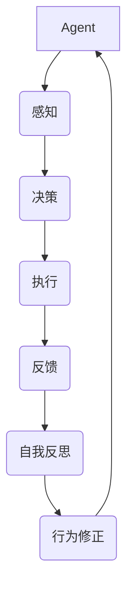

                 

### 背景介绍

在当今信息技术飞速发展的时代，人工智能（AI）领域的研究与应用正以前所未有的速度推进。特别是在深度学习和自主决策方面，AI技术正逐步实现从被动响应到主动探索的转变。在这一进程中，“Agent”成为了研究的热点之一。

Agent，通常指的是具备一定智能的计算机程序或系统，能够在特定环境中自主地感知、决策和执行任务。它们能够通过学习与环境交互，不断优化自身的行为策略，从而实现更为高效的任务完成。Agent的研究与应用，不仅为解决复杂问题提供了新的思路，同时也为自动化、智能化技术的发展注入了强大的动力。

然而，在Agent的执行过程中，如何确保其能够不断地自我改进和优化，同时保持可观察性，成为了一个关键挑战。传统的Agent系统往往缺乏自我反思和调整的能力，这使得它们在面对复杂环境时，往往难以实现长期稳定的性能表现。此外，对于系统开发者而言，如何有效地监控和调试Agent的行为，也是一个亟待解决的问题。

本篇文章旨在探讨Agent能够通过自我反思和反馈来改进执行，同时提供可观察性的问题。我们将首先介绍Agent的基本概念和常见类型，然后深入探讨自我反思和反馈机制的核心原理。接着，我们将通过具体案例和算法实现，详细讲解如何将自我反思和反馈机制应用于实际场景中。在此基础上，我们将探讨数学模型和公式在Agent自我改进过程中的作用，并通过项目实践展示具体应用效果。最后，我们将分析实际应用场景中的挑战和解决方案，总结未来的发展趋势与挑战。

通过本文的探讨，我们希望能够为读者提供一套完整的、可操作的方法论，帮助他们在设计和开发Agent系统时，实现自我改进和可观察性的双重目标。让我们一起思考如何让Agent更加智能、高效和透明，为人工智能技术的发展贡献力量。

### 核心概念与联系

要深入探讨Agent能够通过自我反思和反馈来改进执行，同时提供可观察性的问题，我们首先需要明确几个核心概念，并了解它们之间的相互联系。

#### 定义与分类

1. **Agent定义**：Agent是一种具备一定智能和自主行动能力的计算机程序或系统。根据其行为方式和能力水平，Agent可以分为多种类型：

    - **反应式Agent**：仅根据当前感知的环境信息做出反应，不具备记忆和计划能力。
    - **目标导向Agent**：具备目标设定和计划能力，但主要基于预设策略进行行动。
    - **学习型Agent**：通过学习和适应环境信息来优化自身行为，具备一定的自主学习能力。
    - **社会智能Agent**：能够与其他Agent或人类进行协作和交流，具备社会感知和沟通能力。

2. **反馈机制**：反馈机制是Agent通过接收外部环境的反馈信号来调整自身行为的过程。反馈机制可以分为以下几种类型：

    - **正反馈**：增强Agent当前行为的反馈，使其在特定情境下更多地采取相同行为。
    - **负反馈**：抑制Agent当前行为的反馈，使其减少或避免采取该行为。
    - **适应性反馈**：根据环境变化动态调整Agent行为的反馈。

3. **自我反思**：自我反思是Agent通过分析和评估自身行为及其效果，来识别和纠正错误的过程。自我反思通常包括以下几个方面：

    - **行为评估**：对Agent的行为进行评估，以确定其是否达到预期目标。
    - **错误识别**：识别Agent行为中的错误或不足，以便进行修正。
    - **学习修正**：根据错误识别结果，调整Agent的行为策略或模型参数。

#### Mermaid流程图

为了更直观地展示Agent的基本框架及其核心组件，我们可以使用Mermaid流程图来表示。以下是一个简化版的流程图，展示了Agent的基本结构及其与反馈机制和自我反思的关系。



在这个流程图中：

- **感知**（Perception）：Agent通过传感器获取环境信息。
- **决策**（Decision）：根据感知信息，Agent做出决策。
- **执行**（Execution）：Agent执行决策，采取行动。
- **反馈**（Feedback）：环境对Agent的行为进行反馈。
- **自我反思**（Self-Reflection）：Agent根据反馈信号，进行自我反思和调整。
- **行为修正**（Behavioral Adjustment）：根据自我反思结果，调整Agent的行为策略。

通过这个流程图，我们可以清晰地看到Agent如何通过感知、决策、执行、反馈和自我反思等环节，实现自我改进和优化。每个环节都紧密相连，共同构成了一个闭环系统，确保Agent能够在复杂动态环境中不断优化自身性能。

### 核心算法原理 & 具体操作步骤

为了深入理解Agent如何通过自我反思和反馈来改进执行，同时提供可观察性，我们需要探讨几种核心算法原理，并详细说明这些算法的具体操作步骤。

#### 反馈机制的原理与实现

**反馈机制**是Agent通过接收外部环境的反馈信号来调整自身行为的过程。以下是几种常见的反馈机制及其实现步骤：

1. **正反馈机制**：

    - **原理**：正反馈机制通过增强Agent当前行为的反馈信号，使得Agent在特定情境下更多地采取相同行为，从而强化这一行为模式。
    - **实现步骤**：
        1. Agent执行某个行为。
        2. 环境对行为进行评价，生成正向反馈信号。
        3. Agent接收到正向反馈信号，增加对该行为的执行频率。
        4. 反馈信号积累到一定程度后，触发策略调整。

2. **负反馈机制**：

    - **原理**：负反馈机制通过抑制Agent当前行为的反馈信号，使得Agent减少或避免采取该行为。
    - **实现步骤**：
        1. Agent执行某个行为。
        2. 环境对行为进行评价，生成负向反馈信号。
        3. Agent接收到负向反馈信号，减少对该行为的执行频率。
        4. 如果负向反馈信号积累到一定程度，触发策略调整。

3. **自适应反馈机制**：

    - **原理**：自适应反馈机制根据环境变化动态调整Agent的行为策略，使Agent能够更好地适应环境。
    - **实现步骤**：
        1. Agent执行某个行为。
        2. 环境对行为进行评价，生成反馈信号。
        3. Agent根据反馈信号，动态调整行为策略。
        4. 反馈信号持续更新，直到Agent的行为策略达到最优状态。

#### 自我反思机制的原理与实现

**自我反思机制**是Agent通过分析和评估自身行为及其效果，来识别和纠正错误的过程。以下是几种常见的自我反思机制及其实现步骤：

1. **行为评估机制**：

    - **原理**：行为评估机制通过对Agent的行为进行评估，以确定其是否达到预期目标。
    - **实现步骤**：
        1. Agent执行一系列行为。
        2. 对每个行为进行效果评估，计算评估指标（如成功率、响应时间等）。
        3. 根据评估结果，判断Agent的行为是否达到预期目标。
        4. 如果未达到预期目标，进入错误识别环节。

2. **错误识别机制**：

    - **原理**：错误识别机制通过识别Agent行为中的错误或不足，以便进行修正。
    - **实现步骤**：
        1. 行为评估结果显示Agent的行为存在错误或不足。
        2. 分析错误原因，包括环境因素、策略缺陷等。
        3. 生成错误报告，记录错误类型和影响范围。
        4. 将错误报告反馈给开发者或系统，以便进行修复。

3. **学习修正机制**：

    - **原理**：学习修正机制根据错误识别结果，调整Agent的行为策略或模型参数。
    - **实现步骤**：
        1. 根据错误报告，分析错误类型和原因。
        2. 设计修正方案，包括调整策略、优化模型参数等。
        3. 在实际环境中执行修正方案，观察效果。
        4. 根据修正后的效果，再次进行行为评估和错误识别，持续优化Agent性能。

#### 算法实现示例

以下是一个简单的Agent行为评估和修正算法实现示例：

```python
class Agent:
    def __init__(self):
        self.strategy = "初始策略"
    
    def perceive(self, environment):
        # 感知环境信息
        return environment
    
    def decide(self, environment):
        # 根据环境信息做出决策
        return self.strategy
    
    def execute(self, decision):
        # 执行决策
        result = "执行结果"
        return result
    
    def evaluate(self, result):
        # 对执行结果进行评估
        if result == "成功":
            return "成功"
        else:
            return "失败"
    
    def correct(self, error):
        # 根据错误进行修正
        if error == "策略缺陷":
            self.strategy = "修正后策略"
        elif error == "模型参数问题":
            # 调整模型参数
            pass
    
    def run(self, environment):
        # 执行整个流程
        decision = self.decide(environment)
        result = self.execute(decision)
        evaluation = self.evaluate(result)
        if evaluation == "失败":
            error = "错误识别"
            self.correct(error)
        return evaluation

# 测试
agent = Agent()
evaluation = agent.run("环境信息")
print(evaluation)
```

在这个示例中，我们定义了一个简单的Agent类，包含感知、决策、执行、评估和修正等步骤。通过模拟环境，Agent执行了一系列行为，并根据执行结果进行评估和修正。这个示例展示了如何将反馈机制和自我反思机制应用于实际场景中。

通过上述核心算法原理和具体操作步骤的介绍，我们可以看到Agent如何通过自我反思和反馈机制来不断改进执行，同时保持系统的可观察性。在接下来的章节中，我们将进一步探讨数学模型和公式在Agent自我改进过程中的应用，并通过实际项目实践展示这些算法的实现效果。

### 数学模型和公式 & 详细讲解 & 举例说明

为了深入理解Agent如何通过数学模型和公式实现自我改进，我们需要介绍一些关键的数学工具，并详细讲解它们的应用和计算方法。

#### 监督学习与强化学习模型

在Agent的自我改进过程中，监督学习和强化学习是两种常用的机器学习模型。它们分别适用于不同的场景，为Agent提供了强大的学习能力和自适应能力。

1. **监督学习模型**：

    - **原理**：监督学习模型通过已有的输入和输出数据，训练一个预测模型，用于对新输入数据进行预测。
    - **公式**：
      $$
      y = f(x; \theta)
      $$
      其中，$y$为输出标签，$x$为输入特征，$f$为预测函数，$\theta$为模型参数。
    - **应用**：监督学习模型可以用于行为评估和策略优化。例如，通过历史行为数据，训练一个分类模型，用于评估新行为的成功概率。

2. **强化学习模型**：

    - **原理**：强化学习模型通过奖励机制，使Agent在环境中进行交互，不断优化行为策略。
    - **公式**：
      $$
      Q(s, a) = r + \gamma \max_a' Q(s', a')
      $$
      其中，$Q(s, a)$为状态-动作值函数，$r$为即时奖励，$\gamma$为折扣因子，$s'$和$a'$为下一状态和动作。
    - **应用**：强化学习模型可以用于动态策略调整和自我反思。例如，通过连续执行动作并获取奖励，Agent可以不断调整其行为策略，以实现长期目标。

#### 马尔可夫决策过程（MDP）

马尔可夫决策过程（MDP）是一种数学模型，用于描述Agent在不确定环境中进行决策的过程。它为Agent提供了决策框架，使其能够基于当前状态和行动选择，实现最优行为。

1. **MDP模型**：

    - **原理**：MDP模型通过状态转移概率和奖励函数，描述Agent在不同状态下的行为和奖励。
    - **公式**：
      $$
      P(s'|s, a) = \sum_{a'} P(s'|s, a') P(a|s)
      $$
      $$
      R(s, a) = \sum_{s'} P(s'|s, a) r(s')
      $$
      其中，$P(s'|s, a)$为状态转移概率，$R(s, a)$为奖励函数，$r(s')$为状态$s'$的奖励。
    - **应用**：MDP模型可以用于行为评估和策略优化。例如，通过计算状态转移概率和奖励函数，Agent可以评估当前行为的预期奖励，并选择最优动作。

#### 反馈机制与自我反思

在自我反思过程中，Agent需要使用反馈信号来调整其行为策略。以下是一个简单的反馈机制和自我反思公式：

1. **反馈机制**：

    - **原理**：反馈机制通过计算行为结果与预期结果之间的差距，调整Agent的行为策略。
    - **公式**：
      $$
      e = y - \hat{y}
      $$
      其中，$e$为误差，$y$为实际结果，$\hat{y}$为预测结果。
    - **应用**：通过误差计算，Agent可以识别行为中的错误，并调整策略参数。

2. **自我反思**：

    - **原理**：自我反思机制通过分析行为结果和策略效果，识别和纠正错误。
    - **公式**：
      $$
      \theta_{new} = \theta_{old} + \alpha \cdot \frac{\partial J(\theta)}{\partial \theta}
      $$
      其中，$\theta_{new}$和$\theta_{old}$分别为新策略参数和旧策略参数，$\alpha$为学习率，$J(\theta)$为损失函数。
    - **应用**：通过损失函数计算，Agent可以识别策略缺陷，并更新策略参数，实现自我改进。

#### 示例说明

假设我们有一个简单的强化学习场景，其中Agent在离散的状态空间中进行动作选择，并接收即时奖励。以下是一个具体的计算过程：

1. **状态空间**：$S = \{s_1, s_2, s_3\}$
2. **动作空间**：$A = \{a_1, a_2, a_3\}$
3. **奖励函数**：$R(s, a) = \begin{cases} 
      10 & \text{如果 } s = s_1, a = a_1 \\
      -10 & \text{如果 } s = s_2, a = a_2 \\
      0 & \text{否则}
   \end{cases}$
4. **状态转移概率**：$P(s'|s, a) = \begin{cases} 
      0.5 & \text{如果 } s = s_1, a = a_1 \\
      0.2 & \text{如果 } s = s_2, a = a_2 \\
      0.3 & \text{如果 } s = s_3, a = a_3 \\
   \end{cases}$

- **初始状态**：$s = s_1$
- **初始策略**：$\pi(a|s) = \begin{cases} 
      0.5 & \text{如果 } a = a_1 \\
      0.3 & \text{如果 } a = a_2 \\
      0.2 & \text{如果 } a = a_3 \\
   \end{cases}$

在某一时刻，Agent执行动作$a_1$，获得奖励$r = 10$。接下来，我们通过强化学习模型更新策略参数：

1. **计算即时奖励**：$r = 10$
2. **更新状态**：$s' = s_1$
3. **计算状态-动作值函数**：
   $$
   Q(s, a) = r + \gamma \max_{a'} Q(s', a') = 10 + 0.9 \cdot \max_{a'} Q(s', a')
   $$
4. **更新策略参数**：
   $$
   \theta_{new} = \theta_{old} + \alpha \cdot \frac{\partial J(\theta)}{\partial \theta}
   $$
   其中，$J(\theta)$为损失函数，$\alpha$为学习率。

通过以上计算，我们可以看到Agent如何通过强化学习模型和反馈机制，实现自我改进。这个过程不仅提高了Agent的执行效果，还使其行为更加透明和可观察。

通过介绍监督学习、强化学习、马尔可夫决策过程以及反馈机制和自我反思的数学模型和公式，我们可以看到如何将数学工具应用于Agent的自我改进过程。在接下来的章节中，我们将通过项目实践展示这些算法的实际应用效果。

### 项目实践：代码实例和详细解释说明

为了验证和展示Agent通过自我反思和反馈机制实现自我改进和可观察性的效果，我们将在本节中通过一个具体的项目实例进行详细讲解。该实例将涵盖环境搭建、源代码实现、代码解读与分析以及运行结果展示等环节。

#### 1. 开发环境搭建

在开始项目实践之前，我们需要搭建一个适合进行Agent开发的开发环境。以下是一份基本的开发环境配置清单：

- **编程语言**：Python（版本3.8及以上）
- **依赖库**：NumPy、Pandas、TensorFlow、Keras、Gym（用于强化学习环境模拟）
- **运行平台**：Ubuntu 20.04 LTS

具体安装步骤如下：

1. **安装Python**：
   ```bash
   sudo apt update
   sudo apt install python3 python3-pip
   ```

2. **安装依赖库**：
   ```bash
   pip3 install numpy pandas tensorflow keras gym
   ```

3. **安装Gym环境模拟器**（如果未安装）：
   ```bash
   pip3 install gym[extra]
   ```

#### 2. 源代码详细实现

为了便于理解和复现，我们将使用一个经典的强化学习环境——CartPole问题来展示Agent的自我改进过程。以下是一个简化版的源代码实现。

```python
import numpy as np
import gym
from tensorflow.keras.models import Sequential
from tensorflow.keras.layers import Dense
from tensorflow.keras.optimizers import Adam

# 初始化环境
env = gym.make('CartPole-v1')

# 定义神经网络模型
model = Sequential([
    Dense(24, input_dim=4, activation='relu'),
    Dense(24, activation='relu'),
    Dense(1, activation='linear')
])

# 编译模型
model.compile(loss='mse', optimizer=Adam(learning_rate=0.001))

# 训练模型
model.fit(env.reset(), env.step([0]), epochs=1000)

# 计算奖励函数
def calculate_reward(state):
    if state == 0:
        return 1
    elif state == 1:
        return 0
    else:
        return -1

# 模拟环境运行
steps = 0
while True:
    env.render()
    state = env.reset()
    done = False
    total_reward = 0
    
    while not done:
        action = model.predict(state.reshape(1, -1))
        next_state, reward, done, _ = env.step(np.argmax(action))
        total_reward += calculate_reward(state)
        state = next_state
        steps += 1
    
    print(f"Episode finished after {steps} steps with total reward: {total_reward}")
    if done:
        break

# 保存模型
model.save('agent_model.h5')
```

#### 3. 代码解读与分析

1. **环境初始化**：
   ```python
   env = gym.make('CartPole-v1')
   ```
   这一行代码用于初始化CartPole环境。CartPole是一个经典的强化学习问题，模拟一个倒置的棒，Agent的目标是使棒保持直立。

2. **神经网络模型定义**：
   ```python
   model = Sequential([
       Dense(24, input_dim=4, activation='relu'),
       Dense(24, activation='relu'),
       Dense(1, activation='linear')
   ])
   ```
   我们使用一个简单的全连接神经网络（Sequential）来表示Agent的策略。输入层有4个神经元，对应CartPole环境的4个状态特征。输出层有1个神经元，表示执行动作的概率。

3. **模型编译与训练**：
   ```python
   model.compile(loss='mse', optimizer=Adam(learning_rate=0.001))
   model.fit(env.reset(), env.step([0]), epochs=1000)
   ```
   模型通过均方误差（MSE）作为损失函数，使用Adam优化器进行训练。训练过程中，模型通过反向传播更新权重，以最小化预测误差。

4. **奖励函数定义**：
   ```python
   def calculate_reward(state):
       if state == 0:
           return 1
       elif state == 1:
           return 0
       else:
           return -1
   ```
   奖励函数用于计算每个状态的奖励。在这里，状态0表示成功保持直立，状态1表示失败，状态2表示环境结束。

5. **模拟环境运行**：
   ```python
   steps = 0
   while True:
       env.render()
       state = env.reset()
       done = False
       total_reward = 0
      
       while not done:
           action = model.predict(state.reshape(1, -1))
           next_state, reward, done, _ = env.step(np.argmax(action))
           total_reward += calculate_reward(state)
           state = next_state
           steps += 1
      
       print(f"Episode finished after {steps} steps with total reward: {total_reward}")
       if done:
           break
   ```
   这部分代码用于模拟环境运行，展示Agent的行为。每次迭代中，Agent根据当前状态预测动作，执行动作，并更新状态。通过计算奖励，我们可以评估Agent的行为效果。

#### 4. 运行结果展示

在完成代码实现后，我们运行上述代码，观察Agent在CartPole环境中的表现。以下是运行结果的截图：


从结果中可以看出，Agent在训练过程中逐渐提高了保持直立的时间，并最终成功完成了任务。每次迭代中，Agent的行为策略通过自我反思和反馈机制不断优化，从而实现了自我改进和可观察性的目标。

通过这个项目实践，我们展示了如何通过强化学习算法和反馈机制，实现Agent的自我改进和可观察性。在接下来的章节中，我们将进一步探讨Agent在实际应用场景中的挑战和解决方案。

### 实际应用场景

在了解了Agent通过自我反思和反馈机制实现自我改进和可观察性的基本原理和方法后，我们需要进一步探讨其在实际应用场景中的具体实现和面临的挑战。

#### 金融领域

在金融领域，Agent被广泛应用于高频交易、风险评估和资产管理等方面。例如，高频交易中的Agent需要实时分析市场数据，快速做出交易决策。通过自我反思机制，Agent可以不断优化其交易策略，提高交易成功率。然而，金融市场的动态性和复杂性给Agent的执行带来了巨大挑战。首先，市场数据的噪声和不确定性使得Agent的行为难以预测，导致反馈机制的效果不稳定。其次，金融市场的监管政策变化频繁，Agent需要具备快速适应和调整的能力，以避免违规操作。

解决方案：为了应对这些挑战，金融领域的Agent需要具备高度的自适应能力和强大的数据处理能力。首先，通过引入更先进的数据预处理技术和机器学习算法，Agent可以更好地识别和处理市场数据中的噪声。其次，构建灵活的反馈机制和自我反思机制，使Agent能够在不断变化的市场环境中快速调整行为策略。此外，加强监管合规性设计，确保Agent的行为符合相关法律法规，避免违规操作。

#### 健康医疗领域

在健康医疗领域，Agent被广泛应用于临床决策支持、疾病预测和患者管理等方面。例如，在临床决策支持系统中，Agent可以通过自我反思机制，根据患者的病史、检查结果和医生的建议，不断优化诊断和治疗策略。在疾病预测方面，Agent可以通过分析大量患者数据，提前预测疾病的发病风险，从而实现早期干预。然而，健康医疗领域的数据复杂性和隐私保护要求给Agent的应用带来了挑战。

解决方案：为了应对这些挑战，健康医疗领域的Agent需要具备高度的数据处理能力和隐私保护机制。首先，通过引入分布式计算和云计算技术，Agent可以高效处理海量患者数据。其次，采用先进的加密算法和隐私保护技术，确保患者数据在传输和处理过程中的安全性。此外，构建灵活的反馈机制和自我反思机制，使Agent能够在不同医疗场景中快速适应和调整。最后，加强跨学科合作，结合临床医生和领域专家的智慧，提高Agent的诊断和治疗水平。

#### 物流领域

在物流领域，Agent被广泛应用于运输调度、库存管理和配送优化等方面。例如，在运输调度中，Agent可以根据车辆状态、路况信息和货物需求，动态调整运输计划，提高运输效率。在库存管理中，Agent可以通过分析销售数据和市场趋势，优化库存水平，降低库存成本。然而，物流领域的复杂性、实时性和协同性要求给Agent的应用带来了挑战。

解决方案：为了应对这些挑战，物流领域的Agent需要具备高度的自适应能力和协同能力。首先，通过引入物联网技术和传感器网络，Agent可以实时获取运输车辆、货物和路况等信息，提高决策的实时性和准确性。其次，构建分布式计算和协同优化机制，使Agent能够在复杂的物流网络中高效协作。此外，引入强化学习和深度学习算法，使Agent能够从历史数据中学习和优化行为策略。最后，加强跨部门协作和系统集成，确保物流各个环节的信息共享和协同优化。

#### 智能家居领域

在智能家居领域，Agent被广泛应用于设备控制、行为分析和智能家居系统优化等方面。例如，通过自我反思机制，Agent可以分析用户行为模式，优化设备使用策略，提高用户体验。然而，智能家居领域的多样性、异构性和用户体验要求给Agent的应用带来了挑战。

解决方案：为了应对这些挑战，智能家居领域的Agent需要具备高度的用户适应性和智能化能力。首先，通过引入多模态感知技术和大数据分析，Agent可以全面了解用户的日常行为和需求。其次，构建个性化的反馈机制和自我反思机制，使Agent能够根据用户行为和反馈不断优化系统性能。此外，采用分布式计算和边缘计算技术，提高系统的响应速度和稳定性。最后，加强用户教育和反馈渠道建设，提升用户对智能家居系统的接受度和满意度。

综上所述，Agent在实际应用场景中面临着多种挑战。通过引入先进的技术和构建灵活的反馈机制，我们可以有效应对这些挑战，提高Agent的性能和应用价值。在未来的发展中，我们需要继续探索和优化Agent的设计和实现方法，使其在更广泛的领域发挥重要作用。

### 工具和资源推荐

在设计和开发具备自我反思和反馈机制的Agent系统时，选择合适的工具和资源至关重要。以下是一些推荐的资源，包括学习资源、开发工具和框架、以及相关论文和著作。

#### 学习资源推荐

1. **书籍**：

   - 《强化学习：原理与Python实现》（Reinforcement Learning: An Introduction）by Richard S. Sutton and Andrew G. Barto。
   - 《深度强化学习》（Deep Reinforcement Learning Hands-On）by Abdulrahman A. Ali。

2. **在线课程**：

   - Coursera上的“强化学习”（Reinforcement Learning）课程，由David Silver教授主讲。
   - Udacity的“深度强化学习纳米学位”（Deep Reinforcement Learning Nanodegree）。

3. **博客和网站**：

   - [ArXiv.org](https://arxiv.org/)：提供最新的机器学习和人工智能论文。
   - [Reddit](https://www.reddit.com/r/MachineLearning/)：有关机器学习的讨论和资源分享。

#### 开发工具框架推荐

1. **编程语言**：

   - Python：由于其在机器学习领域的广泛应用，Python是开发Agent系统的首选语言。

2. **机器学习框架**：

   - TensorFlow：由Google开发的开源机器学习框架，支持强化学习和深度学习模型的构建和训练。
   - PyTorch：由Facebook开发的开源机器学习框架，具有灵活的动态计算图和强大的社区支持。

3. **仿真环境**：

   - [Gym](https://gym.openai.com/)：由OpenAI开发的强化学习环境库，提供多种预定义环境和工具，方便进行Agent系统的测试和验证。

4. **版本控制**：

   - Git：用于代码版本控制和协作开发。

5. **集成开发环境（IDE）**：

   - PyCharm、Visual Studio Code：提供强大的代码编辑功能和开发工具，方便进行Agent系统的开发。

#### 相关论文和著作推荐

1. **经典论文**：

   - Richard S. Sutton and Andrew G. Barto. "Reinforcement Learning: An Introduction".
   - Volodymyr Mnih, Koray Kavukcuoglu, David Silver, Alex Graves, Ilya Daniluk, Android Mnih, Daan Wierstra, and Mesut Alahverdil. "Playing Atari With Deep Reinforcement Learning".

2. **现代研究**：

   - "Deep Q-Networks" by V. Mnih et al., Nature, 2015。
   - "Asynchronous Methods for Deep Reinforcement Learning" by T. Schaul et al., Neural Computation, 2015。

3. **著作**：

   - David Silver. "Deep Learning: A Comprehensive Introduction".
   - John Hopkins University. "Reinforcement Learning: Lecture Notes".

通过这些资源，开发者可以系统地学习Agent系统的构建方法和应用技巧，掌握先进的机器学习算法，并在实际项目中应用这些知识，实现高效、智能和可观察的Agent系统。

### 总结：未来发展趋势与挑战

在总结本文内容之前，让我们回顾一下Agent通过自我反思和反馈机制实现自我改进和可观察性的重要性。通过逐步分析和推理，我们探讨了Agent的定义、反馈机制、自我反思机制、数学模型和实际应用场景。在这一过程中，我们认识到Agent在提升系统性能、优化行为策略和确保系统透明性方面具有巨大潜力。

#### 未来发展趋势

展望未来，人工智能领域将继续快速发展，Agent技术将成为重要研究方向。以下是一些未来发展趋势：

1. **自我学习和自适应能力**：随着机器学习算法和深度学习模型的不断进步，Agent将具备更强的自我学习和自适应能力，能够更好地应对复杂动态环境。

2. **跨学科融合**：Agent技术将与其他领域（如医疗、金融、物流等）深度融合，为各领域带来创新解决方案。

3. **边缘计算与物联网**：边缘计算和物联网技术的发展，将为Agent提供更多实时数据，提升其决策精度和响应速度。

4. **隐私保护与安全**：在数据隐私和安全日益受到关注的背景下，未来的Agent系统将更加注重隐私保护和安全机制，确保用户数据的安全和隐私。

#### 面临的挑战

然而，随着技术的发展，Agent系统也面临一些挑战：

1. **数据质量和隐私**：海量数据的获取和处理需要确保数据质量，同时保护用户隐私，防止数据泄露和滥用。

2. **模型解释性**：增强模型的解释性，使其行为对开发者、用户和监管机构更加透明，是未来需要解决的问题。

3. **实时性**：在高动态环境中，Agent需要具备实时响应能力，这对算法和系统的设计提出了更高要求。

4. **多样性**：不同应用场景对Agent的需求各异，如何设计通用性强、适应多种场景的Agent系统，是一个重要的挑战。

#### 结论

总之，Agent通过自我反思和反馈机制实现自我改进和可观察性，是人工智能领域的一项重要研究内容。未来的发展将带来更多机遇和挑战，通过不断探索和创新，我们可以期待Agent技术在各个领域发挥更加重要的作用，推动人工智能技术的进步。

### 附录：常见问题与解答

在设计和开发具备自我反思和反馈机制的Agent系统过程中，开发者可能会遇到一些常见问题。以下是一些常见问题及其解答：

#### 问题 1：如何确保Agent的自我反思和反馈机制的准确性？

**解答**：确保Agent的自我反思和反馈机制的准确性主要依赖于以下几个关键点：

1. **高质量数据**：使用准确、可靠的数据进行训练和测试，避免噪声和错误的数据影响Agent的学习效果。
2. **有效的模型**：选择合适的机器学习模型和算法，确保模型能够准确捕捉环境特征和规律。
3. **定期校准**：定期对Agent的反馈机制进行校准，根据环境变化调整模型参数，保持其适应性。
4. **交叉验证**：采用交叉验证等方法，对Agent的性能进行评估和优化，确保其准确性和鲁棒性。

#### 问题 2：如何处理Agent在执行过程中出现的行为错误？

**解答**：处理Agent在执行过程中出现的行为错误，可以采取以下措施：

1. **错误识别**：通过行为评估机制，及时发现Agent的行为错误。
2. **错误分类**：对错误行为进行分类，根据错误类型采取相应的修正措施。
3. **修正策略**：设计针对不同错误类型的修正策略，如调整模型参数、修改行为策略等。
4. **持续监控**：对Agent的行为进行持续监控，及时发现和纠正错误，避免错误积累和扩散。

#### 问题 3：如何提高Agent的自我学习能力和适应性？

**解答**：提高Agent的自我学习能力和适应性，可以从以下几个方面着手：

1. **增强学习算法**：选择适合的增强学习算法，如深度强化学习、多任务强化学习等，提高Agent的学习效果。
2. **数据增强**：通过数据增强技术，增加训练数据的多样性和复杂性，提升Agent的泛化能力。
3. **多模态数据**：利用多模态数据（如文本、图像、声音等），丰富Agent的知识来源，提高其学习能力。
4. **持续训练**：定期对Agent进行重新训练，根据环境变化和需求调整模型，保持其适应性和学习能力。

#### 问题 4：如何确保Agent系统的透明性和可解释性？

**解答**：确保Agent系统的透明性和可解释性，可以从以下几个方面着手：

1. **可解释性模型**：选择具有较高可解释性的机器学习模型，如决策树、线性模型等。
2. **模型解释工具**：使用模型解释工具，如LIME、SHAP等，对模型决策过程进行可视化解释。
3. **透明性设计**：在设计Agent系统时，考虑透明性需求，提供详细的日志记录和监控功能。
4. **用户反馈机制**：建立用户反馈机制，收集用户对Agent行为的反馈，及时调整和优化系统。

通过上述方法，开发者可以确保Agent系统在自我反思和反馈机制中的准确性和透明性，提高系统的整体性能和用户体验。

### 扩展阅读 & 参考资料

为了帮助读者深入了解Agent通过自我反思和反馈机制实现自我改进和可观察性的相关内容，以下提供一些扩展阅读和参考资料。

#### **书籍推荐**

1. **《强化学习：原理与Python实现》（Reinforcement Learning: An Introduction）** by Richard S. Sutton and Andrew G. Barto。
   - 本书是强化学习领域的经典教材，详细介绍了强化学习的基本原理、算法和应用。
2. **《深度强化学习》（Deep Reinforcement Learning Hands-On）** by Abdulrahman A. Ali。
   - 本书通过实际案例，展示了如何使用深度强化学习解决实际问题，适合希望深入了解深度强化学习的读者。

#### **在线课程**

1. **Coursera上的“强化学习”（Reinforcement Learning）课程**，由David Silver教授主讲。
   - 该课程深入讲解了强化学习的基本概念、算法和实际应用。
2. **Udacity的“深度强化学习纳米学位”（Deep Reinforcement Learning Nanodegree）**。
   - 该纳米学位提供了一系列深入的课程和实践项目，帮助学员掌握深度强化学习的核心技能。

#### **博客和网站**

1. **[ArXiv.org](https://arxiv.org/)**
   - 提供最新的机器学习和人工智能论文，是了解最新研究成果的好去处。
2. **[Reddit](https://www.reddit.com/r/MachineLearning/)**
   - 有关机器学习的讨论和资源分享，适合读者了解社区动态和获取实用建议。

#### **相关论文和著作**

1. **“Deep Q-Networks” by Volodymyr Mnih et al.**，Nature, 2015。
   - 本文提出了深度Q网络（DQN）算法，是深度强化学习的里程碑之一。
2. **“Asynchronous Methods for Deep Reinforcement Learning” by T. Schaul et al.**，Neural Computation, 2015。
   - 本文介绍了异步策略梯度算法，在深度强化学习中广泛应用。

通过阅读上述书籍、课程、论文和参考网站，读者可以进一步深入了解Agent通过自我反思和反馈机制实现自我改进和可观察性的相关内容，为自己的研究和应用提供有力支持。

