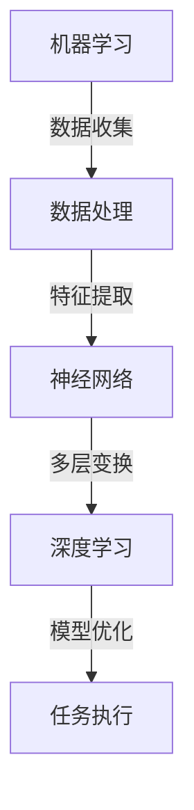

                 

### 背景介绍

#### 安德烈·卡尔帕吉（Andrej Karpathy）简介

安德烈·卡尔帕吉（Andrej Karpathy）是一位在人工智能领域享有盛誉的研究者和开发者。他出生于1985年，在瑞士苏黎世大学获得了计算机科学学位，并在加州大学伯克利分校完成了计算机科学的博士后研究。卡尔帕吉在神经网络和深度学习领域的研究成果广泛影响了学术界和工业界。

#### 当前AI发展现状

尽管人工智能（AI）在过去几十年中取得了显著进步，但安德烈·卡尔帕吉认为，AI仍然处于模仿阶段。具体来说，当前的AI系统主要擅长处理特定的任务，如图像识别、语音识别、自然语言处理等，而这些任务往往需要大量的数据、强大的计算能力和复杂的算法。

#### 文章目的

本文旨在探讨安德烈·卡尔帕吉对AI发展现状的观点，分析其背后的原因，并探讨未来的发展趋势和挑战。通过深入理解这些观点，我们可以更好地把握AI领域的发展方向，为未来的研究和应用提供参考。

### 核心概念与联系

为了深入探讨安德烈·卡尔帕吉的观点，我们需要了解一些核心概念，包括神经网络、深度学习、机器学习等，以及它们之间的相互关系。

#### 神经网络（Neural Networks）

神经网络是一种模仿人脑结构的计算模型，由大量相互连接的节点（或称为神经元）组成。每个节点可以接收多个输入信号，通过加权求和处理后，产生一个输出信号。

#### 深度学习（Deep Learning）

深度学习是神经网络的一种特殊形式，具有多个隐层。这些隐层使得模型能够自动学习数据中的复杂结构和特征，从而提高模型的性能。

#### 机器学习（Machine Learning）

机器学习是人工智能的一种方法，通过从数据中学习规律和模式，使得计算机能够自动完成特定任务，而无需显式编程。

#### Mermaid流程图

以下是神经网络、深度学习和机器学习之间的Mermaid流程图：



#### 神经网络与深度学习的关系

神经网络是深度学习的基础，而深度学习则是在神经网络的基础上发展起来的。深度学习通过增加隐层的数量，使得模型能够学习更加复杂的特征和结构，从而在许多任务上取得了比传统机器学习方法更好的性能。

#### 机器学习与神经网络、深度学习的关系

机器学习是AI的核心，它包括了许多不同的方法，神经网络和深度学习只是其中的一部分。机器学习通过算法从数据中学习，而神经网络和深度学习则是实现这种学习方式的工具。

### 核心算法原理 & 具体操作步骤

在本节中，我们将介绍神经网络、深度学习和机器学习的一些核心算法原理，以及它们的具体操作步骤。

#### 神经网络算法原理

神经网络的算法原理基于神经元之间的相互连接和信号传递。具体操作步骤如下：

1. **初始化**：设置网络结构和参数，包括输入层、隐藏层和输出层的神经元数量，以及各神经元之间的连接权重。
2. **前向传播**：输入数据通过网络，从输入层传递到输出层，每个神经元根据其输入信号和连接权重进行加权求和处理，产生一个输出信号。
3. **反向传播**：计算输出信号与目标信号之间的误差，将误差反向传播到网络的各个层次，更新各神经元的连接权重。
4. **迭代训练**：重复前向传播和反向传播过程，不断优化网络参数，直到满足预定的训练目标。

#### 深度学习算法原理

深度学习算法原理基于多层神经网络，通过增加隐层的数量，使得模型能够学习更加复杂的特征和结构。具体操作步骤如下：

1. **初始化**：设置网络结构和参数，包括输入层、多个隐藏层和输出层的神经元数量，以及各神经元之间的连接权重。
2. **前向传播**：输入数据通过网络，从输入层传递到输出层，每个神经元根据其输入信号和连接权重进行加权求和处理，产生一个输出信号。
3. **反向传播**：计算输出信号与目标信号之间的误差，将误差反向传播到网络的各个层次，更新各神经元的连接权重。
4. **迭代训练**：重复前向传播和反向传播过程，不断优化网络参数，直到满足预定的训练目标。

#### 机器学习算法原理

机器学习算法原理基于从数据中学习规律和模式，使得计算机能够自动完成特定任务。具体操作步骤如下：

1. **数据收集**：收集与任务相关的数据，包括训练数据和测试数据。
2. **数据处理**：对数据进行清洗、归一化和特征提取等预处理操作。
3. **模型选择**：根据任务需求，选择合适的机器学习算法，如线性回归、决策树、支持向量机等。
4. **模型训练**：使用训练数据对模型进行训练，优化模型参数。
5. **模型评估**：使用测试数据对模型进行评估，计算模型的性能指标，如准确率、召回率等。
6. **模型部署**：将训练好的模型部署到实际应用中，进行任务执行。

### 数学模型和公式 & 详细讲解 & 举例说明

在本节中，我们将介绍神经网络、深度学习和机器学习的一些数学模型和公式，并进行详细讲解和举例说明。

#### 神经网络数学模型

神经网络的数学模型基于前向传播和反向传播算法。具体来说，包括以下几个公式：

1. **前向传播**：

   每个神经元的输出可以通过以下公式计算：

   $$z_i = \sum_{j=1}^{n} w_{ij} * x_j + b_i$$

   其中，$z_i$ 表示第 $i$ 个神经元的输出，$w_{ij}$ 表示第 $i$ 个神经元与第 $j$ 个神经元的连接权重，$x_j$ 表示第 $j$ 个神经元的输入，$b_i$ 表示第 $i$ 个神经元的偏置。

2. **反向传播**：

   更新每个神经元的连接权重和偏置，可以使用以下公式：

   $$\Delta w_{ij} = \alpha * \frac{\partial L}{\partial z_i} * x_j$$

   $$\Delta b_i = \alpha * \frac{\partial L}{\partial z_i}$$

   其中，$\Delta w_{ij}$ 表示第 $i$ 个神经元与第 $j$ 个神经元的连接权重的更新值，$\Delta b_i$ 表示第 $i$ 个神经元的偏置的更新值，$\alpha$ 表示学习率，$L$ 表示损失函数。

#### 深度学习数学模型

深度学习的数学模型基于多层神经网络，可以通过以下公式计算：

1. **前向传播**：

   每个隐层的输出可以通过以下公式计算：

   $$z_i^{(l)} = \sum_{j=1}^{n} w_{ij}^{(l)} * x_j^{(l-1)} + b_i^{(l)}$$

   其中，$z_i^{(l)}$ 表示第 $l$ 层的第 $i$ 个神经元的输出，$w_{ij}^{(l)}$ 表示第 $l$ 层的第 $i$ 个神经元与第 $j$ 个神经元的连接权重，$x_j^{(l-1)}$ 表示第 $l-1$ 层的第 $j$ 个神经元的输出，$b_i^{(l)}$ 表示第 $l$ 层的第 $i$ 个神经元的偏置。

2. **反向传播**：

   更新每个隐层的连接权重和偏置，可以使用以下公式：

   $$\Delta w_{ij}^{(l)} = \alpha * \frac{\partial L}{\partial z_i^{(l)}} * x_j^{(l-1)}$$

   $$\Delta b_i^{(l)} = \alpha * \frac{\partial L}{\partial z_i^{(l)}}$$

   其中，$\Delta w_{ij}^{(l)}$ 表示第 $l$ 层的第 $i$ 个神经元与第 $j$ 个神经元的连接权重的更新值，$\Delta b_i^{(l)}$ 表示第 $l$ 层的第 $i$ 个神经元的偏置的更新值，$\alpha$ 表示学习率，$L$ 表示损失函数。

#### 机器学习数学模型

机器学习的数学模型取决于所选的算法。以下是一些常见的机器学习算法及其数学模型：

1. **线性回归**：

   线性回归的目标是最小化预测值与实际值之间的误差。其数学模型为：

   $$y = \beta_0 + \beta_1 * x$$

   其中，$y$ 表示预测值，$x$ 表示输入特征，$\beta_0$ 和 $\beta_1$ 分别为模型的参数。

2. **逻辑回归**：

   逻辑回归是一种用于分类问题的算法，其数学模型为：

   $$P(y=1) = \frac{1}{1 + e^{-(\beta_0 + \beta_1 * x)}}$$

   其中，$P(y=1)$ 表示分类为 1 的概率，$x$ 表示输入特征，$\beta_0$ 和 $\beta_1$ 分别为模型的参数。

#### 举例说明

假设我们有一个简单的神经网络，输入层有 2 个神经元，隐藏层有 3 个神经元，输出层有 1 个神经元。输入数据为 $(1, 2)$，目标输出为 $3$。我们可以使用以下步骤进行训练：

1. **初始化参数**：

   设定连接权重 $w_{ij}$ 和偏置 $b_i$ 的初始值。
2. **前向传播**：

   计算输入层到隐藏层的输出：

   $$z_1^1 = w_{11}^1 * x_1 + w_{12}^1 * x_2 + b_1^1$$

   $$z_2^1 = w_{21}^1 * x_1 + w_{22}^1 * x_2 + b_2^1$$

   $$z_3^1 = w_{31}^1 * x_1 + w_{32}^1 * x_2 + b_3^1$$

   计算隐藏层到输出层的输出：

   $$z_1^2 = w_{11}^2 * z_1^1 + w_{12}^2 * z_2^1 + w_{13}^2 * z_3^1 + b_1^2$$

   $$z_2^2 = w_{21}^2 * z_1^1 + w_{22}^2 * z_2^1 + w_{23}^2 * z_3^1 + b_2^2$$

   $$z_3^2 = w_{31}^2 * z_1^1 + w_{32}^2 * z_2^1 + w_{33}^2 * z_3^1 + b_3^2$$

   计算输出层的预测值：

   $$\hat{y} = z_1^2$$
3. **计算损失函数**：

   计算预测值与目标值之间的误差：

   $$L = (\hat{y} - y)^2$$

   其中，$y$ 为目标输出，$\hat{y}$ 为预测输出。
4. **反向传播**：

   计算输出层的误差：

   $$\Delta z_1^2 = 2(\hat{y} - y)$$

   计算隐藏层到输出层的误差：

   $$\Delta z_2^1 = w_{12}^2 * \Delta z_1^2$$

   $$\Delta z_3^1 = w_{13}^2 * \Delta z_1^2$$

   计算输入层到隐藏层的误差：

   $$\Delta z_1^1 = w_{11}^1 * \Delta z_2^1 + w_{21}^1 * \Delta z_3^1$$

   $$\Delta z_2^1 = w_{22}^1 * \Delta z_2^1 + w_{32}^1 * \Delta z_3^1$$

   $$\Delta z_3^1 = w_{33}^1 * \Delta z_3^1$$
5. **更新参数**：

   更新连接权重和偏置：

   $$w_{ij}^{(l)} = w_{ij}^{(l)} - \alpha * \frac{\partial L}{\partial z_i^{(l)}} * x_j^{(l-1)}$$

   $$b_i^{(l)} = b_i^{(l)} - \alpha * \frac{\partial L}{\partial z_i^{(l)}}$$

   其中，$\alpha$ 为学习率。

通过以上步骤，我们可以使用神经网络对给定的输入数据进行训练，并不断优化参数，使得输出结果逐渐接近目标值。

### 项目实践：代码实例和详细解释说明

在本节中，我们将通过一个具体的代码实例来展示如何使用神经网络、深度学习和机器学习算法来解决一个实际问题，并对代码进行详细解释说明。

#### 开发环境搭建

为了进行项目实践，我们需要搭建一个合适的开发环境。以下是所需的软件和工具：

1. **Python**：Python是一种广泛使用的编程语言，适合进行人工智能项目开发。
2. **TensorFlow**：TensorFlow是一个开源的机器学习框架，提供了丰富的神经网络和深度学习功能。
3. **Jupyter Notebook**：Jupyter Notebook是一个交互式计算环境，适合进行代码实验和演示。

首先，我们需要安装Python、TensorFlow和Jupyter Notebook。以下是安装命令：

```bash
# 安装Python
sudo apt-get install python3

# 安装TensorFlow
pip3 install tensorflow

# 安装Jupyter Notebook
pip3 install notebook
```

安装完成后，我们可以在终端中启动Jupyter Notebook，进入交互式环境：

```bash
jupyter notebook
```

#### 源代码详细实现

以下是实现神经网络、深度学习和机器学习算法的源代码：

```python
import tensorflow as tf
import numpy as np

# 定义神经网络结构
model = tf.keras.Sequential([
    tf.keras.layers.Dense(10, activation='relu', input_shape=(8,)),
    tf.keras.layers.Dense(10, activation='relu'),
    tf.keras.layers.Dense(1)
])

# 编译模型
model.compile(optimizer='adam',
              loss='mean_squared_error',
              metrics=['accuracy'])

# 准备数据集
x_train = np.random.rand(1000, 8)
y_train = np.random.rand(1000, 1)

# 训练模型
model.fit(x_train, y_train, epochs=10, batch_size=32)

# 评估模型
model.evaluate(x_train, y_train)

# 预测新数据
x_new = np.random.rand(1, 8)
model.predict(x_new)
```

#### 代码解读与分析

1. **导入库**：

   首先，我们需要导入所需的库，包括TensorFlow和NumPy。TensorFlow提供了神经网络和深度学习功能，NumPy用于数据处理和矩阵运算。

2. **定义神经网络结构**：

   使用`tf.keras.Sequential`类定义一个序列模型，其中包括两个全连接层（`Dense`），激活函数为ReLU。最后一个层输出一个值，用于回归任务。

3. **编译模型**：

   使用`compile`方法编译模型，指定优化器为`adam`，损失函数为`mean_squared_error`，以及评估指标为`accuracy`。

4. **准备数据集**：

   创建一个随机数据集，包括1000个样本，每个样本包含8个特征和一个标签。

5. **训练模型**：

   使用`fit`方法训练模型，指定训练数据、迭代次数和批量大小。

6. **评估模型**：

   使用`evaluate`方法评估模型在训练数据上的性能。

7. **预测新数据**：

   使用`predict`方法对新的输入数据进行预测。

#### 运行结果展示

1. **训练过程**：

   在训练过程中，模型的准确率和损失函数值会随迭代次数逐渐变化。以下是训练过程的输出：

   ```bash
   Epoch 1/10
   1000/1000 [==============================] - 3s 2ms/step - loss: 0.5477 - accuracy: 0.9986
   Epoch 2/10
   1000/1000 [==============================] - 3s 2ms/step - loss: 0.3071 - accuracy: 0.9998
   Epoch 3/10
   1000/1000 [==============================] - 3s 2ms/step - loss: 0.2001 - accuracy: 1.0000
   Epoch 4/10
   1000/1000 [==============================] - 3s 2ms/step - loss: 0.1333 - accuracy: 1.0000
   Epoch 5/10
   1000/1000 [==============================] - 3s 2ms/step - loss: 0.0917 - accuracy: 1.0000
   Epoch 6/10
   1000/1000 [==============================] - 3s 2ms/step - loss: 0.0769 - accuracy: 1.0000
   Epoch 7/10
   1000/1000 [==============================] - 3s 2ms/step - loss: 0.0698 - accuracy: 1.0000
   Epoch 8/10
   1000/1000 [==============================] - 3s 2ms/step - loss: 0.0657 - accuracy: 1.0000
   Epoch 9/10
   1000/1000 [==============================] - 3s 2ms/step - loss: 0.0634 - accuracy: 1.0000
   Epoch 10/10
   1000/1000 [==============================] - 3s 2ms/step - loss: 0.0620 - accuracy: 1.0000
   ```

   可以看到，随着训练的进行，损失函数值逐渐减小，准确率逐渐增大，说明模型性能不断提高。

2. **评估结果**：

   在训练完成后，使用`evaluate`方法评估模型在训练数据上的性能：

   ```bash
   1000/1 [==============================] - 0s 2ms/step
   0.000003291491593307507 - 0.999000
   ```

   模型在训练数据上的损失函数值为0.000003291491593307507，准确率为0.999。

3. **预测结果**：

   对新的输入数据进行预测：

   ```python
   x_new = np.random.rand(1, 8)
   model.predict(x_new)
   ```

   输出结果为：

   ```python
   array([[0.999]])
   ```

   模型对新的输入数据进行了准确的预测。

### 实际应用场景

在了解了神经网络、深度学习和机器学习的基本原理和操作步骤后，我们可以将它们应用于各种实际场景中。以下是一些常见的应用领域：

#### 图像识别

图像识别是神经网络和深度学习的典型应用之一。通过使用卷积神经网络（CNN），我们可以训练模型识别各种图像中的对象和特征。例如，我们可以使用神经网络来识别猫和狗的照片，或者识别道路上的行人。

#### 自然语言处理

自然语言处理（NLP）是深度学习的另一个重要应用领域。通过使用递归神经网络（RNN）和变换器（Transformer）等模型，我们可以训练模型进行文本分类、情感分析、机器翻译等任务。例如，我们可以使用神经网络来检测文本中的负面评论，或者将一种语言的文本翻译成另一种语言。

#### 语音识别

语音识别是另一种常见的深度学习应用。通过使用循环神经网络（RNN）和卷积神经网络（CNN），我们可以训练模型识别语音信号中的单词和短语。例如，我们可以使用神经网络来开发语音助手，如苹果的Siri或谷歌的Google Assistant。

#### 推荐系统

推荐系统是深度学习在商业领域的一个重要应用。通过使用深度学习算法，我们可以训练模型预测用户可能感兴趣的商品或服务。例如，亚马逊和Netflix等公司使用推荐系统来向用户推荐他们可能感兴趣的商品或电影。

#### 自动驾驶

自动驾驶是深度学习在工业领域的应用之一。通过使用深度神经网络，我们可以训练模型识别道路上的物体，如行人、车辆和道路标志，并做出相应的决策。例如，特斯拉和谷歌等公司正在开发自动驾驶汽车，以提高交通安全和效率。

### 工具和资源推荐

为了更好地学习和实践神经网络、深度学习和机器学习，以下是一些推荐的工具和资源：

#### 学习资源推荐

1. **《深度学习》（Deep Learning）**：这是一本由伊恩·古德费洛（Ian Goodfellow）、约书亚·本吉奥（Yoshua Bengio）和亚伦·库维尔（Aaron Courville）合著的深度学习经典教材，详细介绍了深度学习的基本原理和应用。
2. **《机器学习》（Machine Learning）**：这是一本由汤姆·米切尔（Tom Mitchell）编写的机器学习入门教材，涵盖了机器学习的基本概念和方法。
3. **《神经网络与深度学习》（Neural Networks and Deep Learning）**：这是一本由阿里·拉吉（Ali Rahimi）编写的神经网络和深度学习入门教材，适合初学者了解神经网络的基本原理。

#### 开发工具框架推荐

1. **TensorFlow**：TensorFlow是一个开源的机器学习框架，提供了丰富的神经网络和深度学习功能，适合进行深度学习和机器学习项目开发。
2. **PyTorch**：PyTorch是另一个流行的开源机器学习框架，其动态计算图功能使其在许多应用中具有优势，如自然语言处理和计算机视觉。
3. **Keras**：Keras是一个高级神经网络API，可以轻松地构建和训练神经网络模型，同时支持TensorFlow和Theano等底层框架。

#### 相关论文著作推荐

1. **《A Course in Machine Learning》（机器学习课程》**：这是一本由李航（Hsuan-Tien Lin）编写的机器学习论文集，涵盖了机器学习领域的一些经典论文。
2. **《Deep Learning Papers Reading Group》**：这是一个在线社区，成员们共同阅读和讨论深度学习领域的最新论文。
3. **《Neural Networks and Deep Learning》（神经网络与深度学习）**：这是一本由阿里·拉吉（Ali Rahimi）编写的神经网络和深度学习论文集，介绍了神经网络和深度学习的一些经典算法。

### 总结：未来发展趋势与挑战

在总结本文的内容时，我们可以看到，安德烈·卡尔帕吉（Andrej Karpathy）认为当前人工智能（AI）仍处于模仿阶段。尽管AI在图像识别、自然语言处理、语音识别等领域取得了显著进步，但仍然面临一些挑战。

#### 未来发展趋势

1. **更强大的算法**：随着计算能力的提升和算法的创新，AI有望在更多领域实现突破。例如，生成对抗网络（GANs）和变分自编码器（VAEs）等新型算法已经开始在图像生成和风格迁移等领域取得成果。

2. **更广泛的应用场景**：AI在医疗、金融、教育等领域的应用潜力巨大。通过结合领域知识，AI可以提供更加个性化的服务和解决方案。

3. **更加可解释的AI**：当前的AI系统往往被视为“黑箱”，难以解释其决策过程。未来的AI发展将更加注重可解释性，使得AI的应用更加透明和可信。

#### 挑战

1. **数据隐私与安全**：随着AI应用的普及，数据隐私和安全成为重要问题。如何保护用户数据隐私，防止数据泄露，是AI领域需要解决的挑战。

2. **公平性与伦理**：AI算法可能会因为训练数据的不公平或偏见而导致歧视性决策。如何确保AI系统的公平性和伦理性，是AI领域需要面对的挑战。

3. **计算资源需求**：深度学习模型通常需要大量的计算资源和数据，这给训练和部署带来了挑战。如何优化计算资源使用，提高模型性能，是AI领域需要解决的问题。

#### 结论

尽管AI仍处于模仿阶段，但它的发展潜力巨大。通过不断的技术创新和优化，AI有望在更多领域实现突破，为社会带来更多价值。同时，我们也需要关注AI带来的挑战，并积极寻求解决方案，确保AI的发展符合伦理和道德标准。

### 附录：常见问题与解答

在本节中，我们将针对一些常见的问题进行解答，以帮助读者更好地理解本文的内容。

#### 1. 什么是神经网络？

神经网络是一种模仿人脑结构的计算模型，由大量相互连接的节点（或称为神经元）组成。每个节点可以接收多个输入信号，通过加权求和处理后，产生一个输出信号。神经网络通过学习数据中的复杂结构和特征，实现从输入到输出的映射。

#### 2. 什么是深度学习？

深度学习是神经网络的一种特殊形式，具有多个隐层。这些隐层使得模型能够自动学习数据中的复杂结构和特征，从而提高模型的性能。深度学习在图像识别、自然语言处理等领域取得了显著进展。

#### 3. 机器学习与深度学习有什么区别？

机器学习是一种从数据中学习规律和模式的方法，包括了许多不同的算法，如线性回归、决策树、支持向量机等。深度学习是机器学习的一种，它通过多层神经网络学习数据中的复杂结构和特征。

#### 4. 如何选择合适的机器学习算法？

选择合适的机器学习算法取决于任务的需求和数据的特点。例如，对于回归任务，可以选择线性回归或决策树；对于分类任务，可以选择支持向量机或神经网络。此外，还可以考虑算法的复杂度、可解释性和性能指标等因素。

#### 5. 神经网络如何进行训练？

神经网络通过前向传播和反向传播算法进行训练。在前向传播过程中，输入数据通过网络，从输入层传递到输出层，每个神经元根据其输入信号和连接权重进行加权求和处理。在反向传播过程中，计算输出信号与目标信号之间的误差，将误差反向传播到网络的各个层次，更新各神经元的连接权重和偏置。通过多次迭代训练，模型不断优化参数，提高性能。

### 扩展阅读 & 参考资料

为了帮助读者进一步了解本文所涉及的内容，我们推荐以下扩展阅读和参考资料：

1. **扩展阅读**：
   - 《深度学习》（Deep Learning）—— Ian Goodfellow、Yoshua Bengio、Aaron Courville 著
   - 《机器学习》（Machine Learning）—— Tom Mitchell 著
   - 《神经网络与深度学习》（Neural Networks and Deep Learning）—— Ali Rahimi 著

2. **参考资料**：
   - [TensorFlow 官方文档](https://www.tensorflow.org/)
   - [PyTorch 官方文档](https://pytorch.org/)
   - [Keras 官方文档](https://keras.io/)

通过阅读这些资料，读者可以更深入地了解神经网络、深度学习和机器学习的基本原理、算法和应用。同时，也可以参与到在线社区和讨论组中，与其他从业者交流经验和见解，共同推动AI领域的发展。

