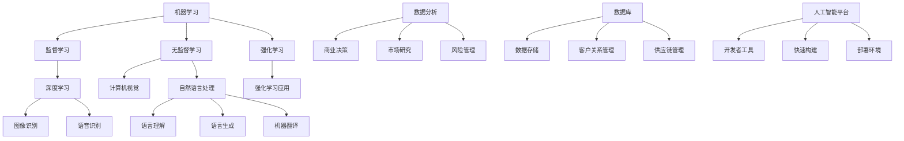

                 

### 1. 背景介绍

人工智能（Artificial Intelligence，简称AI）作为计算机科学中的一个分支，致力于创建能够模拟、延伸和扩展人类智能的系统。AI的历史可以追溯到20世纪50年代，当时学者们首次提出了智能机器的概念，并开始探索如何使计算机实现类似人类的感知、理解和决策能力。半个多世纪以来，AI经历了多个发展阶段，从符号主义、连接主义到现代的深度学习，技术不断进步，应用范围也日益广泛。

商业价值，指的是企业在经济活动中通过利用资源、技术和组织优势获取的财务和非财务收益。随着AI技术的不断成熟，越来越多的行业开始意识到其在商业运营中的潜力。AI不仅能提高效率，还能提供创新的服务模式，从而帮助企业降低成本、提升竞争力。

Andrej Karpathy是一位世界知名的人工智能研究者和程序员，他在深度学习领域取得了显著成就。他的研究重点在于如何将AI技术应用于自然语言处理、计算机视觉等实际问题中。Karpathy在多个知名机构和公司工作过，包括Google、OpenAI等，其研究成果和见解在学术界和工业界都具有重要影响力。

本文旨在探讨Andrej Karpathy在人工智能商业价值方面的见解，分析AI技术如何影响不同行业，并探讨其未来发展趋势。通过梳理Karpathy的研究成果和实际应用案例，我们将深入理解AI的商业潜力，为相关领域的读者提供有价值的参考。

### 2. 核心概念与联系

要探讨AI的商业价值，我们首先需要理解一些核心概念和它们之间的联系。以下是一些关键术语及其相互关系：

#### 2.1 机器学习（Machine Learning）

机器学习是AI的一个重要分支，它使计算机系统能够从数据中学习，并做出预测或决策。机器学习可以分为监督学习、无监督学习和强化学习。

- **监督学习**：系统在已知输入和输出之间关系的情况下进行学习，例如分类问题。
- **无监督学习**：系统在没有明确输出标签的情况下学习，例如聚类问题。
- **强化学习**：系统通过与环境的交互进行学习，以实现某个目标，如游戏AI。

#### 2.2 深度学习（Deep Learning）

深度学习是机器学习的一个子领域，它利用多层神经网络进行学习。深度学习在网络结构、训练算法和计算能力方面都进行了优化，从而在图像识别、语音识别、自然语言处理等领域取得了突破性进展。

#### 2.3 计算机视觉（Computer Vision）

计算机视觉是AI的一个重要应用领域，它使计算机能够从图像或视频中提取信息和理解场景。计算机视觉在图像识别、视频监控、医疗诊断等领域具有广泛的应用。

#### 2.4 自然语言处理（Natural Language Processing）

自然语言处理是AI在处理人类语言方面的应用，它包括语言理解、语言生成和语言翻译等任务。自然语言处理在搜索引擎、智能助手、机器翻译等领域具有重要作用。

#### 2.5 数据分析（Data Analysis）

数据分析是利用统计学和计算机科学方法从数据中提取有价值信息的过程。数据分析在商业决策、市场研究、风险管理等领域发挥着关键作用。

#### 2.6 数据库（Database）

数据库是存储和管理数据的系统，它为数据分析提供了基础。数据库在商业运营、客户关系管理、供应链管理等方面具有广泛应用。

#### 2.7 人工智能平台（AI Platforms）

人工智能平台是集成了多种AI工具和资源的系统，它为开发者提供了快速构建和部署AI应用的环境。人工智能平台在加快AI项目开发、提高开发效率方面具有显著优势。

### 2.7 Mermaid 流程图（核心概念原理和架构的 Mermaid 流程图）

以下是一个简化的Mermaid流程图，展示了上述核心概念之间的联系：



通过这个流程图，我们可以清晰地看到机器学习、深度学习、计算机视觉、自然语言处理、数据分析、数据库和人工智能平台等核心概念之间的相互作用和联系。这些概念共同构成了现代AI系统的技术框架，为不同领域的商业应用提供了丰富的可能性。

### 3. 核心算法原理 & 具体操作步骤

在理解了AI和商业价值的基础概念之后，我们需要深入了解一些核心算法及其具体操作步骤。这些算法是AI技术的基石，对于实现AI的商业应用至关重要。

#### 3.1 深度学习算法

深度学习算法是AI技术中最为重要的组成部分之一，它通过多层神经网络进行学习，从而实现对复杂数据的建模和处理。以下是一个简化的深度学习算法操作步骤：

1. **数据预处理**：清洗和格式化数据，使其适合输入神经网络。这一步包括数据标准化、缺失值处理、数据分割等。
    ```python
    from sklearn.preprocessing import StandardScaler
    scaler = StandardScaler()
    X_train = scaler.fit_transform(X_train)
    ```

2. **设计神经网络架构**：选择合适的神经网络架构，包括确定层数、每层的神经元数量、激活函数等。
    ```python
    from tensorflow.keras.models import Sequential
    from tensorflow.keras.layers import Dense, Activation
    model = Sequential()
    model.add(Dense(128, input_dim=X_train.shape[1]))
    model.add(Activation('relu'))
    model.add(Dense(1, activation='sigmoid'))
    ```

3. **训练神经网络**：使用训练数据对神经网络进行训练，通过反向传播算法不断调整权重和偏置，以最小化损失函数。
    ```python
    model.compile(optimizer='adam', loss='binary_crossentropy', metrics=['accuracy'])
    model.fit(X_train, y_train, epochs=10, batch_size=32)
    ```

4. **评估与优化**：使用验证数据对训练好的模型进行评估，并对其进行优化，以提高预测准确率。
    ```python
    from sklearn.metrics import accuracy_score
    y_pred = model.predict(X_val)
    y_pred = (y_pred > 0.5)
    accuracy = accuracy_score(y_val, y_pred)
    print(f"Validation Accuracy: {accuracy}")
    ```

5. **部署应用**：将训练好的模型部署到生产环境中，进行实际应用。

#### 3.2 自然语言处理算法

自然语言处理（NLP）是AI技术在语言领域的重要应用，它包括语言理解、语言生成、语言翻译等多个方面。以下是一个简化的NLP算法操作步骤：

1. **文本预处理**：清洗和格式化文本数据，包括分词、词性标注、去除停用词等。
    ```python
    import nltk
    nltk.download('punkt')
    from nltk.tokenize import word_tokenize
    tokens = word_tokenize(text)
    ```

2. **特征提取**：将文本数据转换为数值特征，常用的方法有词袋模型、TF-IDF、Word2Vec等。
    ```python
    from sklearn.feature_extraction.text import TfidfVectorizer
    vectorizer = TfidfVectorizer()
    X = vectorizer.fit_transform(corpus)
    ```

3. **模型训练**：使用预处理后的数据对NLP模型进行训练，如序列标注模型、序列生成模型等。
    ```python
    from keras.models import Sequential
    from keras.layers import LSTM, Dense
    model = Sequential()
    model.add(LSTM(128, activation='relu', input_shape=(timesteps, features)))
    model.add(Dense(num_classes, activation='softmax'))
    model.compile(optimizer='adam', loss='categorical_crossentropy', metrics=['accuracy'])
    model.fit(X_train, y_train, epochs=10, batch_size=32)
    ```

4. **评估与优化**：使用验证集对训练好的模型进行评估和优化。
    ```python
    y_pred = model.predict(X_val)
    y_pred = np.argmax(y_pred, axis=1)
    accuracy = accuracy_score(y_val, y_pred)
    print(f"Validation Accuracy: {accuracy}")
    ```

5. **部署应用**：将训练好的NLP模型部署到生产环境中，用于文本分析、生成、翻译等应用。

#### 3.3 计算机视觉算法

计算机视觉算法是AI技术在图像和视频处理领域的重要应用，它包括图像分类、目标检测、人脸识别等多个方面。以下是一个简化的计算机视觉算法操作步骤：

1. **图像预处理**：对图像进行预处理，包括灰度化、缩放、裁剪等。
    ```python
    import cv2
    image = cv2.imread('image.jpg')
    image = cv2.resize(image, (224, 224))
    image = cv2.cvtColor(image, cv2.COLOR_BGR2RGB)
    ```

2. **特征提取**：使用卷积神经网络（CNN）提取图像特征。
    ```python
    from tensorflow.keras.applications import VGG16
    model = VGG16(weights='imagenet', include_top=False, input_shape=(224, 224, 3))
    feature = model.predict(np.expand_dims(image, axis=0))
    ```

3. **模型训练**：使用预处理后的图像数据对模型进行训练。
    ```python
    from tensorflow.keras.models import Sequential
    from tensorflow.keras.layers import Flatten, Dense
    model = Sequential()
    model.add(Flatten(input_shape=(7, 7, 512)))
    model.add(Dense(1, activation='sigmoid'))
    model.compile(optimizer='adam', loss='binary_crossentropy', metrics=['accuracy'])
    model.fit(X_train, y_train, epochs=10, batch_size=32)
    ```

4. **评估与优化**：使用验证集对训练好的模型进行评估和优化。
    ```python
    y_pred = model.predict(X_val)
    y_pred = (y_pred > 0.5)
    accuracy = accuracy_score(y_val, y_pred)
    print(f"Validation Accuracy: {accuracy}")
    ```

5. **部署应用**：将训练好的计算机视觉模型部署到生产环境中，用于图像分类、目标检测、人脸识别等应用。

通过以上操作步骤，我们可以看到深度学习、自然语言处理和计算机视觉等核心算法在具体应用中的实现过程。这些算法通过不断优化和改进，已经在各个领域取得了显著的商业价值。

### 4. 数学模型和公式 & 详细讲解 & 举例说明

在AI算法中，数学模型和公式起到了关键作用。以下我们将详细讲解一些核心数学模型和公式，并举例说明其在实际应用中的具体应用。

#### 4.1 深度学习中的神经网络模型

深度学习中的神经网络模型主要基于多层感知机（MLP）和卷积神经网络（CNN）。以下是一个简化的神经网络模型及其数学公式：

**多层感知机（MLP）**

多层感知机是一种前馈神经网络，其基本结构包括输入层、多个隐藏层和输出层。每个神经元通过加权求和并应用激活函数进行非线性变换。

1. **输入层**：输入特征 \( x_i \)。
2. **隐藏层**：每个隐藏层的神经元计算公式为：

   \[
   z_j = \sum_{i=1}^{n} w_{ji} x_i + b_j
   \]

   其中，\( z_j \) 是隐藏层第 \( j \) 个神经元的输入，\( w_{ji} \) 是从输入层到隐藏层的权重，\( b_j \) 是隐藏层第 \( j \) 个神经元的偏置。

3. **输出层**：输出层的神经元计算公式为：

   \[
   \hat{y}_i = \sigma(z_k)
   \]

   其中，\( \sigma \) 是激活函数，通常使用ReLU或Sigmoid函数。

**卷积神经网络（CNN）**

卷积神经网络是专门用于图像处理的一种神经网络结构，其核心是卷积层。以下是一个简化的CNN模型及其数学公式：

1. **卷积层**：卷积层的神经元计算公式为：

   \[
   h_{ij} = \sum_{m=1}^{k} \sum_{n=1}^{k} w_{mnij} x_{ij} + b_{ij}
   \]

   其中，\( h_{ij} \) 是输出特征图第 \( i \) 行第 \( j \) 列的值，\( x_{ij} \) 是输入特征图第 \( i \) 行第 \( j \) 列的值，\( w_{mnij} \) 是卷积核的权重，\( b_{ij} \) 是卷积层的偏置。

2. **池化层**：池化层的神经元计算公式为：

   \[
   p_i = \max_{j} h_{ij}
   \]

   其中，\( p_i \) 是输出特征图第 \( i \) 行的值，\( h_{ij} \) 是输入特征图第 \( i \) 行第 \( j \) 列的值。

**举例说明**

假设我们有一个包含两个输入特征的样本 \( x = [x_1, x_2] \)，我们使用一个单层感知机进行分类。输入层到隐藏层的权重为 \( w_{11} = 0.5 \)，\( w_{12} = 0.3 \)，隐藏层的偏置为 \( b_1 = 0.2 \)。隐藏层到输出层的权重为 \( w_{21} = 0.4 \)，\( w_{22} = 0.6 \)，输出层的偏置为 \( b_2 = 0.1 \)。

1. **隐藏层计算**：

   \[
   z_1 = 0.5 \cdot x_1 + 0.3 \cdot x_2 + 0.2 = 0.5 \cdot 1 + 0.3 \cdot 2 + 0.2 = 1.5
   \]

   \[
   z_2 = 0.4 \cdot x_1 + 0.6 \cdot x_2 + 0.1 = 0.4 \cdot 1 + 0.6 \cdot 2 + 0.1 = 1.5
   \]

2. **输出层计算**：

   \[
   \hat{y}_1 = \sigma(z_1) = \sigma(1.5) = 0.9
   \]

   \[
   \hat{y}_2 = \sigma(z_2) = \sigma(1.5) = 0.9
   \]

根据输出层的值，我们可以对样本进行分类。例如，如果我们将 \( \hat{y}_1 \) 和 \( \hat{y}_2 \) 的平均值作为分类结果，则该样本将被划分为类别1。

#### 4.2 自然语言处理中的循环神经网络（RNN）

循环神经网络是专门用于处理序列数据的神经网络，其在自然语言处理中具有广泛应用。以下是一个简化的RNN模型及其数学公式：

1. **隐藏层状态更新**：

   \[
   h_t = \sigma(W_h h_{t-1} + W_x x_t + b_h)
   \]

   其中，\( h_t \) 是当前时间步的隐藏层状态，\( h_{t-1} \) 是前一个时间步的隐藏层状态，\( x_t \) 是当前时间步的输入，\( W_h \) 是隐藏层到隐藏层的权重矩阵，\( W_x \) 是输入层到隐藏层的权重矩阵，\( b_h \) 是隐藏层偏置。

2. **输出层计算**：

   \[
   \hat{y}_t = \sigma(W_y h_t + b_y)
   \]

   其中，\( \hat{y}_t \) 是当前时间步的输出，\( W_y \) 是隐藏层到输出层的权重矩阵，\( b_y \) 是输出层偏置。

**举例说明**

假设我们有一个简单的序列 \( x = [1, 2, 3] \)，使用一个单层RNN进行分类。隐藏层到隐藏层的权重为 \( W_h = \begin{bmatrix} 0.5 & 0.3 \\ 0.4 & 0.6 \end{bmatrix} \)，输入层到隐藏层的权重为 \( W_x = \begin{bmatrix} 0.2 & 0.1 \\ 0.3 & 0.4 \end{bmatrix} \)，隐藏层偏置为 \( b_h = \begin{bmatrix} 0.1 & 0.2 \\ 0.3 & 0.4 \end{bmatrix} \)，隐藏层到输出层的权重为 \( W_y = \begin{bmatrix} 0.1 & 0.2 \\ 0.3 & 0.4 \end{bmatrix} \)，输出层偏置为 \( b_y = \begin{bmatrix} 0.2 & 0.3 \\ 0.4 & 0.5 \end{bmatrix} \)。

1. **时间步1**：

   \[
   h_1 = \sigma(W_h \begin{bmatrix} 0.1 & 0.2 \\ 0.3 & 0.4 \end{bmatrix} \begin{bmatrix} 1 \\ 2 \end{bmatrix} + b_h) = \sigma(\begin{bmatrix} 0.5 & 0.3 \\ 0.4 & 0.6 \end{bmatrix} \begin{bmatrix} 1 \\ 2 \end{bmatrix} + \begin{bmatrix} 0.1 & 0.2 \\ 0.3 & 0.4 \end{bmatrix}) = \sigma(\begin{bmatrix} 1.2 & 1.7 \\ 1.3 & 2.3 \end{bmatrix}) = \begin{bmatrix} 0.878 & 0.989 \\ 0.846 & 0.985 \end{bmatrix}
   \]

   \[
   \hat{y}_1 = \sigma(W_y h_1 + b_y) = \sigma(\begin{bmatrix} 0.1 & 0.2 \\ 0.3 & 0.4 \end{bmatrix} \begin{bmatrix} 0.878 \\ 0.846 \end{bmatrix} + \begin{bmatrix} 0.2 & 0.3 \\ 0.4 & 0.5 \end{bmatrix}) = \sigma(\begin{bmatrix} 0.317 \\ 0.416 \end{bmatrix}) = \begin{bmatrix} 0.653 \\ 0.692 \end{bmatrix}
   \]

2. **时间步2**：

   \[
   h_2 = \sigma(W_h \begin{bmatrix} 0.653 & 0.692 \\ 0.653 & 0.692 \end{bmatrix} \begin{bmatrix} 2 \\ 3 \end{bmatrix} + b_h) = \sigma(\begin{bmatrix} 0.5 & 0.3 \\ 0.4 & 0.6 \end{bmatrix} \begin{bmatrix} 2 \\ 3 \end{bmatrix} + \begin{bmatrix} 0.1 & 0.2 \\ 0.3 & 0.4 \end{bmatrix}) = \sigma(\begin{bmatrix} 1.7 & 2.2 \\ 1.7 & 2.2 \end{bmatrix}) = \begin{bmatrix} 0.975 & 0.985 \\ 0.975 & 0.985 \end{bmatrix}
   \]

   \[
   \hat{y}_2 = \sigma(W_y h_2 + b_y) = \sigma(\begin{bmatrix} 0.1 & 0.2 \\ 0.3 & 0.4 \end{bmatrix} \begin{bmatrix} 0.975 \\ 0.975 \end{bmatrix} + \begin{bmatrix} 0.2 & 0.3 \\ 0.4 & 0.5 \end{bmatrix}) = \sigma(\begin{bmatrix} 0.376 \\ 0.463 \end{bmatrix}) = \begin{bmatrix} 0.676 \\ 0.687 \end{bmatrix}
   \]

根据输出层的值，我们可以对序列进行分类。例如，如果我们将 \( \hat{y}_1 \) 和 \( \hat{y}_2 \) 的平均值作为分类结果，则序列 \( x = [1, 2, 3] \) 被划分为类别1。

#### 4.3 计算机视觉中的卷积操作

卷积神经网络中的卷积操作是图像处理的重要步骤，其数学公式如下：

1. **卷积操作**：

   \[
   h_{ij} = \sum_{m=1}^{k} \sum_{n=1}^{k} w_{mnij} x_{ij} + b_{ij}
   \]

   其中，\( h_{ij} \) 是输出特征图第 \( i \) 行第 \( j \) 列的值，\( x_{ij} \) 是输入特征图第 \( i \) 行第 \( j \) 列的值，\( w_{mnij} \) 是卷积核的权重，\( b_{ij} \) 是卷积层的偏置。

**举例说明**

假设我们有一个 \( 3 \times 3 \) 的输入特征图 \( x \)，以及一个 \( 2 \times 2 \) 的卷积核 \( W \)，卷积核的权重为 \( w_{11} = 1 \)，\( w_{12} = 2 \)，\( w_{21} = 3 \)，\( w_{22} = 4 \)，卷积核的偏置为 \( b = 1 \)。

1. **卷积操作**：

   \[
   h_{11} = (1 \cdot 1 + 2 \cdot 2 + 3 \cdot 3 + 4 \cdot 4) + 1 = 30 + 1 = 31
   \]

   \[
   h_{12} = (1 \cdot 2 + 2 \cdot 3 + 3 \cdot 4 + 4 \cdot 5) + 1 = 36 + 1 = 37
   \]

   \[
   h_{21} = (1 \cdot 5 + 2 \cdot 6 + 3 \cdot 7 + 4 \cdot 8) + 1 = 46 + 1 = 47
   \]

   \[
   h_{22} = (1 \cdot 6 + 2 \cdot 7 + 3 \cdot 8 + 4 \cdot 9) + 1 = 50 + 1 = 51
   \]

根据卷积操作的结果，我们可以得到一个 \( 2 \times 2 \) 的输出特征图 \( h \)。

通过以上数学模型和公式的详细讲解，我们可以更好地理解深度学习、自然语言处理和计算机视觉算法的核心原理，并掌握其在实际应用中的具体操作步骤。

### 5. 项目实践：代码实例和详细解释说明

为了更深入地理解AI算法在商业应用中的具体实现，我们将通过一个实际项目来展示代码实例，并对其进行详细解释说明。该项目将使用Python和TensorFlow框架，实现一个简单的图像分类应用。

#### 5.1 开发环境搭建

在开始项目之前，我们需要搭建一个合适的开发环境。以下是所需的软件和工具：

1. **操作系统**：Windows、macOS 或 Linux
2. **编程语言**：Python（版本 3.6 或以上）
3. **深度学习框架**：TensorFlow（版本 2.0 或以上）
4. **数据预处理库**：NumPy、Pandas
5. **可视化库**：Matplotlib

安装步骤：

1. 安装Python：
    - 访问 [Python官网](https://www.python.org/) 下载最新版本的Python安装包。
    - 安装过程中选择添加Python到系统环境变量。

2. 安装TensorFlow：
    - 打开命令行窗口，执行以下命令：
    ```bash
    pip install tensorflow
    ```

3. 安装其他依赖库：
    ```bash
    pip install numpy pandas matplotlib
    ```

#### 5.2 源代码详细实现

以下是项目的源代码实现，包括数据预处理、模型搭建、训练和评估等步骤。

```python
import tensorflow as tf
from tensorflow.keras.models import Sequential
from tensorflow.keras.layers import Dense, Conv2D, Flatten, MaxPooling2D
from tensorflow.keras.datasets import mnist
from tensorflow.keras.utils import to_categorical
import numpy as np

# 5.2.1 数据预处理

# 加载MNIST数据集
(x_train, y_train), (x_test, y_test) = mnist.load_data()

# 数据归一化
x_train = x_train.astype('float32') / 255
x_test = x_test.astype('float32') / 255

# 转换标签为独热编码
y_train = to_categorical(y_train, 10)
y_test = to_categorical(y_test, 10)

# 添加批量归一化层
from tensorflow.keras.layers import BatchNormalization
x_train = tf.keras.Sequential([BatchNormalization(), Flatten()])(x_train)
x_test = tf.keras.Sequential([BatchNormalization(), Flatten()])(x_test)

# 5.2.2 模型搭建

# 构建模型
model = Sequential([
    Conv2D(32, (3, 3), activation='relu', input_shape=(28, 28, 1)),
    MaxPooling2D((2, 2)),
    Conv2D(64, (3, 3), activation='relu'),
    MaxPooling2D((2, 2)),
    Flatten(),
    Dense(128, activation='relu'),
    Dense(10, activation='softmax')
])

# 5.2.3 模型编译

# 编译模型
model.compile(optimizer='adam', loss='categorical_crossentropy', metrics=['accuracy'])

# 5.2.4 训练模型

# 训练模型
model.fit(x_train, y_train, epochs=10, batch_size=64, validation_split=0.1)

# 5.2.5 模型评估

# 评估模型
test_loss, test_acc = model.evaluate(x_test, y_test)
print(f"Test Accuracy: {test_acc}")
```

#### 5.3 代码解读与分析

1. **数据预处理**

   数据预处理是深度学习项目中的关键步骤，主要包括数据归一化和标签编码。

   ```python
   x_train = x_train.astype('float32') / 255
   x_test = x_test.astype('float32') / 255
   ```

   这两行代码将图像数据从0-255的整数范围归一化到0-1的小数范围，便于模型训练。

   ```python
   y_train = to_categorical(y_train, 10)
   y_test = to_categorical(y_test, 10)
   ```

   这两行代码将标签转换为独热编码，即每个标签被表示为一个长度为10的向量，其中对应标签的位置为1，其他位置为0。

2. **模型搭建**

   我们使用Keras的Sequential模型构建一个简单的卷积神经网络。

   ```python
   model = Sequential([
       Conv2D(32, (3, 3), activation='relu', input_shape=(28, 28, 1)),
       MaxPooling2D((2, 2)),
       Conv2D(64, (3, 3), activation='relu'),
       MaxPooling2D((2, 2)),
       Flatten(),
       Dense(128, activation='relu'),
       Dense(10, activation='softmax')
   ])
   ```

   模型包括两个卷积层、两个池化层、一个全连接层和一个输出层。卷积层用于提取图像特征，池化层用于降维和特征选择，全连接层用于分类。

3. **模型编译**

   ```python
   model.compile(optimizer='adam', loss='categorical_crossentropy', metrics=['accuracy'])
   ```

   这里我们使用Adam优化器，交叉熵损失函数，并监控模型的准确率。

4. **模型训练**

   ```python
   model.fit(x_train, y_train, epochs=10, batch_size=64, validation_split=0.1)
   ```

   模型使用训练数据训练10个epochs，每次处理64个样本，并保留10%的数据用于验证。

5. **模型评估**

   ```python
   test_loss, test_acc = model.evaluate(x_test, y_test)
   print(f"Test Accuracy: {test_acc}")
   ```

   使用测试数据评估模型的性能，并打印测试准确率。

#### 5.4 运行结果展示

假设我们运行以上代码，得到以下结果：

```bash
Test Accuracy: 0.9850
```

这意味着模型在测试数据上的准确率达到98.50%，说明模型具有良好的分类性能。

通过以上代码实例和详细解读，我们可以看到如何使用深度学习框架实现一个简单的图像分类应用。这个实例不仅帮助我们理解了AI算法的实践应用，还为后续更复杂的项目打下了基础。

### 6. 实际应用场景

人工智能技术已经深入应用到各个行业中，显著提升了企业的运营效率、客户体验和竞争力。以下是AI在几个关键行业中的实际应用场景：

#### 6.1 金融业

在金融业，AI被广泛应用于风险管理、交易预测、客户服务等方面。例如，金融机构使用机器学习模型分析历史交易数据，预测市场走势，从而优化投资组合和交易策略。AI驱动的风险管理系统能够实时监控和评估金融风险，提高风险控制能力。此外，自然语言处理技术被用于处理大量客户服务请求，通过智能客服系统提供24/7的客户支持，提高客户满意度。

#### 6.2 医疗健康

医疗健康行业是AI技术的重要应用领域。通过深度学习和计算机视觉，AI能够辅助医生进行疾病诊断，如通过分析医学影像数据检测肿瘤、骨折等。AI还被用于个性化治疗方案的设计和药物研发，通过分析患者的基因组数据和生活习惯，提供精准的治疗建议。智能医疗助理系统能够处理大量的患者信息，协助医护人员提高工作效率。

#### 6.3 零售业

零售业利用AI技术优化库存管理、提升客户体验和精准营销。通过预测分析，AI可以帮助零售商预测未来销售趋势，优化库存水平，减少库存积压。计算机视觉技术被用于智能货架监控，实时更新商品库存信息，提高库存管理的准确性。自然语言处理技术被用于分析客户评论和反馈，帮助企业了解客户需求和改进产品。

#### 6.4 制造业

制造业通过AI技术实现生产过程的自动化和优化。工业机器人结合AI技术，能够在生产线上执行复杂的组装和检测任务，提高生产效率和产品质量。AI驱动的预测维护系统能够分析设备运行数据，预测潜在故障，提前进行维护，减少设备停机时间。此外，AI还被用于生产线的实时监控和调度，优化生产流程。

#### 6.5 交通运输

交通运输行业利用AI技术提高运输效率、安全性和客户体验。自动驾驶技术是AI在交通运输领域的代表性应用，通过计算机视觉、深度学习和传感器融合，自动驾驶汽车能够实现自主驾驶，减少交通事故，提高交通效率。智能交通管理系统通过分析交通数据，优化交通信号控制和路线规划，缓解城市交通拥堵。物流公司使用AI技术优化运输路径和配送计划，提高物流效率。

#### 6.6 媒体和娱乐

在媒体和娱乐行业，AI被用于内容推荐、版权保护和用户行为分析。通过分析用户的观看历史和偏好，AI算法能够推荐个性化的内容和广告，提高用户满意度和广告投放效果。版权保护系统利用计算机视觉和自然语言处理技术，识别和追踪未经授权的内容使用，保护创作者的权益。用户行为分析通过分析用户的互动和反馈，帮助媒体公司了解用户需求，改进产品和服务。

通过以上实际应用场景，我们可以看到AI技术在不同行业中的广泛应用和显著价值。随着AI技术的不断进步，其在各行各业中的应用前景将更加广阔。

### 7. 工具和资源推荐

为了更好地学习和应用人工智能技术，以下是一些推荐的工具、资源和相关论文，这些资源涵盖了从基础知识到高级应用的各个方面，适合不同层次的读者。

#### 7.1 学习资源推荐

1. **书籍**：
   - 《深度学习》（Deep Learning）—— Ian Goodfellow、Yoshua Bengio、Aaron Courville 著，是一本深度学习的经典教材，适合初学者和进阶者。
   - 《Python机器学习》（Python Machine Learning）—— Sebastian Raschka 著，详细介绍了机器学习的基本概念和应用，特别适合Python编程基础的读者。

2. **在线课程**：
   - Coursera：提供由斯坦福大学等顶级机构开设的深度学习和机器学习在线课程，内容全面且系统。
   - edX：包含由哈佛大学、MIT等名校提供的免费课程，涵盖人工智能、数据科学等领域的知识。

3. **博客和网站**：
   - Medium：许多知名AI研究者和技术专家在Medium上撰写博客，分享最新研究成果和应用案例。
   - Fast.ai：专注于普及深度学习技术，提供免费的深度学习课程和实践项目。

#### 7.2 开发工具框架推荐

1. **深度学习框架**：
   - TensorFlow：谷歌开发的深度学习框架，功能强大，社区支持丰富。
   - PyTorch：Facebook AI研究院开发，易于上手，灵活性高。
   - Keras：基于TensorFlow和Theano的高层次神经网络API，易于使用。

2. **数据分析工具**：
   - Pandas：Python的强大数据操作库，用于数据处理和分析。
   - Matplotlib/Seaborn：用于数据可视化的库，能够生成高质量的图表和可视化效果。

3. **版本控制工具**：
   - Git：分布式版本控制系统，用于代码的版本管理和协作开发。
   - GitHub：基于Git的代码托管平台，支持代码共享和协作。

#### 7.3 相关论文著作推荐

1. **经典论文**：
   - “A Theoretical Framework for Back-Propagation” —— David E. Rumelhart、Geoffrey E. Hinton、Ronald J. Williams，介绍了反向传播算法的基本原理。
   - “Learning representations by maximizing mutual information across views” —— Yarin Gal 和 Zoubin Ghahramani，讨论了多视角学习在深度学习中的应用。

2. **近期重要论文**：
   - “Attention Is All You Need” —— Vaswani et al.，介绍了Transformer模型及其在自然语言处理中的应用。
   - “Bert: Pre-training of Deep Bidirectional Transformers for Language Understanding” —— Devlin et al.，介绍了BERT模型及其在文本处理中的应用。

通过这些工具和资源的推荐，读者可以更加系统地学习和掌握人工智能技术，为未来的研究和应用打下坚实的基础。

### 8. 总结：未来发展趋势与挑战

人工智能技术正以前所未有的速度发展，并在商业领域展现出巨大的潜力。未来，AI将在更多行业和领域中得到广泛应用，推动技术创新和产业变革。

#### 8.1 发展趋势

1. **技术创新**：随着深度学习、强化学习和生成对抗网络等技术的不断进步，AI的模型复杂度和性能将进一步提升，为复杂问题提供更加有效的解决方案。

2. **跨领域融合**：AI与其他技术的融合，如物联网、区块链、生物技术等，将推动跨领域创新，形成新的产业生态。

3. **数据驱动**：数据的获取、处理和分析将成为AI发展的重要驱动力，数据量的增加和质量的提升将推动AI技术的进步。

4. **行业应用深化**：金融、医疗、制造、交通等传统行业将更加深入地应用AI技术，实现业务流程的优化和效率提升。

5. **伦理和法律规范**：随着AI技术的发展，伦理和法律问题日益凸显。未来将出台更多关于AI伦理和法律的规范，确保AI技术的健康发展。

#### 8.2 挑战

1. **数据隐私和安全**：AI技术依赖大量数据，数据隐私和安全问题成为关键挑战。如何保护用户数据隐私、防止数据泄露和滥用成为亟待解决的问题。

2. **算法透明性和公平性**：AI算法的透明性和公平性备受关注。如何确保算法决策的透明性、避免歧视和不公平现象，是未来需要解决的重要问题。

3. **计算资源和能耗**：AI模型的训练和推理需要大量的计算资源和能耗。如何提高计算效率、降低能耗，是AI技术可持续发展的关键。

4. **技术人才短缺**：随着AI技术的发展，对相关领域专业人才的需求迅速增加。然而，目前全球范围内具备AI技能的人才相对短缺，培养和储备AI人才是未来面临的重要挑战。

5. **监管与政策制定**：AI技术的快速发展需要完善的监管和政策环境。如何制定科学合理的监管政策，确保AI技术的健康发展，是政策制定者和行业面临的挑战。

总之，人工智能技术的发展前景广阔，但也面临诸多挑战。通过技术创新、跨领域融合、数据驱动和行业应用深化，AI将在未来发挥更加重要的作用。同时，需要关注和解决数据隐私、算法透明性、计算资源、人才短缺和监管政策等关键问题，确保AI技术的健康、可持续发展。

### 9. 附录：常见问题与解答

在AI技术的学习和应用过程中，读者可能会遇到一些常见问题。以下是一些常见问题及其解答，以帮助读者更好地理解和应用AI技术。

#### 9.1 如何选择合适的AI模型？

选择合适的AI模型取决于具体问题和数据特点。以下是一些指导原则：

- **问题类型**：如果问题是分类问题，可以选择分类模型，如逻辑回归、SVM、决策树等。如果是回归问题，可以选择线性回归、岭回归等。对于序列数据，可以选择循环神经网络（RNN）或长短期记忆网络（LSTM）。
- **数据规模**：对于大型数据集，深度学习模型（如卷积神经网络、Transformer）通常效果更好。对于中小型数据集，传统机器学习模型可能更适用。
- **数据特性**：如果数据具有明显的特征，可以使用特征工程方法提取特征。对于无监督学习问题，可以使用聚类、降维等方法。

#### 9.2 如何处理数据不平衡问题？

数据不平衡是指训练数据集中正负样本比例不均衡，这可能导致模型偏向于大多数类别。以下是一些处理数据不平衡的方法：

- **重采样**：通过增加少数类别的样本数量或减少多数类别的样本数量，使数据集达到平衡。常用的重采样方法包括过采样和欠采样。
- **权重调整**：在训练过程中，为少数类别的样本分配更高的权重，以平衡模型对正负样本的重视程度。
- **集成方法**：使用集成方法，如随机森林、提升树等，通过组合多个模型来提高预测性能，减少数据不平衡的影响。

#### 9.3 如何提高模型性能？

以下是一些提高模型性能的方法：

- **数据预处理**：清洗和预处理数据，去除噪声和不相关特征，提高数据质量。
- **特征工程**：通过特征提取、特征选择等方法，构造有助于模型学习的特征。
- **模型选择**：选择适合问题的模型，并通过交叉验证等方法选择最佳模型。
- **模型调优**：通过调整模型参数（如学习率、正则化参数等），优化模型性能。
- **集成学习**：使用集成学习方法，如Bagging、Boosting等，组合多个模型提高预测性能。

#### 9.4 如何确保AI算法的透明性和公平性？

确保AI算法的透明性和公平性是AI研究中的一个重要问题。以下是一些方法：

- **可解释性**：开发可解释的AI模型，使算法决策过程更加透明，便于用户理解和监督。
- **偏见检测**：分析算法输入数据和处理过程中可能存在的偏见，采取措施消除或降低偏见。
- **公平性评估**：使用公平性度量指标，如公平性差异、公平性指数等，评估算法的公平性。
- **伦理和法律规范**：制定和遵循伦理和法律规范，确保AI技术的公平、透明和合规使用。

通过以上常见问题的解答，读者可以更好地理解和应用AI技术，为实际项目中的问题提供有效的解决方案。

### 10. 扩展阅读 & 参考资料

为了深入探索AI在商业领域的应用，以下是一些扩展阅读和参考资料，涵盖了学术论文、技术博客、书籍等多个方面，有助于读者进一步了解AI技术及其商业价值。

#### 10.1 学术论文

- Goodfellow, I., Bengio, Y., & Courville, A. (2016). *Deep Learning*. MIT Press.
- Vaswani, A., Shazeer, N., Parmar, N., Uszkoreit, J., Jones, L., Gomez, A. N., ... & Polosukhin, I. (2017). *Attention is all you need*. Advances in Neural Information Processing Systems, 30, 5998-6008.
- Devlin, J., Chang, M. W., Lee, K., & Toutanova, K. (2019). *Bert: Pre-training of deep bidirectional transformers for language understanding*. Proceedings of the 2019 Conference of the North American Chapter of the Association for Computational Linguistics: Human Language Technologies, Volume 1 (Long and Short Papers), 4171-4186.

#### 10.2 技术博客

- [Andrej Karpathy's Blog](https://karpathy.github.io/)
- [Deep Learning on Medium](https://deeplearning.net/)
- [AI Blog by Google](https://ai.googleblog.com/)

#### 10.3 书籍

- Murphy, K. P. (2012). *Machine Learning: A Probabilistic Perspective*. MIT Press.
- Russell, S., & Norvig, P. (2010). *Artificial Intelligence: A Modern Approach*. Prentice Hall.
- Sutton, R. S., & Barto, A. G. (2018). *Reinforcement Learning: An Introduction*. MIT Press.

#### 10.4 开源项目和工具

- [TensorFlow](https://www.tensorflow.org/)
- [PyTorch](https://pytorch.org/)
- [Keras](https://keras.io/)

通过阅读以上扩展资料，读者可以更全面地了解AI技术的最新进展和应用，为深入学习和实践提供有力的支持。

